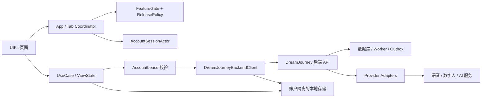
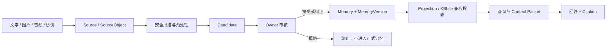
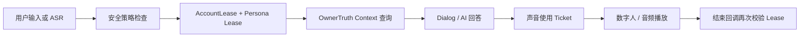

# DreamJourney 当前代码解析与版本差异说明

> 文档日期：2026-08-10
> 当前分支：`feature/prd-stitch-ui-adaptation`
> 当前版本：`278eda2b3d27c40165ee9879704f50c0e409f9a0`
> 对比基线：`f84e86b33949120623bddc6dadbad626892fd10b`
> 对比区间：2026-07-16 至 2026-08-10

## 1. 文档目的

本文档基于当前本地 iOS 工程代码，对以下内容进行解析：

1. 当前客户端的总体技术结构和主要运行链路；
2. 账户、记忆、家庭、回响、声音复刻、数字人、发布与访客等核心模块的实际代码状态；
3. 哪些能力已经形成正式代码链路，哪些仍受 Closed Pilot、服务端策略或 QA 门禁控制；
4. 当前版本相较上一版本的模块级和行为级差异；
5. 当前实现的工程风险、未验证项和后续演进建议。

本文档只分析当前仓库中可见的 iOS 客户端、客户端契约、测试代码和文档。仓库中没有完整后端服务实现，因此无法仅凭本仓库证明数据库、Worker、Provider Adapter 或生产部署已真实上线。

## 2. 版本与验证口径

### 2.1 当前版本

- 分支：`feature/prd-stitch-ui-adaptation`
- HEAD：`278eda2b`
- 最新提交：`docs(v4): record functional code closure and deployed gates`
- 最新提交时间：2026-08-10 00:01:06 +08:00

### 2.2 上一版本基线

- 基线提交：`f84e86b`
- 基线提交：`docs: add 2026-07-16 V4 regulatory artifacts`
- 基线时间：2026-07-16 15:35:32 +08:00

本文中的“上一版本”均指 `f84e86b`，而不是当前 HEAD 的前一个单独提交。

### 2.3 编译验证

本次执行的验证为：

```bash
xcodebuild \
  -workspace DreamJourney.xcworkspace \
  -scheme DreamJourney \
  -configuration Debug \
  -sdk iphonesimulator \
  -destination 'generic/platform=iOS Simulator' \
  -derivedDataPath /private/tmp/DreamJourneyDerivedData-20260810 \
  CODE_SIGNING_ALLOWED=NO \
  -quiet build
```

结果：

- 编译成功，退出码为 `0`；
- 生成 `Debug-iphonesimulator/DreamJourney.app`；
- 未安装或启动 App；
- 未进行真机测试；
- 未执行 XCTest 或 UIQA 场景。

首次编译发现 `Podfile.lock` 与本地 Pods Manifest 不同步，执行 `pod install` 后恢复。编译仍存在第三方 SDK 头文件、Kingfisher Swift 6 兼容性、`UIButton.contentEdgeInsets` 弃用和一处未使用 `self` 等警告，但没有业务代码编译错误。

## 3. 当前工程总体结构

### 3.1 技术形态

当前 iOS 工程仍以 UIKit 为主，采用以下混合结构：

- Coordinator 负责根路由和 Tab 组合；
- ViewController 仍承载较多页面状态与交互；
- OwnerTruth 新链路引入了较明确的 Contract、Client Protocol、UseCase 和 ViewState；
- 网络统一经 `DreamJourneyBackendClient`；
- 账户并发状态使用 Swift Actor；
- 共享运行状态同时使用 Actor、`NSLock`、串行队列和回调闭包；
- 本地状态使用文件系统、UserDefaults 和 Keychain；
- 第三方依赖通过 CocoaPods 集成；
- 核心纯 Swift 契约另增加 Swift Package，用于脱离 iOS Provider SDK 的测试。

当前结构不是纯 MVVM、纯 Clean Architecture 或纯 Coordinator，而是旧 UIKit 业务代码与 V4 契约化代码并存的过渡架构。

### 3.2 总体调用关系



### 3.3 客户端主要代码层次

| 层次 | 主要职责 | 代表代码 |
|---|---|---|
| App Composition | 启动、根路由、登录/主界面切换、通知路由 | `AppCoordinator.swift`、`TabCoordinator.swift`、`SceneDelegate.swift` |
| Session / Authority | 登录会话、刷新、防旧回调、账户切换与注销 | `AccountSessionActor.swift`、`AccountLease.swift` |
| Feature / Release | 本地门禁、服务端发布策略、恢复模式 | `FeatureFlagService.swift`、`ReleasePolicyStore.swift` |
| Domain / UseCase | Owner 记忆来源、候选、确认、激活、查询 | `OwnerTruthContracts.swift` |
| UI Modules | 记忆档案、回响、家庭、个人中心 | `Modules/Archive`、`Modules/Echo`、`Modules/Family`、`Modules/Profile` |
| Services | 网络、存储、知识同步、数字人、声音复刻 | `DreamJourneyBackendClient.swift`、`Services/*` |
| Tests / QA | XCTest、Swift Package 核心测试、UIQA Smoke | `DreamJourneyTests`、`Package.swift`、Debug/UIQA 代码 |

## 4. App 启动与账户边界

### 4.1 根路由

`AppCoordinator` 当前维护四种根状态：

- `unresolved`：尚未完成会话判断；
- `validating`：已有缓存凭据，但必须在线确认；
- `auth`：进入登录页面；
- `main`：进入三 Tab 主界面。

启动时会先准备进程级组合，读取恢复策略的 `authorityEpoch`，再由 `AccountSessionActor` 判断是否允许进入私有 UI。

代码参考：

- [`AppCoordinator.swift`](../DreamJourney/Sources/App/AppCoordinator.swift#L3)
- [`AccountSessionActor.swift`](../DreamJourney/Sources/App/AccountSessionActor.swift#L137)

### 4.2 AccountSessionActor

本次版本新增了正式的账户状态机。主要状态包括：

- signed out；
- activating；
- active；
- switching；
- suspended；
- deleting。

关键行为：

1. 冷启动时不再因为本地存在用户资料就直接进入私有页面；
2. 正式凭据需要在线验证；
3. 测试凭据只能在明确的 test-only 信任状态下使用；
4. Refresh Token 通过 Token Family、Session Version 和 CAS 规则更新；
5. 账户切换、注销、凭据失效都会推进 Generation，使旧任务失效；
6. 状态迁移会产生可持久化的 Transition Receipt。

### 4.3 Account Lease

`AccountLease` 是当前客户端防止跨账户污染的核心机制。一个 Lease 至少绑定：

- `subjectId`：当前登录主体；
- `vaultId`：当前私人资料库；
- `sessionId`；
- `generation`；
- `generationId`；
- `authorityEpoch`。

异步操作在 request、commit、UI、runtime 等检查点重新验证 Lease。以下任一条件变化都会拒绝旧结果：

- 登录主体变化；
- Vault 变化；
- Account Generation 变化；
- Generation ID 变化；
- Authority Epoch 变化。

这意味着用户 A 发起的网络请求，即使在用户切换到 B 后才返回，也不能继续写入 B 的本地状态或 UI。

代码参考：[`AccountLease.swift`](../DreamJourney/Sources/App/AccountLease.swift#L149)

### 4.4 账户生命周期清理

账户切换、退出和注销不再只调用一个全局 `logout()`。`AccountLifecycleCoordinator` 会按模块执行：

- 停止运行时效果；
- 清理本地私有数据；
- 清理通知与延迟回复；
- 清理声音复刻状态；
- 清理媒体、会话和缓存；
- 记录每个模块的完成、跳过、挂起或失败回执。

该设计支持“先撤销访问，再异步完成外部清理”。即使供应商数据仍处于清理中，也可以先让账户无法继续访问。

## 5. Feature Gate 与运行门禁

### 5.1 默认开放能力

当前代码中的默认本地启用集合只有：

- Echo 文字输入；
- 个人设置；
- 法律中心；
- 账号注销入口。

代码参考：[`FeatureFlagService.swift`](../DreamJourney/Sources/App/FeatureFlagService.swift#L697)

### 5.2 非持久化或策略控制能力

以下能力不会因为本地 UserDefaults 留存而永久开启：

- OwnerTruth 文字与媒体录入；
- 候选记忆审核；
- 引导访谈、人生地图、记忆检索；
- 家人管理、家庭空间与家庭贡献；
- 数据导出；
- 声音复刻与数字人；
- Publication、Grant、Visitor；
- 音频/视频上传、远端拉取及分析。

这些能力需要满足以下一种或多种条件：

- Debug/UIQA 启动参数；
- 服务端 Release Policy；
- Closed Pilot Cohort；
- 风险等级与 Provider Readiness；
- 当前账户和角色权限。

因此“代码已编译进 App”不等于“普通用户当前可见或可用”。

### 5.3 恢复模式

客户端能够读取后端恢复运行策略：

- normal；
- readOnly；
- signedOut；
- maintenance。

策略无效时默认进入 fail-closed 状态；只允许健康检查等基础设施请求。只读恢复期允许 GET/HEAD/OPTIONS，但拒绝写操作。

代码参考：[`ReleasePolicyStore.swift`](../DreamJourney/Sources/Services/ReleasePolicyStore.swift#L24)

## 6. OwnerTruth 记忆确权链路

### 6.1 核心定位

当前 V4 记忆链路不再把一次对话或一段文字直接写成“事实记忆”。系统区分：

- Source：用户提供的原始文字、图片、音频或视频；
- Candidate：由后端从 Source 中提取、尚未确认的候选记忆；
- Decision Receipt：Owner 对候选内容接受、纠正、拒绝的回执；
- Memory：稳定的记忆逻辑对象；
- MemoryVersion：某一时刻不可变的记忆版本；
- Projection：为查询、展示或发布构建的派生读取结构；
- Citation：回答所引用的来源和版本证明。

### 6.2 主链路



代码要求：

- 接受或纠正必须产生 MemoryVersion；
- 拒绝或失效不得产生 MemoryVersion；
- Candidate 使用显式版本号，避免旧页面覆盖新审核状态；
- 命令使用 `commandId` 支持幂等；
- 返回结构要求候选 ID、内容 Hash、MemoryVersion ID 等保持一致；
- 非法或缺字段响应按 fail-closed 处理。

代码参考：

- [`OwnerTruthContracts.swift`](../DreamJourney/Sources/Domain/OwnerTruth/OwnerTruthContracts.swift#L475)
- [`OwnerTruthContracts.swift`](../DreamJourney/Sources/Domain/OwnerTruth/OwnerTruthContracts.swift#L924)
- [`OwnerTruthContracts.swift`](../DreamJourney/Sources/Domain/OwnerTruth/OwnerTruthContracts.swift#L999)

### 6.3 文字来源

文字录入已经从纯本地档案写入扩展为 typed source capture：

1. 客户端读取当前 Vault 的文字录入状态；
2. 发送带命令 ID 的文字 Source；
3. 后端返回 Source Receipt；
4. 后端异步进行候选提取；
5. 客户端进入候选审核流程。

代码参考：[`OwnerTruthContracts.swift`](../DreamJourney/Sources/Domain/OwnerTruth/OwnerTruthContracts.swift#L1120)

### 6.4 媒体来源

图片、音频和视频使用两阶段流程：

1. 请求 Upload Intent；
2. 使用短期 Upload Token 上传对象；
3. 查询 SourceObject 状态；
4. 等待安全扫描和处理；
5. 产生派生 Source 或失败状态；
6. 支持删除请求和删除回执；
7. 本地持久化任务可在 App 重启后恢复。

状态模型覆盖：

- 上传意图；
- 对象可访问状态；
- 安全扫描状态；
- 处理状态；
- 可重试性；
- 删除状态；
- 外部处理是否允许。

### 6.5 引导访谈

当前代码新增了完整的访谈契约和大量受门禁控制的 UI：

- 自然语言开始访谈；
- 继续输入；
- 结束访谈；
- 跳过一次；
- 冷却某个主题；
- 不再询问某类问题；
- 恢复冷却或恢复“不再询问”；
- 主题切换；
- 深挖和总结阶段反馈；
- 待审核批次；
- 候选提案 Admission；
- Candidate Review；
- Candidate Confirmation；
- 正式 Memory Activation；
- Projection Recovery。

该链路体现了“对话不是记忆，经过 Owner 确认后才成为正式记忆”的产品边界。

### 6.6 六个知识维度

当前代码将记忆覆盖度划分为六个稳定维度：

| 维度 | 主要 Facet |
|---|---|
| lifeStage | 时间背景、经历 |
| importantPeople | 人物、关系变化 |
| keyDecisions | 选择、原因、结果 |
| professionalExperience | 实践、判断 |
| values | 优先级、反思 |
| aspirationsAndBoundaries | 愿望、边界 |

推荐计划只把覆盖计数、缺失 Facet、原因代码等最小化信息传给 iOS，不在页面状态中保存完整 MemoryVersion ID、Source ID 或问题模板 ID。

代码参考：[`OwnerTruthContracts.swift`](../DreamJourney/Sources/Domain/OwnerTruth/OwnerTruthContracts.swift#L8287)

### 6.7 人生地图与记忆检索

当前版本增加：

- 人生地图：按六个维度显示已确认证据、覆盖 Facet、未填 Facet 和关联故事数；
- 记忆检索：按服务端排序后的记忆结果展示；
- 访谈总结：展示本次访谈形成的结果，但不直接等同于已确认正式记忆；
- MemoryVersion 历史：展示 current/superseded 版本；
- Correction：用户可以对已有记忆提交纠正请求，再进入新的候选确认流程。

这些入口在 `MemoryArchiveViewController` 中存在，但仍受产品模式和 Release Policy 控制。

## 7. 记忆档案页面

### 7.1 当前页面职责

记忆档案模块目前同时承载：

- 我的自传 / 家人的故事；
- 本地文字、图片、音频等素材；
- OwnerTruth 文字和媒体来源；
- 待确认 Candidate；
- Memory Activation Inbox；
- 访谈入口；
- 引导问题；
- 人生地图；
- 记忆检索；
- 访谈总结；
- 多种 UIQA 场景。

这使其已经从单纯的“档案列表页”演变为 Owner 私人记忆工作台。

### 7.2 当前风险

`MemoryArchiveViewController.swift` 当前约 17,160 行，页面、UseCase 组合、测试夹具和 UIQA 场景集中在同一文件。虽然大量 QA 代码有编译条件或门禁，但仍会提高：

- 阅读成本；
- 修改冲突概率；
- 页面生命周期复杂度；
- 单元测试隔离难度；
- 编译与增量构建成本。

建议后续按“主页面、来源录入、候选审核、访谈、人生地图、搜索、QA Fixtures”拆分。

## 8. Echo 回响链路

### 8.1 当前运行流程



### 8.2 上下文隔离

当前 Echo 不再只根据一个全局“当前家人 ID”拼接上下文，而是绑定：

- 登录 Subject；
- Vault；
- 当前 Persona Owner；
- Persona Scope；
- Account Generation；
- Authority Epoch；
- 请求 Correlation ID。

上下文查询、AI 回答、TTS、数字人开始/结束回调都需要检查绑定是否仍然有效。切换家人、切换账户、撤销授权或刷新权限后，旧回答不得继续播放。

### 8.3 Context 与 Citation

当前代码增加 OwnerTruth Context Shadow 和 Citation 模型，用于对比旧 KBLite 上下文与 V4 排序结果。上下文包含：

- 引用的 Source；
- MemoryVersion；
- 排名信息；
- 权限当前性；
- 构建版本；
- 请求与回答关联。

该设计的目标是让回答能够说明“依据哪条已确认记忆”，并在记忆被纠正、删除或撤权后判定旧 Citation 失效。

### 8.4 安全策略

`EchoSafetyPolicy` 增加：

- 高度痛苦；
- 自伤；
- 伤害他人；
- 想追随逝者离世；
- 走失或即时危险。

命中危机模式后：

- 切换为中性安全回应；
- 禁止 Persona 模拟；
- 禁止私人 Context；
- 禁止延迟回复；
- 禁止克隆声音；
- 禁止数字人；
- 禁止 Provider Effects。

页面还要求持续显示“AI 助手生成，非真人本人”。

代码参考：[`EchoSafetyPolicy.swift`](../DreamJourney/Sources/Modules/Echo/EchoSafetyPolicy.swift#L3)

## 9. 声音复刻与数字人

### 9.1 移动端密钥边界变化

当前版本已经从客户端配置中删除：

- DeepSeek API Key；
- DreamJourney Backend 静态 API Token；
- Voice Clone API Key；
- 火山引擎 App ID、App Key、App Token；
- 固定 Virtualman Key。

`VoiceSDK.example.xcconfig` 明确要求不再向移动端注入 Provider 长期凭据。实时语音或数字人需要后端提供可撤销、短期、作用域受限的会话能力。

### 9.2 声音 Profile

声音复刻当前具有以下状态：

- 样本授权；
- 上传与训练；
- 训练状态查询；
- 质量试听；
- 用户接受质量；
- 启用、禁用与删除；
- 外部供应商清理回执；
- 重试 Generation；
- Provider Readiness。

### 9.3 Owner-only 合成 Ticket

个人音色的每次使用都会生成绑定 Owner、Profile 版本、授权状态和 Account Lease 的使用 Ticket。开始合成和异步回调时都重新验证。

当前正式路径明显偏向 Owner 本人音色：

- Memoir 播放只允许使用作者自己的个人 Profile；
- Echo 的个人音色 Ticket 要求当前登录用户就是 Profile Owner；
- 家人 Profile 可以展示状态，但不应被个人音色回退逻辑误用；
- 家人音色或逝者模拟仍受更严格的授权、角色及 Release Policy 门禁。

代码参考：[`VoiceCloneService.swift`](../DreamJourney/Sources/Memoir/VoiceCloneService.swift#L1136)

### 9.4 合成人物资格

当前本地安全策略要求声音复刻与数字人对象满足：

- 对象状态为 living；
- 已验证成年人；
- 活体通过；
- 本人就是行为主体；
- 用途授权通过。

逝者、未成年人、身份未知、活体未知或用途授权未知均默认拒绝 Provider Effects。因此，当前代码虽然保留家人和星辰模式页面，但“逝者声音/数字人真实训练”不属于默认可用能力。

## 10. 家庭与 Persona

### 10.1 已有能力

上一版本已经具备：

- 家人邀请；
- 本人/家人 Persona 切换；
- 星辰模式开关；
- 家人详情；
- 家人音色状态展示。

### 10.2 当前新增能力

当前版本增加 Family Contribution：

- 家庭成员提交文字记忆；
- 家庭成员提交图片材料；
- Owner 为某位家人授予或撤销贡献权限；
- 查看贡献提交状态；
- 将完成处理的贡献交接到 Candidate Review；
- 贡献不会直接成为正式 Memory。

### 10.3 权限边界

家庭成员不是 Vault Owner。Family Contribution 只能创建候选来源，最终是否接受、纠正或拒绝仍由 Owner 权限链路决定。

Persona 切换只改变当前交互对象，不应自动获得对该人物所有私人资料的读取权。读取权由 Family Grant、Persona Authorization 和当前 Authority Epoch 共同决定。

## 11. Publication 与 Visitor

### 11.1 三域分离

当前代码开始实现：

1. 私人域：Source、Candidate、Memory、MemoryVersion；
2. 发布域：经过脱敏、确认和版本化的 PublicationVersion；
3. Visitor 域：通过 Grant 和 Visitor Session 读取发布副本。

Visitor 不直接查询私人 Memory，也不会拿到私人 Source ID 或内部 MemoryVersion ID。

### 11.2 Publication Management

Owner 管理面包括：

- 查看 Publication；
- 查看 PublicationVersion；
- 查看 Projection 状态；
- 查看 Grant；
- 检查二次确认要求；
- 检查第三方审查要求；
- 检查 AI 披露要求；
- Withdraw Publication；
- 撤销 Grant 和 Visitor Session。

### 11.3 Visitor Session

Visitor 邀请包含：

- `grantId`；
- 一次性或短期 `grantCredential`；
- Admission 后生成的 Visitor Session；
- 有效期；
- 剩余次数；
- Publication 和 PublicationVersion 绑定。

Grant Credential 和 Visitor Session Credential 只保存在进程内存，不编码、不写日志、不写本地持久化。

### 11.4 Visitor 回答边界

Visitor Projection 响应必须声明：

- 必须显示 AI 身份披露；
- `privateContextAllowed == false`；
- `providerCallAllowed == false`；
- 无证据时必须返回 unknown fallback。

当前 M2 Visitor 代码仍明确标记为 QA/Closed Pilot 边界，并不是普通用户默认开放入口。

代码参考：[`PublicationVisitorAccess.swift`](../DreamJourney/Sources/Services/PublicationVisitorAccess.swift#L3)

## 12. 数据导出、注销与清理

### 12.1 数据导出

“我的”页面新增完整异步导出流程：

1. 创建 Export Job；
2. 查询 Job 状态；
3. Pending 状态轮询；
4. 失败或过期时重试；
5. 获取一次性 Download Credential；
6. 下载导出包；
7. 写入临时文件；
8. 调用系统分享；
9. 分享结束后删除临时文件。

所有异步阶段都会重新验证 Account Lease。

### 12.2 账号注销

账号注销采用 access-first：

- 后端先接受注销并撤销访问；
- 客户端立即退出私有会话；
- 各本地模块执行清理；
- 外部供应商可以异步清理；
- 清理未完成时记录 Pending/Partial，而不是错误宣称“已彻底删除”。

代码参考：[`ProfileViewController.swift`](../DreamJourney/Sources/Modules/Profile/ProfileViewController.swift#L1618)

## 13. 本地存储隔离

当前版本新增或改造了：

- ArchiveLocalStorage；
- ArchiveMediaStore；
- AccountPrivateMediaStore；
- ConversationLocalStorage；
- Memoir 存储；
- MemoryRepository；
- Widget Snapshot；
- Voice Clone 本地状态；
- In-App Message；
- Delayed Reply。

新的本地存储 Scope 通常至少包含：

- subjectId；
- vaultId；
- ownerId；
- personaScope；
- generation；
- generationId。

旧数据如果无法证明 Owner 或 Vault，会进入 quarantine，而不是默认归属当前用户。账户注销和切换时按 Scope 清理。

## 14. Backend Client 与网络边界

### 14.1 当前职责

`DreamJourneyBackendClient` 当前约 12,207 行，同时承担：

- URLRequest 构建；
- Auth Session 选择；
- Token Refresh；
- Account Lease 检查；
- Recovery Policy 检查；
- Release Policy 请求；
- OwnerTruth 全部 Typed Client；
- Family、Voice、Digital Human、Publication、Visitor、Data Rights API；
- JSON 契约转换；
- 错误分类；
- Provider 操作回执解析。

### 14.2 请求防护

每个受保护请求会结合：

- Endpoint Auth Policy；
- Backend Account Lease；
- App Account Lease；
- Release Policy Headers；
- Recovery Runtime Decision；
- Token Family Refresh；
- 响应 Commit 前的 Lease 再验证。

### 14.3 当前风险

客户端网络层已经成为超大聚合类。短期便于统一加安全门禁，长期存在：

- 模块互相影响；
- 修改冲突严重；
- Mock 粒度过粗；
- 编译时间增加；
- 错误映射难以独立演进。

建议按 Auth、OwnerTruth、Family、Voice、Publication、DataRights 拆分具体 Client，并保留共享 Transport。

## 15. 测试与 QA 结构

### 15.1 新增 XCTest

当前版本新增：

- AccountLeaseRuntimeTests；
- AudioOwnerLeaseModelTests；
- OwnerTruthContractsTests；
- OwnerTruthCoreContractTests；
- PublicationManagementAccessTests；
- PublicationVisitorAccessTests；
- TestDoubles。

这些文件中约有 309 个 `test...` 方法，主要覆盖契约解析、状态机、账户隔离、错误响应和 fail-closed 行为。

### 15.2 Swift Package

新增 `Package.swift`，把不依赖 UIKit 和 Provider 二进制的核心源文件组成 `DreamJourneyCore`，用于 macOS/CI 上执行纯契约测试。

### 15.3 UIQA

工程中存在大量 Debug/UIQA 场景，通过启动参数进入并输出 JSON 结果。多数 UIQA 代码有：

- `#if DEBUG`；
- `#if UI_QA_SIMULATOR`；
- QA Launch Argument；
- 默认隐藏页面入口。

这能提供较强的自动化证据，但目前 QA Fixtures 仍大量分布在 AppDelegate、ViewController 和业务文件中，建议后续迁移到独立测试 Target 或 QA Support 模块。

## 16. 当前功能状态矩阵

| 能力 | 代码状态 | 默认用户状态 | 说明 |
|---|---|---|---|
| Echo 文字输入 | 已接入 | 默认开启 | 仍依赖后端可用性 |
| Profile Settings | 已接入 | 默认开启 | 正常个人设置 |
| Legal Center | 已接入 | 默认开启 | 法律与披露入口 |
| Account Deletion | 已接入 | 默认显示 | 真正执行依赖后端 |
| Owner 文字来源 | 已有正式契约 | 策略控制 | Closed Pilot / Release Policy |
| Owner 媒体来源 | 已有正式契约 | 策略控制 | 依赖对象存储与扫描能力 |
| Candidate Review | 已有正式契约和 UI | 策略控制 | 不是普通档案直接写入 |
| 引导访谈 | 已有完整契约和部分产品 UI | 策略控制 | 大量 QA 路径 |
| 人生地图/记忆搜索 | 已有读取模型和 UI | 策略控制 | 服务端 Projection 必须 ready |
| Family Management | 已有 UI 与授权 | 策略控制 | 上一版本已有基础能力 |
| Family Contribution | 新增 | 策略控制 | 只能进入候选流程 |
| Voice Clone | 已有完整生命周期 | Provider 门禁 | 正式路径偏 Owner 本人 |
| Digital Human | 已有腾讯 Runtime | Provider 门禁 | 需要后端会话 Broker |
| Publication Management | 新增 M2 | 默认关闭 | QA/Closed Pilot |
| Visitor | 新增 M2 | 默认关闭 | 只能读取发布副本 |
| Data Export | 新增异步 Job | 策略控制 | 需要后端导出 Worker |

## 17. 与上一版本的规模差异

### 17.1 仓库总体变化

`f84e86b..278eda2b`：

- 1,876 个文件变化；
- 247,405 行新增；
- 10,662 行删除。

其中包含大量文档、状态记录、QA 证据和任务产物，不能直接等同于产品代码增长。

### 17.2 App、测试和依赖变化

限制到 `DreamJourney`、`DreamJourneyTests`、`Package.swift`、`Podfile` 和 `Podfile.lock`：

- 100 个文件变化；
- 102,033 行新增；
- 7,110 行删除。

代码增量仍然很大，原因包括 OwnerTruth 契约、UIQA 场景和测试夹具被直接纳入工程。

## 18. 与上一版本的模块级差异

| 模块 | 上一版本 `f84e86b` | 当前版本 `278eda2b` | 差异性质 |
|---|---|---|---|
| App 启动 | 主要根据 `UserManager` 本地状态路由 | AccountSessionActor 在线验证后才进入私有 UI | 架构加固 |
| 账户并发 | 缺少统一 Generation/Lease | 增加 Account Lease、Authority Epoch 和旧回调拦截 | 全新增量 |
| Token 刷新 | 普通 Session 刷新 | Token Family + Session Version + CAS | 安全加固 |
| 注销/切换 | 全局清理为主 | 分模块生命周期协调与回执 | 全新增量 |
| 本地存储 | 多处全局或 User ID 范围 | Subject/Vault/Persona/Generation 隔离和 quarantine | 架构重构 |
| 记忆档案 | 自传与本地素材管理 | Source、Candidate、Review、MemoryVersion、Recovery | 核心新增 |
| 文字录入 | 本地档案文字 | Typed OwnerTruth Source Capture | 行为改变 |
| 媒体录入 | 本地媒体/旧上传链路 | Upload Intent、扫描、处理、删除、恢复 | 核心新增 |
| 引导访谈 | 无 OwnerTruth 访谈代码 | 自然输入、节奏、边界、候选提案、总结 | 核心新增 |
| 记忆维度 | 无正式维度契约 | 六维覆盖与缺口推荐 | 核心新增 |
| 人生地图 | 旧图谱/档案展示 | 基于已确认 Memory Projection 的人生地图 | 行为改变 |
| 记忆搜索 | 旧本地或 KBLite 能力 | 服务端排序、权限和 Citation 当前性 | 架构加固 |
| KBLite | 主要知识读取来源 | 作为兼容投影和 Shadow Compare | 定位变化 |
| Echo | 已有数字人、声音和 Persona | 增加账户/权限/请求关联和危机安全门禁 | 已有能力加固 |
| 数字人 | 已有腾讯数字人 Runtime | 后端 Broker、Readiness、Lease、回调 Fence | 已有能力加固 |
| 声音复刻 | 已有训练与合成 | Owner/Profile/Consent Ticket、质量接受、清理回执 | 已有能力重构 |
| 家人切换 | 已存在 | 增加授权当前性、Family Contribution | 增量扩展 |
| 星辰模式 | 已存在 | 叠加合成人物资格与 Provider 门禁 | 安全加固 |
| Publication | 不存在 | Publication/Version/Projection/Withdraw 管理 | 全新增量 |
| Visitor | 不存在 | Grant、Admission、Session、只读 Projection | 全新增量 |
| 数据导出 | 无产品入口 | 异步 Job、一次性凭据、下载和重试 | 全新增量 |
| 数据删除 | 有注销交互 | access-first、外部清理状态、生命周期回执 | 行为重构 |
| 移动端密钥 | Info.plist/xcconfig 保留多种 Provider 配置 | 删除长期 Provider Key 和固定 Virtualman Key | 重要安全修复 |
| 测试 | 以 UIQA 和工程测试为主 | 增加核心 Swift Package 与 7 个测试文件 | 工程增强 |

## 19. 与上一版本的关键行为差异

### 19.1 从“本地有用户”变为“后端验证后才能访问”

上一版本能够大量依赖 `UserManager.currentUser`。当前版本要求正式 Backend Session、Vault 和 AccountSessionActor 状态一致，无法验证时回到登录或暂停私有访问。

### 19.2 从“对话直接沉淀”变为“候选记忆确权”

上一版本没有 OwnerTruth Candidate 流程。当前版本要求：

```text
对话/素材 -> Source -> Candidate -> Owner 接受/纠正 -> MemoryVersion
```

未经确认的 AI 提取内容不能直接成为事实权威。

### 19.3 从“当前角色 ID”变为“账户 + Vault + Persona + 权限版本”

当前 Persona 不再仅由页面选择决定。每次读取和 Provider Effect 都需要绑定账户、Vault、Owner、Scope 和 Authority Epoch。

### 19.4 从“直接使用 Provider 配置”变为“后端能力 Broker”

固定 DeepSeek、火山、Voice Clone、Backend Token 和 Virtualman Key 已从客户端配置移除。客户端只能使用后端发放的短期能力和状态回执。

### 19.5 从“家人资料直接共享”变为“贡献、确权、发布、授权”

当前代码区分：

- 家庭成员提交素材；
- Owner 决定是否进入正式记忆；
- Owner 主动生成发布副本；
- Visitor 通过 Grant 查询发布副本。

Family 和 Visitor 都不能默认读取 Owner 私人域。

### 19.6 从“注销即完成”变为“撤权优先、清理可追踪”

账号注销先撤销访问，再显示内部和供应商清理进度。外部资源没有完成删除时只能显示 Pending/Partial。

## 20. 代码规模与维护风险

当前五个热点文件合计约 64,091 行：

| 文件 | 当前行数 |
|---|---:|
| `AppDelegate.swift` | 6,522 |
| `OwnerTruthContracts.swift` | 17,073 |
| `MemoryArchiveViewController.swift` | 17,160 |
| `EchoViewController.swift` | 11,129 |
| `DreamJourneyBackendClient.swift` | 12,207 |

主要风险：

1. Domain Contract、UseCase、ViewState 集中在单文件，定位和复用困难；
2. ViewController 同时承担视图、请求编排、测试 Fixture 和 QA 导出；
3. AppDelegate 仍包含大量 UIQA 启动桥接；
4. BackendClient 聚合所有业务 API；
5. Actor、NSLock、DispatchQueue 和闭包混用，线程边界复杂；
6. 编译通过不代表服务端契约真实部署；
7. 大量新能力默认关闭，普通用户路径尚需单独验收；
8. 第三方 SDK 已出现 Swift 6 和 Module Header 警告。

## 21. 建议的下一步拆分

建议保持现有行为不变，按以下顺序做结构拆分：

1. 将 `DreamJourneyBackendClient` 拆为共享 Transport 和领域 Client；
2. 将 `OwnerTruthContracts` 拆为 Source、Candidate、Interview、Projection、Correction；
3. 将记忆档案页拆为多个 Feature Controller；
4. 将 Echo 的 Context、Voice、Digital Human、Safety 编排提取为独立 Coordinator；
5. 将 UIQA Fixtures 移到独立 Support/Tests Target；
6. 统一异步模型，优先使用 async/await 和 Actor；
7. 为 Closed Pilot 建立一份“普通用户真实可见路径”自动化验收；
8. 单独对服务端实际部署、数据库和 Worker 做联调证据核验。

## 22. 当前结论

当前版本已经不再只是 UI 原型。代码层面已经建立了 V4 的多条关键边界：

- 强账户隔离；
- Owner 记忆确权；
- 候选记忆审核与版本化；
- 家庭贡献但不直接写入；
- 发布副本与 Visitor 隔离；
- Provider 密钥后移；
- 声音和数字人使用门禁；
- 数据导出与删除回执；
- Release Policy 与恢复模式；
- 较大规模的契约测试和 UIQA 证据。

但当前版本仍处于“代码闭环和受控试点能力并存”的阶段。编译成功只能证明客户端源码和依赖能够生成 App，不代表：

- 所有后端 API 已部署；
- 所有 Worker 正常运行；
- 所有 Provider 配额可用；
- Closed Pilot 策略已经下发；
- 真机权限、音频和数字人链路已通过；
- Publication/Visitor 已面向普通用户开放。

后续评审应分别维护“代码存在”“策略开放”“后端就绪”“Provider 就绪”“真机验收”五种状态，避免用单一的“已完成”覆盖不同层级。

## 23. 本次工作区说明

执行 `pod install` 后，`DreamJourney.xcodeproj/project.pbxproj` 出现 6 行删除、6 行新增的对象排序变化。新增和删除内容相同，仅位置调整，没有业务语义变化。该变化未提交。
