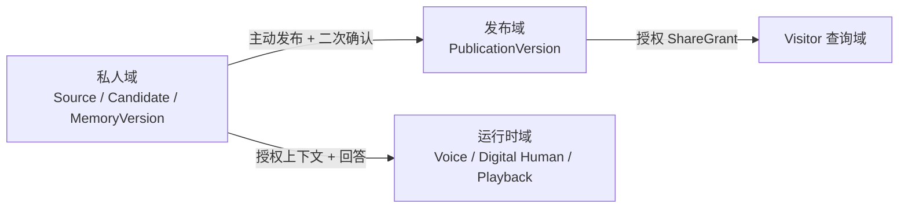
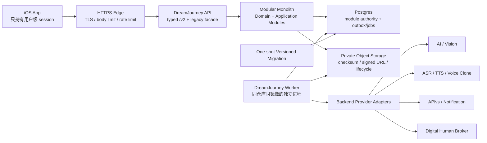
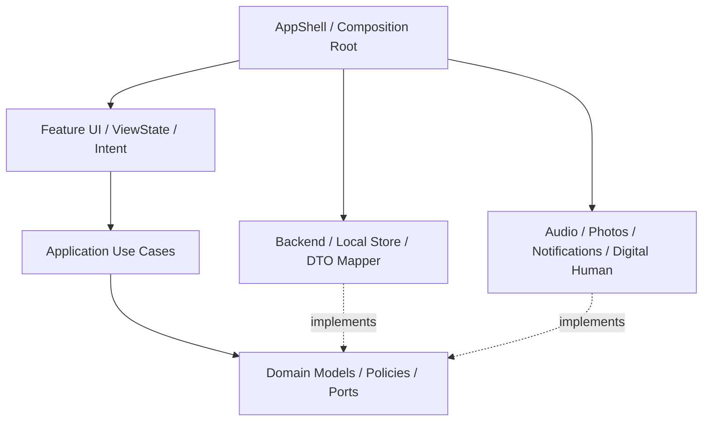
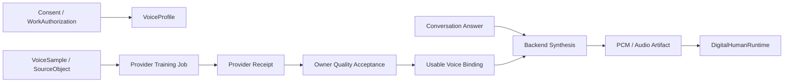
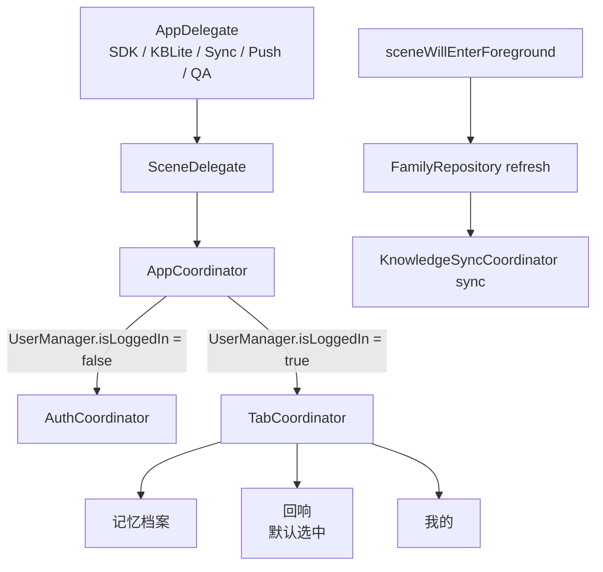
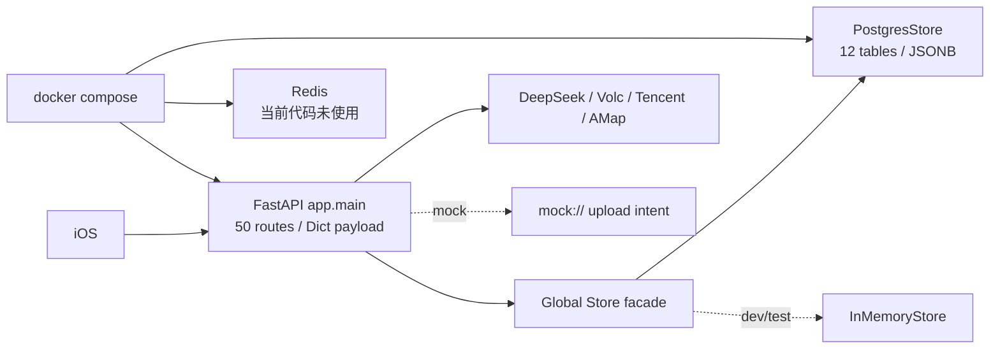
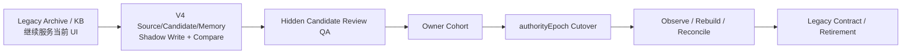

# DreamJourney V4 方案架构详读

> 基于 `DreamJourney_V4_成果物_2026-07-12` 与 2026-07-12 当前本地 iOS / Backend 代码的联合分析

- 工程分析日期：2026-07-12；产品口径同步：2026-07-15
- 文档目的：把 V4 产品定义、目标架构、当前实现与后续路线转换成一份可用于产品、架构、开发和验收的统一解读
- 成果物状态：`PRODUCT_DECISIONS_SYNCED_STATIC_CHECKED_IMPLEMENTATION_UNVERIFIED`
- 重要边界：本文说明“目标是什么、现在到了哪里、应该如何演进”，不把路线图误写成已完成实现

## 1. 阅读结论

### 1.1 一句话理解 V4

DreamJourney V4 的核心不是“把数字人做得更逼真”，而是建立一套由 Owner 掌控的私人记忆系统：原始材料有来源，AI 结果只是候选，用户确认后才成为当前记忆，之后的问答、声音、数字人和分享都只能消费这个可追溯的事实基线。

### 1.2 对当前工程的总判断

1. 当前 iOS 已经具备较完整的产品原型和运行时能力：三 Tab、记忆档案、回响对话、家人切换、音色复刻、腾讯数字人、KBLite 和大量 QA 证据链路都已存在。
2. 当前最大的缺口不在 UI，而在“数据权威”：尚未形成独立的 `Source -> Candidate -> Owner Decision -> MemoryVersion` 闭环。
3. KBLite 的 owner/persona 隔离、授权代次和回调防过期已经有不少好的工程控制，但它仍把 AI proposal 直接合并进 graph，因此更像“兼容型事实库”，而不是 V4 定义的可重建 Projection。
4. Echo 和数字人运行时的生命周期防护值得保留，但 `EchoViewController` 同时承担 UI、网络、业务策略、声音路由、Provider 会话和 QA，已成为必须渐进拆解的超大编排点。
5. Backend 的近期正确形态是“模块化单体 + Postgres + 同镜像 Worker + 私有对象存储”，不需要立即转微服务、Kafka 或专用向量数据库。
6. 2026-07-15 产品口径下采用三级验证：R3 Owner 文字核心是 Closed Pilot；Family、Publication/Visitor、Voice Clone 属于 Product MVP 的独立扩展能力；Digital Human 和非必要媒体是 Beta Extension，Care/TimeLetter 后置。扩展故障不得破坏 Owner 文字核心降级链，且各层分别过门。
7. V4 成果物是已评审的产品、架构与执行基线，不是已发布证明；115 个 Work Item 仍属计划项。

## 2. 分析基线与证据等级

### 2.1 本次实际查看的基线

| 对象 | V4 成果物审计基线 | 2026-07-12 本机实际基线 | 结论 |
| --- | --- | --- | --- |
| iOS | `feature/prd-stitch-ui-adaptation@8a1922b` | `feature/prd-stitch-ui-adaptation@938be69` | 本地在审计基线上 ahead 1；新增提交只调整“我的自传”入口图和布局，不改变架构判断 |
| Backend | `main@4c0538b` | `main@481869e` | **不是同一代码基线**；本机 Git 中不存在 `4c0538b` 对象 |
| V4 成果物 | `PRODUCT_DECISIONS_SYNCED_STATIC_CHECKED_IMPLEMENTATION_UNVERIFIED` | 文档包已同步产品回复并重生成 Trace/Registry | 可作后续设计与执行基线，不代表工程完成 |

### 2.1A 2026-07-15 产品口径覆盖

本文的源码观察仍锁定2026-07-12工程基线，不因文档同步而改写。涉及产品范围和排期时，以2026-07-15权威成果物为准：Closed Pilot先验证文字核心；Product MVP增加Family/人物切换、受控Publication/Visitor和Voice Clone；Digital Human为独立Beta Extension；当前采用Startup Lean Profile。任何“可选/未来”旧措辞只描述技术降级隔离，不表示这些Product MVP能力可被删除。

### 2.2 Backend 基线偏差必须单独管理

V4 文档审计的 Backend 是 58 条路由、18 张表、已具备 session / ownership shadow 等机制的后续版本。当前本机 Backend `481869e` 实际为：

- 50 条 FastAPI 业务路由；
- 12 张 startup DDL 表；
- `/auth/login` 不签发 access/refresh session；
- 没有 `/auth/refresh` 和 `/auth/logout`；
- 没有数字人 lease heartbeat/release 路由；
- 没有 V4 审计基线中的完整 route ownership/session/knowledge receipt 实现。

因此，本文对 Backend 始终分为两栏：

- **V4 已审计 Backend 事实**：来自成果物对 `4c0538b` 的证据审计；
- **本机 Backend 事实**：来自当前 `481869e` 的直接静态分析。

在进入实施前，应先把“开发分支、部署服务、V4 审计基线”对齐到同一可识别的 commit/build 标识，否则很容易将线上现象误归因为 iOS 问题。

### 2.3 本文的结论标签

| 标签 | 含义 |
| --- | --- |
| `CURRENT` | 可从当前本地代码或 V4 当前证据直接确认 |
| `TARGET` | V4 推荐目标，尚需实施和验收 |
| `GAP` | 当前实现与目标之间的明确差距 |
| `PRESERVE` | 已经有价值，应在迁移中保留的控制或抽象 |
| `RECOMMEND` | 结合当前代码得出的实施建议 |

## 3. V4 成果物到底是什么

V4 不是一份单纯 PRD，而是一个“产品定义 + 工程事实 + 决策治理 + 执行路线 + 验收门”的交付包。

| 成果物 | 作用 | 应该怎么用 |
| --- | --- | --- |
| 产品定义与目标架构 | 定义产品主线、权威模型、目标分层和迁移原则 | 作为产品和架构主规格 |
| 当前实现证据矩阵 | 分清 `IMPLEMENTED / PARTIAL / CONTRACT_ONLY / MISSING / MOCK_ONLY` | 防止把页面、接口壳或 mock 误当成产能 |
| 产品决策登记册 | 记录哪些决策已定、待定、需外部确认 | 作为变更控制与发布前决策入口 |
| 可执行开发路线 | 将架构拆成 13 Package、115 Work Item 和 G0-G4 门 | 作为任务分配、依赖和验收的主计划 |
| 评审与验收清单 | 定义什么证据才能说“完成” | 阻止只凭代码合并或本地编译关闭高风险项 |
| 追踪矩阵 / Registry | 建立 FR、DR、Finding、Risk、Package、WI 的双向关系 | 用于稽核漏项和阶段退化 |
| 独立复审与静态验收 | 验证成果物内部一致性 | 只证明文档基线可执行，不替代真实 Provider/真机/生产验收 |

最终静态验收仍明确标记：

- `implementationClaim=NONE`
- `gateEvidence=MISSING`
- Core / MVP Extension：`STOP`
- Migration：`NO_GO`
- 当前 selector：`PLAN_ASSIGN_OWNER:WI-S0-03-01`

这表示“设计和执行控制面已形成”，而不是“V4 已交付”。

## 4. 产品主线：Owner Truth Loop

### 4.1 产品定位

V4 的近期定位是：

> 一个私人记忆助手，帮用户收集原始材料、审阅 AI 整理结果、形成可追溯的记忆版本，并通过有来源的问答进行回顾和纠正。

近期它**不是**：

- 以数字人为产品主体的虚拟人平台；
- 默认面向访客的公开数字遗产系统；
- 把 AI 提取结果自动当成家庭事实的知识库；
- 家庭监护或心理医疗系统；
- 用声音复刻或数字人“表演成功”替代记忆数据权威。

### 4.2 核心价值链

```mermaid
flowchart LR
    Source["Source\n原始证据"] --> Processing["Processing\n派生处理"]
    Processing --> Candidate["Memory Candidate\nAI 候选"]
    Candidate --> Decision["Owner Decision\n确认/编辑/拒绝"]
    Decision --> Memory["Confirmed Memory\n当前可接受记忆"]
    Memory --> Version["Immutable MemoryVersion\n不可变版本"]
    Version --> Outbox["Outbox / Change Feed"]
    Outbox --> Projection["Projection / Search / KBLite\n可重建读模型"]
    Projection --> QA["Owner QA\n带 Citation 回答"]
    QA --> Correction["Correction Candidate\n纠正候选"]
    Correction --> Decision
```



这条链路的核心是“Owner 决策”：

- AI 可以提取、摘要、分类和建议；
- AI 不能越过 Candidate 直接把结果变成 Confirmed Memory；
- 纠正不是原地改写旧事实，而是生成新版本，并保留旧版本和 lineage；
- 问答结果必须能回到使用的 MemoryVersion / Source；
- Projection 丢失后可重建，不应丢失权威记忆。

### 4.3 “Canonical”的正确含义

V4 中的 canonical 不等于“客观世界的唯一真相”，而是：

> 在当前 Owner 、当前 Vault 和当前版本关系下，Owner 现在接受的记忆表达。

这个定义非常重要，因为家庭成员可能对同一件事有不同视角。系统应保留视角、来源和版本，而不是用 AI 把分歧压成一个“唯一事实”。

## 5. 领域边界与禁止反向流动

### 5.1 三个必须隔离的域



| 域 | 存放什么 | 是否事实权威 | 主要风险 |
| --- | --- | --- | --- |
| 私人域 | Source、Candidate、Decision、MemoryVersion、Owner Conversation | 是，但只在 Owner/Vault 范围内 | 跨账号、未审阅 AI 入库、删除不完整 |
| 发布域 | 经过副本化、脱敏和二次确认的 PublicationVersion | 是独立、不可变的分享快照 | 把私人 Projection 直接暴露给 Visitor |
| 运行时域 | ASR/TTS、数字人 session、PCM、播放状态、临时 trace | 否 | 把 provider/runtime 结果写回 Persona/Memory，长期凭据泄露 |

### 5.2 禁止的数据流

V4 明确禁止：

- Projection / KBLite 反向成为 Memory authority；
- Candidate 跳过 Owner Decision 直接发布；
- Visitor 直接查询私人 Projection；
- Assistant 自己说过的内容反馈成 Owner 事实；
- Provider 状态、声音样本或数字人运行时数据变成记忆；
- 家庭关系本身被当作访问授权；
- 运维或管理员代替 Owner 执行记忆确认。

## 6. 统一领域词典

| 概念 | 准确语义 | 不能被什么替代 |
| --- | --- | --- |
| `Source` | 不可变的原始证据记录，可引用文字或对象存储中的原件 | Archive 卡片、上传按钮、AI 摘要 |
| `ProcessingResult` | 对 Source 的派生处理，例如 ASR/OCR/图像分析 | Confirmed Memory |
| `MemoryCandidate` | 由 Source 或处理结果生成的 AI/系统建议 | 事实、Projection entity |
| `CandidateDecision` | Owner 对 Candidate 的确认、编辑确认或拒绝 receipt | UI 的一次点击日志 |
| `Memory` | 稳定的记忆 aggregate 身份 | 某一版文字 |
| `MemoryVersion` | Owner 接受的一次不可变表达 | 可被原地改写的 JSONB |
| `Projection` | 从 Memory event 生成的可重建读模型 | Memory authority |
| `PublicationVersion` | 主动发布的独立分享快照 | 对私人数据的实时视图 |
| `VoiceProfile` | 声音资产的逻辑档案、授权和 Provider binding | Persona、Memory、一个 speakerId 字符串 |
| `DigitalHumanRuntime` | 短生命周期的展示/音频驱动会话 | 数字人人格事实或长期数据 |
| `Receipt` | 记录命令、作业、Provider、删除或发布结果的可追踪证据 | 一行无 operationId 的成功文案 |

## 7. 角色、授权与数据权利

### 7.1 角色不等于权限

V4 区分：Owner、Visitor、Family Contributor、Data Subject、Operator、Admin 等角色。关键原则是：

- Owner 能管理自己 Vault 中的 Source、Candidate、Memory 和权利请求；
- Family Contributor 可提供材料，但不自动拥有 Owner 的查询或确认权；
- Visitor 只能访问指定 PublicationVersion；
- Operator/Admin 的内部访问必须有目的、时限、审批和审计，不能替 Owner 作出记忆决定；
- Family Relationship 是业务关系，不是 `AccessGrant`。

### 7.2 授权必须是正交多维的

| 维度 | 关键对象 | 回答的问题 |
| --- | --- | --- |
| 敏感性 | sensitivity / special category | 这份数据有多敏感？ |
| 处理依据 | ProcessingBasis / ConsentRecord | 系统为什么可以处理？是否已撤回？ |
| 访问权 | AccessGrant / delegated scope | 谁能在什么目的下访问哪部分？ |
| 发布状态 | Publication lifecycle | 是否经脱敏和二次确认向外发布？ |

还需要独立管理 `WorkAuthorization`、`DataRightsAuthorization`、`RetentionHold` 和 `ProviderCapability`。任意维度不明确时，默认 deny，不能使用“已是家人”或“页面已显示”作为授权证明。

### 7.3 删除是分层传播，不是单表 DELETE

目标状态模型：

```text
requested -> access_revoked -> purging -> completed
                                   |-> incomplete
                                   |-> hold
```

执行原则：

1. 先撤销访问，使用户不再看到或使用待删数据；
2. 再异步传播到业务表、Projection、对象存储、Provider、导出产物和备份保留策略；
3. 每一层返回独立 receipt；
4. 没有外部 Provider/对象/备份证据时，不能对用户声称“已彻底删除”。

## 8. 阶段范围与产品优先级

| 阶段 | 目标 | 关键输出 | 不应做的事 |
| --- | --- | --- | --- |
| Stage 0 | 安全止损与数据权威地基 | 强身份、owner 隔离、AccountLease、凭据止损、DB migration/UoW、release default-off、rights/delete、运维证据、危机安全 | 用更多 UI 或 Provider 演示遮盖基础安全问题 |
| Stage 1 | Owner Truth Loop | 文字 Source、Candidate Review、MemoryVersion、文字 QA + Citation、Correction、Export/Delete | 将声音/数字人/家庭公开能力设为核心依赖 |
| Stage 2 | 媒体摄入和处理质量 | 私有对象存储、媒体 Source、processor/job/outbox | 用 base64 JSONB 或 mock URL 声称真实上传完成 |
| MVP-P | 受控发布与 Visitor | PublicationVersion、ShareGrant、撤回/暂停、Visitor 只读边界 | Visitor 直读私人 Memory/Projection |
| Voice MVP / DH Beta | 分别验证授权、质量、供应商和运行时闭环 | VoiceProfile、样本/质量确认、后端合成、短期凭据、删除 receipt；DH独立放量 | 默认开放，或用默认音色冒充复刻音色 |
| Stage 4 | 认知增强和未来场景 | 语义冲突、实体关系、复杂家庭/关怀/时光信/数字遗产 | 在核心价值链未验证前扩大范围 |

V4 保留现有“记忆档案 / 回响 / 我的”三 Tab，因为目标是更换内部 authority 和依赖方向，不是再做一次大规模界面改版。

## 9. 目标系统架构

### 9.1 总体拓扑



### 9.2 为什么选模块化单体

当前业务的难点是跨域一致性、owner 授权、版本和删除传播，而不是已经被证明的超大流量。模块化单体允许：

- 在同一 Postgres 事务中写 aggregate + receipt + outbox；
- API 和 Worker 复用同一套 Domain/Application 逻辑；
- 先用代码边界强制模块所有权，避免提前引入分布式事务；
- 在未来某个模块真正有独立团队、发布或扩容需求时再拆服务。

### 9.3 近期明确不引入的技术

| 技术 | 当前决策 | 重开条件 |
| --- | --- | --- |
| 微服务 | 不引入 | 已有模块边界，且压测/组织/发布证明需要独立性 |
| Redis | 不作必需依赖，当前空容器应移除 | Postgres job/rate/session 无法达到已测目标，且已定义故障语义 |
| 专用向量库 | 不引入 | Confirmed Memory 规模和 recall/p95 基准证明 Postgres FTS/pgvector 不足 |
| Kafka | 不引入 | Postgres outbox 在已测事件量下无法满足吞吐/多消费者隔离 |
| 通用 Agent Runtime | 不引入 | 出现确定性 use case/job 无法表达的多步工具、人工审批与补偿任务 |

## 10. iOS 目标分层

### 10.1 六层依赖方向



| 层 | 应拥有的职责 | 不应出现的东西 |
| --- | --- | --- |
| AppShell / Composition | App/Scene 生命周期、Auth/Main 路由、三 Tab、AccountSession、依赖组装、ReleasePolicy | 记忆规则、Provider 会话细节、全局可变业务数据 |
| Feature | UIKit 页面、ViewState、Intent、导航和短期页面状态 | JSON payload、UserDefaults、SQL、Provider callback 策略 |
| Domain | Source/Candidate/Memory/Consent/Receipt 类型、状态机、policy、port | UIKit、Alamofire、UserDefaults、AVFoundation、腾讯 SDK |
| Application | CreateSource、ReviewCandidate、AskOwner、CorrectMemory、Export/Delete use case | 视觉文案、具体 HTTP/SQL、设备声音细节 |
| Infrastructure | typed `/v2` client、DTO mapper、Auth store、Draft/Cache/Projection store、legacy adapter | 代替 Owner 决定 authority，操作 AudioSession |
| Runtime Adapter | 相册、麦克风、ASR/TTS、AudioSession、通知、腾讯数字人 | 保存 Memory/Persona 事实，持有长期 Provider secret |

### 10.2 iOS 中的账号代次

V4 不只要“当前 userId”，还要 `AccountSessionActor + AccountLease` 概念。一个远程回调、Timer、Provider session 或本地写入应同时绑定：

```text
accountId + accountGeneration + personaIdentity + authorityEpoch + operationId
```

回调落地前必须重新检查 lease。用户登出、切换账号、切换家人或 authority cutover 后，旧 lease 必须失效。

## 11. Backend 目标模块

| 模块 | 拥有的 Authority | 核心命令/查询 |
| --- | --- | --- |
| Identity / AuthZ | subject、identity binding、session、service principal、access grant | VerifyIdentity、Issue/Refresh/RevokeSession、Authorize |
| Persona / Consent | persona、processing basis、consent、work authorization、retention hold | UpdatePersona、Record/WithdrawConsent、GetPersonaPolicy |
| Source / Ingestion | source、source object、upload intent、processing job/result | CreateSource、CompleteUpload、RequestProcessing |
| Memory Review / Authority | candidate、decision、memory、memory version、correction lineage | Confirm/Reject/EditCandidate、CorrectMemory、GetHistory |
| Projection / Retrieval | checkpoint、search document、KBLite 兼容投影 | RebuildProjection、SearchConfirmedMemory |
| Conversation / Context | conversation、message、answer、citation、feedback、trace | AskOwner、BuildContext、RecordFeedback |
| Data Rights / Audit | rights request、deletion execution、export artifact、audit event | RequestExport/Delete/Restore、GetRightsStatus |
| Jobs / Notification | outbox、job、attempt、inbox、delivery receipt、device subscription | Claim/Complete/Retry/DeadLetter、MarkRead |
| Publication / Visitor | publication/version、share grant、visitor session/feedback | Publish/Pause/Withdraw、Issue/RevokeShare |
| Voice / Digital Human | voice profile/sample、generated audio、provider receipt、DH lease | Train/Accept/Disable/DeleteVoice、Synthesize、Acquire/ReleaseDH |
| Family / Care | invitation、relationship、care policy/snapshot | Invite/Accept/PauseRelationship、GetCareSummary |
| Time Letter | letter/version、recipient、schedule | Draft/Seal/Schedule/DispatchDue |

强制规则：每一张 authority 表只有一个模块可写。其他模块使用 command/query/event，即使处于同一个 Postgres，也不应直接跨模块 UPDATE。

## 12. `/v2` API、幂等与能力合同

### 12.1 typed command 合同

```text
principal + tenant/owner scope + commandId + schemaVersion + expectedVersion + typed payload
    -> validation + AuthZ
    -> 一个模块事务
    -> aggregate state + operation receipt + outbox event
    -> { result, receipt, currentVersion }
```

关键约束：

- `commandId` 由客户端稳定生成，不能在重试时换新；
- `expectedVersion` 用于防止两个设备或过期页面互相覆盖；
- owner/tenant 从 principal 和服务端 policy 推导，不相信 iOS 传入的 `userId` 就是授权证明；
- error 必须有结构化 code、operationId 和可重试语义；
- 请求发出后，不能仅因 404/500 自动换回 legacy writer，否则会恢复双 authority。

### 12.2 身份模式

目标 `EndpointDescriptor` 应显式声明：

- `publicChallenge`
- `userRequired`
- `delegatedGrant`
- `machineOnly`
- `operatorBreakGlass`

不应继续用一个 `automatic` 模式在用户 bearer、backend token 和匿名之间自动降级。

### 12.3 capability 不能只是一个 Bool

能力状态至少需要：

```text
enabled
providerReady
releaseVisible
externalVerified
fallbackMode
blockedReasonCode
```

环境变量存在只能证明“有配置”，不能单独证明“有配额、有质量验收、对当前用户可见、外部门已关闭”。

## 13. Job、Outbox、对象存储与 Provider

### 13.1 事务 Outbox

业务状态和“需要异步执行的事件”必须在同一数据库事务中写入。Worker 再从 outbox 生成/领取 job：

```text
outbox event -> job(dedupeKey, purpose, subject, resource, attempt, leaseUntil)
    -> SELECT ... FOR UPDATE SKIP LOCKED
    -> provider call(stable providerRequestId)
    -> provider receipt + business completion event
    -> retry/backoff | dead-letter | reconcile
```

这里有两个不可混淆的完成语义：

- Provider 接受了请求；
- 产品业务已可用、可查询、已通过质量/授权验收。

例如声音训练返回 provider job accepted 不等于“回响已可使用该音色”。

### 13.2 对象存储

媒体原件不应长期作为 base64 存在 JSONB 或网络命令中。目标链路是：

```text
CreateSource -> signed upload intent -> private object upload
-> checksum/size/content-type verify -> Source object binding
-> processing job -> derived result
```

每个对象需要 owner namespace、checksum、retention policy、signed URL TTL 和 delete receipt。

### 13.3 Provider 状态

Provider 记录应分开：

```text
configured
credentialValid
accepted
terminal
businessUsable
externalVerified
deletionState
```

超时后的重试先 query/reconcile，再判断是否重发。不能因网络断开直接训练第二个音色或创建第二个数字人会话。

## 14. Voice 与 Digital Human 的正确位置

### 14.1 独立的资产与运行时



声音和数字人的边界：

- 声音样本是高敏感资产，不是记忆正文；
- `speakerId` 是 Provider binding，不是这个人的人格 ID；
- 训练成功后还需要授权有效、未禁用、Provider 可用、质量验收通过才能进入 Echo；
- 数字人只渲染已经完成的回答，不产生 Memory authority；
- 默认音色不能在 UI 上冒充“复刻声音”；
- 腾讯本地 lease 不等于 Provider 真实会话已关闭；
- 长期 appkey/access token 不应下发到 iOS；供应商无短期最小权限合同时，能力应保持 Beta/blocked。

### 14.2 Owner 文字核心必须可独立运行

关闭 AI 图像、Voice/TTS、腾讯数字人、Family/Care/TimeLetter、Publication、APNs 或对象存储时，Owner 的文字 Source、Review、Memory、文字 QA、Correction、人工权利/Delete 降级链仍应可用。这是 V4 防止 Provider 风险反向劫持核心产品的关键设计；该文字链可形成Closed Pilot，但Product MVP发布仍要求Family、Publication/Visitor和Voice Clone各自通过适用门。

## 15. 当前 iOS 实际架构

### 15.1 工程形态

- UIKit，iOS 15，CocoaPods；
- 两个 Native Target：`DreamJourney` 和 `DreamJourneyWidget`；
- 没有 XCTest target；
- 约 5.6 万行 Swift；
- 主要依赖包括 Alamofire/Moya、SnapKit、Kingfisher、KeychainAccess、高德、火山 SpeechEngineToB、腾讯 TXLiteAVSDK_TRTC、SwiftyJSON 等；
- 静态扫描可见约 75 处 `UserDefaults.standard`、345 处 `[String: Any]`、40 个 `static let shared`。

它更准确的架构定位是：

> Coordinator 外壳 + Feature ViewController + 大量 Singleton Manager/Repository + 广域 Backend Facade + Provider Runtime。

这是一个已能驱动多功能真机原型的形态，但还不是 V4 的六层依赖结构。

### 15.2 当前启动与界面组装



`PRESERVE`：`AppCoordinator` / `TabCoordinator` 作为组装入口的方向是对的，三 Tab 也与 V4 信息架构一致。

`GAP`：当前 `AppCoordinator` 只依赖本地 `UserManager.isLoggedIn`，还没有统一的 authenticated account state、generation、store registry 和 release policy composition。

### 15.3 UserManager 与 Auth

**当前实现**

- `UserManager` 用 UserDefaults 保存当前 `UserModel`；
- 本地登录可用 `user_` + 手机号后四位生成 ID；
- 登录后切换 Echo trace owner、KBLite user 和 KnowledgeSync；
- `BackendAuthSessionStore` 已使用 Keychain 保存 access/refresh session；
- Login 在后端未配置时直接完成本地登录；
- Logout 清理 UserManager、Backend auth session、Echo trace、KBLite 和 KnowledgeSync。

**与 V4 的差距**

- 本地 ID 不是不可变 strong subject；
- 登录状态与 Backend session 可以分离；
- Logout 没有通过统一 store registry 清理 Archive、Memoir、VoiceClone、Family override、Timer 和所有 Provider runtime；
- 缺少 AccountLease，并非所有异步回调都绑定账号代次；
- iOS 的 backend client 已支持 auth session，但本机 Backend 不签发它，两端合同当前不对齐。

参考代码：[UserManager.swift](</Users/gaominge/Documents/Codex/Video/DreamJourney_dev/DreamJourney/Sources/Services/UserManager.swift>)、[LoginViewController.swift](</Users/gaominge/Documents/Codex/Video/DreamJourney_dev/DreamJourney/Sources/Modules/Auth/LoginViewController.swift>)、[BackendAuthSessionStore.swift](</Users/gaominge/Documents/Codex/Video/DreamJourney_dev/DreamJourney/Sources/Services/BackendAuthSessionStore.swift>)。

### 15.4 FeatureFlagService

当前默认开启了 Care、Family、TimeLetter、VoiceClone、DigitalHuman 等能力。这与 V4 的发布政策直接冲突：

- Beta/Future 应 server-authoritative 且 default-off；
- 本地缓存必须有 TTL，离线时使用更严格默认；
- “页面可见”、“Provider 有配置”和“外部验收已通过”必须分开。

`RECOMMEND`：保留 `DJFeature` 作为 legacy UI mapping，在其前增加 `ReleasePolicyClient` 和 typed `CapabilitySnapshot`，不先大面积删页面。

参考代码：[FeatureFlagService.swift](</Users/gaominge/Documents/Codex/Video/DreamJourney_dev/DreamJourney/Sources/App/FeatureFlagService.swift>)。

### 15.5 记忆档案

**已经实现的产品行为**

- 自己视角可新建、编辑文字/图片等材料；
- 家人视角是只读的“TA 的故事”；
- 自传书入口和记忆材料列表已形成；
- 本地 item 按当前 archive owner 分 key 存在 UserDefaults；
- 具备 backend sync state、远程拉取、时光信、媒体 upload intent 和分析入口。

**架构问题**

1. `MemoryArchiveItem` 同时承担 local draft、Archive UI DTO、backend payload、TimeLetter 和 media metadata，语义过宽。
2. `add/update` 默认尝试 backend sync，本地 draft 和服务端 Source authority 没有分开。
3. legacy/unowned item 会自动认领给当前用户，这不能用于建立 V4 authority。
4. `currentUserId` 仍使用 `user_001` fallback。
5. archive owner 来自 `DigitalHumanContextStore.current.ownerId`；该 store 是当前角色选择缓存，不应变成服务端授权 authority。
6. `refreshFromBackend` 发出请求时没有捕获 immutable account/persona lease；回调内重新读取“当前” owner 合并和保存，存在切角色/切账号后旧回调落到新 scope 的风险。
7. 纠正实质上是原地 update item，还不是 correction candidate + new MemoryVersion。

`TARGET`：页面和现有视觉保留，底层改为 `DraftStore -> CreateSource UseCase -> Candidate Inbox -> MemoryVersion ViewState`；`MemoryArchiveRepository` 收窄为 Legacy/Draft adapter。

参考代码：[MemoryArchiveViewController.swift](</Users/gaominge/Documents/Codex/Video/DreamJourney_dev/DreamJourney/Sources/Modules/Archive/MemoryArchiveViewController.swift>)、[MemoryArchiveRepository.swift](</Users/gaominge/Documents/Codex/Video/DreamJourney_dev/DreamJourney/Sources/Modules/Archive/MemoryArchiveRepository.swift>)。

### 15.6 KBLite 与 KnowledgeSync

**值得保留的控制**

- 按 owner 分文件，且能隔离无 owner 证据的旧 `kb_graph.json`；
- 本地文件使用 Data Protection；
- persona identity、persona generation、family authorization generation 和回调失效检查已存在；
- 家人关系失效时会阻止家人语境使用；
- KnowledgeSync 有本地 operation/revision、三方合并、quarantine 和较完整的授权 epoch 控制；
- Widget 只输出 owner digest 和 confirmed personal event 摘要，不直接共享整库。

**核心差距**

Backend extraction 返回 proposal 后，`KBLiteManager.finishExtraction()` 会调用 `mergeProposal()` 直接合并为 graph entity，并使用 `observed/confirmed` 字符串表示证据状态。这中间没有独立 Candidate aggregate、Owner Decision receipt 和 immutable MemoryVersion。

因此 KBLite 的正确演进方式不是删掉，而是：

1. 先明确它只是 Projection；
2. 新的 AI extraction 输出 Candidate，不直接 merge graph；
3. Owner 确认后产生 MemoryVersion event；
4. KBLite 只消费 Memory event 并按 `authorityEpoch` 重建；
5. 现有 `observed/confirmed` 仅作 legacy migration 输入，无 provenance 的旧数据不自动升格为 confirmed。

参考代码：[KBLiteManager.swift](</Users/gaominge/Documents/Codex/Video/DreamJourney_dev/DreamJourney/Sources/Services/KBLiteManager.swift>)、[KBLiteModels.swift](</Users/gaominge/Documents/Codex/Video/DreamJourney_dev/DreamJourney/Sources/Services/KBLiteModels.swift>)、[KnowledgeSyncCoordinator.swift](</Users/gaominge/Documents/Codex/Video/DreamJourney_dev/DreamJourney/Sources/Services/KnowledgeSyncCoordinator.swift>)。

### 15.7 Echo 对话与 Context

**现有强项**

- 对每轮对话生成 turn ID；
- 绑定 persona identity 与 digital-human lifecycle token；
- 后端 context packet 返回后再次校验 user/persona/digitalHuman identity；
- 家人角色禁止未授权的本地 KBLite fallback；
- 具备 trace、source refs、fallback reason、voice/DH diagnostics 和证据导出；
- 旧回调、超时和角色切换有较多 generation/context guard。

**现有问题**

- `EchoViewController` 约 5,960 行，同时拥有 UI、Context build、Voice selection、Digital Human session、PCM chunk、AudioSession、重连、超时、证据导出和 QA harness；
- `DialogEngineManager` 约 1,782 行，同时管理 ASR、Chat、Prompt、Knowledge context、TTS、AudioSession 和 delegate；
- 后端 `ContextPacketBuilder` 当前同时读 Archive、KBLite、Care、Persona、Voice 和 DH capability，仍可将 legacy projection 当作 generation source；
- UI 直接选 Provider 路由和解析大量 runtime 回调，没有明确 OwnerQA use case 边界。

`TARGET`：保留 Echo 现有视觉、runtime host 和过期回调控制，把业务编排抽为 `AskOwnerUseCase` / `EchoSessionCoordinator`，上下文只从 Confirmed Memory/Projection port 读取，返回 typed citations。

参考代码：[EchoViewController.swift](</Users/gaominge/Documents/Codex/Video/DreamJourney_dev/DreamJourney/Sources/Modules/Echo/EchoViewController.swift>)、[DialogEngineManager.swift](</Users/gaominge/Documents/Codex/Video/DreamJourney_dev/DreamJourney/Sources/Services/DialogEngineManager.swift>)、[DigitalHumanConversationCoordinator.swift](</Users/gaominge/Documents/Codex/Video/DreamJourney_dev/DreamJourney/Sources/Modules/Echo/DigitalHumanConversationCoordinator.swift>)。

### 15.8 Voice Clone 与 Digital Human Runtime

**值得保留**

- `DigitalHumanRuntime` 已经定义 configure/open/sendText/sendPCM/interrupt/close 边界；
- Factory 能在真 Tencent SDK、stub、unavailable 和 audio-only 之间显式选择；
- 音频 owner 能在火山本地 TTS 与腾讯 audio-drive 之间切换；
- 复刻音色不可用时，当前代码已尽量避免用默认音色冒充；
- 角色声音会区分 self assistant 和 family persona；
- PCM 16k/16-bit/mono 驱动、requestID、sequence、TextOver timeout 和中断恢复链路较完整。

**需要收紧**

- 个人音色主要存在全局 UserDefaults key，未按 owner 分区；
- Logout 没有统一清理 VoiceClone Timer、pending completion 和个人 speaker state；
- 授权目前主要是 UI switch + boolean/copy，还不是可审计 ConsentRecord / WorkAuthorization；
- 音频样本以 base64 一次性提交，不是私有对象存储 Source；
- 训练轮询是全局 Timer，没有 account-generation lease；
- Provider 删除、槽位容量、重复上传和 unknown/reconcile 还没有统一 receipt 模型；
- 腾讯 appkey/access token 仍可通过 session contract 进入 iOS，与 V4 长期凭据边界不一致。

参考代码：[VoiceCloneService.swift](</Users/gaominge/Documents/Codex/Video/DreamJourney_dev/DreamJourney/Sources/Memoir/VoiceCloneService.swift>)、[DigitalHumanRuntime.swift](</Users/gaominge/Documents/Codex/Video/DreamJourney_dev/DreamJourney/Sources/Services/DigitalHuman/DigitalHumanRuntime.swift>)、[DigitalHumanRuntimeFactory.swift](</Users/gaominge/Documents/Codex/Video/DreamJourney_dev/DreamJourney/Sources/Services/DigitalHuman/DigitalHumanRuntimeFactory.swift>)。

### 15.9 Family 与当前数字人上下文

`FamilyRepository` 已具备 accepted member、authorization freshness/generation、远程刷新、模式 override 和家人音色 binding。`DigitalHumanContextStore` 对家人选择会验证当前 accepted member，且切换时通知 KBLite/KnowledgeSync 切 persona。

`PRESERVE`：授权 freshness 和 generation 是很好的旧回调防护基础。

`GAP`：

- accepted family member 还不等于正式 AccessGrant/Consent；
- 家人“阳光/星辰/静默”模式及心境追踪属 Future/Care 域，不应成为 Memory 核心字段；
- context owner 是客户端选择缓存，所有后端查询仍必须重做 principal/grant 授权；
- mode/voice override 是本地兼容状态，不应成为最终 relationship/profile authority。

参考代码：[FamilyRepository.swift](</Users/gaominge/Documents/Codex/Video/DreamJourney_dev/DreamJourney/Sources/Services/FamilyRepository.swift>)、[DigitalHumanContextStore.swift](</Users/gaominge/Documents/Codex/Video/DreamJourney_dev/DreamJourney/Sources/App/DigitalHumanContextStore.swift>)。

### 15.10 Backend Client 与类型边界

`DreamJourneyBackendClient` 约 3,878 行，是当前所有后端能力的广域 facade。它已经定义了一部分 typed response，例如 RuntimeCapability、VoiceProfile、DigitalHumanSession 和 EchoContextPacket，也有 Keychain session 与 401 refresh 机制。

主要问题：

- 大量请求仍是 `[String: Any]`；
- 每个 `isXConfigured` 主要只判断是否有显式 base URL；
- `RequestAuthPolicy.automatic` 可同时带 backend token 和 user bearer，无 session 时还可把 backend token 作 Bearer；
- auth refresh waiters 是全局队列，没有绑定 account generation；
- 路径参数和 payload 仍由客户端提交 userId/ownerId；
- 新旧 Backend 合同差异可被当成普通网络/配额错误，缺少 server build/schema capability 对齐。

`TARGET`：保留这个 facade 作 strangler，新 `/v2` 逐步拆成 IdentityClient、SourceClient、MemoryClient、ConversationClient、DataRightsClient，并在 composition root 注入。

参考代码：[DreamJourneyBackendClient.swift](</Users/gaominge/Documents/Codex/Video/DreamJourney_dev/DreamJourney/Sources/Services/DreamJourneyBackendClient.swift>)。

### 15.11 测试结构

当前没有 XCTest target，大量 UIQA/smoke harness 放在 4,064 行的 `AppDelegate.swift` 和 `EchoViewController` 中。这些 harness 对快速验证起过作用，但它们不能替代：

- Domain 状态机单测；
- Repository contract test；
- Account A/B 切换与过期 callback 测试；
- Postgres 并发/唯一约束集成测试；
- Provider 和真机的独立外部门。

`RECOMMEND`：先增 XCTest target 与 test seam，再拆 manager；不要在无回归承载的情况下直接重写 Echo。

## 16. 当前本机 Backend 实际架构

### 16.1 当前拓扑



### 16.2 当前优点

- Provider key 主要收在后端 Settings/环境中，iOS 不直接训练声音；
- 已有 Postgres/InMemory 两套 store，具备本地测试基础；
- Archive/KB/Care/Mailbox payload 有一部分 privacy sanitizer；
- ContextPacketBuilder 已有 persona/family/filter/ranking/trace/fallback 结构；
- Voice Clone provider 和 TTS PCM adapter 已有独立类；
- 数字人 session contract 已能区分 cloudRender 和 mockContract；
- TimeLetter 、Mailbox、Family/Care 已具备一定业务合同。

### 16.3 当前关键问题

| 领域 | 当前事实 | 架构影响 |
| --- | --- | --- |
| API | 50 条 route 集中于 1,471 行 `app/main.py`，主要使用 `Dict[str, Any]` | validation、AuthZ、use case、provider orchestration 混合 |
| Auth | middleware 只检查共享 `BACKEND_API_TOKEN`；空配置时全部业务路由放行 | 没有 user principal 与 object-level AuthZ，生产 fail-open |
| Login | 手机号 + 可选密码，不签发 access/refresh token | iOS 与后端 session 合同脱节；强身份未形成 |
| Store | `PostgresStore` 全局缓存单个 psycopg connection | 请求并发和事务边界不清，普通读不显式结束事务 |
| Schema | startup 时 `CREATE TABLE IF NOT EXISTS`，12 表，多数是 `user_id + id + payload JSONB` | 无版本化 migration、FK、owner 复合唯一约束和状态检查 |
| Upsert | 通用 `_insert_payload` 在全局 id 冲突时更新 `user_id` | 存在跨 owner 资源转移面，应改为复合 key 或 409 |
| Memory | `/memories`、Archive、KB snapshot 并存 | 没有唯一 Owner Truth authority |
| Media | upload intent 明确是 mock，`requiresClientUpload=false` | 不能宣称有真实对象存储上传 |
| Async | 没有统一 Worker/outbox/job lease | 时光信、延迟回信、Provider 训练和删除无通用恢复语义 |
| Capability | 数字人 `enabled=true`，readiness 主要检查环境变量 | 配置、真 Provider、配额、外部验收和用户可见性混合 |
| Deletion | 账号软删 + 30 天后删多表；Voice delete 主要保存 tombstone | 没有对象/Provider/备份分层 receipt，不能证明彻底删除 |
| Deployment | compose 启动 API/Postgres/Redis，无 Worker，Redis 无消费者 | 部署边界与 V4 目标不一致 |
| Tests | 本机 Backend 只有 3 个测试文件 | 不能套用 V4 对 `4c0538b` 的 304 tests 结论 |

参考代码：[main.py](</Users/gaominge/Documents/Codex/Video/DreamJourneyBackend/app/main.py>)、[postgres_store.py](</Users/gaominge/Documents/Codex/Video/DreamJourneyBackend/app/services/postgres_store.py>)、[runtime_config.py](</Users/gaominge/Documents/Codex/Video/DreamJourneyBackend/app/services/runtime_config.py>)、[context_packet.py](</Users/gaominge/Documents/Codex/Video/DreamJourneyBackend/app/services/context_packet.py>)、[docker-compose.yml](</Users/gaominge/Documents/Codex/Video/DreamJourneyBackend/docker-compose.yml>)。

### 16.4 iOS 与当前本机 Backend 的明确合同差异

| iOS 当前能力/预期 | 本机 Backend `481869e` | 影响 |
| --- | --- | --- |
| 登录响应可包含 `auth` access/refresh session | `/auth/login` 只返回 user | iOS 会清空 auth session，后续只能使用 backend token 兼容路径 |
| 401 时请求 `/auth/refresh` | 无此路由 | 不可完成 session rotation |
| 登出请求 `/auth/logout` | 无此路由 | 只清理 iOS Keychain，无后端 revoke |
| Digital Human contract 支持 lease/heartbeat/release | 只有 create session，不返回 lease，无 heartbeat/release | 无法复现 V4 审计的本地并发配额与租约闭环 |
| 较新 knowledge/context receipt contract | 只有基础 KB snapshot/extract/sync | 新 iOS 的部分 evidence/cutover 语义无对应 authority |

这不能直接推断“线上服务就是旧版”，但可以确定：**当前本机 Backend 仓库不能作为当前 iOS 的完整可复现后端基线。**

## 17. 目标与当前的对照矩阵

| 架构能力 | 当前实现 | 成熟度 | 演进动作 |
| --- | --- | --- | --- |
| 三 Tab / Coordinator shell | 已有 App/Tab Coordinator | 部分成熟 | 保留 UI，增加 Composition Root 和 AccountSession |
| Strong Identity | 本地 user + 后端兼容登录 | 缺失 | 建 immutable subject、identity binding、session/AuthZ |
| AccountLease / 全 store 隔离 | 部分 KBLite/Echo/Family generation | 部分 | 统一账号代次、store registry、logout/delete cleanup |
| Source authority | Archive item + mock upload | 缺失 | 建 typed Source/Object/ProcessingState |
| Candidate Review | KB proposal 直接 merge | 缺失 | 建 Candidate Inbox 与 DecisionReceipt |
| Immutable MemoryVersion | Archive/KB 原地更新 | 缺失 | 建 Memory aggregate/version/correction lineage |
| Projection | KBLite + KnowledgeSync | 能力强，定位偏差 | 改为消费 Memory event 的可重建读模型 |
| Owner QA + citations | Echo context/trace/source refs 已存在 | 部分 | 只读 Confirmed Memory、建 typed Answer/Citation/Feedback |
| Correction | Archive item update | 缺失 | 纠正候选 + 新 MemoryVersion，保留 lineage |
| Typed `/v2` | 部分 typed response，大量字典 | 部分 | 按域增 client/DTO/use case，旧 facade 保留 |
| Server AuthZ | backend token / 审计基线的 shadow policy | 不足 | 生产 fail-closed，principal-derived owner，deny-by-default |
| DB constraints/UoW | startup DDL + JSONB + single connection | 不足 | pool、request/job transaction、versioned migration、owner composite FK |
| Outbox/Worker | 异步功能分散在 API/Timer | 缺失 | Postgres outbox/job lease + 同镜像 Worker |
| Object storage | mock upload intent | Mock | 私有 bucket、signed URL、checksum、lifecycle/delete receipt |
| ReleasePolicy | 本地 UserDefaults 且多个默认开 | 高风险 | server authority、TTL、default-off、kill switch |
| Voice asset governance | 训练/查询/合成可用，授权与删除局部 | Beta 部分 | 独立 Consent/Profile/Sample/Receipt/Quality/Deletion |
| Digital Human runtime | Runtime protocol/factory/lifecycle 较强 | Beta 部分 | 保留 runtime seam，改短期凭据和 Provider receipt |
| Family/Care/TimeLetter | 已有 UI 和兼容合同 | Future 原型 | 默认关闭，独立模块与授权门 |
| Data Rights | 账号软删/部分清理 | 部分 | 分层 execution/receipt/restore/export/provider/object 传播 |
| Automated tests | UIQA harness + Backend 少量测试 | 不足 | XCTest + contract + Postgres + generation/cancellation + G2-G4 |

## 18. 最值得保留的现有资产

迁移不是推倒重来。以下资产应被明确保留：

1. **三 Tab 和当前 Stitch 视觉**：产品演进可在不大改视觉的情况下完成。
2. **Coordinator 外壳**：适合扩展成 composition root。
3. **BackendAuthSessionStore + Keychain**：存储介质和 session typed model 可保留，需对齐后端。
4. **KBLite 的 owner/persona/generation/quarantine 控制**：将它收窄成 Projection 后仍很有价值。
5. **KnowledgeSync 的 operation/revision/authorization epoch 机制**：可迁移为 Projection feed 和 receipt 基础。
6. **Echo 的 stale callback/lifecycle/context guard**：是运行时安全的重要资产。
7. **DigitalHumanRuntime protocol/factory**：已经创造真 SDK、stub、unavailable、audio-only 的良好 seam。
8. **复刻音频不默默降级为默认音色的策略**：符合 V4 的不欺骗原则。
9. **Echo trace/evidence bundle**：可收窄为正式 operation/citation/provider evidence，注意最小化正文。
10. **Backend provider adapters 和 PCM 适配**：可放入 Voice/DH module，无需重写算法链路。

## 19. 当前最高优先级风险

| 优先级 | 风险 | 为什么先处理 | 建议 Owner |
| --- | --- | --- | --- |
| P0 | 后端版本/部署基线不可复现 | iOS 与本机 Backend 合同已明显不同，无法可靠定位线上问题 | Backend + Operations |
| P0 | 强身份和 server AuthZ 未闭环 | 私人记忆、家人和生物特征数据不能依赖 client userId/backend token | Security + Backend |
| P0 | 凭据边界和轮换未完成 | 数字人/语音长期 secret 进入客户端会放大泄露面 | Security + Provider Owner |
| P0 | Owner Truth authority 缺失 | 没有它，自传、QA、家人角色和数字人都只是在消费可能不可信的 graph/archive | Product + Backend + Data |
| P0 | 跨账号/跨角色异步回调 | Voice Timer、Archive callback、全局 defaults 可在切换后落入错误 scope | iOS + Security |
| P0 | Future/Beta 默认开启 | 未经外部门的声音/数字人/关怀能力可被误作公开功能 | Product + iOS + Backend |
| P1 | DB 单连接、startup DDL、JSONB 主导 | 并发、约束、恢复、迁移和跨 owner 不能可靠验证 | Backend + Data + SRE |
| P1 | 无 Outbox/Worker/Reconcile | Provider 超时、时光信、删除和通知容易出现未知副作用 | Backend + Operations |
| P1 | 超大 Controller/Manager 且无 XCTest | 任何缓解都可能破坏真机音频/角色链路 | iOS + Architecture |
| P1 | 删除文案超出证据 | 仅本地/DB tombstone 不能证明 Provider/对象/备份已删 | Privacy + Backend + Provider |

## 20. 推荐的渐进落地路线

### 20.1 首先对齐基线，不立即大重构

**C00 / 当前状态盘点**

1. 确认当前线上 Backend commit/image digest、schema version、route catalog 和 `.env` 能力摘要；
2. 取回或定位 V4 审计的 `4c0538b` 或更新后端分支，与本机 `481869e` 的关系建立明确记录；
3. 冻结 route、table、UserDefaults/File/Keychain、Timer、Provider credential 和后台任务清单；
4. 为 `/health`/`/ready` 增加 build SHA、schema head、auth mode 和不含 secret 的 capability revision；
5. 完成 credential inventory/rotation，优先停止长期 Provider 凭据进入 iOS 响应。

### 20.2 Stage 0 工程地基

1. 将 Future/Beta 默认关闭，以 server ReleasePolicy + TTL + kill switch 为 authority。
2. 新增 XCTest target，先覆盖 AccountGeneration、Archive callback、Voice timer、Family revoke、KBLite persona switch。
3. 引入 `AccountSessionController` / `AccountLease`，建立所有本地 store/runtime/timer 的 lifecycle registry。
4. Backend 改为强身份 session，所有 owner 从 principal 推导，生产缺配置 fail-closed。
5. Postgres 引入 connection pool、request/job UoW、`/ready` DB probe 和版本化 migration。
6. 阻止全局 id upsert 转移 owner，增加 owner/vault 复合约束和 409 冲突行为。
7. 建立 access-first 的 export/delete/restore execution 与分层 receipt。
8. 将危机表达从普通延迟回信中剥离，经产品、安全和地区资源验收。

### 20.3 Stage 1 Owner Truth 实施



1. 新增 typed Source/Candidate/Decision/MemoryVersion 表、repository port 和 `/v2` API；
2. Archive 新建页只发 `CreateDraft/CreateSource` Intent，不直接把 draft sync 成 authority；
3. 在“记忆档案”内加 hidden Candidate Review，不改三 Tab；
4. Confirm/Edit/Reject 生成 DecisionReceipt，Confirm/Edit 才产生 immutable MemoryVersion；
5. 用 Postgres transaction 写 MemoryVersion + operation receipt + outbox；
6. KBLite 建新 projection namespace，从 Memory event 重建，在小 cohort 内做 shadow compare；
7. `authorityEpoch` 切换后，禁止 legacy graph 继续写新 authority；
8. Echo Context 改为只读 active MemoryVersion/Projection，回答产生 typed Citation；
9. 用户纠正产生 CorrectionCandidate 和新 MemoryVersion，不改写旧版本。

### 20.4 Stage 2 与异步权威

1. 引入 `outbox_events/jobs/job_attempts/provider_receipts`；
2. API 和 Worker 使用同仓库同镜像，Worker 用独立 process command；
3. 实现私有对象存储 upload intent、checksum、signed URL、retention/delete receipt；
4. 将 Voice training、image analysis、TimeLetter dispatch、delayed reply、notification、delete propagation 迁为确定 job family；
5. 对 Provider timeout 实现 unknown -> query/reconcile -> retry/dead-letter；
6. 补齐成本、配额、stale job、failure denominator 和运营告警。

### 20.5 MVP Extension、Beta 与后置轨道分别切换

- Voice MVP / DH Beta：先建正式 Consent/Profile/Sample/Quality/Receipt/Delete，分别验收和放大 cohort；
- Publication/Visitor MVP：只发布 immutable MemoryVersion 的副本，经脱敏和二次确认；
- Family MVP / Care Future：关系与 AccessGrant 独立，心境追踪不污染 Memory 核心；
- TimeLetter：结构化 schedule/recipient/version，通过 outbox/worker 投递；
- 每个扩展域独立通过适用的G2、G3、G4和外部门，不互相借证据。

## 21. 13 个执行 Package 如何理解

| Package | 核心目标 | 当前判断 |
| --- | --- | --- |
| `WP-S0-01 Account & Local Isolation` | AccountLease、owner-scoped store、legacy quarantine、登出/切账号清理 | 部分有 KBLite/Echo 控制，未统一 |
| `WP-S0-02 Identity & AuthZ Enforce` | 强身份、server-derived principal、全路由/资源 deny-by-default | 未完成 |
| `WP-S0-03 Credential Stop-Loss` | 客户端/响应/日志无长期 system/provider secret，旧凭据轮换 | 当前 selector，应优先 |
| `WP-S0-04 DB Foundation & Recovery` | connection pool/UoW、versioned migration、readiness、backup/restore | 未完成 |
| `WP-S0-05 Rights & Deletion` | access-first、分层删除与 receipt | 部分原型 |
| `WP-S0-06 Release Scope Stop-Loss` | Future/Beta default-off、server policy、TTL/kill switch | 与当前 default-on 冲突 |
| `WP-S0-07 Operations Evidence` | operation/rights/incident/provider cost 证据和失败分母 | Echo 局部很强，系统级未统一 |
| `WP-S1-01 Owner Truth Authority` | Source -> Candidate -> Decision -> MemoryVersion -> Projection | 核心缺失 |
| `WP-S1-02 Async Effect Authority` | Outbox、Job lease、Inbox/receipt、unknown reconcile | 缺失 |
| `WP-S1-03 iOS Composition & Runtime` | UI 只发 Intent/渲染 ViewState，runtime/audio owner 与业务分开 | Runtime seam 有基础，Composition/use case 未完成 |
| `WP-S3-01 Publication` | 发布副本、脱敏、分享授权和 Visitor 隔离 | MVP Extension；实现/外部门阻塞，不影响 Owner Core 降级 |
| `WP-V0-01 Voice/DH` | 授权、资产、质量、Provider、删除和真机闭环 | Voice MVP / DH Beta；External blocked |
| `WP-MIG-01 Composite Migration Drills` | L0-L3轻量迁移；触发后扩展到C00-C11组合治理 | `NO_GO`；先做盘点与真实backup/isolated restore |

成果物统计为 13 Package、115 Work Item、1840 个 Work Item 字段。这些数字说明执行控制细，不代表应同时开 115 个开发任务。

## 22. Gate 与“完成”的语义

| Gate | 证明什么 | 不能被什么替代 |
| --- | --- | --- |
| G0 | 代码/静态合同/单元测试过关 | 本地编译不能证明 DB/Provider/真机 |
| G1 | 模拟器/UIQA/交互基线过关 | 模拟器不能证明麦克风、推送、数字人真 SDK |
| G2 | 真 Postgres、迁移、部署、备份/恢复与并发证据 | InMemory test 或静态 SQL 不能替代 |
| G3 | 真 Provider、凭据、配额、质量、成本、删除证据 | 环境变量存在或 dry-run 不能替代 |
| G4 | 真机、产品、法律/隐私/商业和发布审批 | 内部开发验收不能替代 |

因此：“代码已 push”、“Xcode 编译成功”、“真机能打开页面”、“腾讯控制台有配额”各自只关闭一小部分证据，不能互相代替。

## 23. 迁移、Cutover 与回滚

### 23.1 模式

```text
expand -> shadow -> verify -> cohort -> authority cutover -> observe -> contract
```

- `expand`：增新 schema/API，不删 legacy；
- `shadow`：新 authority 写入和派生比对，不影响主 UI；
- `verify`：验证 owner、版本、receipt、projection 和 rights；
- `cohort`：小范围 Owner/Vault 切读路径；
- `authority cutover`：提升该 Vault 的 `authorityEpoch`；
- `observe`：观察、重建、对账和 forward fix；
- `contract`：在旧客户端降到阈值且回滚窗口关闭后才退役 legacy。

### 23.2 五个回滚平面

1. UI exposure；
2. Client routing；
3. API traffic；
4. Worker / Provider；
5. Schema / Data。

权威切换前可以停新路由、切回读模型或关闭 cohort。`authorityEpoch` 已提升后，不能通过 checkout 旧代码恢复 legacy writer，否则会复活双 authority。不可逆副作用需要 compensation/reconcile，不是简单数据库回滚。

### 23.3 C00-C11 的关键含义

- C00：全平面 inventory/freeze，当前唯一可直接开始的组合项；
- C01：真实 backup + isolated restore，未关闭前不得进入 C02+；
- C02-C06：身份、schema、shadow/backfill、worker/object/provider canary 等地基；
- C07：独立授权的 authority cutover；
- C08-C09：轨道激活、组合验证与观察；
- C10：只做 drain/retirement candidate，不删除；
- C11：独立授权后才允许 contract、credential revoke 和 removal。

## 24. 可直接用于评审的架构判断

### 24.1 对产品负责人

- V4 的首要价值不是“数字人活了”，而是“用户愿意持续整理、确认和纠正自己的记忆”。
- 三 Tab 可以保留，页面不需要为架构重做；“记忆档案”内增加 Candidate Review 和版本历史即可承载 Owner Truth Loop。
- 数字人、音色复刻、家人管理、心境追踪和时光信可以继续研发，但必须在发布政策中保持独立 Beta/Future 状态。
- 北极星指标应聚焦愿意继续整理的记忆、确认率、引用质量和纠正闭环，不是只看数字人会话时长。

### 24.2 对 iOS 负责人

- 先加 XCTest、AccountLease、typed use-case seam，再拆超大文件；
- 保留 Echo 的 runtime lifecycle guard 和 DigitalHumanRuntime protocol；
- 先将 `MemoryArchiveViewController` 变成 Intent/ViewState 消费者，不先改视觉；
- 把 VoiceClone Timer、Archive remote callback、Auth refresh waiter 绑定 AccountLease；
- 停止以全局 UserDefaults 作为新业务 authority；
- 新 API 逐域接入，不一次重写 `DreamJourneyBackendClient`。

### 24.3 对 Backend 负责人

- 先对齐本地/审计/部署提交，为每个环境暴露不含 secret 的 build/schema revision；
- 生产 auth fail-closed，移动端不再使用共享 backend token；
- 先修 DB pool/UoW/migration/owner constraints，再增大量新业务表；
- 新建 Source/Memory/Projection/Conversation 模块，不再继续向万能 `PostgresStore` 增方法；
- 使用 Postgres transactional outbox 和同镜像 Worker，暂不引入消息中间件；
- Provider 只产生派生结果和 receipt，不成为 Memory/Consent/Relationship authority。

### 24.4 对测试和发布负责人

- G0-G4 分层记录，不用一份“真机成功”报告关闭 DB/Provider/法律门；
- 验收不只要 happy path，还要覆盖账号 A/B 切换、旧回调、超时未知、重试、跨 owner ID 冲突、Provider 已接受但未可用、删除不完整和旧版 iOS；
- 每个发布说明标明 `enabled/providerReady/releaseVisible/externalVerified`；
- 证据中只收必要的 ID/hash/status/latency/error code，不导出完整记忆正文、音频或长期 secret。

## 25. 结论

DreamJourney 当前已经不是一个“从零开始”的 App。它已具备丰富的 UI、真机能力、音频/数字人 Runtime、家人上下文、KBLite 隔离和 QA 证据。现在的主要工程课题不是继续向现有 Singleton/Controller/Store 添加功能，而是在不破坏当前产品体验的前提下，建立强身份、单一 Owner Truth authority、账号代次、异步 receipt 和可演练迁移。

最合适的路线不是推倒重写，而是：

```text
对齐基线
-> 安全止损与测试 seam
-> Source/Candidate/MemoryVersion shadow authority
-> KBLite Projection cutover
-> Owner QA/citation cutover
-> Outbox/Worker/Object/Data Rights
-> 按独立实现门与外部门启用 Family/Publication/Voice Product MVP Extension
-> 独立放量 Digital Human Beta，后置 Care/TimeLetter
-> 最后退役 legacy
```

从产品理解上，可以把 V4 归纳为一句话：

> 先让记忆可信、可控、可追溯，再让它用声音和数字人说出来。

## 附录 A：核心文档入口

- [V4 交付包 README](<../README.md>)
- [产品定义与目标架构](<DreamJourney_V4_产品定义与目标架构_Product_Spec_V4.0.md>)
- [当前实现证据矩阵](<DreamJourney_V4_当前实现证据矩阵_V1.0.md>)
- [产品决策登记册](<DreamJourney_V4_产品决策登记册_V1.0.md>)
- [可执行开发路线](<2026-07-12-dreamjourney-v4-executable-development-roadmap.md>)
- [评审与验收清单](<DreamJourney_V4_评审与验收清单_V1.0.md>)
- [路线追踪矩阵](<../02-追踪与执行/DreamJourney_V4_路线追踪矩阵_V1.0.md>)
- [最终静态验收报告](<../05-交付记录/DreamJourney_V4_Round5D_最终静态验收报告.md>)

## 附录 B：当前代码入口

### iOS

- [AppDelegate.swift](</Users/gaominge/Documents/Codex/Video/DreamJourney_dev/DreamJourney/Sources/AppDelegate.swift>)
- [AppCoordinator.swift](</Users/gaominge/Documents/Codex/Video/DreamJourney_dev/DreamJourney/Sources/App/AppCoordinator.swift>)
- [TabCoordinator.swift](</Users/gaominge/Documents/Codex/Video/DreamJourney_dev/DreamJourney/Sources/App/TabCoordinator.swift>)
- [UserManager.swift](</Users/gaominge/Documents/Codex/Video/DreamJourney_dev/DreamJourney/Sources/Services/UserManager.swift>)
- [DreamJourneyBackendClient.swift](</Users/gaominge/Documents/Codex/Video/DreamJourney_dev/DreamJourney/Sources/Services/DreamJourneyBackendClient.swift>)
- [MemoryArchiveRepository.swift](</Users/gaominge/Documents/Codex/Video/DreamJourney_dev/DreamJourney/Sources/Modules/Archive/MemoryArchiveRepository.swift>)
- [KBLiteManager.swift](</Users/gaominge/Documents/Codex/Video/DreamJourney_dev/DreamJourney/Sources/Services/KBLiteManager.swift>)
- [KnowledgeSyncCoordinator.swift](</Users/gaominge/Documents/Codex/Video/DreamJourney_dev/DreamJourney/Sources/Services/KnowledgeSyncCoordinator.swift>)
- [EchoViewController.swift](</Users/gaominge/Documents/Codex/Video/DreamJourney_dev/DreamJourney/Sources/Modules/Echo/EchoViewController.swift>)
- [VoiceCloneService.swift](</Users/gaominge/Documents/Codex/Video/DreamJourney_dev/DreamJourney/Sources/Memoir/VoiceCloneService.swift>)
- [DigitalHumanRuntime.swift](</Users/gaominge/Documents/Codex/Video/DreamJourney_dev/DreamJourney/Sources/Services/DigitalHuman/DigitalHumanRuntime.swift>)
- [FamilyRepository.swift](</Users/gaominge/Documents/Codex/Video/DreamJourney_dev/DreamJourney/Sources/Services/FamilyRepository.swift>)

### Backend

- [app/main.py](</Users/gaominge/Documents/Codex/Video/DreamJourneyBackend/app/main.py>)
- [app/core/config.py](</Users/gaominge/Documents/Codex/Video/DreamJourneyBackend/app/core/config.py>)
- [app/services/postgres_store.py](</Users/gaominge/Documents/Codex/Video/DreamJourneyBackend/app/services/postgres_store.py>)
- [app/services/context_packet.py](</Users/gaominge/Documents/Codex/Video/DreamJourneyBackend/app/services/context_packet.py>)
- [app/services/runtime_config.py](</Users/gaominge/Documents/Codex/Video/DreamJourneyBackend/app/services/runtime_config.py>)
- [app/services/voice_clone.py](</Users/gaominge/Documents/Codex/Video/DreamJourneyBackend/app/services/voice_clone.py>)
- [app/services/tts.py](</Users/gaominge/Documents/Codex/Video/DreamJourneyBackend/app/services/tts.py>)
- [docker-compose.yml](</Users/gaominge/Documents/Codex/Video/DreamJourneyBackend/docker-compose.yml>)
