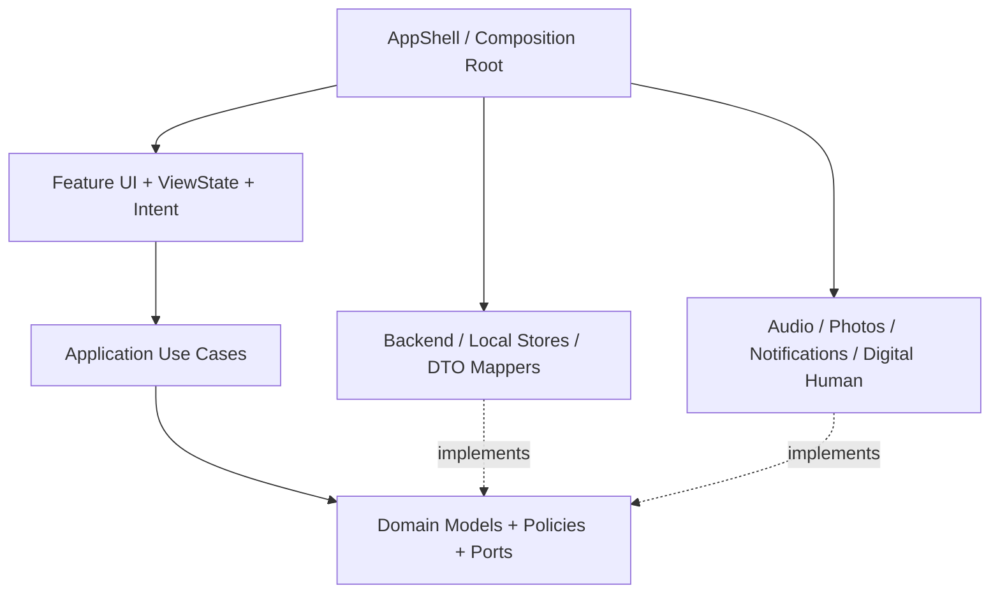
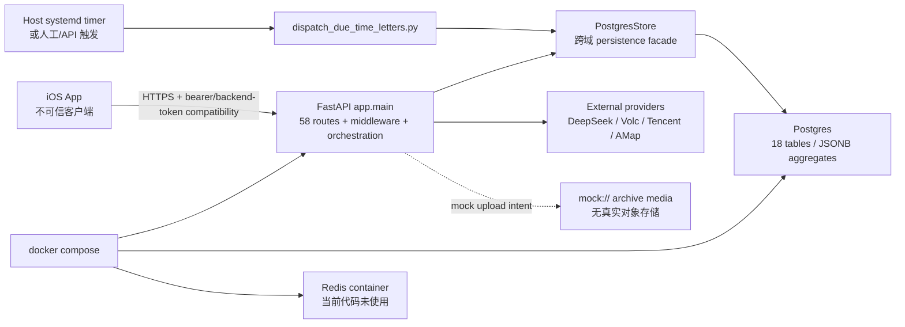
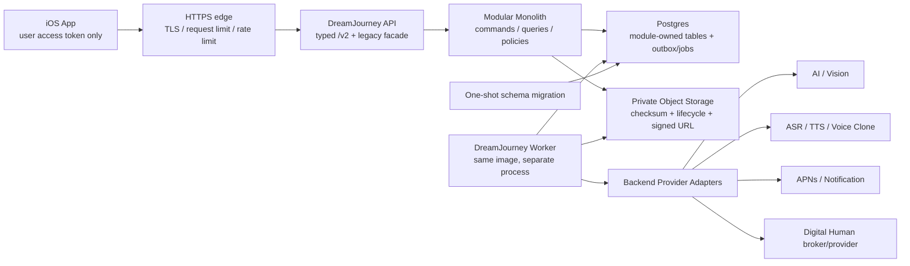
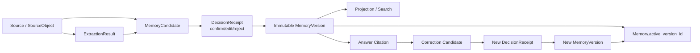
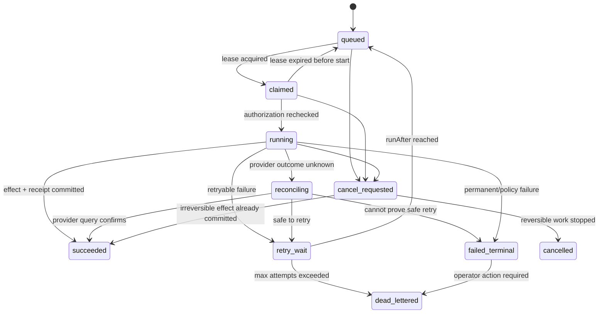
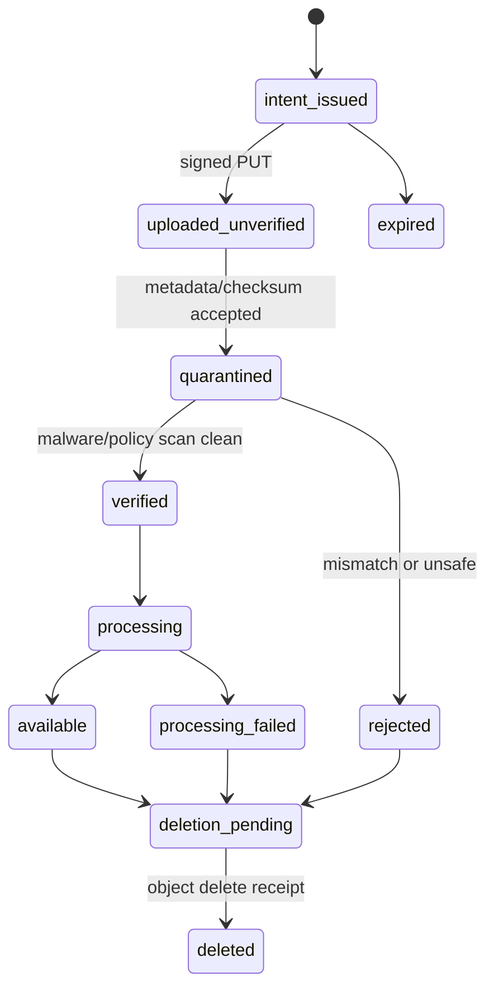
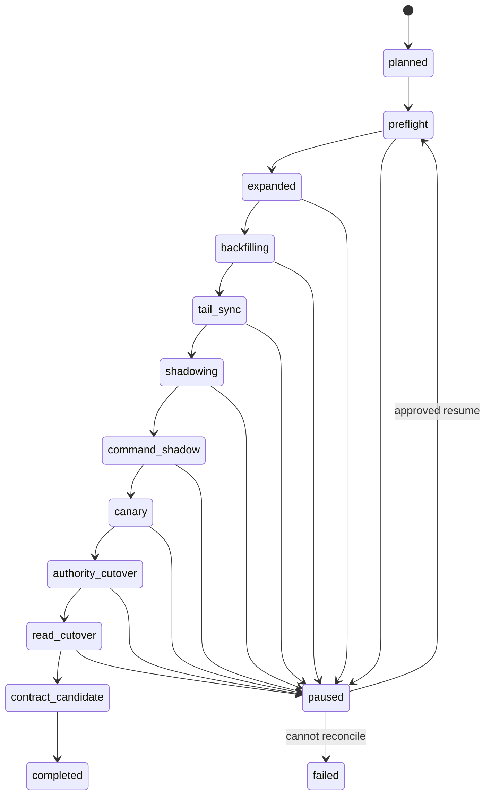
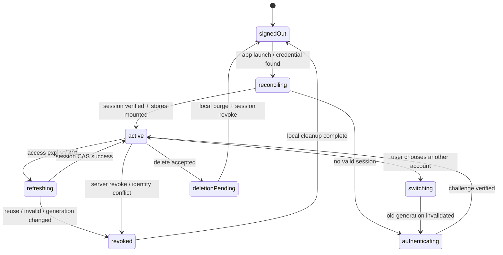

# DreamJourney V4 产品定义与目标架构 Product Spec

版本：V4.4 2026-07-16 引导式访谈与知识丰满化产品基线
初版日期：2026-07-12
更新日期：2026-07-16
状态：已同步新规生效后的 M0-M4 风险边界与引导式访谈产品合同；工程实现、法律/供应商、算法备案、安全评估、G2-G4与发布批准仍独立验收
工程基线：iOS `feature/prd-stitch-ui-adaptation@8a1922b`；Backend `main@4c0538b`
评审控制面：[DreamJourney V4 评审与验收清单](./DreamJourney_V4_评审与验收清单_V1.0.md)
引导式访谈专项合同：[DreamJourney V4 引导式访谈与知识丰满化功能说明](./DreamJourney_V4_引导式访谈与知识丰满化功能说明_V1.0.md)
定稿边界：本文件已完成产品/架构文档评审，不表示 115 个 Work Item 已实现、G2-G4 已关闭或已获发布批准。
产品范围权威：本文件定稿后取代 V1 PRD、V3 Blueprint 与相关分析文档的开发范围定义；工程事实仍以源码和[当前实现证据矩阵](./DreamJourney_V4_当前实现证据矩阵_V1.0.md)为准。

## 0. 文档控制

### 0.1 结论标签

本文所有规范性结论必须使用以下标签之一：

| 标签 | 含义 | 能否直接转为开发承诺 |
| --- | --- | --- |
| `FACT` | 当前源码、测试、部署或用户明确输入可证明的事实 | 仅能证明现状，不能自动决定公开范围 |
| `CONFIRMED` | 用户或有权决策人明确确认的产品决定 | 可以，但仍需满足安全和外部依赖门 |
| `RECOMMENDED` | 经证据审查形成的推荐基线，尚待最终产品确认 | 可用于规划和原型，不可宣称已批准发布 |
| `DECISION_REQUIRED` | 必须由产品、合规、商业或运营确认 | 不可进入不可逆实现或公开发布 |
| `EXTERNAL_DEPENDENCY` | 依赖真机、供应商、证书、数据地域或生产环境 | 只能在外部验收后标记完成 |

Product Spec 标签与决策登记册状态不是同一个状态轴，映射如下：

| Product Spec | Decision Register | 说明 |
| --- | --- | --- |
| `CONFIRMED` | `CONFIRMED` | 必须有当前 E2 决策证据 |
| `RECOMMENDED` | `RECOMMENDED_PENDING` | 可做可逆设计，不可当成产品批准 |
| `DECISION_REQUIRED` | `RECOMMENDED_PENDING` 或 `EXTERNAL_REQUIRED` | 取决于由产品还是外部证据关闭 |
| `EXTERNAL_DEPENDENCY` | `EXTERNAL_REQUIRED` | provider、真机、地域、合同或生产证据 |
| `FACT` | 不直接映射 | 现状事实不能自动创建产品决定 |

未标标签的解释性文字不构成产品承诺。遇到冲突时，采用 fail-closed：保持私有、不可发布、不向第三方发送、不训练声音、不使用数字人形象，并保留原始证据。

章节默认规则：除非句末或表格中显式覆盖，本文第 1 至 21 节描述的目标行为、阶段、状态机和验收要求默认继承 `RECOMMENDED`。当前实现或测试状态必须显式标为 `FACT`；用户确认、外部依赖和未决事项必须分别显式标为 `CONFIRMED`、`EXTERNAL_DEPENDENCY` 或 `DECISION_REQUIRED`。这样避免逐句重复标签，但不改变推荐与已确认之间的边界。

### 0.2 权威边界

- `FACT`：以当前 iOS/后端源码、数据库合同、自动化测试和部署证据为准。
- 产品目标：本文件定稿后为唯一主规格。
- 未决事项：以[产品决策登记册](./DreamJourney_V4_产品决策登记册_V1.0.md)为准。
- 独立异议与处理：以[Round 2 独立评审响应](./DreamJourney_V4_Round2_独立评审响应_V1.0.md)为准。
- 工程顺序：以 V4 可执行开发路线图为准。
- V1 PRD、V3 Blueprint、iOS 一致性分析与 Hermes/AOS 分析为可修订底稿，不再与本文件并列充当最终范围权威。`CONFIRMED`

### 0.3 2026-07-16 新规生效后的产品修订

产品负责人已完成独立方案评审第21章的40项确认。2026-07-16 又依据《寻梦环游产品问题、风险分级与整体规避方案 V1.0》，对《人工智能拟人化互动服务管理暂行办法》生效后的产品边界作出收缩和重排。本节与[产品决策登记册](./DreamJourney_V4_产品决策登记册_V1.0.md)共同覆盖本文早期仍标记为 `RECOMMENDED/DECISION_REQUIRED` 或沿用旧三级验证的表述；出现冲突时，以本节、修订后的 `CONFIRMED` 决策和更严格的外部门为准。

当前产品范围为：

1. 当前采用百级用户、单一中国首发地域、模块化单体、单 Postgres、私有对象存储和单独 Worker 的 Startup Lean Profile；完整 C00-C11 保留为规模触发后的目标体系。
2. 采用 `M0 记忆资产 -> M1 在世本人私有语音 -> M2 成年授权互动 -> M3 老人健康/成人纪念试点 -> M4 知识许可`。M0 先验证强身份与 Vault 隔离、自传、静态“Ta 的故事”、文字记忆、带来源问答、纠正、复制/导出和删除，不等待 Publication/Visitor、Voice Clone、数字人或媒体理解。
3. Family 在 M0 仅用于人物切换、材料贡献和静态只读故事；持续人格化家庭查询不由关系自动授权。M1 只允许在世成年人克隆并私用本人声音；M2 才允许在世主体主动发布、成年 Visitor 和在世数字分身；M3 才可能逐案开展成人纪念互动与老人健康协同；Care/TimeLetter 不自动进入任何阶段。
4. 维持“记忆档案/回响/我的”三个主 Tab。
5. 未成年人只能作为由监护人管理的静态成长资料数据主体。产品不得向未成年人提供父母、祖辈、兄弟姐妹、伴侣等虚拟亲属，也不得以改名规避；未成年人 Voice/Persona 与虚拟亲属从当前路线硬删除。
6. 未确认材料通过问答追问形成 Candidate，在退出页面前或约5至10轮后批量确认；未确认材料与 AI 输出不能直接成为人物事实。
7. M2 家庭/Visitor 查询使用独立、可过期、可撤回的授权上下文，并额外要求成年状态；Visitor 默认 TTL 为7天，主控人默认看不到访问者问题正文。
8. M0 提供本人交互记录、本人上传资料、已确认记忆和自传的复制、删除与导出；第三方受限内容按权利规则裁剪。账号注销采用30日恢复，上传人删除自己的 Source 为不可撤回操作并触发依赖暂停。
9. M1 声音复刻仅限在世成年人本人私用；M2 的语音/数字分身必须由在世主体主动发布并仅面向成年访问者；逝者 Voice/Portrait/DH 无生前专项授权时保持 `NO_GO`，有完整权利链时也只进入 M3 逐案试点。
10. 接受 WTMR、统一测量合同和 Projection/Retrieval DFX；精确商业成本与配额参数暂缓，但工程硬配额、熔断和文字降级必须首发具备。

11. 所有人格化互动在输出前执行年龄、授权、场景和安全策略；持续 AI 标识、依赖提醒、连续2小时提醒、UI/语音/关键词确定性退出、投诉举报、紧急联系人和危机切换中性助手为 M2/M3 强制能力。
12. M2/M3 上线或发生适用重大变化前，必须完成安全评估报告、算法备案/变更、应用商店合规材料与发布审批。私人和敏感数据默认不用于平台或供应商通用模型训练。
13. M0 的长期采集入口采用引导式访谈：一个自然输入主入口，最多两条动态推荐，分别承担“延续近期未完成故事”和“补足重要知识维度”；主题由系统内部管理，用户拥有跳过、暂缓、禁问和主动重开的控制权。`CONFIRMED`

纪念账户主控人可以承担静态档案的日常整理、家庭冲突和第三方内容处理，但不能代表未成年人或逝者创造新的拟人化授权，也不能用服务协议替代中国首发法律、有效第三方权利请求、供应商条款、生成内容标识、安全评估、算法备案或平台自身义务；这些按 `EXTERNAL_DEPENDENCY` fail-closed。

## 1. 执行摘要

### 1.1 近期产品定位

> DreamJourney 是帮助用户在生前持续记录、整理、理解、授权和传承个人记忆与知识资产的私人 AI 平台。在世用户管理自己的记忆；监护人只可管理未成年人的静态成长资料；近亲属在完成身份、死亡事实和关系核验后，可以建立默认静态的纪念档案并邀请家庭成员补充有来源的材料。声音、发布和数字分身是后续独立授权能力，不是产品成立前提。`CONFIRMED`

Owner Truth Loop 仍是两类场景共用的事实底座。逝者不会被注册为能够登录、同意或签署条款的账号主体；产品创建的是由在世 `Memorial Account Controller` 管理的 `MemorialVault + RepresentedPersona`，不是冒充逝者本人创建账号。数字人和声音复刻是高风险表达层，不因纪念档案建立、关系核验或家属持有账号而自动启用。`CONFIRMED`

### 1.2 近期产品不是

- 不是自动替用户定义人生的 AI。
- 不是默认公开、未经关系核验和权利审查的数字遗产平台。
- 不是医疗、心理诊断或危机干预服务。
- 不是把逝者模拟成仍在世本人，或以数字人形象、复刻声音作为记忆档案成立前提的聊天机器人。
- 不是复活逝者、替代亲人或真实社会关系的平台。
- 不是让 Persona 劝导付费、替用户作医疗、金融、法律、职业或关系决定的平台。
- 不是向未成年人提供父母、祖辈、兄弟姐妹或伴侣等虚拟亲属的平台。
- 不是把全部用户资料发给通用模型的云盘。
- 不是 Hermes/AOS 所描述的通用自主智能体或自研记忆基础设施。

### 1.3 产品主线

```text
原始证据 Source
→ 异步处理与候选记忆 Memory Candidate
→ Owner 审核、纠正或拒绝
→ 权威记忆 Canonical Memory + Version
→ 只读知识投影 Knowledge Projection
→ 带来源的本人问答 Owner QA
→ 回到来源或记忆进行纠正
```

Family、Publication/Visitor、Voice/Digital Human 都必须建立在该闭环之上并采用独立阶段门：M0 只开放家庭材料贡献和静态故事；M1 只开放在世成年人本人私有语音；M2 才开放在世主体主动发布的成年 Visitor 与数字分身；M3 才可能逐案开展成人纪念互动。M0 不因上述扩展门未关闭而阻塞。`CONFIRMED`

## 2. 用户与 Jobs To Be Done

### 2.1 近期核心用户

**Self Owner（本人档案控制者）**：完成手机号强身份、管理本人记忆资料、愿意审核 AI 整理结果并在意来源和隐私边界的注册成年人。未成年人不能成为拟人化互动的 Owner；其静态成长资料只由经核验监护人按独立政策管理。`CONFIRMED`

**Memorial Account Controller（纪念账户主控人）**：18 岁以上、完成强身份、逝者死亡事实和近亲属关系核验，为逝去亲人建立并日常管理 MemorialVault 的注册用户。该角色拥有产品内的日常主导权，但不因此取得逝者人格权，也不能排除其他依法有权近亲属的异议、保护和权利请求。`CONFIRMED`

Family Contributor 是纪念场景的协作者；Visitor、Operator 和 Admin 是后续访问或运营角色。声音、肖像和数字人并不是私人纪念档案价值成立的前置条件。

### 2.2 核心 JTBD

1. **整理可信记忆**：当我的经历和资料散落在文字、照片、语音或文件中时，我希望系统先保留原始证据，再提出可审核的记忆候选，以便我低成本形成一份由自己确认的长期记录。`RECOMMENDED`
2. **调用和纠正记忆**：当我想回顾某件事或基于过往经验思考时，我希望得到带来源的回答，并能从错误回答回到证据或记忆进行纠正。`RECOMMENDED`
3. **家庭受控分享**：当在世成年人希望家庭成员或明确授权者访问部分故事时，先生成独立、可检查、可撤回的发布副本，而不是暴露私人库。该 JTBD 属于 M2；匿名公共访问仍后置。`CONFIRMED`
4. **共同整理逝者故事**：当直系亲属离世后，我希望在证明身份和关系后建立纪念档案，邀请家庭成员分别提交生前材料和回忆，由主控人审核形成带来源、保留陈述视角且可处理争议的家庭记忆库。`CONFIRMED`
5. **丰满个人知识**：当我不知道从哪里讲起，或过去的表达长期零散、偏科时，我希望 AI 能顺着我正在说的内容自然追问、适时总结并提示值得继续的线索，让经历、选择、经验和边界逐步形成由我确认的个人知识资产。`CONFIRMED`

声音复刻、实时语音和数字人是完成上述 JTBD 的交互方式或表达资产，不是独立 JTBD。

## 3. 价值闭环与阶段范围

### 3.0 产品验证与发布层级

| 层级 | 目标与最小范围 | 不阻塞本层的能力 | 对外边界 |
| --- | --- | --- | --- |
| `M0 记忆资产验证` | 自传、静态“Ta 的故事”、家庭材料贡献、强身份与 Vault 隔离、文字 Source/Candidate/Memory、带来源中性问答、纠正、复制/导出/删除 | Publication/Visitor、Voice、Digital Human、持续人格化互动、健康与商业许可 | 受控 cohort；不得宣称复活、情感替代或完整数字人；不向未成年人提供虚拟亲属 |
| `M1 在世本人私有语音` | 在世成年人强身份、随机授权语句、活体与质量通过后，训练并私用本人声音 | 家庭代录、第三方/未成年人/逝者声音、公开播放、任意配音与下载 | 独立授权、标识、撤回、删除回执、Provider 与真机门 |
| `M2 成年授权互动` | 在世主体主动发布独立副本；完成成年人校验的 Visitor 在授权范围内进行文字、语音或数字分身互动 | 匿名访问、未成年人虚拟亲属、逝者人格互动、健康和商业代理 | 独立公开域；安全评估、算法备案、AI 标识、依赖/2小时提醒、确定性退出、投诉与危机门 |
| `M3 受监管试点` | 老人主动授权的健康协同；权利链清晰的成人纪念互动逐案试点 | 无生前专项授权的逝者 Voice/Portrait/DH、诊断/用药、未成年人虚拟亲属 | 逐案法律/伦理、家庭争议冻结、紧急下线、专项同意与不诊断 |
| `M4 知识许可` | 权利目录、知识授权、受益人指定、调用计量和收益结算 | 数字分身代本人作交易、法律或关系承诺 | 合同、权利分类、争议与结算证据完整 |

五个层级是产品验证合同，不是五套数据 Authority。它们共享同一 Source→Candidate→MemoryVersion→Projection 主干，通过 ReleasePolicy 和独立 capability gate 逐层开放。任一阶段通过不自动批准下一阶段。`CONFIRMED`

### 3.1 Stage 0：安全止损与数据权威前置

目标：先消除会让后续任何功能不安全或不可迁移的基础风险。

范围：

- 强身份方案至少落地一种，禁止客户端持有系统级共享令牌。
- 全路由和资源写入 owner-bound，跨租户默认拒绝。
- 建立 `AccountSessionActor/AccountLease` 与 owner-scoped store registry；账号切换、登出、删除先失效旧 generation，禁止 `user_001`、当前角色或当前登录态自动认领 legacy 私有数据。
- 引入版本化数据库迁移，冻结继续扩大无约束 JSONB 的做法。
- Postgres 改为 request/job-scoped Unit of Work，提供 DB/schema/auth readiness；在任何 authority cutover 前完成备份校验、隔离环境 restore 与 receipt replay 基线。
- 建立 credential inventory、artifact/header/log/backup secret scan 和泄漏轮换；客户端不得持有 system token，Provider 只下发真正有 scope/TTL/audience 的短期 credential，否则走后端代理或保持 blocked。
- 未完成/未来功能默认关闭，公开 release 不由客户端硬编码默认开放。
- 明确数据导出、账号删除、备份与第三方 provider 删除范围。
- 删除状态至少区分访问已撤、pending、partial、unsupported、completed；撤权后的 Data Rights 工作使用最小独立授权继续，不能以本地 tombstone 声称 Provider/对象/备份已删。
- 对当前已经公开或部署的异步 effect 建立稳定 operation/effect ID、business receipt 与 unknown/reconcile；完整 worker/outbox 可分阶段实施，但不得继续产生无法解释的投递、训练、删除或收费。
- 建立最小 operation/rights/incident/provider cost 事件，包含失败、取消、重试和未反馈分母；增长目标值可等待真实基线，安全、删除、incident和成本上限的可观察性不能延后。
- 对所有已经暴露的文字和语音入口实现高风险表达即时拦截、退出 Persona、网络失败降级、地区资源策略和安全测试，不做诊断。
- 建立关键操作审计与数据最小化日志规则。

退出门：

- 无系统 principal 可由普通客户端获得。
- 身份认领有真实证明，访问/刷新/撤销可验。
- 账号 A/B 切换、logout/delete、旧 callback、Widget/notification/runtime 均不能跨 owner；legacy owner mismatch 全部 quarantine，不自动认领。
- 核心表 owner 约束和迁移工具可回滚。
- 普通请求不共享开放 DB transaction；API startup 不执行隐式 DDL，`/ready` 能证明 required auth、DB 与 schema head；backup/隔离 restore/replay 有当前证据。
- Release artifact、Info.plist、runtime response、network header、日志与备份扫描无长期 system/provider secret；确认暴露的旧 credential 已轮换和撤销。
- 当前公开异步 effect 不存在 delivered-without-receipt、duplicate effect 或无人负责的 unknown；数据删除不以单一布尔值宣称完成。
- 跨账号自动化测试覆盖所有公开路由。
- 高风险表达不会进入延迟回信或 Persona 模拟；AI 身份披露和离线降级已通过安全测试。
- 未决合规项留在 fail-closed 状态。

### 3.2 M0：记忆资产与 Owner Truth Loop

目标：证明用户愿意把原始材料变成自己确认的记忆，并能通过来源引用获得真实价值。

范围：

- Persona 最小初始化，不承载 AI 推断人格。
- 文字输入和现有可可靠保存的资料形成 Source。
- 异步生成 Candidate，通过自然问答追问补齐；退出页面前或约5至10轮后提供批量确认、纠正、拒绝和敏感逐条审核，不在每轮对话后弹确认。
- 通过一个自然输入入口承载自由表达；系统内部维护当前话题、待续线索、深挖轮次、疲劳和跳过状态，每轮最多提出一个主要问题，同一线索通常深挖2至4轮后总结。
- 最多展示两条动态推荐：第一条“接着聊”服务对话连续性，第二条“换个角度”服务知识完整性；没有安全候选时允许少于两条，禁止把不断增长的主题目录交给用户管理。
- 形成 Canonical Memory 与不可覆盖的版本历史。
- Knowledge Projection 由权威记忆生成，不反向成为事实源。
- 提供文字优先的 Owner QA、来源引用、回答反馈和纠正入口。
- 支持本人交互记录、本人 Source、已确认记忆和自传的查看、复制、可读导出、可机读清单与删除闭环；第三方受限内容按权利规则裁剪并披露。
- 支持 Self Owner 的中性私人文字问答，以及纪念账户主控人的静态“Ta 的故事”整理；回答不得模拟逝者第一人称持续情感互动。
- 支持经授权 Family Contributor 提交材料和静态人物切换，但家庭关系不产生查询或 Persona grant。
- 所有入口受 M0 cohort、ReleasePolicy、审计和回退控制，不开放 Visitor，不训练声音，不启动数字人。

非目标：持续人格化 Publication/Visitor、Voice Clone、Digital Human、非必要媒体理解、复杂实体图谱、Care、TimeLetter 和知识收益不阻塞 M0。后续能力不因 M0 通过而被视为已验收。

### 3.3 Stage 2：摄入与质量

目标：扩大可处理的资料范围，同时保持可观察、可重试和可删除。

范围：

- 对象存储预签名直传、文件校验、病毒/内容安全检查和保留策略。
- 图片 OCR、音频 ASR、PDF/DOCX 解析；视频先保存，理解后置。
- 统一 Job/Outbox、幂等、重试、超时和运营可观察性。
- “回答错误 → 定位来源 → 生成修正 Candidate”闭环。
- 模型、prompt、版本、token、成本和延迟审计。

### 3.4 M2：成年授权 Publication / Visitor / Digital Human

目标：作为持续人格化互动的独立权限域，让完成成年校验的明确授权用户从在世主体主动发布的有限副本获得价值，同时不暴露私人 Projection。

范围：

- Publication 是私人记忆的独立快照，可脱敏、改写、确认、撤回和重新发布。
- Public Persona 仅包含用户明确设置和已发布内容。
- 采用已完成成年校验的认证账号或过期/限次邀请 grant，不开放匿名公共索引。
- Visitor 只检索公开副本，必须披露 AI 身份、无依据时表示不知道。
- VisitorSession/Message 默认 TTL 7天；主控人只看聚合使用与安全事件，默认不看问题正文。
- 限流、提示注入防护、举报、暂停、索引撤回、安全评估、算法备案、依赖/2小时提醒、确定性退出和危机演练为 M2 发布前置。

非目标：未成年人虚拟亲属、逝者人格互动、公开任意配音和开放社交传播不随文字 Visitor 自动开放。

### 3.5 M1 在世本人私有 Voice；M2 在世 Digital Human；M3 成人纪念试点

声音复刻不是 M0 完成门。M1 只允许在世成年人克隆并私用本人声音；M2 才允许在世主体主动发布的数字分身；M3 才可能逐案处理成人纪念互动。三者均不能阻断 M0 的文字 QA 降级可用性。`CONFIRMED`

| 阶段 | 范围 | 进入门 | 退出门 |
| --- | --- | --- | --- |
| M1 Living Self Voice | 在世成年人本人声音、私人语音问答、复刻 TTS、打断与文字降级 | 强身份、随机授权语句、活体、SNR、独立同意、Provider 和真机就绪 | 音色一致性、五轮稳定性、AI 标识、来源绑定、撤回和删除回执通过 |
| M2 Living Persona | 在世主体主动发布的成年 Visitor 文字/语音/数字分身 | M0/M1 稳定；独立 Publication、成年校验、用途授权、评估/备案和安全门通过 | 撤回、滥用防护、依赖/时长提醒、退出、危机、标识、并发和成本通过 |
| M3 Adult Memorial Pilot | 权利链清晰且经过逐案审查的成人纪念互动 | 生前专项授权、素材权利、家属争议机制、法律/伦理和 Provider 许可全部通过 | 小范围试点、紧急下线、投诉、心理安全和删除回执通过；任一争议即冻结 |

当前工程中的声音复刻、腾讯数字人和 Echo 生命周期代码属于可复用实现，不等于 Beta 已完成。`FACT`

### 3.6 M3/M4 与未来场景

候选能力：事实/时间/关系语义冲突、实体关系合并、Timeline、Episode、Reflection；M3 老人主动授权的健康协同和成人纪念试点；M4 权利目录、知识许可、受益人、计量和收益结算。TimeLetter 继续独立评审。

进入门：Owner Truth Loop 的留存和价值指标成立，且每个场景有独立用户问题、权限模型、合规评审与停止条件。已经存在的代码应保持兼容和 feature flag 隔离，不因沉没成本自动公开。`RECOMMENDED`

## 4. 36 条 PRD 需求的主阶段映射

该映射用于恢复优先级含义；详细实现状态仍见证据矩阵。

| 主阶段 | Requirement IDs | 数量 |
| --- | --- | ---: |
| Stage 0 安全止损 | `FR-ACC-001`、`FR-PRIV-001`、`FR-PRIV-002`、`FR-PRIV-003`、`FR-PRIV-005`、`FR-PRIV-006`、`FR-SAFE-001`、`FR-OPS-003` | 8 |
| M0 记忆资产 / Owner Truth Loop | `FR-ACC-002`、`FR-CHAT-001`、`FR-CHAT-002`、`FR-CHAT-003`、`FR-MEM-001`、`FR-MEM-002`、`FR-QA-001`、`FR-SRC-003`、`FR-PRIV-004` | 9 |
| Stage 2 摄入与质量 | `FR-SRC-001`、`FR-SRC-002`、`FR-QA-002`、`FR-OPS-001`、`FR-OPS-002` | 5 |
| M2 成年授权发布与 Visitor | `FR-PUB-001`、`FR-PUB-002`、`FR-PUB-003`、`FR-VIS-001`、`FR-VIS-002`、`FR-VIS-003`、`FR-SAFE-002` | 7 |
| M1 Voice / M2 Living DH / M3 Memorial Pilot | `FR-VOICE-001`、`FR-VOICE-002`、`FR-VOICE-003`、`FR-VOICE-004`、`FR-VOICE-005` | 5 |
| M4 认知与许可准备 | `FR-MEM-003`、`FR-MEM-004` | 2 |
| 合计 | 每个 FR 仅有一个主阶段，跨阶段依赖在路线图中表达 | 36 |

原 PRD 中的 `P0/P1` 仍保留为来源字段，但不再直接决定并行开发顺序。`RECOMMENDED`

## 5. 信息架构策略

### 5.1 近期保持三 Tab

当前公开 IA 固定为“记忆档案 / 回响 / 我的”。不执行 V3 Blueprint 的四 Tab 大改。`CONFIRMED`

| 当前入口 | V4 近期职责 | 不应继续承担 |
| --- | --- | --- |
| 记忆档案 | Source 进入、处理状态、Candidate 待确认、Canonical Memory 浏览和纠正 | 用 `isPrivate` 直接代表 Publication；把 mock 媒体当已上传 |
| 回响 | Owner 文字/语音 QA、来源引用、纠正、可选 Voice/Digital Human Beta | 充当权威记忆存储；把 runtime 状态写成事实 |
| 我的 | Persona、家庭人物切换/管理、隐私与数据权利、Provider/Beta 设置 | 暴露 Care/TimeLetter；把声音授权和公开授权合并 |

### 5.2 目标概念的渐进承载

- “回响”长期保留一个自然输入主入口；其下最多显示一条连续性推荐和一条知识完整性推荐。推荐是可忽略的辅助，不得表现为待办，不得用成百上千个主题卡片替代自然表达。`CONFIRMED`
- 当前话题只轻度可见；访谈模式半显性；深挖轮次和疲劳分数保持内部状态。用户始终可选择“这次跳过、以后再聊、不再问这个话题”。`CONFIRMED`
- 人生地图与语义搜索作为次级回顾工具；主题聚类、合并和覆盖计算由系统处理，不新增主 Tab，不要求用户维护目录。`CONFIRMED`
- Candidate Inbox 先作为“记忆档案”的一级视图或显著入口验证。
- 家庭 Publication/Visitor 在 MVP 采用独立页面和权限域，不复用 Archive 的公开布尔字段。
- Voice/Digital Human 作为“回响”的可选运行模式和“我的”的资产设置，不新增主 Tab。
- 只有当跨模块导航数据证明用户频繁在记录、审核、问答之间切换受阻，且原型验证改善核心指标后，才评审主 Tab 重构。

## 6. 产品指标

### 6.1 已确认北极星指标

**周可信记忆复用 Owner 数（Weekly Trusted Memory Reuse Owners, WTMR）**：在一个 ISO 周内，Owner 在不同会话且至少跨一个自然日复用一条此前已确认、仍 active 且带有效 Source 的 Memory Version，并对引用该记录的回答明确提交 `helpful=true` 的去重 Owner 数。`CONFIRMED`

首次建库、onboarding 引导中的即时自问自答、同会话复述或新建后立即点击 helpful 均不计入 WTMR。只有既有记录在后续独立回顾中被有来源地复用并对用户有帮助，才完成北极星事件。

事件口径：

- `canonical_memory_version_created`：用于 A72 激活，必须包含 `ownerId`、`memoryId`、`candidateId`、`sourceId`、`versionId`、decision type 和服务端时间。
- `owner_answer_completed`：必须包含 `conversationId`、`answerId`、至少一个 active citation 和 context policy 版本。
- `answer_feedback_helpful`：必须为显式 `helpful=true`，关联同一答案和被引用的 memory version。
- `trusted_memory_reused`：服务端确认 citation 对应更早日期创建的 active Memory Version，且当前 conversation 与创建/首次确认流程不同。
- `trusted_memory_week_completed`：只由服务端在 reuse、helpful、owner、日期和引用有效性校验通过后产生。

反作弊与排除：

- 排除 QA、内部、seed、mock 和被标记为自动化的账号及事件。
- AI 自动生成、自动确认、批量导入、onboarding 脚本和同日自循环不能满足 WTMR。
- 同一 Owner、Canonical Memory、Answer 在窗口内只计一次；客户端重放以服务端幂等键去重。
- Source 被删除、引用失效或跨 owner 的事件不计入并触发数据质量告警。

### 6.2 阶段结果指标

| 指标 | 定义 | 目的 |
| --- | --- | --- |
| 72 小时首次可信记忆激活率（A72） | 新 Owner 中 72 小时内完成 `Source -> Candidate decision -> Memory Version` 的比例 | 验证建库路径是否足够清晰；自动确认不计入 |
| 28 日跨周可信复用率（R28） | 已激活 Owner 中，在第 8 至 28 天发生至少一次跨会话/跨日期 `trusted_memory_reused + helpful` 的比例，不要求再创建新记忆 | 验证既有记忆是否持续产生价值 |
| 有来源回答帮助率（GHR） | 所有获得 active 私人上下文且反馈窗口已结束的 eligible answer attempts 中 `helpful=true` 的比例；失败、无回答、无引用和未反馈都留在分母 | 防止通过不展示控件或不返回引用美化质量 |

同时报告 citation coverage、provider/生成失败率、无回答率、取消率和未反馈率，不允许只展示 GHR。

### 6.3 不可被增长指标覆盖的守门指标

- 跨租户私人正文泄露：0。
- 未授权 Publication、声音生成或数字人会话：0。
- 删除/撤回超出承诺 SLA 的事件：0；解释只作为根因维度，不能从 breach 计数中剔除。
- 文字、声音或数字人输出中无来源却被表示为用户事实的陈述：0。

守门指标失败时暂停对应功能扩量，不以 WTMR 增长抵消。指标阈值在服务端事件管线落地并观察至少两个完整周后确认；旧 PRD 中没有基线支撑的百分比只保留为历史假设。

## 7. 近期明确非目标

- M0 不建设 Visitor、持续人格化家庭查询、Voice/Digital Human、Care/TimeLetter 或公开家庭社区；M1 只建设在世成年人本人私有声音，M2 才建设成年授权 Publication/Visitor 和在世数字分身。
- 不以图谱可视化、六维权重、三温区、TimeRiver 或自研向量数据库作为 MVP 验收。
- 不进行大规模 iOS 导航重写、全后端微服务化或一次性数据重建。
- 不因创建纪念账户、上传旧录音或完成近亲属关系核验就自动提供逝者声音克隆；任意文本配音下载和默认公开的复刻声音仍禁止。
- 不把“家属持有账户”解释为逝者声音、肖像、隐私或人格模拟授权的自动继承。
- 不向未成年人提供父母、祖辈、兄弟姐妹、伴侣等虚拟亲属，也不以“家庭导师”等名称规避角色实质。
- 不以逝者或亲属 Persona 发送情感召回、劝导续费、购买、金融医疗建议或重大现实承诺。
- 不承诺“完全可信”“完全理解用户”“数字永生”或“替代本人”。
- 不把 Care 数据用于医疗/心理诊断，也不让数字人格处理危机响应。
- 不在没有对象存储、删除、审计和权限证明时扩大媒体摄入。

## 8. 角色、权利主体与权限边界

### 8.1 产品角色

| 角色 | 定义 | 不是 |
| --- | --- | --- |
| Owner | 创建并管理自己的 Persona、私人资料、已确认记忆、Publication 和声音授权的注册成年人；未成年人资料由经核验监护人以 Guardian Controller 身份管理 | 被记录的所有第三方的权利代理人；未成年人的无条件替代同意人 |
| Memorial Account Controller | 经强身份、死亡事实和近亲属关系核验后，创建并日常管理某一逝者 MemorialVault 的注册成年人；每个 Vault 同时只有一个 active primary controller | 逝者本人；逝者人格权或生前同意的继承人；可排除其他合格近亲属权利请求的人 |
| Represented Persona | 被记忆、回答、肖像或数字人表达所呈现的人；可为在世 Owner，也可为已核验逝者 | 登录 principal；Controller；自动拥有 Voice/DH capability 的账号 |
| Visitor | 通过受控分享入口访问某个 Public Persona 的人 | Owner 家庭关系的自动成员；私人域读者 |
| Operator | 处理任务失败、举报、成本和服务健康的内部运营人员 | 私人正文审核员；记忆确认人 |
| Admin | 管理权限、安全事件和依法执行数据操作的受控人员 | 默认超级用户；可替 Owner 发布或授权声音的人 |
| Family Contributor | 经 Self Owner 或 Memorial Controller 邀请，为指定 Vault 提交资料、回忆或纠正建议的注册用户 | 自动共同 Controller；可直接写入已确认记忆、发布或授权声音的人 |
| Rights Claimant | 对某一逝者完成自身身份和法定近亲属关系证明并提出保护、异议、限制、下架或删除请求的人 | 自动取得私人库全文访问权；自动替代 primary controller 的人 |
| Data Subject | 被 Source 或记忆提及、可被识别的在世第三方或未成年人，是政策上的权利主体 | 登录 principal；其权利不能因没有账号而消失 |

M0 可以保存由经核验监护人管理的未成年人静态成长资料，但未成年人不得成为拟人化互动 Owner、Visitor 或虚拟亲属的服务对象，其 Voice/Persona 不进入当前路线。能够控制账户、发布内容、训练声音或参加 M2/M3 互动的主体必须为完成强身份与成年人校验的人。涉及可识别第三方的公开内容需要独立政策和异议/删除渠道。`CONFIRMED`

### 8.2 权限矩阵

所有权限由后端 principal、resource owner、purpose、grant 和状态共同决定。客户端隐藏、feature flag 和 prompt 不能授予权限。

| 资源/操作 | Owner | Visitor | Operator | Admin | Family Contributor |
| --- | --- | --- | --- | --- | --- |
| 私人 Source 创建 | 允许 | 拒绝 | 拒绝 | 拒绝 | 在受邀范围提交并标记 contributor |
| 私人 Source 读取 | 自有允许 | 拒绝 | 默认仅任务元数据 | 仅 break-glass | 默认只能看自己提交且未撤回的内容 |
| Candidate 审核 | 自有确认/纠正/拒绝 | 拒绝 | 可重跑任务，不可代审 | 不可代审 | 可提出建议，不可确认 |
| 已确认记忆读取/纠正 | 自有允许 | 拒绝 | 默认仅健康元数据 | 仅 break-glass 读取，不可改写 | 在明确授权范围只读；纠正只能形成建议 |
| Persona 管理 | 自有允许 | 拒绝 | 元数据诊断 | 可安全暂停，不可代编辑 | 拒绝 |
| Publication 起草/发布/撤回 | 自有允许 | 只读已发布副本 | 举报处理和临时暂停 | 安全/法律暂停或下架 | 不因家庭关系获得权限 |
| Visitor Session | 可开关入口、看聚合指标 | 在 grant 范围创建、提问、举报 | 滥用治理 | 封禁和调查 | 与 Visitor 相同 |
| Voice Profile | 本人采集、试听、用途授权、暂停、删除；监护/纪念场景仅可发起受控申请 | 仅消费已发布且用途授权的输出 | 任务元数据和重试，不可试听/下载 | 受审计删除，不可代授权 | 不因家庭关系取得训练权；仅可在 capability 与外部门均通过时使用已授权输出 |
| Digital Human Runtime | 启动自有私人 runtime | 仅已授权公开 runtime | 健康诊断和故障终止 | 容量、安全和紧急终止 | 与 Visitor 相同 |
| 导出/删除/回执 | 自有数据权利 | 自有会话告知和举报 | 执行队列，不读取不必要正文 | 依法和受审计执行 | 自己贡献内容的撤回/处理回执 |

`Admin break-glass` 必须有工单、原因、短时授权、最小字段、双人批准和不可修改审计。Admin 不能替 Owner 确认记忆、发布内容或授予声音用途。`RECOMMENDED`

### 8.3 纪念账户权限矩阵

纪念账户的“一个主控人”是产品运营和并发控制规则，不是对逝者人格利益的绝对处分权。主控人负责日常整理与决策；其他完成证明的合格近亲属可以提出 RightsRequest。涉及声音、肖像、数字人、公开发布或删除的实质争议，必须立即触发相应 capability 的 `conflict_hold`，而不是按最后写入者或账号持有人自动胜出。`CONFIRMED`

| 资源/操作 | Memorial Controller | Family Contributor | Rights Claimant | Operator/Admin |
| --- | --- | --- | --- | --- |
| 建立 MemorialVault | 完成成年人强身份、死亡事实和关系核验后允许 | 拒绝，可接受邀请 | 可另行提出已存在 Vault 的关联/异议请求 | 只核验流程和风险，不代建 |
| 提交 Source | 允许，必须声明来源、取得方式和权利情况 | 在邀请 scope 内允许，保留 contributor 与 perspective | 不因提出请求而获得提交权 | 默认不得读取正文或代提交 |
| 确认/纠正 Memory | 主控人允许；第三方陈述不得改写为逝者第一人称 | 只能提交 Candidate/纠正建议 | 可对涉及自身或逝者权益的内容提出限制/异议 | 不可代确认 |
| 私人纪念检索 | M0 只允许主控人使用中性记忆助手检索静态材料，不得模拟逝者第一人称陪伴；其他家庭成员需独立 Delegated AccessGrant | M0 仅贡献/静态只读，持续人格化 query 进入 M3 逐案门 | 不因关系证明自动允许 | 默认仅脱敏任务元数据 |
| Publication | 主控人可起草；发布仍需内容、法域、权利和二次确认门 | 不可直接发布 | 有实质权利异议时可触发暂停审查 | 可安全/法律暂停，不可代发布 |
| Voice/Portrait/DH | 只能提出申请并提交证据，不能以主控身份自行授权 | 拒绝代授权或代训练 | 可提出异议并触发 scope hold | 只执行审核、暂停和 provider receipt，不产生授权 |
| 暂停/争议 | 可主动暂停全部能力 | 可撤回自己的贡献并举报 | 证明通过后可申请限制相关内容/能力 | 可因安全、法律或法院/主管机关要求暂停 |
| 删除/关闭 | 可发起；先撤访问，再按证据、贡献、权利请求和保留规则分层执行 | 可撤回本人贡献，不可删除他人材料 | 可请求限制、下架或删除相关范围 | 依法受审计执行，不把未完成清理标完成 |

## 9. 统一领域词典与数据权威

### 9.1 记忆相关术语

产品 UI 使用“已确认记忆记录（Confirmed Memory Record）”。技术模型可以使用 `CanonicalMemory`，但 `canonical` 仅表示“该 Owner 当前采用的权威版本”，不表示客观真相。事实陈述、主观回忆、情绪观察、第三方陈述和 AI 推断必须保留类型与视角。`RECOMMENDED`

| 对象 | 唯一产品含义 | 目标权威系统 | 当前工程定位 | 禁止用途 |
| --- | --- | --- | --- | --- |
| Identity / Account | 经证明的登录主体、凭证、恢复和状态 | Identity/Auth Store | access/refresh session 可复用；手机号认领仍不充分 | 用共享 system token 代表普通用户 |
| Persona | Owner 管理的身份、称呼、表达偏好和回答政策 | Persona Store | Profile、FamilyMember、DigitalHumanContext 是迁移输入 | 保存记忆正文、provider 状态或自动推断人格 |
| MemorialVault | 由在世主控人管理、以已核验逝者为 Represented Persona 的私人记忆边界 | Vault/Persona Store | 当前 FamilyMember/role 数据只作迁移输入 | 冒充逝者登录；自动获得声音/肖像/公开权限 |
| Memorial Controller Appointment | 主控人的身份、关系证明、控制范围、有效状态和版本 | Rights/Policy Store | 当前账号或家庭角色不能直接迁为 appointment | 被解释为逝者人格权或生前同意的继承证明 |
| Kinship / Death Verification | 对主控人身份、近亲属关系和死亡事实的最小化证明及审核回执 | Verification Store | 当前缺失 | 长期保存非必要证件原图；直接充当 Voice grant |
| Deceased Intent Evidence | 逝者生前对资料、声音、肖像、模拟、私用或公开用途的可验证意愿证据 | Consent/Evidence Ledger | 当前缺失 | 由家属勾选条款后生成；把一般录音等同复刻授权 |
| Memorial Rights Claim / Conflict Hold | 其他合格近亲属的异议、保护或限制请求，以及对指定能力的立即冻结 | Rights/Policy Store | 当前缺失 | 自动泄露私人库；用账号先占顺序驳回 |
| Source | 不可原地覆盖的原始输入、哈希、来源、主体、处理和保留信息 | Source Store + 私有对象存储 | iOS Archive 与后端 `archive_items` 是迁移输入 | 被 AI 结果覆盖；直接发布；本地路径冒充已上传对象 |
| Memory Candidate | 从一个或多个 Source 提出的原子审核单，尚未获得 Owner 认可 | Candidate Store | `/kb/extract` proposal 与 KBLite evidence 状态仅作兼容 | 作为确定事实进入公开域；由 Operator 自动确认 |
| Confirmed Memory Record | Owner 当前认可的一条记录，持有稳定 ID | Memory Store | 当前缺少独立 authority | 被称为客观真相；原地覆盖版本 |
| Confirmed Memory Version | 记录在某一时刻的不可变内容、视角、证据和政策快照 | Memory Version Store | Knowledge revision 可提供迁移线索 | 从 Projection 反推或复活 superseded 版本 |
| Knowledge Projection | 从 active 记忆版本构建的全文、图、向量和客户端缓存 | Projection Store | KBLite、`kb_snapshots`、`kb_changes` 可保留 | 兼任 Candidate/Memory authority；接受无来源事实 |
| Conversation / Message | 会话和有序消息；Owner 最终输入可登记为 Source | Conversation Store | 当前主要在 iOS 本地 | 将 assistant/Visitor 消息静默当作 Owner 事实 |
| Publication | 钉住特定记忆版本、经脱敏和二次确认的独立发布快照 | Publication Store + Public Index | 当前缺失；`isPrivate=false` 不可复用 | 作为私人库过滤视图；静默跟随私人版本变化 |
| Visitor Session | 绑定 share grant、Publication 范围、限流和风险策略的公开会话 | Public Gateway / Visitor Store | 当前缺失 | 调用私人检索；写回 Owner 记忆 |
| Voice Profile | 声音主体证明、样本版本、provider 模型、质量和用途授权的组合 | Voice Registry + Consent Ledger | 现有 voice profile/slot 仅部分 authority | 作为 Persona 本体；由 provider ready 自动启用；私用授权推导公用授权 |
| Digital Human Runtime | 临时渲染、会话租约、音频 owner 和播放状态 | Runtime Lease Store + 设备 runtime | `DigitalHumanRuntime` adapter 与后端 lease 可保留 | 保存产品事实；反写 Persona/Memory；暴露长期供应商凭据 |
| Job / Audit / Receipt | 异步执行、操作证据和数据权利回执 | Job/Outbox/Audit Store | 现有 knowledge receipt 和脚本是局部基础 | 保存超出必要范围的正文或密钥 |

### 9.2 数据权威规则

1. Source 保留“用户或外部资料说了什么”；它是可追溯记录，不自动证明内容为客观事实。
2. Candidate 保留“模型建议了什么”；只有 Owner 的显式决定才能创建或修正已确认记录。
3. Confirmed Memory Version 保留“Owner 当前认可什么”；新版本取代旧版本，但历史不原地改写。
4. Projection 只回答“如何快速找回”；可删除、重建和迁移，永不成为唯一真相。
5. Publication 保留“Owner 在某次发布时允许他人看到什么”；它不实时映射私人库。
6. Voice Profile 和 Digital Human Runtime 只负责表达与执行，不增加事实可信度。

## 10. 私人域、发布域与运行时数据流

### 10.1 允许流向

```text
私人域
Owner / Future Contributor Input
  -> Source
  -> Processing Job
  -> Memory Candidate
  -> Owner Decision
  -> Confirmed Memory Version
  -> Outbox
  -> Private Knowledge Projection
  -> Owner Context / Owner QA

发布域
Confirmed Memory Version
  -> Publication Draft Copy
  -> Redaction + Owner Second Confirmation
  -> Immutable Publication Version
  -> Public Index
  -> Visitor Context / Visitor Session

运行时域
Authorized Context + Response Text
  -> Voice Capability (MVP Extension)
  -> Digital Human Runtime (Beta)
  -> Playback / Diagnostics
```

Owner 最终消息只有在先持久化为 Source 后才可触发 Candidate；assistant 输出、Visitor 输入、失败分析结果、置信度、Echo 状态、voice provider 状态和 digital-human session 状态不得成为 Owner 事实。

### 10.2 禁止流向

- `Knowledge Projection -> Confirmed Memory`：禁止静默反向写入。
- `Source/Candidate -> Publication`：禁止绕过 Owner 审核和独立发布副本。
- `Private Projection -> Visitor Context`：禁止用查询过滤代替物理/逻辑隔离的 Public Index。
- `Visitor/Family Message -> Confirmed Memory`：必须先成为带贡献者和用途信息的 Source，再进入 Owner Candidate Inbox。
- `Voice Sample -> Memory Pipeline`：声音生物特征与内容记忆分开处理。
- `Runtime/Provider State -> Persona`：连接成功、音色 ID、数字人素材或会话状态不得塑造人格事实。
- `Operator/Admin -> Owner Decision`：内部人员不能代替用户确认、发布或授权。

### 10.3 当前工程的渐进映射

| 当前模块 | V4 定位 | 迁移原则 |
| --- | --- | --- |
| `MemoryArchiveItem/Repository` | Capture、本地草稿和 legacy Source envelope | 增加服务端 Source ID/object key 后渐进迁移；未上传记录保持 local-only |
| `archive_items` JSONB | legacy metadata 兼容层 | 不再扩大任意字段；新 Source 使用 typed schema 和 owner 约束 |
| KBLite / knowledge snapshot/change | 私人 Knowledge Projection 与离线 cache | 由 Memory outbox 投影；保留同步协议，不反向猜测 authority |
| Knowledge proposal/governance | Candidate 处理和迁移工具 | 把审核结果写入新 Candidate/Memory authority，再生成投影 |
| Context Packet / Echo trace | 检索政策、ranking 和可观察性 | 改从 active Memory/Publication authority 读取；继续输出过滤原因 |
| `MemoryRepository` legacy mock | UI/测试遗留 | 不迁移为正式数据，不承担 Publication |
| Voice registry / synthesis adapter | Voice Profile 处理和 runtime port | 补用途 grant、主体证明、删除回执，不写入 Persona 事实 |
| `DigitalHumanRuntime` / session lease | 可替换 runtime port | 保留 provider 隔离和 fallback，不成为 Owner 核心闭环前置 |

迁移采用双读/影子校验、明确 authority 切换和可回滚投影，不进行一次性 iOS/后端重写。目标数据库和 API 细节由 Round 3 定义。

## 11. 生命周期与并发规则

### 11.1 状态维度分离

同一资源至少区分以下维度，禁止合并成一个 `status`：

| 维度 | 示例 | 负责回答 |
| --- | --- | --- |
| Authority lifecycle | active、needs_review、deleted | 该业务对象当前是否有效 |
| Transfer operation | local_only、pending、uploaded、failed | 二进制或 payload 是否完成传输 |
| Processing operation | not_requested、queued、running、succeeded、failed_retryable、failed_terminal | OCR/ASR/提取/分析任务发生了什么 |
| Consent lifecycle | requested、active、revoked、expired | 某主体是否允许某一用途 |
| Publication lifecycle | draft、published、suspended、withdrawn | 独立公开副本能否继续访问 |
| Runtime/provider state | connecting、ready、speaking、failed、released | 临时服务执行状态 |

分析失败不等于 Source 同步失败；provider ready 不等于 Voice Profile 已获得用户启用授权；数字人连接成功不等于 Persona 有效。

### 11.2 Source

Authority lifecycle：

```text
client_draft
  -> registered
  -> active
  -> restricted
  -> deletion_pending
  -> deleted
```

- `client_draft` 不属于服务端 authority；只有 `registered` 后才获得稳定 Source ID。
- `active` 表示完整性、owner 和保留策略已登记，不表示所有处理任务成功。
- `restricted` 可由恶意内容、第三方异议、地域/年龄政策或安全事件触发；可在复审后回到 `active`。
- `deletion_pending` 必须先阻断新读取，再异步删除对象和派生物。
- `deleted` 是 authority 终态；恢复只能从另一个合法原件创建新 Source，不能复活原 ID。
- 原始 payload 不允许原地覆盖。更新元数据需要 `expectedVersion`，更换内容必须创建新 Source。

### 11.3 Memory Candidate

```text
proposed -> pending_review -> accepted
                           -> rejected
                           -> invalidated
                           -> expired
```

- 只有 Owner 可以把 `pending_review` 转为 `accepted/rejected`；模型和 Operator 不能代审。
- `accepted` 在同一事务中创建或更新 Confirmed Memory，并产生唯一 decision receipt。
- `accepted/rejected/invalidated/expired` 均为终态；重新考虑必须创建新 Candidate 并引用旧决定。
- Source 被删除、证据无效或 policy 变化时，未决 Candidate 进入 `invalidated`。
- Candidate 只可在审核界面以“建议”使用，不作为 Owner QA 的确定性事实，也不能直接发布。

### 11.4 Confirmed Memory Record / Version

Record aggregate：

```text
active -> needs_review -> active
active/needs_review -> deletion_pending -> deleted
```

Version：

```text
v1 current
  --Owner correction accepted--> v1 superseded + v2 current
```

- Version 内容不可变；纠正永远创建新版本并保留来源、视角、变更原因和 decision receipt。
- 一个未删除 Record 恰有一个 `current` 版本；写入使用 `expectedRecordVersion` 防并发覆盖。
- 证据被删除、第三方异议或 policy 变化时 Record 进入 `needs_review`，且不能继续生成新 Publication。
- `superseded` 不得恢复为 `current`；若 Owner 想采用旧内容，也创建新版本并记录理由。
- 删除 Record 不默认删除原始 Source；UI 必须分别让用户选择，并解释派生影响。

### 11.5 Publication / Publication Version

```text
draft -> published -> suspended
                   -> withdrawn
suspended --Owner re-review + policy pass--> published
```

- `draft` 可编辑但不可被 Visitor 检索。
- `published` 快照不可变并钉住具体 Confirmed Memory Version；私人版本变化不静默更新公开内容。
- 依赖证据删除、记忆修正、第三方异议、授权过期或安全事件时先进入 `suspended`。
- `withdrawn` 为当前 Publication Version 终态；再次发布必须创建新版本并再次确认。
- 撤回只保证平台控制范围内停止未来检索和新会话，不能承诺收回截图、录音或外部副本。

### 11.6 Voice Profile

Authority lifecycle：

```text
unconfigured
  -> collecting
  -> sample_ready
  -> preview_ready
  -> active <-> paused
  -> deletion_pending
  -> deleted
```

Training operation 独立为：

```text
not_started -> queued -> validating -> training -> succeeded
                                      -> failed_retryable
                                      -> failed_terminal
```

- consent/purpose grant 不属于 Voice Profile 资产生命周期。`collecting` 只有在 `voice_training` basis/grant active 时才可采集；撤权由授权对象处理。
- provider training `succeeded` 只能将对应 profile version 推到 `preview_ready`，不能自动进入 `active`；Owner 必须试听并确认。
- 训练、Owner 私用、Visitor 公用和 Digital Human audio-drive 使用四个独立 purpose grant；撤销其中一个只关闭对应 capability，不能自动推导或撤销其他用途。
- `paused` 停止该 profile 的新合成但保留样本和模型，不触发物理删除。删除必须由 Profile 删除请求、训练 consent 全面撤回后的政策或账号 purge 单独触发。
- `collecting/sample_ready/preview_ready/active/paused` 均可进入 `deletion_pending`；失败后重录创建新 sample/profile version，不原地覆盖旧样本。
- `deleted` 需要本地、后端和 provider 回执。缺 provider 回执时只能标记 `deletion_incomplete` operation，不能宣称已彻底删除。
- 失败、删除或旧 provider 回调不得转回 `active`；回调必须匹配 profile version 和 operation ID。

### 11.7 命令幂等与过期回调

客户端请求与服务端命令上下文必须分离：

- `ClientRequest` 可提交 `resourceId`、`idempotencyKey`、`expectedVersion`、intent 和经过 schema 限制的 payload。
- `ServerCommandContext` 由认证/策略层生成 `principalId`、tenant/owner、`receivedAt`、`policyVersion`、request/trace ID；客户端同名字段一律不可信。
- 异步任务由服务端生成 `operationId`、attempt、work authorization 和 provider request/log ID。

- 同一 idempotency key 重放返回原 receipt，不重复创建版本、Publication 或 provider 资产。
- expectedVersion 不匹配返回显式冲突，不采用最后写入覆盖。
- terminal state 默认拒绝回退；需要恢复时创建新对象或新版本。
- provider、客户端或后台任务的迟到回调只有在 operation/profile/generation 均匹配时才可落库。
- authority 变更和 outbox event 必须同事务；consumer 以 event ID 去重。

### 11.8 Account 删除与恢复

```text
active
  -> deletion_requested
  -> suspended_restorable
  -> purge_due
  -> purging
  -> deleted

suspended_restorable --strong re-auth before restoreDeadline--> active
```

- `deletion_requested` 同事务撤销登录 session、普通交互 AccessGrant 和新 provider capability，并暂停所有 Publication；不会立即删除 Source/Memory 对象。
- `suspended_restorable` 只保留执行恢复或继续删除所需的最小数据和内部 WorkAuthorization，普通读取、AI、Voice 和 Visitor 均拒绝。
- 在 `restoreDeadline` 前完成强重新认证才可恢复；恢复签发新 session，但 Publication、Visitor public voice、operator grant 和高敏 processor grant 不自动恢复，必须重新确认。
- 到达 `purge_due` 后不可恢复，才启动 Source/Memory/Object/Projection/Voice/Provider 删除 DAG。
- 如果产品最终不采用 30 日恢复，DR-011 需把 `suspended_restorable` 的期限改为 0；状态机仍保留明确的访问撤销与物理 purge 分界。

## 12. 四维隐私、授权与访问决策

### 12.1 正交维度

| 维度 | 推荐模型 | Fail-closed 默认 |
| --- | --- | --- |
| Sensitivity | level=`unknown/standard/sensitive/high`；附 health、minor、biometric、financial、third_party、negative_assessment 等 category | `unknown` 按 `high` 处理 |
| Processing basis / consent | `ProcessingBasis` 记录允许处理的法律/合同/用户同意依据；需要同意时由独立 `ConsentRecord` 记录主体、目的、processor、版本和撤回 | 没有可证明的 basis 即不处理 |
| Visibility | `owner_only/scoped_principals/publication_only` | `owner_only` |
| Publication state | 私人对象=`not_applicable`；Publication=`draft/published/suspended/withdrawn` | `draft`，不可被 Visitor 读取 |

`publishable` 是 sensitivity、第三方政策、grant、来源健康和人工审核共同计算出的资格，不是持久化可见性；`published` 只存在于独立 Publication 上。`private`、`never_share`、`generationAllowed` 和 `isPrivate` 不得继续承担多维含义。

### 12.2 授权对象与 authority

| 对象 | 作用 | Authority / issuer | 撤销或到期 |
| --- | --- | --- | --- |
| ProcessingBasis | 证明某类数据可因何目的被处理，不直接授予某人读取权限 | Privacy/Consent Ledger；用户同意由经认证 subject 签发，合同/法定义务由受审计 policy issuer 签发 | 停止对应新处理；依法允许的删除/审计任务通过独立授权继续 |
| ConsentRecord | 保存用户看到的 policy、purpose、processor、范围、时间和签名证据 | Consent Ledger；只能由数据主体或有合法代理依据的人确认 | `active -> revoked/expired`，传播到派生 capability |
| AccessGrant | 授予非 Owner principal 在明确 resource/version scope 上的委托/Visitor 交互权限 | Authorization Service；Owner 可签发分享 grant，平台策略只能收窄 | 撤销后被委托 principal 的普通读写立即拒绝，不影响已受理的数据权利 job |
| WorkAuthorization | 授予 machine/Operator 执行一个 operation/job 的最小字段和动作 | Policy/Job Service 根据已受理命令、outbox 或工单签发；绑定 operation ID、purpose、expiry | job 完成/取消/超时即失效，不能转换成通用 system 权限 |
| DataRightsAuthorization | 允许导出、删除、限制处理或第三方权利请求即使普通 session/grant 已撤销 | Data Rights Service 在强身份/主体证明和 request receipt 后签发 | 仅对 request ID 和必要数据有效，完成后失效 |
| RetentionHold | 因法律/安全义务暂缓物理 purge | Privacy/Legal policy issuer，必须有原因和到期 | 只阻止删除，不授予普通读取；解除后继续原 deletion job |
| ProviderCapability | 允许后端在短期内调用特定 processor/profile/purpose | Runtime/Provider adapter 从有效 basis、grant/work authorization 派生 | 短期、可撤销，不向客户端暴露长期凭据 |

Owner 私人存储不是“永久隐式同意”：创建 Source 时生成与当时 policy 绑定的 ProcessingBasis/ConsentRecord。processor、地域、audience、purpose 或敏感级别发生实质变化时必须重新评估，不能沿用旧记录。

### 12.3 Usage purpose

至少区分以下 purpose，彼此不可推导：

- `owner_memory_storage`
- `owner_ai_processing`
- `owner_private_qa`
- `publication_copy`
- `visitor_text_qa`
- `voice_training`
- `owner_private_voice`
- `visitor_public_voice`
- `digital_human_rendering`
- `operator_troubleshooting`

向新的 processor、地域、audience 或目的发送数据，必须获得匹配 ProcessingBasis、ConsentRecord 及适用 AccessGrant/WorkAuthorization，或走重新同意流程。

### 12.4 访问与处理判定

```text
common = trusted_server_context
    AND resource_authority_state_allows
    AND sensitivity_policy_allows
    AND age/region/third_party_policy_allows

interactive_allow = common
    AND authenticated_principal
    AND (principal_is_resource_owner OR matching_access_grant_active)
    AND visibility_allows
    AND processing_basis_allows
    AND publication_state_allows_when_visitor

machine_allow = common
    AND scoped_machine_principal
    AND matching_work_authorization_active
    AND processing_basis_allows

data_rights_allow = common
    AND scoped_machine_principal
    AND matching_data_rights_authorization_active
    AND matching_work_authorization_active
    AND request_tenant_resource_operation_scope_expiry_all_match
    AND operation_is_export_delete_restrict_or_audit
```

普通交互授权撤销后，已经受理的删除、导出、限制处理和必要审计通过最小 machine principal + DataRightsAuthorization/WorkAuthorization 继续，不能依赖通用 active grant，也不能退回隐式 `system` 绕过。RetentionHold 只延迟物理 purge，不赋予读取权限。

任何必需项 unknown、缺失、过期或冲突均返回拒绝，并记录脱敏 decision code。模型 prompt 只能在授权后的数据集上运行，不能代替该判定。

### 12.5 不得成为确认或公开事实的内容

- 未被 Owner 接受的 Candidate 和模型推断。
- `failed/retryable` 媒体分析产生的空人物、地点或场景；用户原始说明仍可作为 Source。
- 草稿或未到 `openAt` 的 TimeLetter；收件人未获得 detail 权限前不可检索正文。
- `pending/failed` Family 邀请及未接受关系。
- Care snapshot 的诊断性推断、未验证危机标签或第三方健康信息。
- Visitor、assistant、Operator 消息和 provider/runtime 状态。
- 未成年人声音、Persona、虚拟亲属、持续人格化互动、敏感人格推断或可识别公开内容；监护关系有效也不能放行虚拟亲属，其他未成年人扩展能力需另立产品与专项法律路线。

### 12.6 未成年人、第三方与 RightsRequest

| 数据/用途 | 私人保存 | AI 处理与 Owner QA | Publication/Visitor | Voice/Persona |
| --- | --- | --- | --- | --- |
| Owner 对成年第三方的一般记录 | 仅在合法、必要且 owner_only 时保存，标 third_party | 默认只使用 Owner 原始陈述，不生成健康/财务/负面等敏感推断；高敏需专项 basis | 需独立脱敏、政策检查和必要的第三方同意/合法依据 | 不允许据此训练第三方声音或创建第三方 Persona |
| 可识别未成年人内容 | 经监护关系核验后，可在 guardian-controlled Vault 保存必要的静态成长 Source 并按 high sensitivity 管理；未成年人不是拟人化 Persona principal | 仅可做阶段性、中性、非定型的成长整理；未成年人模式、监护授权、专门 policy 和处理商用途未通过时保持本地/确定性处理 | M0/M2 均不默认发布；任何未来公开需独立项目、最小披露和专项法律门 | 当前路线硬禁止未成年人虚拟亲属、Voice/Persona 和持续人格化互动，不能凭监护人勾选启用 |
| 第三方生物特征/声音 | MVP 不采集 | 不处理 | 不公开 | 禁止，除非未来该主体强认证并独立授权自己的资产 |
| 已核验逝者的纪念材料 | 主控人和受邀贡献者可按来源、取得方式、陈述视角和敏感度保存到 MemorialVault | M0 只做静态整理和中性检索；家属陈述不得升级为逝者本人事实或第一人称情感回应 | M0 不发布人格副本；M3 逐案审查时才可能形成受限 PublicationVersion | 建立纪念档案不等于 Voice/Portrait/DH 获批；无生前专项授权时保持 `NO_GO` |

Data Subject 不因没有 App 账号而失去权利；其权利通过独立请求流程，而不是直接授予私人库访问：

```text
received
  -> identity_or_subject_proof
  -> triage
  -> processing_restricted
  -> approved / rejected
  -> executed
  -> receipt

rejected -> appealed -> approved / final_rejected
```

- `RightsRequest` 只暴露请求状态和必要回执，不向请求者泄露 Owner 的其他私人内容。
- 主体证明、防欺诈、法域、申诉和保留例外由 DR-022/DR-036 关闭；未决定前先限制相关 AI 处理和 Publication。
- 请求批准后由 DataRightsAuthorization + WorkAuthorization 执行限制、脱敏、删除或下架，并进入第 13 节传播矩阵。

### 12.7 逝者纪念档案与能力状态

纪念档案 Authority 与高风险表达能力必须分轴，禁止用一个 `memorialEnabled` 布尔值同时表示关系核验、私人知识库、声音、肖像、数字人和公开发布。`CONFIRMED`

MemorialVault lifecycle：

```text
draft
  -> verification_pending
  -> private_active <-> conflict_hold
  -> closing
  -> closed
```

每一种高风险能力独立维护 `MemorialCapabilityDecision`：

```text
not_requested
  -> evidence_review
  -> approved_private / approved_public
  -> suspended / expired / revoked

evidence_review -> rejected
```

该状态机只表示未来若法律与产品 Gate 允许时的治理合同，不表示逝者高风险能力当前可申请即获批。无生前专项用途授权时，`voice_training/portrait_rendering/digital_human_*` 必须直接保持 `not_requested` 或进入 `rejected`；只有 M3 逐案评审可创建 `evidence_review`。`CONFIRMED`

`voice_training`、`voice_synthesis_private`、`portrait_rendering`、`digital_human_private`、`publication_text`、`publication_voice` 和 `publication_digital_human` 是不同 purpose，不得相互推导。`private_active` 只表示纪念资料可在私人 Vault 内整理，不表示任一高风险能力已批准。`CONFIRMED`

最低规则：

1. 逝者没有登录 principal；所有命令记录实际在世 actor、controller appointment、represented persona 和 purpose。
2. 关系证明至少覆盖 controller 强身份、死亡事实、关系类型、证明来源、审核人、政策版本和有效状态；证件原图按最小化与短 TTL 处理，长期只保留必要 hash/receipt。
3. 每份家属材料保留 contributor、来源、取得方式、所述人物、perspective 和可撤回范围；多人陈述冲突时并列保存，不自动合并成唯一事实。
4. primary controller 可以处理日常审核、家庭邀请和私人查询授权，但不能凭账号控制权创建逝者生前同意。
5. 任何已证明的同顺位近亲属实质异议、法院/主管机关要求、来源权利争议或政策变化，立即增加 `authorityEpoch` 并暂停受影响的 Voice/Portrait/DH/Publication；私人档案只保留处理争议和权利请求所必需的最小访问。
6. 主控人变更不是修改一个 ownerId：必须创建新 appointment version、重新证明身份与关系、撤销旧 grant/session，并对高风险 capability 重新评估。
7. 关闭纪念账户先撤销普通访问和 runtime，再执行 Source、Memory、Publication、对象、Provider、日志和备份的分层清理；贡献者材料、争议证据和法定保留按独立 policy 处理并给出 receipt。

## 13. 纠正、撤回与删除传播

### 13.1 通用执行模型

```text
command accepted
  -> authorization epoch increment / new access denied
  -> authority state changed + outbox event committed
  -> online projections/indexes/caches invalidated
  -> object/provider/backup cleanup jobs
  -> per-component receipts
  -> completed OR incomplete_retryable
```

同步目标是阻断平台控制范围内的新访问，不等待慢速物理清理。删除回执按组件记录，不能用单个 `deleted=true` 隐藏部分失败。

### 13.2 传播矩阵

| 事件 | 同步访问效果 | 异步传播与结果 |
| --- | --- | --- |
| Source 删除 | 原件和新处理立即禁读；未决 Candidate invalidated | 无剩余证据的 Record 进入 needs_review；依赖 Publication suspended；清对象、OCR/ASR、Projection 和客户端缓存 |
| Candidate 拒绝 | 不进入 Memory/QA/Publication | 保留最小脱敏 decision receipt；模型训练用途需另有 grant |
| Memory 修正 | 新版本成为 current，旧版 superseded | 重建私人 Projection；钉住旧版的 Publication suspended，禁止静默替换 |
| Memory 删除 | 私人检索立即移除，禁止新发布 | 依赖 Publication suspended/withdrawn；Source 是否删除由 Owner 单独选择 |
| Publication 撤回 | share grant、Public Index、缓存和活跃会话下一轮访问失效 | 生成撤回 receipt；外部已保存副本无法收回并需在 UI 披露 |
| Voice Profile 暂停 | 该 profile 的新合成 capability 立即关闭；在途任务按 policy 取消 | 保留样本和 provider 模型，不启动物理删除；恢复需重新检查 profile/grant/policy |
| Voice purpose 撤权 | 只关闭对应 owner/private、visitor/public、training 或 digital-human capability | 其他用途不自动撤销；若无合法 basis 可继续保留，再由政策触发 Profile 删除 |
| Voice Profile 删除 | 全部声音 capability 关闭 | 删除样本、模型绑定和 provider 资产；逐组件 receipt，失败标 incomplete |
| Account 删除请求 | 全 session 和普通交互 grant 撤销，Publication suspended，账号进入 suspended_restorable | 恢复窗口内不物理删除 Source/Memory；到 purge_due 后才执行全域删除 DAG |
| Account purge due | 继续拒绝普通访问且不可恢复 | 执行 Source/Memory/Object/Projection/Voice/Provider 删除 DAG，仅保留允许的脱敏 tombstone |
| Visitor 会话删除/到期 | session token、message 读取和后续 provider 处理立即停止 | 按 TTL 清 Message/IP/device 派生数据；举报/安全 hold 仅保留最小必要证据和原因 |
| 第三方异议 | 涉及内容先 restricted/suspended | Owner 复审、脱敏、删除或拒绝请求；结论和法定依据受审计 |
| RightsRequest 批准 | 对目标数据立即 restricted，禁止新 AI/Publication 使用 | 由 DataRightsAuthorization 执行限制、脱敏、删除/下架并返回分层 receipt |

### 13.3 删除状态与 SLA 类型

```text
requested -> access_revoked -> purging -> completed
                                      -> incomplete_retryable
                                      -> blocked_legal_retention
```

| 数据层 | 完成证据 | SLA 类型 |
| --- | --- | --- |
| 主数据库 | 记录删除/脱敏或合法 tombstone receipt | 平台在线数据 SLO，数值待决策 |
| 对象存储 | object version/key 删除回执 | 对象存储 SLO |
| Projection/索引/缓存 | generation/epoch 已失效且重建不再包含 | 派生数据 SLO |
| 客户端 | 下次认证/同步清理并返回账号隔离 receipt | 在线设备 SLO；离线设备在再次上线时执行 |
| Provider | provider asset/request 删除回执或明确 unsupported | 供应商合同 SLA，无法支持时功能不得开放 |
| 日志/审计 | 正文最小化，必要 tombstone 按政策到期 | 审计保留政策 |
| 备份 | 到期轮转、恢复演练不重新激活删除数据 | 备份保留窗口，必须对用户披露 |

不得使用“立即彻底删除”“随时完全撤回”描述多层异步清理。对用户应分别展示“访问已停止”“清理中”“部分外部处理待完成”和最终回执。

## 14. 产品能力合同与完成定义

以下合同描述用户可依赖的行为，不代表当前工程已经完成。实现状态必须回到证据矩阵判定。

| 能力域 | 必需行为 | 不能据此标记完成 | FR |
| --- | --- | --- | --- |
| Identity / Account | 至少一种强身份；access/refresh/revoke；账号恢复；owner-bound；会话和关键失败审计 | 手机号+密码页面、共享 API token 或 shadow ownership | `FR-ACC-001` |
| Persona / Memorial Persona | Self Vault 默认一个本人 Persona；MemorialVault 恰有一个已核验逝者 Represented Persona，并把在世 Controller、Contributor 和 Rights Claimant 分离；只含经审核的身份/表达政策 | Profile、本地 family context、账号角色或数字人素材存在 | `FR-ACC-002` |
| Source | 先持久化、不可覆盖、稳定 ID/hash/owner；处理状态可见；可删除并传播 | 本地路径、mock upload intent 或只有 archive metadata | `FR-SRC-001`、`FR-SRC-002`、`FR-SRC-003` |
| Conversation | 文字优先的有序 Message authority；Owner 最终输入可登记 Source；失败可重取 | 仅设备内 Echo 文案或实时语音状态机 | `FR-CHAT-001` |
| Candidate generation | 后台任务从 Source 生成原子建议，保留 prompt/model/source/policy 版本 | 模型输出直接写 Knowledge Projection | `FR-CHAT-002` |
| Candidate review | Owner 确认/纠正/拒绝；敏感项逐条；有 decision receipt | 隐藏 QA service 或后端 endpoint 存在 | `FR-CHAT-003`、`FR-MEM-001` |
| Confirmed Memory | 稳定 record、不可变 version、恰一 current、来源/视角/类型、纠正和删除传播 | KBLite `confirmed` 字段或 snapshot revision | `FR-MEM-002` |
| Semantic review | 识别互相矛盾的时间/事实/关系并要求 Owner 选择，不静默覆盖 | HTTP 409 同步冲突 | `FR-MEM-003` |
| Entity / Relation | 合并、别名、时间、视角和证据可管理，不授予权限 | 家庭列表、图节点或模型抽取人物 | `FR-MEM-004` |
| Owner QA | 只检索授权且 active 的记忆；回答显示可解析来源、不确定性和纠正入口 | Context trace 存在但引用不可点击，或使用 observed 当确定事实 | `FR-QA-001`、`FR-QA-002` |
| Publication | 独立快照、脱敏、二次确认、版本、暂停/撤回和 Public Index | `isPrivate=false` 或私人检索加过滤条件 | `FR-PUB-001`、`FR-PUB-002`、`FR-PUB-003` |
| Visitor | M2 成年校验、受控 share grant、独立 public retrieval、AI 披露、限流、举报、依赖/时长提醒、确定性退出和不知道策略 | 匿名页面、Family 权限、未成年人入口或 Owner Echo 复用 | `FR-VIS-001`、`FR-VIS-002`、`FR-VIS-003` |
| Privacy / data rights | tenant isolation、四维授权、第三方规则、真实导出、分层删除回执和声音最高敏感治理 | UI 文案、feature flag、soft delete 单字段或 QA JSON | `FR-PRIV-001` 至 `FR-PRIV-006` |
| Safety | AI 身份披露、成年人/联系人、依赖与连续2小时提醒、UI/语音/关键词确定性退出、高风险表达即时切换中性安全路径、公开滥用治理、投诉和人工责任 | 禁止沿用声称“不是机器人”的 prompt；仅有 Care 情绪条、模型自行退出或延迟回信不能据此标记完成 | `FR-SAFE-001`、`FR-SAFE-002` |
| Operations | Job/Outbox、幂等、重试、成本/模型/prompt trace、关键操作审计和最小权限运营 | 本地日志、单次 smoke 或 provider log ID | `FR-OPS-001`、`FR-OPS-002`、`FR-OPS-003` |
| Voice / Digital Human | 主体证明、独立用途授权、质量/活体、训练/试听/启停/删除回执、Owner/Visitor 分轨和真实设备/provider 验收 | provider ready、模拟器 PCM、数字人显示或一次真机有声 | `FR-VOICE-001` 至 `FR-VOICE-005` |

M0 的最小完成定义是：一个完成手机号强验证的成年 Self Owner 或 Memorial Controller 可以提交文字 Source，通过引导问答积累素材，在退出或每 5–10 轮后批量审核 Candidate，形成版本化已确认记忆，用中性文字助手获得带来源回答并纠错；可以邀请家庭成员提交材料并查看静态“Ta 的故事”，但不形成持续人格化查询。本人交互记录、本人资料、已确认记忆和自传具备可验证复制、可读导出、可机读清单与删除；账号注销、Source 删除、恢复和数据权利回执闭环。M0 不要求 Voice、Publication/Visitor、Digital Human、Care 或 TimeLetter。`CONFIRMED`

## 15. AI、检索与安全行为合同

### 15.1 输入证据顺序

1. Owner 明确提交且 active 的 Source 是可追溯记录。
2. Owner 接受的 current Memory Version 是私人问答的确定性记忆输入。
3. Candidate、observed、模型摘要和低置信分析只能以“待确认建议”展示，不得伪装成用户事实。
4. assistant、Visitor、Operator 和 runtime/provider 输出不作为事实来源。
5. Persona 只控制称呼、风格和政策，不改变事实检索结果。

### 15.2 Candidate 生成

- 每条 Candidate 必须引用至少一个 Source span/object、提取版本和内容类型。
- 事实陈述、主观回忆、情绪观察、关系评价和 AI 推断使用不同类型，不互相升级。
- 批量确认不得包含 high/unknown sensitivity、第三方负面评价或未成年人内容。
- 模型失败只改变 processing operation；Source 保持可用，UI 不生成空人物/地点/场景线索。
- 相同 Source/version/policy 的重试必须幂等，不重复制造审核项。

### 15.3 Owner QA

- 检索前执行 principal、owner、purpose grant、authority state、sensitivity 和 evidence policy。
- 回答只引用当次可访问的 active Source/Memory Version；引用包含稳定 ID、标题/片段、版本和访问状态。
- 没有足够证据时明确表示“不知道/记录中没有足够依据”，不得用通用模型猜测补全用户经历。
- 主观内容使用“你曾记录/你当前认可的版本”措辞，不写成客观事实。
- 用户指出错误时，定位答案、citation 和 Memory Version，创建 correction Candidate；不直接改写 Projection。
- prompt、model、retrieval policy、selected/filtered/ranking、latency、fallback 和 cost trace 只保存必要元数据，正文按最小化政策处理。

### 15.3A 引导式访谈与知识丰满化

- `Interview Orchestrator` 只决定下一步使用 `LISTEN/DEEPEN/CLARIFY/BROADEN/SUMMARIZE/PAUSE` 中的哪一种动作，不拥有确认记忆的权限。
- 每轮最多一个主要问题；用户连续讲述时优先倾听，同一线索通常深挖2至4轮后总结。该节奏与“约5至10轮或退出时批量确认 Candidate”是两个独立状态。
- 系统最多产生两类推荐：连续性推荐延续近期主动表达或未完成故事，完整性推荐补足重要但覆盖较弱的知识维度；不得从同一总分榜机械取前两名。
- 推荐优先级固定为“用户明确意愿 > 情绪与隐私安全 > 对话连续性 > 知识完整性 > 系统判断的重要性”。只有一个合格候选时展示一个，没有合格候选时不展示。
- 创伤、丧亲、疾病、家庭冲突等内容不得仅因知识缺口大而主动推荐；`do_not_ask` 命中必须为0，用户主动重开前不得追问。
- `KnowledgeGap`、话题归并和覆盖率都是可重建建议或 Projection，不是人物事实；只有经 Owner 审核的 MemoryVersion 可以提高已确认覆盖并进入确定性 QA。
- 详细交互、数据对象、指标和 `GIC-001..016` 验收要求见[引导式访谈与知识丰满化功能说明](./DreamJourney_V4_引导式访谈与知识丰满化功能说明_V1.0.md)。`CONFIRMED`

### 15.4 AI 身份与高风险表达

- 所有 Owner/Visitor 会话都必须清楚披露这是 AI；系统和数字人不得声称“不是机器人/真人本人”。
- 数字人或复刻声音出现时持续提供可识别的 AI 标识，不能只在首次弹窗披露。
- M2/M3 在服务协议之外还必须记录成年人状态和必要紧急联系人；每连续使用2小时由服务端/客户端确定性计时器展示不可被模型取消的现实提醒。
- UI、语音命令和退出关键词必须立即结束 Persona 会话；退出逻辑由确定性代码执行，Persona 不得挽留、延迟、继续说话或通过情感表达阻止退出。
- 自伤、伤害、失联、明显危机或“撑不住”等高风险表达不得进入普通 5-10 分钟延迟回信、角色扮演或情绪化 Persona 模拟。
- 自伤、自杀、重大丧失或“想去陪逝者”等表达必须立即切换到中性安全助手；在适用规则和用户预先设置范围内联系监护人/紧急联系人。地区资源未确定前只能提供非诊断性即时提醒、鼓励联系可信真人/当地紧急服务；不得承诺监护或治疗。
- Persona、复刻声音和纪念角色不得参与续费/购买劝导、情感召回、医疗金融建议、签约、借款、赠与、遗嘱或关系承诺；支付和重大决策链使用平台中性身份。
- Care 功能不能替代危机检测、值班、升级、误报处理和复盘责任；这些未完成时 Care 默认关闭。

### 15.5 Visitor 防护

- Visitor prompt 和输入永不改变 Publication、Persona、Memory 或系统 policy。
- retrieval 只访问当前 published 的独立 Public Index，私有 Source ID 不出现在响应中。
- 注入、枚举、抓取、批量问题、人格冒充和敏感推断触发拒绝、限流或会话终止。
- 回答必须披露 AI、公开资料范围和“不知道”；禁止推断未发布的家庭、健康、财务、位置和第三方信息。
- VisitorSession、Message、限流用 IP/device 派生标识和 provider 请求使用独立 TTL/ProcessingBasis；默认只保留实现会话、反滥用和举报所需的最小数据。
- Owner 默认只能看到聚合使用指标、举报和 Visitor 主动提交的反馈，不能浏览 Visitor 私聊正文；运营同样只见脱敏元数据。
- 受邀链接可以被转发，产品必须显示到期、剩余次数和撤销能力；首版不把“受邀”误写成“身份绝对可信”。
- 已认证 Visitor 通过账号请求删除；未登录受邀者使用一次性 session deletion secret/receipt。举报或安全调查保留例外必须有 RetentionHold、范围、理由和期限。
- MVP-P 的 Visitor Message/会话正文默认 TTL 为 7 天；Owner 只见聚合指标、举报和主动反馈，不见家庭成员或 Visitor 私聊正文。processor 目的、删除、举报和 RetentionHold 例外必须进入 policy version 与处理回执。`CONFIRMED`

## 16. 隐私、安全与数据权利

### 16.1 首发边界

- M0 可覆盖由经核验监护人管理的未成年人静态成长资料，但未成年人不得使用虚拟亲属或持续人格化互动。年龄保障、监护证明和账号恢复细节仍受 DR-022/DR-023 外部门约束。
- 未成年人 Voice/Persona 与父母、祖辈、兄弟姐妹、伴侣等虚拟亲属从当前路线硬删除，不能通过监护人同意或功能改名放行。
- 纪念账户仅由完成强身份、死亡事实和近亲属关系核验的成年人创建；Family Contributor 只能提交 Source/Candidate，不能代主控人确认、发布或授权声音。`CONFIRMED`
- MemorialVault 私人档案与 Voice/Portrait/DH/Publication 分别放行；创建纪念账户不关闭任何高风险用途的法律、地域、处理商或供应商 Gate。`CONFIRMED`
- 首发地域、processor 和跨境策略未完成前，真实正文和生物特征不得发送给未批准服务商。

### 16.2 身份与租户隔离

- 客户端不得持有 system/admin token 或长期供应商密钥。
- 强身份、refresh rotation/replay rejection、全 session revoke 和账号恢复属于 Stage 0。
- resource owner 约束在数据库和服务策略中执行；客户端 ownerId/personaId 只能作为请求上下文，不能决定 authority。
- 所有公开路由、后台任务、导出、删除、Projection 和 provider callback 必须携带并验证 tenant/owner。

### 16.3 数据最小化与加密

- 只采集完成明确 purpose 所需的数据；日志、trace 和 analytics 默认不含正文、音频、令牌和完整 provider 响应。
- 传输和服务端存储使用当前平台支持的强加密；高敏声音样本、对象和备份使用独立访问策略与密钥轮换。
- iOS 本地缓存使用 Data Protection、账号分区、登出/删除协调清理；设备备份边界需披露。
- 密钥只存在于受控 secret store/服务器环境；Hermes/AOS 外部目录中的凭据不得复制或使用。

### 16.4 导出、删除和第三方权利

- M0 提供本人交互记录、本人 Source metadata/content、已确认记忆及版本、自传、授权状态和关键操作回执的可读导出，并提供可机读结构化清单。受限第三方数据、争议材料、密钥与供应商内部资产必须逐项裁剪和说明；复制、删除、导出及停服迁移不能仅靠人工承诺，人工 Data Rights 流程只处理复杂或依法需核验的例外。
- 删除先停止访问，再按数据库、对象、Projection、客户端、provider、日志和备份给出分层状态与最终回执。
- 账号注销立即撤销登录和访问，进入 30 日可恢复窗口；到期后执行分模块物理清理并展示回执。未取得对象或 Provider 删除回执时只能显示“清理中/部分完成”，不得显示“彻底删除”。
- 上传人可以删除自己提交的 Source，该动作不可撤回；依赖该 Source 的 MemoryVersion、Publication、Projection 和回答资格必须同步暂停、重算或下架，并保留最小删除回执。
- 被记录第三方具有提出异议、限制公开和删除请求的政策通道；Owner 不是他人隐私和声音的无限代理人。
- Memorial Controller 是产品内的日常控制者，不是逝者人格权的继承人；其他依法有权近亲属的保护、异议和权利请求不能因其没有持有账户而消失。

### 16.5 内部访问与事件响应

- Operator 默认只见任务、计数、错误码和脱敏元数据。
- Admin break-glass 要求工单、原因、限时、最小字段、双人批准和不可修改审计。
- 安全事件具备检测、隔离、token/provider credential 轮换、用户通知评估和事后复盘流程。
- 跨租户访问、未授权声音/Publication 和数据权利任务丢失均为发布阻断事件。

### 16.6 逝者权益、法律依据与用户披露

本节将截至 2026-07-14 可确认的中国大陆公开规则转成架构约束，不替代针对首发地域、具体素材、使用方式和供应商合同的律师意见。`CONFIRMED` 仅表示产品选择了纪念账户方向，不表示逝者 Voice/DH 已获得法律发布批准。

#### 16.6.1 法律结论

1. 《民法典》第 994 条赋予逝者配偶、子女、父母在逝者姓名、肖像、名誉、荣誉、隐私、遗体等受到侵害时请求行为人承担民事责任的资格；没有前述人员时，其他近亲属可以请求。这是保护和请求权，不是逝者人格权本身的继承。
2. 《民法典》第 1023 条规定对自然人声音的保护参照肖像权规则，第 1019 条原则上禁止未经同意制作、使用、公开他人肖像；第 1122 条又明确遗产是死亡时遗留的个人合法财产，依法或依性质不得继承的遗产不得继承。因此产品不得把“直系亲属继承授权”作为声音复刻或肖像生成的一般法律依据。
3. 《个人信息保护法》第 49 条允许近亲属为自身合法、正当利益，对逝者相关个人信息行使查阅、复制、更正、删除等权利，逝者生前另有安排的除外。该条不能直接推出近亲属可以替逝者作出新的声音克隆、人格模拟或公开传播同意。
4. 声纹、人脸等属于敏感个人信息处理范围。《个人信息保护法》第 28 至 30 条要求特定目的、充分必要、严格保护、单独同意和额外告知；涉及逝者时，不能用主控人勾选平台条款伪造“被呈现者单独同意”。
5. 《互联网信息服务深度合成管理规定》第 14 条对人脸、人声等生物识别信息编辑功能要求提示用户依法告知被编辑个人并取得单独同意，第 16 至 17 条要求日志和显著标识。逝者无法实时收到告知并同意，因此无生前明确授权的 Voice/Portrait/DH 必须继续处于法务和地域外部门，不能仅靠关系证明放行。
6. 《人工智能生成合成内容标识办法》自 2025-09-01 施行，要求显式和隐式标识、文件元数据以及服务协议说明；生成的声音、图片、视频和数字人导出均必须携带适用标识。
7. 《人工智能拟人化互动服务管理暂行办法》自 2026-07-15 施行。DreamJourney 的持续人格化问答、复刻声音和数字人很可能落入其适用范围，必须完成 AI 身份显著提示、实名/年龄与必要联系人机制、未成年人限制、情感操纵和依赖风险防护、退出路径、投诉处理、安全评估及算法备案等适用义务。
8. 最高人民法院发布的 AI 权益司法保护典型案例已明确：可识别的 AI 加工声音仍受声音权益保护，未经授权使用可构成侵权。这进一步支持“素材可取得、技术可训练”不等于“平台有权复刻和使用”。

官方依据：

- [《中华人民共和国民法典》人格权编（中国网信网）](https://www.cac.gov.cn/2020-06/01/c_15925617772683193.htm)
- [《中华人民共和国民法典》继承编（中国网信网）](https://www.cac.gov.cn/2020-06/01/c_15925617772683195.htm)
- [《中华人民共和国个人信息保护法》（工业和信息化部）](https://www.miit.gov.cn/jgsj/zfs/fl/art/2022/art_515a4b20c12f430eab54bb4f56d89f56.html)
- [《互联网信息服务深度合成管理规定》（中国网信网）](https://www.cac.gov.cn/2022-12/11/c_1672221949354811.htm)
- [《人工智能生成合成内容标识办法》（中国网信网）](https://www.cac.gov.cn/2025-03/14/c_1743654684782215.htm)
- [《人工智能拟人化互动服务管理暂行办法》（中国网信网）](https://www.cac.gov.cn/2026-04/10/c_1777558395078289.htm)
- [人工智能权益司法保护典型案例（最高人民法院）](https://www.court.gov.cn/zixun/xiangqing/466131.html)

#### 16.6.2 架构和法律法规页面合同

法律法规/签署页面只能完成告知、声明和合同记录，不能创造平台本来没有的声音、肖像或人格模拟权利。页面与后端共同依赖版本化 `LegalPolicyRegistry`，至少按 `region + subjectStatus + purpose + audience + provider + policyVersion` 决策，并展示或记录：

- 实际账户控制人是在世家属，被呈现者是逝者，AI 模拟不是本人、意识延续或真实发言；
- 适用法律摘要、官方链接、政策版本、生效日期、首发地域和处理商/子处理商；
- 死亡事实、近亲属关系、主控人身份、素材来源和取得方式的证明状态；
- 逝者生前意愿证据分别覆盖私人整理、AI 处理、声音训练、声音合成、肖像驱动、数字人、家庭查询和公开发布中的哪些 purpose；
- 无生前明确授权时，平台当前允许和拒绝的能力，以及拒绝不是由用户勾选免责条款解除；
- 其他合格近亲属的异议、暂停、申诉、下架和删除渠道，以及争议期间的 fail-closed 规则；
- AI/合成内容的屏内提示、音频提示、显式/隐式标识、导出标识和禁止移除说明；
- 数据保存、模型训练禁止、跨境、Provider 删除回执、账户关闭和不能召回外部副本的边界。

`LegalAcceptanceReceipt` 必须记录 actor、policy version、region、purpose、represented persona、controller appointment、展示文案 hash、时间和设备/会话证明。它只能证明在世操作者接受了条款，不能被命名或解释为 `DeceasedConsent`。`CONFIRMED`

## 17. Voice 与 Digital Human 产品边界

### 17.1 资产与授权

- M1 只允许在世成年人训练本人声音，且必须完成主体证明、随机授权语句、活体/质量检测和分用途授权。未成年人 Voice/Persona 与家庭代录从当前路线删除；第三方和逝者声音不得进入 M1。逝者只有在具备生前专项授权、完整权利链并进入 M3 逐案法律/伦理评审时，才可创建受限申请。
- 逝者纪念场景使用独立 `deceased_memorial_voice` capability：关系核验、账户控制权、旧录音所有权或主控人接受条款均不能单独创建训练授权。只有生前明确用途证据、法域专项法律评估、其他近亲属异议机制、Provider 合同允许和 DR-031/036 外部门全部通过后，才可进入受限证据评审或私有试点；否则保持 `not_requested/rejected`。`CONFIRMED`
- 随机授权语句、活体/本人证明、环境噪声和质量检测通过后才可训练。
- 逝者无法完成随机授权语句和实时活体，因此不得伪造通过现有本人 Voice Clone 流程；若未来依法批准，必须采用单独证据合同、风险模型、训练入口和测试集，不能复用 `owner_self_voice` 的证明结果。
- `voice_training`、`owner_private_voice`、`visitor_public_voice`、`digital_human_rendering` 独立授权，可分别暂停和撤销。
- provider 训练成功只进入 preview，Owner 试听确认后才能 active；删除需要 provider receipt。
- 声音样本、模型 ID、授权和数字人肖像权属于最高敏感资产，不进入记忆检索。

### 17.2 Owner Echo runtime

- 有 active Owner private voice grant 时，Echo 可调用后端 synthesis；无可用 profile 时清楚显示未启用，不静默冒充复刻声音。
- M1 synthesis 请求必须绑定 `answerId`、授权后的文本 hash/source、policy decision、voice profile version、purpose、output mode 和 idempotency key；M2 Visitor 语音另绑定 `publicationVersionId + visitorAnswerId`。当前通用任意文本合成接口不能直接进入正式主链路。
- `GeneratedAudio` 是短期派生物，生命周期为 `requested -> synthesized -> streaming -> expired/deleted`，失败为独立 operation state；默认不提供下载，按最短 TTL 清理，并保留不含正文的生成/水印/删除 receipt。
- provider 失败不得偷偷切成另一人的声音或把默认声音描述为复刻；允许明确的系统声音/文字降级。
- 同时只有一个 audio owner。腾讯 audio-drive 负责播放和口型时，本地播放器不得并播；停止/打断必须取消旧请求和尾音并恢复麦克风。
- 角色切换使用 generation/profile/session 绑定，旧角色的异步回调不得改变新角色 UI、音色或数字人。
- 页面退出释放 session；停止一轮对话不等于销毁数字人。后台宽限和并发租约由 runtime policy 管理。

### 17.3 Visitor voice / Digital Human

- M2 只允许在世主体主动发布的成年 Visitor 语音/数字分身。只有独立 Publication、成年校验、独立声音用途授权、持续 AI/声音披露、依赖/2小时提醒、确定性退出、危机路径、滥用治理、7日会话TTL、安全评估、算法备案、Provider合同和成本门全部通过后才可开放；否则保持中性文字回答。
- 平台不提供下载并不能保证不会被外部录音；产品必须披露二次传播和冒用风险。
- Digital Human 必须证明相对音频/文本的增量价值，并完成素材授权、并发、失败降级、口型/声音和真实设备验收。
- adapter 只隔离调用，不保证声音模型和数字人资产可迁移；provider exit plan 是采购前置。

### 17.4 逝者 Voice / Digital Human 强制门

逝者纪念档案可以先以文字、图片和有来源的家庭叙事成立；Voice/DH 是独立、默认关闭且可整体移除的表达模块。任何逝者 Voice/DH operation 必须同时满足：

```text
memorial_vault.private_active
AND controller_appointment.active
AND death_and_kinship_verified
AND source_provenance.valid
AND deceased_intent_evidence.covers_exact_purpose
AND jurisdiction_policy.allowed
AND provider_contract.allowed
AND no_active_rights_claim_or_conflict_hold
AND ai_disclosure_and_labeling.ready
AND release_policy.enabled
```

任一条件为 unknown、过期、冲突或不适用时拒绝，不回退到相似亲属音色，也不把系统音色描述成逝者声音。对每次训练、合成和数字人 session 记录 `MemorialCapabilityDecision`、证据版本、政策版本、Provider receipt 和生成内容标识；撤回或争议先停止新生成和播放，再异步清理 Provider 资产。`CONFIRMED`

无生前明确授权的逝者 Voice/DH 当前保持 `NO_GO`。未来如首发法域的专项法律意见提出其他可行依据，也必须作为 DR-036/外部法律证据重新评审，而不能由研发、运营或主控家属自行改变默认。`CONFIRMED`

## 18. 质量属性与发布门

### 18.1 成熟度声明

沿用证据矩阵的 `PROD_VERIFIED / IMPLEMENTED / CONTRACT_ONLY / HIDDEN_QA / MOCK_ONLY / PARTIAL / MISSING / DECISION_REQUIRED / EXTERNAL_ACCEPTANCE`。页面、状态机、mock 或一次 smoke 不能单独将能力升级为 `PROD_VERIFIED`。

### 18.2 推荐初始目标

以下是待基线验证的 `RECOMMENDED` target，不是当前实测结果：

| 维度 | 初始 target | 发布证据 |
| --- | --- | --- |
| 租户隔离 | 所有公开 API、任务、导出和删除 deny-by-default；已知跨租户泄漏为 0 | policy tests、Postgres deployed smoke、渗透/越权评审 |
| Source durability | authority 写入成功后可重取；处理失败不丢原件 | 数据库/对象故障注入、恢复和删除演练 |
| 非 AI API | 核心 metadata API p95 <= 800ms（同地域） | 生产等价负载报告 |
| 文字 QA | p95 首个可见响应 <= 3s；超时可取消/重试且不重复消息 | 真实 provider 基线与降级 smoke |
| M1 Voice / M2 Living Digital Human | p95 end-of-speech 到首音频目标 <= 2.5s；五轮无前字丢失/尾音/麦克风不恢复 | M1/M2 分开的真机、真实 provider、audio trace；年龄/授权/安全/备案证据不可由性能替代 |
| App 稳定性 | crash-free sessions >= 99.5%；账号切换和后台恢复无数据串扰 | 发布等价构建、崩溃和多账号报告 |
| 异步任务 | 可重试任务最终成功率 >= 99%，terminal failure 有用户/运营可见状态 | Job/Outbox 指标和失败注入 |
| 撤回/删除 | 新访问同步阻断；各层物理清理按已披露 SLO 并有 receipt | end-to-end deletion/publication drill |
| 可访问性 | 核心 Owner 文字闭环支持 Dynamic Type、VoiceOver、足够对比度和 Reduce Motion | iOS accessibility audit 与截图/录屏 |

实际基线若表明目标不合理，必须通过决策登记册调整，不得删除失败证据。

M2/M3 额外设置法规型发布 SLI：AI 标识覆盖率、未成年人虚拟亲属拦截率、三通道退出成功率、2小时提醒触达率、危机切换中性助手召回率、Persona 促购/重大决策拦截率均以严重漏放为0目标；安全评估、算法备案、投诉入口和上架合规包按证据存在性验收，不可用体验指标抵消。

### 18.2A Projection / Retrieval 后端 DFX 合同

本节约束 `用户问题 -> 查询预处理 -> QueryPlan -> Projection 混合检索 -> 候选 MemoryVersion -> memory_relations 扩展 -> MemoryVersion/Source 回源 -> 权限复核与重排 -> Context Packet -> Answer/Citation 后处理` 的服务端内部路径。它不包含 iOS 渲染、网络接入端之外的客户端耗时，也不包含声音克隆、数字人、ASR、TTS、语音大模型或其他第三方 Provider 的执行时间。以下数值是需要生产等价压测验证的初始 `RECOMMENDED` target，不是当前实测结果。

#### 18.2A.1 测量边界

- `T_retrieval`：服务端完成 TLS 接入并接受请求，到 `Context Packet` 构建完成；这是后端检索主 SLI。
- `T_answer_persist`：外部生成结果已经返回后，到 Answer/Citation 完成校验与持久化；外部模型等待时间单独记为 `external_generation_latency`。
- 每个请求必须记录 build/commit、environment、region、实例规格、数据规模、并发、冷/热状态、cache 规则、超时、取消、重试和降级口径。
- 阶段 p95 预算用于定位瓶颈，不能简单相加替代端到端 p95；发布判定以端到端分布和失败分母为准。
- 查询预处理若调用外部模型，该调用必须作为独立 Provider span 和 SLI，不得计入本节 40ms 的本地预处理预算。

#### 18.2A.2 百级用户基准负载

| 负载项 | 初始基准 |
| --- | ---: |
| 在线会话 | 100 |
| 稳态检索 | 10 QPS，连续 30 分钟 |
| 突发检索 | 1 秒内 100 个并发请求 |
| 稳定性检索 | 5 QPS，连续 24 小时 |
| 单 Vault active MemoryVersion | 10,000 条 |
| 全库 active MemoryVersion | 1,000,000 条 |
| `memory_relations` | 5,000,000 条 |
| 单次初始召回 | Top 50 |
| 单次关系扩展 | 最多 2 跳、最多 200 条边 |
| 单次最终回源/Context | 最多 20 条 MemoryVersion |

压测报告必须同时给出数据分布、每种 `MemoryKind` 比例、单条正文/JSON 大小、索引大小、命中率和数据库配置。只有在线人数而没有 QPS、突发、数据量和查询形态的报告不能关闭性能门。

#### 18.2A.3 阶段时延预算

| 阶段 | p95 初始目标 | p99 初始目标 |
| --- | ---: | ---: |
| 请求解析、身份与首次授权 | 30ms | 60ms |
| 本地查询预处理 | 40ms | 80ms |
| QueryPlan 生成 | 20ms | 50ms |
| Projection 结构化/全文/可选向量混合检索 | 150ms | 300ms |
| 候选合并、去重 | 20ms | 50ms |
| `memory_relations` 受限扩展 | 60ms | 120ms |
| MemoryVersion/Source 批量回源 | 80ms | 160ms |
| 权限再次校验与重排 | 60ms | 120ms |
| Context Packet 构建 | 40ms | 80ms |
| Answer/Citation 后处理及保存 | 50ms | 100ms |
| **`T_retrieval` 端到端稳态** | **<= 600ms** | **<= 1,000ms** |
| **100 并发突发** | **<= 1,500ms** | **<= 2,500ms** |

实现必须统一召回后批量回源，禁止按 MemoryKind 串行发起无界查询，禁止逐条读取 MemoryVersion/Source 的 N+1 路径；外部生成、语音和数字人耗时不得用于掩盖后端检索超标。

#### 18.2A.4 DFX 指标与初始发布门

| DFX 领域 | 指标 | 初始发布门 |
| --- | --- | --- |
| 性能 | `T_retrieval` p50/p95/p99、各 stage latency | 稳态 p95 <= 600ms、p99 <= 1,000ms |
| 突发性能 | 100 并发时延、排队和完成率 | p95 <= 1,500ms、p99 <= 2,500ms，无静默丢请求 |
| 吞吐 | accepted/completed QPS、in-flight、排队数 | 10 QPS 连续 30 分钟通过；100 并发突发可控 |
| 可用性 | 月可用率、成功率、5xx、timeout、429 | 月可用率 >= 99.9%；稳态 5xx <= 0.1%、timeout <= 0.2% |
| 容量余量 | 最大稳定 QPS / 当前目标峰值 QPS | 发布时至少 2 倍余量 |
| 资源 | API/DB CPU、内存、连接池、磁盘 IO | 稳态 CPU <= 60%、内存/连接池 <= 70%；突发不得耗尽 |
| 查询效率 | 单请求 SQL 数、扫描行、慢查询、全表扫描 | 核心路径 SQL <= 6；目标规模下无核心全表扫描 |
| 有界检索 | recall topK、relation hops/edges、hydrate/context count | Top50、2 跳/200 边、最终 20 条；超限明确截断并记录 |
| 载荷 | 请求/响应/Context Packet 大小 | 默认 Context Packet <= 256KB；超限拒绝或确定性裁剪 |
| 检索质量 | 固定金标语料 Recall@20、Precision@5、nDCG@10 | 初始 >= 90%、>= 80%、>= 0.80；语料和版本可复现 |
| Citation | 个性化事实覆盖、可解析、版本匹配 | 个性化事实 citation 覆盖和解析均为 100% |
| 租户隔离 | cross-vault recall/hydrate/citation | 必须为 0，任一命中为 P0 |
| Authority 正确性 | unconfirmed/suspended/deleted/stale version 返回 | 必须为 0 |
| 关系正确性 | 未确认关系、越权关系、无界遍历进入 Context | 必须为 0 |
| Projection 新鲜度 | event/checkpoint/projection lag | p95 <= 2s、p99 <= 10s |
| 撤权时效 | 撤权后新访问、索引失效延迟 | 权限路径 <= 1s 阻断；索引 p99 <= 10s；继续成功次数为 0 |
| 幂等与顺序 | duplicate/out-of-order event 后投影差异 | 业务重复为 0；最终 hash/checkpoint 一致 |
| 重建 | rebuild throughput/duration/hash parity | 100 万文档 <= 30 分钟；与 Authority 一致率 100% |
| 降级 | 向量/关系/Projection 局部不可用时结果 | 允许结构化+全文或无个人记忆的明确降级；禁止跨 scope fallback |
| 故障隔离 | 单 stage/实例/索引失败影响范围 | 不破坏 Authority，不阻断纠正/撤权，不产生第二 Authority |
| 恢复 | RTO、RPO、实例恢复、restore/replay | 初始 RTO <= 30 分钟、RPO <= 5 分钟；恢复后不复活撤权数据 |
| 稳定性 | 24 小时内存/连接/线程增长 | 内存漂移 <= 5%；连接和线程泄漏为 0 |
| 安全 | AuthN/AuthZ、参数化查询、body/rate limit、secret scan | 检索前和回源前均 AuthZ；已知注入/密钥泄漏为 0 |
| 隐私 | log/metric/trace 中问题正文、Source、PII | 原始正文和直接身份标识为 0；只留必要 hash/count/reason |
| 可观测性 | requestId、stage span、error trace、filtered reason | requestId 100%；错误 trace 100%；所有过滤有稳定 reason code |
| 可测试性 | policy/cross-vault/version/relation/citation/failure corpus | 核心不变量场景覆盖 100%；生产等价 G2 压测通过 |
| 兼容性 | API N/N-1、schema/epoch、未知 kind/version | N/N-1 通过；未知合同 fail closed，不进入 Context |
| 可部署性 | rolling deploy、additive migration、rollback/rebuild | 用户可见停机为 0；无 dual Authority；回滚演练有 receipt |
| 可维护性 | Projector/QueryPlan/Context contract、性能回归 | 每种类型只有一个受测 Projector 合同；同负载 p95 回归 <= 10% |
| 可运营性 | MTTD、MTTR、Runbook 和告警演练 | P1 MTTD <= 5 分钟、MTTR <= 30 分钟；关键告警有 Runbook |
| 成本效率 | 每千次检索 server cost、CPU time、DB IO、索引放大 | 必须报告基线；同数据/质量下漂移 >20% 告警，绝对预算由决策登记册批准 |

#### 18.2A.5 Telemetry 与告警合同

服务端至少暴露以下不含 Owner/Persona 高基数标签和用户正文的指标：

```text
retrieval_request_duration_seconds
retrieval_stage_duration_seconds{stage}
retrieval_requests_total{status,reason}
retrieval_inflight_requests
retrieval_candidates_count
retrieval_filtered_count{reason}
retrieval_relation_edges_count
retrieval_hydrated_versions_count
retrieval_context_items_count
retrieval_citation_resolve_failures_total
projection_lag_seconds
projection_checkpoint_age_seconds
projection_rebuild_duration_seconds
projection_rebuild_mismatch_total
authz_denied_total{stage,reason}
cross_vault_violation_total
stale_memory_returned_total
db_query_duration_seconds
db_queries_per_request
db_pool_wait_seconds
db_pool_utilization_ratio
```

| 告警 | 初始触发线 | 响应 |
| --- | --- | --- |
| 检索性能 | `T_retrieval p95 > 600ms` 持续 5 分钟 | P1，冻结扩量并定位 stage |
| 服务错误 | 5xx > 1% 持续 5 分钟 | P1，检查实例/DB/依赖并启降级 |
| Projection 落后 | p99 lag > 10s 或 checkpoint 停滞 | P1，暂停 read promotion并检查 projector |
| 容量 | DB pool > 80% 或 CPU > 80% 持续 5 分钟 | P1，限流/扩容/检查慢查询 |
| Citation | 解析失败率 > 0.1% | P1，阻断个性化回答 cohort |
| 跨 Vault | `cross_vault_violation_total > 0` | P0，立即隔离入口并启动安全事件 |
| Authority 违规 | 任一 inactive/unconfirmed/deleted/stale version 被返回 | P0，停止对应 Projection/Context 路径 |

#### 18.2A.6 验收证据

发布证据至少包括：生产等价实例和 Postgres 配置、固定匿名化数据集、稳态/突发/24 小时报告、阶段 trace、`EXPLAIN (ANALYZE, BUFFERS)` 慢查询证据、金标检索质量结果、Projection 重建/hash 对比、重复/乱序/撤权/删除/跨 Vault 故障注入，以及告警和 Runbook 演练。未附 measurement metadata、失败分母和原始报告时，不得标记 `PROD_VERIFIED`。

### 18.3 外部验收门

- 真机：麦克风、照片、权限拒绝/恢复、前后台、音频路由、播放、数字人和长时间会话。
- Provider：ASR/TTS、声音训练/删除、数字人并发、对象存储、OCR/parser 和模型质量。
- 生产：Postgres、备份恢复、migration rollback、Job/Outbox、限流、监控和成本。
- 合规/运营：地域、处理商、第三方、未成年人、危机、举报、管理员访问和事件响应。

没有相应证据时只能保留 `EXTERNAL_ACCEPTANCE`，不能用 simulator/mock 代替。

### 18.4 Measurement Contract

任何 p95、成功率、crash-free 或成本结论必须附同一份 measurement metadata：

- build/commit、environment、region、device/OS 或 server instance、provider/model/version；
- endpoint/operation 集合、payload 档位、并发、冷/热启动、网络条件和 cache 命中规则；
- 样本量、时间窗口、排除项、超时定义、取消/重试如何计数；
- 成功、失败、无回答、fallback 和 external error 的分母规则；
- 原始报告/trace artifact ID、执行人/自动任务和时间。

非 AI API 的 800ms、文字 QA 的 3s、Voice 的 2.5s、99%/99.5% 等均是待基线校准的初始 target；没有满足上述合同的报告时不能作为 release pass。删除、撤回、Visitor TTL 和 provider 清理的数值由 DR-039 记录 Owner、Gate 和生效版本。

## 19. Release policy、运营与成本

### 19.1 功能暴露等级

| 等级 | 含义 | 控制 |
| --- | --- | --- |
| Public Core | 已通过当前阶段全部产品、安全、部署和适用外部门 | server/release policy 默认开，可 kill switch |
| Beta | 有限 Owner/cohort，清楚披露边界和反馈入口 | server allowlist、配额、到期和回滚 |
| Hidden QA | 仅 QA launch arg/内部账号，不能进入公开导航 | Debug/QA policy，release smoke 防误露 |
| Disabled | 代码或合同保留但不执行 | 服务端拒绝优先，客户端隐藏只是辅助 |

Feature flag 不能授予数据权限。服务端 policy 应成为功能可用性的最终 authority，客户端离线默认使用更严格状态。`RECOMMENDED`

当前 `FeatureFlagService.defaultEnabled` 默认开启 Care、Family、TimeLetter、VoiceClone 和 DigitalHuman；这是 Stage 0 需要修正的实现缺口。`FACT`

### 19.2 Kill switch 与降级

- Publication/Visitor、voice training/synthesis、Digital Human、media processing、Care 和外部投递分别拥有独立 kill switch。
- kill switch 停止新操作但不跳过数据权利任务；删除、撤回、导出和审计必须继续可用。
- provider 降级不能跨 voice profile、tenant、purpose 或公开/私人域。
- UI 必须区分暂不可用、权限拒绝、配额满、处理失败和数据不存在，避免用同一“配置失败”掩盖原因。

### 19.3 成本与容量

- 记录每个 Owner、QA、Source processing、Voice 分钟、Digital Human session 和 Visitor 的单位成本，正文不进入成本日志。
- 每个 Beta 有 cohort/日/月硬额度、并发租约和自动熔断；超额优先降级到文字，不影响数据权利。
- 在供应商报价和至少两个观测周前不设虚假精确商业目标；DR-027 必须在扩量前确认预算和成本承担者。
- 供应商不可用、价格变化或资产到期要有 exit plan、用户告知和可验证的 fallback。

### 19.4 可观察性与运营

- 关键链路使用 trace ID 关联 identity、Source、Candidate、Memory、context、provider operation 和 receipt，但不记录完整 token/正文。
- Operator 视图以任务状态、错误码、重试、成本和脱敏计数为主。
- 任何人工访问、重试、暂停、删除、Publication 下架和 provider 操作写不可修改审计。
- Readiness 报告区分代码、部署、真机、provider、产品决策和合规证据，不输出单一误导性“全绿”。

## 20. 当前实现采用、冻结与替换

| 处理 | 当前资产 | V4 行动 |
| --- | --- | --- |
| 保留 | KBLite sync/governance、Context policy/trace、Echo lifecycle/audio guards、DigitalHumanRuntime adapter、auth refresh/revoke、QA gates | 分别定位为 Projection、可观察性、Beta runtime 和验证基础 |
| 适配 | Archive models/repository、knowledge proposal、profile/persona shell、voice registry、family/timeLetter contracts | 作为迁移输入；Family 与 Voice 接入 MVP authority，Care/TimeLetter 保留未来兼容，不直接升级为完成态 |
| 冻结/默认关闭 | Care、TimeLetter 外部投递、Digital Human 非白名单能力、audio/video hidden media、Publication/Visitor 之前的伪公开入口，以及未关闭外部门的 Family/Voice/Visitor 子能力 | 保留兼容和测试；每项能力只在自身产品、实现和外部门全部通过后放行 |
| 替换/退役 | 客户端 system token、legacy global `MemoryRepository` authority、`isPrivate` 发布语义、客户端长期 provider key、mock upload 公开路径、AI 声称“不是机器人” | 通过 Stage 0/1 迁移任务移除；保留只读迁移/测试适配器后删除 |
| 新增 | Source、Candidate、Confirmed Memory/Version、Conversation/Message、ProcessingBasis/Consent、AccessGrant/WorkAuthorization、Job/Outbox/Audit、Family、Publication/Visitor 与 Voice 治理 | 模块化单体内按依赖增量建立；Digital Human 作为独立 Beta，Care/TimeLetter 后置 |

### 20.1 Legacy Knowledge authority 迁移规则

禁止从任意 Projection 自动反推新 authority，不等于可以丢弃用户既有确认。迁移必须根据 owner、source 和 decision receipt 证据分级：

| Legacy 状态/证据 | 目标处理 | 在确定性 Owner QA 中使用 |
| --- | --- | --- |
| `confirmed` 且 owner、sourceRef、Owner decision receipt、revision chain 完整 | 创建 migration Source/Candidate decision receipt 和 Confirmed Memory v1；保留 legacy ID/hash 映射 | shadow 校验通过且 cutover 后允许 |
| `confirmed` 但缺 decision receipt 或 sourceRef | 保存为 `legacy_needs_review` 导入记录并进入 Owner Candidate Inbox | 禁止，Owner 重新确认后才允许 |
| `observed` | 有有效 Source 时映射为 pending Candidate；无 Source 时 quarantine | 禁止作为确定事实 |
| `candidate` | owner/source/policy 可验证时保持 pending Candidate，否则 invalidated/quarantine | 禁止 |
| `rejected` | 仅迁移最小 decision receipt，防止重复提议 | 禁止 |
| `superseded` | 只有 version chain 和 receipt 完整时迁成历史版本；否则保留只读 legacy archive | 禁止成为 current |
| mock/seed/global/unscoped | 从真实用户迁移排除，记录 quarantine reason | 禁止 |

### 20.2 双读、切换与退役

1. 建立 owner-scoped migration inventory，任何缺 owner/source 的记录都不能自动升级。
2. shadow 阶段新 authority 与 legacy Projection 双读比较；legacy 结果标 `legacy_unverified`，不得进入 Publication。
3. 新写入只进入新 authority，再由 outbox 生成兼容 Projection；禁止双 authority 写入。
4. 每个 Owner 使用 `authorityEpoch` 切换；切换前校验数量、hash、decision receipt、拒绝/删除和引用可解析性。
5. 切换后新 authority 永远优先。UI 回滚通过兼容 Projection 读取新 authority，不把 legacy 恢复为真相。
6. 退役条件包括：迁移/隔离清单全有 receipt、至少一个完整回滚演练、旧客户端最低版本策略和 Projection 可重建证明。
7. Legacy 数据的删除、账号 purge 和第三方 RightsRequest 必须与新 authority 一并处理，不能因 quarantine 逃逸。

DR-034 关闭迁移政策；Round 3 只能在上述证据分级下设计 schema 和 migration，不能将所有 KBLite `confirmed` 批量升级。

当前实现成熟度和具体证据以证据矩阵为准。本表是产品采用策略，不是代码删除清单。

## 21. 规格治理与开放决策

### 21.1 决策入口

所有决定进入[产品决策登记册](./DreamJourney_V4_产品决策登记册_V1.0.md)。2026-07-16 新规风险基线已经关闭 M0-M4 范围、三 Tab、手机号、静态家庭协作、在世本人 Voice、成年授权 Publication/Visitor、在世 Digital Human、30日注销恢复、7日 Visitor TTL、复制/导出、WTMR、DFX 和 Startup Lean Profile 等产品选择。当前优先关闭的不是重复产品投票，而是以下实现与外部门：

1. G2 实现门：身份/恢复、模块 authority、备份恢复、Family、Publication/Visitor、Voice、Data Rights 与可观测性证据。
2. G3 Provider 门：真实地域、凭据、配额、禁训练/留存、删除回执、Voice/DH 许可、质量、真机和退出方案。
3. G4 法律/安全/监管门：未成年人静态资料、第三方、逝者 Voice/DH、AI 标识、年龄/联系人、监护/亲属证明、RightsRequest、内部访问、依赖/退出/危机、安全评估和算法备案。
4. 商业扩量门：真实成本、并发和预算阈值；首版虽暂缓精确预算，工程硬配额、熔断和文字降级仍必须存在。

正文只描述已确认、推荐或默认边界；不得把未决供应商、地域、商业和合规选择嵌入 API/schema 后再补决定。

### 21.2 Definition of Ready

一个开发任务只有同时满足以下条件才进入实现：

- 关联 Stage、FR、Product Spec 行为和决策状态明确。
- authority、principal、purpose、数据分类和失败默认明确。
- API/schema/migration/feature exposure/rollback/observability 影响可列出。
- 非真机、真机、provider、部署和产品验收边界已拆开。
- 所需外部决定或凭据已满足；否则仅能做 mock/contract 且默认隐藏。

### 21.3 Definition of Done

- 行为、错误恢复、授权和数据生命周期符合 Product Spec。
- 相关单测、合同 smoke、静态检查、构建和适用环境验收通过。
- 迁移和回滚可执行，旧数据/旧客户端兼容边界明确。
- feature flag/release policy 不误暴露未验收功能。
- 文档、证据矩阵、决策/变更记录和验收报告同步。
- 只有满足适用真机/provider/生产证据后才可标 `PROD_VERIFIED`。

### 21.4 变更控制

- Product Spec 的范围、角色、权限、authority、状态机和安全默认变化必须有 Decision ID。
- 工程事实变化先更新证据矩阵，再评估 Product Spec 和路线图，不反向篡改历史证据。
- V1 PRD、V3 Blueprint 和分析文档仅保留历史输入；V4 定稿后标记 `SUPERSEDED_BY_V4`。
- 每个里程碑结束执行独立产品、安全、架构和成本复审。

### 21.5 2026-07-16 M0-M4 基线与剩余外部门

独立方案评审第21章的40项产品回复是历史输入；2026-07-16 新规风险基线完成了当前产品分层。产品确认允许团队按本规格开发，但不等于代码已实现、数据可迁移、Provider 可处理真实数据、高风险用途已取得法律依据或监管程序已完成。任何冲突均按“当前 M0-M4 决策 + 更严格外部门 + fail-closed”处理。

| 输入域 | Decision IDs / 当前状态 | 已固定的产品/架构约束 | 仍须关闭的实现或外部门 |
| --- | --- | --- | --- |
| 文档权威与运行档位 | DR-030/033/040/042 `CONFIRMED` | V4 为产品范围权威；百级用户采用模块化单体、单 Postgres、独立 Worker 和四阶段轻量迁移 | backup/restore、维护窗、RPO/RTO、真实迁移演练和扩量触发器 |
| Source/Candidate/Memory/Projection | DR-007/015/029 `CONFIRMED`；DR-034 `RECOMMENDED_PENDING` | 引导问答、每 5–10 轮或退出批量确认；类型化版本 Memory 为 Authority，Projection 可重建 | legacy confirmed 的证据阈值与真实数据迁移报告 |
| 人物、家庭与纪念账户 | DR-003/004/013 `CONFIRMED`；DR-022/036 `EXTERNAL_REQUIRED` | M0 允许家庭材料贡献、人物切换和静态“Ta 的故事”；持续人格化查询不由 Family 关系授权 | 监护/亲属/死亡事实核验、第三方异议、未成年人静态资料及逝者 M3 专项法律流程 |
| 身份与内部授权 | DR-023/024 `CONFIRMED`；DR-035 `RECOMMENDED_PENDING` | 手机号 OTP 首发；客户端无 system token；Operator 最小元数据、Admin break-glass | 短信/恢复、防冒领、WorkAuthorization/DataRights 设计与运营双人审批证据 |
| 删除、恢复与数据权利 | DR-005/011/041 `CONFIRMED` | M0 提供本人数据复制、可读导出与可机读清单；30日注销恢复；Source删除不可撤回；本地草稿按账号隔离 | 第三方裁剪、各模块 purge/provider receipt、RetentionHold、停服迁移与共同材料处理 |
| Publication/Visitor | DR-002/006/010/016/038 `CONFIRMED` | M2 使用独立 PublicationVersion/Index/读取角色；仅在世主体主动发布；仅成年认证或受邀访问；Visitor TTL 7 天 | AuthZ、年龄、限流、撤权/下架、投诉、依赖/退出/危机、安全评估、算法备案 |
| Voice/Digital Human | DR-008/014/028/037/043 `CONFIRMED`；DR-031/036 `EXTERNAL_REQUIRED` | M1 仅在世成年人本人私有 Voice；M2 为在世主体发布的成年 Digital Human；M3 为成人纪念逐案试点；失败回中性文字 | 真实 Provider 合同、地域、禁训练/留存/删除、主体/逝者依据、标识、评估/备案、质量、配额和真机证据 |
| 地域、处理商与成本 | DR-026/031 `EXTERNAL_REQUIRED`；DR-027 `DEFERRED` | 中国首发；Provider Adapter 不等于资产可迁移；工程必须有配额、熔断和文字降级 | 数据实际部署区、subprocessor、跨境、预算与扩量停止线 |
| 指标、质量与北极星 | DR-019/032/039 `CONFIRMED` | WTMR 为北极星；服务端事件为指标 Authority；采用统一测量合同和 DFX 基线 | 真实 cohort、样本量、观测窗口、阈值校准与隐私最小化证明 |

因此，目标架构可以按 M0-M4 分层实现；未成年人虚拟亲属和无生前专项授权的逝者 Voice/DH 为硬拒绝，不因外部门待定而进入开发候选。M1-M3 的 Publication、Voice、Digital Human 或纪念互动只有在实现门、监管程序和外部门同时通过后才能向真实用户开放。

## 22. iOS 目标分层与渐进迁移

### 22.0 CURRENT EVIDENCE：目标已定义，迁移未完成

第 22 节是 `RECOMMENDED TARGET`，不是当前工程符合性声明。独立代码审查确认 30 项原始映射中 29 项方向成立、`VoiceCloneService/MemoirTTSService` 必须拆分，但当前仍有以下实施阻断：

- Archive proposal 直接合入 KBLite，尚无 Source → Candidate → DecisionReceipt → immutable MemoryVersion authority。
- Owner QA 仍可能使用 legacy `observed`，Correction 是原地修改 Archive item，不是 correction candidate 与新 MemoryVersion。
- Archive/TimeLetter draft、remote callback、Voice timer、Conversation/Echo delayed state 尚未全部绑定 account generation/owner scope。
- 单一 App target 尚未形成依赖强制，且当前没有 XCTest target 承载 domain/repository/cancellation tests。
- Voice/DH audio owner 和 provider client/runtime 尚未彻底分离；Future/Beta flag 默认值仍可能公开未验收能力。

因此第 22.6 必须从测试与 store inventory 开始，先修 authority/账号边界，再做目录或 target 拆分。

### 22.1 目标依赖方向



允许依赖：

- `AppShell -> Feature/Application/Infrastructure/Runtime`：只在 composition root 组装实现、account scope 和 release policy。
- `Feature -> Application -> Domain`：ViewController 只发送 Intent、渲染 ViewState，不解析 transport JSON 或 provider callback。
- `Infrastructure/Runtime -> Domain ports`：外层实现协议；Domain 不 import UIKit、Alamofire、UserDefaults、AVFoundation、Photos、UserNotifications 或腾讯 SDK。
- Domain model 不引用当前页面命名、Stitch 布局或 provider 枚举；运行时状态通过独立 runtime model 进入 ViewState。

禁止依赖：

- Domain/Application 直接读取 singleton、UserDefaults、Keychain、本地文件或 `UserManager.shared`。
- Feature/ViewController 直接拼后端 payload、信任 ownerId、读写 KBLite graph 或调用 provider SDK。
- Voice/DigitalHuman/Family/Care/TimeLetter 类型进入 Source/Memory 核心模型的必填字段。
- Infrastructure DTO 直接作为 UI 或 Domain model 长期流通。

### 22.2 六层职责

| 层 | 职责 | 拥有状态 | 不负责 |
| --- | --- | --- | --- |
| AppShell / Composition | App/Scene 生命周期、Auth/Main 路由、三 Tab、account scope、依赖注入、release policy、deep link | 当前 account/session generation、root navigation | 业务规则、Source/Memory 数据、provider 会话细节 |
| Feature | Capture/Archive、Candidate Review、Memory、Owner QA、Profile/DataRights 的 UIKit 页面、ViewState 和 Intent | 仅页面瞬时状态 | authority、JSON、持久化和 provider 选择 |
| Domain | Source/Candidate/Memory/Conversation/Consent/Receipt typed model、状态机、policy 和 repository/runtime ports | 无全局可变状态 | UIKit、网络、文件、SDK、feature flag 实现 |
| Application / Repository | CreateSource、ReviewCandidate、AskOwner、CorrectMemory、Export/Delete 等 use case；离线/远端协调和幂等 command | operation scope、use-case result | 具体 HTTP/SQL/UserDefaults、视觉文案 |
| Infrastructure | `/v2` client、auth store、DTO mapper、local draft/cache/projection、legacy adapter、analytics/receipt | account-scoped local persistence 和 transport cache | 产品 authority 决策、UI 导航、AudioSession |
| Runtime Adapter | Photos/microphone/speech/audio session/local notification/Tencent Digital Human 等设备或实时能力 | 短期 session、generation、audio owner | 保存 Memory/Persona 事实、签发权限、长期 provider credential |

### 22.3 Feature 边界

| 轨道 | iOS Feature | 入口/职责 | 依赖门 |
| --- | --- | --- | --- |
| Public Core | Identity | 强身份、session/restore、account scope | Stage 0 |
| Public Core | Capture / Archive | 本地 draft、Source 创建/状态、原件预览 | Stage 1，媒体 processor 在 Stage 2 |
| Public Core | Memory Review | Candidate Inbox、确认/纠正/拒绝、版本历史 | Stage 1 |
| Public Core | Owner QA | 文字问答、citation、反馈、纠正入口；Voice 不可用时保持文字 | Stage 1；Voice 由独立 capability 放行 |
| M0 Core | Profile / Data Rights | Persona 最小资料、授权、交互数据复制、可读导出、机器可读清单、删除/恢复 receipt、人工权利请求状态 | M0；复制/导出/删除是首发权利闭环，不得以后续批量工具为由取消 |
| M0 / M2 | Family / Persona Switch | M0 家庭材料贡献和静态人物切换；M2 才包含在世主体持续互动授权 | DR-003/004/013；强身份、成年人和关系核验 |
| M2 | Publication / Visitor Management | 在世主体独立发布副本、分享、暂停/撤回和成年 Visitor aggregate | DR-002/006/010/016/038；G2/G4、上线前安全评估和算法备案 |
| M1 / M2 / M3 | Voice / Digital Human | M1 在世成年人本人私有 Voice；M2 在世主体主动发布的 Voice/DH；M3 成人纪念互动逐案审批 | DR-008/014/037；三层分别满足 G3/G4，未成年人虚拟亲属和无专项授权逝者 Voice/DH 硬拒绝 |
| Future | Care/TimeLetter/Messages | 已有壳层与合同的后置场景 | 默认关闭，独立同意/价值门 |

现有“记忆档案 / 回响 / 我的”三个 Tab 继续作为 Feature composition，不因分层改变 Stitch 布局。家人管理位于“我的”，人物切换同步影响记忆档案与回响上下文。`CONFIRMED`

### 22.4 本地数据分类

| 本地存储 | 用途 | Authority | Account lifecycle |
| --- | --- | --- | --- |
| DraftStore | 未提交文字、媒体引用、编辑草稿 | 设备本地 draft，可成为 Source 前置 | owner-scoped；登出按产品策略保留加密草稿或清理，不能跨账号显示 |
| AuthSessionStore | access/refresh session 和设备绑定信息 | 后端 auth 为 authority | Keychain；登出/revoke/账号删除清理 |
| ProjectionStore | KBLite/搜索/列表所需的服务端派生快照 | 可重建 cache，不是事实源 | owner + authorityEpoch 分区；切换账号卸载 |
| ReceiptCache | command/job/deletion/publication receipt 的离线展示 | 后端 receipt 为 authority | owner-scoped，可重取，正文最小化 |
| RuntimeState | Echo generation、audio owner、Digital Human session | 进程内临时状态 | 页面/后台/账号代次失效，不落为 Persona/Memory |
| ReleasePolicyCache | 服务端 feature exposure 和 kill switch 快照 | 服务端 policy 为 authority | 有 TTL；离线使用更严格默认 |

禁止继续用全局 UserDefaults key + `legacy_unassigned` 自动认领来建立新 authority。Legacy 只读 adapter 可以读取旧数据，但必须进入第 20 节 migration inventory。

### 22.5 当前 iOS 模块迁移矩阵

| 当前模块/文件 | 分类 | 目标位置与动作 |
| --- | --- | --- |
| `AppCoordinator` | 保留/适配 | AppShell；注入 AccountSessionController 和 composition，不读取业务 repository |
| `AuthCoordinator` | 保留/适配 | Identity Feature navigation；登录成功只产生 authenticated account context |
| `TabCoordinator` | 保留 | AppShell 三 Tab composition；不因 V4 改视觉 |
| `FeatureFlagService` | 替换实现 | 迁为 ReleasePolicyClient + 本地更严格 fallback；UserDefaults 不再决定公开权限 |
| `UserManager` | 抽取/退役单例职责 | 拆 AccountSessionController、ProfileRepository 和 AccountLifecycleCoordinator；统一触发本地 store/runtime 清理 |
| `BackendAuthSessionStore` | 保留 | Infrastructure/Identity，继续 Keychain，但接口返回 typed session state |
| `DreamJourneyBackendClient` | Strangler facade | 保留旧 facade；新 `/v2` 按 Identity/Source/Memory/Conversation/DataRights client 分组并用 DTO mapper，不一次拆完 |
| `MemoryArchiveViewController` | 保留 UI | Capture/Archive Feature；从 Repository/ViewState 读列表，不改 Stitch 布局 |
| `MemoryArchiveCreationSheetViewController` 与 text/photo/audio/video entry | 保留 UI/适配 | 发送 CreateDraft/CreateSource Intent；媒体 runtime 通过 port，mock 视频不升级为 Source uploaded |
| `MemoryArchiveDetailViewController` | 保留 UI/适配 | 展示 Source/processing/Memory links ViewState；retry 进入 typed command |
| `MemoryArchiveItem` | Legacy DTO/local draft | 新 Domain Source/ProcessingState 不复用 metadata 字典；mapper 保留旧数据 |
| `MemoryArchiveRepository` | 兼容 adapter | 缩为 LegacyArchiveStore + DraftStore；不再自动认领 owner 或兼任后端 authority |
| `KnowledgeSyncCoordinator` | 保留/收窄 | ProjectionSyncApplication；消费 change/outbox feed，不创建权威 Memory |
| `KBLiteManager/KBLiteModels` | 保留为 Projection | owner+authorityEpoch cache；`confirmed/observed` 仅 legacy migration 输入 |
| `KnowledgeGenerationPolicy` / `EchoKnowledgeContextPolicy` | 抽取纯 policy | Domain/Application policy；输入 typed evidence/grant，禁止读取 singleton/provider |
| `KnowledgeBaseViewController` / graph/export UI | 后置/兼容 | QA/diagnostics 或未来 Memory view；不代表 Canonical authority/export 产品完成 |
| `EchoViewController` | 保留 UI/渐进瘦身 | OwnerQA Feature；保留视觉、生命周期和 audio guard，业务命令迁到 use case |
| `EchoViewModel` | 适配 | typed OwnerQA ViewState；移除危机延迟策略和直接 runtime/domain 决策 |
| `DialogEngineManager` | 分拆职责 | Conversation application + ASR/TTS runtime ports；prompt/context/provider 不再同一 manager 拥有 authority |
| `ConversationMemoryManager` | Legacy cache | 只读/迁移为 ConversationCache；消息 authority 在后端 |
| `DigitalHumanConversationCoordinator` | 保留 | Runtime Adapter orchestration；绑定 conversation/profile/session generation |
| `DigitalHumanRuntime` 及 factory/腾讯实现 | 保留/拆 seam | 现有 `UIView` host 留在 Runtime/UI adapter；另建无 UIKit 控制 port，不进入 Domain authority，AudioOnly 为明确 fallback |
| `VoiceCloneService` | 拆分 | Provider/API client 进入 Infrastructure；Timer/pending completion 必须 account-generation scoped |
| `MemoirTTSService` | 拆分 | 合成 client/cache 进入 Infrastructure，播放/metering/audio owner 进入 Runtime；只走后端 binding contract |
| `DigitalHumanContextStore` | 收窄 | 当前角色/运行时选择 cache；不能作为 Persona 或 Family relationship authority |
| `ProfileViewController` 与 settings/legal | 保留 UI/拆 feature | Profile/DataRights Feature；账号删除/导出/授权由 use case 与 receipt 驱动 |
| `ProfileVoiceCloneShellViewController` | Beta 保留 | Voice Asset Feature，受 server cohort/release policy 控制 |
| `FamilyRepository` / Family UI | 后置兼容 | Future module adapter；关系 authority 后端化前不进入 Owner 核心 |
| `InAppMessageCenter` / TimeLetter UI | 后置兼容 | Future Notification/TimeLetter module，不作为 Conversation authority |
| `MemoryRepository` / `MemoryModel.isPrivate` | 退役 | 仅保留 fixture/迁移识别；不得成为 Memory/Publication source |
| `DeepSeekService` / `OpenAvatarChatService` 直连路径 | 退役/隔离 | Release 不可达；模型/provider 只经后端 port，客户端无长期 key |
| `MemoryArchiveItemFactory` | 适配 | 仅构造 Legacy DTO/draft；新 Source/Candidate 由 typed use case 创建 |
| `KBLiteMultiUser` | 退役/隔离 | 不再自动认领/合并 owner；legacy alias 只读迁移后删除 |
| `KnowledgeThreeWayMerge` | 保留为 Projection Infrastructure | 仅处理可重建 projection 冲突，不决定 Memory authority |
| `MemoirService` / `MemoirRepository` | Legacy/退役 | 盘点 fixture、缓存和 provider 直连；不得并行成为 Conversation/Memory authority |
| `EchoDelayedReplyStore` | 适配 | owner + account generation scoped Conversation cache；后端 reply/job 为 authority |

### 22.6 渐进抽取顺序

0. **测试与资产基线**：新增 XCTest target；固定 Stitch screenshot/UIQA baseline；盘点所有 UserDefaults/File/Keychain/cache/runtime 和 legacy store；Future/Beta release fallback 改为默认关闭。
1. **最小 Composition seam**：不改页面，只定义 AccountContext、Clock/ID 和真正需要 fake 的 use-case ports；禁止为每个 `.shared` 机械增加同名协议或 ServiceLocator。
2. **Account lifecycle**：统一登录/登出/切换 generation，先激活新 scope，再取消旧 remote task/timer/callback；覆盖 Draft/Archive/KBLite/Conversation/Receipt/Voice/DH/DelayedReply。
3. **Typed client seam**：在 `DreamJourneyBackendClient` 前增加按域的 typed clients/DTO mapper，旧方法继续工作并受 contract test。
4. **Capture seam**：把创建页面改为 Intent → account-scoped DraftStore/CreateSource use case；停止 draft backend sync，旧 `MemoryArchiveRepository` 只作 fallback adapter。
5. **Review/Memory seam**：先 hidden QA 接 Candidate/Memory repository；有 decision receipt、idempotency 和 immutable version 后才替换 KBLite governance 写入。
6. **Owner QA seam**：Context builder 只从 Confirmed Memory/Projection port 读取并产生 typed citation；Echo UI/runtime 不变。
7. **Projection cutover**：按 authorityEpoch 切换 KBLite 生成源，保留旧 UI 兼容 Projection；切换后禁止 legacy authority 双写。
8. **Extension extraction**：M1 Voice、M2 Voice/DH、M3 纪念互动和 M4 权益模块按自身 Gate 迁移；provider client 与 playback/runtime 分开，禁止扩展字段反向进入核心模型。

每一步都必须可用旧 adapter 回滚 UI/网络调用，但不能在 authorityEpoch 切换后把 legacy 数据恢复成 authority。

### 22.7 iOS 测试 seam

- 当前缺少 XCTest target；第 22.6 Step 0 未完成前，不能宣称下列 seam 已有自动化承载。
- Domain 状态机/Policy：纯 Swift 单测，不启动 UIKit/网络/provider。
- Use case：fake repositories + deterministic clock/ID + cancellation/generation tests。
- Repository contract：同一测试套件验证 memory fake、legacy adapter 和 `/v2` client mapper。
- Feature：ViewState snapshot、Intent routing、Dynamic Type/VoiceOver 和现有 UIQA screenshot。
- Account：两账号切换、登出、删除恢复、后台回调和 local store inventory。
- Runtime：fake ASR/TTS/DigitalHuman/audio owner，真机/provider 作为独立外部门。

## 23. 后端当前基线与目标边界

本节区分两类陈述：

- `CURRENT EVIDENCE`：可回指当前后端仓库代码或部署文档；不等同于线上配置已复核。
- `RECOMMENDED TARGET`：V4 推荐边界；必须经过增量迁移与验收，不能反向改写当前成熟度。

### 23.1 CURRENT EVIDENCE：审计基线

| 项目 | 审计结论 |
| --- | --- |
| 后端仓库 | `/Users/yxj/Documents/Codex/Video/DreamJourneyBackend` |
| 分支/提交 | `main` / `4c0538bf3d2c90cf0ce9d3ca0dfbcb2138c73e85` |
| API | 单一 FastAPI app；58 条已登记业务路由集中在 `app/main.py` |
| Store | `PostgresStore` 与 `InMemoryStore` 手工维持相似接口；生产默认 Postgres |
| Schema | `PostgresStore.init_schema()` 直接维护 18 张表/状态表，缺少独立 migration 工具 |
| 数据形态 | 多数业务对象以 `user_id + id + payload JSONB` 保存；知识 change/receipt 和部分 session/slot 使用结构化列 |
| 部署 | `docker-compose.yml` 启动 API、Postgres、Redis；代码未引用 Redis client |
| Worker | 无独立 worker 容器；时间信件通过 API/脚本执行，生产文档建议容器外 systemd timer |
| 对象存储 | `/archive/media/upload-intent` 仍返回 `mock://`，`realProviderReady=false` |
| Provider | DeepSeek、火山语音/声音复刻、腾讯数智人和高德均由后端配置；provider readiness 由 `/config/runtime` 暴露 |
| Auth | access/refresh session 已有；ownership 支持 shadow/enforce，但默认 `shadow`，公开配置明确 `productionEnforceReady=false` |
| 本轮验证 | 临时 venv 按 `requirements.txt` 安装依赖，`STORE_BACKEND=memory` 下 304 个单测通过；路由登记与 schema 通过静态核对；本机无 Docker CLI，未运行本地 Postgres/deployed smoke |

当前运行拓扑是“API 中央编排 + 单体 Store + 外部脚本任务”，并非具备模块边界的 worker 架构：



信任边界：

1. iOS 提交的 `userId`、`viewerUserId`、persona/media metadata 不能被视为已授权事实，必须由 access session 与服务端 policy 绑定。
2. `BACKEND_API_TOKEN` 兼容路径是高权限 system principal，不得长期作为普通客户端身份方案。
3. 外部 provider 的结果是派生候选或 runtime output，不是 Source、Confirmed Memory、Consent 或 Family relationship authority。
4. `.env` 与服务器 systemd/unit 状态属于外部运行证据；Git 中只有配置合同和部署说明，不能由仓库静态检查推断线上已配置。

当前 middleware 还有一个必须先修的 fail-open：当 `BACKEND_API_TOKEN` 为空且请求没有 bearer token 时，请求以 anonymous principal 继续进入业务 route，ownership/AuthZ policy 不会执行。生产启动必须 fail closed；缺少认证配置时只能保留 `/health` 或直接拒绝启动。

### 23.2 CURRENT EVIDENCE：组件与迁移证据矩阵

| 当前组件 | 当前职责/证据 | 当前主要风险 | 初步处置 |
| --- | --- | --- | --- |
| `app/main.py` | app composition、认证 middleware、58 route handlers、payload sanitize、provider/store 编排 | 入口超过 2,500 行；HTTP、policy 和 use case 混合 | 拆 application handlers；保留兼容路由 |
| `RuntimeConfigService` | 汇总 auth/archive/voice/DH/provider capability | “合同可用”“provider ready”“公开可见”维度混合 | 适配为 typed capability + release policy |
| `RouteOwnershipRegistry` | 58 路由 ownership 分类 | 只证明路由被分类，不证明所有对象级授权已 enforce | 保留并升级 contract gate |
| `CrossAccountAuthorizationPolicy` | care/timeLetter/family/system 等委托判定 | 仍有 fallback/shadow；服务身份粒度粗 | 保留，迁为统一 AuthZ module |
| `AuthSessionService` | access/refresh issue、rotate、revoke | 缺短信身份与完整生产恢复证据 | 保留/强化 Identity |
| `user_identity` | 规范化手机号并派生 legacy user ID | FNV 派生可枚举，不能作为不可变公开 subject ID | 兼容读取后迁移 |
| `PostgresStore` | 18 表 schema 与几乎全部业务 CRUD/事务 | 超过 3,400 行；跨域万能入口；缓存单一 psycopg connection 供同步请求复用 | 先修连接生命周期，再按模块 port 拆 adapter |
| `InMemoryStore` | 测试/本地兼容实现 | 与 Postgres 手工复制，合同漂移风险 | 保留 fake；改为共享 contract suite |
| `store_factory` | memory/postgres 二选一 | 返回 untyped store，调用方可访问全部域 | 按模块注入 port |
| `archive_store` | 时间信件封存删除规则、archive exception | 规则范围窄，Archive JSONB 仍混合 Source/draft/letter/media | 适配到 Source/TimeLetter policy |
| `privacy` | archive/KB/care/mailbox payload sanitize | 大字典过滤难证明 purpose/field 完整性 | 拆 typed mapper + privacy contract |
| `knowledge_store` | KB mutation/revision/receipt 基础合同 | KBLite graph 仍承担事实 authority 角色 | 兼容 Projection；停止新 authority 写入 |
| `knowledge_proposal` / `knowledge_extraction` | 从提取结果构造 proposal | proposal 仍落回 graph，不是独立 Candidate aggregate | 适配为 Candidate generator |
| `knowledge_governance` | confirm/correct/reject 等 mutation builder | 没有 immutable MemoryVersion authority | 兼容到 Review transition，后续退役 graph governance |
| `knowledge_*maintenance` | source ref、privacy metadata、receipt/change feed 维护 | 运维脚本直接操作兼容数据，需 epoch/receipt 边界 | 保留为 migration tooling |
| `ContextPacketBuilder` | archive、KB facts、persona/care、voice/DH runtime 排序与 trace | 当前可把 legacy projection 当 generation source | 适配为 Conversation query；只读 confirmed memory |
| `/memories` + `memories` 表 | 旧 memory payload CRUD | 与 Archive/KB/Candidate/Confirmed Memory 语义并存 | 盘点后退役或只读迁移 |
| `time_letters` | 到期筛选、family recipient、mailbox reminder、detail access | 先标记 delivered 再写 reminders，跨表副作用非原子；无 outbox | 拆 TimeLetter + Notification job |
| `dispatch_due_time_letters.py` | 复用 store 扫描到期信件 | 依赖 host timer；无同部署 worker readiness | 迁同仓库 worker + job lease/outbox |
| `mailbox_letters` routes/store | 应用内提醒读/已读/归档 | JSONB 聚合，多 provider message 尚无统一事件源 | 适配 Notification Inbox projection |
| `echo_delayed_replies` | 延迟回信排队/查询 | 只改状态，`providerDeliveryAttempted=false` | 适配 Conversation job/outbox |
| `tokens` / `/voice/realtime-token` | 把火山静态 app token/API key 包装为 runtime config | 响应中的一小时 expiry 不会令 provider 静态凭据失效；源码仍有固定 app key | 退役静态下发，改安全 broker/短期凭据 |
| `voice_clone` | 火山训练/查询 adapter、音色槽配置 | provider 模式和槽位成本是外部条件；不能代表质量通过 | Beta adapter；资产/授权独立 authority |
| `tts` | 默认/复刻 TTS、PCM 16k mono 适配、viseme 解析 | provider 音频与腾讯 runtime 生命周期需端到端门 | Beta runtime adapter |
| `voice_profiles` / `voice_clone_slots` | 逻辑 profile 与 provider speaker slot 持久化 | profile、授权、样本、质量状态仍主要在 JSONB | Beta typed schema，禁止进入 Owner 核心 |
| digital-human session routes/store | 本地 lease、heartbeat、release、并发限制，并向 iOS 下发 Tencent 配置 | 并未在服务端创建/关闭腾讯会话；ready 只检查变量；静态 appkey/token 下发面需最小化 | Beta credential/session broker |
| `deepseek` | 知识提取与图像分析 provider factory | 图像 factory 当前固定 text-only retryable failure，不能宣称真实视觉完成 | provider adapter；结果仅 Candidate |
| `amap` | 行政区代理 | 外部 provider 不应阻塞 Owner 核心 | 可选 adapter |
| `family_members` / care routes | 邀请、接受、撤销、care snapshot | Future 域已在 API/runtime 暴露；关系和 consent 不够结构化 | 默认关闭；独立模块/授权门 |
| `docker-compose.yml` | API + Postgres + Redis | Redis 无消费者；Postgres 账号密码硬编码；无 API healthcheck/资源限制/镜像 digest | 精简并环境化，补运行门 |
| `PostgresStore.init_schema()` | 启动时 `CREATE/ALTER IF NOT EXISTS` | 无版本化 migration、回滚和数据 backfill gate | 引入 schema migration 基线 |

当前 48 个 JSON 请求处理器直接接收 `Dict[str, Any]`，没有 Pydantic request/response model；未知字段、状态拼写和跨版本兼容主要由手写 sanitizer 约束。该形态适合原型合同，不适合作为 V4 模块/API 边界。

### 23.3 CURRENT EVIDENCE：代表性链路

**Owner Archive / Context**

```text
iOS -> /archive/items -> archive_items.payload(JSONB)
    -> /kb/sync | /kb/mutations | /kb/governance/actions
    -> kb_snapshots + kb_changes + kb_operation_receipts
    -> /context/build -> archive + KBLite facts + persona/care/runtime trace
```

当前缺少独立 `MemoryCandidate`、`DecisionReceipt` 和 immutable `MemoryVersion` authority。`/memories`、Archive 和 KBLite graph 同时存在，不能将其描述为 V4 Owner Truth Loop 已完成。

**Time Letter**

```text
archive_items(timeLetter sealed/scheduled)
    -> host systemd timer / manual API
    -> mark_due_time_letters_delivered
    -> mailbox_letters for owner/recipients
    -> detail authorization after openAt
```

到期状态更新通过条件 UPDATE 具备单行幂等，但“标记 delivered”与“写入多个 mailbox reminder”不是同一事务；中途失败可能形成已投递但无提醒，需要 outbox/reconciliation。

**Voice Clone / Tencent Audio Drive**

```text
/voice/profiles -> speaker slot -> Volc training/query -> voice_profiles
/voice/synthesis -> Volc cloned TTS -> PCM 16k/16bit/mono adapter -> iOS Tencent audio-drive
```

训练/合成 key 仅应存在服务端；`qualityAcceptance`、`voiceProfileId` 和 provider slot 必须保持分离。仓库合同可证明调用形态，不能证明当前线上槽位、费用、声音相似度或真机口型质量。

**Tencent Digital Human**

```text
/digital-human/sessions -> Postgres lease/quota -> backend-issued session contract
iOS Tencent SDK -> heartbeat -> release
```

后端是 session broker，不是数字人渲染 worker。真实可用性同时依赖服务器 `.env`、腾讯资产/并发配额和 iOS SDK；任一外部门失败都必须回落普通文字 Echo，且不能复用上一角色声音。

更准确地说，当前 `/digital-human/sessions` 创建的是本地 lease，不是腾讯 provider session；`cloudRender` 仅表示 appkey/token/asset 或 project 变量齐全。真实腾讯建流、驱动和关闭由 iOS SDK 完成，后端 release 也不会关闭腾讯侧资源。

### 23.4 CURRENT EVIDENCE：风险分级与后续归属

| 等级 | 风险 | 处理归属 |
| --- | --- | --- |
| Blocker（生产安全） | `BACKEND_API_TOKEN` 缺失时业务 route 对 anonymous principal fail-open，可能暴露跨账号数据或 provider credential | 路线图 Stage 0；启动配置校验 + middleware fail-closed + 安全回归 |
| Blocker（生产身份） | `/auth/login` 仅手机号即可创建/登录，密码可选；账号恢复也无 SMS/OTP 身份证明 | 路线图 Stage 0；OTP/受信身份 provider + 防枚举/rate limit |
| Blocker（凭据） | realtime token 返回静态火山 app token/API key，数字人合同返回腾讯 access token；响应 expiry 不会使 provider 凭据失效 | M0 先完成凭据止损；M1/M2 Provider 能力放行前轮换现有凭据、移除客户端 system token，采用安全 broker 或 provider 支持的短期合同 |
| Blocker（对 V4 Stage 1） | 后端没有独立 Candidate → Review → immutable MemoryVersion authority；KBLite graph/Archive 仍是主要事实路径 | Round 3B 数据/API 合同；路线图 Stage 0/1 |
| High | ownership 默认 shadow、backend token 兼容且 `productionEnforceReady=false` | Round 3B AuthZ；上线前 enforce gate |
| High | `app/main.py` 与 `PostgresStore` 跨全部域，模块无法独立测试/关闭 | P027 目标模块边界；路线图增量拆 port |
| High | 全局 `PostgresStore` 缓存单一 connection，普通读不结束事务且同步请求可能共享连接；`/health` 不探测 DB | 路线图 Stage 0；连接池/每事务连接 + DB readiness/fault smoke |
| High | 大量业务 authority 在 JSONB，缺 FK/唯一约束/状态约束和版本化 migration | Round 3B 数据模型；Round 3C migration |
| High | 通用 `_insert_payload` 在全局 ID 冲突时更新 `user_id`，Memory/Family/Mailbox/Echo 存在跨 Owner 行转移面 | Stage 0；复合 owner key/冲突拒绝 + Postgres 回归 |
| High | 48 个请求处理器使用无类型字典，没有稳定 request/response schema，未知字段可进入 JSONB 聚合 | Round 3B `/v2` typed contracts；旧路由兼容 facade |
| High | 时间信件 delivered 与 mailbox reminder 非原子，无 outbox/reconciliation | Round 3B jobs/outbox；上线前故障注入 |
| High | mock 对象存储和 provider fallback 可能被 capability 文案误报为生产 ready | Runtime capability 四维化；release gate |
| High | 数字人 readiness 只检查环境变量并下发静态 credential；本地 lease 与真实腾讯 session 可能漂移 | M2/M3 Digital Human gate；短期 credential/真实 provider receipt/清理对账 |
| High | 声音 profile 禁用/删除未删除 provider 训练产物，账号清理与槽位容量不能闭环 | M1-M3 Voice 数据权利与 provider lifecycle gate |
| Medium | Redis 容器存在但代码未使用 | P027 非目标与部署精简 |
| Medium | worker 依赖服务器外 systemd，Git 不能证明定时器在线 | Round 3B worker heartbeat/readiness |
| Medium | InMemory/Postgres 手工实现同一大接口，容易合同漂移 | 模块 repository contract suite |
| Medium | 启动时建表无版本化 schema migration | Round 3C migration/rollback |
| Medium | Echo `deliverAt`、Time Letter `openAt` 以 JSON 文本比较，不是 `TIMESTAMPTZ` | Round 3B typed schedule schema + timezone tests |
| Medium | Base64 媒体/语音/模型接口缺全局 body limit、用户额度和 rate limit | Stage 0 abuse control + provider cost guard |
| Medium | 腾讯 credential、火山槽位和 provider quota 均为外部证据 | External gate / readiness report |

P027 必须从以上证据推导 `RECOMMENDED TARGET`，不能通过改名把 `PostgresStore`、KBLite 或 mock provider 直接宣称为新模块完成。

### 23.5 CURRENT EVIDENCE：应保留的控制

- `RouteOwnershipRegistry` 对 58 条业务路由全量登记，可作为 typed route/AuthZ contract 的起点。
- user principal 的 owner mismatch 已具备 principal-bound 阻断；应扩展并切到 fail-closed，而不是另建一套 policy。
- KB mutation 已有 operation receipt、payload hash、revision 与 advisory lock，可迁移为 Candidate/Memory command receipt。
- refresh token 支持单次消费和 rotation；应保留 session 语义并补真实身份验证。
- Archive 与 Voice 的 owner ID 冲突防护比通用 `_insert_payload` 更严格，可作为其他 aggregate 的目标行为。
- Digital Human lease 已有锁、复用、heartbeat 和幂等 release；可保留为本地 quota guard，但不得冒充腾讯 provider session receipt。
- 知识维护脚本默认 dry-run，并已有 change/receipt/privacy 审计；可作为 migration 工具链基础。

### 23.6 RECOMMENDED TARGET：系统拓扑与部署单元

近期目标是**模块化单体**，不是微服务：API 和 Worker 使用同一仓库、同一镜像、同一套 domain/application code，以不同 process command 运行；Postgres 是结构化 authority 与轻量 job/outbox store；媒体进入私有对象存储。



| 部署单元 | 职责 | 禁止事项 | Readiness |
| --- | --- | --- | --- |
| API | 认证、AuthZ、typed validation、同步 command/query、签发 upload intent | 长任务、provider 轮询、直接跨模块写表、向 iOS 下发 system/provider secret | DB pool、schema version、required auth config、module policy loaded |
| Worker | claim job、provider 调用、outbox fan-out、重试/对账/删除传播 | 承担公开 HTTP 身份、无 lease 执行、把 provider 结果直接写成 Confirmed Memory | DB、object store、required provider adapter、stale job detector |
| Postgres | module authority、事务、receipt、outbox/job lease、审计索引 | 单一共享 connection、无 owner 约束的全局 upsert、把大对象二进制放 JSONB | pool checkout、migration head、read/write probe |
| Private Object Storage | 原始 Source/附件/GeneratedAudio/export artifact | 公开 bucket、永久 URL、无 checksum/retention/delete receipt | signed put/get/delete smoke、lifecycle policy |
| Migration job | expand/backfill/verify/contract schema | API startup 自动隐式改 schema | version、checksum、dry-run/rollback note |
| External provider | 仅通过 backend adapter 提供派生或 runtime 能力 | 成为产品 authority、持有超出用途的长期数据、绕过 consent/grant | provider capability、quota、latency/error、deletion support |

基础运行规则：

1. 生产缺少身份、DB、migration 或必需 secret 时 fail closed；`/live` 只证明进程存活，`/ready` 必须证明依赖可用且不返回 secret。
2. psycopg connection pool 按请求/job 获取连接；一个 command 一个明确事务，不跨线程共享 connection。
3. API 和 Worker 可先部署在同一主机；扩容前先证明 modular boundary 和 job lease 正确。
4. 不再部署无消费者的 Redis。若未来达到第 23.12 的进入证据，再单独 ADR。
5. provider credential 仅在后端 secret store/环境中；iOS 只接收产品 session、signed upload intent 或 provider 明确支持的短期、最小权限 token。若供应商只能下发长期共享 secret，该能力保持 Beta/blocked，直到供应商合同与客户端安全模型通过评审。

### 23.7 RECOMMENDED TARGET：模块、数据所有权与合同

每张 authority 表只允许一个模块写。其他模块通过 application command/query 或 committed event 访问；“在同一 Postgres”不意味着可以跨模块直接 SQL 更新。

| 模块 | 拥有的 authority / projection | Commands | Queries / Events | 允许依赖 |
| --- | --- | --- | --- | --- |
| Identity / AuthZ | `subjects`、`identity_bindings`、`auth_sessions`、`service_principals`、`access_grants` | VerifyIdentity、Issue/Refresh/RevokeSession、Grant/RevokeAccess | ResolvePrincipal、Authorize；SubjectVerified、SessionRevoked、GrantRevoked | 无业务域；可依赖 audit port |
| Persona / Consent | `personas`、`processing_bases`、`consent_records`、`work_authorizations`、`retention_holds` | UpdatePersona、Record/WithdrawConsent、AuthorizeWork | GetPersonaPolicy；ConsentChanged、WorkAuthorizationExpired | Identity/AuthZ |
| Source / Ingestion | `sources`、`source_objects`、`upload_intents`、`processing_jobs`、`extraction_results` | CreateSource、CompleteUpload、Request/Reprocess/CancelProcessing | Get/ListSource；SourceCreated、ObjectVerified、ExtractionCompleted/Failed | Identity/AuthZ、Persona/Consent、Jobs port |
| Memory Review / Authority | `memory_candidates`、`candidate_decisions`、`memories`、`memory_versions`、`correction_links` | ProposeCandidate、Confirm/Reject/EditCandidate、CorrectMemory | CandidateInbox、GetMemoryHistory；MemoryVersionConfirmed/Superseded | Identity/AuthZ、Persona/Consent、Source read port |
| Projection / Retrieval | `projection_checkpoints`、`memory_search_documents`、KBLite compatibility projection | RebuildProjection、AdvanceCheckpoint | SearchConfirmedMemory、GetProjectionHealth；ProjectionAdvanced/Failed | Memory event stream；不写 Memory |
| Conversation / Context | `conversations`、`messages`、`answers`、`citations`、`feedback`、`echo_traces` | Start/AppendConversation、AskOwner、RecordFeedback、RequestCorrection | BuildContext、GetTrace；AnswerCreated、CorrectionRequested | Identity/AuthZ、Persona policy、Memory/Projection read ports |
| Data Rights / Audit | `rights_requests`、`deletion_executions`、`export_artifacts`、append-only `audit_events` | RequestExport/Delete/Restore、Execute/VerifyPropagation | GetRightsStatus/AuditTimeline；DeletionRequested/Completed/Failed | Identity/AuthZ；各模块 data-rights port；Jobs |
| Jobs / Notification | `outbox_events`、`jobs`、`job_attempts`、`inbox_messages`、`delivery_receipts`、`device_subscriptions` | Enqueue/Claim/Complete/Retry/DeadLetter、MarkRead/Archive | GetJob/Inbox/Readiness；NotificationDelivered/Failed | Identity/AuthZ；不拥有业务状态 |
| Publication / Visitor（M2） | `publications`、`publication_versions`、`share_grants`、`visitor_sessions`、`visitor_feedback` | Publish/Pause/Withdraw、Issue/RevokeShare、StartVisitorSession | GetPublicCopy；PublicationChanged、ShareRevoked | Memory immutable version、Persona/Consent、Identity/AuthZ；仅在世主体与成年 Visitor |
| Voice / Digital Human（M1/M2/M3） | `voice_profiles`、`voice_samples`、`generated_audio`、`provider_receipts`、`digital_human_leases` | Train/Accept/Disable/DeleteVoice、Synthesize、Acquire/ReleaseDH | GetVoice/DHCapability；VoiceReady/Deleted、ProviderCallFailed | Persona/Consent、Identity/AuthZ、Jobs；按本人私用、在世发布、成人纪念三套 policy 隔离 |
| Family / Care（M0/M3） | `family_invitations`、`family_relationships`、`family_query_grants`、`care_policies`、`care_snapshots` | Invite/Accept/PauseRelationship、Grant/RevokeFamilyQuery、RecordCarePolicy/Snapshot | ListAuthorizedFamily/GetFamilyQueryScope/GetCareSummary；RelationshipChanged、CareSignalRaised | M0 只做材料贡献与静态查看；老人健康共享进入 M3，Identity/AuthZ、Consent、Jobs 独立过门 |
| Time Letter（Future） | `time_letters`、`time_letter_recipients`、`time_letter_versions`、`delivery_schedules` | Draft/Seal/Schedule/CancelBeforeSeal、DispatchDue | GetLetterForAuthorizedViewer；TimeLetterSealed/Due/Opened | Identity/AuthZ、Family relationship read port、Jobs/Notification |

`/config/runtime` 的目标是 API composition read model，不是新的业务 authority 模块。它从 Release Policy、module readiness、provider capability 和 external verification receipt 汇总 `enabled / providerReady / releaseVisible / externalVerified`，不得仅凭环境变量存在返回“可用”。

模块边界规则：

- `Data Rights` 可以编排删除，但每个模块在自己的事务里执行 erasure/tombstone，并返回 receipt；不得重新建立万能 delete store。
- `Jobs` 拥有执行状态，不拥有业务真相。业务模块在同一事务写业务状态与 outbox，worker 消费后写 provider/delivery receipt。
- `Projection` 可以被清空重建；Memory authority 不读取 KBLite 来决定事实。
- `Context` 只读取 active Confirmed Memory Version、明确允许的 Persona/Care 摘要和 runtime capability；不得读取 rejected/candidate/legacy observed 作为事实。
- 扩展模块只依赖核心 port；核心 aggregate 不增加 `familyMemberId`、`voiceProfileId` 或 `digitalHumanId` 作为必填字段。M0 Family 静态贡献、M1 Voice、M2 Publication/DH 与 M3 纪念互动的分层不改变这一依赖方向，后续能力不成为 M0 的数据依赖。

### 23.8 RECOMMENDED TARGET：事务、事件与幂等

同步 command 的最小合同：

```text
principal + tenant/owner scope + commandId + schemaVersion + expectedVersion + payload
    -> validate/authz
    -> one module transaction
    -> aggregate state + operation receipt + outbox event
    -> response {result, receipt, currentVersion}
```

异步 job 的最小合同：

```text
outbox event -> job(dedupeKey, purpose, subject, resource, attempt, leaseUntil)
    -> claim with FOR UPDATE SKIP LOCKED
    -> provider call using stable providerRequestId
    -> provider receipt + business completion event
    -> retry/backoff or dead-letter + reconciliation
```

强制规则：

1. 客户端生成稳定 `commandId`；服务端不得在缺失时静默生成随机幂等键。
2. 所有 owner aggregate 使用不可变 `tenant_id/owner_id + resource_id` 约束；冲突返回 409，不转移 owner。
3. 计划时间使用 `TIMESTAMPTZ` 结构化列；UTC 存储、ISO 8601 输出，禁止 JSON 文本排序。
4. provider request ID 从 job/command receipt 稳定派生；超时重试先 query/reconcile，再决定重发。
5. Outbox、job 和 provider receipt 不能包含原始音频、完整记忆正文或长期 secret。
6. InMemory fake 必须通过同一 repository contract suite；并发、锁、唯一约束必须另有 Postgres 集成测试。

### 23.9 Owner 核心独立运行证明

Owner 文字核心的必需模块为 Identity/AuthZ、Persona/Consent、Source、Memory、Projection、Conversation、Data Rights/Audit、Jobs。以下关闭测试必须通过：

| 关闭能力 | Owner 核心预期行为 |
| --- | --- |
| AI/视觉 extraction provider | 文字 Source 可手工进入 Candidate；媒体保持 `processingUnavailable`，不伪造分析结果 |
| Voice/TTS/Voice Clone | Echo 保持文字问答；不显示“已启用复刻音色”，不返回 provider credential |
| Tencent Digital Human | 普通文字 Echo 正常；Beta 入口显示 unavailable 或按 release policy 隐藏 |
| Family | Owner Archive/Review/QA 仍可独立运行并清楚显示家庭能力暂不可用；但 MVP release gate 不得据此省略 Family 实现与验收 |
| Care/TimeLetter | 三 Tab 与 Owner/Family 核心正常；相关 route/entry 默认不可见 |
| Publication/Visitor | 私人 Memory 与 Owner QA 正常、无私人域泄漏；但 MVP release gate 仍要求独立副本、授权和 Visitor 验收完成 |
| APNs | 应用内 Inbox 可用；外部推送显示 pending/failed receipt，不丢业务事件 |
| 对象存储 | 文字 Source 正常；媒体创建被明确拒绝或保留 local draft，不返回 mock uploaded |

“provider fallback”不得换成另一个未获授权 provider，也不得把默认腾讯声音冒充用户复刻音色。

### 23.10 现有组件到目标模块的迁移矩阵

| 当前组件 | 目标模块/部署单元 | 动作 |
| --- | --- | --- |
| `app/main.py` | API compatibility facade | 保留旧 route；逐条转 typed handler/use case，最后只留 composition/middleware |
| auth middleware | Identity/AuthZ | 先 fail-closed；退役移动端 system token，区分 user/service principal |
| `AuthSessionService` | Identity/AuthZ | 保留 rotation/revoke；接 OTP/identity binding 和不可变 subject |
| `user_identity` | Identity migration adapter | legacy alias 读取；禁止用手机号 FNV 创建新 subject |
| `RouteOwnershipRegistry` | Identity/AuthZ contract | 保留并扩展对象/command 权限；作为 CI 全路由门 |
| `CrossAccountAuthorizationPolicy` | Identity/AuthZ + module policy | 拆 family/care/timeLetter policy port，统一 deny receipt |
| `PostgresStore` | 各模块 repository adapter | 先修 pool/transaction；Strangler 拆 port，禁止新方法进入万能 store |
| `InMemoryStore` | test fakes | 拆成 module fake 并共享 contract suite |
| startup schema | Migration job | 冻结新增 DDL；引入版本化 expand/backfill/verify/contract |
| `archive_items` | Source + legacy TimeLetter adapter | 文字/媒体迁 Source；TimeLetter 保留 legacy read，禁止把 draft 当 uploaded Source |
| `/memories` / `memories` | Legacy migration | 盘点、只读、映射 Candidate/MemoryVersion；无 provenance 不自动确认 |
| `knowledge_store` receipts/revision | Memory/Projection infrastructure | 保留 idempotency/revision；改为 command receipt/outbox |
| `knowledge_proposal` / extraction | Source/Memory Candidate | 保留 evidence filtering；输出 Candidate，不直接合并权威 graph |
| `knowledge_governance` | Memory Review compatibility | 映射 confirm/reject/correct command；切换后停止 graph authority 写入 |
| `kb_snapshots` / KBLite | Projection | owner + authorityEpoch；只由 Memory events 生成，可清空重建 |
| `ContextPacketBuilder` | Conversation/Context | 拆 query ports；只用 Confirmed Memory/capability，不同步读取所有 store |
| `time_letters` + dispatch script | TimeLetter + Worker | 结构化 schedule/recipient；事务 outbox、lease、reconcile |
| mailbox / delayed reply | Jobs/Notification + Conversation | Inbox projection 与业务事件分离；provider receipt 可追踪 |
| `privacy` sanitizer | 各模块 typed mapper + DataRights policy | 保留规则，拆 allowlist 与 purpose test |
| `tokens` | Voice backend broker | 退役静态 secret 下发；只返回安全短期能力合同 |
| `voice_clone` / `tts` | Voice/DH provider adapters | 保留 adapter/PCM；补 consent、stable request、delete receipt、cost guard |
| voice profile/slot tables | Voice/DH | 拆逻辑 profile、sample、provider slot 和 authorization |
| digital-human lease | Voice/DH | 保留本地 quota lease；增加真实 provider receipt/close reconciliation |
| `RuntimeConfigService` | Release Policy/Capability query | 输出 enabled/providerReady/releaseVisible/externalVerified 四维状态 |
| `deepseek` / `amap` | Source/Conversation provider adapters | provider output 仅派生；无 key 时明确 unavailable，不影响文字核心 |
| `docker-compose.yml` | API + Worker + Postgres | 移除未使用 Redis；增加 healthcheck、env secret、资源/备份说明 |

### 23.11 渐进实施顺序

0. **生产止损**：轮换并移除仓库/客户端静态凭据；auth fail-closed；OTP/身份计划；body/rate/cost limit；修 owner upsert 与 DB pool/readiness。
1. **工程地基**：版本化 migration、module repository contract、typed error/receipt、Postgres integration test、outbox/job 最小表。
2. **Identity `/v2`**：不可变 subject、identity binding、user/service principal、session revoke；旧 auth route 做 facade。
3. **Source/Candidate/Memory shadow**：新增 typed 表/API，旧 Archive/KB 继续读写；新链路只 shadow，不影响 UI。
4. **Review/Correction hidden gate**：Candidate Inbox、DecisionReceipt、immutable MemoryVersion 和 correction lineage 可验后开始小 cohort。
5. **Projection cutover**：按 owner `authorityEpoch` 从 Memory events 重建 KBLite；禁止 legacy graph 新 authority 写入。
6. **Owner QA cutover**：Context 只读 Confirmed Memory 与 typed citations；旧 Echo UI/runtime 保留。
7. **Data Rights/Worker**：导出、删除、provider/object propagation、outbox reconciliation 和运营视图闭环。
8. **MVP 扩展域按依赖迁移**：先 Family/人物切换，再独立 Publication/Visitor，再 Voice；Digital Human 作为白名单 Beta。每项仍按自身外部门放行，不与 Owner 文字核心形成同一故障域。
9. **后置域迁移**：Care、TimeLetter 在独立产品价值、同意和运营门通过后再接入。
10. **Contract**：旧路由/JSONB/万能 store 仅在旧客户端低于阈值且回滚窗口结束后删除。

每一步使用 expand → shadow → verify → cohort → cutover → observe → contract；回滚只能切读取/路由和停止新写，不能在新 authority 接管后恢复 legacy 为事实源。

### 23.12 暂不引入技术的进入证据

| 技术 | 近期决策 | 只有满足以下证据才重开 ADR |
| --- | --- | --- |
| 微服务 | 不引入 | 模块化单体已强制边界；某模块有独立团队/发布/可用性或扩缩容需求；压测证明单体资源隔离无法达 SLO；拆分的数据一致性成本已评估 |
| Redis | 不作为依赖并移除空容器 | Postgres job/rate/session 方案经目标负载仍不能达延迟/吞吐；需要跨实例原子短期状态且故障/持久化语义已定义 |
| 专用向量数据库 | 不引入 | Confirmed Memory 规模与查询基准明确；结构化过滤 + Postgres FTS/可选 pgvector 无法达到离线 recall 和在线 p95；删除/租户隔离可验证 |
| 通用 Agent runtime | 不引入 | 出现必须多步工具调用、暂停恢复、人工审批和补偿的已验证用户任务；确定性 use case/job 无法表达；安全 policy 与成本预算可执行 |
| Kafka/独立消息平台 | 不引入 | Postgres outbox/worker 在目标事件量下无法满足吞吐、保留或多消费者隔离；具备专门运维能力和灾备演练 |

该表不是永久否决，而是防止在 Owner Truth Loop 未完成前用基础设施复杂度替代产品证据。

## 24. 核心数据与 Authority 合同

### 24.1 通用关系约束

V4 使用 `vault_id` 表示一个 Self Owner 或一个逝者 Memorial Persona 的私密记忆隔离边界，使用 `subject_id` 表示不可枚举的在世身份主体。一个在世主体默认拥有一个 Self Vault，并可通过版本化 ControllerAppointment 管理多个 MemorialVault；逝者没有 `subject_id` 登录 principal。家庭贡献者、Visitor、Operator 和 provider worker 不因关系加入 Vault，只通过 grant/work authorization 访问最小资源。`CONFIRMED`

| 约束 | 合同 |
| --- | --- |
| ID | 新资源由服务端生成随机 UUID v4；手机号、邮箱、provider ID 和客户端昵称不得派生资源 ID |
| Vault/Controller | 私密表包含 `vault_id`；Self Vault 保存不可混淆的 `owner_subject_id`，MemorialVault 保存 `primary_persona_id` 并通过 active ControllerAppointment 解析在世控制者；不得把逝者或当前客户端角色写成 owner；每表建立 `UNIQUE(vault_id, id)` |
| Cross-vault FK | 私密资源 FK 使用 `(vault_id, resource_id)` 复合外键；应用层传错 owner 必须由 DB 再次拒绝 |
| Version | 可变 aggregate 使用 `row_version BIGINT`；command 带 `expectedVersion`；不匹配返回 409 |
| Immutable version | SourceObject、ExtractionResult、MemoryVersion、DecisionReceipt、Citation、AuditEvent 创建后不可原地改正文 |
| State | 使用约束 enum/check 和显式状态转换；禁止任意字符串或同时用多个 JSON 字段表达同一状态 |
| Time | 所有业务时间用 `TIMESTAMPTZ` UTC；客户端时区另存 display metadata，不按 JSON 文本排序 |
| Delete | `state/deleted_at/purge_after` 分离；逻辑不可见、异步清理和物理删除分别有 receipt |
| Content | JSONB 仅用于单模块、`schema_version` 固定、allowlist/size limit 的版本化内容；用于查询/约束的字段必须结构化 |
| Secret | provider secret、refresh token 明文、原始生物样本和完整对象字节不进入 JSONB、receipt、audit 或日志 |
| Correlation | 所有 command/job/provider 调用携带 `command_id/correlation_id`；receipt 记录 hash/ID，不复制正文 |

推荐约束模式：

```sql
UNIQUE (vault_id, id)
FOREIGN KEY (vault_id, source_id) REFERENCES sources(vault_id, id)
FOREIGN KEY (vault_id, memory_version_id) REFERENCES memory_versions(vault_id, id)
UNIQUE (vault_id, command_id)
CHECK (row_version > 0)
```

是否增加 Postgres RLS 作为 defense-in-depth 由 Stage 0 ADR 决定；无论是否启用 RLS，复合 FK、AuthZ 和 repository scope 都是必需门。

### 24.2 Identity、Vault 与授权数据

| 表/对象 | 关键字段 | 状态/约束 | 类型 |
| --- | --- | --- | --- |
| `subjects` | `id`、`state`、`age_band`、`created_at/deleted_at` | `active/suspended/deletion_pending/deleted`；无手机号派生 ID | Authority |
| `identity_bindings` | `subject_id`、`provider`、`issuer`、`external_subject_hash`、`verified_at` | `UNIQUE(provider, issuer, external_subject_hash)`；原始标识加密/最小化 | Authority |
| `vaults` | `id`、`owner_subject_id`、`state`、`authority_epoch`、`row_version` | 一个 subject 默认最多一个 active owner vault；epoch 单调递增 | Authority |
| `personas` | `vault_id/id`、`owner_subject_id`、`display_name`、`state`、`row_version` | 默认 persona 在 vault 内唯一；不保存 provider session | Authority |
| `processing_bases` | `id`、`vault_id`、`purpose`、`basis_type`、`scope`、`effective/expires_at` | purpose 与数据类 allowlist；过期不可用于新处理 | Policy authority |
| `consent_records` | `id`、`subject_id`、`purpose`、`scope`、`policy_version`、`status`、`captured/withdrawn_at` | `granted/withdrawn/expired`; append version，不覆盖历史 | Policy authority |
| `access_grants` | `id`、`vault_id`、`grantor/grantee_subject_id`、`purpose`、`resource_scope`、`expires/revoked_at` | 最小资源/purpose；不可代表 consent 或 worker authorization | AuthZ authority |
| `work_authorizations` | `id`、`machine_principal_id`、`job_id`、`purpose`、`resource_scope`、`expires_at` | 绑定单 job/operation；短时、不可转授 | AuthZ authority |
| `data_rights_authorizations` | `id`、`rights_request_id`、`machine_principal_id`、`operation_scope`、`expires_at` | 只允许已受理 request 的最小导出/删除动作 | AuthZ authority |
| `retention_holds` | `id`、`vault_id`、`resource_scope`、`legal_basis`、`starts/ends_at`、`status` | hold 不恢复普通访问；结束后继续原删除流程 | Policy authority |

`processing_bases`、`consent_records`、`access_grants`、`work_authorizations`、`data_rights_authorizations` 和 `retention_holds` 是正交对象，不能合并成一个 `permission JSON`。

### 24.3 Source 与处理结果

本地 Draft 不进入服务端 Source authority。只有用户显式提交、服务端返回 receipt 后才创建 Source；媒体 Source 必须在对象 checksum 验证后标记可处理。

| 表/对象 | 关键字段 | 状态/约束 | 类型 |
| --- | --- | --- | --- |
| `sources` | `vault_id/id`、`owner_subject_id`、`persona_id`、`kind`、`origin`、`sensitivity`、`state`、`row_version`、`submitted_at` | `registered/object_pending/object_verified/processing/processed/failed/deletion_pending/deleted` | Authority |
| `source_objects` | `vault_id/id`、`source_id`、`object_key`、`sha256`、`size_bytes`、`mime_type`、`encryption_key_ref`、`state` | `UNIQUE(vault_id, object_key)`；verified 后内容/sha 不可变 | Authority metadata |
| `extraction_results` | `vault_id/id`、`source_id`、`source_object_id`、`processor`、`processor_version`、`policy_version`、`result_schema_version`、`result_json`、`status` | 只保存 allowlisted derived result；不能直接成为 Memory | Derived immutable |

Source 原始文字可保存在加密对象或专用 versioned content 字段；无论物理位置如何，Source ID、owner、purpose、hash、state 和删除状态必须结构化可查。

### 24.4 Candidate、Decision 与 Memory Version



| 表/对象 | 关键字段 | 状态/约束 | 类型 |
| --- | --- | --- | --- |
| `memory_candidates` | `vault_id/id`、`subject_persona_id`、`memory_kind`、`perspective_type`、`epistemic_status`、`content_schema_version/content_json`、`content_hash`、`sensitivity_level`、`state`、`row_version`、`proposed_by` | `proposed/in_review/confirmed/rejected/superseded/expired`; rejected 不可被检索为事实；类型、视角和认知状态不可混用 | Authority proposal |
| `candidate_evidence` | `vault_id/id`、`candidate_id`、`source_id`、`source_object_id?`、`extraction_result_id?`、`segment_locator`、`evidence_kind` | 同 vault FK；至少一个 Source；只记录 locator/hash，不复制完整原文 | Authority lineage |
| `decision_receipts` | `vault_id/id`、`candidate_id`、`command_id`、`actor_subject_id`、`decision`、`is_terminal`、`before/after_state`、`policy_version`、`decided_at` | `UNIQUE(vault_id, command_id)`；每 candidate 只有一个 `is_terminal=true` receipt | Immutable receipt |
| `memories` | `vault_id/id`、`subject_persona_id`、`memory_kind`、`state`、`sensitivity_level`、`active_version_id`、`row_version`、`suspended_reason` | `active/suspended/deletion_pending/deleted`; composite FK 保证 active version 同 memory/vault；一个 Memory 只承载一种 kind | Authority identity |
| `memory_versions` | `vault_id/id`、`memory_id`、`version_no`、`perspective_type`、`epistemic_status`、`asserted_by_subject_id`、`content_schema_version/content_json`、`content_hash`、`decision_receipt_id`、`policy_version`、`supersedes_version_id?`、`created_at` | `UNIQUE(vault_id, memory_id, version_no)` 与 `UNIQUE(decision_receipt_id)`；正文不可 UPDATE；kind 从 Memory 继承且不可静默改变 | Immutable authority |
| `correction_links` | `vault_id/id`、`candidate_id`、`memory_id`、`superseded_version_id`、`answer_id?`、`citation_id?`、`reason_code` | correction candidate 必须引用被纠正版本；确认后新版本 supersede 旧版本 | Authority lineage |
| `memory_relations` | `vault_id/id`、`from_memory_id`、`relation_type`、`to_memory_id`、`state`、`decision_receipt_id`、`created_at` | 两端必须同 vault；authority relation 必须有 Owner decision；projection relation 不得回写本表 | Authority semantic relation |

规则：

1. Candidate 可以由 Owner、processor 或纠正流程提出，但只有 Owner 或明确授权代理可产生确认 DecisionReceipt。
2. “编辑并确认”在同一 command 中保存 Owner 编辑后的 candidate content hash 和 decision receipt；不能修改 processor 原始 extraction。
3. Candidate terminal transition 必须锁定 candidate row 并校验 `row_version`；部分唯一约束 `UNIQUE(vault_id, candidate_id) WHERE is_terminal` 阻止不同 command 同时确认/拒绝。
4. MemoryVersion 永不原地更新；`memories.active_version_id` 在确认事务内原子切换并增加 `row_version`，复合 FK 指向 `(vault_id, memory_id, version_id)`。
5. Source 删除/第三方异议/consent 撤回先令依赖 Memory/Publication `suspended`，再按第 13 节执行传播；是否能保留经合法 basis 支撑的内容由 policy 决定。
6. KBLite、search document、embedding 和 summary 都由 `MemoryVersionConfirmed/Superseded` event 生成，可删除重建。

### 24.4A 人物记忆本体与类型化内容合同

本节根据 2026-07-14 产品评审意见补入目标架构，并作为 `DR-029` 的已确认架构修订。它不是留给研发自行选择的开放设计：`WP-S1-01` 的 Schema、API、Candidate 生成、MemoryVersion、Projection、QA 和迁移必须遵守本节。`CONFIRMED`

#### 24.4A.1 三个正交维度

人物记忆必须把“记录什么”“由谁以什么视角陈述”“目前被如何认知”分开建模：

```text
memory_kind       记录的内容种类
perspective_type  陈述者及其观察视角
epistemic_status  内容的认知与确认状态
```

首版枚举为：

```text
MemoryKind:
  experience | knowledge | skill | relationship | emotion
  preference | habit | value | decision | goal | self_narrative

PerspectiveType:
  owner_first_person | family_report | document_record
  external_witness | ai_inference

EpistemicStatus:
  proposed | owner_confirmed | disputed | superseded | suspended
```

`memory_kind` 不得填入 `family_report` 或 `ai_inference`；`perspective_type` 不得填入 `emotion` 或 `knowledge`。例如“家人认为张国强当时很难过”是 `memory_kind=emotion`、`perspective_type=family_report`、`epistemic_status=proposed`，不能静默升级为张国强本人内心的确定事实。`CONFIRMED`

#### 24.4A.2 人物记忆维度

| MemoryKind | 产品含义 | V1 必填内容 | 可选内容 |
| --- | --- | --- | --- |
| `experience` | 人生中发生过的事件 | `event`、`time` | `location`、`participants`、`actions`、`outcome` |
| `knowledge` | 此人知道、认可或曾总结的命题 | `statement`、`knowledgeType`、`domains` | `applicability`、`exceptions`、`learnedFrom` |
| `skill` | 此人能够执行的过程或技巧 | `skillName`、`domains` | `steps`、`proficiency`、`conditions`、`techniques` |
| `relationship` | 此人与另一主体之间的关系 | `counterpartyPersonaId`、`relationshipType`、`relationshipScope` | `effectivePeriod`、`addressTerms`、`closeness`、`boundaries`、`sharedExperienceIds` |
| `emotion` | 此人在特定时点、事件或关系中的感受 | `emotion`、`expression` | `trigger`、`targetPersonaId`、`time`、`intensity` |
| `preference` | 此人的喜欢、厌恶或选择倾向 | `subject`、`polarity` | `context`、`exceptions`、`strength` |
| `habit` | 此人反复出现的日常行为 | `behavior` | `frequency`、`timePattern`、`context`、`effectivePeriod` |
| `value` | 此人判断重要、正确或值得的原则 | `principle`、`domains` | `supportingMemoryIds`、`counterExamples`、`applicability` |
| `decision` | 此人曾作出的选择 | `decision` | `alternatives`、`reasons`、`constraints`、`outcome`、`time` |
| `goal` | 此人的目标、心愿、嘱托或未完成事项 | `description`、`goalStatus` | `targetTime`、`beneficiaryPersonaId`、`delegatePersonaId`、`conditions` |
| `self_narrative` | 此人如何理解自己的人生和身份 | `statement` | `themes`、`lifeStage`、`referencedMemoryIds`、`verbatimSourceLocator` |

知识必须允许通过 `domains` 和 `knowledgeType` 区分专业知识、生活知识、家庭私域知识、社会文化知识、程序性经验和个人经验规律。个人经验只表示“此人曾记录并认可的经验”，不得由模型包装为普遍客观真理。`CONFIRMED`

`relationshipScope` 至少包括 `family/social/professional/community`。家庭关系和社会关系使用同一关系 MemoryKind，但必须分别保留关系范围、有效时间、双方身份、称呼、边界、共同经历和陈述视角；同一关系的双方观点不得合并为一个无视角结论。`CONFIRMED`

#### 24.4A.3 通用 MemoryVersion Envelope

每个 MemoryVersion 的结构化 envelope 至少包含：

```text
vaultId
memoryId / versionId / versionNo
subjectPersonaId
memoryKind
perspectiveType
epistemicStatus
assertedBySubjectId
sensitivityLevel
sourceRefs / evidenceRefs
contentSchemaVersion
contentJson / contentHash
decisionReceiptId
policyVersion
createdAt
supersedesVersionId?
```

允许 `content_json` 承载各类型详情，但必须遵守：

1. 一个 Memory 及其版本链只允许一个 `memory_kind`；跨类型纠正创建新的 Memory 和关系，不在原链中改 kind；
2. 每个 `memory_kind + content_schema_version` 对应一份严格、版本化、可机器验证的 JSON Schema；
3. `vault/subject/kind/perspective/status/sensitivity/version/source/decision` 等权限与权威字段必须为结构化列，不能只藏在 JSON；
4. 未知 kind、未知 schema version、未知必填字段或 hash 不匹配一律 fail closed，进入 quarantine，不进入 Projection、QA 或 Publication；
5. MemoryVersion 不可原地更新；Schema 演进创建新版本或执行有回执的确定性迁移；
6. Source 可以同时产生多种原子 Candidate，但每条 Candidate 只表达一种主要 MemoryKind，允许逐条确认、纠正和拒绝。

#### 24.4A.4 三条首发核心 Schema

Stage 1 首先冻结 `experience/knowledge/emotion` 三类 V1 Schema，最小合同如下：

```json
{
  "memoryKind": "experience",
  "event": "1995年进入铁路系统",
  "time": { "start": "1995", "end": null, "precision": "year" },
  "location": null,
  "participants": [],
  "actions": [],
  "outcome": "开始从事机务相关工作"
}
```

```json
{
  "memoryKind": "knowledge",
  "statement": "机务维修前应先确认安全边界",
  "knowledgeType": "experience_lesson",
  "domains": ["铁路", "机务维修"],
  "applicability": "开始维修操作之前",
  "exceptions": [],
  "learnedFrom": "师傅的教导"
}
```

```json
{
  "memoryKind": "emotion",
  "emotion": "紧张",
  "expression": "刚入职时特别紧张",
  "trigger": "第一次进入铁路系统工作",
  "targetPersonaId": null,
  "time": { "start": "1995", "precision": "year" },
  "intensity": null
}
```

`intensity`、熟练程度、关系亲密度等推断或量化字段允许为空。没有本人明确表达或经 Owner 单独确认时，processor 不得为了检索便利强行赋值。`CONFIRMED`

#### 24.4A.5 记忆关系

`memory_relations` 用于连接原子记忆，不得以一份不可拆分的大 JSON 替代。首批 `relation_type` 为：

```text
felt_during
triggered_by
learned_from
involved_person
occurred_before
occurred_after
supports
contradicts
developed_from
```

一段 Source：“1995年我刚进入铁路系统时特别紧张。师傅告诉我，机务维修最重要的是先确认安全边界。”必须允许生成三条独立 Candidate：

1. `experience`：1995年进入铁路系统；
2. `emotion`：刚进入时感到紧张；
3. `knowledge`：维修前先确认安全边界。

三者引用同一 Source，通过 `felt_during` 和 `learned_from` 建立关系。任何一条被纠正、暂停或拒绝都不得迫使另外两条被原地改写。AI 可以生成 relation proposal，但只有经 Owner 决定的 relation 才进入 Authority；向量相似度和模型推断关系只属于可重建 Projection。`CONFIRMED`

#### 24.4A.6 人格、表达、形象与记忆的边界

| 对象 | 目标定位 | 不变量 |
| --- | --- | --- |
| `IdentityProfile` | 身份与基础人生背景 | 不保存无来源的人格推断 |
| `MemoryRecord/Version` | 经证据和决定形成的原子记忆权威 | 不保存 runtime/provider 状态 |
| `RelationshipGraph` | 由 relationship Memory 和 confirmed relation 构建的关系投影 | 可重建，不反向成为事实源 |
| `PersonaProjection` | 从多条已确认记忆归纳性格、行为与决策倾向 | 必须带证据、反例、适用范围、生成版本和确认状态 |
| `CommunicationProfile` | 口头禅、称呼、语气、叙事顺序和表达边界 | 只控制表达，不改变事实检索结果 |
| `EmbodimentProfile` | 声音、形象、表情、动作和 Provider binding | 只负责呈现，不反写 Persona 或 Memory |
| `ConsentPolicy` | 私人问答、Family、Publication、Voice 和 Digital Human 用途授权 | 各用途分别授权，不相互推导 |

“性格”默认不是一条未经证明的静态 Memory。自我评价原话可以保存为 `self_narrative`，具体行为可以保存为 experience/decision/value；系统归纳出的“责任感强”等人格倾向进入 `PersonaProjection` 或待确认 Candidate，并必须保留支持证据、反例、适用场景和生成版本。少量事件不得直接形成永久人格标签。`CONFIRMED`

#### 24.4A.7 隐私、查询和发布规则

1. 情感、健康、关系冲突、第三方负面评价默认 high 或 unknown sensitivity，禁止批量确认和默认发布；
2. Family 提供的内容以 `family_report` 进入 Source/Candidate，不自动代表被记录者本人；
3. AI 推断只能形成 `ai_inference + proposed` Candidate，不能直接成为 active MemoryVersion；
4. Owner QA 可以组合多个 MemoryKind，但每个事实性句子必须引用具体 MemoryVersion/Source；
5. 查询“发生过什么”优先 experience，“知道什么”优先 knowledge/skill，“当时感受如何”优先 emotion；综合叙事通过 confirmed relation 遍历，不由模型虚构缺失连接；
6. 私人查询授权不等于 Publication；文字用途不自动推出声音、形象或 Digital Human 用途；
7. Publication 必须钉住明确 MemoryVersion，并按 MemoryKind、perspective、sensitivity 执行脱敏和二次确认；
8. 情感、关系评价和可识别第三方信息不得进入默认批量发布。

#### 24.4A.8 实现符合性与验收

`WP-S1-01` 实现必须提供：V1 JSON Schema registry、数据库约束、API 枚举、合法/非法示例、Candidate 类型保持测试、relation 约束、跨 Vault 测试、历史版本回放、Source/Citation 解析、纠正/supersede、导出/删除和敏感授权测试。上述产物用于证明实现符合本节，不得重新定义本体。`CONFIRMED`

在这些实现证据完成前，允许使用合成数据进行 additive schema、shadow 和 quarantine 验证，但禁止把自由格式 `content_json`、KBLite、向量库、知识图谱或模型总结定义为人物事实 Authority，也禁止批量迁移真实人物记忆或让未确认人格推断驱动对外数字人陈述。`CONFIRMED`

### 24.4B 逝者纪念人格与权利控制合同

本节根据 2026-07-14 产品评审决定补入目标架构，并作为 `DR-004` 的已确认架构修订。它确认“近亲属可建立并共同完善逝者纪念档案”的产品方向，但不把逝者 Voice/DH 的法律依据标为已批准。`CONFIRMED`

#### 24.4B.1 主体分离

```text
AccountSubject (living principal)
  -> MemorialControllerAppointment
  -> MemorialVault
  -> RepresentedPersona (deceased, no login principal)

FamilyContributor
  -> scoped ContributionGrant
  -> Source / Candidate

EligibleCloseRelative
  -> RightsClaim
  -> ConflictHold(scope)
```

`AccountSubject`、`Memorial Controller`、`Represented Persona`、`Data Subject`、`Contributor` 和 `Rights Claimant` 必须使用不同 ID 与关系对象表达。不得把逝者姓名、手机号或证件号注册成可登录 principal，也不得把 controller 的同意记录绑定成逝者 consent。`CONFIRMED`

#### 24.4B.2 Authority 对象

领域聚合命名固定为 `MemorialControllerAppointment`、`KinshipDeathVerification`、`FamilyContributionGrant`、`DeceasedIntentEvidence`、`MemorialCapabilityDecision`、`MemorialRightsClaim`、`MemorialConflictHold` 和 `AIIdentityDisclosureReceipt`；下表 snake_case 名称为推荐持久化映射，不得用一个通用 family/persona JSON 合并这些权威对象。`CONFIRMED`

| 表/对象 | 关键字段 | 状态/约束 | 类型 |
| --- | --- | --- | --- |
| `vaults` | `id`、`mode=self/memorial`、`primary_persona_id`、`authority_epoch`、`state`、`policy_version` | memorial 必须恰有一个 active represented deceased persona；不能因 controller 变更换 vault ID | Authority boundary |
| `represented_personas` | `vault_id/id`、`subject_status=living/deceased`、`display_name`、`death_verification_id?`、`state`、`row_version` | deceased 不得有 login principal；名字不是身份认证凭证 | Authority identity |
| `memorial_controller_appointments` | `vault_id/id`、`controller_subject_id`、`relationship_type`、`kinship_verification_id`、`role=primary/delegate`、`scope`、`state`、`version_no`、`effective_at/revoked_at` | 每 vault 最多一个 active primary；更换创建新 version 并撤旧授权 | Authority control |
| `kinship_death_verifications` | `id`、`controller_subject_id`、`represented_persona_id`、`relationship_type`、`death_evidence_type`、`evidence_hash`、`verification_level`、`reviewer`、`policy_version`、`state`、`expires_at?` | 最小化保存；原始证件独立短 TTL；不得充当 consent/grant | Verification evidence |
| `family_contribution_grants` | `vault_id/id`、`contributor_subject_id`、`invited_by`、`scope`、`state`、`expires_at?`、`row_version` | 只允许 Source/Candidate/自有贡献撤回；默认无 confirmed/public/voice 权限 | Access authority |
| `deceased_intent_evidence` | `vault_id/id`、`represented_persona_id`、`evidence_type`、`source_id`、`jurisdiction`、`purpose_scope[]`、`audience_scope`、`captured_at`、`validity_assessment`、`reviewed_by`、`policy_version` | 一般旧录音、家庭关系或平台条款接受不能默认映射为明确复刻授权 | Evidence, not grant |
| `memorial_capability_decisions` | `vault_id/id`、`purpose`、`audience`、`jurisdiction`、`provider`、`intent_evidence_ids[]`、`legal_assessment_id`、`policy_version`、`state`、`reason_codes[]`、`valid_until?` | 每 purpose 独立；unknown/expired/conflict 默认拒绝；任何 allow 必须可解释 | Policy authority |
| `memorial_rights_claims` | `vault_id/id`、`claimant_subject_id`、`relationship_verification_id`、`scope`、`requested_action`、`state`、`submitted_at`、`receipt_id` | claim 不授予私人库访问；证明和处理按最小必要字段 | Rights authority |
| `memorial_conflict_holds` | `vault_id/id`、`claim_id?`、`scope`、`reason_code`、`state`、`authority_epoch`、`placed_at/released_at`、`released_by` | active hold 同事务暂停指定 capability/publication；释放需新决定，不改历史 | Safety authority |
| `ai_disclosure_receipts` | `operation_id`、`vault_id`、`represented_persona_id`、`surface`、`label_policy_version`、`explicit_mark`、`implicit_mark`、`delivered_at` | 每个合成输出/session 可证明 AI 披露与标识；不保存无必要正文 | Compliance receipt |

#### 24.4B.3 关系、贡献和事实形成

1. Controller 和 Contributor 的每次输入都先成为带 `actor_subject_id`、`perspective_type` 和 Source lineage 的材料；Controller 审核只能确认“当前纪念档案采用该版本”，不能把 `family_report` 改写为 `owner_first_person`。
2. 多位家属对同一事件、关系或情感陈述不一致时，分别形成 Candidate/MemoryVersion 或 `disputed` 状态；AI 可以总结差异，但不得生成一个假定一致的逝者第一人称版本。
3. Contributor 撤回自己的原始材料时，依赖记忆进入 `needs_review/suspended`，按合法依据决定删除、脱敏或保留出处缺失状态；不能静默保留可识别副本。
4. 私人家庭查询使用按人、Vault、MemoryKind、敏感度、purpose 和期限签发的 `DelegatedAccessGrant`；家庭关系本身不产生查询权限，也不允许客户端直接访问 KBLite/Projection 文件。
5. Publication 只能从明确 MemoryVersion 生成独立快照；Voice/DH 只能消费已通过 `memorial_capability_decisions` 的回答和素材，不得读取未授权 Source 或 family-only 冲突内容。

#### 24.4B.4 主控、异议与删除语义

- primary controller 对日常邀请、Candidate 审核、私人查询授权和档案关闭拥有产品内主导权；数据库使用 expectedVersion/CAS 防止多端覆盖。
- 主导权不等于绝对权利。其他完成证明的近亲属可以提出限制、暂停、下架或删除请求；平台不向其泄露无关私人内容。
- 对 Voice、肖像、数字人、Publication 或整库删除的实质争议，Policy Decision Point 必须先放置 scope hold，再进入证明、通知主控人、申辩、决定和申诉流程。
- 主控人失联、死亡、被撤销或账户恢复失败时，Vault 进入 `controller_review`；在新 appointment 生效前只允许权利请求、必要保全和最小运营，不允许新发布或 Provider effect。
- 账号关闭、被呈现者删除和单份贡献撤回是三种不同 command；每种都需要 access-first、传播矩阵和分层 receipt，不能用一个 `deleted=true` 合并。

#### 24.4B.5 发布与实现门

允许先实现和验证的范围：合成数据 Schema、关系/死亡证明 port、MemorialVault 私人文字资料、Contributor Source/Candidate、主控审核、Delegated private QA、RightsClaim 和 ConflictHold。`CONFIRMED`

在 DR-022/026/031/036、首发法域专项法律意见、Provider 合同、AI 标识、安全评估和真实运营流程完成前，禁止使用真实逝者生物特征训练声音、生成肖像驱动数字人或公开发布。无逝者生前明确用途授权时，Voice/DH 当前保持 `NO_GO`。`CONFIRMED`

### 24.5 Conversation、Answer 与 Citation

| 表/对象 | 关键字段 | 状态/约束 | 类型 |
| --- | --- | --- | --- |
| `conversations` | `vault_id/id`、`owner_subject_id`、`persona_id`、`mode`、`state`、`row_version`、`started/closed_at` | `active/closed/deletion_pending/deleted`; Voice/DH 只作 mode/runtime metadata | Authority |
| `messages` | `vault_id/id`、`conversation_id`、`actor_type/actor_id`、`content_schema_version/content_json`、`content_hash`、`created_at` | append-only；assistant/visitor message 不自动进入 Source | Authority conversation record |
| `answers` | `vault_id/id`、`conversation_id`、`request_message_id`、`response_message_id`、`context_hash`、`model_policy_version`、`status` | `completed/failed/blocked`; 不保存 provider secret/prompt 全量 | Authority response record |
| `citations` | `vault_id/id`、`answer_id`、`memory_version_id`、`source_id?`、`locator`、`display_label`、`content_hash` | answer/memory/source 必须同 vault；绑定具体 version，不只绑定 entity ID | Immutable evidence link |
| `answer_feedback` | `vault_id/id`、`answer_id`、`actor_subject_id`、`rating/reason`、`created_at` | 每 actor/answer 可按产品合同唯一；不直接改 Memory | Authority feedback |

Owner 明确选择“把本次输入保存为记忆”时，系统创建新的 Source command；不得把 `messages` 表直接标记成 Memory。发现回答错误时，`citation_id + memory_version_id + owner correction text` 创建 Correction Candidate，旧 Answer 保留历史并可标记 `outdated_by_version_id`。

### 24.5A 引导式访谈控制与知识地图 Projection

| 表/对象 | 关键字段 | 状态/约束 | 类型 |
| --- | --- | --- | --- |
| `interview_sessions` | `vault_id/id`、`conversation_id`、`blueprint_version`、`mode`、`current_thread_id?`、`state`、`row_version` | 保存访谈控制状态；不保存第二份人物事实 | Conversation control authority |
| `conversation_threads` | `vault_id/id`、`title`、`dimension_key`、`state`、`sensitivity`、`last_user_activity_at`、`row_version` | `active/sufficiently_covered/deferred/do_not_ask/archived/disputed/suspended`；`do_not_ask` 只能由用户主动重开 | Owner-scoped topic control |
| `thread_preferences` | `thread_id`、`actor_subject_id`、`preference`、`cooldown_until?`、`reason?`、`updated_at` | 区分本次跳过、以后再聊和不再问；用户控制优先于推荐评分 | User control authority |
| `interview_decisions` | `session_id`、`message_id`、`action`、`reason_code`、`policy_version`、`target_dimension?`、`missing_facet?` | 最小化审计；只能决定对话动作，不能写 MemoryVersion | Decision/audit record |
| `dimension_coverage` | `vault_id`、`dimension_key`、`memory_version_ids`、`coverage_facets`、`authority_epoch` | 只由 active/allowed MemoryVersion 重建；Candidate 不提高已确认覆盖 | Rebuildable projection |
| `recommendation_candidates` | `vault_id`、`role`、`thread_id`、`question`、`evidence_refs`、`eligibility`、`expires_at` | `role=continuity/completeness`；最多各展示一条；权利、Thread 或安全状态变化立即失效 | Short-lived projection |

首版稳定知识维度为“人生阶段、重要人物、关键选择、专业经验、价值观、愿望与边界”。这些维度用于组织和发现缺口，不要求用户维护主题目录，也不能把 AI 推断的空白写成真实经历。推荐只能读取当前 principal 有权访问的 Source/MemoryVersion、用户明确保存的待续线索或冷启动 Blueprint；跨 Vault、撤权、删除、争议、禁问和不可靠推断必须在生成前排除。`CONFIRMED`

### 24.6 Projection 与检索数据

| 表/对象 | 关键字段 | 约束 | 类型 |
| --- | --- | --- | --- |
| `projection_checkpoints` | `vault_id`、`projection_name`、`authority_epoch`、`last_event_id`、`status` | epoch/event 单调；失败可重建 | Projection control |
| `memory_search_documents` | `vault_id`、`memory_id`、`memory_version_id`、`search_text`、`structured_terms`、`embedding_ref?` | 只含 active/allowed version；唯一绑定 version | Rebuildable projection |
| `legacy_kblite_snapshots` | `vault_id`、`authority_epoch`、`graph_json`、`updated_at` | compatibility read；新 authority 禁止反向写入 | Legacy projection |

检索索引不得保存超出生成用途授权的正文。embedding 可作为 projection 字段或外部引用；删除和 authority epoch 切换必须使旧向量不可检索。

### 24.7 Data Rights、删除与审计数据

| 表/对象 | 关键字段 | 状态/约束 | 类型 |
| --- | --- | --- | --- |
| `rights_requests` | `id`、`requester_subject_id`、`vault_id`、`type`、`scope`、`identity_proof_id`、`state`、`submitted/deadline_at` | `submitted/verified/accepted/executing/completed/partially_completed/rejected` | Authority |
| `rights_executions` | `id`、`rights_request_id`、`module`、`operation`、`state`、`attempt`、`started/completed_at` | 每 module/operation 唯一 active execution | Authority/work record |
| `resource_deletion_receipts` | `id`、`rights_execution_id`、`resource_type/id_hash`、`provider`、`outcome`、`completed_at` | 不复制正文；可证明 object/index/provider 删除结果 | Immutable receipt |
| `audit_events` | `id`、`vault_id?`、`actor_principal_id`、`action`、`resource_type/id_hash`、`decision/reason`、`correlation_id`、`occurred_at` | append-only、访问受限；不得存原始正文/secret | Security authority |

账号删除不通过一个跨域 `DELETE` 事务完成。Identity 先撤销 session/grant 并进入 suspended-restorable；Data Rights 为每个模块创建最小 work authorization，模块独立返回 receipt；RetentionHold 只暂停特定物理清理，不恢复用户访问。

### 24.8 Extension Domain 的独立数据边界

| Extension domain | 独立 authority | 允许引用核心 | 禁止事项 |
| --- | --- | --- | --- |
| Publication/Visitor | publication/version、share grant、visitor session/message/feedback | pinned `memory_version_id`、publication purpose consent | `memories.is_private=false`、直接查询私人 projection、Owner 默认查看 Visitor 正文 |
| Voice/DH | voice profile/sample/grant、generated audio、provider receipt、DH lease | persona、answer/publication binding、subject consent | 把 `voice_profile_id` 设为 Memory/Conversation 必填；任意文本合成；静态 secret 入库 |
| Family/Care | invitation、relationship、relationship grant、care policy/snapshot | subject identity、persona policy | family relationship 自动等于 access grant/consent；Care 写 Owner Memory |
| TimeLetter | letter/version、recipient、delivery schedule/open receipt | owner vault、active family relationship、notification job | 作为 `archive_items.kind` 永久共表；封存后原地编辑；未到期收件人读取 |

Extension table 可以包含 `vault_id` 以定位 Owner 资源，但其状态和字段不进入 Source/Memory/Conversation 核心表；关闭模块时核心 migration、API 和 UI 不需要 nullable extension 字段。这里的“可关闭”是故障降级与分域治理；Family 静态贡献属于 M0，Voice 属 M1，Publication/Visitor 与在世 DH 属 M2，纪念互动属 M3，后续层级不阻塞 M0。

### 24.9 Legacy 数据映射规则

| 当前数据 | V4 目标 | 映射规则 |
| --- | --- | --- |
| `users` + 手机号 FNV ID | subject + identity_binding + vault | 旧 ID 进入 alias；完成身份验证后绑定随机 subject，不直接重写所有 FK |
| `profiles` | persona | owner/vault 明确且字段 allowlist 通过才迁；provider/runtime 字段剥离 |
| `archive_items` 文字/照片/音频/视频 | Source/SourceObject | 本地路径或无 checksum/object key 只能是 local legacy draft/needs upload，不标 uploaded |
| `archive_items` timeLetter | TimeLetter optional schema | draft/sealed/openAt/recipient 审计后迁；不转 Source |
| `kb_snapshots` / `kb_changes` | legacy projection + migration candidates | source/owner/decision receipt 完整才可迁 Memory v1；否则 `legacy_needs_review` |
| `memories` | migration candidate/legacy archive | 无 provenance/decision 不自动确认；重复内容按 hash/evidence 人工合并 |
| local Conversation/Echo cache | Conversation import or discard | owner/generation/时间完整才导入；不从 assistant message 生成 Source |
| `voice_profiles` / slots | Voice optional schema | profile、sample、grant、provider slot 分开；`ready` 不等于质量/授权通过 |
| Family/Care/Mailbox JSONB | optional typed tables/projections | 先校验 subject/relationship/recipient；无强身份记录保持 hidden legacy |

Legacy migration 永远保留 `legacy_source_table/id_hash/migration_batch/status/reason`，但不复制用户正文到 audit/receipt。

### 24.10 数据合同验收场景

1. 同一 `resource_id` 由不同 vault 提交：第二次写入返回 409，原 owner 不变。
2. Candidate confirm command 重试：返回同一 DecisionReceipt/MemoryVersion，不新建版本。
3. 两个不同 command 同时确认同一 Candidate：仅一个 terminal receipt 成功，另一个返回 state/version conflict。
4. 两个不同 expectedVersion 同时纠正：仅一个切换 active version，另一个返回 version conflict。
5. rejected/legacy observed/candidate 不进入 `memory_search_documents` 和确定性 Owner QA。
6. Citation 的 answer 与 memory version 跨 vault：数据库复合 FK 拒绝。
7. Source 删除：依赖 Memory 先 suspended、projection 移除、对象/provider job 有 receipt；RetentionHold 不恢复访问。
8. Voice/Family/TimeLetter schema 未部署或 feature disabled：核心 Source/Memory/Conversation 表无字段或 migration 变化。
9. 清空 KBLite/search projection 后可只从 MemoryVersion event 重建，authority 不丢失。

## 25. Identity、AuthZ 与 `/v2` API 合同

### 25.0 CURRENT EVIDENCE：本节尚未实现

当前后端只有未版本化的 58 条 route，没有 `/v2` 或 `/v1-compatible` router；手机号可直接创建/登录/恢复，共享 backend token 可成为通用 system principal，缺少 token 时 anonymous 仍可进入业务 route。现有 access/refresh rotation、route registry 和部分 owner mismatch 阻断可复用，但第 25 节整体是 `RECOMMENDED TARGET`，不能作为当前安全完成声明。

### 25.1 生产身份与启动默认

生产环境只允许显式 public route 和已认证 principal。缺少 identity provider、token signing/opaque-session secret、DB/migration head 或生产 required config 时，API readiness 失败并拒绝业务流量；不得退化为 anonymous 或共享 `BACKEND_API_TOKEN`。

生产环境不允许 `shadow` ownership mode。AuthZ rule 未登记、policy evaluator 异常、fallback、mismatch 或 principal/resource scope 不完整时一律 deny；shadow 只允许合成数据的非生产审计，且响应不得标记 production-ready。

| 身份流程 | 合同 |
| --- | --- |
| Challenge | `POST /v2/auth/challenges` 接收 identity type 与目标；响应永远使用同一中性文案，不泄漏账号存在性 |
| Verify | `POST /v2/auth/challenges/{id}/verify` 校验 OTP/platform assertion、expiry、attempt、device risk；成功绑定/解析 subject |
| First account | 只有 verified identity binding 可创建 subject/vault；密码不能单独创建或认领账号 |
| Existing account | verified binding 解析同一 subject；可在登录后增加次级密码，但密码不替代恢复身份证明 |
| Restore | 30 日恢复必须先验证同一 identity binding，再校验 restore deadline/count；恢复后 rotation 全部 session |
| Enumeration/abuse | challenge/verify 按 identity hash、device、IP 和 risk bucket 限流；日志不保存 OTP/完整手机号 |
| Provider choice | SMS OTP、Sign in with Apple 或其他 provider 是可替换 adapter；DR-023 决定首发 provider，不改变 subject/session 合同 |

Challenge 只保存目标 identity 的 keyed hash、provider、purpose、expiry、attempt count 和 result；OTP/assertion 明文不落库。

Legacy password/login/restore 在迁移期也必须使用统一中性响应和接近的耗时，不返回“password required / invalid password / account not found / restored”等可被匿名调用者区分的账号状态。

### 25.2 Session 与 Credential 生命周期

| 对象 | 目标合同 |
| --- | --- |
| Access token | opaque random；默认 15 分钟，可配置；服务端只存 hash、subject/session/audience/scope/expiry |
| Refresh token | opaque random；默认 30 日，可配置；每次使用 rotation，旧 token reuse 立即撤销整个 token family |
| Device/session | session 绑定 app installation/device claim、created/last_seen/risk；用户可查看并逐个或全部 revoke |
| Logout | 当前 access/refresh family 立即 revoke；iOS 清 Keychain 和 account-scoped runtime/cache |
| Delete/suspend | 账号进入 deletion/suspended 时先 revoke 所有 session、grant 和 active visitor share，再启动数据权利 job |
| Service credential | 独立 machine/service principal、audience/scope/expiry/hash；不与 user token 或 provider secret 共用 |
| Provider credential | 只在 backend secret store；不是 DreamJourney principal，不写 session/receipt，不通过 runtime config 下发 |

同一进程的 Worker 优先直接消费 DB job/outbox，不需要 HTTP system token。必须跨网络调用时使用短期 service credential，并仍需第 25.4 节的 WorkAuthorization。

### 25.3 Principal 类型

| Principal | 建立方式 | 默认权限 | 禁止事项 |
| --- | --- | --- | --- |
| `user` | verified identity + active access session | 自己 Vault 中允许的 owner 操作 | 仅凭 payload `userId`、手机号或家庭关系访问他人资源 |
| `delegated_user` | user session + active AccessGrant | grant 精确 resource/purpose/operation | 把 relationship 当 grant；转授；读取未授权正文 |
| `visitor` | 短期 VisitorSession + ShareGrant | pinned PublicationVersion 的允许动作 | 查询 private Vault/Projection；创建 Owner Memory |
| `machine` | service principal + scoped credential | 无默认业务权限 | 仅凭 service identity 读取/修改任意 Vault |
| `operator` | 企业 SSO/MFA + role | 脱敏任务/健康/receipt metadata | 查看私人正文或修改用户事实 |
| `break_glass` | operator + ticket + reason + short TTL + dual approval | 事件范围内最小字段 | 永久授权、批量搜索、无审计访问 |

不再定义可以绕过所有 policy 的通用 `system` principal。

### 25.4 可执行授权公式

符号：`P` principal，`R` resource，`O` operation，`U` purpose，`V` vault，`J` job。

授权执行器显式解析 `ProcessingBasis`、`ConsentRecord`、`AccessGrant`、`WorkAuthorization`、`DataRightsAuthorization` 与 `RetentionHold`；任何单个对象都不能替代其余对象。

**Owner user**

```text
allow = P.kind == user
  AND P.subjectId == V.ownerSubjectId
  AND R.vaultId == V.id
  AND session_active(P)
  AND resource_state_allows(R, O)
  AND processing_basis_allows(V, R.dataClass, U, O)
  AND consent_if_required(V, R.subjects, U, O)
```

**Delegated user**

```text
allow = owner_formula_without_owner_equality
  AND active_access_grant(P.subjectId, V.id, R.selector, U, O, now)
  AND relationship_if_required_is_active
  AND consent_if_required
```

家庭关系、收件人记录或 persona 角色本身不授予访问权。

**Machine work**

```text
allow = P.kind == machine
  AND service_credential_valid(P, audience, O)
  AND work_authorization_matches(P.id, J.id, V.id, R.selector, U, O, expiry)
  AND processing_basis_allows(V, R.dataClass, U, O)
  AND consent_if_required
```

**Data rights execution**

```text
allow = machine_formula
  AND rights_request.state == accepted_or_executing
  AND data_rights_authorization_matches(
        P.id, rightsRequestId, J.id, V.id, R.selector, O, expiry
      )
  AND retention_hold_policy_allows_or_defers_physical_step
```

撤销普通 AccessGrant 不会让已受理删除 job 失去最小执行授权；DataRightsAuthorization 也不能用于普通读取。

**Visitor**

```text
allow = P.kind == visitor
  AND visitor_session_active(P)
  AND share_grant_active(publicationId, publicationVersionId, O, expiry, useLimit)
  AND publication.state == active
  AND abuse_policy_allows(P, O)
```

**Operator / break-glass**

```text
operator_allow = metadata_scope_only AND role_allows(O)
break_glass_allow = operator_allow
  AND ticket_active AND reason_present AND dual_approval
  AND resource_scope_exact AND expires_at > now
```

RetentionHold 只影响清理动作，不授予任何 principal 普通读取能力。

### 25.5 `/v2` 通用传输合同

- JSON 字段使用 `camelCase`；数据库字段使用 `snake_case`，由显式 mapper 转换。
- Pydantic/typed DTO 使用 strict mode 与 `extra=forbid`；每个 endpoint 定义 body/field/array/file size limit。
- 所有 mutation body 包含 `commandId`；更新/终态操作包含 `expectedVersion`。新 authority 不为缺失 command ID 的客户端随机补值。
- `X-Correlation-ID` 可由客户端提供；服务端校验格式或生成新的 request ID，二者均不含 PII。
- 成功响应统一：`data`、`receipt`、`meta`；receipt 只含 command/resource/version/status/duplicate/hash，不复制正文。
- 异步操作返回 `202`、`jobId` 和 status URL；HTTP 连接取消不撤销已提交 command。
- List query 使用 opaque cursor、稳定 sort key、`limit <= 100` 和可选 snapshot version；不使用 page number 扫描变化数据。
- 所有日期输出 RFC 3339 UTC；金额/配额使用整数最小单位；enum 未知值按 contract error，不静默映射成功。

示例 mutation envelope：

```json
{
  "commandId": "opaque-client-uuid",
  "expectedVersion": 3,
  "payload": {}
}
```

示例成功 envelope：

```json
{
  "data": {"id": "opaque-resource-id", "version": 4, "state": "active"},
  "receipt": {"commandId": "opaque-client-uuid", "status": "committed", "duplicate": false},
  "meta": {"requestId": "opaque-request-id", "contractVersion": 2, "serverTime": "UTC timestamp"}
}
```

### 25.6 核心 `/v2` Endpoint 目录

| 方法与路径 | 类型 | Principal / Policy | 幂等与并发 |
| --- | --- | --- | --- |
| `POST /v2/auth/challenges` | command | public + abuse policy | target hash + purpose window 去重 |
| `POST /v2/auth/challenges/{challengeId}/verify` | command | challenge holder | 单次消费；重复返回同 result class |
| `POST /v2/auth/sessions/refresh` | command | valid refresh family | rotation；reuse 撤销 family |
| `POST /v2/auth/sessions/logout` | command | user session | 幂等 revoke |
| `GET /v2/auth/sessions` | query | user owner | cursor |
| `DELETE /v2/auth/sessions/{sessionId}` | command | user owner | commandId；不能删他人 session |
| `POST /v2/auth/sessions/revoke-all` | command | user owner / delete flow | commandId；返回 revoked count receipt |
| `POST /v2/accounts/deletion-requests` | command | strongly verified user | commandId + confirmations + version |
| `POST /v2/accounts/restoration-challenges` | command | public neutral response | identity hash/rate limited |
| `POST /v2/accounts/restorations` | command | verified restore challenge | commandId；deadline/count atomic |
| `GET /v2/runtime-capabilities` | query | authenticated user/service | 无 secret；四维 capability |
| `POST /v2/vaults/{vaultId}/sources` | command | owner + Source purpose | commandId；创建 text/metadata source |
| `GET /v2/vaults/{vaultId}/sources` | query | owner/delegated exact grant | cursor/snapshot |
| `GET /v2/vaults/{vaultId}/sources/{sourceId}` | query | owner/delegated exact grant | cross-vault 对外 404 |
| `POST /v2/vaults/{vaultId}/sources/{sourceId}/upload-intents` | command | owner + media purpose | commandId + expectedVersion |
| `POST /v2/vaults/{vaultId}/source-objects/{objectId}/commit` | command | owner | commandId + checksum/size/version |
| `POST /v2/vaults/{vaultId}/sources/{sourceId}/processing-retries` | command | owner | commandId + retry policy；202 job |
| `DELETE /v2/vaults/{vaultId}/sources/{sourceId}` | command | owner/data-rights | commandId + expectedVersion；202 propagation |
| `GET /v2/vaults/{vaultId}/memory-candidates` | query | owner/reviewer grant | state filter + cursor |
| `GET /v2/vaults/{vaultId}/memory-candidates/{candidateId}` | query | owner/reviewer grant | same-vault |
| `POST /v2/vaults/{vaultId}/memory-candidates/{candidateId}/decisions` | command | owner/authorized reviewer | commandId + expectedVersion + terminal unique |
| `GET /v2/vaults/{vaultId}/memories` | query | owner/delegated exact grant | active/suspended filter + cursor |
| `GET /v2/vaults/{vaultId}/memories/{memoryId}` | query | owner/delegated exact grant | active version |
| `GET /v2/vaults/{vaultId}/memories/{memoryId}/versions` | query | owner | cursor；历史权限单独判定 |
| `POST /v2/vaults/{vaultId}/memories/{memoryId}/corrections` | command | owner | commandId + expectedVersion + source/citation link |
| `POST /v2/vaults/{vaultId}/conversations` | command | owner | commandId；mode 不授权 Voice/DH |
| `GET /v2/vaults/{vaultId}/conversations/{conversationId}` | query | owner | cursor messages/citations |
| `POST /v2/vaults/{vaultId}/conversations/{conversationId}/messages` | command | owner | commandId；202 answer job 或同步 accepted |
| `POST /v2/vaults/{vaultId}/answers/{answerId}/feedback` | command | owner | commandId；不修改 Memory |
| `GET /v2/vaults/{vaultId}/answers/{answerId}/citations` | query | owner/delegated answer grant | version-pinned |
| `POST /v2/rights-requests` | command | strongly verified requester | commandId + proof + scope |
| `GET /v2/rights-requests` | query | requester | cursor；不暴露他人请求 |
| `GET /v2/rights-requests/{requestId}` | query | requester / scoped operator | execution/receipt summary |
| `POST /v2/rights-requests/{requestId}/cancellations` | command | requester | 仅在 policy 允许阶段；commandId |
| `GET /v2/jobs/{jobId}` | query | resource owner / machine exact scope | 脱敏状态/receipt |
| `POST /v2/jobs/{jobId}/cancellations` | command | resource owner / machine exact scope | commandId；已进入不可逆步骤返回 conflict |

QA trace、raw audit、provider request 和 break-glass 管理接口不进入公开 `/v2` 用户目录，使用独立 internal audience 和网络边界。

### 25.7 Error Contract

错误响应使用 `application/problem+json`：`type/title/status/code/detail/requestId/retryable/retryAfterSeconds/fieldErrors`。`detail` 不包含 SQL、provider secret、完整 PII、内部路径或他人资源状态。

| HTTP | `code` | 语义 |
| --- | --- | --- |
| 400 | `malformed_request` | JSON/格式无法解析 |
| 401 | `authentication_required` / `invalid_session` | 缺失或无效 user/visitor/service credential |
| 403 | `operation_forbidden` | 已知属于当前 principal 的资源，但 operation/purpose 被拒绝 |
| 404 | `resource_not_found` | 不存在或跨 vault/无权知道存在性，响应一致 |
| 409 | `version_conflict` / `idempotency_conflict` / `state_conflict` | expected version、同 command 不同 payload、非法并发状态 |
| 410 | `resource_gone` / `identity_challenge_expired` | 已删除/过期且不可继续 |
| 422 | `validation_failed` / `policy_precondition_failed` | typed 字段或可公开 policy 前置不满足 |
| 423 | `retention_hold_active` | 物理清理被合法 hold 暂停；不表示可读取 |
| 429 | `rate_limited` / `quota_exceeded` | 含最小 retry 信息，不暴露全局配额 |
| 503 | `capability_unavailable` / `dependency_unready` | provider/DB/object capability 未 ready，明确可否重试 |

Provider 原始错误保存为脱敏 provider receipt；公开 error 只返回稳定 `code/providerCategory/retryable/providerLogId?`，且 log ID 本身不得包含 secret。

### 25.8 Capability 与 Release Policy

`GET /v2/runtime-capabilities` 对每项返回：

```text
enabled               配置/模块是否启用
providerReady         依赖是否通过 readiness
releaseVisible        当前 build/cohort 是否可见
externalVerified      是否存在未过期的真机/生产/provider 验收证据
fallbackMode          明确降级行为
blockedReasonCode     稳定原因码，不返回 secret/config value
contractVersion       DTO 版本
```

`enabled=true` 不能单独驱动公开 UI。iOS 公开入口至少要求 releaseVisible；涉及 Voice/DH/真实媒体还必须满足 providerReady 和对应 external gate。

### 25.9 Legacy Compatibility 与 Cutover

1. 现有 58 route 保持 `/v1-compatible` 行为，不在同一请求内同时把 legacy 和 V4 都当 authority。
2. 新 iOS client 先调用 `/v2` shadow/read endpoints；mutation 只有在 cohort/authorityEpoch 切换后进入新 authority。
3. 旧 mutation 缺稳定 operation ID 时不得随机映射到 V4 command；在切换前继续 legacy authority，切换后返回 `upgrade_required` 或 read-only。
4. Legacy facade 只调用 application use case/mapper，不直接新增 `PostgresStore` 方法。
5. 响应通过 `Deprecation/Sunset/minimumClientVersion` 和 release policy 管理；真正 contract 旧 route 前先证明 active client 低于阈值并保留回滚窗口。
6. 移动端共享 backend token、火山 token/API key 和腾讯 access token 必须在 `/v2` cohort 前移除并轮换；日志和仓库历史按安全流程处理。

### 25.10 Auth/API 验收场景

1. 生产缺 `BACKEND_API_TOKEN`/identity config：业务 route fail closed，不以 anonymous 继续；health 不泄漏 config。
2. 未注册手机号与已注册手机号请求 challenge：状态/耗时/文案不泄漏账号存在性。
3. refresh token reuse：整个 family revoke，旧 access 到期前也进入 deny list/session check。
4. user A 使用 user B 的 vault/resource ID：统一 404，数据库复合 FK/Repository 仍阻断写入。
5. 家庭 relationship 存在但无 AccessGrant：拒绝；grant purpose 不匹配也拒绝。
6. machine 有 service token 但无 WorkAuthorization：拒绝；授权过期或 resource/job 不匹配拒绝。
7. AccessGrant 已撤销但 accepted delete job 有 DataRightsAuthorization + WorkAuthorization：只允许指定删除步骤继续。
8. 重复 `commandId` + 同 payload 返回 duplicate receipt；同 ID + 不同 hash 返回 409。
9. 两个 `expectedVersion` 并发 mutation：一个成功，一个 409，不出现 last-write-wins。
10. unknown JSON field、超 body limit、rate/quota 超限均在 provider/DB 写入前拒绝。
11. Legacy mutation 在 authority cutover 后无 operation ID：不双写，返回 upgrade/read-only contract。
12. runtime capability 只有环境变量但无 external receipt：`providerReady/releaseVisible/externalVerified` 分别如实返回，公开 UI 不误开放。
13. AuthZ rule 未登记、policy evaluator 抛错或 production mode 配置为 shadow：请求 fail closed，并产生不含正文的安全 audit event。

## 26. Job、Outbox、对象存储与 Provider 合同

### 26.0 CURRENT EVIDENCE：异步与外部能力尚未生产化

当前 Compose 没有 Worker；TimeLetter 依赖仓库外 systemd 示例，Echo/Voice/provider 多为同步或状态更新；没有统一 outbox/job/consumer receipt。媒体 upload intent 固定 `mock://`，图像分析固定 text-only retryable failure；TimeLetter delivered 与 mailbox 写入非原子；腾讯 lease 不是 provider session。第 26 节是 `RECOMMENDED TARGET`。

### 26.1 Outbox 与 Job 数据合同

| 表/对象 | 必要字段 | 约束/隐私 |
| --- | --- | --- |
| `outbox_events` | `id`、`vault_id?`、`owner_module`、`aggregate_type/id/version`、`event_type/schema_version`、`purpose`、`payload_json/payload_hash`、`occurred/available/published_at` | 与业务 aggregate 同事务；payload 最小化，不复制正文/secret |
| `jobs` | `id`、`source_event_id?`、`owner_module`、`job_type`、`vault_id?`、`resource_type/id`、`purpose`、`dedupe_key`、`state`、`priority`、`run_after`、`attempt/max_attempts`、`lease_owner/until`、`heartbeat_at`、`timeout_at`、`cancel_requested_at`、`work_authorization_id` | `UNIQUE(owner_module, dedupe_key)`；DB 时间；无通用 system scope |
| `job_attempts` | `job_id`、`attempt_no`、`started/finished_at`、`outcome`、`error_category/code`、`retryable`、`next_run_at`、`provider_request_id/log_id?`、`latency_ms`、`usage/cost_units` | 不保存 provider response body、prompt、音频或 PII |
| `consumer_receipts` | `consumer`、`event_id`、`status`、`processed_at`、`result_hash` | `UNIQUE(consumer, event_id)`；防重复副作用 |
| `provider_receipts` | `provider`、`operation`、`provider_request_id`、`request_hash`、`status`、`output_refs/hashes`、`model/version`、`usage/cost`、`retention/delete_state`、`occurred_at` | 不保存 secret/原始正文；provider ID 可脱敏/加密 |
| `dead_letters` | `job_id`、`terminal_reason`、`last_error_category`、`operator_action`、`created/resolved_at` | 只存诊断摘要；恢复必须产生新 receipt |

`payload_json` 只包含定位资源和执行 policy 所需 ID/enum/hash；Worker 运行时在授权内重新读取业务数据，避免 outbox 成为第二份敏感数据仓库。

### 26.2 Job 状态机



状态规则：

- claim 使用 Postgres `FOR UPDATE SKIP LOCKED`；lease、heartbeat 和 timeout 使用数据库时间。
- lease 过期不表示 provider 未执行；若 attempt 已提交 provider request ID，下一 worker 先进入 `reconciling`。
- 系统承诺 at-least-once claim，不承诺 exactly-once；业务 effect 通过 command/dedupe/provider request ID 幂等。
- cancellation 是状态请求，不撤回已提交业务事务；进入不可逆 provider 步骤后返回 `tooLate` 并继续记录 receipt。
- 每次运行重新校验 WorkAuthorization/ProcessingBasis/Consent；DataRights job 还需 DataRightsAuthorization。

### 26.3 Transactional Outbox 与恢复顺序

```text
1. API command transaction:
   aggregate state + operation receipt + outbox event
2. Worker claim transaction:
   job lease + attempt record
3. External effect:
   stable providerRequestId + bounded timeout
4. Completion transaction:
   provider receipt + business completion event + job state
5. Consumer:
   consumer receipt + projection/inbox effect
```

强制规则：

1. 业务状态与 outbox 必须同事务；禁止先标记 completed/delivered 再创建副作用。
2. `dedupe_key` 从业务 resource/version/purpose/operation 稳定派生，不含用户正文。
3. provider 支持幂等 key/query 时必须使用；不支持时，timeout 进入 `reconciling/manual_review`，不得盲目重发高成本/高风险操作。
4. Callback 必须验证签名、timestamp、nonce、provider/request binding；重复 callback 只更新同一 receipt。
5. Outbox 只有在所有 required consumer receipt 完成且超过审计保留窗后才可压缩；压缩不删除业务 receipt identity。
6. Worker 不直接修改其他模块表；调用目标模块 completion command 或消费事件。

### 26.4 确定性 Job 目录

| Job type | Owner module | 最小输入 | 成功定义 | 失败/降级 |
| --- | --- | --- | --- | --- |
| `sourceObjectVerify` | Source | object/source IDs、expected hash/size | HEAD/checksum/mime 匹配，进入 scan | mismatch reject；不进入 processing |
| `sourceObjectScan` | Source | verified object ref、scan policy | clean receipt，object `verified` | quarantine/reject；Owner 可删除/重传 |
| `sourceExtraction` | Source | source/object、processor policy | immutable ExtractionResult | failed/retryable；允许手工 Candidate |
| `candidateProposal` | Memory | extraction/source refs、policy | proposed Candidate + evidence | 无安全 evidence 则 no-op/needs review |
| `projectionRebuild` | Projection | vault、authorityEpoch、from event | checkpoint 前进且 active versions 可查 | retry；旧 projection 不恢复 authority |
| `timeLetterDispatch` | TimeLetter | letter/version/schedule、recipient IDs | eligible recipient Inbox 原子落库 | partial/skipped receipt；APNs 独立 |
| `echoDelayedReply` | Conversation | conversation/request message、dueAt | answer/message + Inbox event | failed 可重试；不伪造 delivered |
| `rightsExport` | DataRights | rights request、scope、authorization | encrypted export object + receipt | partial/hold/provider pending 如实显示 |
| `rightsDelete` | DataRights | request、module/resource scope | 每模块 delete/tombstone/provider receipt | retry/deferred by hold/partially completed |
| `voiceCloneTrain` | Voice | sample object、profile/grant、policy | provider ready receipt；不等于 accepted | failed/reconcile；不换默认音色冒充 |
| `voiceCloneDelete` | Voice | profile/provider asset、rights auth | provider deletion/unsupported receipt | profile disabled；持续对账/披露 |
| `ttsSynthesis` | Voice | answer/publication binding、text hash、profile version/purpose | GeneratedAudio object + provider receipt | explicit failure；文字 fallback 需 UI 标注 |
| `digitalHumanCleanup` | Voice/DH | local lease + provider session receipt | 本地/真实 provider session 均关闭 | retry/reconcile；配额 readiness 降级 |
| `notificationDelivery` | Notification | inbox message ID、device subscription | APNs accepted/failed receipt | Inbox 仍有效；push best-effort |
| `providerReconcile` | Jobs/Provider | provider/request/operation IDs | unknown outcome 收敛为 terminal state | manual review/dead letter |

这些 job 是确定性状态机，不需要通用 DAG/Agent runtime。跨步骤 workflow 由明确父/子 job 和 completion policy 表达。

### 26.5 私有对象存储生命周期



Upload contract：

- API 生成随机 object key；客户端不得提交 bucket/path/host，不接受任意 fetch URL，防止越权与 SSRF。
- signed PUT 只允许一个 object key、method、content type、声明 size/checksum 和 5–15 分钟 TTL；bucket 默认 private、server-side encryption。
- commit endpoint 通过 provider HEAD 校验实际 size/mime/checksum/etag；声明值不等于验证值。
- scan/processor 只读取 `quarantined/verified` 对象；未 scan 不生成可供 QA 的 Candidate。
- signed GET 在每次下载时重新 AuthZ，TTL 最小；Publication 使用独立 public copy，不给 private Source 永久 URL。
- 删除先禁止新 GET/processing，再执行 object delete、version/delete-marker 与 backup/lifecycle policy，返回 receipt。
- orphan reconciler 清理过期 intent、未 commit upload、数据库无引用对象和已删除资源残留；只按 server object namespace 扫描。

文字 Source 可直接保存加密 versioned content，不必为了统一而强制上传对象。

### 26.6 通用 Provider Port

最小 port：

```text
capability(context) -> ProviderCapability
submit(request, executionContext) -> accepted | completed
query(providerRequestId) -> ProviderResult
cancel(providerRequestId) -> ProviderResult
delete(providerAssetId, authorization) -> ProviderDeletionResult
health() -> redacted readiness
```

`ProviderExecutionContext` 包含：`correlationId/providerRequestId/jobId/vaultId/resourceRef/purpose/dataClass/region/policyVersion/authorizationIds/timeout/costBudget/retentionPolicy`。provider adapter 不能自行扩大 purpose 或 fallback 到未批准 provider。

`ProviderCapability` 包含：`enabled/providerReady/supportsOperation/region/dataClasses/maxInput/timeout/idempotency/query/cancel/delete/retention/externalVerified/fallbackMode/contractVersion`。

统一错误分类：

| Category | Retry | 处理 |
| --- | --- | --- |
| `invalidInput` / `unsupported` | 否 | terminal；回到可解释产品状态 |
| `policyDenied` / `consentMissing` | 否 | terminal；不调用其他 provider |
| `authMisconfigured` | 否，告警 | capability unready；熔断 provider |
| `rateLimited` | 是 | 尊重 Retry-After + jitter + budget |
| `quotaExceeded` | 条件 | 降级/排队/人工扩容，不静默换付费模式 |
| `timeout` / `network` | query first | reconciling；确认安全后重试 |
| `provider5xx` | 是 | bounded backoff/circuit breaker |
| `unknownOutcome` | 否直接重发 | reconcile/manual review |
| `permanentFailure` | 否 | terminal receipt + user-safe feedback |

### 26.7 Provider 适配矩阵

| Provider port | 输入 | 产品输出 | 数据/删除合同 | Fail-closed / fallback |
| --- | --- | --- | --- | --- |
| Object Storage | bytes stream/signed PUT metadata | verified object ref | private、region、encryption、lifecycle/delete receipt | 不返回 mock uploaded；文字仍可用 |
| Malware/Content Scan | quarantined object ref | clean/reject reason | 不永久保留副本；结果最小化 | 未 clean 不处理 |
| OCR/Document Parser | verified image/PDF/DOCX object | segment + locator + confidence | processor purpose/TTL/delete | failed → manual text/candidate，不伪造 |
| ASR | verified audio object/stream | transcript segments/timestamps | voice data high sensitivity、TTL/delete | unavailable → text input |
| LLM Extraction | allowlisted Source text/segments | proposed candidate/evidence | no training、region/retention、prompt policy | 输出只 Candidate；失败可手工整理 |
| Vision | verified image + purpose | people/place/scene proposals | explicit vision support、third-party policy | text-only provider 返回 unavailable |
| TTS | answer/publication text binding + profile version | GeneratedAudio object/timeline? | TTL、text hash、profile/grant、delete | 失败显示文字，不冒充复刻音色 |
| Voice Clone | consented/liveness/quality-passed sample | provider voice asset/status | biometric highest sensitivity、train/delete receipt | 未验收不 ready；不共用他人槽位 |
| Digital Human | answer/audio binding + short session capability | provider session/drive receipt | asset license、session close、quota | 长期 client secret only → blocked；普通 Echo fallback |
| APNs | inbox message ID + encrypted device token | accepted/failed provider receipt | push 不含记忆正文；token revoke/env/topic | Inbox 为 authority，push best-effort |

Provider adapter 的“可替换”只代表调用合同可替换，不代表声音模型、数字人资产或授权可以无成本迁移；退出计划遵循 DR-028/031。

### 26.8 业务完成与 Provider 完成语义

| 场景 | 业务完成 | Provider 状态 |
| --- | --- | --- |
| TimeLetter | 到期且所有仍有权限的目标均生成 Inbox message；无权限目标记录 skipped；允许 `partiallyDelivered` | APNs accepted/failed 独立，不决定信件正文可读性 |
| Echo delayed reply | Answer/Message 持久化并生成 Inbox event | APNs 可选；失败不删除 Answer |
| Voice training | provider asset 状态 ready 且本地 receipt 保存 | 只有 Owner quality acceptance 后 profile 才 usable |
| TTS | GeneratedAudio object/checksum/binding 持久化 | audio-drive/timeline 是 runtime capability；失败不换默认音色冒充 |
| Digital Human | 真实 provider session receipt + iOS/runtime ready | 本地 lease 只做 quota guard，不代表 provider ready |
| Data export | 加密 export object 与 manifest 可下载 | 对象存储 receipt；过期自动删除 |
| Data deletion | 每 required module 达 terminal receipt；hold/unsupported 明确披露 | provider/object/backup 分项 receipt，可为 partially completed |

关系在 TimeLetter 到期前撤销时，收件人不再获得正文；系统为该目标记录 `skippedAuthorizationRevoked`，并向 Owner 显示部分投递结果，不泄漏收件人其他状态。

### 26.9 安全、成本与可观察性

- Worker 每次 attempt 重新验证 authorization；日志只记录 request/job/resource hash、error category、latency、usage/cost，不记录 prompt/正文/音频/base64/secret。
- provider input/body、object size、并发、每 Owner 日/月预算和全局熔断可配置；超预算降级文字/排队，不牺牲删除权利 job。
- 指标至少包含 queue age、claim/lease expiry、attempt/success/retry/dead-letter、provider latency/error/quota/cost、orphan/delete lag 和 receipt completeness。
- Readiness 区分 configured、providerReady、externalVerified；健康检查只发最小 dry-run 或 provider metadata query，不发送用户数据。
- Dead letter/operator UI 只显示脱敏 metadata；重试、放弃或手工修复均产生 audit event。

### 26.10 Job/Object/Provider 验收场景

1. 业务事务 commit 后 Worker 未运行：outbox 保留，恢复后只创建一个 deduped job。
2. Worker claim 后崩溃：lease 到期由新 worker 接管；若已有 providerRequestId 先 reconcile。
3. Provider 成功但 completion transaction 失败：query 确认后提交同一 receipt，不重复收费操作。
4. Provider timeout 且不支持 query/idempotency：进入 manual review/dead letter，不盲目重发 Voice/Delete 等高风险操作。
5. 重复/乱序 callback：签名/nonce/request binding 校验，只有合法状态前进。
6. 两 worker 同时 claim：`SKIP LOCKED` + lease 保证一个 active attempt；重复 effect 由 dedupe/provider ID 再防。
7. signed upload 修改 path/mime/size/checksum 或过期：对象/commit 拒绝，不创建 verified SourceObject。
8. malware/scan reject：对象隔离，processor/QA 不可读；Owner 可删除或重传。
9. upload 成功但未 commit、DB rollback 或 Source 删除：orphan reconciler 在保留窗后删除并产生 receipt。
10. Source/Account 删除时 object/provider 暂时失败：普通访问先撤销，job 重试并显示 partially completed，不宣称物理完成。
11. TimeLetter 到期多个 worker 扫描：每 target Inbox 唯一；APNs 重复/失败不重复正文或改业务状态。
12. Family grant 在 TimeLetter 到期前撤销：收件人 skipped，无正文/推送，Owner 得到部分投递说明。
13. Voice clone provider 返回 ready 但未 quality acceptance：profile 不 usable，Echo 不使用该音色。
14. Digital Human 只有本地 lease、无真实 provider receipt：capability providerReady=false，回落普通 Echo。
15. Provider secret/原始正文出现在 receipt/log fixture：静态/测试 gate 失败。

## 27. Legacy 数据目录与确定性 Backfill 合同

### 27.0 CURRENT EVIDENCE：本节尚未实现

当前后端在 `PostgresStore.init_schema()` 启动路径内顺序执行 `CREATE TABLE IF NOT EXISTS`/`ALTER TABLE`，共有 18 张表，没有独立 migration head、checksum、lock、dry-run 或 rollback record。多数业务表使用全局 `id TEXT PRIMARY KEY + user_id + payload JSONB`；通用 `_insert_payload` 在 `ON CONFLICT(id)` 时会同时更新 `user_id`，因此当前 upsert 不能作为 V4 backfill 实现。iOS 仍包含全局 UserDefaults、legacy owner 自动认领、Archive/KBLite/Conversation/Voice/DH 等本地状态；它们没有统一 migration ledger。

独立代码审查进一步确认：KB compaction 会删除 change，privacy/receipt maintenance 会改写历史内容；Candidate proposal 没有独立持久化，operation receipt 多数缺 actor/candidate；旧 owner ID 既存在当前手机号全量 FNV-1a 形式，也可能残留历史 `user_{后四位}` 形式；payload owner 可与外层 `user_id` 错配；部分 upsert 会把 `created_at` 重置为当前时间。因此本迁移只能承诺 **current state + retained revisions**，不能重建已经不存在的原始提取、完整版本链或真实用户决策时间。

本节只冻结 `RECOMMENDED TARGET` 的 catalog/backfill 合同。它不表示已创建新表、已读取线上数据、已迁移任何用户、已解决旧数据冲突或已完成强身份绑定。线上 row count、payload 分布、冲突率、对象可达率和批次容量均为 `UNKNOWN`，必须由实现阶段只读审计补齐。

### 27.1 Migration Class 与临时控制对象

| Migration class | 含义 | 是否可成为新 Authority |
| --- | --- | --- |
| `migrate` | 旧记录具备目标对象所需 owner、状态和证据，可按 catalog 生成目标 authority | 仅通过目标约束、checksum 和 verify 后 |
| `derive` | 从旧记录生成新 proposal/metadata，但不能证明完整 authority | 只能成为 Source、Candidate、legacy metadata 或待确认对象 |
| `project` | 旧数据只是可重建列表、图、搜索、缓存或 compatibility view | 否；目标 Authority 事件可重建 |
| `quarantine` | owner、来源、状态、时区、授权或 payload 无法唯一解释 | 否；需人工/Owner 裁决或删除 |
| `do-not-migrate` | runtime、过期 token、fixture、mock、临时音频、旧 feature flag 等不应进入新模型 | 否；安全清理或自然过期 |
| `external-reconcile` | 本地状态声称外部 effect 已发生，但缺 Provider receipt/query/delete 证明 | 否；先禁用/降级，再通过 Provider 对账 |

迁移 runner 使用以下临时控制对象；它们不是产品业务 Authority：

| 控制对象 | 必要字段 | 规则 |
| --- | --- | --- |
| `schema_migrations` | `version/name/checksum/state/applied_at/runner_build` | append-only history；同 version 不同 checksum 启动失败 |
| `migration_batches` | `migration_id/source/snapshot_boundary/cursor/state/row_counts/checksum_started/completed_at` | checkpoint 只在目标事务提交后前进；一个 source/partition 只有一个 active batch |
| `legacy_migration_links` | `source_locator_hash/target_type/id/migration_class/authority_epoch/result_hash/state` | `UNIQUE(migration_id, source_locator_hash, target_type)`；不保存原始 PII/正文 |
| `migration_quarantine` | `source_locator_hash/reason_code/data_class/owner_alias_hash/evidence_hash/state/resolved_by/at` | 正文留在原受控 store；普通产品查询不可见 |
| `migration_verifications` | `batch_id/check_name/expected/actual/status/evidence_ref/checked_at` | 记录 count/hash/invariant，不复制用户内容 |

### 27.2 ID、Identity、Owner 与 Vault 推导

1. 新业务资源继续使用服务端随机 UUID v4。只有 migration-generated target ID 使用版本化 UUID v5：`UUIDv5(DJ_MIGRATION_V1, sourceStore + table + sourcePrimaryKeyHash + targetType + splitOrdinal)`；namespace/version 一旦生产使用不可改。
2. locator/hash/audit 不保存手机号、token、文件名或正文；先在受控 runner 内规范化，再使用服务端 migration HMAC 生成 `sourcePrimaryKeyHash`。内容 hash 只用于 compare，永远不单独作为 identity。
3. 旧 `users.id`/手机号哈希先进入 `legacy_identity_aliases` 迁移桥。桥同时识别当前全量手机号 FNV-1a ID、历史 `user_{后四位}` ID 和未知手工 ID，但不因“看起来相似”自动合并。桥为每个唯一旧 user row 一次性生成随机 `claim_pending subject_id + vault_id`；`claim_pending` subject 不能登录、授权或被 Visitor 枚举。
4. 只有通过第 25 节强身份 challenge/verify 后，才能创建 verified `identity_binding` 并 claim 该 alias。手机号字符串、旧密码和客户端声称的 user ID 都不能自动完成 claim。
5. 数据行的 owner 只取结构化 `row.user_id` 对应 alias；payload 内 `ownerId/userId/personaScope/digitalHumanId` 仅作待校验内容。两者不一致、alias 多重匹配或全局 ID 被另一 owner 占用时进入 `quarantine`，禁止沿用 `_insert_payload` 转移 owner。
6. 一个 legacy owner alias 对应一个 migration vault。关系/收件人/Viewer 必须先解析为 verified subject 或保留为未激活 legacy reference；不能把姓名、手机号后四位或 invitation code 当 subject ID。
7. `authority_epoch` 在 backfill 时固定为 `0/legacy-shadow`；只有 Round 3C1B cohort cutover 才单调提升。旧 store 在 epoch 提升后只能作为 compatibility projection，不能反向写回 Authority。

### 27.3 Backend Legacy Migration Catalog（18 张表）

表中每行继承以下默认合同：cursor 使用不可变主键或 `(time, id)` keyset，不使用 offset；每批生成 source/target canonical checksum；所有写入使用 migration link 幂等；任何 owner/constraint/checksum mismatch 均停止该 partition 并进入 quarantine，不“最后写入获胜”。列 `created_at` 被 upsert 重置时只能解释为 `last_persisted_at`；payload 的 `createdAt/decidedAt/deletedAt` 默认是 client-claimed time，不得伪装成数据库提交时间。

| ID | Legacy locator | Class / Target | Migration ID 与 Owner/Vault | Cursor / Checksum | Evidence、Quarantine 与 Verify |
| --- | --- | --- | --- | --- | --- |
| B01 | `users.id` | `migrate` → claim-pending `subject/vault` + legacy alias；verified binding 延后 | subject/vault 随机一次并由 alias link 固定；owner=`users.id` alias | `id`；phone/nickname allowlist hash，不写原 phone 到 receipt | 重复 phone/user、payload 状态冲突隔离；verify alias 1:1、无可登录 claim-pending subject |
| B02 | `kb_snapshots.user_id` | `project` → `legacy_kblite_snapshots` | ID=`UUIDv5(..., user_id, snapshot)`；vault 由 alias | `user_id`；graph canonical JSON + revision | graph 不生成 Memory；只代表 current state；invalid schema 隔离；verify revision/hash 可重取 |
| B03 | `kb_changes(user_id,revision)` | `project/derive` → retained projection event 或 migration Candidate input | event ID 含 user/revision；同 alias vault | `(user_id,revision)`；graph/mutation canonical hash | 只承诺 retained revisions；缺 operation/source/owner 或存在 compaction gap 不确认；verify revision 单调、operation 唯一、gap report |
| B04 | `kb_change_feed_state.user_id` | `derive` → `projection_checkpoints` legacy lower bound | checkpoint ID 由 projection/vault；不成为 Authority epoch | `user_id`；minimum revision hash | revision < 0/高于 feed 最大值隔离；verify projection 可从 Authority 重建后才采纳 |
| B05 | `kb_operation_receipts(user_id,operation_id)` | `derive` → legacy command receipt/audit reference | ID 含 operation；owner 由 row user | `(user_id,operation_id)`；kind/schema/payload/result hash | 不映射 DecisionReceipt；缺终态 actor/source 隔离；verify 重放只返回同 legacy result |
| B06 | `memories.id` | `derive/quarantine` → Source/MemoryCandidate；极少数有完整 receipt 才迁 Memory v1 | ID 含 legacy memory + target split ordinal；owner 只取 row user | `(created_at,id)` + full hash sweep；payload canonical hash | 无 provenance/terminal decision 默认 Candidate 或 quarantine；verify 绝不凭 `isPrivate/confirmed` 字段升级 |
| B07 | `archive_items.id` | `migrate/derive` → Source/SourceObject 或 optional TimeLetter；本地 draft 不上云 | ID 按 kind 分裂；row user alias vault；payload owner 只校验 | `(created_at,id)` + periodic full hash；metadata/object hash | kind/timezone/recipient/object 不合法隔离；无 object key/checksum 不标 verified；verify split 总数与 source locator |
| B08 | `mailbox_letters.id` | `migrate` → Inbox message/TimeLetter delivery projection | ID 含 legacy mailbox id；viewer `user_id` 必须可 claim | `(created_at,id)`；sourceArchive/owner/viewer/status hash | 未到期正文、非收件人、无关系授权隔离；verify owner/recipient/unique delivery |
| B09 | `echo_delayed_replies.id` | `derive` → Conversation/Answer/Inbox；缺请求消息时仅 legacy notification | ID 含 reply id + target type；row user owner | `(created_at,id)`；request/reply/due/status hash | assistant text 不变 Source/Memory；缺 conversation/request/evidence 降级；verify 无重复 Inbox |
| B10 | `push_device_tokens.id` | `do-not-migrate/derive` → device subscription metadata；要求重新注册可发送 token | 新 subscription 随 re-enrollment 生成；owner alias 仅保留 revoke hint | `(updated_at,id)`；环境/topic/hash | 当前不可逆 hash 不能发送 APNs；旧 token 到期/撤销；verify 新 token 只在 verified session 写入 |
| B11 | `voice_profiles.id` | `external-reconcile` → VoiceProfile/Sample/Consent/Grant/ProviderReceipt 分拆 | profile ID 由 legacy id；owner row user；family persona 要独立授权 | `(updated_at,id)`；profile/status/provider/sample hash | `ready` 不等于质量/授权；缺 consent/sample/provider query 禁用；verify usable 需全门通过 |
| B12 | `voice_clone_slots.provider_speaker_id` | `external-reconcile` → provider asset/slot allocation receipt | provider ID 加密引用；owner 可空；不从 persona 字段推 identity | `(updated_at,provider_speaker_id)`；slot/status/attempt hash | 全局槽位冲突、已耗尽训练、未知 provider 状态对账；verify 一个 active profile/slot |
| B13 | `digital_human_sessions.id` | `external-reconcile` → local lease + provider session receipt | local lease ID 保留 alias；owner row user；provider session 必须另有 receipt | `(updated_at,id)`；resource/device/persona/status/expiry hash | 本地 active 不证明腾讯在线；过期/配额/无 receipt 关闭并降级；verify local/provider 双终态 |
| B14 | `auth_sessions.id` | `migrate/do-not-migrate` → typed session；短期兼容后强制 refresh/re-auth | session ID 可保留；subject 通过 claimed alias；不迁明文 token | `(updated_at,id)`；token hash/status/expiry hash | 无强身份 claim、过期、replay/revoked 直接失效；verify rotation family 与 session revoke |
| B15 | `profiles.user_id` | `migrate` → Persona allowlisted fields | persona ID 由 vault/default slot；owner claim-pending/verified subject | `user_id`；display/gender/birthday allowlist hash | provider/runtime/unknown JSON 字段丢弃或隔离；verify vault 内唯一 default persona |
| B16 | `password_credentials.user_id` | `do-not-migrate` 为强身份证明；仅作一次性 legacy re-auth input | 不生成 identity binding；owner alias only | `user_id`；algorithm/version/status hash | 不合规 hash/未知参数强制重置；原 hash 不进 receipt/log；verify challenge 后才 bind |
| B17 | `family_members.id` | `migrate/quarantine` → Invitation/Relationship/AccessGrant 分拆 | ID 按对象类型分裂；owner row user；member subject 必须 verified | `(created_at,id)` + full hash sweep；invite/phone-hash/status hash | pending/failed 不能成为关系或 grant；无被邀请人证明保持 pending legacy；verify关系不自动等于权限 |
| B18 | `care_snapshots.id` | `derive` → CareSnapshot optional projection | ID 含 snapshot id；owner row user；viewer 必须 relationship+grant | `(created_at,id)`；policy/status/summary hash | 原始情绪/危机推断不升 Memory；无 grant/过期 viewer 隐藏；verify摘要化和 TTL |

### 27.4 iOS Local Migration Catalog

iOS migration 只能在一个已验证 `AccountContext(subjectId, vaultId, generation)` 中运行；应用升级时不得把 `legacy_unassigned`、当前显示昵称或设备里最后一个账号自动认领为新 Owner。`project/do-not-migrate` 数据优先丢弃并从服务端重建，避免把本地缓存上传成事实。

| ID | Local locator | Class / Target | Account 与 ID | Checkpoint / Checksum | 失败与验证 |
| --- | --- | --- | --- | --- | --- |
| I01 | `MemoryArchiveRepository` / 本地 `MemoryArchiveItem` | `migrate/derive` → Draft 或显式 CreateSource | 必须匹配已验证 owner；新 Source ID 由服务端 receipt | 每 item migration marker + local content hash | 无 owner/媒体不可读留 local-unclaimed；不得后台自动上传 |
| I02 | KBLite graph/files/UserDefaults | `project` → 丢弃重建或 legacy snapshot | owner+authorityEpoch 分区；不创建 Memory ID | graph revision/hash；server checkpoint 优先 | 自动认领/跨账号 graph 隔离；verify 新 epoch 不读取旧 projection |
| I03 | `ConversationMemoryManager` cache | `derive/do-not-migrate` → Conversation import proposal 或清理 | account generation + timestamp 完整才可选导入 | conversation hash + last message cursor | assistant message 不建 Source；缺 owner/时间直接清理 |
| I04 | `EchoDelayedReplyStore` | `project` → 从后端 Answer/Inbox 重取 | owner+generation；remote reply ID 为主 | remote cursor/status hash | 旧回调 generation 不符丢弃；verify 不重复提醒 |
| I05 | `BackendAuthSessionStore` Keychain | `migrate` 短期 session 或强制 re-auth | token 只绑定 verified subject/device | session family/version；Keychain item state | 旧 shared/system token 不迁；401/replay 清 session |
| I06 | `UserManager`/Profile UserDefaults | `derive` → AccountContext/Persona preference | 仅作为 display preference，不证明 identity | key version + allowlist hash | `legacy_unassigned` 保持未认领；logout/account delete 按策略清理 |
| I07 | `FeatureFlagService` cache | `do-not-migrate` → ReleasePolicyCache 重取 | 不绑定业务 owner；server cohort 为 Authority | policy version/TTL | optional feature 默认 false；过期使用更严格 fallback |
| I08 | Voice clone pending/timer/local profile cache | `project/external-reconcile` → 后端 VoiceProfile 状态 | owner+account generation；provider ID 不作本地 identity | backend profile version/status hash | 切账号取消 timer/callback；只信 provider receipt+quality acceptance |
| I09 | `MemoirTTSService` audio/timeline cache | `project/do-not-migrate` → GeneratedAudio cache | text/profile/purpose hash + owner；可随时删除 | manifest/checksum/expiry | 未绑定 answer/profile 的音频清理；不上传成 Source |
| I10 | `DigitalHumanContextStore`/runtime session | `do-not-migrate` → 新 runtime selection/session | 页面+account generation；不落 Persona/Memory | 无持久 checkpoint；session receipt 从后端重建 | App 重启关闭旧 lease；旧角色异步结果丢弃 |
| I11 | `MemoryRepository`/Memoir seed/fixture | `do-not-migrate/quarantine` | 不生成 V4 Memory/Publication | fixture marker/hash | release fixture 不迁；用户真实 legacy 数据需显式审计 |
| I12 | Draft photo/audio/video file references | `migrate` 仅在 Owner 显式提交后 → upload intent/Source | account-scoped draft ID；server object key | local file checksum + upload receipt | 文件丢失/权限撤销保留失败草稿；mock 视频不标 uploaded |

### 27.5 V4 Target Object Backfill Coverage（38 组）

该表证明 Round 3B 目标对象均有 backfill 来源或明确的“从零创建/不迁移”结论；没有 legacy 来源不等于可以从其他 JSON 字段猜测。

| No. | Target object | Legacy input | Backfill strategy / 无证据处理 |
| --- | --- | --- | --- |
| 01 | `subjects` | `users` + claimed identity alias | 随机 claim-pending subject；强验证后激活 |
| 02 | `identity_bindings` | 无可信 verified binding | 不回填 verified；challenge/verify 后新建 |
| 03 | `vaults` | legacy owner alias | 每 alias 随机 vault；未 claim 不可访问 |
| 04 | `personas` | `profiles` + allowlisted display data | 默认 persona；provider/runtime 字段剥离 |
| 05 | `processing_bases` | 无稳定 legacy policy receipt | 不猜测；新处理前重新取得/登记 basis |
| 06 | `consent_records` | voice/family payload 中可能的弱标记 | 无 policy/version/actor/time 则不迁 granted |
| 07 | `access_grants` | accepted family relation + 明确 scope evidence | relation 本身不生成 grant；需新授权 |
| 08 | `work_authorizations` | 无 | 不迁；新 Job claim 时短期签发 |
| 09 | `data_rights_authorizations` | 无 | 不迁；已验证 rights request 才签发 |
| 10 | `retention_holds` | 无 | 不迁；仅合规流程新建 |
| 11 | `sources` | `archive_items`、Owner 显式 local draft import | 可验证文本/metadata 迁；缺 evidence 仅 draft/quarantine |
| 12 | `source_objects` | archive object metadata/local file | 必须有 object key/sha/size/mime/verify receipt |
| 13 | `extraction_results` | image analysis/transcript payload | processor/version/schema 完整才迁 immutable derived result |
| 14 | `memory_candidates` | `memories`、KBLite facts/changes、Source | 无 terminal review 默认 proposal/legacy-needs-review |
| 15 | `candidate_evidence` | sourceRef/evidence locator/KB source IDs | 至少一个同 vault Source；否则 Candidate quarantine |
| 16 | `decision_receipts` | `kb_operation_receipts` 仅作参考 | 无 actor/decision/before-after/policy 不迁 terminal receipt |
| 17 | `memories` | 只有可证明 terminal decision 的 legacy record | 其余不创建 active Memory identity |
| 18 | `memory_versions` | confirmed content + terminal receipt | v1 immutable；hash/version/receipt 唯一 |
| 19 | `correction_links` | knowledge correction/governance receipt | 缺 superseded version/citation 仅保留 legacy audit |
| 20 | `conversations` | local/echo delayed conversation metadata | owner/time/generation 完整才可选导入 |
| 21 | `messages` | Owner input/assistant response records | append-only；assistant 不转 Source |
| 22 | `answers` | Echo delayed/Context trace | request/response/context binding 完整才迁 |
| 23 | `citations` | Context selected evidence/source refs | 必须绑定同 vault 具体 MemoryVersion；否则省略并标 legacy |
| 24 | `answer_feedback` | 无稳定 legacy feedback authority | 不迁；新 feedback command 创建 |
| 25 | `projection_checkpoints` | KB feed state/revision | 仅 legacy projection checkpoint；authority epoch=0 |
| 26 | `memory_search_documents` | KBLite/search cache | 不直接迁；从 active MemoryVersion 重建 |
| 27 | `legacy_kblite_snapshots` | `kb_snapshots/kb_changes` | compatibility project；不可反向写 Authority |
| 28 | `rights_requests` | soft-delete/account payload | 只有明确 user request/identity proof 才迁；否则新建 |
| 29 | `rights_executions` | purge/maintenance status | 缺 module operation receipt 时标 partially/unknown |
| 30 | `resource_deletion_receipts` | provider/object/KB deletion metadata | 无真实 outcome/provider ID 不宣称 completed |
| 31 | `audit_events` | operation receipts/安全日志摘要 | 仅导入 allowlisted metadata/hash，不复制正文 |
| 32 | Publication/Visitor authority | 当前无正式实现 | 不迁；Stage 3 从 Confirmed MemoryVersion 新建 snapshot |
| 33 | Voice profile/sample/grant/generated audio | `voice_profiles` + local/backend cache | 分拆并 external-reconcile；ready 不等于 usable |
| 34 | Digital Human lease/provider receipt | `digital_human_sessions` | 本地 lease 可迁 metadata；真实 provider receipt 必须查询/新建 |
| 35 | Family invitation/relationship/grant | `family_members` | 按状态分拆；pending/failed 不升级关系，关系不自动授权 |
| 36 | Care policy/snapshot | `care_snapshots` | snapshot 作为有 TTL 的 optional projection；policy 缺失则隐藏 |
| 37 | TimeLetter/version/recipient/schedule | `archive_items(kind=timeLetter)` | 审计 sealed/openAt/timezone/recipient/grant 后分拆 |
| 38 | Inbox/notification delivery | `mailbox_letters`/echo replies/push metadata | Inbox 业务事实与 APNs receipt 分离；缺 token 重新注册 |

### 27.6 Backfill Runner Protocol

1. **Preflight**：先修复单共享 connection/开放事务，建立 request-scoped transaction/pool；暂停会删除或改写 KB change/receipt 的 compaction/privacy maintenance。随后验证代码 build、catalog version、schema head、DB role、backup restore point、可用空间和只读 baseline query；任何 required input 为 UNKNOWN 时禁止写模式。
2. **Snapshot boundary**：对不可变/append 表记录最大复合 key；对可变 JSONB 表记录数据库 snapshot 或 `(updated_at,id)` high-water，并在尾部执行全量 hash reconciliation。没有 `updated_at` 的表不能只依赖时间游标。
3. **Keyset batch**：按稳定复合 key 排序，默认小批事务；不使用 offset。每批先 canonicalize/validate，再在同一目标事务写 target、migration link、verification count，commit 后更新 checkpoint。
4. **Idempotent replay**：相同 locator/target/version/result hash 返回既有 link；相同 locator 不同 hash 标 `source_changed` 并重新进入 tail catch-up；相同 target 被不同 owner/locator 占用直接阻断。
5. **Tail catch-up**：snapshot 完成后读取 boundary 之后的旧写和 source-changed 集合；在 Round 3C1B authority cutover 前持续追平。
6. **Reconcile**：比较 source scanned/migrated/derived/projected/quarantined/skipped 数量之和、canonical aggregate hash、owner/vault 分布、状态分布和目标约束。只比较 hash/count 不抽取正文到日志。
7. **Quarantine**：错误按 `owner_unknown/owner_conflict/id_collision/schema_invalid/state_invalid/time_invalid/evidence_missing/object_missing/provider_unknown/policy_unknown` 分类；修复产生新的 resolution receipt，不覆盖原条目。
8. **Completion**：batch `completed` 只代表 catalog 行处理完并通过 verify，不代表 authority cutover、强身份完成、外部 Provider 对账或旧 schema 可删除。
9. **History boundary**：导入 current snapshot 时显式创建 `legacy_snapshot_import` Source/Candidate lineage；retained change 可形成带 `legacy_revision` 的 proposal/version input。缺失 revision、原始模型 proposal、真实 actor 或被维护任务改写的历史一律标 `history_gap/missing_actor`，不得补写成“当时由用户确认”。

Canonical checksum 必须版本化：JSON key 排序、Unicode/换行规范、时间转 UTC ISO-8601、数字类型稳定、allowlist 后再 hash。原始 PII/正文不进入 migration ledger；需要逐条诊断时使用受控 source locator 与短期 operator authorization。

### 27.7 Data Rights、Retention 与本地清理

- 已处于 deletion pending/deleted 的 legacy 记录默认不恢复为 active；先迁 tombstone/rights state，再按模块生成清理 job。
- Backfill 不绕过 retention hold，但 hold 只延迟物理删除，不恢复普通查询或 Provider 使用。
- Source 已删而 KBLite/搜索仍有内容时，projection 必须先不可检索；无其他合法 basis 的 Candidate/Memory 进入 suspended/quarantine。
- iOS account logout、switch、delete 必须按 account generation 清理 Runtime/Projection/Receipt/Voice/DH cache；Owner 本地草稿是否保留由显式策略决定，绝不自动转给新账号。
- migration link/audit 只保留哈希和状态；业务资源完成删除后不得靠 link 反推出正文或重新导入。

### 27.8 Backfill 验收与故障场景

1. 同一 batch 在 commit 前崩溃：checkpoint 不前进；重跑只生成一组 target/link。
2. target commit 成功、runner 在 checkpoint 前崩溃：重跑命中相同 locator/result hash，返回既有 target，不重复版本。
3. 同一 legacy `id` 出现在不同 `user_id`：两个 partition 均暂停并 quarantine；原 owner 不被最后写覆盖。
4. payload `ownerId` 与 row `user_id` 不同：只认 row alias，并把 mismatch 隔离审计，不自动修正 payload。
5. `memories`/KBLite fact 标记 confirmed 但无 Source/terminal DecisionReceipt：只生成 Candidate 或 quarantine，不进入 active Memory/search。
6. `archive_items` 声称 uploaded 但无 object key/checksum/HEAD receipt：只迁 Source metadata/object_pending，不标 verified。
7. TimeLetter `openAt` 无时区、收件人未验证或关系已撤销：不生成 recipient-visible Inbox；进入 quarantine/skip reason。
8. voice profile `ready` 但无 consent/sample/quality/provider query：profile disabled，Echo 不使用，进入 external reconcile。
9. local DH lease active 但 Provider session 不存在：关闭本地 lease并记录 unknown/expired，不宣称 provider release receipt。
10. snapshot 后旧行更新：tail catch-up 发现 canonical hash 变化，重新处理并保留两个 attempt，不静默漏数。
11. quarantine 修复后重跑：resolution receipt 指向原 locator，生成同一 deterministic target ID，不覆盖无关对象。
12. 已删除账号的历史 cache 仍在 iOS：登录其他账号时不可见、不可上传；清理 gate 记录 account generation。
13. schema/catalog checksum 与 runner build 不匹配：写模式 fail closed，只允许 dry-run/report。
14. backfill count/hash 全通过但线上强身份尚未 claim：数据保持 claim-pending，不开放 API 读取，也不把 batch 完成当产品迁移完成。
15. 同一手机号同时存在历史 `user_9157` 与当前 FNV owner ID：两个 alias 保持分离并进入 claim conflict；强身份与依赖一致性未证明前不合并 vault。
16. `kb_change_feed_state.minimum_since_revision` 大于最早保留 change：只迁 current snapshot + retained revisions 并记录 `history_gap`，不合成缺失版本。
17. payload 时间字符串带不同 offset、无 offset 或与被重置的 DB `created_at` 冲突：规范化失败 quarantine；DB time 和 client-claimed time 分字段保存。
18. 只读扫描后连接处于 `idle in transaction` 或 expand DDL 等锁超时：preflight 失败并退出，不启动任何 backfill batch。

### 27.9 实现阶段必须补齐的 UNKNOWN

| Input | 采集方式 | 未知时默认 |
| --- | --- | --- |
| 每表 row/byte/count、`pg_total_relation_size`、`n_live_tup/n_dead_tup`、JSONB `pg_column_size` 与 owner skew | 生产只读 SQL + 脱敏报告 | 不估算批次/工期，不启用写模式 |
| 全局 ID 跨 owner 冲突率 | 只读 group/count 查询 | 假设存在，保持 owner conflict blocker |
| JSONB schema/state/timezone 分布 | allowlisted key/type/value enum 统计 | 未识别值 quarantine |
| Source/Object 可达率与 checksum | metadata/object HEAD dry-run | 缺证明视为 object_missing |
| Legacy identity 可 claim 比例 | 强身份 challenge/verify 统计 | 不自动激活 subject/vault |
| Provider asset/query/delete 能力 | Provider metadata/query/delete sandbox | 状态 `external-reconcile/unknown` |
| iOS 旧版本和本地 store 分布 | release telemetry + QA upgrade matrix | 保持 compatibility，不 contract schema |
| Backup/restore RPO/RTO | staging restore drill | 不执行 authority cutover |
| KB compaction/privacy maintenance 已删除或改写的 revision 范围 | `minimum_since_revision`、change/receipt gap 与运维记录 | 只承诺 current state + retained revisions，标 `history_gap` |

## 28. 数据 Migration Waves、Authority Cutover 与 Rollback

### 28.0 CURRENT EVIDENCE：没有可执行 Migration/Cutover 系统

当前 API 启动时直接执行 18 张表的建表/改表；没有 migration head、独立 runner、DB readiness、cohort、authority epoch cutover、shadow compare 或 schema contract gate。`PostgresStore` 复用单一 connection，普通读取可能留下开放事务；旧客户端没有 `/v2` route policy；KBLite revision/authorization generation 只能作为局部可复用机制，不能证明全产品 migration 已安全。

第 28 节为 `RECOMMENDED TARGET / NOT_IMPLEMENTED`。任何 wave、阈值、rollback 或 retirement 表都不代表已在生产执行；真实 RPO/RTO、客户端分布、数据规模、锁时间和观测窗口仍需 Stage 0 测量。

### 28.1 Migration Run 与 Cohort 状态机



`migration_runs` 记录 `runId/catalogVersion/schemaFrom/schemaTo/codeBuild/state/currentWave/cohortPolicy/started/paused/completedAt/approvedBy/evidenceBundleId`。每个 Vault 另有 `migration_cohort_state(vault_id, run_id, cohort_bucket, state, authority_epoch, last_verified_at, pause_reason)`。

Cohort bucket 使用服务端 HMAC(`vault_id`, rollout seed) 稳定分桶，不使用手机号、昵称、地区猜测或客户端随机数。`claim_pending`、quarantine blocker、deletion pending、retention hold 冲突、active rights request、Provider unknown 或旧数据不变量失败的 Vault 不得进入 canary。

### 28.2 Authority Epoch 与 Single-Authority 规则

1. `vaults.authority_epoch` 是 Vault 级单调 fencing token；旧 legacy authority 为 epoch `0`，第一次 V4 cutover 原子 CAS 到 `1`，后续模型/结构迁移继续递增，永不回退或复用。
2. Command、outbox event、job、projection checkpoint、client cache envelope 和 callback 都携带 captured epoch。提交时 epoch 不匹配返回 `stale_authority_epoch`，不得 fallback 到旧写。
3. W00–W07 期间旧存储仍是单一业务 Authority；V4 只接收 deterministic backfill、projection 或 dry-run validation，不对用户产生第二事实。
4. W08 后 V4 是唯一 Authority。旧 route 只能调用同一个 V4 use case/command receipt；没有稳定 command ID/expectedVersion 的旧写返回 `upgrade_required`，不能直接写 legacy table。
5. 所谓 dual-write 只允许在 **同一 Postgres 事务、同一 commandId、同一 owner/vault/epoch** 内写 `V4 Authority + compatibility projection/outbox`。iOS 双发、API 先后写两套 Authority、Provider callback 同时改旧/新状态均禁止。
6. 401/403/404/409/5xx/timeout/unknown schema 都不是回旧 Authority 的信号。rollback 先关闭 exposure/新 command，保留新事实并由 receipt/reconcile 处理。

### 28.3 Migration Wave Catalog

每个 wave 的 `maxRecoveryTime`、batch/lock budget 和观察时长必须在 go/no-go record 中以实测值填写；表中不伪造当前工程尚无证据的分钟数。任何 blocker mismatch、stale write 或跨 Vault 访问都要求自动暂停，不允许按百分比豁免。

| ID | Wave / 前置条件 | 变更 | Verify 与自动暂停 | Rollback / Compensation | 退出证据 |
| --- | --- | --- | --- | --- | --- |
| W00 | Freeze & inventory；固定 iOS/后端/schema/config，生产只读权限可用 | 收集 27.9 inventory；轮换审计暴露凭据；冻结 catalog/schema 版本 | schema drift、未知手工 DDL、backup 不可恢复、owner blocker 任一存在即停 | 无业务变更；撤销审计账号/恢复原运维节奏 | 脱敏 baseline、owner/conflict/history report、恢复演练、批准记录 |
| W01 | DB transaction foundation；W00 通过 | 改为 pool/request-scoped Unit of Work；`/ready` 检查 DB/schema；API startup 不再隐式 DDL | `idle in transaction`、跨请求 connection、rollback 污染、readiness 假绿均为 blocker | 回滚代码但继续禁止 migration 写；不恢复共享连接作为已批准状态 | 并发/故障测试、连接指标、startup schema no-op 证据 |
| W02 | Migrator/bootstrap；W01 稳定 | 独立 migration runner、head/checksum/lock、控制表；低锁 additive DDL、`NOT VALID` FK/check、concurrent index | checksum mismatch、lock/statement timeout、replica lag/容量超门暂停 | 停 runner；保留 additive schema，不在生产自动 down/drop | migration dry-run、DDL plan、schema diff、backup restore point |
| W03 | Identity/Vault bridge；W02 完成 | 建 legacy alias、claim-pending subject/vault、owner conflict quarantine；不开放登录访问 | alias 1:1、两代 ID、orphan/duplicate/phone claim conflict；任一 active owner 歧义停该 partition | 关闭 claim；保留 bridge/quarantine，不合并或删除原 owner | 100% owner rows mapped/quarantined、zero active owner ambiguity |
| W04 | Initial snapshot backfill；W03 owner 可定位 | 按 27.3/27.4 catalog keyset 回填 current state + retained revisions | scanned = migrated+derived+projected+quarantined+skipped；hash/constraint/owner mismatch 停 | 停 batch，按 checkpoint 重跑；不删除已通过 target/link | batch report、canonical checksum、quarantine distribution、重跑证明 |
| W05 | Tail capture；W04 snapshot boundary 固定 | 旧 Authority command 同事务写 operation receipt + migration event/outbox；追赶 boundary 后新增/修改 | source_changed 未收敛、event gap、duplicate effect、oldest tail age 超门暂停 | 关闭 tail consumer；旧 Authority 继续，保留 event/receipt 供重放 | 两轮 tail catch-up、event gap=0、dedupe replay 通过 |
| W06 | Shadow read/compare；W05 tail 达标 | 同请求构建 old response 与 new canonical projection；用户仍只收 old | M01–M06 任一 blocker/high mismatch、PII 入 compare log、compare timeout 影响主请求即停 | 关闭 shadow；旧读取不变；保留脱敏 mismatch evidence | 每 Vault canonical report、连续两次全量 blocker/high=0 |
| W07 | Command shadow；W06 通过且 typed command 可用 | 新 command 只 validate/authz/expectedVersion/dry-run；不 commit/outbox/provider | shadow 产生副作用、AuthZ decision 不一致、command canonical hash 不一致即停 | 关闭 command shadow；旧 Authority command 不变 | mutation corpus compare、zero side effect、error mapping report |
| W08 | Vault cohort authority cutover；W07 通过、客户端/route 条件满足 | 锁定 Vault，确认 tail/shadow，CAS epoch 0→1；V4 command 单写，legacy facade 转同 use case | stale epoch write、legacy direct write、duplicate command、owner/visibility mismatch 自动暂停 cohort | 冻结该 Vault 新 mutation；保持 epoch=1/V4 facts；切兼容 read，不把旧表恢复为 Authority | epoch receipt、command/outbox proof、cohort audit、maxRecoveryTime 实测 |
| W09 | Projection/read cutover；W08 cohort 稳定 | KBLite/list/Context/cache 由 V4 event/projection 生成；旧 projection 仅 compatibility fallback | active version、citation、visibility、projection checkpoint、latency/empty-rate 退化暂停 | 读取切回 **由 V4 Authority 生成** 的兼容 projection；V4 继续单写 | rebuild-from-zero、projection hash/checkpoint、UI/Context regression |
| W10 | Legacy read-only/contract candidate；全部目标 cohort W09 通过 | 阻断 legacy direct write；旧 route 只 facade/read；停 legacy maintenance/timer；记录旧列/route 访问 | 任何 legacy write、旧客户端不可解释 mutation、rights/delete 未闭环、dead/quarantine blocker 阻止推进 | 重新开启兼容读取或 facade，不恢复 legacy direct write | 零旧写观察窗、client version report、rights/restore drill、retirement inventory |
| W11 | Schema contract/retire；W10 独立批准 | 先移除代码读取，再 drop index/column/table/trigger；撤销旧 DB role/credential/feature flag | contract dry-run、dependency/lock、restore rehearsal、old binary check 任一失败即停 | contract 前取消；contract 后只 forward fix 或恢复到新环境并重放，不运行旧二进制 | contract migration receipt、恢复演练、credential revoke、最终证据包 |

Wave 必须顺序执行；可在不同 Vault 上并行 cohort，但不能跳过全局 W00–W03。Publication/Visitor、Voice/DH、Family/Care/TimeLetter 可使用独立 run/cohort，失败不得回滚 Owner 文字核心 epoch。

### 28.4 Canonical Shadow Compare 与 Promotion Gate

| ID | Compare dimension | Severity | Promotion rule |
| --- | --- | --- | --- |
| M01 | `owner_subject_id/vault_id/principal/recipient` | Blocker | 必须为 0；任一跨 Vault/收件人错误自动暂停 |
| M02 | resource identity、legacy locator、deterministic target ID | Blocker | 必须为 0；ID collision/重复/缺失不可按比例接受 |
| M03 | visibility、grant、deleted/suspended/claim-pending 可见性 | Blocker | 必须为 0；任何私密内容扩大暴露立即停止 |
| M04 | terminal decision、active MemoryVersion、row/authority epoch | Blocker | 必须为 0；旧 observed 不能冒充 confirmed |
| M05 | canonical content hash、version order、state transition | High | cutover 前连续两次全量为 0；历史 gap 需显式同类比较而非伪造相等 |
| M06 | Source/evidence/citation lineage 与 object/provider state | High | 可证明对象必须一致；已登记 `legacy_unknown` 不得升级 |
| M07 | count、sort、UTC time、pagination/cursor、projection checkpoint | High | 固定 corpus + 全量聚合为 0；client-claimed time 单独比较 |
| M08 | 允许的 display normalization、非权威排序、缺 legacy optional metadata | Reviewable | 只有登记 reason + 产品/数据批准可入预算，不得含 M01–M07 |

连续两次全量验证必须至少间隔 `max(old writer retry window, longest compatibility cache TTL, tail catch-up SLA)`；实际时长由 W00 inventory 给出。抽样只能补充人工检查，不能代替 owner/visibility/version 全量 invariant。

Promotion gate 同时要求：所有 required batch terminal；M01–M07 为零；quarantine blocker 为零或该 Vault 不入 cohort；tail/event gap 为零；备份恢复成功；强身份 claim 完成；当前 rights/delete/hold 状态可解释；新 command receipt、projection rebuild 和 rollback drill 有证据。

### 28.5 Cutover、Pause 与 Rollback Matrix

| ID | 阶段/触发 | 允许动作 | 禁止动作 | 恢复完成证据 |
| --- | --- | --- | --- | --- |
| R01 | Pre-cutover（W00–W07）出现 mismatch/负载/DDL 问题 | 停 runner/shadow/consumer；旧 Authority 继续；从 checkpoint 重跑 | 删除 quarantine、覆盖 owner、让 dry-run 产生业务副作用 | 旧链路稳定、无新副作用、pause receipt |
| R02 | W08 切换事务未 commit | DB rollback，epoch 保持 0，旧 Authority 继续 | 部分写 epoch、手工改 target 状态 | CAS/事务 audit、old/new count 未变化 |
| R03 | W08 已 commit 后新 command/稳定性故障 | cohort mutation freeze；关闭新 exposure；legacy facade/read 指向 V4 compatibility projection；forward fix | epoch 1→0、恢复 legacy direct write、删除 V4 MemoryVersion/receipt | V4 facts/receipts 完整、兼容读可用、故障根因/补丁证据 |
| R04 | W09 projection/read 故障 | 重建/切换 V4 compatibility projection；保持 V4 command 或按门冻结 | 从 legacy snapshot 反向覆盖 V4 Authority、忽略 stale epoch | projection rebuild hash、checkpoint、UI/Context recovery |
| R05 | W11 contract 后发现问题 | forward migration；必要时从备份恢复到新环境并重放 W08 后事件/receipt | 直接启动旧二进制写已 contract schema、删除迁移审计 | new schema ready、replay/reconcile 完成、独立批准 |

Rollback 不是“数据回到过去”。已确认 MemoryVersion、已投递 Inbox、已接受 consent/grant、已提交 Provider effect 和已生成审计 receipt 只能撤销可见性、创建补偿 command 或进入 reconcile，不能物理抹除来伪装未发生。数据权利要求的删除按其专用 authorization/job 执行，不作为发布回滚工具。

### 28.6 Legacy Contract 与 Retirement Gate

| ID | Retirement item | Required evidence | 保留/退役动作 |
| --- | --- | --- | --- |
| D01 | 旧客户端写入 | 活跃版本分布、最长 session/retry/cache 窗、minClientVersion/force-upgrade 验证 | cutover 后只 facade 到 V4；无稳定 command ID 则 `upgrade_required` |
| D02 | 旧 API route/business handler | route metrics 零 direct legacy write；contract test 证明同 V4 use case/receipt | 先只读/facade，再移 handler；必要兼容 response 可保留 |
| D03 | 旧 maintenance/timer | Job/Outbox replacement、重放/幂等/heartbeat/dead-letter 证据 | 先停旧 timer，再观察无漏任务，最后删 unit/docs |
| D04 | KBLite/legacy projection/cache | V4 event 全量 rebuild、authorityEpoch/cache invalidation、Context/UI parity | 可保留 compatibility projection；永远不恢复 Authority |
| D05 | 旧 schema/JSONB 字段/index/trigger | 读取/写入/依赖为零、backup restore、contract dry-run、锁预算 | 逐对象 contract；不一次 drop 所有 legacy 表 |
| D06 | shared/system/provider credential | 新 principal/short credential/adapter 可用，旧使用指标为零 | revoke/rotate/delete build config；日志和历史扫描 |
| D07 | migration control/evidence | retention 与审计策略、所有 run terminal、rights request 可追踪 | runner 可退役；links/receipts/hash evidence 按策略保留 |

退役顺序固定为：关闭旧写 → 停旧 background effect → 移除旧读依赖 → 退 compatibility cache/projection → contract schema → 撤销 credential/role → 删除过渡代码。仅“代码搜索不到调用”不足以证明退役。

### 28.7 Go/No-Go Evidence Record

每次 wave/cohort promotion 必须生成不含正文/PII 的 `MigrationGoNoGoRecord`：

```text
runId / wave / cohort / catalogVersion / schemaHead / codeBuild
baselineEvidenceId / backupRestoreEvidenceId / rollbackDrillEvidenceId
sourceCounts / targetCounts / quarantineByReason / mismatchByClass
tailAge / eventGap / staleEpochWrites / duplicateCommands
oldClientVersionDistribution / minClientVersion / compatibilityWindow
measuredLockBudget / batchBudget / maxRecoveryTime / observationWindow
decision=go|pause|no-go / approverRoles / decidedAt / reasonCodes
```

批准角色至少包含数据 owner、工程 owner 和安全/隐私 reviewer；涉及产品可见性、历史丢失接受或 M08 预算时还需产品决策登记。Operator 不能单独把 no-go 改为 go，紧急 pause 不需要等待业务批准。

### 28.8 Migration Wave 验收与故障场景

1. W02 DDL 等锁超时：migration transaction 回滚、run paused，API 保持旧 schema ready，不重试风暴。
2. W04 batch target commit 后 checkpoint 前崩溃：重跑返回同 target/link，不生成第二 MemoryVersion。
3. W05 tail event 丢一段 revision：W06 promotion gate 因 event gap 阻断，不用 snapshot hash 假装追平。
4. W06 old/new owner 一致但 visibility 不同：M03 blocker 立即暂停，compare log 不含正文。
5. W07 dry-run 意外写出 outbox/provider request：测试和 gate 失败，该 cohort 不进入 W08。
6. 两个 cutover worker 同时处理同一 Vault：只有一个 epoch CAS 成功，另一个收到 stale/conflict 并无副作用。
7. epoch 0 的旧 callback 在 W08 后到达：提交被 fencing 拒绝；不得写 legacy table或触发 fallback。
8. 旧客户端在 W08 后提交无 commandId mutation：facade 返回 `upgrade_required`，不创建第二事实。
9. W08 commit 后新 API 500：执行 R03 mutation freeze/compatibility read，epoch 不回退，已提交事实保留。
10. W09 KBLite projection 重建为空：切回由 V4 Authority 生成的上一版 compatibility projection，不读取旧 Authority 写源。
11. W09 Context citation 指向旧 version：M04/M06 阻断，修复 projection 后重建，不改 MemoryVersion。
12. W10 观察到一个 legacy direct write：contract candidate 撤销，定位 writer/client/timer，修复并重置观察窗。
13. W11 contract dry-run发现旧 binary 仍读列：no-go；先移读取和部署，再重新观察。
14. W11 已 drop 后需回退功能：使用 forward migration/新环境恢复，不启动旧 binary 写新 schema。
15. 一个 Vault 有 unresolved owner quarantine，其他 Vault 全绿：仅排除该 Vault，不能降低 M01 阈值或全局合并 owner。
16. Voice/DH optional cohort失败：关闭其 capability/run，不降低 Owner 文字核心 epoch或删除核心数据。
17. rights delete 在 canary 中执行：使用当前 epoch/专用 authorization，旧 projection 同步不可见；rollback 不恢复已删访问。
18. go/no-go record 缺 backup、真实 observation window 或 approver：即使自动检查全绿也只能 pause/no-go。

### 28.9 实现阶段未决参数

以下不是工程师可自行填写的“合理默认”：支持的最低客户端版本与强制升级策略、非 blocker M08 容差、每 wave cohort 百分比、观察窗口、锁/批次预算、RPO/RTO/maxRecoveryTime、quarantine 人工处理 SLA、contract 数据保留期和批准角色名单。它们进入 DR-040，必须由 W00 实测、Stage 0 ADR/决策登记和演练证据共同确定；缺失时默认不 promotion、不 contract。

## 29. iOS AccountSession、Generation 与本地 Store Rollout

### 29.0 CURRENT EVIDENCE：账号与私有状态尚未统一

独立代码审查基于 iOS `feature/prd-stitch-ui-adaptation@8a1922b`，确认以下当前事实。第 29 节是 `RECOMMENDED TARGET / NOT_IMPLEMENTED`；已有 Family/KBLite/Echo 局部 generation guard 只能复用，不能表述为全局账号隔离完成。

| ID | 当前风险 | 代码证据 | 进入 rollout 前的门 |
| --- | --- | --- | --- |
| A01 | 本地 `UserManager` 与 Keychain backend session 可 split-brain；冷启动只看本地 user | `UserManager.swift:18`、`AppCoordinator.swift:15`、`BackendAuthSessionStore.swift:53` | 统一 Actor；业务页只接受已验证 session snapshot |
| A02 | 无 backend 配置时可本地登录；旧登录无 auth 时清 session 但仍返回成功 | `LoginViewController.swift:251`、`DreamJourneyBackendClient.swift:3063,3720` | 生产无 session fail closed；local-only 仅显式 QA fixture |
| A03 | refresh waiter 全局共享，A refresh 可在切换 B 后覆盖 B session | `DreamJourneyBackendClient.swift:2559,3638,3738` | refresh single-flight/CAS 绑定 session+family+generation |
| A04 | Archive/mailbox 回调完成时读取当前账号，A 响应可能写 B store | `MemoryArchiveRepository.swift:619,640,756` | request lease 在 store commit 前强校验 |
| A05 | TimeLetter `client_draft` 默认通过 repository sync 到旧后端 | `MemoryArchiveViewController.swift:2888`、`MemoryArchiveItem.swift:482`、`MemoryArchiveRepository.swift:230` | draft local-only；seal/submit 才发稳定 command |
| A06 | Memoir、Memory、个人 Voice、TTS 使用全局目录/key | `MemoirRepository.swift:11`、`MemoryRepository.swift:14`、`VoiceCloneService.swift:148`、`MemoirTTSService.swift:41` | account-scoped store envelope；unclaimed legacy quarantine |
| A07 | delayed reply、arrived message、local notification 缺账号绑定 | `EchoDelayedReplyStore.swift:17`、`InAppMessageCenter.swift:502`、`EchoDelayedReplyNotificationScheduler.swift:31` | notification/message ID 含 owner digest；switch/logout 撤销 |
| A08 | Feature flag 为全局 UserDefaults；runtime capability 无统一 TTL/cohort/epoch snapshot | `FeatureFlagService.swift:24`、`DreamJourneyBackendClient.swift:2666` | Account snapshot 持有 immutable ReleasePolicy ref；过期更严格 |
| A09 | 多数 API 可接受任意 user/owner/viewer，client header principal 与资源未统一绑定 | `DreamJourneyBackendClient.swift:3120,3205` | typed request 从 lease 派生 owner，不由 UI 任意传 userId |
| A10 | KBLite/Knowledge 与 Family 已有局部 generation/authorization epoch | `KBLiteManager.swift:61`、`KnowledgeSyncCoordinator.swift:12`、`FamilyRepository.swift:64` | 作为 adapter 输入，收敛到统一 AccountLease，不复制第二套 actor |
| A11 | 工程只有 App target、没有 XCTest target，现有 auth/ownership QA 多为源码字符串断言 | `DreamJourney.xcodeproj/project.pbxproj`、现有 `Scripts/QA` | I00 先建 XCTest 与 deterministic concurrency/store tests |

### 29.1 AccountSessionActor 与 AccountLease

```text
AccountSessionSnapshot
  subjectId / vaultId / principalId
  sessionId / tokenFamilyId / deviceBindingId
  generationId / generationSequence
  authorityEpoch
  sessionIssuedAt / accessExpiresAt / refreshExpiresAt
  releasePolicyRef(contractVersion, policyVersion, cohortId, expiresAt)
  state

AccountLease
  snapshotIdentityHash
  subjectId / vaultId / principalId / sessionId
  generationId / generationSequence / authorityEpoch
  capturedPolicyRef / capturedAt
```

规则：

1. `AccountSessionActor` 是 snapshot、激活 journal 和当前 store scope 的唯一写入者；Feature/Repository/Runtime 只能请求 lease，不能直接改全局 user/session。
2. 每次 login、switch、logout、revoke、delete 或 verified subject/vault 改变生成随机 `generationId` 并递增设备持久的 `generationSequence`；App 重启不复用旧 activation identity。
3. `AccountLease.validate(stage)` 同时比较 subject/vault/principal/session/generation/authorityEpoch 和 actor state；取消 Task/Timer 只是资源优化，不是安全边界。
4. profile/nickname/avatar 是缓存，不参与身份比较；手机号、昵称和旧 user ID 不作为 scope key。
5. `ReleasePolicyRef` 在一个 command 生命周期内冻结。策略更新只影响新 lease/command；emergency revoke 可令 actor 状态失效并使所有旧 lease 拒绝。
6. Refresh single-flight 与保存 CAS 的复合键固定为 `sessionId + tokenFamilyId + generationId`。只有三者仍与 Actor 当前 snapshot 一致时才可保存新 token；切换账号或 revoke 后的成功响应也必须丢弃。

### 29.2 状态机与跨介质恢复



Keychain、UserDefaults 和文件系统无法组成一个原子事务，使用可重放 `AccountActivationJournal`：`prepared → sessionSaved → storesMounted → profileCached → committed`。冷启动从 journal 和 Keychain reconciliation：

- 有 valid session、无/错 profile cache：以后端 `/me`/session subject 为准，重建 profile 和 scope；本地 user 不覆盖 session。
- 有 profile cache、无 valid session：不进入业务页，cache 保持不可见并进入登录/清理策略。
- session subject/vault 与已挂载 envelope 不同：先卸载/隐藏 store，验证后挂载正确 scope；不复制数据。
- journal 中断：已验证 session 可以幂等恢复；未验证 credential/owner 不自动激活。

生命周期顺序：

| Trigger | Generation/Session | Async/Runtime | Local stores | UI |
| --- | --- | --- | --- | --- |
| Cold launch | `reconciling`，验证 Keychain session | 尚不启动业务 task/provider | 只读 journal/header，不挂载正文 | 登录/恢复态，不展示上一账号 |
| Login success | 保存 verified session，创建新 generation | 旧 work 已失效 | 按 subject/vault mount，再重建 cache | Actor `active` 后一次发布 |
| Refresh | 同 session/family/generation single-flight CAS | 原 request 等待；不创建新 generation | 不切 scope | 成功继续；reuse/invalid 统一 re-auth |
| Switch | 先 rotate generation，再撤销 active snapshot | cancel timer/task；关闭 Voice/DH/audio | unmount old；清 runtime/cache/export/notification | 不显示新账号前的旧内容 |
| Logout | rotate + revoke/clear session | 全部停止 | cache/runtime 清；显式 draft 按 DR-041 锁定或清理 | signedOut |
| Server revoke | Actor 原子进入 revoked | 旧 callback 全部拒绝 | unmount；清可重建/敏感临时数据 | 中性重新登录提示 |
| Account delete | deletionPending，revoke all session | 停止 provider/notification | 本地 draft/cache/object/export 全部清理并 receipt | 不提供离线恢复入口 |
| Background | generation 不变；session 可继续有效 | 按 feature lease 释放/暂停 | store scope 不切换 | foreground 后重新验证 policy/session |

### 29.3 异步 Lease Checkpoints

| Checkpoint | 必须验证 | 失败动作 |
| --- | --- | --- |
| Request build | active state、principal、subject/vault、policy、epoch | 不发送；返回 typed stale/notAuthenticated |
| Before network send/retry | session/generation 仍当前；refresh 结果 CAS | 丢弃旧 request；绝不换 shared token |
| After response decode | response binding/correlation 与 lease 一致 | 丢弃，不触发 fallback/UI/store |
| Before use-case apply | expected version/epoch/policy 未变 | 转 conflict/stale；不自动重放 mutation |
| Before store commit | store scope digest 与 lease subject/vault/epoch 一致 | 事务/写入失败，记录脱敏 mismatch |
| Before UI publish | active scene/controller 仍绑定同 generation | 静默丢弃或刷新当前 ViewState |
| Timer/poll callback | timer owner、generation、resource/profile/session 一致 | cancel；不重新注册自身 |
| Runtime resume/playback | account/role/conversation/audio owner lease 一致 | stop/close，不能播放上一账号音频 |

### 29.4 Account-Scoped Store Envelope

普通文件/UserDefaults envelope 最小字段：`schemaVersion/storeKind/subjectDigest/vaultDigest/authorityEpoch/dataVersion/payloadHash/createdAt/updatedAt`。digest 从随机 subject/vault ID + app-local salt 得到，不使用手机号/昵称；Keychain token 独立保存，不进入 envelope、文件名、日志或导出。每次读取先验证 envelope，再 decode payload。

| ID | 当前 store/state | Target Authority / Scope | Legacy 迁移 | Switch/Logout/Delete |
| --- | --- | --- | --- | --- |
| S01 | `BackendAuthSessionStore` | 后端 session Authority；Keychain 当前 active credential | 旧 shared/system token 不迁；opaque user session 可短期 verify | switch/logout/revoke 清 active；delete revoke all |
| S02 | `UserManager`/Profile defaults | 后端 subject/persona 的 display cache | 有 verified session 才重建/绑定；global user 不证明身份 | unmount/清 display；其他账号不可见 |
| S03 | Archive/Draft repository | DraftStore local；Source receipt 后端 Authority | owner 可证明的 draft 显式迁；否则 quarantine | switch 锁定；logout 按 DR-041；delete 清理 |
| S04 | photo/audio/video local files | Draft/SourceObject staging，owner/vault + checksum | 路径可读且 owner proven 才保留；mock/丢失标失败 | 取消 upload；清临时文件；delete 清对象 |
| S05 | KBLite/Knowledge graph/base/pending/outbox | V4 Projection/Receipt cache，owner+epoch | 旧 graph 只 compatibility/quarantine；可重建优先删 | unmount/cancel sync；epoch 变更清 projection |
| S06 | `ConversationMemoryManager` | Conversation cache，后端 Message Authority | owner/time/generation 完整才可选导入 | switch/logout 清 cache；delete 清 |
| S07 | delayed reply/InAppMessage | Answer/Inbox projection，owner+resource | global key 不迁正文；从后端重取 | 撤销旧 timer/notification；清 unread cache |
| S08 | `MemoirRepository` | legacy local draft/fixture，未来 Source/Conversation | 全局目录无 owner proof 则 quarantine；不自动上传 | 不跨账号 mount；delete 清 |
| S09 | `MemoryRepository`/seed | fixture/legacy migration input；非 V4 Memory Authority | seed do-not-migrate；真实未知数据 quarantine | switch 不展示；retire 后清 |
| S10 | Voice clone pending/profile cache | 后端 VoiceProfile/receipt，timer 绑定 generation | 只信后端 profile binding；global keys 清/对账 | cancel poll；stop use；delete 清 cache并触发后端权利流程 |
| S11 | TTS audio/timeline cache | GeneratedAudio cache，owner+answer/profile/purpose hash | 无完整 binding 的 audio purge | stop playback；清 owner cache；delete 清 |
| S12 | DigitalHumanContext/runtime/session | Persona selection cache + ephemeral runtime lease | 不迁 provider session；role cache需 verified persona | close runtime/lease；不保留上一账号画面/声音 |
| S13 | Family/Care repository cache | 后端 optional authority/projection | pending/failed 不升级关系；viewer/grant不明则清 | unmount/cancel callback；delete 清 |
| S14 | Receipt/Echo evidence/QA export | 后端 receipt/trace cache，owner digest path | 已有 owner-scoped可读；legacy global只清 | switch/logout/delete 确定性删除导出文件 |
| S15 | `FeatureFlagService`/runtime capability | server ReleasePolicyCache + stricter local fallback | global override 只允许 QA；production不迁 | TTL/subject/cohort变更失效；optional默认关 |
| S16 | Widget/App Group snapshot | 最小 owner-authorized Projection | 旧 schema/global snapshot清除 | switch/logout/delete 写空并 reload timeline |
| S17 | push registration/local notifications | 后端 device subscription + owner-scoped local IDs | token需当前 verified session重新注册 | switch/logout撤销旧 schedule；delete unregister/clear |

本地迁移状态统一为 `unseen/owner_proven/quarantined/migrating/migrated/purge_pending/purged`。只有 envelope、server receipt 或不可伪造的旧 owner binding 可证明 owner；`legacy_unassigned`、“当前登录账号”“同昵称”“同文件夹”都不是证据。

### 29.5 iOS Rollout Waves

| ID | Wave | 交付与门 | Rollback |
| --- | --- | --- | --- |
| I00 | Test/store inventory | 新增 XCTest target、Clock/ID/Scheduler fake、列出全部 global key/path/notification/runtime | 只加测试/清单，不改业务 |
| I01 | Actor/snapshot seam | AccountSessionActor 包装现有 UserManager/Keychain，冷启动 reconciliation | route 继续旧 UI；Actor 可只读观测，但不允许本地 user 绕过 auth |
| I02 | Lease + refresh | request/refresh/timer/callback lease，A/B 竞态测试 | 关闭新网络路由；旧 callback 仍须 fail closed |
| I03 | Store registry/envelope | 建 owner-scoped registry、migration ledger/quarantine | 回旧 adapter 读取当前 owner，但不恢复 global writes |
| I04 | Core stores | Auth/Profile/Draft/Archive/KBLite/Receipt/Widget 迁移 | UI 使用兼容 ViewState；新 envelope 保留 |
| I05 | Conversation/message stores | Conversation/DelayedReply/Inbox/Memoir/Memory 迁移/退役 | 从后端/兼容 cache重建，不把 global store设 Authority |
| I06 | Extension runtime stores | Voice/TTS/DH/Family/Care/Notification 按 capability迁移 | 关闭受影响扩展能力；Owner 文字核心不回滚，M0 可继续；M1-M4 对应发布门单独阻断 |
| I07 | UI composition/canary | Coordinator 注入 AccountContext/use case；Stitch UI不变；按 cohort启用 | 关闭 cohort/新入口，旧页面读兼容 ViewState |
| I08 | Legacy retirement | 删除 global writers、shared token读取、auto-claim、旧 timer/path | 只在零访问证据后删除；问题用 forward fix，不恢复跨账号 global store |

### 29.6 iOS Account/Store 验收场景

1. 冷启动只有 UserDefaults user、无 Keychain session：不得进业务页或发送业务请求。
2. 冷启动只有 valid Keychain session、无 profile：验证 `/me` 后重建 profile，期间不展示上一账号。
3. local profile subject A 与 session subject B：以后端验证的 B 为准，A store 永不挂载。
4. A 的多个请求触发 single-flight refresh，随后切换 B：A refresh/result/retry 全部丢弃，B session 不被覆盖。
5. refresh token reuse：actor 进入 revoked，撤销 token family、runtime/cache，不退 shared token。
6. A Archive/mailbox/image analysis/upload callback 在 B 激活后返回：store commit lease 失败，B 无任何新 item/state。
7. A Voice training poll/TTS synthesis 在 logout 后返回：不保存 profile/audio、不恢复 timer、不播放。
8. A DH/PCM 正在说话时 switch B：先停止 audio/close lease，B 不显示/播放 A 角色。
9. A/B 使用相同 `memoirId/resourceId`：scope digest 不同，互不命中。
10. global legacy Memoir/Memory 无 owner proof：进入 quarantine，首个登录用户不可见且不能上传。
11. TimeLetter draft 创建/编辑/崩溃恢复：只在 A DraftStore；显式 seal 才生成一次 commandId。
12. App 在 `sessionSaved` 后崩溃：冷启动验证 session并幂等完成 mount/profile，不重复登录或复制 store。
13. App 在 `storesMounted` 后崩溃但 journal 未 commit：恢复相同 generation scope或重新 mount，不挂载其他 owner。
14. ReleasePolicy 到期/未知版本：optional feature 关闭；当前 command 使用 captured policy，不半途换路径。
15. local notification 在 switch 后触发：owner digest mismatch，不打开 A 内容并清除 schedule。
16. Widget 已缓存 A timeline，切换 B/登出：共享 snapshot 清空并 reload，系统不继续展示 A。
17. account delete 被接受：立即隐藏并清本地 draft/cache/audio/export/widget/notification；后端物理 purge 状态另行显示。
18. store envelope payloadHash/subjectDigest损坏：fail closed/quarantine，不用当前账号重写 header。
19. UI controller 已销毁或绑定旧 generation：晚到 ViewState 不 publish、不重建旧 runtime。
20. I08 后扫描仍发现 global private writer/key/path：retirement gate 失败，不删除兼容 reader。

### 29.7 未决本地保留策略

账号切换、普通登出、session 过期与账号删除不是同一事件。推荐安全默认写入 DR-041：switch 只卸载并锁定同 subject 的加密显式草稿；logout 清 runtime/cache/export/notification，显式草稿仅对同一强验证 subject 可恢复且需产品确认保留/清理体验；account delete 立即清全部本地用户数据。未确认前，任何保留草稿都不可跨账号显示、上传、进入 Widget/Spotlight 或被 provider 使用。

## 30. Typed API、Identity/AuthZ 与 Capability Rollout

### 30.0 CURRENT EVIDENCE：当前双轨会 fail-open

本节基于 iOS `feature/prd-stitch-ui-adaptation@8a1922b` 与后端 `main@4c0538b`。现有 route/session/ownership 可作为 Strangler 输入，但整体仍是 `PARTIAL / NOT READY FOR V2 CUTOVER`。

| ID | 当前事实/风险 | 证据 | 目标门 |
| --- | --- | --- | --- |
| X01 | iOS 没有正式 `/v2` typed client；大量 `[String: Any]`，所谓 Mutation V2 仍调用旧 route | `DreamJourneyBackendClient.swift:2506,3285` | EndpointDescriptor + domain clients + DTO strict contract |
| X02 | `automatic` auth 可同时附 user session 和 `X-DreamJourney-Api-Token`；无 session 时 shared token 可作 Bearer | `DreamJourneyBackendClient.swift:3835` | Release 用户请求仅 `userRequired`，无 shared fallback |
| X03 | ignored `LocalConfig.plist` 可能含非占位凭据并被 build phase 合入产物 | `LocalConfig.plist`、`project.pbxproj:872`；Git 不能证明 Release 安全 | build artifact secret scan + allowlist；旧凭据轮换 |
| X04 | 手机号/密码可直接建立或恢复账号，不构成 V4 强身份证明 | 后端 login/restore/current identity path | DR-023 strong challenge/verify；旧密码不单独 claim subject |
| X05 | `BACKEND_API_TOKEN` 缺失可 anonymous fail-open；system principal 与 ownership shadow/fallback 仍存在 | `main.py:365,615,748`、route ownership config | 生产 missing/unknown/evaluator error deny |
| X06 | 多数请求仍接受任意 `userId/ownerUserId/viewerUserId`，principal 与 resource owner 未在 typed boundary 绑定 | `DreamJourneyBackendClient.swift:3120,3205` | owner 从 AccountLease/principal 派生；跨 owner body/path 拒绝 |
| X07 | change feed 404 和 mutation 404/405/部分 400 可触发 legacy fallback | `KnowledgeSyncCoordinator.swift:620,943`、`KnowledgeThreeWayMerge.swift:1151` | route policy 发送前固定；error 不改 route |
| X08 | capability/configured 多以 base URL 或本地默认判断；Archive 失败可构造 upload 可用合同 | `DreamJourneyBackendClient.swift:2564`、`MemoryArchiveDetailViewController.swift:1771` | signed/versioned snapshot + 四维状态 + stricter fallback |
| X09 | realtime/digital-human 合同可能向 iOS 暴露长期 Provider credential | runtime config/session/token 当前合同 | 只发短期 scope credential；不支持则后端代理或 blocked |
| X10 | 后端已有 58 route ownership registry、access/refresh rotation 和部分 owner deny | `route_ownership.py`、auth session 实现 | 保留为 inventory/compatibility seam，不把覆盖率当 enforce 完成 |

### 30.1 EndpointDescriptor 与 Auth Mode

```text
EndpointDescriptor<Request, Response>
  domain / operation / method / pathTemplate
  requestContractVersion / responseContractVersion
  authMode / principalTypes / ownerBinding / purpose
  authorityMode / idempotencyMode / expectedVersionMode
  routePolicyKey / capabilityKey / timeoutClass
  retryPolicy / fallbackPolicy / sensitivity
```

| ID | Auth mode | 允许用途 | 禁止/失败默认 |
| --- | --- | --- | --- |
| H01 | `publicChallenge` | 身份 challenge start、公开 health/version metadata | 不读业务资源；中性响应、限流、反枚举 |
| H02 | `userRequired` | Owner Profile/Source/Memory/Conversation/DataRights | 必须 bearer user session；无 session/subject mismatch deny |
| H03 | `delegatedGrant` | 已接受 Family/TimeLetter recipient/未来 Visitor grant | principal + explicit grant + purpose + resource scope；关系本身不等于授权 |
| H04 | `machineOnly` | Worker/provider callback/reconcile，绑定 WorkAuthorization | iOS 不可获得；shared system token 不等价 |
| H05 | `operatorBreakGlass` | 有工单/理由/双人批准/短时 scope 的最小运维 | 默认无正文、不可写业务事实；普通 admin token 不允许 |

不存在 `automatic`、`anonymousBusiness` 或 `sharedTokenFallback`。Typed request 的 owner/vault/principal 从 `AccountLease`/服务端 resource lookup 得到；客户端 body 中兼容 `userId/ownerUserId/viewerUserId` 只作 legacy mismatch 校验，不能覆盖 principal。

### 30.2 Typed Client 与 Route Policy

iOS 按域提供 `IdentityClient/SourceClient/MemoryClient/ConversationClient/DataRightsClient/ExtensionFeatureClient`。`DreamJourneyBackendClient` 在迁移期只保留 transport、LegacyFacade 和 DTO mapper，不继续成为所有业务状态的 singleton Authority。

| ID | Route mode | Read | Command | Fallback |
| --- | --- | --- | --- | --- |
| L01 | `legacyPrimary` | legacy response 为用户结果；可向 V2 做无副作用 compare | legacy Authority command | 仅因请求前 snapshot 选择 legacy；发送后不换 route |
| L02 | `v2ReadShadow` | V2/legacy canonical compare；用户仍收 legacy | legacy command；V2 command 只 dry-run | shadow 失败不影响主响应，但记录脱敏 mismatch |
| L03 | `v2Canary` | cohort 使用 V2，非 cohort legacy | 只有已批准 operation 使用 V2 single Authority | cohort pause 后仅对未提交新 command 切回；已提交按 receipt |
| L04 | `v2Primary` | V2；必要时读取由 V2 Authority 生成的 compatibility projection | V2 command；legacy route 转同 use case/receipt | 不因 HTTP error 回旧 command |
| L05 | `v2Only` | V2 | V2 | 旧客户端 read-only/`upgrade_required`，无 legacy Authority |

Route mode 从受认证的 Capability/ReleasePolicy snapshot 在 **请求发送前** 固定。404 表示 resource hidden/not found，403 表示 policy deny，409 表示 state/version conflict，5xx/timeout 表示同 route 失败；它们都不是 endpoint 不存在的信号。Endpoint 是否可调用只由 contract/capability/minClientVersion 决定。

Read shadow 只传最小 authorized input，compare 只保存 canonical hash/count/reason。Command shadow 执行 schema/AuthZ/expectedVersion/idempotency dry-run，不写 aggregate、receipt/outbox/job，不调用 Provider。任何 shadow side effect 为 blocker。

### 30.3 Strong Identity 与 Session Rollout

1. `POST /v2/auth/challenges` 返回中性 challenge；`POST /v2/auth/challenges/{id}/verify` 在 provider proof 成功后签发 subject/vault/session。首发 SMS OTP 或 Sign in with Apple 由 DR-023 确认。
2. 旧手机号/密码只能作为 migration re-auth signal，不能单独 claim `legacy_identity_alias` 或建立高敏 V4 subject。
3. Access/refresh token 为 opaque random secret，服务端只存 hash；refresh rotation 使用 token family/version CAS，检测 reuse 撤销整 family并记录安全事件。
4. iOS `AccountSessionActor` 保存 refresh 结果前验证 `sessionId + tokenFamilyId + generationId`；服务端同时验证 session active、family current、device/policy 和 expiry。
5. `/v2/sessions`、revoke、revoke-all、logout、delete/restore 与本地 Actor state 对齐；session revoke 后旧 AccessToken 即使未过期也不能继续业务命令。
6. login/challenge/restore 对账号存在、密码状态、删除恢复资格使用中性 body/status/timing envelope；详细原因只进入受限 audit。
7. Legacy 客户端无法完成强身份时不得继续高敏 mutation；可进入升级页/只读兼容，不以 shared token 代替用户证明。

### 30.4 AuthZ Rollout 与 Route Groups

AuthZ decision object 固定：`principalType/idHash/action/resourceType/idHash/vaultIdHash/purpose/policyVersion/authorizationIds/decision/reasonCode/correlationId`，不含正文。Repository/DB 复合 owner 约束是第二道门；middleware route registry 覆盖不等于资源授权完成。

| ID | Route group | Promotion requirement | Production default |
| --- | --- | --- | --- |
| G01 | Public challenge/version/health | 无业务读取、限流/中性错误 | allowlisted only |
| G02 | Session/Profile | strong subject/session、owner lookup、token reuse tests | deny unknown/mismatch |
| G03 | Owner Source/Archive read | principal-derived owner、cross-vault DB deny、404 neutrality | enforce before real V2 read |
| G04 | Source/Candidate/Memory commands | commandId/expectedVersion/receipt、same-vault lineage | enforce + single Authority |
| G05 | Conversation/Owner QA | conversation owner、citation same vault、assistant non-source | enforce；Voice/DH 不扩大权限 |
| G06 | Delegated Family/TimeLetter/Visitor | explicit accepted grant、purpose/resource/expiry/revoke | relationship/pending invite 默认 deny |
| G07 | Data Rights | verified request + DataRightsAuthorization + module scope | 普通 revoke 后仍只执行已授权 operation |
| G08 | Worker/Provider callback | machine credential + WorkAuthorization + signed callback binding | no generic system principal |
| G09 | Operator/Break-glass | SSO/工单/理由/双人/TTL/field allowlist/audit | 无批准即 deny，默认无正文 |

Route policy 状态为 `unclassified/inventory/synthetic_observed/enforce_canary/enforced/retired`。Production 的 shadow evaluator 结果可以用于比较，但**绝不能允许 V4 policy 已 deny 的真实访问**；未登记 route、evaluator exception、fallback decision 或 policy version unknown 一律 deny。真实高敏数据只进入 `enforce_canary/enforced` route。

### 30.5 Capability 与 ReleasePolicy Snapshot

```text
CapabilitySnapshot
  featureKey / operationSet
  contractVersion / dataAuthorityVersion / policyVersion
  authorityEpoch / cohortId / minClientVersion
  enabled / providerReady / releaseVisible / externalVerified
  fallbackMode / blockedReasonCode
  issuedAt / expiresAt / emergencyRevision / configHash
```

- `enabled`：服务端功能代码/配置可接受请求；不代表 Provider、发布或外部验收。
- `providerReady`：真实 adapter/credential/quota/query 可用；mock/local lease 不算。
- `releaseVisible`：当前用户/cohort/客户端允许显示入口。
- `externalVerified`：真机、Provider、合规或生产门已提供 artifact。

Snapshot 由认证响应或受完整性保护的配置接口返回；不包含 provider secret、原始 user ID、正文或内部 host。一个 command 固定使用 captured snapshot；TTL/contract/epoch/minClient mismatch 时不发送，离线/解析失败使用更严格 fallback。Emergency revision 可立即 deny 新 command/隐藏 optional feature，但已提交 command 仍由 receipt/job 收敛。

### 30.6 Client Credential Eradication

| Secret/capability | Target | Release gate |
| --- | --- | --- |
| `X-DreamJourney-Api-Token` / shared backend token | 只存在服务端内部兼容期；iOS 用户请求完全移除 | 源码 + built `.app` strings/plist/binary scan；请求抓包无 header |
| 火山 app token/API key/clone key | 后端 Provider Adapter；短期用户无关 Provider token 仍需 scope/TTL | iOS artifact 无 key；runtime response 无 static credential |
| 腾讯 appkey/accesstoken | 后端 session broker/代理；只有 Provider 真短期 session credential可下发 | static credential 不进 iOS；不支持安全短期合同时 capability blocked |
| SecretId/SecretKey/operator token | 后端 secret manager/部署环境 | 客户端、receipt、日志、QA export 零命中 |
| LocalConfig QA override | Debug/QA allowlist，独立签名配置 | Release build phase 不合并敏感 key；产物扫描 fail closed |

Git clean/ignored 不能证明 secret 未进入包。Release gate 必须扫描最终 `.app/.appex/Info.plist/embedded resources/binary strings` 和网络 header；发现非 allowlisted secret 立即失败并触发轮换。

### 30.7 API/AuthZ/Capability Rollout Waves

| ID | Wave | 变更/前置 | Verify/Promotion | Rollback |
| --- | --- | --- | --- | --- |
| P00 | Contract/route baseline | 固定 58 legacy route、36 V2 endpoint、DTO/error corpus；建立 contract test | route 无遗漏、未知字段拒绝、canonical fixtures | 只加测试/registry |
| P01 | Credential stop-loss | 移除 iOS shared/provider secret；runtime config redacted；artifact/header scan | Release artifact/抓包零长期 secret；旧 key rotated | 无法安全 broker 的 feature blocked，不恢复 client key |
| P02 | Strong identity | challenge/verify、alias claim、neutral response、rate limit | OTP/Apple sandbox、enumeration/timing、claim conflict | 保留旧账号数据不可见；旧客户端 upgrade/read-only |
| P03 | Session/AccountLease | opaque token、rotation/reuse、session CAS，与 29 节 Actor 对接 | A/B refresh、revoke-all、cold start tests | revoke/re-auth；不退 shared token |
| P04 | Critical AuthZ enforce | G02–G05 owner routes先 enforce；repository/DB owner约束 | cross-vault corpus、route exception deny、404 neutrality | pause route/cohort；不启用 shadow allow |
| P05 | Typed read shadow | domain clients、L02 canonical compare | response hash/count/visibility、无 PII/主请求影响 | snapshot切 L01；不改 Authority |
| P06 | V2 read canary | L03 按 vault cohort读取 V2 | latency/error/empty/visibility/citation 与 DR-040 gate | 未提交请求切回 L01；cache按 epoch清 |
| P07 | Command dry-run | schema/AuthZ/version/idempotency dry-run，零副作用 | side-effect=0、decision/error parity、corpus全绿 | 关闭 shadow；旧 Authority继续 |
| P08 | V2 command cutover | 与 W08 同 cohort提升 epoch；legacy facade转同 V2 use case | receipt/outbox/duplicate/stale epoch/old client tests | mutation freeze + V2 compatibility read；不恢复旧写 |
| P09 | Delegated/DataRights/Extension | G06–G09 和 extension modules逐项独立 cohort | grant/purpose/revoke/worker/operator/provider证据 | 关闭该 module/capability，不影响 Owner核心降级链 |
| P10 | Legacy retirement | L04→L05、min client、删 direct handler/shared header/old config | 零旧写/route/secret/old client证据，contract/restore drill | forward fix/compat response；不恢复 legacy Authority |

### 30.8 Client/Server Compatibility Matrix

| Client | Server/Authority phase | 允许行为 | 禁止/结果 |
| --- | --- | --- | --- |
| Old client | Pre-W08 legacy Authority | 仅旧 facade + 当前安全修复；高敏取决于强身份能力 | 不参与 V2 canary；shared token不得扩大权限 |
| New client | LegacyPrimary/L02 | snapshot 指定旧读写；V2 read/dry-run只 compare | V2 error 后不二次调用旧 mutation |
| Old client | Post-W08 V2 Authority | 兼容 read；有稳定 idempotency 的旧 route转 V2 use case | 无 commandId/强身份能力则 `upgrade_required`/read-only |
| New client | L03/L04 | cohort V2 read/command；同 AccountLease/epoch | stale policy/epoch/min version fail closed |
| Any client | L05/V2Only | V2 contract 或明确升级 | 旧 direct handler/shared credential不可达 |

### 30.9 Error 与 Retry 合同

| Error | Client action | Legacy fallback |
| --- | --- | --- |
| 401 expired | 对同 lease/session 只做一次 refresh CAS；失败 re-auth | 否 |
| 401 reuse/revoked | 清 session、Actor revoked、re-auth | 否，禁止 shared token |
| 403 policy denied | 展示中性无权限/功能不可用，记录 reason code | 否 |
| 404 not found/hidden | 中性不存在；不区分跨 Vault | 否，不能解释为 endpoint missing |
| 409 conflict/stale epoch | 重取 typed state，用户重试新 command | 否 |
| 426 `upgrade_required` | 升级/只读路径 | 否 |
| 429/503 capability/quota | 尊重 retry/budget；optional降级 | 只按发送前 snapshot 的显式非 Authority fallback |
| 5xx/timeout/network | 同 commandId bounded retry/reconcile；未知结果查询 receipt | 否 |
| contract/schema mismatch | block operation、刷新 capability/要求升级 | 否 |

### 30.10 API/AuthZ/Capability 验收场景

1. Release 用户请求无 session：不发送业务 route，也不附 shared/system token。
2. `.app/.appex` 含 allowlist 外 provider/backend secret：artifact gate失败并要求轮换。
3. public challenge 对存在/不存在/删除恢复账号返回中性 envelope和受控时序。
4. 旧 password 登录无 OTP/Apple proof：不能 claim V4 subject或访问高敏 mutation。
5. A refresh 在途后切 B：server/client CAS均拒绝 A 保存/重试。
6. refresh token reuse：整 family revoke；旧 access token也不能继续。
7. user principal 请求 body `ownerUserId=B`：typed client不构造，server repository/DB deny并返回中性 404/403合同。
8. V2 resource 404：客户端不调用 legacy endpoint，不读取旧数据。
9. V2 command 500/timeout但服务端已 commit：同 commandId/receipt查询返回既有结果，不发旧 command。
10. L02 shadow response内容不同：用户仍收 legacy，M-class mismatch脱敏记录，不缓存 V2为Authority。
11. P07 command shadow生成一条 outbox/job/provider request：测试失败，禁止 P08。
12. AuthZ route未登记/evaluator抛错/policy版本未知：production deny并安全告警。
13. pending family invitation尝试 delegated read：deny；accepted relationship无明确 grant仍deny。
14. Worker缺 WorkAuthorization 或 scope过期：machine command deny，不用 system principal绕过。
15. Capability enabled=true、providerReady=false：可显示受控文字 fallback，但不宣称复刻/数字人可用。
16. Capability TTL过期/contractVersion未知/minClientVersion更高：新 command不发送，optional入口关闭/升级。
17. Emergency revision在 command进行中变化：已提交按 receipt完成；新 command deny，不重复副作用。
18. Old client在W08后无stable commandId：只读/426，不直接写legacy table。
19. Runtime config/token/session response含长期腾讯/火山 credential：合同/静态 gate失败。
20. P10后 route/secret telemetry仍有旧 direct write/header：retirement no-go，重新定位客户端或 handler。

### 30.11 未决与外部验收

- DR-023 决定首发强身份 provider 与账号链接/恢复体验。
- DR-040 决定 minClientVersion、cohort、观察窗、RPO/RTO 和 cutover批准门。
- DR-026/031 决定 Provider 地域、用途、留存和短期 credential 可用性。
- 真正的 credential absence 必须由 Release artifact/抓包证明；AuthZ 必须由真实 route+Postgres cross-vault corpus证明；本节静态文档检查不能替代。

## 31. Job、Outbox 与 Legacy Timer 迁移

### 31.0 CURRENT EVIDENCE：没有统一异步执行 Authority

当前 `docker-compose.yml` 没有 Worker；仓库文档提供宿主机 systemd timer 调用 TimeLetter dispatch，但本轮没有 SSH 证明 timer 在线/唯一。TimeLetter 可能先标 `delivered` 再写 mailbox；Echo delayed reply、push、Voice、DH、maintenance 分别使用同步 route、JSON 状态、iOS poll/local timer 或宿主机脚本。当前 18 表中没有 `outbox_events/jobs/job_attempts/consumer_receipts/dead_letters`。

第 31 节为 `RECOMMENDED TARGET / NOT_IMPLEMENTED`。服务器当前 scheduler、backlog 和 Provider effect 状态均为 `UNKNOWN`；任何部署前必须重新 inventory，不能根据仓库文档假设旧 timer 已停。

### 31.1 Scheduler Lease 与 Job Family Ownership

| 对象 | 必要字段 | 不变量 |
| --- | --- | --- |
| `scheduler_leases` | `job_family/generation/owner_instance/state/lease_until/heartbeat_at/activated_at/released_at` | 每 family 一个 active generation；DB time；lease epoch 单调 |
| `job_family_cutovers` | `job_family/legacy_owner/new_owner/state/shadow_since/cutover_at/retired_at/evidence_id` | `legacy_observed/shadow/new_active/legacy_retiring/retired` 单向前进 |
| `shadow_consumer_receipts` | `consumer/event_id/job_type/would_run_hash/decision/reason/checked_at` | `UNIQUE(consumer,event_id)`；无业务/Provider副作用 |

Scheduler 只发现 due resource 并创建 deduped Job，不直接改 letter/Inbox、发送通知或调用 Provider。旧 systemd/cron/API timer 在兼容期也必须通过同一 scheduler lease/generation；无法改造的旧 timer 先禁用、drain 并证明无在途请求，再激活新 scheduler。systemd service 名、容器副本数和人工“只开一个”都不是互斥证明。

Lease 过期不证明上一 owner 没有入队；新 owner 先按 dedupe key/receipt reconcile，再扫描。Failover 不自动恢复能直接执行 effect 的 legacy timer。

### 31.2 15 类 Job 的 Legacy Migration Catalog

| ID | Target Job | Current producer/state | Bootstrap/Shadow | Active cutover | Legacy retirement |
| --- | --- | --- | --- | --- | --- |
| J01 | `sourceObjectVerify` | mock upload intent/本地 metadata，无真实 object job | mock/local 不建 job；真实 intent 只做 would-run HEAD/hash | 3C3B verified object cohort | 删除 mock uploaded 文案/状态 writer |
| J02 | `sourceObjectScan` | 无统一 scan | 无 legacy effect；已知 cloud object先 quarantine | Object provider/scan sandbox通过后 | 未 scan 对象永不 grandfather 为 verified |
| J03 | `sourceExtraction` | image-analysis/部分 provider同步 route | 已有 failed/analyzed 只建 reconcile/candidate input；不重复模型调用 | 按 Source kind/provider cohort | 旧同步 handler转 enqueue/read receipt |
| J04 | `candidateProposal` | `/kb/extract` 同步返回 proposal，Candidate未独立持久化 | 只以 Source/ExtractionResult生成 would-run hash | Memory Candidate authority可用后 | 旧 extract 可兼容响应，不直接写 confirmed graph |
| J05 | `projectionRebuild` | KBLite sync/change/maintenance脚本 | 对 authorityEpoch=0/1 分别shadow rebuild/hash | 先切低风险 QA/search projection | legacy graph maintenance停写，仅 compatibility rebuild |
| J06 | `timeLetterDispatch` | systemd调用 dispatch route；archive状态+mailbox非原子 | sealed/pending due建 deterministic target job；delivered+missing Inbox只 reconcile | 每 letter version/recipient 事务 completion | dispatch route仅enqueue/query；旧 timer drain/disable |
| J07 | `echoDelayedReply` | `echo_delayed_replies` JSON状态+iOS local scheduler | pending且有 request/conversation证据才bootstrap；delivered缺Inbox reconcile | Answer/Message/Inbox authority可用后 | local timer仅提醒，不生成服务端 answer |
| J08 | `rightsExport` | 无完整产品导出，只有 QA artifact | 不bootstrap QA export；verified request才建job | DataRights schema/object store通过后 | QA export与用户export明确分离 |
| J09 | `rightsDelete` | soft delete/maintenance/模块直接清理 | deletion pending按module/resource生成job；已有deleted缺receipt reconcile | 先撤访问，再逐module切 | 旧一键delete route转rights command/status |
| J10 | `voiceCloneTrain` | 同步训练请求+iOS轮询/profile JSON状态 | `training/ready/failed`均先query/reconcile；不重复train | Voice consent/sample/provider receipt cohort | iOS timer只poll本地job query；旧直接provider路径退役 |
| J11 | `voiceCloneDelete` | profile disable/delete本地状态，Provider删除不完整 | deleted/disabled但无Provider receipt建reconcile，不盲delete | Provider delete/query能力验收后 | 无delete支持时保留partially completed披露 |
| J12 | `ttsSynthesis` | 同步base64/PCM返回与iOS cache | 旧audio无answer/profile/purpose binding不bootstrap | GeneratedAudio/object/provider receipt可用后 | 旧sync可等待job或明确短同步预算，不保存第二状态 |
| J13 | `digitalHumanCleanup` | Postgres local lease/TTL/heartbeat/release，未必有真实腾讯session receipt | active/expired lease先query/provider reconcile | 真实session broker/receipt可用后 | 旧TTL清理只处理local lease，不假称provider closed |
| J14 | `notificationDelivery` | device token多为hash，APNs未真实发送 | 已有Inbox不重建正文；无可发送token不建delivery | token re-enroll/APNs sandbox后 | 本地通知与APNs分开；业务完成不依赖push |
| J15 | `providerReconcile` | 各模块手工/同步判断，无统一queue | 从unknown timeout、ready无receipt、delete pending、lease漂移创建 | 最先启用只读query类reconcile | 手工脚本转受审计operator action/dead letter |

Bootstrap ID 使用 `job_type + vault/resource/version/target/purpose/authorityEpoch` 稳定派生。只有当前状态和证据能证明“尚未执行且安全执行”时才创建 effect job；`ready/delivered/deleted/active/timeout` 单独不足，默认创建 `providerReconcile` 或 manual review。

### 31.3 Transactional Outbox Migration

迁移顺序：

1. W01 数据库 Unit of Work/pool 已完成，业务 command 可以在一个 request-scoped transaction 中写 aggregate/receipt/outbox。
2. Pre-cutover legacy Authority command 同事务增加最小 outbox event；event 带 owner/vault/resource/version/purpose/authorityEpoch/commandId，不复制正文。
3. Dispatcher 先发送给 shadow consumer。Shadow 只能验证 schema、AuthZ、dedupe、目标 Job和 would-run hash；禁止写业务表、Inbox、Job active state、Provider request。
4. Shadow parity通过后，active consumer以 `consumer_receipts` 幂等创建 Job；同 event重复投递返回同 receipt/job。
5. Job completion调用 owner module typed completion command，在同一事务写业务结果、operation receipt和下一 outbox；Worker不跨模块直接UPDATE。
6. 只有 active consumer receipt与业务不变量通过后，才关闭legacy直接副作用writer。

TimeLetter target completion transaction：lock `letter_version + recipient` → 重验 sealed/openAt/relationship/grant → `INSERT Inbox ON UNIQUE(letter_version,recipient)` 或写 skipped receipt → 更新 target delivery state → 写 notification outbox。APNs失败不回滚Inbox，多个scheduler/worker不会重复正文。

Echo delayed reply completion transaction：写 Answer/response Message/context binding → 写 Inbox/arrived event → job terminal；notification另行消费。模型/Provider成功但DB commit失败时先query/reconcile，不重新生成不同回答。

### 31.4 Job/Timer Migration Waves

| ID | Wave | 变更/前置 | Verify/Promotion | Rollback |
| --- | --- | --- | --- | --- |
| Q00 | Runtime inventory | SSH/部署清点systemd/cron/container/iOS local timer、backlog、owner | 每producer/consumer/timer唯一登记；未知即no-go | 无变更 |
| Q01 | Schema/UoW | outbox/job/attempt/receipt/dead-letter/scheduler lease表；request UoW | crash/rollback/lease/lock测试；API startup不建表 | additive schema保留，writer关闭 |
| Q02 | Outbox shadow write | 旧command同事务写event；shadow consumer只would-run | event/command/resource/epoch parity，side-effect=0 | 关闭shadow writer/consumer，旧effect继续 |
| Q03 | Dispatcher/consumer shadow | at-least-once delivery、consumer receipt、job dry construct | duplicate/event gap/schema/authz corpus | 停dispatcher；保留event用于重放 |
| Q04 | Scheduler lease shadow | legacy owner持lease；new scheduler只compare due set | due-set hash、heartbeat/failover、无enqueue | 停new shadow；legacy lease不变 |
| Q05 | Low-risk active jobs | J05/J15只读projection/reconcile先切active | claim/lease/retry/reconcile/dead-letter与无业务副作用 | pause family，重建projection/人工review |
| Q06 | Business Inbox jobs | J06/J07/J14按cohort切；原子Inbox/outbox | duplicate target=0、missing Inbox=0、APNs不影响业务 | 冻结新dispatch；保持receipt/Inbox，受控failover |
| Q07 | DataRights jobs | J08/J09按module切；专用authorization | access先撤、module receipt完整、hold/partial正确 | pause未执行module；不恢复已撤访问/已删除对象 |
| Q08 | Provider-cost jobs | J03/J04/J10–J13与3C3C cohort联动 | stable request/query/unknown/cost/quota/delete证据 | circuit break/pause/reconcile，不恢复旧直调 |
| Q09 | Scheduler ownership cutover | legacy timer drain/no-op/release generation；new active acquire | 在途=0、one-active、duplicate=0、failover drill | new pause；受控standby使用同queue/lease，不启旧direct effect |
| Q10 | Legacy retirement | 删旧timer/direct effect writer/manual脚本；保留query/facade | service/route/metric零访问，backlog/dead-letter稳定 | forward fix/重新启新worker；旧effect path不恢复 |

Job family可独立推进，但 Q01–Q04 是全局前置。Extension Provider family失败时只暂停该 family；TimeLetter/rights等业务完成不依赖Voice/DH family。

### 31.5 Pause、Rollback 与 Retirement

- **Pre-active**：停shadow/dispatcher/scheduler compare；旧业务路径继续。Shadow event可以保留用于重新比较，但不能被误投active consumer。
- **Post-family-cutover**：暂停claim/新enqueue，保留outbox/job/attempt/receipt；已claim job按cancel/unknown/reconcile合同收敛。不得重新启会直接执行同effect的旧timer。
- **Scheduler故障**：standby使用同一DB lease/queue接管；lease expiry后先reconcile已入队/在途，不全量重复enqueue。
- **Business completion后**：rollback只能发补偿/撤权/新command，不能删除Inbox/receipt来假装未执行。
- **Retirement**：依次关闭旧effect writer、drain timer、撤scheduler credential、删除systemd/cron unit和manual runbook入口；至少跨最长旧timer周期+重试窗观察零访问。

### 31.6 可观察性与 Go/No-Go

每个 job family记录：`due/discovered/enqueued/deduped/claimed/running/retry/reconciling/succeeded/failed/dead-letter/cancelled`，queue age、lease expiry、attempt、consumer lag、duplicate effect、business receipt completeness和scheduler generation。日志只含resource hash/reason/category，不含正文、手机号、音频或secret。

Promotion必须满足：one-active scheduler；shadow side-effect=0；event gap=0；同dedupe只一个active job；business receipt/invariant完整；backlog age在实测门内；dead-letter有owner/处理SLA；rollback/failover drill通过。未知服务器timer或无法证明是否已执行的legacy状态一律no-go。

### 31.7 Job/Outbox/Timer 验收场景

1. 业务transaction回滚：aggregate和outbox均不存在，shadow/worker不运行。
2. aggregate+outbox commit后API崩溃：恢复后只创建一个deduped job。
3. shadow consumer收到event：只写shadow receipt，业务表/Inbox/Job/Provider零变化。
4. 同event重复投递给active consumer：同一consumer receipt/job，不重复enqueue。
5. 两scheduler同时尝试active generation：只有一个lease成功，另一个不扫描/入队。
6. scheduler在enqueue一半时崩溃：重启按dedupe补齐，已入队target不重复。
7. legacy timer未drain就尝试Q09：in-flight/lease gate阻断new active。
8. TimeLetter两个worker处理同recipient：一个唯一Inbox+target receipt，另一个返回已完成。
9. TimeLetter业务投递成功、APNs失败：Inbox可读，notification job重试，不重复正文。
10. delivered状态但Inbox缺失的legacy letter：只进reconcile，确认资格/历史后补偿，不直接再次dispatch。
11. pending Echo reply缺request/conversation证据：不生成Answer，进入quarantine/manual review。
12. Voice profile状态ready但无provider receipt：创建reconcile，不重复train。
13. Provider timeout job lease过期：新worker先query，不能因lease过期盲重发。
14. rights delete部分module成功后pause：已撤访问不恢复；未执行module保留job/authorization状态。
15. Q06故障回滚：冻结新dispatch并保留Inbox/receipt，不启动旧direct timer。
16. scheduler lease过期但旧实例仍运行：其generation提交enqueue/heartbeat被拒绝。
17. dead-letter operator retry：产生新attempt/audit，不修改原错误或直接调用Provider。
18. Q10后仍有systemd/route/manual脚本产生effect：retirement no-go并立即pause family。

### 31.8 实现阶段 UNKNOWN

- 服务器实际 systemd/cron/container/timer 数量、unit版本、最近运行和在途请求。
- 各 queue-like 表 backlog、最老due、重复/缺失Inbox、unknown Provider effect数量。
- Job family吞吐、queue age、worker并发、DB lock和成本预算。
- 旧iOS local timer/notification版本分布与最长重试窗。
- Dead-letter运营owner、SLA、manual review权限和告警通道。

这些值缺失时可以写shadow合同和测试，不能执行 Q06–Q10 active cutover。

## 32. 对象存储与媒体迁移

### 32.0 CURRENT EVIDENCE：媒体状态不能证明云对象存在

当前后端 `/archive/media/upload-intent` 使用 `mockObjectStorage/mock://` 合同，没有对象表、bucket namespace、HEAD/checksum/scan/delete receipt；Archive metadata 可能只有设备路径/文件状态，视频入口包含 mock shell；TTS/PCM和部分训练接口以base64/同步响应为主；Provider preview URL可能短期有效但不是自有对象。第32节为 `RECOMMENDED TARGET / NOT_IMPLEMENTED`。

本轮未读取设备文件、对象存储或线上payload分布。任何当前 `uploaded/ready/analyzed/localSaved` 文案都不能自动映射为 `SourceObject.verified`。

### 32.1 Legacy Media/Object Migration Catalog

| ID | Media class / 当前表示 | Target | Migration/Verification | Retention/Delete |
| --- | --- | --- | --- | --- |
| U01 | 文字Source/Archive正文 | typed/versioned encrypted content；不强制对象 | owner/source/schema/hash验证；不为统一而上传 | 随Source版本/权利流程处理，日志不复制正文 |
| U02 | Archive/Conversation照片：设备路径、metadata、可能无checksum | `SourceObject(kind=image)` | 同verified account显式提交；PUT+HEAD+sha256+MIME+scan | 原图/缩略图/分析派生分别receipt |
| U03 | Archive语音/录音：设备文件/fake audio/transcript | `SourceObject(kind=audio)` + derived transcript | owner、时长、size、codec、checksum；scan/ASR分Job | 原音最高敏/TTL/purpose；transcript独立删除传播 |
| U04 | 视频：当前mock/metadata/本地文件 | `SourceObject(kind=video)`；Stage 2先存不理解 | mock不迁；真实文件显式上传、size/codec/thumbnail验证 | 大小/时长quota；原视频/thumbnail/analysis分开 |
| U05 | PDF/DOCX/文档：当前正式处理缺失 | `SourceObject(kind=document)` + segment ExtractionResult | 只接受allowlisted type；magic bytes/zip bomb/scan/parser | 原件与派生segment按purpose/retention清理 |
| U06 | TimeLetter图片附件 | TimeLetterVersion绑定的private SourceObject/ref | seal前可替换draft；seal后固定checksum/version；recipient到期AuthZ | 未到期不可GET；关系撤销/删除按letter policy |
| U07 | Voice clone sample：设备录音/base64/provider输入 | `VoiceSampleObject` + consent/liveness/quality receipt | 高敏专用namespace/purpose；上传后训练Job按binding读取 | 最短必要保留；profile禁用≠sample/provider删除 |
| U08 | TTS/PCM/viseme/audio cache | `GeneratedAudioObject` + answer/profile/purpose/textHash/timeline | 旧无完整binding的cache不上传；新合成写checksum/format/duration | TTL、可重建；删除不影响Answer文字Authority |
| U09 | Profile/avatar/persona媒体 | 专用ProfileObject，不混Source evidence | owner/crop/version/size验证；默认图片可重建 | profile删除/替换清旧对象；不自动进入Memory |
| U10 | thumbnail/waveform/OCR/ASR/Vision派生 | parent object + processor/policy/version的derived object/result | 只从verified parent生成；parent/version hash绑定 | 可重建优先；parent撤权后立即不可读 |
| U11 | Data export/QA evidence bundle | encrypted ExportObject/QAArtifact，域与权限分离 | 用户export需RightsAuthorization；QA包只含脱敏metadata | 短TTL、single-use/受限GET；过期delete receipt |
| U12 | 腾讯数字人素材/Provider voice asset | `ExternalAssetRef + ProviderReceipt` | 许可/Provider托管，不能复制为自有SourceObject | 按合同disable/delete/exit；不宣称本地物理删除 |
| U13 | mock URL、Provider临时试听URL、base64响应、内存blob | `do-not-migrate/external-reconcile` | mock永不verified；临时URL只query/download于允许用途；base64需新对象commit | 过期/清理；禁止永久URL或URL本身成为Authority |

### 32.2 Object Identity、Namespace 与 Upload Contract

`object_key` 由服务端随机生成，物理namespace最少隔离environment/region/data-class/vault；客户端永远不提交bucket、host、完整path或任意fetch URL。业务ID与object key分离，日志/URL不暴露手机号、昵称、原文件名、persona或Source正文。

Upload intent绑定：`intentId/vaultId/resourceType/id/purpose/objectKey/method/declaredSize/mimeAllowlist/sha256/TTL/nonce/maxParts/authorityEpoch`。TTL建议由威胁模型与上传体积配置，不能由客户端延长。PUT只能写指定key/size/type/checksum；commit必须重新AuthZ并执行Provider HEAD。

验证规则：

1. `ETag` 不能普遍替代sha256，尤其multipart；客户端声明hash与服务端/Provider可验证hash一致后才前进。
2. 扩展名和`Content-Type`不可信，使用magic bytes/解码器验证；压缩文档限制展开大小、entry数量、递归和CPU时间。
3. commit校验实际size、MIME、checksum、object version/etag、intent expiry和owner/vault/resource binding。
4. commit后对象先`quarantined`，scan/content policy clean后才`verified`；processor/search/QA只能读取verified且purpose授权对象。
5. signed GET每次按当前principal/grant/purpose/object state重新AuthZ，TTL最短；private bucket/CDN不返回永久公开URL。Publication使用独立copy与Public Index，不能把private SourceObject改成公开URL。
6. server-side encryption/KMS、TLS和region由Provider/合规合同决定；密钥不进iOS、JSONB、receipt或日志。
7. 每Owner/文件/日月bytes/并发/processor成本有quota；超限明确失败，不通过public URL/base64绕过。

### 32.3 Migration Metadata、Copy 与 Reference Cutover

迁移控制对象：

```text
object_migration_links
  legacyLocatorHash / vaultId / resourceRef
  sourceObjectId / targetObjectKey / targetVersion
  sourceRepresentation(local|server|provider_temp|mock|missing)
  declaredHash / verifiedHash / state
  copyAttempt / referenceEpoch / createdAt / verifiedAt / cutoverAt
```

状态为`metadata_only/awaiting_owner_upload/copying/uploaded_unverified/quarantined/verified/reference_shadow/reference_active/missing/rejected/deletion_pending/deleted`。

- **设备local-only**：服务器只回填metadata；App在同一强验证subject/vault、文件仍可读且用户显式submit/restore时申请intent。后台不得自动上传历史相册/录音。
- **服务器可访问legacy bytes**：runner用只读Source locator拉取/stream copy到随机new key，计算hash并scan；不信旧URL query参数或文件名。
- **Provider临时URL**：只有合同允许下载/留存且URL绑定当前request/asset时才能复制；否则保留ExternalAssetRef或missing，不绕过许可。
- **reference shadow**：新old read同时验证内容hash/metadata/permission，但用户仍读旧verified来源；未验证new object不进入fallback。
- **reference cutover**：在同一DB transaction切SourceObject active reference、增加row/authorityEpoch并写outbox；旧对象进入retention/deletion候选，不立即覆盖/删除。

### 32.4 Object/Media Migration Waves

| ID | Wave | 变更/前置 | Verify/Promotion | Rollback |
| --- | --- | --- | --- | --- |
| O00 | Inventory/decision | 统计local/server/temp/mock/missing、size/type/owner/region；确定Provider/retention/quota | 100%metadata分类，DR-026/031门，unknown no-go | 无变更 |
| O01 | Object port/bucket/schema | private bucket/namespace/KMS/SourceObject/link/receipt；signed API sandbox | region/encryption/IAM/deny-public/listing/backup policy | additive schema保留；bucket不接用户 |
| O02 | Intent/commit shadow | 生成真实intent但QA object；HEAD/hash/MIME/expiry/owner验证 | path/SSRF/size/hash/mime/expired/cross-vault corpus | revoke intents/delete QA object |
| O03 | New upload canary | 新显式photo/text附件小cohort走real object，仍不切legacy backlog | upload/commit/scan/receipt/read/delete闭环 | 停new intent；已verified对象保留或按receipt删除 |
| O04 | Device local migration | App owner-scoped queue、用户显式submit/restore、断点续传 | A/B账号、权限撤销、文件丢失、checksum/duplicate | 保留local draft/error；不标cloud/verified |
| O05 | Server legacy copy | 可访问bytes按link复制、hash、scan；missing/quarantine报告 | source/target bytes+hash、owner、count、重跑 | 停copy；delete orphan new；旧read不变 |
| O06 | Scan/processor cutover | verify/scan/extraction jobs只读new verified object | malware/mime/zipbomb/parser/ASR/OCR错误与resource budget | pause processor；对象保持quarantine/verified不丢 |
| O07 | Read/GET shadow | old/new verified对象canonical metadata/content hash/permission比较 | cross-vault=0、permanentURL=0、hash/read parity | 关闭shadow；旧verified read继续 |
| O08 | Reference/read cutover | active reference按Vault/resource cohort切new object/epoch | UI/download/Context/processor/receipt，old direct read=0 | 切上一verified reference；不切local/mock/unverified |
| O09 | Orphan/delete active | intent expiry、DB rollback、no-ref、superseded、rights delete reconciler | orphan/delete lag、version/cache/CDN receipt、access revoke | pause physical delete；已撤访问不恢复；误删走显式恢复policy |
| O10 | Derived/generated/export | U08/U10/U11分别迁TTL/object binding/cleanup | parent/purpose/version、rebuild、expiry、download audit | 关闭对应feature/job，不影响Source/Answer Authority |
| O11 | Legacy retirement | 移除mock://、base64大对象、永久URL、旧path writer/reader | route/artifact/log/metric零命中，restore/delete drill | forward fix/compat metadata；不恢复不安全URL/upload |

### 32.5 Object Delete、Retention 与 Receipt Matrix

| ID | Surface | Access revocation | Physical/terminal evidence |
| --- | --- | --- | --- |
| Z01 | Active SourceObject | state→deletion_pending，拒绝新GET/processor | object version/delete marker/provider delete receipt |
| Z02 | Superseded object/version | 从active ref移除，signedURL不再签发 | retention到期后逐version删除receipt |
| Z03 | Derived thumbnail/transcript/analysis/audio | parent撤权立即不可读/检索 | 每derived resource或可证明batch delete/rebuild状态 |
| Z04 | CDN/cache/signed URL | purge cache；短TTL自然失效；authorization recheck | purge/expiry evidence，不承诺已签URL瞬时失效 |
| Z05 | Device cache/draft | account generation卸载；delete清本地 | iOS account-scoped cleanup receipt/QA evidence |
| Z06 | Backup/replica | 普通访问永不走backup；按披露保留 | backup lifecycle/restore exclusion/到期清理证据 |
| Z07 | External Provider asset | 本地disable并停止新processing | Provider deleted/unsupported/pending receipt，不能伪装成功 |
| Z08 | Audit/migration link | 仅保留hash/operation/reason，正文不可恢复 | 按审计retention；删除业务内容后link不可反推正文 |

删除不是数据库和对象存储的单个事务。业务访问先撤销，Rights Job按surface产生receipt；任何surface pending/unsupported时状态为`partially_completed`。RetentionHold只暂停指定物理清理，不恢复普通访问。

### 32.6 Object/Media 验收场景

1. 客户端修改intent中的bucket/path/host：签名/commit拒绝，不读取任意URL。
2. 声明JPG但magic bytes为可执行/其他格式：quarantine/reject，不进processor。
3. multipart ETag与sha256不同：按verified sha256判定，不误用ETag。
4. PUT成功、DB commit前崩溃：无SourceObject active ref；orphan reconciler到期删除并receipt。
5. DB metadata commit、PUT未完成/过期：state保持awaiting/uploaded_unverified，用户可重试新intent。
6. 同一intent重复commit：返回同SourceObject/receipt，不新建object/version。
7. A使用B intent/object key：AuthZ/owner/vault binding拒绝且不泄露存在性。
8. local-only照片在用户未启动App时：服务器不声称迁移，不自动访问相册。
9. local文件已丢失：保留metadata/missing状态，可删除/重新选择，不标uploaded。
10. mock video item：不创建verified SourceObject，不进入Vision/Context。
11. malware/zip bomb/oversize：隔离、停止processor，Owner可删除/替换。
12. reference shadow的新对象hash不同：O08阻断，旧verified read继续。
13. O08后new object读取失败：只回上一verified且仍授权的reference，不回local/mock/publicURL。
14. signed GET签发后grant撤销：新GET拒绝；已签URL按最短TTL/purge披露，不声称立即物理失效。
15. Source删除时thumbnail/search仍在：先全域不可见，再异步delete/rebuild receipt。
16. Provider preview URL过期/禁止复制：保留ExternalAssetRef/unknown，不抓取到自有bucket。
17. Voice sample删除但voice asset Provider不支持delete：本地禁用，状态partially_completed，持续披露/对账。
18. GeneratedAudio TTL到期：删除audio/timeline object，Answer文字与citation不受影响。
19. Backup仍在retention窗：产品显示分层清理未完成/政策状态，不能宣称立即彻底删除。
20. O11后Release响应/日志仍出现mock://、永久private URL或大base64：retirement gate失败。

### 32.7 实现阶段 UNKNOWN

- 每种媒体的local/server/provider-temp/mock/missing数量、总字节、最大文件和owner可证明率。
- 首发对象存储Region/IAM/KMS/备份/版本/生命周期/删除SLA与成本。
- 扫描、OCR/ASR/parser支持格式、展开上限、延迟、留存和删除能力。
- 设备旧文件权限/可达率、用户愿意显式上传比例和蜂窝/电量策略。
- CDN/signed URL TTL、purge能力、Provider asset许可和backup删除披露。

这些值缺失时可完成port/mock安全测试，不能宣称真实媒体迁移或物理删除闭环。

## 33. Provider Effect、Credential 与 Exit 迁移

### 33.0 CURRENT EVIDENCE：Provider “ready”语义混合

当前工程已存在DeepSeek文字、火山ASR/TTS/声音复刻、腾讯数智人SDK/lease和多类runtime合同，但成熟度不一：Object Storage为mock；Scan/OCR/Parser缺失；Vision固定为text-only retryable failure；Voice/DH删除/真实session回执不完整；APNs只有本地/设备token合同且未证明Provider投递。runtime/token/session接口仍可能向iOS返回长期Provider credential。第33节为`RECOMMENDED TARGET / NOT IMPLEMENTED`，不能用现有调用代码证明供应商SLA、质量、删除或退出能力。

本节沿用 `DR-026/027/028/031/037/039` 的地域与处理商、成本熔断、资产退出、禁训练/留存/删除、声音用途绑定和测量合同边界；不新增产品确认，也不把技术 adapter 设计解释成这些决定已经关闭。

### 33.1 Provider 状态与 Receipt

禁止单一`ready/configured`布尔表达完整能力。每个operation/resource分别记录：

```text
ProviderOperationState
  configured
  credentialValid
  sandboxVerified
  accepted(providerRequestId, acceptedAt)
  terminal(pending|succeeded|failed|unknown)
  businessUsable
  externalVerified
  deletionState(notRequested|pending|completed|unsupported|failed|unknown)
```

- `configured`只证明配置引用存在；`credentialValid`需最小无用户数据验证。
- `accepted`只证明Provider接收；不等于完成、设备收到或业务可用。
- `terminal=succeeded`需Provider query/callback/同步terminal响应；timeout/网络断开后为`unknown`。
- `businessUsable`由业务模块决定：例如Voice还需consent/sample/quality acceptance，DH还需真实session+iOS runtime，APNs不影响Inbox Authority。
- `externalVerified`需对应sandbox/真机/生产/合同artifact，不从代码配置推断。
- `deletionState`独立；本地disable、删除DB行或停止使用不等于Provider completed。

`provider_receipts`除第26节字段外必须记录`adapterContractVersion/credentialVersion/environment/region/providerOperation/providerRequestId/providerNativeIdHash/requestHash/callbackOrQueryEvidenceHash/stateTransition/occurredAt`，不得保存secret、原始正文、音频、prompt或完整Provider response。

### 33.2 10 类 Provider Migration Matrix

| ID | Provider / 当前状态 | Credential target | Effect、Query/Callback 与 Cutover | Delete/Exit 与 Fallback |
| --- | --- | --- | --- | --- |
| F01 | Object Storage：`mockObjectStorage` | 服务端IAM role/短期signed URL；iOS无cloud key | 3C3B intent/HEAD/receipt；先sandbox再single-provider canary | object/version/delete receipt；不可用时文字/本地draft，不返回mock uploaded |
| F02 | Malware/Content Scan：缺失 | Worker专用service identity/endpoint secret | verified upload后scan request；query/callback binding | 不长期保留副本；不可用则对象停quarantine，不跳过scan |
| F03 | OCR/Document Parser：缺失 | 服务端adapter credential；region/purpose限制 | fixed corpus→document canary；segment/locator/processor receipt | 删除派生/Provider副本；失败允许手工文字，不伪造结果 |
| F04 | ASR：火山实时/Token合同存在 | server broker真短期scope token或backend proxy；无static app token下发 | stream/session绑定conversation/consent；terminal transcript receipt | 不可用回文字输入；原音/Provider retention按合同清理 |
| F05 | LLM Extraction/QA：DeepSeek文字adapter | server-side API key/version；iOS无key | Source/Context purpose、requestHash、model/prompt policy；fixed corpus+single canary | 失败手工整理/安全文字；换Provider需相同数据合同，不双发真实数据 |
| F06 | Vision：当前text-only fallback失败 | 明确supportsVision的server adapter credential | verified image+purpose；provider model/version/output receipt | 不支持时`unavailable/retryable`，不以文字模型伪造people/place/scene |
| F07 | TTS：火山backend合成/PCM | server-side TTS key；需要时后端生成GeneratedAudio | answer/profile/purpose/textHash绑定；query/terminal/object receipt | 失败显示文字；不换默认音色冒充；audio按TTL删除 |
| F08 | Voice Clone：火山训练/query/slot | server-side clone train/query/delete key按operation/version隔离 | stable training request；provider ready后仍需Owner quality acceptance | disable≠delete；unsupported/pending如实；exit通常需重新采样/训练 |
| F09 | Digital Human：腾讯SDK+local lease，真实session/credential边界不完整 | backend session broker；只有Provider真短期session credential可给SDK | local lease + provider session receipt + runtime ready；text/audio drive绑定Answer | quota/失败回普通Echo；asset/license不可假设可导出，exit需替换素材/session |
| F10 | APNs：device token/hash与本地通知，Provider投递未证明 | 服务端APNs key/cert、environment/topic；iOS仅注册token | Inbox后独立notification job；accepted receipt不等于设备到达 | push best-effort；token revoke；失败仍有应用内Inbox |

Fallback只能选择已批准、相同purpose/data class/region/retention的adapter，并在产品状态中可解释。Voice Clone训练、删除、Data Rights和未知外部effect不得静默fallback；TTS/DH失败可回文字/普通Echo，但不能播放不同音色并声称复刻成功。

### 33.3 Credential Inventory、Rotation 与 Client Boundary

Provider credential只以secret reference保存：`provider/environment/region/operationSet/credentialVersion/validFrom/expiresAt/rotationState/secretRef`。rotation状态为`candidate/active_for_new/draining_old/revoked/compromised`。

标准轮换：

1. 只记录fingerprint/version/引用，不导出secret；发现聊天、仓库、日志、artifact泄漏时先按incident处理。
2. 配置candidate并用无用户数据health/sandbox验证scope/region/operation。
3. 新request使用candidate version；旧in-flight receipt保留credentialVersion并用Provider允许的query方式收敛。
4. candidate稳定后标active_for_new，旧key进入draining；超过最大in-flight/query窗且无请求后revoke。
5. 扫描Release artifact、容器环境引用、日志/receipt/QA export/network header；撤销旧secret manager access。

Compromised key可立即revoke，即使导致in-flight进入unknown；安全优先，随后通过Provider query/manual review收敛。不得为了查询旧request把长期key重新放回iOS。

短期credential必须由Provider真正支持scope/TTL/audience/session binding；仅在响应JSON加`expiresAt`但底层static token不失效，不算短期。不能安全broker时，使用后端proxy或`providerReady=false/blockedReasonCode=unsafeCredentialBoundary`。

### 33.4 Stable Request、Unknown 与 Callback Security

- 每个Job attempt生成稳定`providerRequestId`，同一次业务effect重试复用；Provider native request ID另存hash/加密引用。
- `requestHash`基于allowlisted operation/model/resource version/purpose/policy，不把正文写receipt；同ID不同hash为安全冲突。
- timeout/connection reset/5xx后先`query(providerRequestId/nativeId)`；确认未执行且idempotency安全才重试。
- 无query/idempotency的训练、删除、收费或外部发布进入`unknown/manual_review/dead_letter`，不得盲重发。
- Callback验证TLS、Provider签名/secret version、timestamp窗、nonce唯一、method/path/body hash、providerRequestId/resource/operation binding。
- 重复callback返回既有receipt；乱序状态只允许合法单调前进；terminal不能被后来的pending覆盖。
- Callback处理在同一transaction更新ProviderReceipt/Job并写业务completion outbox，不直接跨模块改业务表。

### 33.5 Provider Test、Canary 与 Fallback Policy

1. Contract/health使用无用户数据；质量用版本化synthetic/fixed corpus，记录model/region/parameters/measurement metadata。
2. 真实canary每个request只发一个已批准Provider；高敏、不可逆、声音、删除和数字人禁止dual-send真实用户数据做A/B。
3. 若比较两个Provider，需要合成/公开授权测试集或用户单独opt-in的专项basis，不复用普通产品consent。
4. Provider canary与feature cohort、authorityEpoch、cost budget和circuit breaker绑定；quota/成本超门自动pause新request，不牺牲rights delete/reconcile。
5. fallback前重新检查purpose/region/retention/model safety；不满足则返回明确不可用/文字/手工路径。
6. quality acceptance与技术成功分开：ASR WER/关键实体、LLM evidence/安全、TTS听感、Voice相似度/Owner确认、DH口型/延迟、APNs到达率分别验收。

### 33.6 Provider Migration Waves

| ID | Wave | 变更/前置 | Verify/Promotion | Rollback/Exit |
| --- | --- | --- | --- | --- |
| V00 | Inventory/incident | 列出Provider/operation/credential/asset/model/region/contract/in-flight；轮换已暴露key | 无明文secret、owner/rotation plan、外部合同缺口 | 未知/暴露能力blocked |
| V01 | Adapter/secret boundary | 统一port/receipt/error；secret manager/env reference；移除client static key | artifact/header/log scan、scope/region health | providerReady=false/backend proxy，不回client key |
| V02 | Synthetic sandbox | 10类Provider contract fixture/health/fixed corpus | request/response/error/usage/delete capability与版本 | 不接真实数据 |
| V03 | Request/receipt/reconcile | stable ID/hash/query/manual review/dead-letter | timeout/duplicate/unknown/idempotency corpus | pause operation；保留receipt |
| V04 | Callback security | signature/nonce/binding/monotonic transaction | replay/forgery/clock skew/out-of-order测试 | disable callback；query/poll受控fallback |
| V05 | Object/Scan/OCR/LLM | F01–F03/F05与3C3B小cohort | storage/scan/parser/quality/cost/delete证据 | 关闭processor，保留Source/手工文字 |
| V06 | ASR/Vision | F04/F06按data class/purpose canary | token boundary、audio/image quality、retention | 回文字/手工标签，不伪造结果 |
| V07 | TTS/Voice | F07/F08 GeneratedAudio/quality/grant/slot/delete | 试听=Echo voice证据、Owner acceptance、删除/配额 | 文字/默认明确标注；profile disabled/reconcile |
| V08 | Digital Human | F09真实session/asset/license/quota/真机runtime | session receipt、显示/声音/口型/打断/cleanup | 普通Echo；关闭DH capability，不影响Conversation |
| V09 | APNs | F10 token enrollment/environment/topic/accepted/arrival | sandbox+真机arrival、Inbox独立、token revoke | 应用内消息；push best-effort |
| V10 | Delete/exit drill | 10类delete/query/unsupported/asset export/re-enroll演练 | receipt completeness、用户影响、RTO/cost | disable access；partial/unknown持续披露 |
| V11 | Legacy retire | 删除iOS直连/static token/旧adapter/key/model/asset引用 | 零request/secret/old model，in-flight terminal，exit doc | forward adapter fix；不恢复泄漏key/未批准Provider |

### 33.7 Provider Exit 与 Asset Portability

- Provider adapter可替换调用，不证明model output、voice asset、DH素材、embedding或授权可迁移。
- 优先保留用户拥有且有合法basis的原始Source/VoiceSample；是否保留原始声音样本由policy/Owner选择，不为未来迁移无限期保存。
- 退出Voice/DH通常需要新Provider重新训练/选择素材、重新质量验收和可能重新授权；旧provider asset先disable，再按delete/unsupported receipt处理。
- GeneratedAudio/ExtractionResult保留必须符合原purpose/retention；不能把Provider输出当跨Provider训练集。
- Exit plan记录受影响用户/asset/request、替代路径、成本、downtime、数据导出可能性、delete状态、合同终止和credential revoke。
- 无法删除/导出的Provider只能在外部合同允许且用户披露接受的范围使用；否则不承载正式高敏资产。

### 33.8 Provider 验收与故障场景

1. Release artifact/runtime响应含长期Provider secret：gate失败、feature blocked、启动轮换。
2. candidate credential health失败：不切新request，旧active保持或能力blocked。
3. old credential正在drain且有in-flight：receipt按credentialVersion query；不提前删除查询能力。
4. credential确认泄漏：立即revoke，in-flight进入unknown/reconcile，不回放到客户端。
5. Provider accepted后timeout，query显示succeeded：提交同receipt/completion，不重复调用。
6. Provider timeout且不支持query/idempotency：manual review/dead-letter，不盲重训/删除/收费。
7. 同providerRequestId不同requestHash：拒绝并安全告警。
8. callback签名无效/nonce重放/超timestamp窗：拒绝且不泄露resource状态。
9. callback合法但绑定另一resource/operation：拒绝并incident记录。
10. terminal succeeded后收到pending/failed旧callback：状态不后退。
11. Provider rate limit含Retry-After：bounded jitter/budget；不无限重试。
12. quota/cost超门：暂停新optional request，rights reconcile/delete仍保留优先级。
13. LLM/Voice/DH供应商比较：真实用户数据不dual-send；只能synthetic/专项opt-in。
14. Vision adapter实际不支持图像：capability supportsVision=false，返回unavailable，不伪造线索。
15. ASR不可用：保留文字输入，未完成transcript不进入Memory evidence。
16. TTS失败：显示文字，不播放默认音色冒充目标profile。
17. Voice Provider ready但Owner未接受质量：businessUsable=false，Echo不使用。
18. Voice delete unsupported：本地disable、停止新合成，状态partially/unsupported并持续披露。
19. DH只有local lease没有Provider session receipt：providerReady=false，普通Echo fallback。
20. DH配额满/cleanup未知：不重试风暴，reconcile/普通Echo，Owner文字核心可用。
21. APNs accepted但设备未到达：Inbox仍可读，accepted不标delivered-to-device。
22. Provider退出且asset不可导出：按exit plan重新采集/训练/授权，不复制受限资产或声称无感迁移。

### 33.9 实现阶段 UNKNOWN

- 每Provider真实operation、套餐/配额、region、模型版本、idempotency/query/callback/cancel/delete和数据留存能力。
- 当前所有credential版本、泄漏/轮换状态、in-flight request与asset数量。
- Voice/DH asset许可、可导出性、delete SLA、用户重训成本和迁移体验。
- ASR/TTS/Vision/LLM质量基线、延迟、成本、fixed corpus和接受阈值。
- APNs sandbox/production key、topic/environment、accepted/arrival/撤销证据。

这些值缺失时只能完成port、fixture和fail-closed UI；不能标`providerReady/externalVerified/businessUsable/deletion completed`。

## 34. 组合 Cutover、Rollback 与 Legacy 退役 Runbook

### 34.0 CURRENT EVIDENCE：分域方案存在，组合执行 Authority 不存在

第 28–33 节已经分别定义数据 W、iOS I、API/AuthZ P、Job/Outbox Q、Object O 和 Provider V 波次，但当前工程没有统一 migration controller、组合 go/no-go record、生产 cohort、restore drill 或 retirement manifest。一次代码回滚也无法同时撤销已提升的 Vault epoch、已确认 MemoryVersion、已投递 Inbox、已发出的 APNs、已训练的声音或已物理删除的对象。

第 34 节为 `CONFIRMED TARGET / NOT IMPLEMENTED`。`C00–C11` 是规模化运营时既有 W/I/P/Q/O/V 的组合编排层，不创建第二套 migration runner、状态表或 Authority。当前百级用户 MVP 默认执行 34.0A 的 Startup Lean Profile；所有阈值、观察窗口、RPO/RTO、`maxRecoveryTime` 和批准人仍受 `DR-039/040/042` 约束，缺真实测量和演练时默认 `pause/no-go`。

本节同时继承 `DR-023/026/028/031/035/039/040/041/042` 的强身份、地域/处理商、Provider退出与数据条款、WorkAuthorization/DataRights、测量合同、组合迁移参数和iOS本地草稿边界；Runbook或静态检查通过不会关闭仍为 `EXTERNAL_REQUIRED/RECOMMENDED_PENDING` 的外部门。

### 34.0A Startup Lean Profile：百级用户默认迁移档位

在能够强制最低客户端版本、提前通知维护窗口、使用单一中国首发地域且数据量仍为百级用户档位时，当前团队只执行四个可审计阶段：

| Lean 阶段 | 最小动作 | Go 证据 | Stop / Rollback |
| --- | --- | --- | --- |
| L0 盘点与可恢复备份 | 冻结 schema/catalog 版本；只读盘点账号/Vault/Source/Memory/对象/任务；生成加密备份 | row/object/hash 清单、未知 owner 隔离清单、独立环境 restore 成功 | 无可恢复备份、owner 冲突或对象不可达即停止，不改线上 Authority |
| L1 离线演练 | 在隔离恢复环境执行 schema、身份、数据、Projection、Job 和本地迁移演练 | 重跑幂等；数量/hash/引用/权限一致；关键回归与恢复演练通过 | 修复脚本后从 checkpoint 重跑；不得在生产边试边迁 |
| L2 维护窗切换 | 提前通知并强制最低版本；冻结用户写入；迁移尾差；切换 `authorityEpoch` 与 API/Worker；做 smoke | go/no-go 记录、零跨 Vault、零双写、关键路径可用、明确批准人 | cutover 前可恢复旧路径；cutover 后只允许冻结新写、兼容读、forward fix，不恢复 legacy 写 Authority |
| L3 观察与退役 | 24–72 小时增强观测；处理 quarantine/dead-letter/Provider unknown；满足窗口后退役旧读写面 | 错误/延迟/一致性/权利任务在阈值内；恢复与清理回执完整 | 指标越线则暂停扩量并兼容读；未满足退役证据时保留 legacy read-only |

以下任一触发出现时，必须从 Lean Profile 升级到后续 C00–C11 完整组合治理：无法强制最低版本、无法提供维护窗、多地域/多活、并行 cohort、大量长期离线客户端、迁移数据或对象规模跨越已演练容量、多个团队独立发布、Provider 有大量不可查询 in-flight effect，或法律/业务要求接近零停机。AI 可以生成脚本、测试和证据摘要，但不能替代数据 Owner、Security/Privacy Reviewer 与上线批准人的责任。

### 34.1 组合 Authority、Lane 与不变量

1. **一个执行 Authority**：`migration_runs` 与 `MigrationGoNoGoRecord` 是组合状态权威；各 domain runner 只上报自己的 checkpoint/receipt，不能自行推进组合 wave。
2. **一个 Vault 写 Authority**：W08/P08 前 legacy 为唯一业务写 Authority；之后 V4 epoch 单调前进。C wave 回退不能把 epoch 降回 0。
3. **按 lane 独立推广**：`owner_text_core`、`media_ingestion`、`family_timeletter`、`voice_digital_human`、`notification` 分别建 run/cohort。可选 lane 失败只能关闭自身 capability，不回滚 Owner 文字核心。
4. **Data Rights 高优先级**：访问撤销、rights export/delete/reconcile 不因 release pause 停止；只能按专用 authorization 暂停尚未执行的危险子步骤。
5. **先 expand、再 shadow、再 cutover、后 contract**：schema contract、credential revoke、旧 binary/route/timer 删除必须晚于全部 cohort、最长 retry/cache/session/in-flight 窗和独立恢复演练。
6. **UNKNOWN 不是成功**：Provider timeout、对象删除部分完成、dead-letter、quarantine、旧客户端来源不明或 restore 未验证时不得自动 promotion。

组合依赖只允许向前满足：

```text
C00 inventory/freeze
  -> C01 transaction + backup/restore foundation
  -> C02 identity/account/authz foundation
  -> C03 data/store snapshot + owner quarantine
  -> C04 tail/outbox/object/provider shadow foundation
  -> C05 read/command/processor shadow
  -> C06 non-authoritative canary
  -> C07 Vault/API authority cutover
  -> C08 projection + business worker + optional provider cutover
  -> C09 rights/delete/exit/restore drills
  -> C10 legacy read-only + retirement candidate
  -> C11 schema contract + final retirement
```

### 34.2 五类 Rollback Plane

| Plane | Authority / Fence | 允许的 rollback | 禁止动作 | 完成证据 |
| --- | --- | --- | --- | --- |
| UI exposure | ReleasePolicy/capability version、cohort、account generation | 隐藏入口、关闭 optional lane、恢复兼容 ViewState、保留明确不可用状态 | 删除已产生事实、把 capability cache 当 Authority、因 UI 隐藏停止 rights job | policy receipt、UIQA、无隐藏入口误露、后台任务状态可解释 |
| Client routing | EndpointDescriptor、AccountLease、authorityEpoch、cache envelope | 未提交 read 切 compatibility projection；取消旧 generation 请求；强制升级/read-only | 回发到 legacy direct write、复用旧账号 callback/cache、恢复 shared token | route/client distribution、stale callback=0、cache epoch、build artifact |
| API traffic | server route registry、AuthZ policy、cohort router、command receipt | pause command、限流、切 V4 compatibility read/facade、隔离 cohort | shadow allow、跨 Vault fallback、W08 后恢复 legacy handler写旧表 | route metrics、owner/visibility mismatch=0、duplicate/stale write=0 |
| Worker/provider | scheduler lease、job generation、providerRequestId/receipt/circuit breaker | pause claim/new effect、drain、query/reconcile、切批准的文字/手工 fallback | 启动旧 direct timer、盲重发 unknown effect、提前 revoke 查询所需 credential、dual-send真实高敏数据 | one-active、backlog/dead-letter、in-flight terminal/unknown inventory、receipt completeness |
| Schema/data | migration head、Vault authorityEpoch、Source/Memory version、object reference | cutover 前停 runner/checkpoint重跑；cutover 后 freeze mutation、forward fix、重建 projection；contract 后新环境 restore+replay | epoch回退、旧快照覆盖新 Authority、旧 binary 写 contracted schema、物理删除 receipt 来伪造未发生 | backup/restore、epoch/command receipts、canonical compare、replay/reconcile、contract evidence |

五个 plane 可以分别停止，但必须在同一个 incident/go-no-go record 中关联。例如关闭 UI 只能止住新交互，不能代表 API、worker、Provider 或数据迁移已经停止；API command pause 也不能中断已经被 Provider accepted 的 effect query/delete reconciliation。

### 34.3 不可逆事实与 Compensation/Reconcile

| Fact/effect | 为什么不能“回滚数据库” | 允许的补偿/对账 | 必须保留的证据 |
| --- | --- | --- | --- |
| 已确认 `MemoryVersion` / Owner decision | 是用户已经作出的权威版本选择，后续引用可能已发生 | 新建 superseding/correction version；暂停相关 Publication；重建 Projection | decision/command/version/citation receipt |
| 已投递或已读 `InboxMessage` / TimeLetter | 收件人可能已经看到，不能声称未发生 | 撤销未来访问、发送更正/状态消息；保留 delivered/read audit | recipient、delivery/read、source resource、policy version |
| 已访问 Publication/Visitor 内容 | 外部主体可能已经读取或缓存 | suspend/revoke grant、停后续访问、通知/rights 流程 | access/grant/revoke/incident receipt |
| APNs accepted/到达 | 通知无法从设备“收回” | 应用内更正、停止后续 push、token/notification reconcile | providerRequestId、topic/environment、accepted/arrival evidence |
| Voice train/activate 或声音质量接受 | Provider 已创建资产并可能计费；Owner 已作质量决定 | disable、delete/query、重新训练/授权；不换默认音色冒充 | consent/grant/profile/provider/quality/delete receipt |
| TTS/DH session 或已生成音频 | 已计费/已播放的外部 effect 无法撤销 | stop session、删除 GeneratedAudio、关闭 capability、保留文字 | answer/text/profile/session/cost/object receipt |
| Provider/Object physical delete | bytes/asset 可能已不可恢复 | 仅按已批准 retention/backup policy恢复原始 Source；否则披露不可恢复 | delete/backup/restore/unsupported/partial receipt |
| Data Rights purge/account delete | 权利执行不能被 release rollback 恢复访问 | 对未完成 module 继续 reconcile；误删只按独立合法恢复政策处理 | authorization、module receipts、hold/partial/completed state |
| 已接受 consent/grant 或后续 revoke | 历史法律/审计事实必须可证明 | revoke 只影响未来用途；创建新版本，不覆盖历史记录 | consent/grant version、purpose、accepted/revoked timestamps |
| 外部收费/配额消耗 | 成本已经产生 | 停新请求、circuit break、供应商争议/对账 | usage/cost/provider request/credential version |

补偿 command 必须有新的 commandId/idempotency key 和对原 receipt 的引用；不能修改原 receipt 为“未发生”。安全事件、权利请求和 Provider unknown 的 evidence retention 独立于产品数据 TTL。

### 34.4 既有 Wave 依赖映射

| 组合域 | 必须先完成 | 可并行但不得越权 | Cutover coupling | Contract/retire coupling |
| --- | --- | --- | --- | --- |
| Data W | W00–W03 全局先行 | W04/W05 可按 Vault partition | W08 与 P08 同 cohort/同 epoch transaction | W10/W11 晚于所有 active lane 和 restore drill |
| iOS I | I00–I03 在真实 cohort 前 | I04–I06 按 store/lane | I07 只改变 composition/routing，不拥有 server Authority | I08 晚于旧客户端窗口、store migration ledger和账号 A/B 证据 |
| API/AuthZ P | P00/P01 在任何真实数据/provider前 | P02/P03 与 W03/I01-I02 联动 | P04 先于 P08；P08 与 W08 同一 cohort | P10 与 W10/W11、credential retire 同 gate |
| Job/Outbox Q | Q00/Q01 在异步 shadow 前 | Q02–Q05 不产生重复业务 effect | Q06–Q08 分 job family/lane，引用当前 epoch；Q09 先完成旧 timer drain/ownership cutover，W10 才可进入 retirement candidate | Q10 晚于 backlog/dead-letter/in-flight 收敛和跨最长 timer 周期+重试窗的零旧 effect 证据 |
| Object O | O00/O01 与地域/KMS/provider gate先行 | O02–O07 不切 active reference | O08 按 resource/Vault cohort；Source Authority仍由 W/P command | O11 晚于 object/delete/restore/route 零命中 |
| Provider V | V00/V01 先止 client secret 风险 | V02–V06 只能 synthetic/single-provider canary | V07–V09 按 optional lane；不得阻塞 owner_text_core | V10 delete/exit drill 后才 V11 revoke/legacy retire |

禁止跨越的关键依赖：P02/P03/I01-I02 未稳定不得做 W03 claim 或真实 cohort；Q01/Q02 未建立不得让 W/P command 产生新异步 effect；O01/O02/V01-V04 未完成不得切真实媒体/Provider；W08/P08 后所有 Q/O/V callback 必须携带并校验 captured epoch；W11 不得早于 I08/P10/Q10/O11/V11 的各自证据。

### 34.5 组合 Migration Waves

表中 `MRT-Cxx` 是必须由 C00 inventory 与对应演练填写的最大恢复时间参数，不是预设分钟数。任一参数缺测即 no-go。

| ID | Wave | Prerequisites | Change | Owner | Observability | Success threshold | Cutover | Rollback / compensation | Max recovery time | Exit evidence |
| --- | --- | --- | --- | --- | --- | --- | --- | --- | --- | --- | --- |
| C00 | Freeze, inventory & incident stop-loss | 生产只读审计权限；变更窗口负责人 | 固定 build/schema/config/catalog；执行 W00/I00/P00-P01/Q00/O00/V00；轮换确认泄漏凭证 | Migration Lead + Security + Data Owner | schema/config drift、client版本、timer/worker、object/provider/credential/in-flight 全量目录 | 未知 writer/owner/credential/effect=0，或全部进入 blocker/quarantine 且不入 cohort | 只批准后续 preflight，不改业务 Authority | 取消窗口；保留安全轮换和审计证据 | MRT-C00 | baseline、asset/credential inventory、old-client report、批准记录 |
| C01 | Transaction, schema & restore foundation | C00 go；可恢复 backup | 执行 W01-W02/Q01/O01；独立 migrator、request UoW、private object foundation、readiness | Backend/Data/SRE | DB transaction、migration lock/lag、backup age、restore hash、bucket IAM/KMS | idle transaction/cross-request污染=0；restore和schema diff通过 | 允许 additive schema/QA object，不接真实 effect | 停 runner/writer；保留 additive schema；恢复到隔离环境验证 | MRT-C01 | migration head/checksum、restore drill、IAM/deny-public evidence |
| C02 | Identity, session & account isolation | C01 go；DR-023/强身份测试环境可用 | W03/I01-I04/P02-P04；subject/vault bridge、AccountLease、owner-scoped store、critical AuthZ | Identity + iOS + Security | claim conflict、cross-vault、refresh/replay、store A/B、route deny | active owner ambiguity/cross-vault=0；session/store竞态 corpus全绿 | 仅让已验证 subject 进入后续 cohort；不开放未认领数据 | revoke/re-auth、关闭 cohort；保留 bridge/quarantine；不自动合并 owner | MRT-C02 | alias/quarantine report、AuthZ corpus、account/store migration ledger |
| C03 | Snapshot, local store & owner quarantine | C02 go；catalog/version冻结 | W04、I03-I05、O04；current+retained revisions 回填，本地核心 store envelope/显式草稿队列 | Data + iOS Domain Owners | scanned equation、owner/hash/version、quarantine、A/B switch/logout、local file可读率 | M01-M06 blocker=0；其余明确 quarantine；重跑同 ID/hash | 只写 migration target/link，不切 read/write Authority | 停 batch/checkpoint重跑；保留 target/link和同 owner 加密草稿 | MRT-C03 | batch/checksum/quarantine/store migration/replay report |
| C04 | Tail, outbox, object & provider shadow foundation | C03 snapshot boundary；C01 schema ready | W05/Q02-Q04/O02/V01-V04；同事务 tail/outbox、shadow dispatcher/scheduler、QA intent、stable receipt/callback security | Backend + Worker + Media + Provider Owners | event gap、would-run parity、side-effect count、object verify、callback replay、credential scan | shadow side-effect=0；event gap=0；长期 client secret=0；QA object/receipt corpus全绿 | 只启 shadow/QA/synthetic；legacy仍唯一业务 effect owner | 关闭 shadow writer/consumer/intents/callback；legacy继续但不恢复泄漏 key | MRT-C04 | tail catch-up、outbox parity、artifact scan、provider receipt/replay report |
| C05 | Read, command & copy shadow | C04连续观察；typed contracts/AuthZ可用 | W06-W07/P05/P07/O05/O07；canonical compare、command dry-run、legacy copy/read shadow | Product Domain + Data + Security + Media/AI | M01-M08、error/AuthZ parity、command side-effect、object hash/read/permission parity | M01-M07=0；command effect=0；cross-vault=0；允许差异仅登记 M08 | 无 authority cutover；批准 C06 canary lane/cohort | 关闭 shadow/copy；旧 read/effect不变；保留 mismatch evidence | MRT-C05 | 两轮全量 compare、mutation corpus、object copy/read shadow report |
| C06 | Non-authoritative canary | C05 go；budget/region/retention/rollback批准 | P06、Q05、O03/O06、V05-V06 小 cohort；新 read、新显式 upload、低风险 reconcile、processor/AI canary | Release Lead + Domain Owner + Privacy/Finance | latency/error/empty、object/scan receipt、quality/cost/quota、support ticket | blocker/security=0；阈值均用实测批准值；无 Authority/duplicate effect | 扩大非权威 read/upload/processor cohort，不提升 Vault epoch | 关闭 cohort/intents/processor；删除 QA/orphan；已 verified object按policy保留 | MRT-C06 | cohort report、cost/quality、delete test、rollback drill和approvals |
| C07 | Vault/API authority cutover | C06 go；W/P/I/Q/O/V所需前置；backup与R03演练通过 | 同 cohort 执行 W08/P08/I07；CAS epoch、V4 command单写、legacy facade同 use case | Migration Lead + Backend + iOS + Security + Product | stale epoch、legacy direct write、duplicate command、owner/visibility、crash/error | stale/direct/duplicate/cross-vault/blocker mismatch=0；每 Vault receipt完整 | 原子提升 epoch；启 V2 command/客户端 routing；禁止第二 Authority | mutation freeze、关闭 UI/command、V4 compatibility read、forward fix；epoch不回退 | MRT-C07 | epoch/command/outbox receipt、cohort audit、old-client behavior、实测恢复时间 |
| C08 | Projection, business jobs & optional providers | C07 cohort稳定；各 lane 独立批准 | W09、I05-I07、P09、Q06-Q08、O08-O10、V07-V09；projection、Inbox/rights/provider jobs、active object ref、Voice/DH/APNs | Domain + Worker + Provider + Privacy Owners | projection/citation、Inbox duplicate/missing、rights state、object ref、provider quality/session/arrival | Owner核心 invariant=0；每 optional lane独立达标；unknown/partial不升级为成功 | 按 lane 启 active worker/reference/provider；不捆绑核心 epoch | 关闭 optional capability、pause job/ref/provider、rebuild V4 projection、query/reconcile | MRT-C08 | projection rebuild、business receipt、provider/device evidence、lane rollback drill |
| C09 | Rights, delete, exit & restore drills | C08有真实形态但未进入 retirement | Q07/O09/V10、R03-R05、backup restore/replay、account/Source/grant/provider delete/exit演练 | Privacy + Security + SRE + Provider/Data Owners | access revoke time、module receipt、partial/unknown、restore/replay hash、orphan/delete lag | access先撤；required module receipt完整；无法删除/导出如实blocked；restore/replay通过 | 仅批准 retirement candidate；不自动删除 legacy surface | pause未执行 delete；已撤访问不恢复；已删事实只按独立恢复policy | MRT-C09 | rights/delete/exit/restore evidence bundle、unsupported/partial disclosure |
| C10 | Legacy read-only & retirement candidate | 所有目标 cohort C08/C09通过；最长旧窗已观测 | 先执行Q09旧timer drain/ownership cutover；跨最长timer周期+重试窗为零后再进入W10/I08/P10/O11/V11 candidate，停旧写，route facade/read-only，store/secret/flag零使用观测 | Architecture + SRE + iOS/Backend Owners | old client/route/write/timer/key/store/flag hit、backlog/dead-letter/in-flight | direct legacy write/effect=0且跨最长timer周期+重试窗；required old-client比例=0或强制只读；in-flight terminal/known | 标记 retirement candidate；drain/revoke candidate但不 contract schema | 恢复兼容 read/facade或新 worker；不恢复旧 direct write/timer/泄漏 credential | MRT-C10 | 零使用观察窗、drain、min-client、credential/route/store retirement manifest |
| C11 | Schema contract & final retirement | C10独立批准；所有 restore/rights/Provider query窗口满足 | W11/Q10及最终 schema/role/credential/flag/transition code removal；evidence retention锁定 | Architecture Board + Data/SRE + Security/Privacy | dependency/old binary、contract lock、secret scan、post-deploy error、rights trace | dependency/legacy hit=0；contract/restore dry-run通过；审计链可追踪 | contract schema、revoke旧role/key、删除过渡代码；run terminal | 仅 forward migration/新环境restore+receipt replay；不运行旧binary/旧effect path | MRT-C11 | contract receipt、final restore/replay、revoke、zero-hit和完整 evidence bundle |

### 34.6 Go/No-Go Record、Threshold 与自动暂停

每次 C wave/lane/cohort promotion 生成不含正文和原始媒体的 `CompositeMigrationGoNoGoRecord`：

```text
runId / compositeWave / lane / cohort / catalogVersion
iosBuild / backendBuild / schemaHead / migrationHeads(W,I,P,Q,O,V)
authorityEpoch / policyVersion / minClientVersion / clientDistribution
backupId / backupAge / restoreEvidenceId / rollbackDrillEvidenceId
sourceTargetCounts / mismatchByClass / quarantineByReason
tailAge / eventGap / staleEpochWrites / duplicateCommands / legacyDirectWrites
jobBacklog / deadLetterBySeverity / providerUnknown / providerInFlight
rightsPending / deletePartial / retentionHold / objectOrphanLag
latencyErrorCrashCostQualityMetrics / measurementMetadata
thresholdSetId / observationWindow / maxRecoveryTime / evidenceBundleId
decision(go|pause|no-go) / reasonCodes / approverRoles / decidedAt / expiresAt
```

下列情况自动 `pause/no-go`，不能由单一 Operator 豁免：

- M01–M07、跨 Vault/收件人、active owner ambiguity、stale epoch 或 legacy direct write 任一非零。
- backup/restore/rollback drill 失败、证据过期、migration head/checksum/config drift。
- command shadow产生业务副作用、one-active失效、event gap、重复 Inbox/Provider effect。
- critical dead-letter、rights access 尚未撤销、delete/provider unknown 未进入有 owner 的 reconcile。
- client artifact/header 含长期 secret、credential泄漏、Provider region/purpose/retention不符。
- 真实测量超过批准阈值，或阈值、分母、环境、样本、观察窗、`maxRecoveryTime` 未填写。
- 批准角色缺失；涉及历史损失/M08/公开可见性时没有 Product/Privacy 决策证据。

自动 pause 可由 on-call 立即执行；resume/promotion 必须新建 record，不能修改原 no-go 为 go。批准至少包含 Migration/Data Owner、实施 Domain Owner 和 Security/Privacy reviewer；C07/C11 还需 Product 与 Operations/SRE。

### 34.7 Emergency Stop、Restore 与恢复边界

1. **先 fence**：停止新 cohort、关闭 UI exposure/commands、暂停新 job claim/provider request；保留 query/reconcile/rights access revoke。
2. **判定 cutover point**：读取 epoch、command/outbox/provider/object receipts，而不是根据当前 UI 或部署版本猜测。
3. **选择 plane**：pre-cutover 可停 runner；post-W08 只能 mutation freeze/compatibility read/forward fix；post-contract 只能新 schema forward/restore+replay。
4. **保护不可逆事实**：Inbox/APNs/Voice/Delete/Publication access 使用 34.3 的补偿，不修改历史 receipt。
5. **恢复到隔离环境**：验证 schema head、owner/visibility/version、object references、job/provider receipts和rights状态后，才能接只读流量。
6. **重放而非覆盖**：按稳定 command/event/provider ID 重放 W08 后增量；同 ID 不同 hash 为 incident，禁止选择“看起来更新”的一边。
7. **验证最大恢复时间**：从 incident fence 开始到 core read/write或明确安全只读恢复；实测超过 record 的 `maxRecoveryTime` 即 no-go 并更新容量/方案。
8. **复盘与重新 promotion**：旧 record 保留，修复后从最近仍有效 gate重新执行，不跳过观察窗。

数据损坏、权限扩大、credential泄漏、rights删除误执行和Provider不可逆未知优先保证安全/访问撤销，不以可用性目标要求恢复不安全旧路径。

### 34.8 Legacy Retirement Manifest

| Type | Manifest item | Zero-use / drain evidence | Removal action | Post-removal monitor | Recovery boundary |
| --- | --- | --- | --- | --- | --- |
| legacy schema | table/column/index/trigger/JSONB key/DB role | code+query metrics零读写、dependency scan、backup/restore、contract dry-run | 先移代码读写，再逐对象 contract/revoke role | schema/error/lock/slow query、restore evidence | contract后 forward/new-env restore，不启旧binary |
| legacy route | path/method/DTO/header/business handler/facade | route metrics、min client、contract tests、direct legacy write=0 | direct handler→facade/read-only→410/426/删除 | 404/409/426、client version、cross-vault/error parity | 可恢复兼容 response/facade，不恢复旧写 Authority |
| legacy timer/effect | systemd/cron/container/iOS timer/manual script/direct callback | one-active lease、backlog/in-flight/dead-letter terminal、零 direct effect | drain/no-op/release generation，再删 unit/script/docs | duplicate/missing effect、lease/heartbeat、provider receipt | 启新 worker/standby同 queue，不启旧 direct effect |
| legacy credential | DB/system/provider key/cert/token/LocalConfig/build resource | 新 identity/adapter可用，旧 version request=0，artifact/header/log scan | rotate→drain→revoke/delete secret ref与构建配置 | auth failures、旧 fingerprint/request、incident scan | 重新签发新版本；不恢复泄漏/长期 client credential |
| legacy feature flag | local flag/launch arg/runtime key/server cohort/capability alias | owner、默认值、TTL、读取/曝光/route metrics为零 | server policy先 deny，再删 client读和alias | hidden入口、capability fail-open、旧 cohort request | 恢复更严格 server policy，不用本地 true fallback |
| legacy local store | UserDefaults/file/Keychain/cache/notification/widget/app-group path | per-account migration ledger、A/B/logout/delete、零 writer/read、容量报告 | quarantine/同 owner迁移/清理；删除 global writer/key/path | 跨账号显示、旧 callback/cache、磁盘/Keychain残留 | 从 server/同 owner加密草稿恢复，不自动认领 global data |
| transition code | dual decoder/adapter/facade/projection/migration runner/QA bridge | 所有 cohort terminal、兼容窗结束、零调用、evidence retention owner | 先删 producer/writer，再 reader/adapter；runner代码退役但保留receipt schema | unknown payload/old build/request、support/rollback needs | forward adapter修复；不重建第二 Authority |

Manifest 每项记录 `surfaceId/type/repository/pathOrResource/owner/introducedBy/lastObservedAt/zeroUseWindow/evidenceIds/dependencyScan/removalCommit/deployId/postMonitorWindow/recoveryBoundary/status`。代码搜索只能作为 dependency scan 的一部分，不能代替运行时零使用、旧客户端和 Provider in-flight 证据。

### 34.9 跨域验收与故障演练

1. iOS 新 build 已路由 V2，但后端仍旧 schema：readiness/capability 阻断 cohort，客户端进入安全只读，不尝试旧 direct write。
2. 后端先部署 V2 command，旧客户端无 commandId：facade 返回 `upgrade_required/read-only`，不创建第二事实。
3. C03 backfill完成但 AccountSession切到另一用户：lease失效，旧 owner batch/callback不能写新账号 store或上传。
4. W05 tail/outbox gap 与 Q shadow would-run均看似正常：event gap仍为 blocker，不能用 job count替代数据连续性。
5. C05 command shadow错误产生Provider request：立即no-go，按providerRequestId query/reconcile，不重发也不删receipt。
6. Object verified但scan仍quarantine，V4 metadata已回填：Source不可进入AI/Context或active reference。
7. Vision/LLM canary成功但region/retention合同未批准：技术指标不能关闭DR-026/031，真实cohort保持blocked。
8. C07 epoch事务commit后iOS崩溃并回旧版本：旧客户端只走facade/read-only，epoch不回退。
9. C07后旧timer提交epoch 0 callback：fence拒绝，进入stale receipt；不得写旧表或自动重试另一Provider。
10. C08 projection为空但Authority数据完整：回上一版V4 compatibility projection并重建，不从legacy snapshot覆盖。
11. TimeLetter Inbox已投递后发现UI错误：关闭入口/发更正，不删除delivery/read receipt或声称未投递。
12. APNs accepted但设备未到达：Inbox仍是业务Authority；arrival指标失败不重复创建业务消息。
13. Voice训练成功但Owner未接受质量：provider terminal可成功，`businessUsable=false`，Echo不得使用或降级冒充。
14. Digital Human quota满且local lease未释放：关闭DH lane、reconcile session；Owner文字核心和Vault epoch不回滚。
15. rights delete与C08 provider job并发：先撤访问，按module receipt fencing；release pause不取消已授权rights流程。
16. Object delete成功但DB commit超时：query/delete receipt确定terminal；不能重新delete或恢复已撤访问。
17. backup restore能启动但缺W08后receipt replay：只允许隔离只读，不接生产写流量。
18. C10仍发现一个旧feature flag alias使入口fail-open：重置观察窗，retirement candidate撤销。
19. C10旧credential request为零但仍打包进Release资源：secret scan no-go，先轮换/移除，不能进入C11。
20. C11 contract dry-run通过但一个旧binary仍在滚动节点：dependency/old-build gate no-go，禁止drop。
21. C11后发现兼容响应缺字段：forward DTO/facade修复；不恢复旧handler写contracted schema。
22. optional family/voice lane失败且Owner core全绿：仅pause该lane，不扩大其权限、不降低核心epoch或重跑核心迁移。
23. go/no-go record指标全绿但没有真实观察窗/approver：decision必须pause/no-go，不接受“脚本通过”代替批准。
24. incident恢复超过MRT-Cxx：记录no-go、容量/流程缺口并重新演练，不能修改原时间戳使其看似达标。

### 34.10 实现阶段 UNKNOWN

- 当前生产 iOS/后端 build 分布、最旧活跃 session/retry/cache 时长和强制升级能力。
- 线上 schema/config/manual DDL、timer/worker/container、Provider in-flight、credential和legacy route真实目录。
- 数据规模、backfill/tail速度、锁/复制延迟、对象字节/孤儿、dead-letter和quarantine数量。
- 每 lane 的阈值、cohort、观察窗、RPO/RTO、`MRT-C00–MRT-C11` 和 on-call/批准角色。
- backup恢复到隔离环境、W08后receipt重放、rights delete、Provider exit、schema contract的真实演练结果。
- 旧客户端、旧store、旧feature flag、旧credential、旧binary和过渡代码的零使用窗口。

这些 UNKNOWN 未由 C00 实测和 go/no-go record关闭前，最多可以完成 additive schema、synthetic fixture、shadow/dry-run与fail-closed UI；不得进入 C07 authority cutover、C10 retirement candidate 或 C11 contract。
