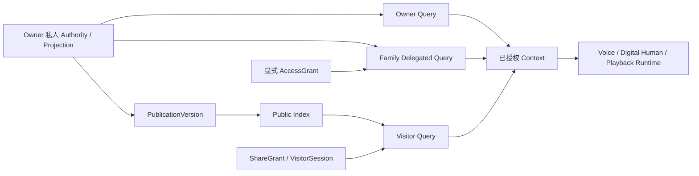

# DreamJourney V4 开发前问题与决策收敛清单

版本：V1.3
日期：2026-07-15
状态：`PRODUCT_CONFIRMED / IMPLEMENTATION_HANDOFF`
评估基线：iOS `feature/prd-stitch-ui-adaptation@983cda7`；Backend `main@4c0538b`

## 0. 文档定位

本文是进入下一轮开发前的二次交叉审计结果，集中区分：

1. 已经由 Product Spec 和 Decision Register 明确的规则；
2. 目标方案与当前代码的直接冲突；
3. 只在具体功能开放前需要补充的产品或交互细节；
4. 依赖法律、Provider、生产环境或真机证据的外部门；
5. 不改变产品语义、但会误导执行的文档和任务治理问题。

本文不是新的 Product Spec，不自动覆盖既有决定。正式权威顺序仍为：

1. [V4 Product Spec](./DreamJourney_V4_产品定义与目标架构_Product_Spec_V4.0.md)
2. [产品决策登记册](./DreamJourney_V4_产品决策登记册_V1.0.md)
3. [当前实现证据矩阵](./DreamJourney_V4_当前实现证据矩阵_V1.0.md)
4. [V4 可执行路线图](../superpowers/plans/2026-07-12-dreamjourney-v4-executable-development-roadmap.md)
5. [评审与验收清单](./DreamJourney_V4_评审与验收清单_V1.0.md)

本次审计逐项对照了 Product Spec 的产品确认修订、三级验证策略、权限矩阵、Candidate/Voice/媒体合同，Decision Register 的 43 条决定，Evidence Matrix 的当前实现事实，以及 Roadmap 的 13 个 Work Package、115 个 Work Item 和 Gate。静态 QA 只能证明结构和追踪关系，不能替代代码、生产、Provider、真机或法律证据。

## 1. 二次审计结论

### 1.1 核心结论

V4 并不存在“产品主体内容普遍未明确”的问题。三 Tab、三级验证策略、Owner Truth Loop、Family 与授权分离、Publication/Visitor 独立查询域、Candidate 审核原则、Voice/Digital Human 分层、媒体后置和删除权等核心规则已经明确。

真正需要处理的是：

| 分类 | 数量 | 是否阻断所有开发 | 处理方式 |
| --- | ---: | --- | --- |
| `CONFIRMED_RULE` | 10 | 否 | 直接作为实现和验收约束，不重复发起产品决策 |
| `IMPLEMENTATION_CONFLICT` | 2 | 阻断对应真实开放 | 立即 containment；按路线图实施并取证 |
| `PRODUCT_DETAIL_CONFIRMED` | 5 | 否；只需按对应 Gate 实施 | 已由产品经理于 2026-07-15 确认并回写权威源 |
| `EXECUTION_GOVERNANCE` | 1 | 不阻断安全基础任务 | 分配 owner，并标注复用/改造/新建差量 |
| `DOCUMENT_STALENESS` | 2 | 否，但会误导协作 | 标记历史快照并更新生命周期状态 |
| `EXTERNAL_GATE` / `DEFERRED` | 10 | 阻断对应真实数据或扩量 | 保持 fail-closed，等待具体外部证据 |

因此当前没有仍需产品侧补答、并阻断下一轮开发的内部范围问题。Stage 0 安全止损、Closed Pilot 文字核心、测试承载面和 shadow/migration 准备可以按路线图继续；具体扩展功能仍须在自身 promotion 前关闭对应外部门。

### 1.2 对 V1.0 初稿的纠正

| 原判断 | 二次审计结论 |
| --- | --- |
| Family 是否坚持“关系不等于授权”仍待确认 | 已由 `DR-003/006/010`、Product Spec 权限矩阵和 Visitor Gate 明确；不应重开，除非产品主动推翻 V4 |
| Candidate 批量审核整体状态机未定 | 核心状态、accept/correct/reject、部分接受、敏感逐条、DecisionReceipt 和幂等已定义；只剩触发参数和恢复 UX 细节 |
| 照片和媒体整体范围未定 | 分期已明确：文字核心不等待媒体；本地草稿不得冒充云端；真实对象与处理器后置。只需决定当前公开照片入口的产品呈现 |
| 98 个 P0 导致路线无法执行 | Registry 已有 releaseClass、stableRank、STOP/NO_GO 和确定性 selector；问题是 owner 与实现差量未填，不是没有顺序 |
| 六项语义全部关闭后才可开发 | 过度阻塞。只有对应 promotion、不可逆动作或外部数据处理需要等待相应决定/Gate |

## 2. 已确认规则，不再列为开放问题

| ID | 已确认规则 | 权威证据 | 工程含义 |
| --- | --- | --- | --- |
| `CRF-01` | 保留“记忆档案 / 回响 / 我的”三个主 Tab | `DR-001`；Product Spec 0.3、5.1 | 不按旧 V3 四 Tab 方案重构 |
| `CRF-02` | 采用 `Closed Pilot -> Product MVP -> Beta Extension` | `DR-043`；Product Spec 0.3、3.0 | 下一层失败只关闭该层，不反向阻断 Owner 文字核心 |
| `CRF-03` | Source -> Candidate -> Owner Decision -> MemoryVersion -> Projection 是唯一事实主干 | `DR-007/015/029`；Product Spec 1.3、15 | KBLite/向量/图/模型输出不能成为事实 Authority |
| `CRF-04` | Family relationship 不自动授予查询权限 | `DR-003/006/010`；Product Spec 角色权限矩阵、17.3 | Family 私人查询必须有独立、可撤销、可过期的 grant |
| `CRF-05` | Visitor 只查 PublicationVersion/Public Index，不查私人 Projection | `DR-002/006/010/038`；Product Spec 3.4 | Visitor query 与 runtime 不能复用 Owner 私有检索旁路 |
| `CRF-06` | Runtime 只消费已授权 Context，不保存事实也不授予权限 | Product Spec 权限和运行时合同 | Voice/DH/Playback 结果不得写回 Persona/Memory Authority |
| `CRF-07` | Candidate 不进入确定性 QA/Publication；普通候选可批量，敏感候选逐条 | `DR-007/015`；Product Spec 3.2、15.2 | 必须保留来源、状态、DecisionReceipt、部分接受和幂等 |
| `CRF-08` | Closed Pilot 不等待真实媒体；本地草稿不得冒充云端成功 | `DR-009/043`；Roadmap `WI-S1-01-12`、`WI-S1-02-11` | 对象上传和媒体理解保持独立 default-off lane |
| `CRF-09` | Voice Clone 属于 Product MVP，Digital Human 属于 Beta Extension | `DR-008/014/037/043`；Product Spec 3.5、17 | Voice/DH 分用途授权，Provider 失败明确降级文字 |
| `CRF-10` | Care、TimeLetter 后置；删除、撤权、账号恢复和 Provider 删除按独立状态/回执处理 | `DR-003/011/016/021/043` | 代码存在不等于公开；不得以本地 tombstone 或单一布尔值宣称完成 |

### 2.1 查询域与运行时域的最终解释



Family 与 Visitor 是查询主体和授权路径，Runtime 是结果消费与表达层。Family 即使在同一家庭，也不能因关系自动绕过 grant；Runtime 也不能把 Provider 输出写回人物事实。这一边界已经确认，不应再作为待决策项。

## 3. 当前必须处理的实现冲突

### 3.1 `PDC-I01` Release Policy 与本地默认开放冲突

**目标规则**

- Future/Beta 功能 default-off。
- Family、Voice 等 Product MVP 扩展也必须由服务端 ReleasePolicy、AuthZ 和 capability 共同放行。
- Policy missing、expired、offline 或 unknown 时 fail-closed，同时保留 Owner 文字核心。

**当前代码事实**

`DreamJourney/Sources/App/FeatureFlagService.swift` 的 `defaultEnabled` 仍包含 `careDashboard`、`familyManagement`、`familySpace`、`timeLetters`、`voiceCloneShell` 和 `digitalHumanLivePanel`。

**结论**

这是目标与当前实现的直接冲突，不是新的产品投票项。客户端 flag 可以承载 QA/debug 或缓存服务端决定，但不能授予权限。对应功能在 server-authoritative policy 和 regression 证据完成前不得据此公开扩量。

**关闭证据**

1. fresh install、upgrade、offline、expired policy 和旧持久化 flag 均 fail-closed；
2. 公开 release regression 不出现未批准入口；
3. Family/Voice/DH/Care/TimeLetter 分别有 capability、AuthZ 和 fallback 证据。

### 3.2 `PDC-I02` Provider 长期凭据仍进入 iOS

**当前代码事实**

- `DreamJourneyBackend/app/main.py` 的数字人 session response 会返回腾讯 `appkey/accesstoken`。
- `DreamJourneyBackend/app/services/tokens.py` 的实时语音配置会返回火山 `appToken/apiKey`。
- iOS 仍解析并消费这些字段。

**目标规则**

本地增加 `expiresAt` 不会把静态 Provider secret 变成真正的短期 credential。正式能力只能使用 Provider 官方短期 session/token、后端代理，或保持关闭。

**结论**

这是 P0 安全阻断，不依赖产品重新选择。它阻断对应 Provider 真实开放，但不阻断文字核心、接口抽象、mock、contract 和 credential inventory。

**关闭证据**

1. credential inventory、scope、TTL、audience、rotation/revoke receipt 完整；
2. Release `.app/.appex`、资源、response、header、日志、QA 导出和备份无长期 secret；
3. 已暴露 credential 轮换/撤销；旧构建和 replay 被拒绝。

## 4. 已确认的产品与交互细节

以下五项已由产品经理于 2026-07-15 确认。它们不关闭工程、Provider、法律、生产或真机 Gate，但可以直接约束对应 Work Item 的实现和验收。

### 4.1 `PDC-D01` Visitor Voice 是否属于 Product MVP 的退出条件

**已经明确**

- Owner 私人 Echo 使用已授权 Voice Clone 是 MVP 最小完成定义。
- 私人/家庭受控语音问答属于 Voice MVP 1。
- Visitor Voice 有独立 purpose、Publication/answer 绑定、7 日 TTL、滥用和 Provider 门。
- Digital Human 不属于 Product MVP。

**产品确认**

Product MVP 基线要求 Owner private + 经授权 Family Voice；Visitor Voice 使用同一合同但作为独立 capability/cohort，不阻断基础 Product MVP 发布。家庭成员客户端播放 Owner/Represented Persona 回响时，必须解析该人物已授权且 active/quality-accepted 的精确 `voiceProfileVersion`；失败时明确降级，不得使用访问者自己的音色、上一角色音色或默认音色冒充 Owner。

### 4.2 `PDC-D02` Closed Pilot 中照片入口的呈现方式

**已经明确**

- 文字 Source 足以完成 Closed Pilot。
- owner-scoped 本地照片/音频/视频草稿可以保留。
- 无真实对象、checksum、HEAD/scan/delete receipt 时不得显示“已上传/已同步”。
- SourceObject 与媒体 processor 是后置、独立 default-off lane。

**产品确认**

Closed Pilot 保留照片选择、本地草稿和本机预览，并明确显示“仅本机保存/尚未云端保存”。该选择只影响入口呈现和 release policy，不改变媒体架构，也不能把 mock metadata 升级为 verified object。

### 4.3 `PDC-D03` Candidate 批量审核的参数与恢复 UX

**已经明确**

- 退出页面前或约 5 至 10 轮后触发，不逐轮弹窗；
- 支持 accept/correct/reject、部分接受和 immutable DecisionReceipt；
- high/unknown sensitivity、第三方负面评价、未成年人内容不得批量确认；
- 未确认材料只能用于追问，不能成为确定性事实。

**产品确认**

Candidate 在对话过程中持续持久化；用户退出页面，或待审核 Candidate 数量/上下文预算达到服务端策略阈值时触发批量审核，以先到者为准。返回、后台、强杀或断网后必须恢复待审核批次；普通候选可批量，敏感候选仍逐条确认。模型上下文截断不得导致 Message、Source、Candidate 或 DecisionReceipt 业务数据丢失。

动态阈值属于服务端 policy，不向首版用户暴露轮数设置。这是 `WI-S1-01-04` 的 UX/policy 参数，不重开 Candidate Authority 设计。

### 4.4 `PDC-D04` Family 关系终止的用户操作语义

**已经明确**

- relationship 与 grant 分离；
- 后端目标合同支持 Invite/Accept/PauseRelationship；
- grant 支持 accept/pause/revoke/expiry；
- 关系或授权变化会影响查询、TimeLetter recipient 和后续 effect；历史审计不能被物理改写。

**产品确认**

支持暂停和终止 Family relationship；任一方可发起，敏感主控关系需要二次确认。终止立即撤销后续查询 grant，保留历史贡献和不可篡改审计；重新建立关系必须重新邀请并重新授权，不恢复旧 grant。已贡献 Source、已发布版本和已到达 TimeLetter 按各自 Authority、rights 和 receipt 合同处理，不因关系终止直接物理删除。

### 4.5 `PDC-D05` 首批 cohort 的操作性选择

**已经明确**

- 产品长期覆盖 Adult Self、Memorial Controller、Guardian Controller、Family 和 Visitor；
- 未成年人、第三方和逝者 Voice/DH 受专项 G4/G3；
- Closed Pilot 不要求 Family/Visitor/Voice/DH；Product MVP 再逐层增加。

**产品确认**

以 Adult Self 作为首个 Closed Pilot；Memorial Controller 在死亡事实、亲属关系和主控任命可验证后进入第二 cohort；Guardian/未成年人保持独立 G4 cohort。该选择不缩减长期产品范围，只控制首次真实数据风险。

### 4.6 产品确认回执区

本节保留产品确认回执。家庭关系不等于授权、Candidate 不直接成为事实、Visitor 只查 Publication、Voice/Digital Human 分层和媒体后置等既有规则未被本次确认重开。

#### `PDC-D01` Visitor Voice 的 Product MVP 发布地位

| 选项 | 定义 | 影响 |
| --- | --- | --- |
| `A`（推荐） | Owner 私人 Voice 和授权 Family Voice 是基础 Product MVP 门；Visitor Voice 使用独立 capability/cohort，不阻断基础 MVP 发布 | 保留 Visitor Voice 合同，降低公开语音、滥用、成本和 Provider 外部门对 MVP 的阻塞 |
| `B` | Visitor Voice 也是 Product MVP release 的必过退出项 | 必须在完整 MVP 发布前同时关闭 Visitor 声音用途、Publication 绑定、滥用、TTL、Provider、成本和真机门 |

- 产品选择：`A`
- 确认人/角色：`产品经理`
- 确认日期：`2026-07-15`
- 补充说明：家庭成员客户端必须使用 Owner/Represented Persona 对应且已授权的 `voiceProfileVersion`，不得借用访问者、上一角色或默认音色冒充。

#### `PDC-D02` Closed Pilot 的照片入口

| 选项 | 定义 | 影响 |
| --- | --- | --- |
| `A`（推荐） | 保留照片选择、本地草稿和本机预览；明确显示“仅本机保存/尚未云端保存” | 不阻断文字核心，同时保留当前产品入口；必须防止误显示同步成功 |
| `B` | Closed Pilot 隐藏照片入口，真实 SourceObject 上传、下载、删除闭环完成后再公开 | 风险最低，但暂时移除当前照片入口的用户价值 |
| `C` | 照片真实云端闭环成为 Closed Pilot 前置 | 会改变已确认的三级验证策略，使媒体 Provider 和对象存储重新阻塞 Closed Pilot，不推荐 |

- 产品选择：`A`
- 确认人/角色：`产品经理`
- 确认日期：`2026-07-15`
- 补充说明：`无`

#### `PDC-D03` Candidate 批量审核触发与恢复

| 选项 | 定义 | 影响 |
| --- | --- | --- |
| `A`（推荐） | 一轮定义为一次完整用户输入与 assistant 回答；默认 8 轮或退出页面时触发，阈值由服务端 policy 配置；批次持久化，强杀/断网后恢复；普通候选可批量，敏感候选逐条；允许稍后处理并保留提醒 | 在 V4 已确认的 5 至 10 轮范围内形成可测试的确定行为 |
| `B` | 只在退出页面时触发，不按轮数主动提示 | 打扰更少，但长会话可能积压大量未审核 Candidate |
| `C` | 由用户在设置中自行选择触发轮数 | 灵活，但增加设置、兼容、默认值和行为解释成本，不适合作为首版前置 |
| `D`（已确认） | Candidate 持续持久化；退出页面或服务端动态阈值先到即触发审核，强杀/断网可恢复 | 保留低打扰体验，并避免模型上下文截断影响业务数据；阈值不作为用户设置 |

- 产品选择：`D`
- 确认人/角色：`产品经理`
- 确认日期：`2026-07-15`
- 补充说明：在上下文接近策略阈值前触发审核；Message、Source、Candidate 和 DecisionReceipt 必须持续持久化，不能依赖模型上下文保存。

#### `PDC-D04` Family 关系终止

| 选项 | 定义 | 影响 |
| --- | --- | --- |
| `A`（推荐） | 支持暂停和终止关系；任一方可发起，敏感主控关系需二次确认；立即撤销后续查询 grant，保留历史贡献和审计；允许重新邀请并重新授权 | 用户可真实退出关系，同时不篡改历史和既有合法内容 |
| `B` | 只允许暂停，不提供永久终止 | 合同较简单，但长期可能产生无法清理的家庭关系和用户投诉 |
| `C` | 终止关系并删除全部历史贡献 | 与 Source Authority、第三方权利、审计和已发布版本冲突，不推荐 |

- 产品选择：`A`
- 确认人/角色：`产品经理`
- 确认日期：`2026-07-15`
- 补充说明：`无`

#### `PDC-D05` 首批真实用户 cohort

| 选项 | 定义 | 影响 |
| --- | --- | --- |
| `A`（推荐） | 首批 Closed Pilot 只开放 Adult Self；Memorial Controller 在死亡/亲属/主控核验闭环后进入第二 cohort；Guardian/未成年人等待独立 G4 | 最快验证 Owner Truth Loop，首批真实数据和法律风险最低 |
| `B` | Adult Self 与已核验 Memorial Controller 同时进入首批；Guardian/未成年人后置 | 更贴近纪念产品定位，但首批同时承担身份、死亡、亲属和争议处理流程 |
| `C` | Adult Self、Memorial、Guardian/未成年人同时进入首批 | 会让专项法律、监护和 Provider Gate 阻塞首批验证，不推荐 |

- 产品选择：`A`
- 确认人/角色：`产品经理`
- 确认日期：`2026-07-15`
- 补充说明：`无`

#### 一次性确认格式

```text
PDC-D01=A
PDC-D02=A
PDC-D03=D
PDC-D04=A
PDC-D05=A
确认人/角色：产品经理
确认日期：2026-07-15
补充说明：D01 家庭成员客户端使用人物对应的已授权音色；D03 退出或动态阈值先到即审核，Candidate 持续持久化。
```

确认后应执行：

1. 将选择、确认人/角色、日期和理由写入 Decision Register；
2. 修改 Product Spec 中与选择直接相关的范围、退出门或 UX 合同；
3. 只调整既有 Roadmap Work Item 的 DoD、Gate 或 release lane，不创建第二套路线图；
4. 重新生成 Trace/Registry 并运行 Product V4 QA；
5. 不因产品确认自动提升当前实现成熟度或关闭 G2/G3/G4。

## 5. 执行与文档治理问题

### 5.1 `PDC-G01` Registry 可执行，但尚未完成 owner 和实现差量

当前 Execution Registry 有 115 个 Work Item：

- `CORE` 83、`MVP_EXTENSION` 20、`MIGRATION` 12；
- `P0` 98、`P1` 17；
- `PLANNED` 115、`UNASSIGNED` 115；
- `STOP` 103、`NO_GO` 12；
- 通过 `stableRank` 和 selector 给出确定性下一动作，当前不是无序任务池。

因此，“98 个 P0”不是路线冲突。真正缺口是：

1. 首批 Work Item 尚未分配 execution owner/authority lease；
2. 现有 Echo、Voice、Digital Human、Family、TimeLetter、KBLite 代码尚未逐项标记 `ADOPT / ADAPT / BUILD / RETIRE / EXTERNAL_ONLY`；
3. 已有代码只能降低工作量，不能在没有 Gate evidence 时把 lifecycle 直接改成 `VERIFIED`。

建议先为 selector 指向的 `WI-S0-03-01` 建立 owner 与差量，然后按 stableRank 逐项推进，不新增第二套路线图。

### 5.2 `PDC-S01` Round5D 最终静态报告已成为历史快照

[Round5D 最终静态验收报告](./reviews/DreamJourney_V4_Round5D_最终静态验收报告.md) 仍记录：

- `REVIEWED_BASELINE_PENDING_COMMIT`；
- 41 条 Decision Record；
- “当前工作树尚未提交”。

当前权威源已经是 43 条 Decision Record，并已在 `983cda7` 建立 canonical commit。历史报告在 2026-07-12 当时可以成立，但如果不加历史快照标记，会被误读成当前状态。

建议将该报告标记为 `HISTORICAL_REVIEW_SNAPSHOT`，保留当时计数和 hash，不直接改写历史验收数据；当前 43 DR 和提交状态由 canonical QA/README 说明。

### 5.3 `PDC-S02` 旧输入文档生命周期标记未完全收口

Product Spec 0.2 与 `DR-030` 已经明确 V4 是唯一产品范围权威；V1 PRD、V3 Blueprint、Hermes/AOS 分析和历史一致性分析只是输入。部分旧文档仍保留“V4 定稿后再标记 superseded”的旧措辞。

建议统一增加 `SUPERSEDED_BY_V4 / HISTORICAL_INPUT` banner，保留正文和 FR 来源但禁止直接据其旧 P0/P1、四 Tab 或能力开放口径排期。

## 6. 外部门和延期决定

以下 10 项不是文档矛盾，也不能由工程自行宣布关闭。

### 6.1 `EXTERNAL_REQUIRED`（7）

| Decision | 主题 | 未关闭前的默认 |
| --- | --- | --- |
| `DR-009` | 对象存储、扫描、OCR/ASR/PDF/DOCX Provider | mock/local-only 不公开为云能力 |
| `DR-017` | 地域、匿名、声音、留存、成本总入口 | 不采集、出站或公开对应高风险数据 |
| `DR-020` | Hermes 目录凭据整改 | DreamJourney 不读取或复制其凭据/Memory |
| `DR-022` | 未成年人和第三方权利 | 高风险用途仅隔离草稿或保持 blocked |
| `DR-026` | 中国首发具体部署区、跨境、processor/subprocessor | 未批准 processor 不接收真实正文、声音或生物特征 |
| `DR-031` | Provider 训练、留存、删除和事件条款 | 不发送真实高敏数据 |
| `DR-036` | 第三方、未成年人、逝者用途和 RightsRequest | Publication/Voice/DH 高风险能力 blocked |

### 6.2 `DEFERRED`（1）

- `DR-027`：精确商业成本和扩量预算。延期不等于无界使用；工程硬配额、熔断、分母、成本证据和文字降级仍是前置要求。

### 6.3 `RECOMMENDED_PENDING`（2）

- `DR-034`：legacy confirmed 数据迁移为 Memory v1 的证据阈值。
- `DR-035`：普通授权撤销后，删除、导出、限制处理和审计任务使用的最小 machine authorization。

## 7. 建议的收敛与开发顺序

### Step 1：立即执行，不等待新的产品决定

1. 按 `WI-S0-03-01` 处理 credential inventory/containment，禁止长期 Provider secret 继续进入客户端正式能力。
2. 按 `WP-S0-06` 收敛 server-authoritative ReleasePolicy，修复本地默认开放冲突。
3. 为首批 Work Item 分配 owner/authority lease，并记录 `ADOPT/ADAPT/BUILD/RETIRE/EXTERNAL_ONLY` 差量。
4. Stage 0 与 Closed Pilot 的 schema、contract、test、shadow 和可逆代码工作按路线图继续。

### Step 2：按已确认细节实施并在对应 promotion 前验收

| 细节 | 最晚关闭时间 |
| --- | --- |
| `PDC-D01` Visitor Voice 是否阻断 MVP release | `WP-V0-01` exit/G4 前 |
| `PDC-D02` Closed Pilot 照片入口呈现 | Archive release policy/G1 前 |
| `PDC-D03` Candidate 触发与恢复 UX | `WI-S1-01-04` G1 前 |
| `PDC-D04` Family 关系终止 UX | Family public promotion/G4 前 |
| `PDC-D05` 首批 cohort | 首次真实用户数据进入前 |

确认结果已回写 Product Spec 和 Decision Register；本文保留产品回执与工程交接解释，不单独覆盖权威源。

### Step 3：按能力关闭外部门

Provider、地域、真机、短信、备份恢复、法律、成本和删除回执分别按 G2/G3/G4 取证。某一扩展 lane 被阻断时保持 default-off，不得将阻断扩大为停止全部文字核心开发，也不得通过 mock 或本地成功文案绕过。

### Step 4：更新文档生命周期

1. Round5D 标记历史快照；
2. 旧 PRD/V3/分析统一标记 `SUPERSEDED_BY_V4 / HISTORICAL_INPUT`；
3. 重新生成 Trace/Registry 并运行 Product V4 QA；
4. 当前实现证据只有在重新读取相应代码提交和验证证据后才更新成熟度。

## 8. 允许继续开发的边界

现在可以继续：

- Stage 0 身份、AuthZ、credential、DB readiness/restore、Rights、ReleasePolicy 和 evidence；
- Closed Pilot 的 Source/Candidate/DecisionReceipt/MemoryVersion/Projection/Owner QA contract、test、shadow 和可逆实现；
- iOS 测试承载面、账户隔离、typed client/view state 和不改变 Stitch 主视觉的内部重构；
- 外部门能力的 port、mock、contract、fail-closed 和证据工具。

现在不能宣称或执行：

- 用现有 feature flag 代表产品批准或授权；
- 把 Provider ready、一次 smoke、模拟器 PCM 或数字人显示当成 Voice/DH 完成；
- 把本地照片、mock upload 或 metadata 当成云端 verified SourceObject；
- 让 Family relationship 自动授予私人查询；
- 让 Candidate、AI 分析、assistant/Visitor/runtime 输出成为已确认人物事实；
- 在外部门未关闭时开放未成年人、第三方或逝者 Voice/DH、公开 Publication 或真实高敏数据出站；
- 因为文档静态 QA 通过而把任何 Work Item 批量标记为完成。

## 9. 本文不做的事情

- 不因本文自动修改业务代码；产品确认通过 Product Spec、Decision Register 和既有 Roadmap 落地。
- 不自动关闭外部、生产、Provider、法律、成本或真机 Gate。
- 不将历史实现标记为 V4 已完成。
- 不创建第二套产品 Authority、数据模型或执行路线图。
- 不要求五项产品细节全部关闭后才允许进行无关的安全与文字核心开发。
