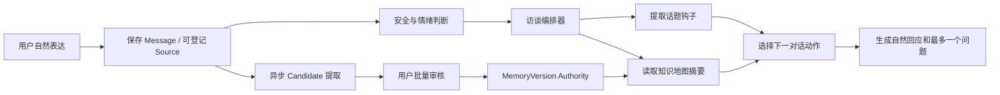

# DreamJourney V4 引导式访谈与知识丰满化功能说明

版本：V1.0
日期：2026-07-16
状态：产品负责人已确认核心交互原则；工程实现与真实用户验证未完成
适用阶段：M0 记忆资产验证，后续由 M1-M4 复用
产品权威：[DreamJourney V4 产品定义与目标架构 Product Spec](./DreamJourney_V4_产品定义与目标架构_Product_Spec_V4.0.md)
决策依据：[DreamJourney V4 产品决策登记册](./DreamJourney_V4_产品决策登记册_V1.0.md)中的 `DR-007`、`DR-015` 及 3.9 节
风险边界：[寻梦环游产品问题、风险分级与整体规避方案](./寻梦环游_产品问题风险分级与整体规避方案_V1.0.md)

> 本文是 M0“引导问答”能力的专项功能合同。它细化已有 `FR-CHAT-001..003`、`FR-MEM-001..002` 和 `FR-QA-001`，不新增第二套 Memory Authority，不改变 M0-M4 合规边界，也不表示当前代码已经实现。

## 1. 背景与问题

如果系统只是把用户每次说过的话保存下来，会形成大量可搜索的聊天片段，但很难形成丰满、可信、可调用的个人知识库：

- 同一故事可能在不同时间被重复讲述，却没有合并和补全。
- 用户容易只谈最近或最熟悉的话题，人生知识结构长期失衡。
- 故事常停留在“发生了什么”，没有继续沉淀原因、选择、结果和经验。
- 专业经验可能只有结论，没有适用条件、例外情况和判断依据。
- 主题持续增长后，要求用户从成百上千个主题中选择和管理会变成新的负担。
- 如果 AI 为了补字段机械追问，用户会感觉在填写问卷或接受审问。

因此，DreamJourney 不能只做“说到哪里、记到哪里”，而应建设一个藏在自然对话背后的引导式访谈能力：

> 用户只需要自然表达；系统负责理解当前话题、发现值得继续的线索、判断知识缺口，并在尊重用户意愿和情绪边界的前提下，一次多问一个恰当的问题。

## 2. 已确认产品结论

### 2.1 永久入口保持一个

长期主入口固定为自然输入：

> **今天想聊点什么？**

用户可以文字输入或直接讲述。以下内容不作为长期并列主入口：

- “随便聊聊”不单独设按钮，自然输入本身就是随便聊。
- “继续上次的故事”由动态推荐承担。
- “选择一个主题”不作为主入口，不展示不断增长的主题目录。

知识主题可以持续增长，但入口数量不能随之增长。

### 2.2 两个推荐位承担不同职责

系统最多展示两条动态推荐，不从同一总分榜中简单取前两名：

| 推荐位 | 固定职责 | 用户感受 |
| --- | --- | --- |
| 推荐一：接着聊 | 延续用户近期主动表达和未完成故事 | “它记得我上次聊到哪里” |
| 推荐二：换个角度 | 补足重要但缺失的知识维度 | “它帮助我看见还没有讲述的自己” |

如果没有合适且安全的候选，可以只展示一条或不展示，不能为了占满位置强行推荐。

### 2.3 主题由系统管理，不由用户维护

用户不需要创建、命名、合并或归档上千个主题。系统负责：

- 将新表达关联到既有故事或经验。
- 判断是新主题、旧主题补充还是普通细节。
- 合并重复线索，避免主题无限碎片化。
- 维护待续、暂缓、禁问和已充分状态。
- 将稳定结构投影为人生地图和语义搜索结果。

### 2.4 模式半显性，状态全隐性，控制权显性

| 能力 | 用户可见性 | 产品表现 |
| --- | --- | --- |
| 访谈模式 | 半显性 | 用户可从推荐进入，系统也可自动识别；明显深挖前征求同意 |
| 当前话题 | 轻度可见 | 可显示“正在聊：第一次创业”，用户可换话题 |
| 深挖轮次 | 不可见 | 后台控制何时追问、总结或暂停 |
| 用户疲劳 | 不可见 | 只通过降低追问、自然收束体现，不显示疲劳分数 |
| 跳过和边界 | 明确可见 | 提供“这次跳过、以后再聊、不再问” |

## 3. 产品目标与非目标

### 3.1 产品目标

1. 让用户在自然聊天中逐步形成更完整的人生记录和经验知识。
2. 让 AI 知道已经了解什么、缺少什么以及现在适不适合继续问。
3. 把故事中的隐性经验转化为可确认、可追溯、可复用的知识资产。
4. 让推荐长期保持简单，不随着主题数量增长而变成目录管理工具。
5. 让用户始终拥有话题方向、跳过、暂缓、禁问和纠正权。

### 3.2 非目标

- 不以增加聊天时长、连续签到或推荐点击率为唯一优化目标。
- 不要求用户完成一份固定的人生问卷。
- 不追求展示“人生完成度 67%”等伪精确指标。
- 不把 AI 发现的知识缺口当作用户事实。
- 不允许访谈编排器直接写入已确认记忆。
- 不因知识地图存在缺口而主动追问创伤、疾病、丧亲或家庭冲突。
- 不使用 Persona、逝者声音或亲密关系表达诱导用户继续聊天。
- 不新增主 Tab，也不建立第二套独立知识库。

## 4. 整体体验

### 4.1 首页与回响入口

```text
今天想聊点什么？
[输入文字或按住说话]

接着聊
第一次创业后，你具体改变了哪些经营习惯？

换个角度
父亲当年对你创业的态度，有没有影响你后来对风险的判断？
```

界面要求：

- 自然输入始终是视觉主入口。
- 推荐是可忽略的辅助，不表现为待办任务。
- 推荐直接呈现具体问题，不显示“职业经历”“家庭关系”等抽象分类卡。
- 每条推荐说明的上下文应来自用户可访问的已确认记忆或用户明确保存的待续线索。
- 推荐区最多两条，不能横向堆叠大量主题。

### 4.2 新用户阶段

新用户尚无个人知识时，可以使用少量稳定的访谈起点：

- 童年与家庭
- 求学与成长
- 职业与选择
- 重要的人
- 高光与低谷
- 想留给未来的话

这些只用于冷启动，不是会不断增长的主题目录。用户完成初步输入后，系统转入动态推荐。

### 4.3 成熟用户阶段

长期使用后，用户主要通过三种方式进入内容：

1. 自然输入：直接说当前想说的内容。
2. 动态推荐：接着聊一条，换个角度一条。
3. 次级工具：通过人生地图或语义搜索回顾历史。

### 4.4 访谈结束反馈

系统不显示知识库完成百分比，而显示本次真实变化：

```text
今天补充了
· 第一次创业的完整经过
· 两条关于团队扩张的经验
· 一个关于现金流的判断原则

以后可以继续
· 合伙人在这次失败中的影响
· 第二次创业时你改变了什么
```

“今天补充了”只能来自本轮用户陈述和待确认/已确认结果；不能把 AI 推断包装成已经沉淀的事实。

## 5. 个人知识地图

### 5.1 首版稳定维度

M0 使用六个一级维度，后续可以扩展字段，但不轻易增加用户可见顶层分类：

| 一级维度 | 主要回答 |
| --- | --- |
| 人生阶段 | 这个人在不同阶段经历了什么 |
| 重要人物 | 谁影响了他，关系如何变化 |
| 关键选择 | 为什么做出选择，结果和反思是什么 |
| 专业经验 | 知道什么、会做什么、如何判断与解决问题 |
| 价值观 | 什么重要、为什么重要、何时发生变化 |
| 愿望与边界 | 想完成什么、想留下什么、哪些内容不愿被询问或使用 |

### 5.2 内部层级

```text
稳定知识维度
  └─ 人生阶段或专业领域
      └─ 故事 / 经验主题
          └─ 原始 Source、Candidate 与已确认 MemoryVersion
```

示例：

```text
关键选择
└─ 创业经历
   ├─ 2018 年第一次创业
   │  ├─ 为什么开始
   │  ├─ 扩张决策
   │  ├─ 现金流危机
   │  └─ 失败后的改变
   └─ 2022 年第二次创业
```

“现金流”“快速扩张”“合伙人冲突”可以是故事中的子线索或标签，不必都升级为顶层主题。

### 5.3 人生地图不是事实 Authority

知识地图是从 Source、Candidate、MemoryVersion 和关系中生成的可重建 Projection。它用于：

- 判断覆盖与缺口。
- 生成访谈候选。
- 帮助用户回顾和搜索。
- 展示待续线索。

它不得：

- 绕过 Owner 确认直接创建事实。
- 把 AI 推断的空白当作真实经历。
- 因覆盖度较低而自动公开或调用敏感资料。
- 取代 Source、DecisionReceipt 和 MemoryVersion Authority。

## 6. 从故事到可复用知识

### 6.1 故事完整性

一段重要经历可以围绕以下内容逐步补全：

```text
时间与背景
→ 参与人物
→ 发生的问题或冲突
→ 当时的选择
→ 采取的行动
→ 结果与影响
→ 事后反思
```

并非每个故事都必须补齐全部字段。系统只在用户愿意且当前适合时追问。

### 6.2 经验知识完整性

对于专业或人生经验，进一步沉淀：

```text
问题背景
→ 可选方案
→ 判断依据
→ 实际行动
→ 最终结果
→ 可复用原则
→ 适用条件
→ 例外与失败边界
```

示例：

用户说：

> “第一次创业失败以后，我就不再盲目扩张了。”

系统不只保存这句话，而可以在适当节奏下追问：

1. 当时最早出现的危险信号是什么？
2. 为什么没有及时停下来？
3. 这次经历后形成了哪些判断标准？
4. 现在遇到类似情况会先看哪些指标？
5. 这套经验在什么情况下可能不适用？

最终可形成事件、决策案例、经验原则和适用边界，但都必须经过用户审核，不能由模型直接升格为个人事实或普遍真理。

## 7. 访谈编排器

### 7.1 核心职责

`Interview Orchestrator` 位于 Conversation 与 Memory 之间，负责决定下一步对话动作，不负责确认记忆。



### 7.2 对话动作

| 动作 | 适用场景 | 结果 |
| --- | --- | --- |
| `LISTEN` | 用户正在自然讲述，不宜打断 | 回应理解，不追加主要问题 |
| `DEEPEN` | 当前故事重要且存在高价值缺口 | 沿当前线索追问一个问题 |
| `CLARIFY` | 时间、人物、因果或表达有歧义 | 请求用户澄清，不自行猜测 |
| `BROADEN` | 当前故事已基本完整，可连接另一维度 | 经自然过渡换一个角度 |
| `SUMMARIZE` | 连续深挖后需要收束或确认理解 | 总结并询问是否准确 |
| `PAUSE` | 用户疲劳、敏感或明确不愿继续 | 停止追问，保存可续状态 |

### 7.3 结构化决策

编排器先输出结构化动作，再由模型负责自然表达：

```json
{
  "action": "DEEPEN",
  "threadId": "thread_first_startup",
  "targetDimension": "key_decision",
  "anchorMemoryVersionIds": ["memv_123"],
  "missingFacet": "why_expansion_was_not_stopped",
  "sensitivity": "normal",
  "maxFollowupsRemaining": 2,
  "reasonCode": "HIGH_VALUE_INCOMPLETE_STORY"
}
```

大模型负责“怎么问得自然”，确定性策略负责“能不能问、为什么问、最多问几次”。

## 8. 两条动态推荐

### 8.1 推荐一：接着聊

目标：延续用户当前兴趣和叙事连续性。

候选优先级：

1. 用户明确选择“以后再聊”且冷却期已结束的线索。
2. 最近一次自然中断但尚未讲完整的故事。
3. 用户近期主动多次提到的人物或事件。
4. 已到关键位置，只缺原因、结果或反思的内容。
5. 与用户当前输入高度相关的旧故事。

示例：

> **接着聊：第一次创业之后，你做决策的方式具体发生了哪些变化？**

### 8.2 推荐二：换个角度

目标：避免知识库长期围绕少数话题打转，补足理解这个人的另一块拼图。

候选优先级：

1. 重要但覆盖较弱的一级维度。
2. 已有故事中缺少选择依据、代价、反思或边界的部分。
3. 与当前主题存在证据关联的其他人生阶段或人物。
4. 可验证同一价值观或判断模式的另一个场景。
5. 对后代或同行具有较高经验沉淀价值的内容。

示例：

> **换个角度：你现在对风险的判断，最早是受家庭影响，还是后来工作中形成的？**

### 8.3 推荐优先级

推荐决策必须遵守：

```text
用户明确意愿
> 情绪与隐私安全
> 对话连续性
> 知识完整性
> 系统判断的重要性
```

候选评分可以使用以下结构，但不能让总分覆盖硬规则：

```text
推荐价值
= 用户主动意愿
+ 与近期对话的连续性
+ 对理解用户的重要性
+ 对知识地图的新增信息量
+ 故事或经验的未完成程度
+ 与其他已确认记忆的关联价值
+ 时间上的适宜程度
- 敏感风险
- 重复推荐
- 用户疲劳
- 暂缓或跳过惩罚
```

### 8.4 两个推荐位的去重

- 两条推荐原则上不能属于同一 `ConversationThread + missingFacet`。
- 第二条应补充不同维度或不同理解角度，不能只是第一条换个说法。
- 如果只有一个合格候选，只展示一个。
- 如果没有合格候选，推荐区可以为空。

### 8.5 禁止进入推荐池

- 用户设置为“不再问”的话题。
- “以后再聊”仍在冷却期的话题。
- 连续两次跳过且没有重新主动提起的内容。
- 丧亲、创伤、疾病、家庭冲突等敏感主题，除非用户近期主动提起并允许继续。
- 来源不可靠、仅由 AI 推断出的线索。
- 已经内容充分、只会增加聊天时长的主题。
- 可能导致未成年人压力、人格定型或虚拟亲属关系的内容。
- 与当前危机、安全事件或权利争议冲突的内容。

## 9. 对话节奏与用户控制

### 9.1 单轮规则

- 每轮最多提出一个主要问题。
- 用户正在连续讲述时优先 `LISTEN`，不为了补字段打断。
- 明显敏感的问题先询问用户是否愿意继续。
- 用户主动换话题后立即跟随，不要求完成当前主题。

### 9.2 深挖与总结

- 同一线索连续深挖通常不超过 2 至 4 轮。
- 达到上限后优先 `SUMMARIZE`，让用户确认系统理解。
- 总结后由用户决定继续、换话题或结束。
- 现有“约 5 至 10 轮或退出时批量确认 Candidate”的 M0 规则保持不变；深挖轮次与 Candidate 批量审核节奏是两个独立状态。

### 9.3 疲劳识别

疲劳状态只在内部使用，不向用户显示分值。可参考：

- 回答明显变短或连续使用“嗯、差不多、不知道”。
- 连续跳过问题。
- 回答间隔显著变长。
- 多次主动换话题。
- 明确表示“不想说了”或“今天先到这里”。
- 连续深度访谈时间过长。

触发后，系统自然收束：

> “这段我们先记到这里。刚才已经留下了不少重要内容，今天不用一次讲完。”

禁止显示“检测到你的疲劳值为 72%”等机械或诊断式表达。

### 9.4 跳过与边界

| 用户操作 | 系统语义 |
| --- | --- |
| 这次跳过 | 本轮不回答，未来仍可在自然语境中提及 |
| 以后再聊 | 保存为待续线索，进入可配置冷却期 |
| 不再问这个话题 | 加入长期主动禁问；用户主动重开前不得推荐或追问 |
| 换一条 | 仅替换当前推荐，不等于否定整个主题 |
| 不感兴趣 | 降低该主题或推荐类型权重，并记录反馈原因 |

## 10. 实时与异步双链路

### 10.1 实时链路

```text
保存用户 Message
→ 安全与敏感判断
→ 提取本轮轻量话题钩子
→ 读取知识地图摘要和当前 Thread
→ 决定对话动作
→ 生成自然回应与最多一个问题
```

实时链路不重新分析整个知识库，只读取受限摘要和必要证据，避免延迟与成本失控。

### 10.2 异步链路

```text
用户 Message / Source
→ 提取候选记忆
→ 识别人物、事件、决策和经验
→ 建议 Thread 合并或新建
→ 计算待确认知识缺口
→ 用户批量审核
→ 更新 MemoryVersion
→ 重建知识地图 Projection 与推荐候选
```

只有用户确认后的 MemoryVersion 才能提高“已确认覆盖”；未确认 Candidate 只能形成待确认线索，不能作为事实或稳定人格依据。

## 11. 数据对象与状态

### 11.1 核心对象

| 对象 | 作用 | Authority 类型 |
| --- | --- | --- |
| `InterviewBlueprint` | 定义自传、人生复盘、专业经验等访谈目标和允许维度 | 版本化产品配置 |
| `InterviewSession` | 记录本次访谈目标、模式、节奏和状态 | 会话控制记录 |
| `ConversationThread` | 聚合同一故事或经验的多次对话线索 | Owner 范围的主题控制记录 |
| `ThreadPreference` | 记录跳过、暂缓、禁问、冷却和用户重开 | 用户控制 Authority |
| `KnowledgeDimension` | 六个稳定维度及版本化定义 | 产品配置 |
| `DimensionCoverage` | 从已确认记忆计算覆盖、证据和缺口 | 可重建 Projection |
| `KnowledgeGap` | 某故事或经验尚缺的内容面 | 可重建建议，不是事实 |
| `InterviewDecision` | 本轮采取何种对话动作及原因 | 审计/可解释决策记录 |
| `RecommendationCandidate` | 推荐池中的候选问题和资格状态 | 短期 Projection |
| `RecommendationFeedback` | 换一条、暂缓、不感兴趣、不再问 | 用户控制与推荐反馈 |

### 11.2 ConversationThread 状态

```text
active
→ sufficiently_covered
→ archived

active → deferred → active
active → do_not_ask → active（仅用户主动重开）
active → disputed / suspended
```

### 11.3 推荐状态

```text
eligible
→ shown
→ accepted
→ skipped
→ deferred
→ dismissed
→ blocked
→ expired
```

推荐记录必须有过期时间，不能长期缓存旧问题；相关 MemoryVersion、权利、安全或 Thread 状态变化时立即失效。

## 12. 与现有 Authority 的关系

### 12.1 不新增第二套事实库

```text
Message / Source
→ MemoryCandidate
→ DecisionReceipt
→ MemoryVersion
→ Knowledge Projection
→ DimensionCoverage / KnowledgeGap / Recommendation
```

`ConversationThread` 用于组织访谈，不等于人物事实。`KnowledgeGap` 表示系统尚不了解什么，不表示某件事情真实存在。

### 12.2 用户与 AI 内容边界

- 用户最终输入可以登记为 Source。
- assistant 的追问和推荐不能自动成为 Source。
- 用户对 AI 总结的确认可以形成 DecisionReceipt 或新的用户 Source。
- AI 对人格、情绪和关系的推断保持 `proposed/ai_inference`，不能直接更新已确认覆盖。
- 推荐问题不得泄露用户当前无权访问的第三方或家庭资料。

## 13. 功能需求

| ID | 功能要求 | 优先级 |
| --- | --- | --- |
| GIC-001 | 回响页提供一个长期自然输入主入口 | P0 |
| GIC-002 | 系统最多展示一条连续性推荐和一条完整性推荐 | P0 |
| GIC-003 | 没有安全候选时允许少于两条，不强制补位 | P0 |
| GIC-004 | 推荐必须是具体、有上下文的问题，而不是主题分类名称 | P0 |
| GIC-005 | 系统维护当前 Thread、深挖轮次、疲劳和跳过状态 | P0 |
| GIC-006 | 每轮最多提出一个主要问题 | P0 |
| GIC-007 | 连续深挖 2 至 4 轮后优先总结确认 | P0 |
| GIC-008 | 提供这次跳过、以后再聊和不再问三种不同控制 | P0 |
| GIC-009 | `do_not_ask` 话题不得被系统主动推荐或追问 | P0 |
| GIC-010 | 敏感话题未经用户近期主动提起和许可不得进入推荐池 | P0 |
| GIC-011 | 主题自动合并、关联和收敛，不要求用户维护主题目录 | P1 |
| GIC-012 | 人生地图和语义搜索作为次级回顾工具 | P1 |
| GIC-013 | 访谈结束展示本次补充和以后可续线索，不显示完成百分比 | P1 |
| GIC-014 | 推荐和访谈决策保留原因码、策略版本和最小审计信息 | P0 |
| GIC-015 | 推荐与知识覆盖只能从当前用户有权访问的数据生成 | P0 |
| GIC-016 | 危机和安全策略可以覆盖访谈动作并切换中性安全模式 | P0 |

## 14. 推荐与编排验收标准

### 14.1 基础体验

- [ ] 首页和回响不存在会持续增长的“选择一个主题”主目录。
- [ ] 任一时刻动态推荐不超过两条。
- [ ] 第一条推荐可解释为近期连续性，第二条可解释为知识完整性。
- [ ] 两条推荐不是同一问题的改写，也不指向相同 Thread 缺口。
- [ ] 没有候选时可以不显示推荐，输入功能仍可正常使用。

### 14.2 对话节奏

- [ ] 每轮最多出现一个主要问题。
- [ ] 用户连续讲述时系统能够选择 `LISTEN`，而不是每轮都追问。
- [ ] 同一线索深挖达到配置上限后先总结，再决定是否继续。
- [ ] 用户主动换话题后，当前 Thread 能在一轮内切换或进入待续。
- [ ] 疲劳状态不以分数或诊断形式显示给用户。

### 14.3 用户控制

- [ ] “这次跳过”不会被误处理为永久禁问。
- [ ] “以后再聊”在冷却期内不会再次推荐。
- [ ] “不再问”后自动推荐和主动追问命中数为 0。
- [ ] 用户主动重新提起禁问话题时，系统先确认是否恢复主动询问。
- [ ] 推荐反馈可以区分问题问法、当前时机和整个主题偏好。

### 14.4 知识与证据

- [ ] 推荐依据能追溯到当前用户可访问的 MemoryVersion、用户保存的待续线索或明确的冷启动 Blueprint。
- [ ] 仅由 AI 推断且无可靠来源的线索不能进入主动推荐。
- [ ] 未确认 Candidate 不能提高已确认知识覆盖。
- [ ] 访谈编排器不能直接创建或修改 MemoryVersion。
- [ ] 主题合并不会删除 Source、MemoryVersion 或历史陈述视角。

### 14.5 安全与隐私

- [ ] 创伤、丧亲、疾病和家庭冲突不会仅因“知识缺口大”而被主动推荐。
- [ ] 危机表达能够覆盖当前访谈动作，停止普通追问。
- [ ] 未成年人虚拟亲属、决定性人格和职业定型问题被服务端阻断。
- [ ] 跨 Vault、已撤权、已删除、争议或受限第三方内容不会进入推荐。
- [ ] 推送通知不使用 Persona 或逝者口吻召回用户继续访谈。

## 15. 指标与反优化约束

### 15.1 建议指标

| 指标 | 用途 |
| --- | --- |
| 推荐后有效讲述率 | 判断问题是否帮助用户自然开口，不等同于点击率 |
| Thread 阶段完整率 | 重要故事是否从片段形成可确认结构 |
| 经验边界补充率 | 专业经验是否补充适用条件和例外 |
| Candidate 确认/修正率 | 判断追问是否形成用户认可内容 |
| 重复推荐率 | 检查系统是否围绕同一问题打转 |
| 推荐跳过原因分布 | 改善问题、时机和主题选择 |
| `do_not_ask` 违规数 | 必须为 0 |
| 未经主动许可的敏感推荐数 | 必须为 0 |
| AI 推断误作推荐依据数 | 必须为 0 |

### 15.2 不能单独优化的指标

- 单次会话时长。
- 日均消息数。
- 推荐点击率。
- 连续使用天数。
- 用户对单一 Persona 的依赖程度。

这些指标上升不能证明知识库变得更丰满，也不能覆盖用户疲劳、安全、跳过和禁问边界。

## 16. 技术融入现有架构

M0 继续采用模块化单体和现有 Source→Candidate→MemoryVersion 主干。新增能力作为模块和 Projection 融入，不拆独立微服务：

| 现有模块/工作项 | 增量职责 |
| --- | --- |
| Conversation / `WI-S1-03-05` | 管理 InterviewSession、当前 Thread、动作和单问题回应 |
| Candidate / `WI-S1-01-03` | 提取故事 Facet、经验结构和 Thread 建议，不直接确认 |
| Candidate Review / `WI-S1-01-04` | 批量审核访谈产生的 Candidate，保持来源和部分接受 |
| Memory / `WI-S1-01-05` | 保存确认后的事件、知识、决策、价值与关系版本 |
| Projection / `WI-S1-01-06` | 构建 DimensionCoverage、KnowledgeGap 和 Thread 摘要 |
| Owner QA / `WI-S1-01-07` | 为推荐和访谈提供最小 EvidenceBundle，不暴露未授权数据 |
| iOS Typed Use Case / `WI-S1-03-04` | 展示本次补充、待确认结果、地图和搜索 |
| ReleasePolicy / `WP-S0-06` | 控制推荐、敏感主题、未成年人、安全覆盖和 cohort |
| Audit / `WP-S0-07` | 保存策略版本、原因码和最小化指标，不记录不必要正文 |

现有 115 个 Work Item 数量保持不变。本功能是上述工作项的产品与验收细化，不创建旁路实现包。

## 17. 分阶段落地

### 17.1 M0-A：最小引导闭环

- 一个自然输入入口。
- 当前 Thread 与五种核心动作：`LISTEN/DEEPEN/CLARIFY/SUMMARIZE/PAUSE`。
- 每轮最多一个问题。
- 跳过、以后再聊和不再问。
- 用户 Message→Candidate→批量审核。

### 17.2 M0-B：双推荐与知识地图

- 增加 `BROADEN` 动作。
- 上线一条连续性推荐和一条完整性推荐。
- 六个稳定知识维度和 Thread 自动归并。
- 本次补充与以后可续反馈。
- 人生地图只读浏览和语义搜索。

### 17.3 M0-C：评测和个性化

- 基于真实用户校准冷却期、深挖轮次和疲劳信号。
- 建立推荐离线评测集、敏感推荐红队集和重复问题基线。
- 优化不同用户类型的 Blueprint 权重，不改变统一 Authority。
- 不在真实证据前使用强化学习自动追求更长会话。

## 18. 最终产品定调

引导式访谈不是在聊天页面增加一个问题推荐组件，而是把 DreamJourney 的记忆采集方式从“被动记录”升级为“有边界的主动倾听”。

它的长期价值不是让用户聊得更多，而是：

> **让 AI 知道已经理解了什么、还有什么值得问，也知道什么时候不该问；在不增加用户管理负担的情况下，把零散表达逐步整理成丰满、可信、可调用的个人知识资产。**

产品必须始终守住三条线：

1. 用户决定想聊什么，系统不以知识完整性压过人的意愿。
2. AI 决定如何引导，但只有用户能够确认自己的长期记忆。
3. 主题可以无限增长，入口、认知负担和用户需要管理的对象必须保持有限。
