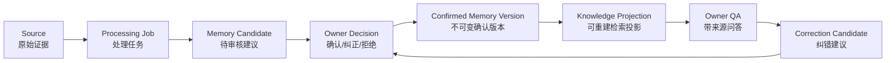
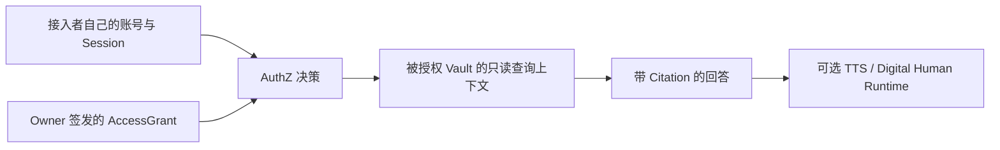
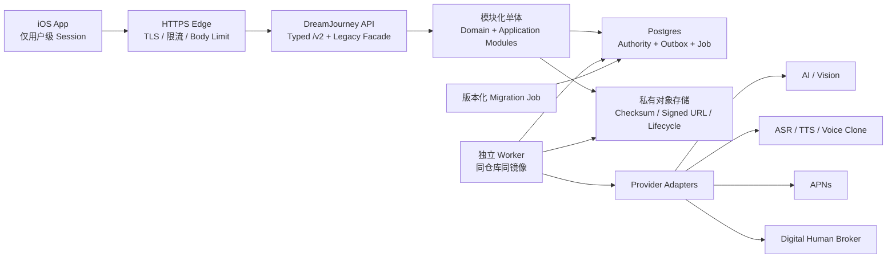

# DreamJourney_V4_方案架构评审解读_独立方案评审_2026-07-15

版本：V1.6 Product Decision + Staged Validation Synchronized
初版日期：2026-07-13
更新日期：2026-07-15
评审对象：`DreamJourney_V4_成果物_2026-07-15`
评审口径：只评目标产品与方案架构，不结合本地源码，不判断当前工程完成度

> **历史基线提示（2026-07-17）：** 本文件冻结 2026-07-15 产品回复和旧三级验证结论，不再是当前发布范围 Authority。受新规影响的全龄虚拟亲属、家庭代录、逝者 Voice/DH、导出能力和发布阶段，以 `DreamJourney_V4_方案架构评审解读_新规生效增量复审_2026-07-16.md`、Product Spec V4.4 和 Decision Register V1.4 为准。本文件仅用于追踪结论变化。

本版权威评审基线：

| 成果物 | SHA-256 |
| --- | --- |
| Product Spec V4.0 | `381dcbca3c910e916688cc40ac7e12d6924cb5d002316a3066dafc70dc481f1e` |
| V4 可执行开发路线图 | `f5ba8f186e23e956efefb933a9e6a19cca6d6a4ea7f787ef558770ee064a69df` |
| 产品决策登记册 | `bbcab7a07fbdcc6e8124fde3b5c56fa0cbf8d57f3dc4ff507e0dbcf18201c10c` |
| 当前实现证据矩阵 | `0eb0be89047896beb2329bbc33833933301463ec69fd06d59784a29799f2fcc9` |
| 评审与验收清单 | `49333cd3404daea534be61d656a46ea954178d931d711183475f61052b0a6b0a` |
| 路线追踪矩阵 | `7582710efa8b779a7ca961039401cd1a2bef6fc95d0728a1575dcbe72c65c4aa` |
| 路线执行注册表 | `29feeb63474f5cd8fc8af2cb032db95a8017b5064ca78bab820ba560f081c636` |

2026-07-15 已依据第21章产品回复及后续三级验证策略确认同步 Product Spec、产品决策登记册、路线图、证据矩阵和验收清单，并重新生成路线执行注册表与路线追踪矩阵。历史 Round 5D 报告继续只代表原冻结基线；本次同步结果以新增的 2026-07-15 交付记录和本文件最终哈希为准。

## 1. 评审结论

### 1.1 一句话结论

DreamJourney V4 的核心架构方向成立。它把产品从“数字人功能集合”收敛为“由在世用户掌控证据、确认、纠正和分享边界的私人记忆与纪念人格系统”，并围绕单一数据权威、最小授权、可追溯异步任务和渐进迁移建立目标架构。2026-07-15 产品负责人已完成40项逐项回复并追加接受三级验证建议：`Closed Pilot` 先验证文字记忆闭环，`Product MVP` 再加入家庭协作、受控 Publication/Visitor 与 Voice Clone，`Beta Extension` 承载 Digital Human、非必要媒体和后续能力；当前百级用户采用 Startup Lean Profile。Product Spec 18.2A 的 Projection/Retrieval DFX 同步成为产品确认的研发测量合同。

但这套方案目前只能给出 **“目标架构条件性通过”**，不能给出“最终架构批准”或“可实施/可发布批准”。主要原因不是技术拓扑错误，而是以下关键事项尚未闭合：

1. “近亲属可以保护逝者权益”不等于“近亲属继承了逝者人格权或可以替逝者作出新的声音复刻/肖像生成同意”；无生前明确授权的 Voice/DH 仍缺可直接批准的法律依据。
2. MemorialVault、Represented Persona、Controller、Contributor、Rights Claim 和 Conflict Hold 已补入架构，但关系核验供应、同顺位近亲属争议流程和运营 SLA 仍需外部落地。
3. 多处状态机和字段定义仍存在前后不一致，尚不能直接作为数据库与 API 的唯一实现合同；`DR-034` 仍待架构冻结。
4. 43 项登记决定中30项 `CONFIRMED`、7项 `EXTERNAL_REQUIRED`、3项 `REJECTED`、2项 `RECOMMENDED_PENDING`、1项 `DEFERRED`。产品选择已大幅关闭，但法律、供应商、内部授权和预算外部门仍不能由产品意图替代。
5. Product Spec 18.2A 的 DFX 指标已被产品接受为研发基线，但尚无生产等价压测、备份恢复或容量报告，不能被解释为已经达标或最终批准。
6. Projection SearchDocument、QueryPlan DTO、每类 Projector 映射、混合检索排序公式和金标检索语料仍未冻结为详细设计；Registry/Trace/README 已同步，但工程实现与生产证据仍为空。

### 1.2 分层评审意见

| 评审层 | 结论 | 说明 |
| --- | --- | --- |
| 产品价值链 | 通过 | Owner Truth Loop 可作为 Closed Pilot；Voice Clone 是 Product MVP，Digital Human 是独立高风险 Beta Extension |
| 领域与数据权威 | 条件通过 | Source → Candidate → MemoryVersion → Projection 的方向正确；状态合同需统一 |
| 身份、授权与隐私 | 条件通过 | 纪念人格核心模型已补齐；逝者生前意愿、同顺位近亲属异议和法域 Voice/DH 依据仍是外部门 |
| 技术拓扑 | 通过 | 模块化单体 + Postgres + Worker + 私有对象存储适合当前阶段 |
| 异步与供应商集成 | 条件通过 | Outbox、Receipt、Reconcile 设计合理；真实供应商能力与合同未确认 |
| 数据迁移与回滚 | 条件通过 | Startup Lean Profile 适合当前百级用户；L0-L3 仍需要真实盘点、恢复、维护窗与观察证据，C00-C11 只在触发条件出现后启用 |
| Projection/Retrieval DFX | 条件通过 | 产品已确认测量边界、百级负载、时延、质量、隔离、恢复和告警合同；尚无实测证据与索引详细设计 |
| 运维与灾备 | 条件通过 | 已有初始容量与 RTO/RPO 目标；部署拓扑、备份机制、责任人和恢复演练仍未冻结 |
| 实施准备度 | 不通过 | 115 个 Work Item 尚是计划；开放决策和 G2-G4 外部门未关闭 |

### 1.3 建议的评审决议

建议架构委员会采用以下决议，而不是简单写“通过/不通过”：

> 接受 V4 作为产品确认的目标架构与后续设计基线；接受 Product Spec 18.2A 作为 Projection/Retrieval 的研发测量和压测合同；接受 Startup Lean Profile 作为当前百级用户的默认实施档位。产品确认不等于实现完成或发布批准。在统一状态合同、强身份/关系核验、首发地域与处理商、数据保留、索引详细设计和恢复证据关闭前，不批准不可逆 Schema Contract 或真实敏感数据迁移；未取得专项法律依据、供应商许可、AI 标识与异议机制前，不批准对应未成年人、第三方或逝者 Voice/Digital Human 真实训练和公开使用。

## 2. 这套架构要解决什么问题

V4 不是单纯重画技术架构，而是在解决四个根问题：

1. **AI 生成内容不能直接成为用户事实。**
2. **私人数据、分享数据和数字人运行状态不能混在一个数据库视图里。**
3. **家庭关系、角色切换和客户端传入的 userId 不能天然产生权限。**
4. **外部模型、声音和数字人供应商的“调用成功”不能等同产品业务完成。**

其核心产品链路为：



这条链路表达的不是“系统知道真相”，而是：

- Source 记录“用户或材料曾经说了什么”；
- Candidate 记录“模型建议如何理解”；
- Memory Version 记录“Owner 当前确认采用什么”；
- Projection 只负责“如何快速找回来”；
- QA 回答必须能回到具体版本和来源。

这是整套架构最重要、也最值得保留的不变量。

## 3. 产品域划分

### 3.1 三个必须隔离的域

V4 将系统划为私人域、发布域和运行时域：

| 域 | 保存什么 | 谁可访问 | 是否是记忆事实权威 |
| --- | --- | --- | --- |
| 私人域 | Source、Candidate、Decision、MemoryVersion、Owner Conversation | Owner 或精确授权者 | 是，MemoryVersion 是 Owner 当前采用的权威版本 |
| 发布域 | 脱敏并二次确认的 PublicationVersion、Public Index、ShareGrant | Visitor | 只对该次发布快照负责，不是私人库权威 |
| 运行时域 | ASR/TTS、数字人 Session、PCM、播放状态、Provider Receipt | 临时授权的用户或机器 | 否，只负责表达和执行 |

允许的正向流动是：

```text
私人证据 -> Owner 确认记忆 -> 独立发布副本 -> Visitor 查询
授权上下文 -> 文本回答 -> 可选声音/数字人 -> 播放
```

明确禁止：

- Projection 反向写成已确认记忆；
- Candidate 未审核就进入发布；
- Visitor 直接查询私人 Projection；
- 家人消息直接成为 Owner 记忆；
- 声音样本进入记忆检索；
- Provider ready、数字人在线或角色切换状态写入 Persona 事实。

### 3.2 Publication 的设计是正确的

Publication 被设计成钉住特定 MemoryVersion 的独立快照，而不是 `isPrivate=false`。这能解决三个重要问题：

1. 私人记忆后续修改不会静默改变别人已经访问的内容。
2. 公开内容可以独立脱敏、确认、暂停和撤回。
3. Visitor 检索物理或逻辑上只接触 Public Index，不需要对私人库做危险过滤。

该设计应保留，并作为 Product MVP Extension 维持独立模块与默认关闭门，不应提前塞进 Owner 核心表。它不阻塞 Closed Pilot，但属于 Product MVP 范围，不能因此复用私人 Projection 或绕过发布验收。

### 3.3 需要补齐“受授权家人私有查询域”

当前方案完整描述了 Owner 私人问答与 Visitor 发布副本问答，但“另一个已登录家人，经授权后查询某位家人的私人记忆，并通过语音或数字人呈现”还没有形成完整产品链路。

该场景不应被误建模为 Visitor，也不应强制先公开 Publication。建议明确第三条访问方式：



需要新增或明确：

- grant 的资源范围：整个 Vault、指定 Persona、指定 MemoryVersion 集合或指定主题；
- grant 的 operation：只读、提问、查看来源、提交建议，不能默认纠正或发布；
- grant 的 purpose：`delegated_private_qa` 应与 `visitor_text_qa` 分开；
- 查询者消息的保存、Owner 可见性和删除规则；
- 被授权者能否使用目标 Persona 的声音和数字人，需独立 Voice/DH purpose grant；
- 撤权后活跃会话、缓存、音频和数字人 Session 的同步失效方式。

## 4. 核心领域模型

### 4.1 Source

Source 是原始证据的登记对象，必须有稳定 ID、Owner/Vault、来源、内容哈希、敏感级别、保留策略和删除状态。媒体字节进入私有对象存储，Source 只保存权威元数据和引用。

关键原则：

- 原始内容不可原地覆盖；更换内容创建新 Source；
- 处理失败不能让原件消失；
- 本地草稿不是服务端 Source；
- 本地路径、mock URL 或 Provider 临时 URL 不能代表已上传对象；
- Source 可以证明“有这份材料”，不能自动证明材料内容是客观事实。

### 4.2 Memory Candidate

Candidate 是模型、Owner 或纠错流程提出的原子建议。它必须引用至少一个 Source 或合法证据定位，并保留处理器、模型、策略和内容哈希。

Candidate 只能进入审核界面，不能直接：

- 成为确定性 QA 的事实；
- 进入 Publication；
- 被 Operator 或模型自动确认；
- 因重试而重复生成多条相同建议。

### 4.3 Confirmed Memory Record 与 Version

Memory Record 提供稳定身份；Memory Version 保存某一时刻不可变的内容、视角、证据和决策回执。

纠正不是修改旧行，而是：

```text
v1 current
  -> Owner 接受纠错
  -> v1 superseded + v2 current
```

该设计使历史回答、引用、纠正和公开快照都能解释“当时依据的是哪一版”。这是比直接更新一条 JSON 记录可靠得多的设计。

### 4.4 Projection

Projection 包括全文索引、结构化搜索文档、向量、图、KBLite 兼容快照和客户端缓存。它们都是可删除重建的派生物。

评审必须坚持：

- Projection 可以丢失，Memory Authority 不能因此丢失；
- Projection 可以落后，不能反向覆盖 Memory；
- 删除或 authority epoch 变化后，旧 Projection 必须不可检索；
- embedding 也属于敏感派生数据，必须进入授权、地域、删除和保留策略。

### 4.5 Conversation、Answer 与 Citation

Conversation/Message 是会话记录，不等于记忆。Owner 只有显式选择“保存为记忆”后，消息才通过 CreateSource 进入事实链路。

Answer 必须绑定：

- 请求 Message；
- 当次 Context hash 与 policy 版本；
- 具体 MemoryVersion；
- 可解析 Citation；
- 反馈和纠错入口。

这样可以避免模型回答不断引用自己、形成错误的自我强化。

## 5. 身份、权限与数据权利

### 5.1 角色不等于权限

V4 的正确判断是：Owner、Family、Visitor、Operator、Admin 只是角色标签，不能直接授予数据访问。

真正的授权由以下条件共同决定：

```text
可信服务端 Principal
+ Session 状态
+ Vault/Resource Owner
+ Operation
+ Purpose
+ Processing Basis / Consent
+ AccessGrant 或 WorkAuthorization
+ Resource/Publication 状态
+ 敏感级别、年龄、地域和第三方政策
```

任一必要项缺失、冲突、过期或 unknown，应拒绝而不是 fallback。

### 5.2 六类授权对象为什么不能合并

| 对象 | 回答的问题 |
| --- | --- |
| ProcessingBasis | 平台为什么可以处理这类数据 |
| ConsentRecord | 数据主体是否同意某个明确目的和政策版本 |
| AccessGrant | 某个用户能否访问某个资源并执行某种操作 |
| WorkAuthorization | 某个机器任务能否为一次 operation 读取最少数据 |
| DataRightsAuthorization | 普通访问撤销后，删除/导出任务为什么仍可继续 |
| RetentionHold | 为什么暂时不能物理清理，但仍不恢复普通读取 |

将这些对象拆开是合理的。一个 `permission JSON` 无法安全表达撤权、删除、运营任务和法律保留之间的差异。

### 5.3 Vault 模型

方案采用 `subject_id` 表示登录主体，`vault_id` 表示一个 Owner 的私密记忆边界。默认一个主体一个 Vault，其他人不加入 Vault，只通过 Grant 访问。

这个模型对“本人管理自己的记忆”很好。2026-07-14 修订已为纪念类产品补入以下一层：

- `Vault Controller`：依法或依产品规则管理资料的人；
- `Represented Persona`：被数字人呈现的人；
- `Data Subject`：资料实际描述或声音/肖像所属的人；
- `Contributor`：提交材料的人；
- `Beneficiary/Viewer`：被授权查询的人。

这些角色在本人场景可能是同一个人，在逝者或家庭场景绝不是同一个人。若不拆开，系统会错误地把“账号所有者”当成“被呈现人格本人”，进而影响声音授权、发布、删除和家庭争议处理。

Product Spec 8.3、12.7 与 24.4B 已将其固化为 `MemorialVault`、`MemorialControllerAppointment`、`RepresentedPersona`、`FamilyContributionGrant`、`MemorialRightsClaim` 和 `ConflictHold`。因此该结构性缺口已在目标架构层关闭；后续缺口是实现、关系证明供应、法域政策和真实运营验收，而不是继续由研发自行决定角色含义。

### 5.4 数据删除设计

V4 采用“先停止访问，再异步清理，最后分层回执”的模型：

```text
requested
  -> access_revoked
  -> purging
  -> completed / incomplete_retryable / blocked_legal_retention
```

这是合理设计，因为主数据库、对象存储、缓存、客户端、Provider、日志和备份不可能在一个事务中同时物理删除。

需要继续坚持两点：

1. 不能用一个 `deleted=true` 宣称全部清理完成。
2. 发布回滚不能复活已删除数据，数据恢复必须走独立合法政策。

## 6. 技术拓扑

### 6.1 总体结构



### 6.2 为什么模块化单体是合适选择

当前业务最难的问题是事务、数据权威、授权和供应商副作用，不是单体吞吐量。模块化单体有以下优势：

- MemoryVersion、DecisionReceipt 和 Outbox 可以在一个 Postgres 事务中提交；
- API 与 Worker 共享领域规则，避免两套状态机；
- 部署与排障成本低于微服务；
- 未来确有独立团队、扩缩容或可用性需求时再拆模块。

方案明确暂不引入微服务、Redis、Kafka、专用向量数据库和通用 Agent Runtime，是稳健选择。进入这些技术应由容量与业务证据触发，而不是架构偏好。

最新 Product Spec 18.2A 进一步补上了此前缺失的容量触发条件：以 100 在线会话、10 QPS 稳态、100 并发突发、100 万 active MemoryVersion 和 500 万 relation 作为首轮生产等价基准，并要求 `T_retrieval` 稳态 p95 <= 600ms、p99 <= 1,000ms。这个补充使“Postgres 足够”从架构判断变成可被压测证伪的假设，方向正确；是否真正达标仍必须由 G2 报告证明。

### 6.3 模块边界

目标模块包括：Identity/AuthZ、Persona/Consent、Source/Ingestion、Memory Review/Authority、Projection/Retrieval、Conversation/Context、Data Rights/Audit、Jobs/Notification，以及可选的 Publication/Visitor、Voice/DH、Family/Care、TimeLetter。

重要规则是“同一 Postgres 不代表可以跨模块改表”。每张 Authority 表只能由一个模块写，其他模块通过 Command、Query Port 或 committed event 使用。

评审建议补充技术强制手段：

- 每个模块使用独立 package/namespace 与 repository interface；
- CI 增加依赖方向和跨模块 SQL 检查；
- Postgres 至少按 schema 或 role 区分模块写权限；
- Worker 不能直接更新其他模块表，只能调用 completion command；
- 将模块所有权写入 ADR 和表目录，Schema Review 必须校验。

否则“模块化单体”容易退化成一个更大的共享 Store。

## 7. API 与并发合同

### 7.1 Typed `/v2`

新 API 使用严格 DTO、未知字段拒绝、统一 Problem Details 错误、稳定 cursor 和明确的 body/file limit。Mutation 必须携带：

```text
commandId + expectedVersion + typed payload
```

服务端从认证上下文生成 principal、vault、policy、trace 和 receivedAt；客户端传入同名字段不可信。

### 7.2 幂等与乐观并发

- 同一 `commandId` + 同 payload：返回原 receipt，不重复执行；
- 同一 `commandId` + 不同 payload hash：返回 409；
- `expectedVersion` 不匹配：返回 409，不使用 last-write-wins；
- timeout 后查询 receipt，再决定是否重试；
- HTTP 取消不自动撤销已经提交的业务命令。

这套合同能覆盖重复点击、弱网重试、App 切后台和回调迟到，是移动端产品必需能力。

### 7.3 Capability 不是一个 Bool

方案将能力拆成：

```text
enabled
providerReady
releaseVisible
externalVerified
fallbackMode
blockedReasonCode
contractVersion
```

这个设计应保留。仅有配置、配额或 Provider key，不能得出“数字人可用”；仅有 Provider 成功，也不能得出“产品可公开”。

## 8. 异步任务与外部副作用

### 8.1 Transactional Outbox

业务命令在同一事务中写：

```text
Aggregate State + Operation Receipt + Outbox Event
```

Worker 随后使用 lease claim Job，调用 Provider，保存 Provider Receipt，再产生业务完成事件。

系统只承诺 at-least-once claim，不假装拥有 exactly-once。重复副作用由以下机制共同控制：

- 稳定 dedupe key；
- command/event/consumer receipt；
- 稳定 providerRequestId；
- Provider query/reconcile；
- terminal 状态单调前进。

这是正确的工程取舍。

### 8.2 Unknown 不能当失败重试

训练声音、删除 Provider 资产、收费生成和外部发布发生 timeout 时，结果可能已经成功。方案要求先进入 `reconciling`，查询 Provider 后再决定是否重发；不支持 query/idempotency 时进入 manual review/dead letter。

这比普通“失败就重试三次”更符合声音训练和数字人供应商的真实风险。

### 8.3 WorkAuthorization 的待补项

需要进一步定义长任务的授权续期规则：

- 授权在 Job 执行中到期时，是暂停、续签还是允许当前原子步骤完成；
- 谁可以续签，是否必须重新检查 Consent 和 policy；
- Rights Job 与普通 Provider Job 是否采用不同续期方式；
- 一个父任务的子 Job 是否分别获得最小授权；
- Provider 已 accepted 后撤权时，哪些步骤只能 reconcile，哪些可以 cancel。

## 9. 对象存储与媒体

目标设计采用私有 bucket、服务端随机 object key、短期 signed PUT/GET、HEAD、sha256、MIME/magic bytes、扫描、配额和分层删除回执。

关键状态是：

```text
intent_issued
  -> uploaded_unverified
  -> quarantined
  -> verified
  -> processing
  -> available / processing_failed
  -> deletion_pending
  -> deleted
```

设计原则正确，尤其是：

- ETag 不能普遍替代 sha256；
- 客户端不能提交 bucket/path/任意 fetch URL；
- 未扫描对象不能进入 Processor 和 QA；
- Publication 使用独立公开副本，不能给私人对象永久 URL；
- 本地历史照片或录音不能后台自动上传；
- Provider 临时 URL 和 mock URL 不能成为对象 Authority。

评审前还需要冻结对象存储 Region、KMS、版本控制、备份策略、最大文件、媒体 TTL、扫描能力和成本上限。

## 10. Provider、声音与数字人

### 10.1 Provider Adapter 的正确含义

Adapter 只隔离 API 调用，不保证资产可迁移。声音模型、数字人素材、授权和 Provider 内部 ID 可能无法导出，退出时通常需要重新采样、训练和验收。

方案把 Provider 状态拆为 configured、credentialValid、sandboxVerified、accepted、terminal、businessUsable、externalVerified 和 deletionState，是合理的。

### 10.2 Voice Profile 的边界

Voice Profile 资产状态与用途授权分开：

- `voice_training`；
- `owner_private_voice`；
- `visitor_public_voice`；
- `digital_human_rendering`。

Provider 训练成功只能进入 preview，Owner 试听确认后才可 active。暂停不等于删除，删除需要本地、后端和 Provider 分层回执。

### 10.3 Digital Human Broker

Digital Human Broker 的职责是：

- 校验用户、Persona、Answer、Voice purpose 和配额；
- 获取真正短期、会话绑定的 Provider capability；
- 创建真实 Provider Session Receipt；
- 管理 heartbeat、close 和 unknown reconcile；
- Provider 不可用时明确回退普通文字或普通 Echo。

它不是记忆数据库，也不能把腾讯/其他供应商的 session 状态写成人格事实。

### 10.4 与产品定位的关键冲突

2026-07-14 产品评审已经关闭“是否支持逝者纪念人格”这一产品选择，但没有把逝者 Voice/DH 的法律门一并关闭。确认后的边界是：

1. 产品支持本人 Vault，也支持经核验成年近亲属为逝者建立 MemorialVault；逝者是 `Represented Persona`，不是可登录、签约或同意的账户主体。
2. 一个 active `Memorial Account Controller` 负责日常邀请、材料审核和私人查询授权；Family Contributor 只能提交带来源和视角的 Source/Candidate。
3. 主控人拥有产品内主导权，但不是逝者人格权或生前同意的继承人。其他完成证明的合格近亲属仍可提出保护、异议、限制、下架或删除请求。
4. 对 Voice、肖像、数字人、Publication 或整库删除发生实质争议时，系统先放置 scope `conflict_hold`，暂停新生成、播放或公开，再进行证明、通知、申辩、决定和申诉。
5. 私人纪念档案与 Voice/Portrait/DH/Publication 分 purpose 决策。建立账户、证明关系、拥有旧录音或接受平台条款，都不能自动启用高风险表达能力。
6. 无逝者生前明确用途授权的 Voice/DH 当前保持 `NO_GO`；如未来法律意见提出其他依据，必须按首发地域、用途、受众和 Provider 重新评审，而不是由研发或主控家属自行放行。

因此原冲突已被拆成两件事：**纪念账户和家庭共建方向已确认；逝者声音/数字人真实训练与公开使用仍未获批准。**

### 10.5 法律结论：近亲属保护权不等于复刻授权继承

对“可否由掌握账户的直系亲属继承授权”的答案是：**不能作为一般性法律结论写入架构或用户协议。**

- 《民法典》第 994 条让逝者的配偶、子女、父母在逝者姓名、肖像、名誉、荣誉、隐私、遗体等受到侵害时请求承担民事责任；没有前述人员时，其他近亲属可以请求。这是保护和请求资格，不是把人格权转成可继承资产。
- 第 1023 条规定声音保护参照肖像权规则，第 1019 条原则上禁止未经同意制作、使用、公开他人肖像；第 1122 条说明依法或依性质不得继承的权利不属于可继承遗产。由此不能推出账号主控家属可自动许可声音复刻或肖像生成。
- 《个人信息保护法》第 49 条允许近亲属为自身合法、正当利益行使逝者相关个人信息的查阅、复制、更正、删除等权利，逝者生前另有安排的除外；它同样没有直接授权近亲属替逝者作出新的声音训练、人格模拟或公开传播同意。
- 《互联网信息服务深度合成管理规定》第 14 条对人脸、人声等生物识别信息编辑要求提示用户依法告知被编辑个人并取得单独同意，第 16、17 条要求日志和显著标识。逝者无法接受新的告知并实时同意，这是无生前授权 Voice/DH 的核心法律障碍。
- 《人工智能生成合成内容标识办法》要求生成声音、图片、视频等具备显式/隐式标识；《人工智能拟人化互动服务管理暂行办法》自 2026-07-15 施行，持续人格化问答和数字人还需满足 AI 身份披露、未成年人限制、依赖风险防护、退出、投诉、安全评估和算法备案等适用要求。

用户协议和“法律法规”页面可以证明在世操作者看过什么、声明了什么，但不能创造逝者不存在的同意。正确架构是 `LegalPolicyRegistry + DeceasedIntentEvidence + MemorialCapabilityDecision + RightsClaim/ConflictHold + AI disclosure/label receipts`，而不是一个“我是直系亲属，我同意”的复选框。

官方依据：[民法典人格权编](https://www.cac.gov.cn/2020-06/01/c_15925617772683193.htm)、[民法典继承编](https://www.cac.gov.cn/2020-06/01/c_15925617772683195.htm)、[个人信息保护法](https://www.miit.gov.cn/jgsj/zfs/fl/art/2022/art_515a4b20c12f430eab54bb4f56d89f56.html)、[深度合成管理规定](https://www.cac.gov.cn/2022-12/11/c_1672221949354811.htm)、[生成合成内容标识办法](https://www.cac.gov.cn/2025-03/14/c_1743654684782215.htm)、[人工智能拟人化互动服务管理暂行办法](https://www.cac.gov.cn/2026-04/10/c_1777558395078289.htm)。

## 11. iOS 目标架构

V4 的 iOS 核心不是页面拆分，而是统一账号代次和本地数据隔离。

### 11.1 AccountSessionActor 与 AccountLease

每次 login、switch、logout、revoke 或 delete 都产生新的 generation。任何网络请求、回调、Timer、Store 写入、UI 发布、音频播放和数字人恢复，都必须验证它仍属于当前：

```text
subject + vault + principal + session
+ generation + authorityEpoch + capturedPolicy
```

取消 Task 只是优化，Lease 校验才是安全边界。

### 11.2 Account-scoped Store

本地文件、UserDefaults、缓存、Widget、通知、音频和草稿都要使用带 subject/vault digest、schemaVersion、authorityEpoch 和 payloadHash 的 Envelope。昵称、手机号、当前登录用户或同一目录不能证明数据归属。

Keychain、文件系统和 UserDefaults 无法组成事务，因此使用可重放 Activation Journal 是合理做法。

### 11.3 评审建议

- Actor 不应成为包含全部业务状态的超级对象，只负责 Session、Generation、Policy 和 Store Scope；
- Feature 通过 Lease 与 Use Case 获取上下文，不直接读取全局 UserManager；
- 音频所有权应是进程级独立仲裁，不放进业务 ViewController；
- Widget、Notification、Deep Link 同样要验证 generation 和 owner digest；
- 登出是否保留同一主体的本地未提交草稿必须由产品与隐私策略确认。

## 12. 迁移、Cutover 与回滚

### 12.1 迁移基本模式

方案采用：

```text
expand -> backfill -> tail sync -> shadow
-> command dry-run -> canary -> authority cutover
-> read/projection cutover -> observe -> contract
```

每个 Vault 通过单调递增 `authorityEpoch` 切换。切换前 legacy 是唯一 Authority；切换后 V4 是唯一 Authority，epoch 不回退。

### 12.2 为什么切换后不能恢复旧写

切换后可能已经发生：

- 用户确认新的 MemoryVersion；
- 新消息或 TimeLetter 已投递；
- Provider 已训练声音或产生费用；
- Publication 已被访问；
- 对象已经物理删除。

这些事实不能通过 Git 回滚或数据库恢复假装没有发生。正确回滚是关闭入口、冻结新 Mutation、切 V4 兼容读、前向修复或执行补偿命令，而不是 epoch 1 回到 epoch 0。

### 12.3 方案优点

- Owner/Visibility/Decision/Version 等 Blocker mismatch 要求绝对为零；
- Shadow Compare 不记录正文；
- Command Shadow 禁止产生业务副作用；
- 旧客户端无 commandId 时切换后只读或要求升级；
- schema contract 晚于旧 route、timer、store、credential 和 binary 的零使用证明；
- 数据、iOS、API、Job、Object、Provider 六条迁移轨道由组合 Go/No-Go 统一推进。

### 12.4 主要风险

该迁移体系非常完整，但也非常重。W、I、P、Q、O、V 六条轨道加 C00-C11 组合波次，对团队的测试、SRE、数据、隐私和供应商运维能力要求很高。

需要在实施批准前回答：

- 实际线上数据量、旧客户端占比和最长重试/缓存窗口；
- 谁担任 Migration Lead、Data Owner、SRE 和 Security/Privacy Reviewer；
- 是否具备隔离恢复环境、Provider query/delete sandbox 和真机矩阵；
- 每个 Wave 的最大恢复时间、观察窗口和批准人；
- 团队是否能持续维护 115 个 Work Item 的证据，而不是只维护文档状态。

建议先对一个合成 Vault 走通 C00-C09，再批准真实 cohort；不要第一次真实迁移就执行完整组合 Runbook。

## 13. 阶段与发布策略

| 阶段 | 主要目标 | 用户可见结果 |
| --- | --- | --- |
| Stage 0 / R0-R1 | 身份、租户、凭据、DB、ReleasePolicy、数据权利与证据止损 | 不新增功能，先防止错误开放和数据串扰 |
| Stage 1 / R2-R3 | Owner Truth Authority 与文字闭环 | 提交文字、审核 Candidate、形成记忆、带来源问答、纠错和数据权利 |
| Stage 2 / R4 | 真实对象、OCR/ASR/Parser、任务质量 | 照片、音频、文档可控摄入 |
| Stage 3 / R5 | Publication 与 Visitor | 独立发布副本和受控文字访问 |
| Voice Beta | 声音治理、Owner 私用、再到公开使用 | 可选语音和数字人，不阻塞文字核心 |
| Stage 4 | Family/Care/TimeLetter/认知增强 | 每个场景重新过产品、权限和合规门 |

这种排序总体合理。它避免数字人、声音和家庭功能阻塞基础记忆价值，也避免因为已有代码投入而提前公开高风险能力。

但 Stage 0 和 Stage 1 仍然很大。建议定义一个可演示的“最小架构切片”：

```text
强身份测试主体
-> 文字 Source
-> 手工或固定规则 Candidate
-> Owner 确认
-> Immutable MemoryVersion
-> 文字 QA + Citation
-> Correction Candidate
-> Access-first Delete Receipt
```

先用这一条链路验证所有核心不变量，再扩充媒体、LLM、Publication 和 Voice。

## 14. 架构优势

1. **产品边界克制。** 数字人和声音被降为可选表达层，核心价值不依赖供应商。
2. **证据链清晰。** Source、Candidate、Decision、MemoryVersion、Citation 和 Correction 构成可追溯闭环。
3. **单一 Authority 明确。** Projection、缓存、Provider 和 runtime 都不能反向成为事实源。
4. **授权模型成熟。** 处理依据、同意、访问、机器工作和数据权利分离。
5. **删除语义诚实。** 先撤访问，分层清理和回执，不承诺不可证明的“立即彻底删除”。
6. **供应商状态不混淆。** configured、accepted、businessUsable、externalVerified 和 deletion 分开。
7. **异步语义可靠。** Outbox、lease、dedupe、receipt、unknown/reconcile 能解释崩溃和迟到回调。
8. **迁移不制造双重真相。** Cutover 后不恢复旧 Authority，回滚采用兼容读和前向修复。
9. **技术选型务实。** 模块化单体与 Postgres 足够支撑早期复杂一致性需求。
10. **验收边界清楚。** G0/G1 不冒充真实数据库、Provider、真机和法律批准。
11. **DFX 可测量。** Projection/Retrieval 已有明确负载、p95/p99、检索质量、Projection lag、隔离、恢复、告警和原始证据要求。

## 15. 架构问题与修改建议

### 15.1 已关闭：产品本体选择

2026-07-15 产品负责人已确认：Owner Truth Loop 是本人和逝者纪念场景的共同底座；逝者 Memorial Persona 与家庭共建是正式产品方向；家庭切换、受控 Publication/Visitor 和 Voice Clone 属于 Product MVP；Digital Human 是独立、高风险且默认关闭的 Beta Extension。后续又确认 R3 Owner 文字核心可作为 Closed Pilot 独立验证。该选择已经同步到 Product Spec、路线图与 `DR-002/003/004/006/008/010/013/014/016/037/038/042/043`，不再留给 UI 或研发临时选择。

仍未关闭的是发布时间和外部门：私人文字纪念档案可以在身份、关系、数据权利和处理商门通过后进入受控验证；真实逝者 Voice/DH 仍需生前意愿证据、专项法律意见、Provider 允许、AI 标识和争议运营流程。

### 15.2 已关闭架构缺口：人格与权利主体模型

修订已在冻结 Schema 前明确：

```text
Account Subject
Vault Controller
Represented Persona
Data Subject
Contributor
Authorized Viewer
```

以及本人、在世家人、逝者、未成年人、共同管理、争议暂停和权利请求的映射规则。Product Spec 24.4B 进一步给出 ControllerAppointment、Kinship/DeathVerification、DeceasedIntentEvidence、ContributionGrant、RightsClaim、ConflictHold 和 CapabilityDecision 的 Authority 表及约束。

本项不再要求研发补设计；研发只负责按合同实现和提供符合性证据。关系证明供应、法律依据和运营 SLA 仍作为外部门，不构成 Schema 含义开放。

### 15.3 Blocker：状态机命名前后不一致

方案不同章节存在必须统一的合同差异：

| 对象 | 一处定义 | 另一处定义 | 风险 |
| --- | --- | --- | --- |
| Source | `registered/active/restricted/...` | `registered/object_pending/object_verified/processing/processed/failed/...` | 把 Authority、传输和处理状态重新混在一个字段 |
| Candidate | `proposed/pending_review/accepted/rejected/invalidated/expired` | `proposed/in_review/confirmed/rejected/superseded/expired` | API、DB enum 与终态语义冲突 |
| Publication | `draft/published/suspended/withdrawn` | 授权公式使用 `publication.state == active` | 访问判定可能实现错 |
| RightsRequest | `received/proof/triage/approved/executed/receipt` | `submitted/verified/accepted/executing/completed/partially_completed/rejected` | 权利流程与运营状态无法对账 |

建议建立唯一的 `Domain State Catalog`，每个对象明确：

- authority state；
- transfer state；
- processing/job state；
- consent/grant state；
- provider state；
- 对外 DTO 枚举；
- 合法 transition、终态和迟到事件规则。

尤其 Source 必须遵守方案自己提出的“状态维度分离”，不能再把 object verification 和 processing 放进单一 authority `state`。

### 15.4 Major：产品选择已大幅关闭，外部与实现门仍未关闭

成果物现记录43个 Decision：30项 `CONFIRMED`、7项 `EXTERNAL_REQUIRED`、3项 `REJECTED`、2项 `RECOMMENDED_PENDING`、1项 `DEFERRED`。产品范围、交互、运行档位和三级验证策略已经具备可执行基线，但这不等于所有决定都可直接进入真实数据或不可逆实施。

当前仍需优先关闭：

- `DR-034` 的唯一状态目录与数据库/API 枚举；
- `DR-035` 的 WorkAuthorization、DataRights 与内部紧急访问合同；
- `DR-009/017/020/022/026/031/036` 对应的法律、安全、Provider、地域和外部验收；
- `DR-027` 暂缓的精确预算与扩量停止参数；
- 已确认决策对应的真实实现、部署、真机、迁移和生产证据。

### 15.5 Major：权限系统复杂度需要控制

正交授权是正确的，但实现容易造成每条路由重复拼接条件。建议：

- 以统一 Policy Decision Point 计算允许/拒绝和稳定 reason code；
- 模块提供 Resource Resolver，不允许 Controller 自己拼 owner 条件；
- 构建 purpose × principal × resource state × sensitivity 的策略测试矩阵；
- 统一 404/403 防枚举规则；
- 将授权规则版本写入 Command、Job 和 Receipt；
- 避免把法律判断硬编码在多个业务模块。

### 15.6 Major：灾备与容量已有初始 DFX 参数，但尚未验证

Product Spec 18.2A 已补充百级负载、RTO <= 30 分钟、RPO <= 5 分钟、Projection 重建和24小时稳定性等初始目标；产品回复已接受它们作为研发基线，关闭了“是否采用该测量合同”的产品选择。但这些目标尚未绑定到真实部署和恢复机制，仍未冻结：

- 单地域还是多可用区；
- 数据库备份频率、PITR、RPO、RTO；
- 对象版本和备份保留；
- Worker 高可用与最大队列年龄；
- Provider 故障持续多久后降级；
- 审计证据的防篡改方式和保留期。

这些不一定在 MVP 采用高规格，但必须有明确低规格承诺和演练结果。未完成生产等价压测、backup/restore/replay 和实例故障演练前，本项只能判为“合同存在、证据缺失”。

### 15.7 Major：路线规模与团队能力匹配风险

13 个 Package、115 个 Work Item、六条迁移轨道和五类 Gate 是完整风险目录，不应被解释为初创团队首版必须同时建设的115项待办。产品已确认 Startup Lean Profile 和三级验证策略：先只激活 Closed Pilot 必需项与 L0-L3；其后再激活 Product MVP 的 Family/Publication/Voice；Digital Human、非必要媒体和上线后能力独立排期；C00-C11 和重型自动化由规模触发。

三级验证直接关闭了“完整 MVP 的高风险扩展统一阻塞早期价值验证”这一评审风险，但没有降低各层安全门：Closed Pilot 仍需强身份、Vault 隔离、来源、纠正、删除与受控 cohort 证据；Product MVP 仍需 Family/Publication/Visitor/Voice 各自外部门；Beta Extension 仍需独立白名单、成本、质量和退出证据。

每个 Release Increment 仍应只激活少量 Work Item，并强制指定：

- 单一 Owner；
- 预计投入区间；
- 可运行验收环境；
- 外部门关闭人；
- 停止条件；
- 过期证据重验规则。

## 16. 架构评审问题清单

### 16.1 产品与权利

1. **已回答**：Owner Truth Loop 是共同底座；本人私人记忆和逝者 Memorial Persona 都是正式方向，Voice/DH 不作为档案成立前提。
2. **已回答**：登录者是 Account Subject；日常主控是 Memorial Controller；逝者是 Represented Persona；资料中的在世可识别人是 Data Subject；贡献者和 Rights Claimant 独立建模。
3. **已回答架构规则**：一个 active primary controller 主导日常操作，Contributor 共同提交材料；其他合格近亲属可提出权利请求。高风险能力或删除发生实质争议时先 scope hold。具体证明供应、处理时限和申诉运营仍待外部门。
4. **已回答当前默认**：无逝者生前明确用途授权时 Voice/Portrait/DH 保持 No-Go；不能以近亲属“继承授权”或接受条款代替。未来其他法域依据必须专项法律复审。
5. **已回答**：家属跨客户端私人查询走 scope/TTL 明确的 Delegated AccessGrant；Publication 仅用于对外独立发布副本，两者不能混用。
6. **产品已回答、实现与法律仍待关闭**：主控人默认不可见被授权者问题正文，Visitor TTL 为7天；删除、举报保留、审计最小字段和例外访问仍需按 `DR-038/036` 实现并验收。

### 16.2 数据与领域

7. Source、Candidate、Publication、RightsRequest 的唯一状态枚举是什么？
8. 一个 Subject 是否只能拥有一个 Vault；一个 Vault 是否可以有多个 Persona？
9. Persona 与被记录人物、数据主体、数字人素材之间是什么关系？
10. Source 删除后，合法保留的 MemoryVersion 如何解释其证据状态？
11. Citation 指向的版本被暂停或删除后，历史 Answer 如何展示？
12. Family Contributor 提交的内容由谁查看、确认和撤回？

### 16.3 技术与运维

13. 模块数据所有权如何通过代码和数据库权限强制？
14. **已有初始目标、仍待实证**：RTO <= 30 分钟、RPO <= 5 分钟；首发 Postgres、对象存储和 Worker 采用什么 HA/备份/PITR 拓扑来达到它？
15. WorkAuthorization 到期、续签和父子 Job 授权规则是什么？
16. Provider 不支持查询、幂等或删除时，哪些能力直接禁止上线？
17. 哪些 Receipt 需要不可篡改存储，保存多久？
18. **已有架构约束、仍待实现**：指标不得使用 Owner/Persona 高基数标签或用户正文；实际 telemetry allowlist、保留和删除策略是什么？

### 16.4 实施与发布

19. Stage 1 最小可演示切片具体包含哪些 endpoint、表和页面？
20. 谁负责冻结 `DR-034/035`、暂缓的 `DR-027` 参数及7项 `EXTERNAL_REQUIRED`，各自截止 Gate 是什么？
21. 真实数据首次进入系统前，必须完成哪些 G2/G3/G4 证据？
22. 产品已接受强制最低版本与维护窗口；具体最低版本、通知时长和窗口批准人是什么？
23. Startup Lean 首次真实迁移的 Vault 清单、维护窗、最大恢复时间和批准人是什么？
24. **已回答产品分层、仍待运营细化**：MVP Extension/Beta lane 失败时只暂停该 lane，R3 Closed Pilot 继续文字降级；Family/Publication/Visitor 或 Voice 未过门时阻断 Product MVP；Digital Human/非必要媒体失败只阻断 Beta Extension。客服文案、状态码与恢复通知仍需在 ReleasePolicy 详细设计中冻结。

## 17. 补充评审意见：人物记忆本体与类型化存储架构修订

### 17.1 Finding

| 项目 | 评审意见 |
| --- | --- |
| Finding ID | `MEM-ONTOLOGY-01` |
| 严重程度 | `HIGH` |
| 当前结论 | `ACCEPTED_SPEC_FIX`：已在 Product Spec 24.4A 和 `DR-029` 补齐为正式架构合同；实现仍未据此自动完成 |
| 影响范围 | `WP-S1-01 Owner Truth Authority`、Candidate 生成、MemoryVersion、Projection、Owner QA、Publication、Persona |
| 责任角色 | Product、Domain Architecture、Backend/Data、AI/Retrieval、Privacy |
| 批准要求 | 架构定义已经确认；冻结 Memory Schema/API 和开始正式数据迁移前，代码与数据合同必须通过本节符合性验收 |

原 Product Spec 只要求事实陈述、主观回忆、情绪观察、第三方陈述和 AI 推断保留类型与视角，并为 Candidate/MemoryVersion 预留通用类型化容器，尚未定义“数字化一个人需要承载哪些记忆维度、每种维度包含什么字段、不同维度如何关联”。本次评审已把后续各节内容正式写入 Product Spec 24.4A，并以 `DR-029 CONFIRMED` 固化，不再留给研发自行设计。

修订后的方案禁止实现无约束通用 JSONB，也禁止把知识图谱、KBLite 或模型总结作为人物事实权威。研发职责是实现并验证已确认的 Memory Ontology 与版本化 Schema；如需改变本体，必须通过新的产品/架构决策，而不能在代码中自行调整。

### 17.2 必须拆开的三个概念维度

现有文档容易把“内容类型”和“信息视角”放入同一个 `candidate_type`。两者必须分开建模：

```text
memory_kind       记录的内容是什么
perspective_type  这是谁以什么视角提供的
epistemic_status  该内容处于什么认知与确认状态
```

推荐最小枚举如下：

```text
memory_kind:
  experience | knowledge | skill | relationship | emotion
  preference | habit | value | decision | goal | self_narrative

perspective_type:
  owner_first_person | family_report | document_record | external_witness | ai_inference

epistemic_status:
  proposed | owner_confirmed | disputed | superseded | suspended
```

例如“家人认为张国强当时很难过”应表示为：

```text
memory_kind       = emotion
perspective_type  = family_report
epistemic_status  = proposed
```

它不能被系统静默升级为张国强本人的确定内心事实。

### 17.3 数字化一个人的建议记忆维度

| 维度 | 需要表达的内容 | 最小结构要求 |
| --- | --- | --- |
| 人生经历 `experience` | 发生过什么 | 时间、地点、参与者、事件、行动、结果 |
| 知识 `knowledge` | 知道或认可什么 | 命题、领域、适用范围、例外、知识来源 |
| 技能 `skill` | 会做什么 | 技能对象、步骤、熟练程度、适用条件、经验技巧 |
| 关系 `relationship` | 与谁是什么关系 | 双方、关系类型、有效时间、称呼、亲密与边界、共同经历 |
| 情感 `emotion` | 在何时因何事有何感受 | 情感标签、诱因、对象、时间、原始表达、可选强度 |
| 偏好 `preference` | 喜欢或回避什么 | 对象、倾向、适用情境、例外 |
| 习惯 `habit` | 经常如何行动 | 行为、频率、时间或场景、变化历史 |
| 价值观 `value` | 如何判断重要与正确 | 原则、适用领域、支持证据、反例 |
| 决策 `decision` | 做过什么选择 | 选项、选择、原因、约束、结果 |
| 目标与心愿 `goal` | 希望完成什么 | 目标、时间、状态、受托对象、是否仍有效 |
| 自我叙事 `self_narrative` | 如何理解自己的一生 | 主题、人生阶段、本人原话、引用的经历 |

“知识”至少需要支持专业知识、生活知识、家庭私域知识、社会文化知识、程序性知识和个人经验规律的领域划分。个人经验不得被模型包装成普遍客观真理。

### 17.4 建议的权威存储结构

不建议建立三个独立数据库，也不建议建立“每个人一份大 JSON”。推荐采用“共同权威主干 + 类型化版本内容 + 独立关系”的结构：

```text
sources / source_objects
  -> extraction_results
  -> memory_candidates
  -> candidate_evidence
  -> decision_receipts
  -> memories
  -> memory_versions
  -> memory_relations
  -> projection documents / graph / embeddings
```

`memories` 保存稳定身份和当前状态，至少补充：

```text
vault_id
id
subject_persona_id
memory_kind
state
sensitivity_level
active_version_id
row_version
created_at / updated_at
```

`memory_versions` 保存不可变表达，至少补充或明确：

```text
id / memory_id / version_no
content_schema_version / content_json / content_hash
perspective_type
asserted_by_subject_id
decision_receipt_id
policy_version
created_at
supersedes_version_id
```

允许继续使用 `content_json`，但必须满足以下条件：

1. 每个 MemoryVersion 只有一个 `memory_kind`；
2. 每个 `memory_kind + content_schema_version` 对应一份严格、版本化、可验证的 JSON Schema；
3. 高频过滤、权限、主体、类型、状态、敏感度、版本和来源字段必须结构化，不能藏在 JSON 中；
4. 未知字段默认拒绝或隔离，不能被旧客户端静默吞掉；
5. Schema 升级通过新版本或确定性迁移完成，不能原地改写历史 MemoryVersion。

### 17.5 三条核心记忆线的最低 Schema

Stage 1 至少应先冻结以下三类：

```json
{
  "memoryKind": "experience",
  "event": "1995年进入铁路系统",
  "time": { "start": "1995" },
  "location": null,
  "participants": [],
  "actions": [],
  "outcome": "开始从事机务相关工作"
}
```

```json
{
  "memoryKind": "knowledge",
  "statement": "机务维修前应先确认安全边界",
  "knowledgeType": "experience_lesson",
  "domains": ["铁路", "机务维修"],
  "applicability": "开始维修操作之前",
  "exceptions": [],
  "learnedFrom": "师傅的教导"
}
```

```json
{
  "memoryKind": "emotion",
  "emotion": "紧张",
  "trigger": "第一次进入铁路系统工作",
  "targetPersonaId": null,
  "intensity": null,
  "expression": "刚入职时特别紧张",
  "time": { "start": "1995" }
}
```

`intensity` 等推断字段允许为空；没有本人明确表达时，不得为了模型便利强行量化。

### 17.6 Memory Relation 必须成为正式模型

同一 Source 可以生成多条可独立审核的原子 Candidate。经历、知识和情感之间通过关系连接，不应嵌套成一条不可拆分的大记录。

建议新增：

```text
memory_relations
- vault_id / id
- from_memory_id
- relation_type
- to_memory_id
- decision_receipt_id
- created_at
```

首批关系类型至少包括：

```text
felt_during
triggered_by
learned_from
involved_person
occurred_before / occurred_after
supports
contradicts
developed_from
```

例如一段原话“1995年我刚进入铁路系统时特别紧张。师傅告诉我，机务维修最重要的是先确认安全边界”，应生成三条分别审核的 Candidate：

1. `experience`：1995年进入铁路系统；
2. `emotion`：刚进入时感到紧张；
3. `knowledge`：维修前先确认安全边界。

三条记录引用同一 Source，并通过 `felt_during`、`learned_from` 建立联系；任何一条被纠正或撤回都不应迫使另外两条被原地改写。

### 17.7 人格、表达和数字人资产不能混入 Memory Authority

以下对象应与 Memory 区分：

| 对象 | 定位 | 约束 |
| --- | --- | --- |
| `PersonaProjection` | 从多条已确认记忆归纳出的性格、行为和决策倾向 | 可重建；必须带证据、反例、适用范围和确认状态 |
| `CommunicationProfile` | 口头禅、称呼、语气、讲述顺序和表达边界 | 控制表达，不改变事实检索结果 |
| `EmbodimentProfile` | 声音、形象、表情、动作和 Provider binding | 只负责呈现，不反写 Persona/Memory |
| `ConsentPolicy` | 私人问答、家庭查询、公开发布、声音和数字人用途授权 | 文本、声音、形象和公开用途分别授权 |

不得根据少量事件永久给人物贴上性格标签。人格推断必须作为可重建 Projection 或待确认 Candidate，而不能成为无来源的确定事实。

### 17.8 隐私与发布约束

1. 情感、健康、关系冲突、第三方负面评价默认按高敏或待定敏感度处理；
2. Family 提供的内容只产生带 `family_report` 视角的 Source/Candidate，不自动代表被记录者；
3. AI 推断只能产生 Candidate，不能直接进入 active MemoryVersion；
4. 私人查询授权不等于 Publication 授权；文字授权不自动推出声音、形象或数字人授权；
5. Publication 必须钉住明确的 MemoryVersion，并按类型执行脱敏和二次确认；
6. 情感、关系评价和第三方信息不得进入默认批量发布。

### 17.9 研发实现符合性与 Definition of Done

在 `WP-S1-01` 进入 Schema Contract 前，研发团队必须按 Product Spec 24.4A 至少交付以下实现证据，而不是重新定义架构：

1. `MemoryKind`、`PerspectiveType`、`EpistemicStatus` 的唯一枚举与状态转换；
2. `experience/knowledge/emotion` 三类 V1 JSON Schema、合法与非法示例；
3. `memory_relations` 表、约束、关系枚举和删除/暂停传播规则；
4. Candidate 到 MemoryVersion 的类型保持规则，禁止确认时发生静默类型升级；
5. 每类记忆的 Source/Citation、纠正、supersede、导出和删除合同；
6. Owner QA 对三类记忆的检索、组合回答和逐句 Citation 规则；
7. 情感与第三方关系数据的敏感度、Family、Visitor、Publication 权限矩阵；
8. 旧 Archive/KBLite 数据映射到三类 Schema 的迁移分类器、unknown/quarantine 路径；
9. Schema validator、数据库约束、API contract test、跨 Vault 测试和历史版本回放测试；
10. 由 Product、Architecture、Privacy 和 Data 共同签署的 Schema Contract。

实现符合性验收完成前，允许进行原型和 shadow 验证，但不应：

- 把自由格式 `content_json` 直接定义为最终人物模型；
- 把 KBLite/向量库/知识图谱设为人物事实 Authority；
- 批量迁移真实人物记忆到未冻结 Schema；
- 基于未确认人格推断驱动数字人对外陈述；
- 让 Publication 或 Family 查询消费未分类、未确认或视角不明的内容。

### 17.10 评审结论

> 当前 V4 已正确建立 Source、Candidate、Decision、MemoryVersion 和 Projection 的权威链；本次修订又在 Product Spec 24.4A 与 `DR-029` 中补齐了经历、知识、技能、关系、情感、偏好、习惯、价值观、决策、目标和自我叙事等人物记忆本体，并将内容类型、陈述视角和认知状态拆开建模。架构缺口已关闭，剩余工作是研发按合同实现并在 Schema/API 冻结和正式数据迁移前通过符合性验收。

## 18. 补充评审意见：Projection / Retrieval 后端 DFX 合同

### 18.1 Finding

| 项目 | 评审意见 |
| --- | --- |
| Finding ID | `RETRIEVAL-DFX-01` |
| 严重程度 | `HIGH` |
| 当前结论 | `ACCEPTED_SPEC_FIX`：Product Spec 18.2A 已补成正式的推荐测量合同；性能、容量、恢复和检索质量仍未实测通过 |
| 影响范围 | `WI-S1-01-06` Projection、`WI-S1-01-07` Owner QA、Postgres、Context/Citation、Operations/SRE |
| 责任角色 | Backend、Data/Retrieval、SRE/Operations、Security/Privacy、Product |
| 批准边界 | 可以批准指标合同和压测方案；不能批准 `PROD_VERIFIED`、生产容量、最终 RTO/RPO 或扩量 |

此前方案只给出非 AI API p95 <= 800ms、文字首个可见响应 <= 3s 等总体目标，没有定义 Projection/Retrieval 内部链路、目标数据量、并发、分阶段预算、检索质量和告警。最新 Product Spec 18.2A 与路线图 `WI-S1-01-06/07` 已关闭这一文档缺口。

### 18.2 评审范围与计时边界

本轮 DFX 只评以下服务端内部路径：

```text
用户问题
-> 查询预处理
-> QueryPlan
-> Projection 混合检索
-> 候选 memoryVersionId
-> memory_relations 受限扩展
-> MemoryVersion / Source 批量回源
-> 权限再次校验与重排
-> Context Packet
-> Answer / Citation 后处理
```

主 SLI `T_retrieval` 从服务端完成 TLS 接入并接受请求开始，到 Context Packet 构建完成。外部文本生成、声音克隆、数字人、ASR、TTS 和语音大模型不在该时延中；外部结果返回后的 Citation 校验与持久化单独使用 `T_answer_persist`。这个边界是正确的，它避免用 Provider 等待掩盖数据库和检索路径自身的问题。

### 18.3 基准负载与关键门槛

| 维度 | 最新合同 | 独立评审判断 |
| --- | --- | --- |
| 在线与稳态 | 100 在线会话；10 QPS 连续30分钟 | 可作为百级用户首轮基线；需用真实行为校准提问频率 |
| 突发 | 1秒内100并发请求 | 能覆盖集中唤醒/同时提问；还需定义 overload 与429口径 |
| 稳定性 | 5 QPS 连续24小时 | 可检测连接、线程和内存泄漏 |
| 数据规模 | 100万 active MemoryVersion、500万 relation | 足够检验首期 Postgres 方案；数据分布和单条大小必须随报告提供 |
| 检索边界 | Top50、最多2跳/200边、最终20条 | 正确地限制关系爆炸和 Context 膨胀 |
| 稳态时延 | `T_retrieval` p95 <= 600ms、p99 <= 1,000ms | 可作为内部 SLO；尚非实测能力 |
| 100并发时延 | p95 <= 1,500ms、p99 <= 2,500ms | 合理的突发门；必须报告排队和受控拒绝 |
| Projection 新鲜度 | p95 <= 2s、p99 <= 10s | 适合普通确认/纠正；撤权仍需同步 AuthZ 屏障 |
| 检索质量 | Recall@20 >= 90%、Precision@5 >= 80%、nDCG@10 >= 0.80 | 指标合理；金标语料、标注规范和 owner 尚未建立 |
| 重建 | 100万文档 <= 30分钟且 hash parity=100% | 可验证 Projection 可丢弃重建；需固定硬件和并发条件 |
| 恢复 | RTO <= 30分钟、RPO <= 5分钟 | 只能作为初始目标；尚未由 HA/backup/PITR 演练证明 |

阶段预算用于定位瓶颈，不能简单相加代替端到端分位数。QueryPlan 若调用外部模型，必须记入独立 Provider SLI；否则“本地预处理40ms”将失去含义。

### 18.4 DFX 完整性评估

| DFX 领域 | 结论 | 评审说明 |
| --- | --- | --- |
| 性能/吞吐 | 条件通过 | 已有 p95/p99、稳态、突发和有界查询；待 G2 压测 |
| 容量/扩展 | 条件通过 | 已有百万记忆/五百万关系基准和2倍余量要求；实例规格未冻结 |
| 可用性 | 条件通过 | 99.9%、5xx/timeout 门存在；没有生产部署和故障数据 |
| 检索质量 | 条件通过 | Recall/Precision/nDCG 已定义；缺固定、版本化金标语料 |
| 数据正确性 | 通过合同评审 | cross-vault、inactive/unconfirmed/deleted/stale 返回均要求为0，Citation解析100% |
| 一致性/新鲜度 | 条件通过 | Projection lag、撤权屏障、幂等、乱序和重建均有门；未实现 |
| 安全/隐私 | 通过合同评审 | 检索前及回源前双重 AuthZ，telemetry 禁止正文和直接身份标签 |
| 降级/韧性 | 条件通过 | 可降结构化+全文或无个人记忆回答；具体 read port 和错误合同待实现 |
| 恢复/灾备 | 条件通过 | RTO/RPO 已有初始值；恢复拓扑、责任和演练仍开放 |
| 可观测性 | 通过合同评审 | stage latency、lag、citation、cross-vault、DB pool 等指标与 P0/P1 告警明确 |
| 可测试/可维护 | 条件通过 | 要求金标、故障注入、EXPLAIN、性能回归；Projector/QueryPlan 详细合同未冻结 |
| 成本效率 | 待基线 | 已要求每千次检索成本和20%漂移告警；无绝对预算与实测数据 |

这套 DFX 的一个重要优点是把“性能正确”与“回答生成快”分开，也把数据正确性纳入性能发布门。对于本产品，600ms 内返回错误人物或失效版本，比返回慢更严重，因此 cross-vault、stale version 和 Citation 失败必须继续保持 P0/P1，而不能被平均时延掩盖。

### 18.5 仍需补齐的详细设计

DFX 指标完整不等于检索实现已经可施工。进入 Schema/API freeze 前仍需补齐：

1. 统一 `ProjectionSearchDocument` 结构，以及每个 MemoryKind 到全文、结构化 facet、时间、实体和向量字段的 Projector 映射；
2. `QueryPlan` DTO、intent/kind/time/entity/filter/graph traversal 的合法组合和 fail-closed 规则；
3. Postgres FTS 与可选 pgvector 的索引、分区、filter-first 策略、topK、去重和混合排序公式；
4. MemoryVersion/Source 批量回源接口，禁止按类型串行和 N+1；
5. relation 两跳扩展的方向、relation type allowlist、边数预算、环检测和超限 reason code；
6. rerank 与 Context budget 的确定性裁剪规则，以及逐句 Citation 绑定；
7. 固定、版本化、含 hard negative 和跨 Vault canary 的金标检索语料；
8. 数据分布、JSON/正文大小、索引放大、冷/热 cache 与 VACUUM/ANALYZE 条件；
9. 生产等价实例规格、连接池、超时、限流、overload 和滚动部署参数；
10. backup/PITR/restore/replay、Projection rebuild 和撤权不复活的组合演练。

在上述设计未冻结前，不建议仅凭 p95 目标提前引入专用向量库、Redis 或微服务。只有生产等价压测证明 Postgres FTS/可选 pgvector 无法达到质量或时延门，才满足重新开启相关 ADR 的条件。

### 18.6 验收与可观测证据

`WI-S1-01-06/07` 至少必须交付：

- 固定匿名化百万 MemoryVersion/五百万 relation 数据集及生成方法；
- 10 QPS稳态、100并发突发、5 QPS/24小时原始报告和阶段 trace；
- `EXPLAIN (ANALYZE, BUFFERS)`、慢查询、扫描行、DB pool、CPU/内存/IO 报告；
- Recall@20、Precision@5、nDCG@10 的金标结果和失败样本；
- duplicate/out-of-order、Projection落后、向量/关系不可用、实例故障和降级测试；
- cross-vault、撤权、删除、superseded、unknown schema 和 Citation resolve 测试；
- 100万文档重建时间、hash parity 和恢复后不复活撤权数据的证明；
- telemetry allowlist、告警触发、P0/P1 Runbook 与演练记录。

任何报告若没有 build/commit、环境、region、实例规格、数据规模、并发、冷热状态、样本量、分母、失败、取消和重试口径，都不能关闭 DFX 门。G0/G1 合同检查可以证明规则存在，只有 G2 生产等价报告可以证明服务端性能与容量。

### 18.7 已关闭：文档基线一致性 Finding

原 V1.4 曾发现 Product Spec/路线图已包含 DFX 修订，而 Registry、Trace、README 和验收清单仍停留在旧哈希与旧决策数。2026-07-15 已重新生成 Registry/Trace、更新验收清单并重跑成果物静态检查；当前清单已纳入 `T_retrieval`、Projection lag、检索质量、10 QPS/100并发和百级负载门。历史 Round 报告保持不变，新结果写入本次交付记录。该关闭只证明文档和生成视图一致，不证明 DFX 已在生产等价环境达标。

### 18.8 评审结论

> Product Spec 18.2A 已把 Projection/Retrieval 从抽象模块补成可测量的后端 DFX 合同，产品与文档架构缺口可以关闭。Registry/Trace/Checklist 已同步；由于检索详细设计、生产等价压测、金标质量和灾备演练尚未完成，性能与容量实现状态继续保持 `PLANNED/STOP`，不得标记 `PROD_VERIFIED`。

## 19. 建议的批准条件

### 19.1 可以立即批准

- Owner Truth Loop 的基本方向；
- Source/Candidate/Decision/MemoryVersion/Projection 分层；
- 模块化单体、Postgres、独立 Worker、私有对象存储；
- Typed `/v2`、commandId、expectedVersion、Receipt；
- Transactional Outbox 与 Provider unknown/reconcile；
- Publication 独立副本；
- Voice Clone 作为 Product MVP 的独立扩展能力、Digital Human 作为 Beta Extension，均默认关闭直至自身实现门和外部门通过；Closed Pilot 不等待二者；
- MemorialVault、Represented Persona、一个日常主控人、Contributor、Rights Claim/Conflict Hold 的主体分离合同；
- 使用合成数据实现纪念档案 Schema、家庭贡献、主控审核和争议冻结的可逆原型；
- Access-first 删除与分层回执；
- expand/shadow/cutover/contract 的渐进迁移原则。
- Product Spec 18.2A 的百级负载、`T_retrieval`、检索质量、Projection lag、正确性、恢复和告警作为初始 DFX 测量合同。

### 19.2 修正后批准

- 统一领域状态机和 API/DB 枚举；
- 实现并验证已经补入的 Represented Persona/Memorial Controller/Rights Claim 数据合同；
- 补齐家属跨客户端 Delegated AccessGrant 的策略矩阵、TTL 和删除合同；
- 定义模块边界的自动化与数据库强制机制；
- 定义 WorkAuthorization 续期、Provider cancel/query 和 Receipt 保留；
- 给出首发部署、备份、恢复和容量基线。
- 冻结 ProjectionSearchDocument、QueryPlan、Projector、索引、混合排序、关系扩展、批量回源和 Context/Citation 详细合同；
- 建立版本化金标检索语料并提交10 QPS、100并发、24小时、百万记忆重建和故障注入报告；
- 实现 Registry/Trace 中已确认产品范围对应的 Work Item，并保持生成视图与权威源持续一致。

### 19.3 外部门关闭后批准

- 强身份供应商及账号恢复；
- 首发地域、处理商、跨境、禁训练、留存和删除合同；
- 第三方、未成年人、逝者、声音和肖像权政策；尤其是生前意愿证据、近亲属异议处理和无生前授权时的明确禁止边界；
- 2026-07-15 生效的拟人化互动服务规则适用性评估、安全评估/算法备案、AI 披露和生成内容标识验收；
- Provider 配额、成本、删除、资产退出与真机质量；
- Publication/Visitor 的实现、安全、举报、撤权和真实环境验收；
- 真实 Migration Go/No-Go、RPO/RTO 和批准角色。
- 生产等价 G2 性能/容量、HA/backup/PITR/restore-replay、最终成本预算和扩量批准。

## 20. 最终意见

DreamJourney V4 不是一份可以直接照图施工的普通技术设计，它更像一套高敏私人记忆产品的目标操作系统：同时规定产品事实如何形成、谁可以访问、AI 如何受限、外部副作用如何证明、数据如何撤回，以及旧系统如何不制造第二份真相。

其最强之处是边界意识、失败语义、本人/逝者主体分离，以及已经可测量的 Projection/Retrieval DFX 合同；最弱之处是状态合同尚未完全统一、检索详细设计和实测证据仍缺失、逝者 Voice/DH 无生前授权时缺少可批准法律依据。Startup Lean Profile 已降低首版实施重量，但不会消除身份、数据权利、备份恢复和高风险外部门。

因此本次建议为：

> **目标架构条件性通过；产品定位、人物记忆本体、纪念人格权利模型、三级验证范围、Startup Lean Profile 和 Projection/Retrieval DFX 测量合同已在产品/架构层关闭。允许按分层路线进入实现；Closed Pilot只有在自身状态合同、强身份/Vault隔离、数据权利、生产等价证据与恢复演练关闭后才能进入真实私人资料试点。Voice Clone与Publication/Visitor属于Product MVP，未取得各自实现、法律、Provider和真机证据时不得开放，但不阻塞Closed Pilot；Digital Human保持独立Beta Extension。**

## 附录：评审依据

本版内容判断使用以下权威成果物，并以文首 SHA-256 锁定基线：

- [Product Spec V4](./DreamJourney_V4_产品定义与目标架构_Product_Spec_V4.0.md)
- [产品决策登记册](./DreamJourney_V4_产品决策登记册_V1.0.md)
- [V4 可执行开发路线图](../superpowers/plans/2026-07-12-dreamjourney-v4-executable-development-roadmap.md)
- [当前实现证据矩阵](./DreamJourney_V4_当前实现证据矩阵_V1.0.md)
- [评审与验收清单](./DreamJourney_V4_评审与验收清单_V1.0.md)
- [路线执行注册表](./DreamJourney_V4_路线执行注册表_V1.0.json)
- [路线追踪矩阵](./DreamJourney_V4_路线追踪矩阵_V1.0.md)

以下文件是历史治理记录，不用于替代 V1.5 最新基线：

- [Round 5D 最终静态验收报告](./reviews/DreamJourney_V4_Round5D_最终静态验收报告.md)：保留为历史报告，不能覆盖本次修订后的重新验收。
- [2026-07-15 产品决策同步与静态验收报告](../DreamJourney_V4_成果物_2026-07-15/05-交付记录/DreamJourney_V4_2026-07-15_产品决策同步与静态验收报告.md)：记录本次变更、生成结果、检查结果和剩余外部门。

说明：以上依据仅用于分析方案内容与治理状态；本文没有使用本地源码作为评审证据，也不把文档合同存在解释为工程实现、性能达标或外部门关闭。

## 21. 产品决策逐项确认清单

### 21.1 使用方式

本章是产品负责人可以直接逐项确认的决策工作区，不要求再跳转到产品决策登记册查编号。每一项都写明要决定的产品问题和当前评审建议；评审建议不是自动批准结果。

建议产品负责人在“产品确认”列填写以下一种结果：

- `接受建议`；
- `采用其他方案：具体方案`；
- `暂缓：重新评审条件或日期`；
- `不进入当前产品范围`。

涉及法律、隐私、供应商合同、地域或真实生产证据的项目，即使产品接受建议，也只能确认产品意图，不能代替外部法律意见、供应商回执、安全评审或生产验收。

以下方向已经冻结，不在本章重复要求确认：

1. 产品以 Owner 可管理的私人记忆与纪念人格为核心，而不是把逝者本人当成登录账号；
2. 经核验的成年近亲属可以建立私人纪念档案并邀请家庭成员贡献材料，但亲属关系不自动继承逝者声音、肖像、人格或公开发布授权；
3. 人物记忆采用共同 Authority、类型化内容、版本和关系结构，不采用“一人一个大 JSON”；
4. 当前 Product Spec 和产品决策登记册是权威产品基线；
5. 不采用永久不可删除的数据结构，不承诺“完全可信、彻底删除、绝不会冒用”等无法证明的绝对结果；
6. 不把 AOS、KBLite、图数据库或向量库直接作为人物事实 Authority。

### 21.2 MVP 范围与初创团队实施模式

| 序号 | 需要产品确认的内容 | 当前评审建议 | 产品确认 |
| --- | --- | --- | --- |
| 产品决定 01 | **是否采用初创团队轻量实施模式。** 需要明确当前是否按百级用户、单一首发地域、单体后端、单数据库、单 Worker、可强制升级客户端和可安排维护窗口来规划，而不是立即实施完整六轨迁移和十二个组合波次。 | 采用轻量模式；完整迁移体系保留为未来目标。当前用“盘点与备份恢复、离线演练、维护窗口切换、观察与退役”四阶段执行。 | 接受建议 |
| 产品决定 02 | **首版 MVP 的核心用户价值。** 需要明确首版究竟交付哪些能力。 | 只承诺本人记忆闭环、私人逝者纪念档案、家庭成员提交材料、主控人确认记忆和文字问答；公开访问、声音复刻和数字人作为后续独立能力。 | 声音复刻和数字人需要包含，这些都会调用第三方相应的通用大模型。公开访问需要让家庭内的成员可以访问的已授权可开放的副本 |
| 产品决定 03 | **首版主导航。** 需要决定继续使用“记忆档案、回响、我的”三个主入口，还是增加新的主 Tab。 | 保留三个主入口；记忆来源、候选、已确认记忆、自传和家人管理均由页内层级承载，暂不增加第四个主 Tab。 | 保留3个主入口，不增加tab |
| 产品决定 04 | **Family、Care、TimeLetter 等已有能力是否在首版公开。** 需要决定保留代码但关闭、限量内测，还是进入主流程。 | 默认关闭并保持数据兼容；只有能够证明独立用户价值、授权边界和运营责任的能力再单独开放。 | 家庭需要具备，需要具备切换家庭数字人的能力，care和timeletter可以暂时不具备 |
| 产品决定 05 | **文字问答、声音和数字人的发布顺序。** 需要决定三者是一起上线，还是分阶段验收。 | 文字问答是核心发布门；声音和数字人进入独立 Beta，失败时必须回退文字且不能阻断记忆主流程。 | 文字问答和声音克隆首发就要具备，数字人可以进入独立beta |
| 产品决定 06 | **首发用户和数据主体年龄范围。** 需要决定是否只允许成年人创建和管理账户，以及如何处理未成年人资料。 | 首版只允许 18 岁以上成年人担任 Owner 或纪念账户主控人；不创建未成年人声音或数字人格，涉及未成年人资料按高敏内容保存并禁止公开。 | 全年龄段都需要包含，对未成年人不设限，但是未成年人的材料需要监护人确认相应法律法规之后再允许进行创建 |
| 产品决定 07 | **正式回答可以引用哪些记忆。** 需要决定未确认材料、AI 推断和家属陈述是否可以直接作为人物事实回答。 | 确定性回答只使用已确认且仍有效的记忆版本；未确认材料只能以“待确认建议”展示，家属或第三方陈述必须保留陈述者视角。 | 未确认材料需要用进行问答引导获取，而不是通过页面按钮让用户不停的确认 |
| 产品决定 08 | **AI 回复能否反向成为人物记忆。** 需要决定助手生成内容是否可以自动写入知识库。 | 助手和访客输出只作会话上下文，不自动成为事实；只有用户再次确认并作为自己的 Source 提交后，才能进入候选和确认流程。 | 接受建议，但不能每一次对话都要用户确认是否提交source，而是在退出页面前或5-10轮对话完毕后，批量让用户确认 |

### 21.3 身份、纪念账户、家庭协作与数据权利

| 序号 | 需要产品确认的内容 | 当前评审建议 | 产品确认 |
| --- | --- | --- | --- |
| 产品决定 09 | **首发登录和强身份方式。** 需要选定手机验证码、Sign in with Apple 或其他方式，并明确换号、账号丢失、账号关联和恢复流程。 | 首发只选一种可运营的强认证主路径并提供人工受控恢复；未完成强认证的账户不得采集真实高敏资料或调用声音/数字人能力。具体主路径：________。 | 通过手机号注册并登陆 |
| 产品决定 10 | **创建逝者纪念账户所需证明。** 需要明确接受哪些死亡事实、亲属关系和申请人身份材料，哪些情况必须人工复核。 | 身份、死亡事实和近亲属关系分别核验；材料不足只允许建立本地/草稿态，不开放家庭邀请、发布、声音或数字人。 | 逝者材料需要人工复核后才可创建 |
| 产品决定 11 | **纪念账户主控权。** 需要明确谁可以成为主控人、是否始终只有一个 active 主控人、主控权如何转移，以及主控人失联或死亡时怎么办。 | 每个纪念账户只有一个 active 主控人；转移必须重新核验身份和关系并保留不可修改的变更记录；不能凭共享账号或设备直接继承。 | 接受建议 |
| 产品决定 12 | **家庭贡献者权限。** 需要明确家庭成员能上传、编辑、删除、确认、发布到什么程度。 | 家庭贡献者可以提交资料、候选记忆和纠错意见；只有主控人可以确认正式记忆、改变可见范围和发起发布。删除他人来源应进入争议或请求流程，不允许无痕覆盖。 | 接受建议 |
| 产品决定 13 | **多名家属意见冲突的处理方式。** 需要明确争议发生时暂停哪些能力、谁可以申诉、多久处理。 | 一旦出现实质异议，立即冻结相关记忆的发布、声音、肖像和数字人用途；私人原始材料按最小访问继续保存，等待人工复核，任何一方不能通过重复上传绕过冻结。处理时限：________。 | 由主控人全权负责，但是需要将这个冲突处理方式，合法合规的写入软件使用协议，并在登陆时就确认 |
| 产品决定 14 | **用户导出范围和格式。** 需要明确用户可以导出文字、图片、音频、已确认记忆、授权和操作回执中的哪些内容。 | 提供可读格式和机器可读格式，覆盖用户原始资料、已确认记忆、授权状态和关键操作回执；第三方受限内容、密钥和供应商内部数据不导出，并明确披露缺失项。 | 第一个版本，所有的上传内容均不可导出。这一点需要合法合规的写入软件使用协议，并在登陆时就确认 |
| 产品决定 15 | **删除、恢复和最终清理。** 需要明确删除后是否提供恢复期、恢复期多长、何时物理清理以及用户看到什么状态。 | 立即撤销登录和访问，进入可披露的 30 日恢复窗口；到期后分模块清理并显示回执。未取得对象或供应商删除回执时只能显示“清理中/部分完成”，不能显示“彻底删除”。 | 如果指的是账户的删除，接受建议。<br />如果指的是上传记录的删除，全权由上传人自己负责即可，且不可撤回删除 |
| 产品决定 16 | **账号切换、退出和删除时的本地草稿。** 需要明确未上传的文字、图片和音频如何处理。 | 切换人物时卸载并锁定同一账号草稿；退出账号时清理运行缓存，显式草稿只能由同一强认证账号恢复并提供“清除此设备数据”；删除账号时立即清除全部本地用户数据。 | 接受建议 |
| 产品决定 17 | **客服和管理员能看什么。** 需要明确 Operator、Admin 的正文访问边界和紧急访问流程。 | 普通运营人员只能看脱敏任务和故障元数据；管理员紧急访问私人正文必须有工单、理由、短时授权、双人批准和不可修改审计，默认禁止修改用户事实。 | 接受建议 |
| 产品决定 18 | **AI 身份披露与危机表达。** 需要明确数字人是否始终声明 AI 属性，以及自伤、危机等内容如何响应。 | 所有页面和会话始终披露“AI 模拟而非本人”；高风险表达立即退出延迟回信和人格模拟，展示非诊断安全提示及首发地域资源，不把产品描述为心理治疗或真人替代。 | 接受建议 |

### 21.4 发布、迁移、供应商、成本与衡量

| 序号 | 需要产品确认的内容 | 当前评审建议 | 产品确认 |
| --- | --- | --- | --- |
| 产品决定 19 | **客户端升级和迁移方式。** 需要明确是否允许强制最低版本、是否接受维护窗口、窗口长度以及失败后如何处理。 | 百级用户阶段采用强制最低版本和提前通知的维护窗口；切换期间暂停写入和后台任务，失败时保持只读或延长维护，不恢复可能制造第二份事实的旧写路径。维护窗口目标：________。 | 接受建议 |
| 产品决定 20 | **首发地域和真实数据出站边界。** 需要明确数据库、对象和第三方处理分别位于哪里，哪些内容允许跨地域。 | 首发只选择一个明确地域；真实正文、声音、生物特征和肖像只发送给经过批准且地域、子处理商、事件通知和删除责任明确的处理商。首发地域：________。 | 中国 |
| 产品决定 21 | **供应商使用用户数据的边界。** 需要明确是否允许训练、样本和生成物留存期限、删除回执以及更换供应商时的处理。 | 禁止供应商使用用户数据训练通用模型；合同必须约定用途、地域、留存、删除回执和安全事件通知。保留原始资料的选择权在用户/平台 Authority，不把 Provider 资产可迁移当作默认事实。 | 接受建议。但是首发版本我无法限制供应商，所以作为一个暂缓项。但这一点需要合法合规的写入软件使用协议，并在登陆时就确认 |
| 产品决定 22 | **成本上限和自动降级。** 需要明确每个活跃用户、每次问答、每分钟语音、每个数字人会话和每个访客查询的预算。 | 每种能力分别设预算、并发和日/月限额；达到阈值时先关闭可选 Beta 或降级为文字，不停止撤权、删除、导出等数据权利任务。预算参数：________。 | 接受建议，但是首发暂缓。 |
| 产品决定 23 | **产品北极星与阶段成功标准。** 需要明确什么才算产品真正产生价值。 | 北极星采用“用户在跨会话且至少跨一个自然日的问答中复用了此前确认的有效记忆，并明确认为有帮助”；激活、留存、记忆新增和声音使用分别作为辅助指标。 | 接受建议 |
| 产品决定 24 | **用户体验 SLO 和扩量门。** 需要明确可接受的响应等待、不可用率、恢复时间和 Beta 扩量条件。 | 先接受现有检索 DFX 作为研发基线，但不据此承诺最终用户端到端时延；只有固定负载、错误率、检索质量、成本、真机和恢复演练全部有证据后才扩大真实用户。产品端目标：________。 | 接受建议 |
| 产品决定 25 | **证据维护深度。** 需要明确当前是否要求全部 115 个工作项同步完成，还是按 MVP、上线后补齐、规模触发分层。 | 分为三层：MVP 必须关闭高敏数据、身份、备份恢复、核心记忆和文字问答；上线后补齐非核心运营能力；只有无法强制升级、无法接受维护窗口或进入规模化运营时，才启动完整组合迁移和自动化证据体系。 | MVP也要包含身份、备份恢复、核心记忆和文字问答 |

### 21.5 家庭私有查询、Publication 与 Visitor

| 序号 | 需要产品确认的内容 | 当前评审建议 | 产品确认 |
| --- | --- | --- | --- |
| 产品决定 26 | **受授权家人能否在自己的客户端查询同一人物。** 需要明确家人查询的是私人受授权视图还是公开副本，以及谁能授予和撤回。 | 支持同一家庭或明确授权用户通过自己的账号查询；查询必须使用独立、可过期、可撤回的授权上下文，权限范围限定到具体 Vault、人物、用途和可见材料，不能复用主控人登录态。 | 接受建议 |
| 产品决定 27 | **受授权家人查询问题的可见性。** 需要明确主控人是否能看到家人的问题、回答和会话记录。 | 默认主控人只能看到授权使用统计和安全事件，不看到家人的问题正文；家人主动共享、争议处理或合法安全流程除外。会话保存期限：________。 | 接受建议 |
| 产品决定 28 | **公开分享是否进入近期范围。** 需要明确 Publication/Visitor 是 MVP、后续阶段还是暂不建设。 | 不进入 MVP；先完成私人 Owner/家庭闭环。达到身份、权利、删除、反滥用和内容审核条件后，再开启受控文字分享。 | 需要进入MVP |
| 产品决定 29 | **公开发布的最小单位。** 需要明确发布整本自传、章节、单条记忆还是经过编辑的主题集合。 | 发布经过脱敏和二次确认的独立版本快照，最小单位为单条记忆或明确章节；不得直接把私人 Projection 或整个 Vault 暴露给访客。 | 接受建议 |
| 产品决定 30 | **访客身份模式。** 需要明确只允许登录用户、家庭成员、限时邀请链接，还是允许匿名公开访问。 | 首版 Visitor 只允许已认证用户或具有过期/限次授权的邀请访问；匿名公开入口后置，直到具备限流、反抓取、举报和删除能力。 | 接受建议 |
| 产品决定 31 | **原始记忆变化后的公开处理。** 需要明确原始资料删除、记忆修正、家属异议或授权过期时，已发布内容多久失效。 | 先同步暂停未来访问，再异步清理索引和对象；恢复发布必须由主控人重新审查并生成新版本，不能自动恢复旧副本。暂停目标时限：________。 | 接受建议 |
| 产品决定 32 | **Visitor 数据生命周期。** 需要明确访客问题、回答、IP/设备派生标识保存多久，访客如何请求删除，以及举报证据如何保留。 | 默认最小保存、按用途设置短 TTL，主控人不可见问题正文；删除密钥或账号请求必须可执行，只有已受理举报或法律保留可以延长相关最小证据。TTL：________。 | 7天 |
| 产品决定 33 | **第三方人物和敏感内容公开规则。** 需要明确材料中涉及亲属、朋友、疾病、冲突、负面评价时能否公开。 | 可识别第三方敏感信息和负面评价默认不发布；需要专项同意、脱敏或公共利益依据。第三方必须有异议、暂停和删除渠道。 | 由主控人全权负责，但这一点需要合法合规的写入软件使用协议，并在登陆时就确认 |

### 21.6 声音复刻与数字人

| 序号 | 需要产品确认的内容 | 当前评审建议 | 产品确认 |
| --- | --- | --- | --- |
| 产品决定 34 | **声音和数字人 Beta 的目标人群。** 需要明确首轮只支持本人、允许有明确生前授权的逝者，还是向所有纪念账户开放。 | 首轮只向强认证成年本人和具备可验证专项授权的受邀账户开放；普通纪念账户仍可使用私人文字能力，但不因亲属关系自动开放声音或数字人。 | 一旦经过主控人允许，均可开放，但这一点需要合法合规的写入软件使用协议，并在登陆时就确认 |
| 产品决定 35 | **没有逝者生前明确授权时是否允许复刻。** 需要明确亲属关系证明能否代替声音、肖像和人格模拟授权。 | 不能自动代替。无生前明确用途授权时保持 No-Go；若未来某首发法域允许其他合法依据，必须取得专项法律意见、供应商许可、异议处理和显著 AI 标识后另行批准。 | 由主控人来控制，但这一点需要合法合规的写入软件使用协议，并在登陆时就确认 |
| 产品决定 36 | **声音和肖像按什么用途授权。** 需要明确训练、私人问答、家庭播放、公开访客和商业展示是否共用一次授权。 | 每个用途独立授权、独立暂停和撤回；一次训练授权不等于允许任意文本合成、公开播放、数字人驱动或商业传播。 | MVP期接受建议，后续再议 |
| 产品决定 37 | **数字人可以说什么内容。** 需要明确是否允许输入任意文字，还是只能播放有来源、已审核的回答。 | 正式 Beta 不提供通用任意文本合成；每次合成绑定回答或发布版本、文本哈希、人物版本、授权用途和保存期限，并显示 AI 模拟及来源提示。 | 接受建议 |
| 产品决定 38 | **声音资产的暂停、禁用和删除含义。** 需要明确暂停后是否保留资产、删除失败如何展示、用户能否恢复。 | 暂停只阻止新合成且保留可恢复资产；删除进入不可逆流程并逐模块回执；Provider 未确认时显示“清理中/部分完成”。恢复只适用于暂停，不把已确认删除描述为可恢复。 | 接受建议 |
| 产品决定 39 | **声音和数字人的质量、并发与费用门槛。** 需要明确什么质量才可启用、单家庭并发多少、超限如何提示。 | 每个用户或家庭绑定独立可核对的配额；质量未达标、配额不足或 Provider unknown 时明确降级文字，不循环重试、不借用其他人物的音色或数字人资产。具体门槛：________。 | 接受建议，MVP不执行，配额再议 |
| 产品决定 40 | **更换供应商时是否接受重新采集与训练。** 需要明确产品是否承诺声音和数字人资产可跨供应商迁移。 | 不承诺模型资产可直接迁移；优先保留经用户授权的原始样本和权利回执，必要时提示重新训练。供应商退出方案和迁移成本必须在正式扩量前披露。 | 接受建议，但这一点需要合法合规的写入软件使用协议，并在登陆时就确认 |

### 21.7 三级产品验证与发布层级

| 序号 | 需要产品确认的内容 | 当前评审建议 | 产品确认 |
| --- | --- | --- | --- |
| 产品决定 41 | **完整 Product MVP 是否必须统一完成后才能开始产品价值验证。** 当前 R3 Owner 文字核心可以独立运行，但 Family/Publication/Visitor、Voice Clone、Digital Human、媒体理解分别受法律、供应商、真机和家庭授权门影响；若统一捆绑，会让任一外部延期阻塞核心价值验证。 | 分为三级：`Closed Pilot` 验证文字记忆、问答、来源引用、纠正和删除；`Product MVP` 增加家庭切换/贡献、受控授权查询和 Voice Clone；`Beta Extension` 承载 Digital Human、媒体理解和后续能力。三层共享同一 Authority，但独立进入和退出。 | 接受建议 |

### 21.8 产品确认汇总

| 确认范围 | 完成条件 | 状态 |
| --- | --- | --- |
| MVP 与轻量实施 | 产品决定 01-08 全部填写 | 已完成确认 |
| 身份、家庭与数据权利 | 产品决定 09-18 全部填写；外部法律项可标“产品意图已确认、外部门未关闭” | 已完成确认 |
| 发布、迁移、成本与衡量 | 产品决定 19-25 全部填写并给出必要参数或参数确认日期 | 已完成确认 |
| 家庭私有查询与 Visitor | 产品决定 26-33 全部填写，或明确整组不进入当前阶段 | 已完成确认 |
| 声音与数字人 | 产品决定 34-40 全部填写，或明确整组保持 No-Go | 已完成确认 |
| 三级验证与发布 | 产品决定 41 已明确 Closed Pilot、Product MVP、Beta Extension 的边界 | 已完成确认 |

产品回复已在2026-07-15同步回 Product Spec、产品决策登记册、路线图、证据矩阵、验收清单和生成视图；同步只关闭产品选择，不自动升级实现成熟度、外部证据或发布状态。

### 21.9 2026-07-15 同步结果

| 项目 | 同步结论 |
| --- | --- |
| 决策登记 | 形成 `DR-001..043` 唯一集合：30项确认、7项外部依赖、3项拒绝、2项建议待冻结、1项预算参数暂缓 |
| Closed Pilot | 强身份/Vault隔离、文字记忆、带来源问答、纠正、删除和最小权利状态；不等待家庭、声音、数字人或媒体门 |
| Product MVP | 手机号身份与恢复、本人/纪念人物档案、家庭人物切换与贡献、文字问答、受控 Publication/Visitor、Voice Clone、删除与权利回执 |
| Beta/后置 | Digital Human 与非必要媒体为 Beta Extension；Care、TimeLetter 与非首版自动化后置 |
| 当前实施档位 | 百级用户采用模块化单体、单 Postgres、独立 Worker 和 L0-L3 Startup Lean Profile；C00-C11 由规模与运营条件触发 |
| 高风险边界 | 产品希望由主控人承担日常选择，但未成年人、第三方、逝者 Voice/DH、真实 Provider、地域和AI标识仍需法律/供应商证据，协议文本不能代替法定义务 |
| 工程状态 | 115个 Work Item 仍为计划；产品确认不把任何未实现项升级为 `IMPLEMENTED/PROD_VERIFIED` |
| 生成与验收 | Registry/Trace 已按43项决策重生成；验收清单已纳入三级验证、DFX 和 Startup Lean；静态通过不等于部署、真机、迁移或生产通过 |
