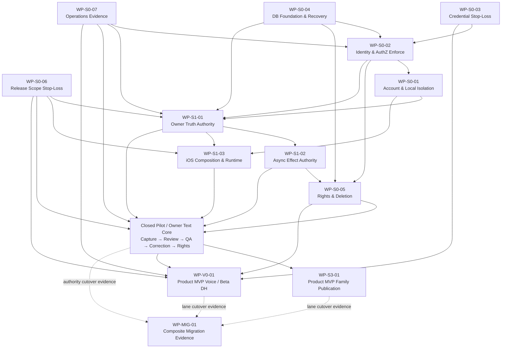

# DreamJourney V4 可执行开发路线图

版本：V1.2 Product Confirmed Baseline + Staged Validation + Startup Lean Profile
初版日期：2026-07-12
更新日期：2026-07-15
状态：已同步独立方案评审第21章产品回复、三级验证策略及开发前五项产品细节；115 个 Work Item 保留并按“Closed Pilot / Product MVP / Beta Extension / 规模触发”执行。产品范围已确认不代表工程实现、G2-G4、Provider、法律或发布批准
产品细节确认批次：2026-07-15 五项开发前确认已映射到既有 Work Item，不新增第二套路线图编号。
基线：iOS `feature/prd-stitch-ui-adaptation@8a1922b`；Backend `main@4c0538b`
评审控制面：[DreamJourney V4 评审与验收清单](../../product/DreamJourney_V4_评审与验收清单_V1.0.md)
定稿边界：路线图定稿只冻结执行依据；115 个 Work Item 仍按 Registry 的 `PLANNED/STOP/NO_GO`、Gate 和外部门推进。当前 Operating Profile 以 DR-040/042 的百级用户四阶段轻量迁移为默认，C00-C11 保留为规模触发目标。

## 0. 文档权威与使用边界

本路线图负责把产品目标转成工程执行顺序，不重新定义产品范围，也不把计划状态解释为实现状态。权威顺序如下：

1. 工程事实与成熟度：[当前实现证据矩阵](../../product/DreamJourney_V4_当前实现证据矩阵_V1.0.md)。
2. 产品目标与架构不变量：[Product Spec](../../product/DreamJourney_V4_产品定义与目标架构_Product_Spec_V4.0.md)。
3. 开放产品决定：[产品决策登记册](../../product/DreamJourney_V4_产品决策登记册_V1.0.md)。
4. Round 3 高风险处置：[独立架构评审响应](../../product/DreamJourney_V4_Round3_独立架构评审响应_V1.0.md)。
5. 工程优先级、依赖、部署与验收顺序：本路线图。

冲突处理：源码/测试只能证明当前事实，不能自动批准产品目标；路线图可以安排可逆内部开发，不能把 `RECOMMENDED_PENDING`、`EXTERNAL_REQUIRED`、真机或 Provider 门升级为完成。任何身份、权限、隐私、删除、真实数据发送或不可逆迁移冲突默认 fail closed。

本文件禁止：

- 用“已规划”替代“已实现”，用静态检查替代真实环境/真机/Provider 验收。
- 在工作包外创建第二套 Domain、Authority、migration runner、release policy 或 Provider credential path。
- 为没有当前测量的数据承诺人日、日期、SLO、RPO/RTO、cohort 比例或 Provider 成本。
- 让 Publication、Voice/DH、Family/Care/TimeLetter 的故障阻断 Owner 文字核心降级运行；Closed Pilot 可以独立验证，但这条技术隔离不等于 Product MVP 可以省略 Family、Publication/Visitor 或 Voice。

### 0.1 2026-07-15 产品确认与执行档位

- Closed Pilot：首批只开放 Adult Self；验证强身份与 Vault 隔离、备份恢复最低门、Source/Candidate/Memory/文字 QA、来源引用、纠正、删除与最小权利回执；照片只作为明确未云端保存的本地草稿；不等待 Family/Publication/Visitor、Voice、DH 或媒体 Provider。Memorial Controller 为第二 cohort，Guardian/未成年人保持独立 G4。
- Product MVP：在 Closed Pilot 达标后增加三 Tab 完整体验、Family/人物切换与授权贡献、独立 Publication/Visitor、Owner private 与授权 Family Voice Clone 及其适用法律、Provider 和真机门；Visitor Voice 独立 capability/cohort，不阻断基础 MVP。
- Beta Extension：Digital Human 和非必要媒体理解；必须能单独关闭并回退文字/已批准声音。
- 后置：Care、TimeLetter；不占用首版 critical path。
- 外部门：全年龄人物资料是产品范围，但未成年人、第三方和逝者 Voice/DH、真实 Provider、AI 标识与地域/处理商仍 fail-closed。
- 当前迁移：百级用户、可强制最低版本和可维护窗口时采用 L0 盘点/备份恢复、L1 离线演练、L2 维护窗切换、L3 24–72 小时观察；只有规模或运营触发器出现才升级到完整 C00-C11。

## 1. 执行对象与状态模型

### 1.1 层级

```text
Stage / Lane
  -> Work Package (WP-*)：一个 canonical risk / authority owner
    -> Work Item (WI-*)：一个可独立验证的主要结果
      -> Gate / Evidence：证明进入、退出、部署或外部门状态
```

Work Package 是风险与架构责任边界；Work Item 才是开发 agent 每轮选择的小闭环。一个 Work Item 可以跨 iOS/backend，但只能有一个主要结果、一个最终 owner 和一组可判定完成证据。

### 1.2 Package 与 Work Item 状态

| 状态 | 含义 | 允许推进 |
| --- | --- | --- |
| `PLANNED` | 范围、依赖和验收已定义，未开始实施 | 可进入满足依赖的内部开发 |
| `IN_PROGRESS` | 有明确 owner 和 active branch/worktree | 不得同时由第二任务修改同一 authority |
| `INTERNAL_READY` | 代码、合同、非真机测试通过，外部门未关闭 | 仅允许 hidden/shadow/synthetic/disabled 部署 |
| `EXTERNAL_BLOCKED` | 需要产品、Privacy/Legal、Provider、真机或生产证据 | 不得标 Done，不得默认公开 |
| `DEPLOYED_UNVERIFIED` | 已部署但真实环境验收或观察窗不足 | 可回滚/暂停，不可 promotion |
| `VERIFIED` | 所有适用自动化、环境、外部和观察窗证据通过 | 可进入下游 package gate |
| `PAUSED` | blocker、incident、证据过期或 no-go | 保留 receipt；修复后重新执行门 |
| `RETIRED` | 仅用于 legacy surface；零使用窗、contract/revoke 证据完成 | 不恢复旧 Authority；只允许 forward fix |

Package 不能因一个 Work Item `VERIFIED` 自动完成；必须满足该 Package 的 Exit Gate。外部门缺失时最高状态是 `INTERNAL_READY` 或 `EXTERNAL_BLOCKED`。

### 1.3 Work Item 必填合同

后续每个 `WI-*` 必须填写以下字段；缺任何一项不得进入 `IN_PROGRESS`：

| 字段 | 要求 |
| --- | --- |
| `Outcome` | 一个可观察结果，禁止只写“优化/完善/支持” |
| `Product value` | 对 Owner、Visitor、Operator 或风险止损的直接价值 |
| `Priority / lane` | P0/P1/P2；Foundation、Closed Pilot Owner Core、Product MVP Family/Publication、Product MVP Voice、Beta Extension、Future 或 Migration |
| `Risk / requirement` | CR、FR、DR、IAR/BAR/SOR 映射 |
| `Dependencies` | 具体 package/work item/gate；区分 start 与 exit dependency |
| `iOS scope` | 当前或明确新增的文件/模块/target |
| `Backend scope` | 当前或明确新增的 module/route/store/worker |
| `Data/API/Event` | schema、endpoint、command、event、receipt 或“不适用”及理由 |
| `Migration` | additive/shadow/backfill/cohort/cutover/contract 或“不迁移” |
| `Release policy` | flag、server policy、cohort、默认值、TTL/offline 行为 |
| `Verification` | 检查脚本、单测、集成、模拟器、Postgres、Provider、真机 |
| `Deployment` | 双仓顺序、migration、worker/API、兼容窗口和监控 |
| `Rollback` | pre-cutover rollback、post-cutover forward-fix/compat read、不可逆事实 |
| `Definition of Done` | 可判定证据和未关闭边界 |
| `External gates` | 产品、Privacy/Legal、Provider、Finance、生产、真机 |
| `Non-goals` | 本项明确不做的重构/能力 |

### 1.4 五类验收门

| Gate | 名称 | 可由自动化单独关闭 | 典型证据 |
| --- | --- | --- | --- |
| `G0` | 纯代码与非真机 | 是，仅限内部合同 | static check、unit/contract test、fixture、generic iPhoneOS build、diff gate |
| `G1` | 模拟器与 UIQA | 是，但不证明设备/Provider质量 | simulator smoke、截图、交互日志、无隐藏入口误露 |
| `G2` | 真实 Postgres / 部署 | 否，需目标环境证据 | migration、concurrency、restore、deployed smoke、readiness、观察窗 |
| `G3` | 真实 Provider | 否 | sandbox/production receipt、quota、region、retention、delete/exit、cost、quality |
| `G4` | 真机 / 产品 / 法律外部门 | 否 | 设备日志与截图、产品签字、Privacy/Legal、未成年人/第三方政策、运营批准 |

`G0/G1` 通过不能推导 `G2–G4`。Provider 配置存在不等于 `G3`；安装成功不等于真机业务通过；产品讨论稿不等于 `G4` 批准。

## 2. 固定 Work Package 目录

### 2.1 Package Inventory

| Package | 名称 | Risk | Priority | Lane | Start dependencies | Exit dependencies | 当前状态 | 主要退出门 |
| --- | --- | --- | --- | --- | --- | --- | --- | --- |
| `WP-S0-01` | Account & Local Isolation | CR-01 | P0 | Stage 0 | S0-02 session contract 可先用 fake | S0-02 verified identity/session；G1 A/B/logout/delete | `PLANNED` | AccountLease、owner-scoped stores、legacy quarantine；跨账号泄漏为零 |
| `WP-S0-02` | Identity & AuthZ Enforce | CR-02 | P0 | Stage 0 | S0-03 credential baseline；S0-04 DB/UoW | G2 cross-vault corpus；G4 identity provider决策 | `PLANNED` | 强身份、server-derived principal、全路由/资源 deny-by-default |
| `WP-S0-03` | Credential Stop-Loss | CR-03 | P0 | Stage 0 | 无；incident型任务立即开始 | G3 broker/TTL；资产 Owner 轮换证明 | `PLANNED` | Release/响应/日志无长期 client/system/provider secret；旧凭据撤销 |
| `WP-S0-04` | DB Foundation & Recovery | CR-04 | P0 | Stage 0 | 无 | G2 真实 Postgres migration/restore/readiness | `PLANNED` | request/job UoW、versioned migrator、DB/schema readiness、隔离 restore/replay |
| `WP-S0-05` | Rights & Deletion | CR-10 | P0 | Stage 0→1 | S0-02、S0-04 | S1-02 effect receipts；G2 restore/delete；G3 provider delete；G4 policy | `PLANNED` | access-first、module/object/provider/backup分层状态与receipt |
| `WP-S0-06` | Release Scope Stop-Loss | CR-08 | P0 | Stage 0 | 无 | server policy deployed；G1 release smoke | `PLANNED` | Future/Beta default-off、TTL/offline deny、公开MVP不误露 |
| `WP-S0-07` | Operations Evidence | CR-11 | P0 | Stage 0→持续 | 无 | G2 production metadata/incident/cost evidence | `PLANNED` | operation/rights/incident/provider cost 事件和失败分母可追踪 |
| `WP-S1-01` | Owner Truth Authority | CR-05 | P0 | Stage 1 | S0-01、S0-02、S0-04、S0-06 | S1-02/S1-03；G2 shadow/cohort；MIG gate | `PLANNED` | Source→Candidate→DecisionReceipt→MemoryVersion→Projection 单 Authority |
| `WP-S1-02` | Async Effect Authority | CR-06 | P0/P1 | Stage 1→2 | S0-02、S0-04、S0-07；S1-01 event contract | G2 worker/outbox/crash corpus；Provider effect适用G3 | `PLANNED` | transactional outbox、job lease、Inbox/business receipt、unknown reconcile |
| `WP-S1-03` | iOS Composition & Runtime | CR-07 | P1 | Stage 1 | S0-01、S0-02、S0-06；S1-01 ports | G1 simulator；Voice/DH适用G4真机 | `PLANNED` | UI只发Intent/渲染ViewState；runtime/audio owner与业务Authority分离 |
| `WP-S3-01` | Family Delegated Publication & Visitor | CR-08 | P0/P1 | Product MVP-P | S0-02、S0-05、S0-06、S0-07、S1-01、S1-02、Family identity/relationship slice | G2 public store/index；G4 privacy/safety | `EXTERNAL_BLOCKED` | 家庭授权不直读私库；独立 snapshot/Public Index/Visitor grant/7日TTL/撤回 |
| `WP-V0-01` | Voice Product MVP / DH Beta Extension Governance | CR-09 | P0/P1/P2 | Product MVP Voice + Beta Extension DH | S0-02、S0-03、S0-05、S0-06、S0-07 | G3 provider/region/delete/quality；G4 consent/真机 | `EXTERNAL_BLOCKED` | Voice purpose/consent/profile/sample/audio/receipt/delete完整；DH独立放行 |
| `WP-MIG-01` | Lean Migration + Scale-triggered Composite Drills | CR-12 | P0 gate | Migration Cross-cutting | L0/C00 inventory 可立即开始 | 当前 L0-L3；规模触发后每 lane 对应 C/W/I/P/Q/O/V 与 G2/G3/G4 | `PLANNED` | 当前唯一轻量 go/no-go 与 restore 证据；保留完整 retirement/MRT 目标 |

### 2.2 Package ID 稳定规则

- 13 个 ID 是 Round 3D canonical package，后续不得另起同义 package。
- 一个 finding 可映射多个 package，但必须指定一个 primary owner；跨包依赖用 Work Item ID，不复制实现。
- Family 是 Product MVP 横切切片：身份/关系与授权由 `WP-S0-02`，Persona/贡献与查询边界由 `WP-S1-01`，iOS 人物切换由 `WP-S1-03`，家庭查询副本与 Visitor grant 由 `WP-S3-01` 承担；不另建重复 Authority package，也不成为 Closed Pilot 退出依赖。Care/TimeLetter 继续后置并默认关闭。
- Stage 2 媒体/processor 能力先作为 `WP-S1-01/02` 的后置 Work Item；真实对象存储或视觉 Provider 未通过时保持内部或 blocked。

## 3. Package 依赖 DAG

### 3.1 Start 与 Exit 语义

`Start dependency` 只限制开始真实实现所需的最小稳定合同；`Exit dependency` 决定 package 能否进入 `VERIFIED`。例如 iOS AccountLease 可用 fake session 先做 G0/G1，但没有强身份/session 与 A/B 证据时 `WP-S0-01` 不能退出。



`WP-MIG-01` 不作为 additive schema、fake、contract 或 shadow 开发的前置；它在 cohort cutover、credential revoke、legacy retirement 和 schema contract 前成为硬门。DAG 虚线表示提交迁移证据，不表示业务依赖。

### 3.2 Critical Path

Owner 文字核心的推荐关键路径：

```text
S0-03 credential baseline + S0-04 DB foundation + S0-06 release deny + S0-07 evidence
  -> S0-02 strong identity/AuthZ enforce
  -> S0-01 AccountLease/local isolation
  -> S1-01 Owner Truth Authority shadow/cohort
  -> S1-02 async completion + S1-03 iOS composition
  -> S0-05 rights receipt minimum release gate
  -> Owner Text Core verified
```

可并行但不能提前退出：

- S0-01 可用 fake session 开始 G0/G1，退出依赖 S0-02。
- S0-05 可先做 access revoke/status schema，完整 provider/object/backup receipt 依赖 S1-02 和外部门。
- S1-03 可先抽 Intent/ViewState/runtime ports，但不能在 S1-01 前切换 Owner Authority。
- V0-01 可用 synthetic/mock 做内部合同，不得在 Owner core 前进入公开 critical path。

## 4. Stage 与 Release Increment

| Increment | 范围 | 进入条件 | 退出证据 | 用户可见性 | Stop-the-line |
| --- | --- | --- | --- | --- | --- |
| `R0 Safety Baseline` | S0-03/S0-06/S0-07 最小止损；S0-04 preflight | 当前 build/schema/config inventory | credential/release/artifact checks；最小事件；DB风险清单 | 不新增功能；必要时关闭高风险入口 | 长期secret、future fail-open、unknown writer/effect |
| `R1 Secure Account Boundary` | S0-02/S0-01/S0-04 | R0；identity test adapter | cross-vault、refresh/revoke、A/B/logout/delete、readiness/restore | 可保留现有三Tab；未验证身份功能不公开 | anonymous/shadow production、owner ambiguity、restore失败 |
| `R2 Owner Truth Shadow` | S1-01 additive schema/API/shadow；S1-03 hidden adapter | R1；versioned migration | Source/Candidate/Decision/MemoryVersion shadow parity；无业务切换 | 现有 UI 不变；hidden review/trace | second Authority、missing provenance、stale owner write |
| `R3 Closed Pilot / Owner Text Core` | S1-01 cohort cutover + S1-02 + S1-03 + S0-05 minimum | R2 parity；MIG go record | Capture→Review→QA→Citation→Correction→Deletion/Rights；G1/G2受控cohort/receipt/rollback及适用G4 | 仅受控 Closed Pilot cohort；非公开 | epoch/legacy write、effect gap、cross-vault、rights blocker |
| `R4 Beta Extension Media Quality` | SourceObject/processor/object/provider 后置项 | R3；object/provider policies | private object、scan/processing、failure/retry、delete receipt | 按媒体类型独立 Beta cohort | mock/temporary URL冒充uploaded、unknown provider effect |
| `R5 Product MVP Family Publication` | Family 横切切片 + S3-01 | R3；身份/关系/Privacy门 | 人物切换、贡献授权、snapshot/Public Index/Visitor/revoke/7日TTL G2/G4 | 通过门后按 Product MVP cohort 开放 | private Projection exposure、家庭关系越权、grant/revoke失效 |
| `RV0 Voice Governance` | V0-01 consent/profile/receipt/delete | R1；R0 credential | synthetic/internal contract G0；外部门仍 blocked | default-off/QA | long-term client credential、无purpose真实数据 |
| `RV1 Product MVP Voice / Beta Extension DH` | Voice provider + device runtime；DH 独立 lane | RV0；R3；Family/Publication purpose 适用时依赖 R5 | Voice G3/G4 quality、audio owner、delete/exit；DH 另有 Beta evidence | Voice 受控 Product MVP cohort；DH 白名单 Beta | 默认音色冒充复刻、dual-send、真机无证据 |
| `RC Contract/Retire` | MIG-01 C10/C11 | 每 lane C09；零使用窗 | restore/replay、retirement manifest、contract/revoke | 无新增功能 | old binary/timer/key/store/route仍命中 |

`R3` 同时是可独立降级运行的 Owner 文字核心和 `Closed Pilot` 产品验证切片。`Closed Pilot` 通过不等于 Product MVP 发布批准；Product MVP release cut 至少还需要 `R5` 的 Family/受控 Publication/Visitor，以及 `RV0/RV1` 中 Voice Clone 的适用治理、Provider 和真机证据。Digital Human、R4 非必要媒体、Care 与 TimeLetter 属于 Beta Extension 或后置能力，不阻塞 Closed Pilot 或 Product MVP。任何扩展 lane 关闭时仍必须保持 R3 文字核心可用。

## 5. Stage Gate 规则

### 5.1 Stage 0 Exit

- production auth deny-by-default，principal/resource scope完整；强身份 provider 仍未决定时只允许受控测试环境。
- AccountLease 与 owner-scoped store A/B/logout/delete/冷启动证据通过，legacy owner mismatch quarantine。
- request/job-scoped UoW、versioned migration、DB/schema readiness 和隔离 restore 基线通过 G2。
- Release 默认关闭 Future/Beta；Release artifact、runtime response、header/log/backup 扫描无长期 client secret。
- Data Rights 至少能先撤访问并披露 pending/partial/unsupported；不能宣称完整物理删除。
- 最小 operation/rights/incident/provider cost 事件可生成，不以增长数字为退出条件。

### 5.2 Stage 1 / Closed Pilot Exit

- 只有一个 active Owner Authority；无 provenance/DecisionReceipt 的 legacy 数据不自动 confirmed。
- `/v2` command 使用 stable commandId/expectedVersion/receipt，旧 route 只 facade/read compatibility。
- outbox/job/Inbox/business completion 在 crash/duplicate/late callback 下可解释，unknown 不盲重试。
- iOS UI 不拼 transport/信任 owner；切账号、取消、后台、回调都通过 lease/generation fence。
- Owner Capture→Review→QA→Correction→Rights 六链通过；引用能回到具体 MemoryVersion/Source。
- 只允许受控 cohort，不开放匿名 Visitor、Voice 或 DH；Closed Pilot 文案不得宣称完整 Product MVP。

### 5.3 Product MVP 扩展 Lane 与 Beta Extension Exit

- Family/Publication/Visitor、Voice 和 DH 分别通过自己的 AuthZ、Privacy/Legal、Provider、设备和成本门；产品范围确认不关闭外部门。
- 任一扩展 lane 失败只暂停该 lane，不修改 Owner Vault epoch、不扩大权限、不回滚文字核心；Family/Publication/Visitor 或 Voice 未通过时，Product MVP 不得发布，但不撤销已经通过的 Closed Pilot 验证。
- Care/TimeLetter 的已有壳层继续受 Release Policy 管控，保持 hidden/future。

### 5.4 Migration / Retirement Exit

- C00 inventory、真实 backup/restore、旧客户端/route/timer/store/credential/provider in-flight 目录完整。
- 每个 cohort 有 go/pause/no-go record、阈值来源、观察窗、approver 和 evidence bundle。
- rollback 不抹除已确认 MemoryVersion、已投递 Inbox、Provider accepted、声音训练或物理删除事实。
- C10/C11 前完成零使用窗、drain、restore/replay、rights/delete/exit 和 old binary check；contract 后只 forward fix。

## 6. 后续子问题所有权

以下章节记录 Round 4 子问题的路线图交付状态；“已合入”只表示原子工作项已写入，不改变 package 的工程实现状态：

| 子问题 | 所有内容 | 路线图交付状态与工程边界 |
| --- | --- | --- |
| Round 4B | `WP-S0-01` 至 `WP-S0-07` atomic work items | 已合入50项/800字段；工程仍为`STOP/PLANNED` |
| Round 4C | `WP-S1-01` 至 `WP-S1-03` atomic work items | 已合入33项/528字段；工程仍为`STOP/PLANNED` |
| Round 4D | `WP-S3-01`、`WP-V0-01`、`WP-MIG-01` atomic work items | 已合入32项/512字段；Family/Publication/Voice 的产品范围已确认但实现/外部门仍`EXTERNAL_BLOCKED`，DH仍Beta，Migration采用Lean默认档位 |
| Round 4E | FR/DR/finding/CR 全量追踪、execution registry、roadmap checker、next-action rule | E1追踪、E2A注册表/Selector、E2B总checker与全量静态门已通过；2026-07-15产品复核已同步，发布证据仍未完成 |

当前路线合计 **115 个 Work Item / 1840 个必填字段**。计数只证明路线结构完整，不证明任何 Work Item 已实现、已部署或通过外部门。

具体任务、命令、部署和回滚内容必须在对应子问题完成后合入本文件；任何人不得从“已合入”或 package 表直接推断生产代码已准备实施、已部署或已通过G2–G4。

### 6.0A 115 项的 Startup Lean 与三级验证分层

115 项是完整风险目录，不是首版必须并行完成的待办列表。Selector 在排期时按以下层级过滤，且不能因降级而删除安全不变量：

| 层级 | 当前包含 | 排期规则 |
| --- | --- | --- |
| Closed Pilot | `WP-S0-*` 中适用的身份/凭据/DB恢复/删除/发布策略/证据；`WP-S1-*` 的文字 Authority、任务与三 Tab 最小 composition；L0-L3 中本次 cutover 所需项 | 按依赖串行/小并行推进；只向受控 cohort 开放，不等待 Family、Publication/Visitor、Voice、DH 或非必要媒体 |
| Product MVP | Family 横切切片；`WI-S3-01-01..09`；`WI-V0-01-01..07/10/11` 中 Voice 必需部分，以及完整三 Tab 产品体验 | Closed Pilot 达标后推进；缺适用 G2-G4 时保持 blocked，不能从 Product MVP 清单删除，也不能反向阻塞 Closed Pilot |
| Beta Extension / 上线后补齐 | `WI-V0-01-08` Digital Human session、`09` 中 DH 口型/真机矩阵；非必要媒体 processor、深层分析和扩展运营自动化 | 不阻塞 Closed Pilot 和 Product MVP；有独立 cohort、预算、kill switch 与回退 |
| 规模触发 | `WP-MIG-01` 中超出 L0-L3 的多 cohort 组合编排、C00-C11 全轨证据、复杂 retirement 自动化，以及进入条件未满足的重型基础设施 | 只有无法强制升级/维护、跨地域、多团队、多 cohort 或容量越界时启动；不得为静态清单完整性提前建设 |

Family 不通过“未来包”处理：它复用 Identity/AuthZ、Persona/Memory、iOS composition 与 Publication grant 的现有 Work Item，在 issue/branch 层以 `SCOPE-FAMILY-MVP` 标签形成 Product MVP 可验收切片。Digital Human 与 Voice 共用部分工作项时，DoD 必须分别给出 `voiceMvpOutcome` 与 `dhBetaOutcome`，避免 DH 阻塞 Voice，也避免二者阻塞 Closed Pilot。

### 6.1 Canonical 追踪例外与关键下钻边

以下关系使用 Product Spec 的36个FR、登记册43个DR和独立评审22个finding作为唯一ID集合。`SCOPE-*`只是产品/工程范围标签，不是新FR，也不计入需求覆盖。

| From | Relation | To | 说明 |
| --- | --- | --- | --- |
| `FR-ACC-001` | `PRIMARY_WI` | `WI-S0-02-01` | 强身份challenge/binding是账号安全主责任 |
| `FR-SAFE-001` | `PRIMARY_WI` | `WI-S0-06-09` | AI披露与危机表达即时安全路径 |
| `FR-SAFE-002` | `PRIMARY_WI` | `WI-S3-01-06` | Visitor限流、注入、抓取、举报与暂停属于MVP-P |
| `FR-MEM-003` | `DEFERRED_BY_GATE` | `STAGE4-VALUE-REENTRY` | 时间/情节推理需R3真实价值、质量和成本门，不创建当前implementation WI |
| `FR-MEM-004` | `DEFERRED_BY_GATE` | `STAGE4-VALUE-REENTRY` | Entity/Relation图同样后置，不为追踪完整性提前扩张范围 |
| `IAR-06` | `IMPLEMENTED_BY` | `WI-S1-01-09` | raw client/Archive legacy数据先分类、shadow与quarantine |
| `IAR-06` | `MIGRATION_GATED_BY` | `WI-MIG-01-08` | old client与single Authority切换由C07授权/完成记录守门 |
| `IAR-07` | `IMPLEMENTED_BY` | `WI-S1-03-10` | EchoVC按渐进strangler收敛，不一次性重写 |
| `SOR-04` | `EXTERNAL_GATE` | `WI-V0-01-11` | minor/third-party/Voice purpose需产品、Privacy/Legal与Provider证据 |
| `DR-012` | `ENFORCES_REJECTION` | `SCOPE-AOS-COMPONENTS` | 拒绝无源码/无证据AOS组件；不得作为Voice/DH待实施需求 |
| `DR-042` | `SETS_OPERATING_PROFILE` | `WP-MIG-01` | 百级用户默认四阶段Lean迁移；完整C00-C11由规模触发 |
| `DR-043` | `SETS_RELEASE_VALIDATION_LEVELS` | `WP-S0-06` | R3=Closed Pilot；R5+Voice=Product MVP；DH/非必要媒体=Beta Extension，各层独立过门 |

`FR-MEM-003`与`FR-MEM-004`只有在Stage4 re-entry记录明确用户价值、输入Authority、质量/成本/隐私门和不阻断R3后，才能建立新Work Item。`DR-012`不得出现在Voice/DH Work Item的`Risk / requirement`字段。

### 6.2 Execution Registry 与 Authority 边界

[路线追踪矩阵](../../product/DreamJourney_V4_路线追踪矩阵_V1.0.md)回答“为什么做/为什么不做”；[路线执行注册表](../../product/DreamJourney_V4_路线执行注册表_V1.0.json)回答“当前机器事实允许规划或执行什么”。JSON由`Scripts/QA/product-v4/generate-product-v4-execution-registry.py`从本文件生成，不是第六个产品范围权威。

- `source.sha256`必须与本文件当前字节一致；不一致时registry为`STALE`，selector只能返回`STOP_THE_LINE`。
- 本文件的Package目录和16字段Work Item仍是范围、依赖与验收正文；registry只保留有限枚举、结构化边和当前执行控制状态。
- Registry不得回写本文件、不得把自身hash写进本文件，避免hash自引用；Roadmap变更后只能重新生成并复核。
- `startPackageDependencies`引用`Package.START`，`exitPackageDependencies`引用`Package.EXIT`；总DAG必须按两个milestone检查，禁止为消除表面环而删除真实阶段依赖。
- `directDependencies`只包含Work Item的start依赖。明确标为`exit依赖/退出依赖`的内容保留在原文字段及`dependencyNotesHash`，不错误阻塞start DAG。

#### 6.2.1 Package Control Registry（13）

下表是Package级机器控制属性的Roadmap权威。生成器不得另设不同mapping；checker必须从本表独立复算JSON。`selectorBand`只排序同样安全的候选，不能覆盖依赖、Owner、lock、decision或Gate。

| Package | releaseClass | authorityLock | selectorBand | defaultExposure |
| --- | --- | --- | --- | --- |
| `WP-S0-03` | `CORE` | `CREDENTIAL_CONTROL` | `0` | `EXISTING_PUBLIC_SHELL` |
| `WP-S0-04` | `CORE` | `DB_RECOVERY` | `1` | `EXISTING_PUBLIC_SHELL` |
| `WP-S0-06` | `CORE` | `RELEASE_POLICY` | `2` | `EXISTING_PUBLIC_SHELL` |
| `WP-S0-07` | `CORE` | `OPERATIONS_EVIDENCE` | `3` | `EXISTING_PUBLIC_SHELL` |
| `WP-S0-02` | `CORE` | `IDENTITY_AUTHZ` | `10` | `EXISTING_PUBLIC_SHELL` |
| `WP-S0-01` | `CORE` | `ACCOUNT_LOCAL_STATE` | `20` | `EXISTING_PUBLIC_SHELL` |
| `WP-S1-01` | `CORE` | `OWNER_TRUTH` | `30` | `EXISTING_PUBLIC_SHELL` |
| `WP-S1-02` | `CORE` | `ASYNC_EFFECT` | `40` | `EXISTING_PUBLIC_SHELL` |
| `WP-S1-03` | `CORE` | `IOS_COMPOSITION` | `41` | `EXISTING_PUBLIC_SHELL` |
| `WP-S0-05` | `CORE` | `RIGHTS_DELETION` | `42` | `EXISTING_PUBLIC_SHELL` |
| `WP-S3-01` | `MVP_EXTENSION` | `PUBLICATION` | `80` | `DEFAULT_OFF` |
| `WP-V0-01` | `MVP_EXTENSION` | `VOICE_DH_GOVERNANCE` | `81` | `DEFAULT_OFF` |
| `WP-MIG-01` | `MIGRATION` | `MIGRATION_EVIDENCE` | `90` | `DEFAULT_OFF` |

| Registry字段 | 有限语义 | 权威边界 |
| --- | --- | --- |
| `releaseClass` | `CORE / MVP_EXTENSION / MIGRATION` | CORE可形成Closed Pilot；MVP Extension属于Product MVP且保持独立默认关闭，不能阻断Owner文字核心降级；Migration只提供迁移门 |
| `authorityLock` | 13个互斥lock，每Package恰一 | 同一lock同一时刻最多一个执行Owner；不是数据所有权转移 |
| `lifecycle` | 1.2节八态 | 当前均`PLANNED`；生成器不能自升状态 |
| `decision` | `STOP / NO_GO / GO` | 当前Core/MVP Extension为`STOP`、Migration为`NO_GO`；只有有权Owner可签`GO` |
| `executionOwner` | `UNASSIGNED`或可审计Owner ID | 当前均`UNASSIGNED`；selector不能自动分配自己 |
| `requiredGates/gateEvidence` | `G0-G4`与`MISSING/PASS/FAIL/EXPIRED` | 当前均保守为`MISSING`；现有文档/check不能自动回填`PASS` |
| `selectorBand/stableRank` | 稳定整数 | 只用于确定性排序，不改变priority、产品决定或Gate |
| `defaultExposure` | `DEFAULT_OFF / EXISTING_PUBLIC_SHELL` | S3/V0/MIG必须`DEFAULT_OFF`；现有公开壳不批准新增能力 |

`WP-MIG-01`唯一Authority lock是`MIGRATION_EVIDENCE`，只拥有inventory、backup/restore、shadow、go/no-go、cutover/retirement evidence。`WI-MIG-01-08`的`authorization`允许对应Domain执行epoch/route切换，但Owner Truth、Outbox/Job、Rights、Publication、Voice/Profile或Provider状态仍由各自Package写入；MIG不得成为第二业务aggregate。

### 6.3 确定性 Next Selector

Selector分为**planning**与**execution**两层。排序第一不等于授权执行，`STOP/NO_GO/UNASSIGNED`不能被算法改写为`GO/IN_PROGRESS/VERIFIED`。

| Action | 进入条件 | 允许行为 | 禁止行为 |
| --- | --- | --- | --- |
| `STOP_THE_LINE` | registry stale、required incident open、Authority冲突或安全不变量失败 | 记录阻断、fence受影响lane、要求Owner处置 | 继续选择普通业务WI |
| `EXECUTE:<WI>` | `decision=GO`、Owner已分配、lock已持有、start依赖满足、无stop-line | 在指定branch/worktree推进一个WI | 并行修改第二lock、跳过Gate或扩张范围 |
| `PLAN_ASSIGN_OWNER:<WI>` | `PLANNED + STOP/NO_GO + UNASSIGNED`且允许做可逆规划 | 评审范围、指定Owner、准备授权证据 | 修改产品代码、部署、发真实Provider请求 |
| `NO_EXECUTABLE_ACTION` | 没有安全候选或全部被外部门/依赖/决定阻断 | 输出阻断集合和所需Owner/evidence | 用“继续”绕过阻断 |

候选和排序算法固定如下：

1. 先校验registry source hash、schema/count、唯一lock和当前incident；失败立即`STOP_THE_LINE`。
2. 已有合法`EXECUTE`候选时，先完成同一WI，禁止为了新鲜度切到另一任务。
3. Planning候选允许可逆`CORE`与依赖已满足的`MVP_EXTENSION`，以及`WI-MIG-01-01`只读inventory；MVP Extension在`DEFAULT_OFF`下可做G0/G1内部实现，但缺Privacy/Legal/Provider/G2-G4时不得真实数据发送、promotion或公开使用。
4. `directDependencies`与Package start milestone不满足时移除候选；exit dependency只限制`VERIFIED`，不错误阻止内部contract/fake/shadow开始。
5. 缺`G2-G4`只降低状态ceiling，不阻止明确允许的G0/G1内部工作；但不得promotion、真实数据发送或宣称外部门通过。
6. 对剩余候选按`(actionRank, releaseClassRank, selectorBand, priorityRank, stableRank, id)`升序；枚举固定为`EXECUTE < PLAN_ASSIGN_OWNER`、`CORE < MIGRATION < MVP_EXTENSION`、`P0 < P1 < P2`，`id`是最后稳定tie-break。
7. 输入完全相同时输出必须字节一致且恰一action；需要并行时必须建立另一个有独立Authority lock的显式任务，不由selector一次返回多个next action。

当前baseline的机器判定为：

```json
{
  "selectorVersion": "dreamjourney.next-selector.v1",
  "round4Acceptance": "ROUND4_STATIC_ACCEPTANCE_PASSED_ROUND5_PENDING",
  "openIncidents": [],
  "authorityLeaseState": "ALL_UNHELD",
  "currentAction": "PLAN_ASSIGN_OWNER:WI-S0-03-01",
  "currentActionAuthorizesImplementation": false,
  "reason": "P0 CORE credential stop-loss; no package/direct start dependency; selectorBand=0; stableRank=1",
  "secondaryReadOnlyCandidate": "WI-MIG-01-01",
  "secondaryCandidateSelected": false
}
```

这只表示应先为Credential Inventory止损项指定合格Owner并审查授权，不表示本路线图已经开始`WI-S0-03-01`。`WI-MIG-01-01`可由明确另建的只读inventory任务并行，但不能抢占R0 stop-loss，也不能进入C01+。

### 6.4 状态失效、Evidence Expiry 与 Replan

| 触发 | 立即动作 | 状态/ceiling | Replan规则 |
| --- | --- | --- | --- |
| Roadmap/source hash变化 | registry标`STALE`，停止selector | 保持原lifecycle，不沿用旧action | 重新生成registry、总checker通过后再选 |
| P0/P1安全incident为`OPEN/ACKNOWLEDGED` | `STOP_THE_LINE`，fence受影响lock/lane | 相关`IN_PROGRESS`转`PAUSED`；事实/receipt不删除 | incident有Owner、stop action和current evidence后重排 |
| required evidence=`FAIL/EXPIRED` | 撤销由该证据支持的promotion/route | 按剩余Gate降到`INTERNAL_READY/DEPLOYED_UNVERIFIED/EXTERNAL_BLOCKED/PAUSED` | 依赖它的候选全部重新计算；禁止沿用旧截图/报告 |
| required evidence=`MISSING` | 阻止相应Gate关闭 | G0/G1不能抬升G2-G4；MVP Extension保持off | 可继续明确允许的低Gate内部工作，不能promotion |
| Product/Privacy/Legal/Provider决定仍open或被撤销 | 关闭相应公开/真实effect路径 | `STOP`或`EXTERNAL_BLOCKED`；Owner文字核心不回退 | 只重排受影响lane，禁止扩展能力阻断Core |
| start dependency回退、删除或版本不兼容 | 取消未开始action；运行中先fence | 受影响WI转`PAUSED`，已确认业务事实不普通回滚 | 从依赖节点重新选择forward fix/compat工作 |
| execution Owner退出或Authority lock丢失 | 停止写入与副作用，保留checkpoint | 不自动转交第二agent；保持`PAUSED` | 新Owner显式接管并确认branch/lock/evidence后重排 |
| Provider accepted、Inbox delivered、Memory confirmed或物理删除已发生 | 记录不可逆事实 | 不允许状态/数据回到“未发生” | 只允许query/reconcile/compensate/forward fix |

任何replan都必须以最新registry、Decision Register、incident/evidence状态为输入。人工说“继续”、脚本通过、模拟器截图或generic build都不能覆盖`STOP_THE_LINE`、未分配Owner、未持有lock或open G2-G4。

### 6.5 Selector 例证

| Fixture | 预期唯一输出 | 解释 |
| --- | --- | --- |
| 当前baseline：全`PLANNED`、`STOP或NO_GO`、`UNASSIGNED`、`MISSING` | `PLAN_ASSIGN_OWNER:WI-S0-03-01` | 只规划首个credential止损项 |
| S0-03-01已`GO`、Owner/lock有效、start依赖为空 | `EXECUTE:WI-S0-03-01` | 继续已授权同一小闭环 |
| Credential leak incident open | `STOP_THE_LINE` | incident优先于任何路线排序 |
| V0 G3 evidence expired | Core候选不变；V0为`EXTERNAL_BLOCKED` | MVP Extension失败不阻断Owner文字核心降级运行 |
| S1-01 start dependency回退 | S1-01相关action移除或`PAUSED` | 从失败依赖选择forward fix，不跳到cutover |
| 只有MVP Extension候选且其产品/外部门不允许内部工作 | `NO_EXECUTABLE_ACTION` | default-off和外部门不能被排序绕过 |

## 7. `WP-S0-01` Account & Local Isolation

本包复用 KBLite、Knowledge Sync、Family、Widget 和 Echo 已有局部 generation/owner guard，但不把局部 guard 描述为统一 AccountLease 已完成。基线审计确认当前仍存在冷启动只看本地 user、refresh 跨账号回写、Archive 自动认领 `legacy_unassigned`、全局 Memoir/Memory/Conversation/Voice/Message key 和删除回调影响新账号等路径。

### `WI-S0-01-01` 私有状态与测试承载面清单

- **Outcome**：建立版本化 Store/Key/Path/Timer/Notification inventory 和自动拒绝未登记私有状态的检查。
- **Product value**：先知道账号切换会触及哪些数据，避免“修了登录、漏了缓存/Widget/语音”的跨账号泄漏。
- **Priority / lane**：P0；Stage 0；R0 可立即开始。
- **Risk / requirement**：CR-01；IAR-01/02/05；FR-PRIV-001、FR-PRIV-002、FR-PRIV-006；DR-035/041。
- **Dependencies**：无 start dependency；退出前需要 Security/Data reviewer确认分类。
- **iOS scope**：盘点 `UserManager.swift`、`BackendAuthSessionStore.swift`、`KBLiteManager.swift`、`KnowledgeSyncCoordinator.swift`、`MemoryArchiveRepository.swift`、`ConversationMemoryManager.swift`、`MemoirRepository.swift`、`MemoryRepository.swift`、`VoiceCloneService.swift`、`EchoDelayedReplyStore.swift`、`InAppMessageCenter.swift`、Widget/App Group、Keychain、通知与 timer；新增 `AccountStoreInventory` 和最小 `DreamJourneyTests` 或等价可执行 test bundle。
- **Backend scope**：无业务改动；只核对与本地 store 对应的 owner/session/server source-of-truth。
- **Data/API/Event**：inventory 字段固定为 `surfaceId/dataClass/ownerScope/storage/pathOrKey/writer/readers/cleanup/migration/retention/testOwner`；不记录值或正文。
- **Migration**：只产出 inventory/coverage；不移动用户数据。
- **Release policy**：缺失或 `UNKNOWN` 的私有 surface 阻止账号隔离包退出，不改变公开 UI。
- **Verification**：新增 inventory completeness check；复用 `auth-session-ownership-shadow-check.swift`、knowledge/family/widget/echo owner-isolation model smoke；证明现有静态脚本不等价于竞态测试。
- **Deployment**：先合并测试承载面与只读 inventory，不改变运行行为。
- **Rollback**：可回退检查代码；inventory 证据保留，不能因回退把未知 surface 视为安全。
- **Definition of Done**：所有私有/派生/短期 surface 有唯一 owner、writer、cleanup 和后续 Work Item；`unknownPrivateSurface=0`。
- **External gates**：无 Provider/真机门；需要 Security/Data 代码审查。
- **Non-goals**：本项不实现 AccountLease、不迁移 store、不删除 legacy 数据。

### `WI-S0-01-02` AccountSessionActor 与冷启动一致性

- **Outcome**：建立单一 `AccountSessionActor`，以 Keychain session、验证用户和 lifecycle generation 决定根路由，消除 UserDefaults user 单独进入业务页。
- **Product value**：重启、登录失效或删号后不会显示另一账号的私人页面。
- **Priority / lane**：P0；Stage 0；R1。
- **Risk / requirement**：CR-01/02；IAR-01/03；FR-PRIV-001、FR-PRIV-002；DR-023/035。
- **Dependencies**：WI-S0-01-01；S0-02 session合同可先由 fake实现，`VERIFIED` 依赖 `WP-S0-02`。
- **iOS scope**：`AppCoordinator.swift:15-20`、`UserManager.swift:13-193`、`BackendAuthSessionStore.swift:16-105`、`LoginViewController.swift:251-255`；新增 `AccountSessionActor.swift`、composition adapter 和 activation journal。
- **Backend scope**：消费当前/目标 session query 和 revoke 状态；不在 iOS推导 subject。
- **Data/API/Event**：`AccountSession(subjectId,vaultId,sessionId,tokenFamilyId,generation,state,activatedAt)`；状态 `signedOut/activating/active/switching/suspended/deleting`。
- **Migration**：先 shadow 比较旧 `currentUser` 与 actor；不一致进入 signed-out/quarantine，禁止自动认领。
- **Release policy**：`accountSessionV1` 先 QA cohort；production 未配置后端时不允许本地“登录成功”进入私人业务页。
- **Verification**：G0 actor state-machine tests；G1 cold start矩阵（UserDefaults有/无user × Keychain有效/失效/他人session）；root route smoke。
- **Deployment**：后端 session兼容先可用；iOS先 shadow日志，再按 cohort切 root routing。
- **Rollback**：pre-cutover 可关闭 cohort；cutover后只恢复安全 signed-out/compat session查询，不回退本地 user 自动登录。
- **Definition of Done**：每次 root route 有 actor generation/receipt；本地 user 与 session mismatch 时业务页不出现；activation中断可恢复。
- **External gates**：G2 session部署；G4 strong identity provider影响生产退出，不阻塞 fake/G0/G1。
- **Non-goals**：不改变登录页 Stitch UI，不在本项实现 OTP Provider。

### `WI-S0-01-03` Refresh 结果的 Session/Generation CAS

- **Outcome**：refresh single-flight 与保存结果绑定原 `sessionId/tokenFamilyId/accountGeneration`，旧账号结果不能覆盖新账号或登出状态。
- **Product value**：消除“退出/切号后旧401自动把账号重新登录”的高风险竞态。
- **Priority / lane**：P0；Stage 0；R1。
- **Risk / requirement**：CR-01/02；IAR-01/03；FR-PRIV-001；DR-023/035。
- **Dependencies**：WI-S0-01-02；`WP-S0-02` refresh/revoke合同。
- **iOS scope**：`DreamJourneyBackendClient.swift:2559-2562,3671-3777`、`BackendAuthSessionStore.swift:53-105`；将进程全局 refresh state 移入 account/session scope。
- **Backend scope**：refresh rotation/reuse/revoke返回稳定 token family/session version；响应 user/subject必须与原 session一致。
- **Data/API/Event**：`RefreshAttempt(attemptId,sessionId,tokenFamilyId,generation,requestHash)`；Keychain写入使用 compare-and-swap。
- **Migration**：升级 Keychain session envelope；旧 envelope 首次读取只进入受控 reconcile，不补猜 token family。
- **Release policy**：无独立公开入口；CAS mismatch 始终丢弃并要求重新认证。
- **Verification**：A refresh→切B、A refresh→logout、并发401、refresh reuse、response user mismatch、App background/foreground corpus。
- **Deployment**：后端先兼容返回版本字段；iOS dual-decode，新 CAS writer 单写。
- **Rollback**：保留新 envelope读取；可暂停自动 refresh并强制re-auth，不恢复无 generation 写入。
- **Definition of Done**：stale refresh write=0；同 family复用触发 revoke；日志只有hash/ID无token。
- **External gates**：G2部署与真实 session corpus；不依赖真机硬件。
- **Non-goals**：不改变 access/refresh 最终 TTL 决策。

### `WI-S0-01-04` AccountLease 全异步检查点

- **Outcome**：网络请求、文件 commit、UI apply、timer/callback 和 Provider runtime 在副作用前后校验同一 `AccountLease`。
- **Product value**：切换账号后旧任务不能写新账号 store、更新新页面或继续使用旧角色/音色。
- **Priority / lane**：P0；Stage 0→Stage 1 seam；R1。
- **Risk / requirement**：CR-01/07；IAR-01/04/07；FR-PRIV-001、FR-PRIV-002。
- **Dependencies**：WI-S0-01-02/03；WI-S0-01-01 inventory。
- **iOS scope**：新增 `AccountLease.swift` 和 application/runtime port；逐步适配 Archive、Knowledge、Family、Echo、Voice、notifications；复用 `KBLiteManager.swift:226-397`、`KnowledgeSyncCoordinator.swift:33-65,191-228`、`FamilyRepository.swift:214-265,495-553`、`EchoViewController.swift:998-1031` 的局部 generation。
- **Backend scope**：request携带 token/correlation，不接收客户端 owner作为Authority；response owner/vault用于 mismatch检查。
- **Data/API/Event**：Lease 含 `subjectId/vaultId/sessionId/generation/authorityEpoch`；checkpoint为 `request/commit/ui/timer/runtime`。
- **Migration**：按 inventory 逐 surface 接入；未接入项保持旧 lane且不进入 verified cohort。
- **Release policy**：adapter按 package cohort启用；lease invalid直接取消/丢弃，不 fallback当前用户。
- **Verification**：state-machine、stale callback、切号中断、文件写前后、notification/widget publish、Echo/DH session切换模型测试。
- **Deployment**：先 library + observe-only mismatch，再按低风险 store切 enforce；不一次改完所有 ViewController。
- **Rollback**：可按 surface关闭 adapter，但已发现 mismatch的操作仍阻断；不恢复“读取当前用户再写”模式。
- **Definition of Done**：inventory 中每个异步 writer有checkpoint owner；stale write/UI/provider effect=0。
- **External gates**：Echo/Voice/DH最终 runtime需G4真机，但 lease合同可G0/G1完成。
- **Non-goals**：不在此拆完 EchoViewController 或重写 UIKit。

### `WI-S0-01-05` Archive/Media Owner Envelope 与 Legacy Quarantine

- **Outcome**：Archive/Media 本地记录使用 owner/vault/generation envelope；`legacy_unassigned` 不再自动归给当前账号。
- **Product value**：照片、文字和媒体不会因首次登录或切号被错误认领。
- **Priority / lane**：P0；Stage 0；R1。
- **Risk / requirement**：CR-01/05；IAR-02/06；BAR-03；FR-PRIV-001、FR-PRIV-002、FR-MEM-001、FR-MEM-002；DR-035/041。
- **Dependencies**：WI-S0-01-01/02/04；`WP-S0-02` owner mismatch；`WP-S0-04` migration ledger format。
- **iOS scope**：`MemoryArchiveRepository.swift:210-226,619-678`、`MemoryArchiveItem.swift:1127-1148`；新增 account envelope/quarantine store与迁移receipt。
- **Backend scope**：`/archive/items` compatibility facade按 authenticated principal派生 owner；同ID不同owner拒绝，不允许generic upsert转移owner。
- **Data/API/Event**：local envelope `subject/vault/storeSchema/generation/legacyState/contentHash`；quarantine reason `missingOwner/ambiguousOwner/mismatch/corrupt`。
- **Migration**：inventory→copy-on-write quarantine→用户显式且强验证claim decision→single-write新key；无证据数据不自动上传/确认。
- **Release policy**：迁移入口hidden/QA；owner ambiguous时只显示受限恢复说明，不进入正常Archive。
- **Verification**：A/B archive corpus、legacy_unassigned、重复ID跨owner、remote callback切号、media path missing、cold-start中断。
- **Deployment**：后端owner约束先行；iOS dual-read single-write；观察零旧writer后retire。
- **Rollback**：恢复兼容读取但保持quarantine和新writer；不重新开启auto-claim。
- **Definition of Done**：auto-claim路径为零；每条可见Archive都有owner envelope；跨owner冲突可审计且不转移。
- **External gates**：G2真实Postgres owner冲突；媒体Provider不属于本项。
- **Non-goals**：不把 legacy Archive 自动升级为 V4 Confirmed Memory。

### `WI-S0-01-06` Global Memoir/Memory/Conversation 与 `user_001` 退役

- **Outcome**：全局目录/key和固定 fallback owner 迁为 owner-scoped store或明确 quarantine，删除新写 `user_001` 的路径。
- **Product value**：回忆录、对话、地图和记忆不会跨账号混合或显示内部 fallback ID。
- **Priority / lane**：P0；Stage 0→1；R1/R2。
- **Risk / requirement**：CR-01/05；IAR-02/06；FR-MEM-001、FR-MEM-002、FR-PRIV-001、FR-PRIV-002；DR-035/041。
- **Dependencies**：WI-S0-01-01/02/04；S1-01决定长期 Authority，Stage 0只完成隔离/禁新写。
- **iOS scope**：`ConversationMemoryManager.swift:380-440`、`MemoirRepository.swift:19-65`、`MemoryRepository.swift:14-46`、`MemoirModel.swift:38-50`、`MapFootprintViewController.swift:331-337`。
- **Backend scope**：legacy compatibility read按principal/vault过滤；不把本地旧对象当V4 authority。
- **Data/API/Event**：为每个旧store建立 `legacyStoreMigrationReceipt(surfaceId,ownerEvidence,state,hash,reason)`。
- **Migration**：先停止新global写；可证明owner才copy，不能证明则quarantine/用户选择；最长兼容窗后删reader。
- **Release policy**：迁移/恢复UI hidden；公开页面永不显示 `user_001` 或读取全局fallback。
- **Verification**：源码 no-new-write guard、A/B store isolation、legacy ambiguous/corrupt、map display、app upgrade/downgrade forward-compat。
- **Deployment**：按 Conversation→Memoir→Memory/Map 小 cohort，分别观察；不一次迁所有目录。
- **Rollback**：恢复同owner兼容reader，不恢复global writer/auto owner；新receipt保留。
- **Definition of Done**：Release源码/运行指标中固定fallback writer=0；每个旧对象有migrated/quarantined/discarded receipt。
- **External gates**：无Provider门；G4仅涉及用户是否允许显式认领的产品文案决策。
- **Non-goals**：不在本项设计最终 Memoir生成产品功能。

### `WI-S0-01-07` Voice/Reply/Message/Notification Owner Scoping

- **Outcome**：Voice profile/status、delayed reply、in-app message、notification/push和DH context全部绑定账号generation并在logout/delete时失效。
- **Product value**：切换回响对象或账号时不会播放上一人的声音、收到上一账号回信或继续轮询旧训练。
- **Priority / lane**：P0隔离；Voice/DH产品质量仍属V0；R1。
- **Risk / requirement**：CR-01/07/09；IAR-04；SOR-04/06；FR-VOICE-003、FR-PRIV-001、FR-PRIV-006；SCOPE-DIGITAL-HUMAN。
- **Dependencies**：WI-S0-01-02/04；S0-02 principal；V0-01只负责后续高敏治理。
- **iOS scope**：`VoiceCloneService.swift:148-220,309-417,824-870`、`EchoDelayedReplyStore.swift:17-44`、`InAppMessageCenter.swift:502-541`、`DigitalHumanContextStore.swift:76-155`、notification/device subscription adapters。
- **Backend scope**：voice profile、echo reply、mailbox/device subscription query按principal/owner；旧payload user只做mismatch。
- **Data/API/Event**：所有cache/timer/callback持有 `AccountLease`、`resourceOwner`、`operationId`；消息和音色ID不作principal。
- **Migration**：global key先停止新写；已存在记录按server owner对账，无法证明则删除cache/quarantine，不自动迁另一账号。
- **Release policy**：Voice/DH仍可default-off；隔离修复不等于公开或质量验收。
- **Verification**：A/B voice timer、delayed reply、message unread、notification tap、DH role切换、logout/delete/cold start model smoke；无真实声音也可G0/G1。
- **Deployment**：先消息/缓存，再timer/Provider runtime；每类独立cohort与kill switch。
- **Rollback**：关闭可选runtime并清本地cache；不恢复global key或旧timer写入。
- **Definition of Done**：切号后旧callback/message/audio UI apply=0；logout/delete后timer和subscription按policy终止；owner mismatch可解释。
- **External gates**：G3/G4仅用于真实Voice/DH可用性，不阻塞隔离合同完成。
- **Non-goals**：不完成声音复刻质量、腾讯口型或Provider选择。

### `WI-S0-01-08` 统一 Switch/Logout/Delete Lifecycle

- **Outcome**：建立单一 account lifecycle orchestration，按顺序撤销session、失效generation、取消任务、卸载store/runtime、清Widget/通知并挂载新账号。
- **Product value**：用户只执行一次退出/删号，所有本地模块都进入一致状态，不影响随后登录的新账号。
- **Priority / lane**：P0；Stage 0；R1 Exit。
- **Risk / requirement**：CR-01/10；IAR-01/02/05；SOR-05；FR-PRIV-001、FR-PRIV-004、FR-PRIV-006。
- **Dependencies**：WI-S0-01-01..07；S0-02 revoke；S0-05 delete state。
- **iOS scope**：`UserManager.swift:101-193`、`ProfileViewController.swift:775-791`、KBLite/Knowledge/Family/Widget/Echo现有cleanup；新增 `AccountLifecycleCoordinator` 与 module cleanup registry。
- **Backend scope**：logout/revoke/delete command返回目标session/account version，迟到response不能登出新账号。
- **Data/API/Event**：lifecycle receipt记录 `operationId/oldGeneration/module/outcome/remainingLocalData`，不记录正文。
- **Migration**：模块逐个登记cleanup；未知模块阻断R1 Exit；删除与普通logout使用不同policy但共享fencing。
- **Release policy**：无需用户可见新入口；部分清理失败显示准确状态，不声称已完全删除。
- **Verification**：A→B、A logout→B login、A delete callback→B、background、process kill各checkpoint、Widget/App Group、pending notification、timer corpus。
- **Deployment**：先 observe cleanup report，再 enforce switch/logout，最后接delete；旧回调按generation fence丢弃。
- **Rollback**：可回到安全signed-out并重挂同owner store；不恢复已删数据、不让旧callback作用于新generation。
- **Definition of Done**：所有 inventory module 有terminal cleanup/retain receipt；旧账号任务和可见数据为零；新账号session不被旧回调清除。
- **External gates**：G1模拟器；通知/Keychain/App Group真机补G4，不能由G1替代。
- **Non-goals**：不决定账号30日恢复产品期限或Provider物理删除SLA。

## 8. `WP-S0-06` Release Scope Stop-Loss

本包将 server release decision、Provider readiness 和客户端 UI route 分开。当前 `FeatureFlagService` 使用全局持久化值，Family/Care/TimeLetter/Persona/Voice/DH 存在默认开启或 `publicReady` 声明，离线/Provider失败还可能回退本地配置；这些均不能作为 V4 production release 基线。

### `WI-S0-06-01` Typed Server ReleasePolicySnapshot

- **Outcome**：定义服务器权威的版本化 ReleasePolicy，按 feature/audience/cohort/minClient/TTL/emergencyRevision 返回 exposure decision。
- **Product value**：运营可以在不发版时关闭未验收入口，客户端不能自行把 Provider配置解释为公开许可。
- **Priority / lane**：P0；Stage 0；R0。
- **Risk / requirement**：CR-08；IAR-05；SOR-03；FR-OPS-003、FR-PRIV-002、FR-PUB-001、FR-VOICE-003；DR-001/002/004/010/014/038。
- **Dependencies**：S0-03响应redaction；S0-07 policy decision telemetry。
- **iOS scope**：`DreamJourneyBackendClient.swift:309-337,2666-2701` 增 typed DTO；不由 `FeatureFlagService` 决定server policy。
- **Backend scope**：在 RuntimeConfig composition旁新增 ReleasePolicy query/service与typed schema；兼容 `/config/runtime`，目标 `/v2/release-policy`。
- **Data/API/Event**：`ReleasePolicySnapshot(policyVersion,issuedAt,expiresAt,minClient,emergencyRevision,features[])`；feature含 `enabled/releaseVisible/cohort/requiredGates/reason`。
- **Migration**：先从现有 runtime/config生成shadow snapshot；客户端只记录差异，不改变UI。
- **Release policy**：本合同自身 fail closed；未知feature、schema、过期或缺签名/来源时Future/Beta deny。
- **Verification**：DTO/schema/extra=forbid、unknown feature、version downgrade、expired、min-client、emergency revoke contract tests。
- **Deployment**：后端先部署shadow endpoint，再iOS dual-decode；现有公开MVP策略保持server显式allow。
- **Rollback**：回滚实现时保留服务器更严格deny/kill switch；不能回到客户端本地true作为Authority。
- **Definition of Done**：每个可见feature有server decision/version/expiry/reason；runtime capability不能独自开启入口。
- **External gates**：产品决定仍G4；合同实现不批准任何Future/Beta公开。
- **Non-goals**：不在本项决定三Tab、新用户入口或Publication是否上线。

### `WI-S0-06-02` TTL Policy Cache 与 Offline Deny

- **Outcome**：实现 account/app-version scoped policy cache；过期、无网、schema不支持时按feature风险执行deny/read-only，而非沿用旧true。
- **Product value**：断网或服务异常不会意外暴露数字人、家人、关怀、时间信件等未验收能力。
- **Priority / lane**：P0；Stage 0；R0/R1。
- **Risk / requirement**：CR-08；IAR-05；SOR-03。
- **Dependencies**：WI-S0-06-01；WI-S0-01-02 account scope。
- **iOS scope**：新增 `ReleasePolicyStore/Evaluator`；替代 `FeatureFlagService.swift:24-97` 的全局持久化Authority；收敛 `EchoViewController.swift:4323-4360`、`ProfileViewController.swift:239-246` offline fallback。
- **Backend scope**：支持 cache validators、policy expiry与emergency revision；不返回secret。
- **Data/API/Event**：cache envelope含 `policyVersion/accountOrAnonymousScope/appBuild/fetchedAt/expiresAt/hash`；不含用户正文。
- **Migration**：旧 flag只读作QA migration输入，不自动转换为server allow；首次新cache缺失按风险矩阵deny。
- **Release policy**：Owner文字核心可使用明确safe offline/read-only；Future/Beta、外发/Provider effect一律deny。
- **Verification**：offline、expired、clock skew、corrupt cache、账号切换、app upgrade、server emergency revision模拟器/contract corpus。
- **Deployment**：server snapshot先行；iOS shadow比较后按feature cohort启用cache evaluator。
- **Rollback**：可切到更严格全deny或last-known safe只读；不回旧持久化true。
- **Definition of Done**：每次gate decision有source/version/age/reason；过期高风险入口/command均为deny。
- **External gates**：无真机硬件门；生产cache/edge行为需G2。
- **Non-goals**：不实现通用远程配置平台。

### `WI-S0-06-03` Future/Beta 默认关闭基线

- **Outcome**：Family、Care、TimeLetter、Persona、Voice Clone、Digital Human、隐藏媒体等未批准能力在Release默认不可见且command deny。
- **Product value**：公开版本只呈现已验收价值，不让半成品或高敏能力误开放。
- **Priority / lane**：P0；Stage 0；R0。
- **Risk / requirement**：CR-08/09；IAR-05；BAR-06；SOR-03/04；对应开放DR。
- **Dependencies**：WI-S0-06-01/02；Product decision可保持未决。
- **iOS scope**：`FeatureFlagService.swift`、`ProfileFamilyPersonaReleaseReadiness.swift:22-58`、`MemoryArchiveMediaReleaseReadiness.swift:26-44`、`MemoryArchiveViewController.swift:540-548`、Echo/Profile/Archive入口。
- **Backend scope**：所有Future/Beta route同时检查server policy，不因iOS隐藏而保持可调用。
- **Data/API/Event**：release matrix记录 `feature/publicStatus/internalStatus/decisionGate/externalGate/routePolicy`。
- **Migration**：先server deny，再更新iOS默认和readiness文案；保留QA synthetic入口。
- **Release policy**：Release deny；Debug/UIQA只能显式launch arg且不持久化、不发送真实数据。
- **Verification**：改写 `release-feature-matrix-check.swift` 的旧“默认开启”假设；public release screenshots/routes/commands negative smoke。
- **Deployment**：后端 deny 先部署；再发iOS；观察旧客户端route命中并决定upgrade/read-only。
- **Rollback**：UI可恢复更隐藏状态；不能恢复server allow或旧default true。
- **Definition of Done**：Release build入口和未授权command=0；所有hidden能力有唯一QA开启方式与数据限制。
- **External gates**：产品/Privacy/Provider/真机门保持未关闭。
- **Non-goals**：不删除已实现hidden壳层，不否定未来产品价值。

### `WI-S0-06-04` UI Route 与 Command 的 Captured Policy Gate

- **Outcome**：页面导航和后端command使用同一不可变 policy decision；请求期间policy撤销会在effect前重验。
- **Product value**：入口隐藏、深链、旧页面和网络重试都不能绕过发布策略。
- **Priority / lane**：P0；Stage 0；R1。
- **Risk / requirement**：CR-08；IAR-05；SOR-03；FR-OPS-003、FR-PRIV-002。
- **Dependencies**：WI-S0-06-01/02/03；S0-02 typed command context。
- **iOS scope**：新增 `FeatureGateEvaluator`/route guard；适配 Echo `digitalHumanPanel`、Profile family/voice/care、Archive timeLetter/media和deep link。
- **Backend scope**：command handler从server policy重新判定，不信任客户端 `enabled=true`；job claim前重验policy/purpose。
- **Data/API/Event**：`FeatureDecision(feature,policyVersion,accountGeneration,allowed,reason,expiresAt)`进入Intent/command metadata，不进入业务Authority。
- **Migration**：先observe UI/command decision mismatch，再enforce command，最后删除页面内散落布尔判断。
- **Release policy**：入口可见不等于Provider ready；旧页面存在时command仍deny并显示稳定fallback。
- **Verification**：deep link、页面已开后emergency revoke、offline retry、旧客户端、job delayed claim、role切换 corpus。
- **Deployment**：server command gate先行；iOS route guard后发；按feature独立cohort。
- **Rollback**：关闭可选入口或保持command deny；不通过移除server gate恢复功能。
- **Definition of Done**：每个受控feature同时有route和command gate；policy version/reason可在QA evidence中追踪。
- **External gates**：G2 deployment；具体feature仍需G3/G4。
- **Non-goals**：不改变现有视觉布局和普通Owner三Tab。

### `WI-S0-06-05` Capability、Provider Ready 与 Release Exposure 分轴

- **Outcome**：runtime DTO/UI状态分别表达 `implemented/enabled/providerReady/releaseVisible/externalVerified`，禁止一个布尔值代表全部。
- **Product value**：用户不会因有配置或mock合同看到“可用”，也不会把技术失败误认为数据丢失。
- **Priority / lane**：P0；Stage 0；R0/R1。
- **Risk / requirement**：CR-08/09；BAR-06；SOR-06；FR-OPS-001、FR-OPS-002、FR-VOICE-003；SCOPE-DIGITAL-HUMAN、SCOPE-MEDIA。
- **Dependencies**：WI-S0-06-01；S0-07 evidence；V0/Provider只提供状态不控制release。
- **iOS scope**：`DreamJourneyBackendClient` runtime models、`ProfileFamilyPersonaReleaseReadiness`、`MemoryArchiveMediaReleaseReadiness`、Echo数字人状态。
- **Backend scope**：`RuntimeConfigService` composition read model和provider adapters输出分轴字段；release policy单独合成最终decision。
- **Data/API/Event**：CapabilitySnapshot含五轴、provider/fallback/reason/evidenceTimestamp；不返回credential。
- **Migration**：dual-decode旧bool并映射为 conservative unknown；只有新schema完整才可显示ready。
- **Release policy**：`providerReady=true` 不自动 `releaseVisible=true`；`releaseVisible=true` 仍需command AuthZ/purpose。
- **Verification**：全组合fixture、missing provider、mock、quota满、外部门缺失、policy deny、stale evidence UI/contract tests。
- **Deployment**：后端新字段先行；iOS dual-decode；观察旧客户端后移除旧alias。
- **Rollback**：回旧DTO时客户端按unknown/deny；不将缺字段映射为true。
- **Definition of Done**：所有扩展能力QA可解释五轴；公开文案不再从单一配置推断可用。
- **External gates**：G3/G4产生externalVerified；代码不能自签。
- **Non-goals**：不评价Provider实际质量或选择供应商。

### `WI-S0-06-06` QA Override Debug-only 与非持久化

- **Outcome**：QA/launch-arg override仅在Debug/UIQA构建、合成数据和当前进程有效，不能进入Release持久化或生产command。
- **Product value**：保留测试效率，同时避免测试开关成为公开后门。
- **Priority / lane**：P0；Stage 0；R0。
- **Risk / requirement**：CR-08；IAR-05；SOR-03。
- **Dependencies**：WI-S0-06-02/04。
- **iOS scope**：`FeatureFlagService`、launch argument读取、QA panel、DigitalHuman/hidden media/timeLetter入口；新增 build configuration guard。
- **Backend scope**：生产忽略客户端QA header/field；非生产synthetic scope需独立principal。
- **Data/API/Event**：override只记录 feature/source/build/expiry，不记录用户数据；进程退出即失效。
- **Migration**：清理旧UserDefaults QA值；发现Release artifact含override key即fail build。
- **Release policy**：Release编译时不包含可持久化setter；Debug override不能绕server command deny。
- **Verification**：Release symbol/artifact scan、process restart、app upgrade、production endpoint negative smoke、synthetic-only数据检查。
- **Deployment**：先server忽略override，再发客户端清理；QA文档更新开启方式。
- **Rollback**：恢复测试只能用Debug launch arg；不恢复Release持久化开关。
- **Definition of Done**：Release包无override setter/persistent key；生产command无QA bypass；UIQA仍可重复运行。
- **External gates**：无。
- **Non-goals**：不删除QA面板、evidence export或mock fixture。

### `WI-S0-06-07` Public Release Scope Regression Gate

- **Outcome**：建立一键验证Release默认入口、deep link、route、command、offline/expired政策和普通Owner闭环的组合gate。
- **Product value**：每次UI/PRD/Provider改动后能证明未验收功能没有重新冒出。
- **Priority / lane**：P0；Stage 0；R0/R1 Exit。
- **Risk / requirement**：CR-08；IAR-05；SOR-03；DR-043；全部扩展能力FR曝光状态。
- **Dependencies**：WI-S0-06-01..06；S0-02 command deny。
- **iOS scope**：更新 `Scripts/QA/prd-stitch-ui/release-feature-matrix-check.swift`、`run-release-regression.sh:17-68,366-510`、`run-installable-simulator-uiqa.sh`；新增Release artifact/route/deeplink fixture。
- **Backend scope**：提供 policy/route negative smoke fixture和deployed可选开关。
- **Data/API/Event**：测试输出 evidence bundle含build/policyVersion/features/routes/commands，不含正文/secret。
- **Migration**：替换当前锁定Future/Beta默认开启的旧断言；保留历史报告用于审计，不并存两套期望。
- **Release policy**：gate使用Release配置；隐藏QA流程只在独立run中执行。
- **Verification**：G0 static/artifact、G1 screenshots/deeplink、G2 policy/command negative smoke；offline/expired/emergency revoke必测。
- **Deployment**：作为merge/release mandatory gate；deployed smoke用显式环境开关避免本地误打生产。
- **Rollback**：gate失败只能暂停发布或更严格关闭feature；不能删除失败断言。
- **Definition of Done**：Closed Pilot Owner文字核心通过；Product MVP与Beta Extension的禁止入口/route/command均为0；每层policy/evidence可复现，且Closed Pilot文案不冒充完整MVP。
- **External gates**：真机UI不是此gate完成条件，但最终Release仍需G4设备回归。
- **Non-goals**：不在默认gate运行所有hidden Provider成本测试。

### `WI-S0-06-08` Server Deny Canary、Kill Switch 与 Legacy Flag Retirement

- **Outcome**：按feature部署server deny/canary，观测旧客户端和被阻断请求，完成旧flag/alias零使用后退役。
- **Product value**：关闭能力时不靠用户升级App，且不会在删除旧flag后失去紧急止损。
- **Priority / lane**：P0；Stage 0；R1/RC。
- **Risk / requirement**：CR-08/11/12；IAR-05；SOR-03/07/08。
- **Dependencies**：WI-S0-06-01..07；S0-07 metrics；MIG-01 retirement record。
- **iOS scope**：删除经证明零使用的 `FeatureFlagService` legacy alias/readers，保留typed policy client和安全默认。
- **Backend scope**：policy cohort/kill switch、route denial metrics、minClient/upgrade/read-only response、旧runtime alias retirement。
- **Data/API/Event**：记录 `feature/policyVersion/clientBuild/decision/reason/route/occurredAt` 脱敏事件；零使用窗参数由生产基线填写。
- **Migration**：observe→deny canary→cohort→all deny/allow per approved policy→zero-use→remove alias；每步有record。
- **Release policy**：kill switch优先级高于所有客户端cache/QA；恢复需新policy version，不改历史record。
- **Verification**：旧客户端、离线客户端、stale cache、deep link、direct API、rollback build、zero-hit和artifact scan。
- **Deployment**：后端policy先行；客户端逐版本；最长活跃旧版本/TTL/重试窗后才retire。
- **Rollback**：可恢复兼容响应或更严格deny；不恢复本地true fallback或被废弃QA bypass。
- **Definition of Done**：legacy flag/alias runtime hit=0并跨观察窗；server kill switch演练通过；retirement manifest有receipt。
- **External gates**：G2生产观察窗与Operations批准；具体feature公开仍需G4。
- **Non-goals**：不借此强制所有用户升级，除非独立产品/运营决定批准。

### `WI-S0-06-09` AI 身份披露与危机表达即时安全路径

- **Outcome**：建立版本化 `SafetyPolicy`、`LegalPolicyRegistry` 与 `SafetyDisclosureDecision`，在普通回答、Persona/数字人呈现、延迟回信和Provider effect之前持续披露AI身份，并把自伤、伤害、失联或明显危机表达同步分流到非诊断安全路径；逝者纪念场景额外记录实际在世操作者、Represented Persona、适用法域、AI/合成内容显式与隐式标识。
- **Product value**：用户不会把数字人或复刻声音误认为真人本人，高风险表达也不会被排队到5–10分钟后的角色化回复中。
- **Priority / lane**：P0安全止损；Stage 0；R0/R1。
- **Risk / requirement**：CR-08、CR-09、CR-11；FR-SAFE-001；DR-004、DR-018、DR-025、DR-026、DR-036；IAR-04、IAR-05；SOR-03、SOR-04、SOR-07。
- **Dependencies**：start依赖WI-S0-06-01/04的server policy/command gate和WI-S0-07-01事件allowlist；真实地区资源、文案和人工责任流程只作为G4 exit dependency，不阻止先实现fail-closed技术合同。
- **iOS scope**：新增typed SafetyDecision/use case与统一AI标识ViewState；收敛 `EchoViewModel`、`DialogEngineManager`、延迟回信、Care、TimeLetter和数字人入口，禁止页面或prompt各自判断危机/AI身份。
- **Backend scope**：在Owner/Visitor conversation command、delayed-reply enqueue、Persona/Voice/DH effect前执行同一policy port；高风险结果不得写入普通delay queue或Persona prompt，并返回稳定安全response code。
- **Data/API/Event**：`SafetyDecision(policyVersion,disclosureRequired,riskClass,action,resourcePolicyId,reason,expiresAt)`；`LegalAcceptanceReceipt(actor,region,purpose,representedPersona,controllerAppointment,policyVersion,copyHash,acceptedAt)`；`AIIdentityDisclosureReceipt(surface,explicitMark,implicitMark,labelPolicyVersion,deliveredAt)`。operation event只记录分类、版本、动作和延迟，不保存原始表达或诊断标签。
- **Migration**：先以固定安全语料shadow比较当前prompt/延迟策略，再enforce所有已暴露Owner入口；删除“不是机器人”等冲突文案。Visitor滥用治理 `FR-SAFE-002` 由 MVP-P Publication/Visitor 工作项独立承接。
- **Release policy**：AI标识不可由角色、声音、数字人或offline状态关闭；家属接受法律条款只证明在世操作者接受，不生成 `DeceasedConsent`。policy unknown/expired、地区资源未批准、逝者 capability 缺合法依据或分类失败时退出Persona/延迟模式并拒绝Provider effect。
- **Verification**：G0多语言/变体/否定/引用/误报语料与route negative contract；G1 Owner文字、数字人、延迟回信、Care/TimeLetter入口UIQA；G2 enqueue/Provider effect为零和事件分母；安全评测与地区资源适用性不能由静态fixture替代。
- **Deployment**：后端安全decision与delay deny先行，iOS typed response/持续AI标识后发；按Owner入口逐组canary，危机命中延迟队列或Persona即stop-the-line。
- **Rollback**：只能回到更严格的即时通用安全响应并关闭Persona/延迟/Voice/DH，不得恢复普通延迟回信或“真人本人”呈现。
- **Definition of Done**：所有当前公开Owner入口在effect前产生可审计decision；危机样本普通delay/Persona命中为零；AI标识持续可见；未知地区仅显示获批的非诊断通用指引，外部门如实未关闭。
- **External gates**：G4 Product + Safety/Privacy/Legal批准地区、文案、误报处理和人工责任；真实种子发布前完成独立安全评测。缺门时最高`INTERNAL_READY/EXTERNAL_BLOCKED`。
- **Non-goals**：不提供医疗或心理诊断、治疗、24小时监护、自动联系第三方或以Care替代危机运营；不在本项完成 `FR-SAFE-002` 的Visitor限流、注入、抓取与举报系统。

## 9. `WP-S0-02` Identity & AuthZ Enforce

当前 access/refresh hash、局部 owner mismatch、58-route registry 和 Family/Care/TimeLetter policy 可复用，但 production仍允许 anonymous/system绕过、登录缺身份首次证明、owner仍能从payload/nested metadata渗入、session revoke不完整。以下任务按 strong identity、session、principal、resource、delegation和client cutover分开，避免把“路由已登记”误当“对象已授权”。

### `WI-S0-02-01` Strong Challenge、Subject 与 Identity Binding

- **Outcome**：只有通过 challenge/verify 的外部身份才能创建、登录、恢复或接受邀请，并映射不可枚举 Subject/Binding。
- **Product value**：手机号文本本身不再足以认领或恢复私人记忆库。
- **Priority / lane**：P0；Stage 0；R1。
- **Risk / requirement**：CR-02；BAR-01；SOR-01；FR-ACC-001、FR-PRIV-001、FR-PRIV-002；DR-023。
- **Dependencies**：S0-04 typed schema/UoW；S0-07 abuse/operation events；G4选择真实identity provider。
- **iOS scope**：Auth feature新增challenge/verify use case和typed DTO；`LoginViewController.swift:251-255` 不再在后端不可用时进入私人业务；复用S0-01 AccountSessionActor。
- **Backend scope**：替换 `main.py:615` 手机号直登、`user_identity.py:13` 新ID派生；保留 `passwords.py` 只作次级凭据；新增 Identity模块、provider adapter、rate/risk policy。
- **Data/API/Event**：`subjects/identity_bindings/auth_challenges/identity_proofs`；`POST /v2/auth/challenges`、`.../{id}/verify`；只存目标keyed hash、attempt、expiry和proof receipt。
- **Migration**：旧确定性user ID进入alias；只有验证同一binding后绑定随机subject/vault，冲突进入quarantine，不批量重写FK。
- **Release policy**：未配置真实provider时只允许synthetic/test adapter；production readiness false，旧login不可新建/认领账号。
- **Verification**：无challenge、过期、重放、爆破、账号枚举、同手机号alias冲突、恢复/邀请、timing/neutral response corpus。
- **Deployment**：additive schema/API→test provider→iOS dual flow→新账号强制→存量用户rebind cohort→旧login只读/upgrade。
- **Rollback**：可暂停新注册并保持已验证session；不恢复手机号无证明直接claim。
- **Definition of Done**：新Subject 100%有verified binding；challenge事件可审计且不泄漏账号存在；legacy ambiguity=0或quarantine。
- **External gates**：G4 identity provider、短信/平台合同、Privacy/运营反滥用策略。
- **Non-goals**：不在本项实现session rotation、业务AuthZ或选定永久密码策略。

### `WI-S0-02-02` Session/Token Family 原子轮换与撤销

- **Outcome**：refresh consume与新token issue原子完成，支持family reuse检测、单session/family/all-device revoke，并在改密/删号/风险事件时失效。
- **Product value**：退出、删除或凭据泄漏后旧设备不能继续读取私人数据。
- **Priority / lane**：P0；Stage 0；R1。
- **Risk / requirement**：CR-02；IAR-01/03；BAR-01/07；SOR-01/05；FR-PRIV-001、FR-PRIV-004。
- **Dependencies**：WI-S0-02-01 Subject；S0-04 UoW；S0-01 refresh CAS。
- **iOS scope**：`BackendAuthSessionStore.swift:53-105`、`DreamJourneyBackendClient.swift:3738-3777`消费family/session version；S0-01拥有AccountGeneration CAS。
- **Backend scope**：`auth_sessions.py:30-95`、`postgres_store.py:327`、`main.py:663`；新增token family、session version、reuse lineage、revoke-all和risk event。
- **Data/API/Event**：`auth_sessions/token_families/session_events`；opaque token只存hash；rotate command在一个事务返回新session receipt。
- **Migration**：旧session标legacy family，首次refresh要求re-auth或受控单次升级；不猜测family lineage。
- **Release policy**：delete/suspend/risk触发全family revoke；Provider功能不能用独立静态token绕过用户session。
- **Verification**：consume后issue crash、并发refresh、reuse、logout网络失败、改密/soft-delete、all-device、clock/expiry、A/B callback corpus。
- **Deployment**：schema→atomic service→iOS dual-decode→revoke UI/ops→旧session最长TTL/drain后retire。
- **Rollback**：可强制全量re-auth；不恢复非原子rotation或已撤销family。
- **Definition of Done**：同refresh只产生一个后继；reuse撤销后代；delete/modify/revoke后旧access全route失败。
- **External gates**：G2真实Postgres并发/故障；最终TTL由产品安全决策。
- **Non-goals**：不赋予session业务资源权限，不实现Provider credential。

### `WI-S0-02-03` Principal Middleware 与 58-Route Fail-Closed Matrix

- **Outcome**：每条route只接受登记的principal/auth mode；anonymous仅public，user执行policy，machine仅scoped system route，unknown/evaluator error production deny。
- **Product value**：缺token、共享token或中间件异常不能绕过权限访问私人数据或调度任务。
- **Priority / lane**：P0；Stage 0；R0/R1。
- **Risk / requirement**：CR-02；BAR-01；SOR-01；FR-PRIV-001、FR-PRIV-002。
- **Dependencies**：WI-S0-02-01/02；S0-03 service credential；S0-07 deny metrics。
- **iOS scope**：移除业务请求的shared/system fallback；只发送user access token或public请求。
- **Backend scope**：`main.py:365-431`、`route_ownership.py:91+`、`authorization_policy.py`；引入typed route descriptor和production startup completeness gate。
- **Data/API/Event**：Principal含 `kind/id/session/audience/scope`；route descriptor含 `authMode/resourceResolver/policy/operation/purpose`；deny receipt只存hash/label。
- **Migration**：先shadow记录现有58条route决策但不扩大访问；修完negative corpus后按route group canary enforce。
- **Release policy**：production禁止ownership shadow作为访问结果；未登记route、policy异常和fallback一律deny/non-ready。
- **Verification**：anonymous/system/user/machine × 58 route矩阵、evaluator exception、missing config、scope/audience、public allowlist、systemOnly owner route负例。
- **Deployment**：credential/system route先enforce，再owner command、delegated/read；每组有kill switch和旧客户端观测。
- **Rollback**：可暂停业务或退安全read-only；不恢复anonymous business、unrestricted system或policy exception allow。
- **Definition of Done**：route registry 100%且startup guard；production anonymous/system越权=0；deny reason/分母可追踪。
- **External gates**：G2 production canary/观察窗；不依赖真机。
- **Non-goals**：route登记不替代WI-S0-02-04对象AuthZ。

### `WI-S0-02-04` Server-Derived Owner 与 Resource AuthZ

- **Outcome**：owner/vault从authenticated principal、path resource lookup和DB关系派生；body中`userId/ownerUserId/uploader*`只能mismatch校验，不能改变Authority。
- **Product value**：攻击者不能借嵌套metadata把自己的操作投递到他人Mailbox或转移资源owner。
- **Priority / lane**：P0；Stage 0；R1。
- **Risk / requirement**：CR-02/05；IAR-03/06；BAR-03；FR-PRIV-001、FR-PRIV-002；DR-035。
- **Dependencies**：WI-S0-02-03；S0-04 UoW/owner约束；S1-01 target schema。
- **iOS scope**：typed request从AccountLease派生subject/vault；兼容字段保留但不能任意传他人ID。
- **Backend scope**：修 `main.py:290,419` claim canonicalization、`privacy.py:226` sanitizer、`time_letters.py:117` owner优先级及所有resource resolver；禁止generic upsert改owner。
- **Data/API/Event**：每个resource有 `(vault_id,id)`、owner subject和expectedVersion；cross-vault对外404/403按合同，内部记录deny receipt。
- **Migration**：扫描top-level/nested owner冲突；合法owner证据唯一才backfill，否则quarantine；TimeLetter/Inbox错投保留incident/receipt并撤访问。
- **Release policy**：无法解析owner的旧route只读或blocked；不以shadow放行。
- **Verification**：nested `ownerUserId`、path/body冲突、同ID跨vault、uploader/member/recipient confusion、list/detail/delete、late callback和legacy row corpus。
- **Deployment**：先DB constraint/resource resolver→shadow compare→command enforce→read enforce→旧payload字段retire。
- **Rollback**：保持owner约束和quarantine，可恢复兼容字段响应；不恢复payload owner写入。
- **Definition of Done**：跨vaultmutation/read=0；owner conflict不能被upsert转移；历史冲突有terminal处理。
- **External gates**：G2真实Postgres/cross-account corpus；无Provider门。
- **Non-goals**：不在本项实现Publication/Family产品授权。

### `WI-S0-02-05` Delegated Grant 与 Relationship Lifecycle

- **Outcome**：Family/Care/TimeLetter委托访问绑定verified subject和独立AccessGrant；Family relationship 支持accept/pause/terminate/reinvite，grant支持accept/pause/revoke/expiry并在每次读取重验。
- **Product value**：家庭关系不自动等于永久读取权，撤销后立即阻止继续查看。
- **Priority / lane**：P0安全合同；Future产品仍default-off；R1。
- **Risk / requirement**：CR-02/09；BAR-01；SOR-04；FR-PRIV-002、FR-PRIV-006；SCOPE-FAMILY、SCOPE-CARE、SCOPE-TIME-LETTER；DR-022/036。
- **Dependencies**：WI-S0-02-01/03/04；S0-05 rights；S0-06 release deny。
- **iOS scope**：FamilyRepository只消费server grant/relationship epoch；不把手机号邀请或角色选择当授权。暂停/终止需稳定ViewState，敏感主控关系二次确认；终止后重新加入走新邀请，不恢复旧授权。
- **Backend scope**：`authorization_policy.py:21,143+`、`main.py:2418` revoke route、Family/Care/TimeLetter policy；新增Grant/Relationship typed command，并让terminate原子递增relationship epoch、撤销active grant、写receipt。
- **Data/API/Event**：`family_relationships/access_grants/grant_events` 分离；relationship含state/epoch/pausedAt/terminatedAt/initiator/confirmationReceipt，grant含resource/purpose/operation/expiry/revokedAt；reinvite生成新relationship/grant identity。
- **Migration**：已有accepted family只迁relationship，不自动生grant；需Owner重新授权或保持hidden legacy。
- **Release policy**：Family/Care/TimeLetter仍default-off；安全合同完成不开放入口。
- **Verification**：pending/failed/accepted/paused/terminated/reinvited、任一方发起、敏感主控二次确认、手机号重用、relationship无grant、purpose mismatch、expiry、owner delete、终止后旧grant拒绝、历史Source/Publication/TimeLetter不被误删、每次detail/list重验。
- **Deployment**：typed tables/API→shadow policy→revoke修复→读取enforce；旧client只看到受限状态。
- **Rollback**：可暂停委托功能并撤grant；不恢复revoke前访问或把relationship当grant。
- **Definition of Done**：每次跨owner allow都有active grant receipt；revoke/expiry/relationship termination后访问=0；pending/failed不可用；重新邀请不恢复旧grant，历史数据按各自Authority和rights合同处理。
- **External gates**：G4 Family/Care产品与第三方/未成年人政策。
- **Non-goals**：不扩大Family公开范围、不实现关怀医疗/干预能力。

### `WI-S0-02-06` iOS Typed Auth Cutover 与 Old-Client Boundary

- **Outcome**：iOS业务请求只使用AccountSession user token和typed endpoint；移除mobile shared/system fallback、离线私人登录和client-derived owner。
- **Product value**：新版App与后端使用同一身份事实，失败时安全退出而不是静默降级到高权限路径。
- **Priority / lane**：P0；Stage 0；R1 Exit。
- **Risk / requirement**：CR-01/02/03；IAR-01/03；SOR-01/02；FR-PRIV-001、FR-PRIV-002。
- **Dependencies**：WI-S0-02-01..04；S0-01 AccountSessionActor/CAS；S0-03 shared token removal。
- **iOS scope**：`DreamJourneyBackendClient.swift:3835`、`LoginViewController.swift:251`、`UserManager.swift:182`、EndpointDescriptor/BackendAuthSessionStore；按route group迁typed client。
- **Backend scope**：legacy facade返回`upgrade_required/read-only`，不接受mobile system token；min client和compat metrics。
- **Data/API/Event**：typed endpoint声明 auth/purpose/owner binding；client body owner只作mismatch；401/403/426稳定错误。
- **Migration**：dual decoder、new writer；旧客户端先read compatibility，再强制升级或只读；零使用后删shared header/route alias。
- **Release policy**：backend unavailable或无session时只允许public/signed-out UI；不本地进入私人三Tab。
- **Verification**：无session、expired/revoked、offline、old build、shared token、owner mismatch、refresh failure、logout retry、route compatibility corpus。
- **Deployment**：后端typed/compat先行→iOS按group→观测old client→enforce→shared token revoke/retire。
- **Rollback**：可退signed-out/read-only/compat response；不恢复system fallback、离线私人登录或client owner Authority。
- **Definition of Done**：Release artifact/header无mobile system token；所有私人route有user session；旧client处理策略可观测。
- **External gates**：G2 deployed corpus；G4真实登录体验，但安全边界不依赖视觉验收。
- **Non-goals**：AccountSessionActor实现由WP-S0-01拥有，不重复创建。

## 10. `WP-S0-03` Credential Stop-Loss

本包只记录credential类型、位置类别、fingerprint/version和receipt，不读取或保存值。当前后端代理可保留，但 realtime voice 和 Digital Human 把静态server credential包装进有expiry的response并不是真短期；Xcode还会把LocalConfig合入Info.plist，Docker缺少context排除，日志/QA也有输出Provider内容的路径。

### `WI-S0-03-01` 无值 Credential Inventory 与全表面扫描

- **Outcome**：建立source/history、app/IPA/dSYM、response/header、runtime/oslog/QA、backup、container/build-context的无值inventory和可重复scanner。
- **Product value**：先确定哪些凭据真的离开安全边界，避免轮换后再次被旧构建或日志泄漏。
- **Priority / lane**：P0 incident stop-loss；Stage 0；R0。
- **Risk / requirement**：CR-03；IAR-03；SOR-02；FR-PRIV-002、FR-PRIV-006；DR-026/031。
- **Dependencies**：无；S0-07保存scan evidence；资产Owner确认分类。
- **iOS scope**：`.gitignore`、`project.pbxproj:872`、`Info.plist:27`、LocalConfig merge、DigitalHuman/DeepSeek日志、QA oslog、Release artifacts；不打开私有值文件正文。
- **Backend scope**：`.gitignore`、无`.dockerignore`、`tokens.py:8`、部署文档候选、runtime responses、container context、logs/backups。
- **Data/API/Event**：inventory `credentialId/type/owner/scope/locationCategory/fingerprint/version/status/lastObserved/evidenceId`；绝不记录值。
- **Migration**：baseline scan→分类public identifier/secret/unknown→unknown即blocker→建立rotation plan。
- **Release policy**：扫描失败或unknown secret阻止Release/Provider feature，不阻止离线文档整理。
- **Verification**：source/history/build/IPA/dSYM/container/header/runtime/log/backup scanners，canary placeholder，false-positive allowlist双人审查。
- **Deployment**：先CI/Release只读scan；不在本项轮换或删除凭据。
- **Rollback**：scanner可修正allowlist但不能忽略未知；baseline artifact保留hash。
- **Definition of Done**：适用表面100%扫描；secret/unknown均有owner和containment；报告无值。
- **External gates**：资产Owner、Provider控制台、生产备份访问。
- **Non-goals**：不在文档中粘贴、解密或验证真实secret值。

### `WI-S0-03-02` Credential Response Kill Switch、No-Store 与日志Allowlist

- **Outcome**：立即停止向客户端返回长期Provider/system credential，为auth/provider response加`no-store`，日志/错误/QA只输出allowlisted metadata。
- **Product value**：在完整broker尚未完成时先阻断最直接泄漏面。
- **Priority / lane**：P0；Stage 0；R0首个可部署止损。
- **Risk / requirement**：CR-03/09；SOR-02/06；FR-PRIV-002、FR-VOICE-003；SCOPE-DIGITAL-HUMAN。
- **Dependencies**：WI-S0-03-01；S0-06 feature-off；S0-07 redaction事件。
- **iOS scope**：移除对静态credential response的依赖；清理 `TencentVirtualmanSDKBridge.swift:153,196`、`DeepSeekService.swift:207`、QA full oslog输出；安全fallback为blocked/audio-only/文字。
- **Backend scope**：`tokens.py:14`、`main.py:188`、auth/session/provider endpoints和error mapper；加入kill switch、Cache-Control、字段allowlist。
- **Data/API/Event**：响应只含产品session/operationId/capability/retryable/providerLogIdHash；无static token/key/完整provider response。
- **Migration**：先feature deny/kill→新response schema→iOS dual handling→旧字段零命中后删除。
- **Release policy**：无true broker时Voice/DH providerReady=false、releaseVisible=false；普通文字核心继续。
- **Verification**：response/header/cache、error/log/evidence export、Release artifact、old client、feature disabled smoke。
- **Deployment**：后端kill和redaction先行；再发iOS；观察旧client失败并提供安全文案/upgrade。
- **Rollback**：只能保持feature-off或backend proxy；不恢复credential response或全量日志。
- **Definition of Done**：客户端/response/header/log/QA无长期secret；相关feature在broker缺失时明确blocked。
- **External gates**：G2抓包/部署；Provider控制台非本项。
- **Non-goals**：不在本项实现voice/DH broker或质量链路。

### `WI-S0-03-03` Mobile Shared/System Token 退役与 Service Identity

- **Outcome**：移动端不再持有或使用backend shared/system token；内部跨网络调用使用独立短期service principal和最小scope。
- **Product value**：一个客户端配置泄漏不能获得全用户、调度或Provider权限。
- **Priority / lane**：P0；Stage 0；R0/R1。
- **Risk / requirement**：CR-02/03；IAR-03；BAR-01；SOR-01/02。
- **Dependencies**：WI-S0-02-03/06；WI-S0-03-01/02；S0-04 worker/UoW。
- **iOS scope**：删除 `DreamJourneyBackendClient.swift:3835` shared Bearer fallback和Info.plist slot消费；Release scanner保护。
- **Backend scope**：middleware不把shared token映射unrestricted system；同进程worker直接DB job，跨网络才用service identity/audience/scope/expiry。
- **Data/API/Event**：`service_principals/service_sessions` 与user session分表；WorkAuthorization绑定job/resource/purpose。
- **Migration**：先user typed routes、service route scope→旧token usage metrics→drain→rotate/revoke→删config/header alias。
- **Release policy**：生产缺user/service identity时non-ready/deny，不退anonymous。
- **Verification**：mobile token absent artifact/header、service调用owner route拒绝、scope/audience/expiry、unknown header、old client corpus。
- **Deployment**：后端兼容监控→新client→worker/service迁移→旧token revoke；每步可feature-off。
- **Rollback**：暂停service操作或退DB同进程worker；不恢复mobile shared/system token。
- **Definition of Done**：Release客户端shared token=0；service principal最小scope且不能普通读Vault；旧fingerprint请求跨观察窗为0。
- **External gates**：G2 production traffic/secret manager；无真机门。
- **Non-goals**：不让service identity替代WorkAuthorization/业务policy。

### `WI-S0-03-04` Realtime Voice 真短期 Broker 或明确关闭

- **Outcome**：只有Provider能真实mint subject/device/audience/scope/TTL/revoke的token才下发；否则realtime voice保持关闭并走后端代理/非实时替代。
- **Product value**：语音功能不再用“本地expiresAt”包装长期静态凭据。
- **Priority / lane**：P0安全；Voice Beta功能P1/P2；RV0。
- **Risk / requirement**：CR-03/09；BAR-06；SOR-02/04/06；FR-VOICE-001、FR-VOICE-002、FR-VOICE-003、FR-VOICE-004、FR-VOICE-005；DR-026/028/031/037。
- **Dependencies**：WI-S0-03-01/02/03；S0-02 user session；V0 consent/purpose。
- **iOS scope**：voice runtime client只接收短期session合同或后端stream；删除本地credential fallback/build setting依赖。
- **Backend scope**：替换 `tokens.py` 静态包装；新增Provider broker adapter、mint/query/revoke/capability；不支持则返回稳定blocked。
- **Data/API/Event**：token response含 `sessionId/audience/scope/issuedAt/expiresAt/revokeRef`，不落receipt明文；broker记录fingerprint/version。
- **Migration**：synthetic sandbox→单用户QA→短期TTL/断线/revoke→Beta cohort；静态路径始终feature-off。
- **Release policy**：G3/G4未通过 `providerReady=false/releaseVisible=false`；不得静默降默认Provider。
- **Verification**：TTL/revoke/device binding、抓包、background、token重放、provider outage、fallback文案、artifact scan。
- **Deployment**：Provider合同先批准→backend broker→iOS→small cohort；旧静态credential先contain后前向轮换。
- **Rollback**：关闭realtime/退后端非实时或文字；不恢复静态token下发。
- **Definition of Done**：真实mint/revoke证据或明确功能blocked；客户端无长期voice credential；session不可跨设备/用户复用。
- **External gates**：G3 Provider API/地域/留存；G4真机语音和Privacy。
- **Non-goals**：不完成声音复刻质量或Echo音频owner。

### `WI-S0-03-05` Digital Human Per-Session Credential 或 Server Mediation

- **Outcome**：腾讯数智人只接收可撤销的per-session最小credential，或由后端中介；本地lease expiry不再冒充Provider credential失效。
- **Product value**：数字人会话泄漏不会长期占用或访问其他用户/资产。
- **Priority / lane**：P0安全；Voice/DH Beta后置；RV0/RV1。
- **Risk / requirement**：CR-03/09；IAR-04；BAR-06；SOR-02/04/06；FR-VOICE-003；SCOPE-DIGITAL-HUMAN；DR-028/031/037。
- **Dependencies**：WI-S0-03-01/02/03；S0-02 user session；V0/DH provider contract。
- **iOS scope**：Tencent SDK bridge只消费product session adapter；不从Info.plist/LocalConfig取长期app credential；session close/revoke绑定AccountLease。
- **Backend scope**：重构 `main.py:188` 数字人session response；建立provider session/mint/close/query receipt或server mediation，local quota lease只作本地guard。
- **Data/API/Event**：产品lease、ProviderSessionReceipt、CredentialVersion分离；response不含长期appkey/token。
- **Migration**：先default-off→sandbox per-session→heartbeat/close reconcile→QA→Beta；旧静态response删除后前向轮换。
- **Release policy**：无安全session能力时数字人blocked，普通Echo文字/允许的音频fallback继续；不复用上一角色声音。
- **Verification**：抓包/artifact、quota、close失联、app kill、TTL、replay、角色/账号切换、provider query/delete和真机SDK。
- **Deployment**：backend session contract先行→iOS dual adapter→Provider cohort→旧response revoke。
- **Rollback**：关闭DH/回普通Echo；不恢复静态credential或旧session。
- **Definition of Done**：每个DH会话有product+provider receipt和terminal close/unknown；客户端长期Tencent credential=0。
- **External gates**：G3腾讯接口/配额/资产；G4真机和素材授权。
- **Non-goals**：不在本项优化口型、延迟或角色产品体验。

### `WI-S0-03-06` 移除客户端Provider直连与全量LocalConfig注入

- **Outcome**：DeepSeek/Voice等高敏Provider只走后端adapter；Xcode不再把LocalConfig全量并入Info.plist，允许公开标识须单独分类和最小注入。
- **Product value**：Release包不会携带可用于第三方调用或越权的配置。
- **Priority / lane**：P0；Stage 0；R0/R1。
- **Risk / requirement**：CR-03；SOR-02/06；FR-PRIV-002、FR-PRIV-006；DR-026/031。
- **Dependencies**：WI-S0-03-01/02；对应backend proxy可用；S0-06 feature-off。
- **iOS scope**：`project.pbxproj:872` build phase、`Info.plist:27` slots、DeepSeek/Voice fallback、AMap等标识；新增allowlisted generated config而非全量merge。
- **Backend scope**：确认TTS/VoiceClone/DeepSeek/AMap adapter；缺adapter的高敏能力blocked；新增`.dockerignore`和secret reference规则。
- **Data/API/Event**：build manifest只列允许键/用途/分类；Provider请求由后端receipt绑定purpose，不回传secret。
- **Migration**：先后端proxy/feature-off→iOS移除fallback→artifact scan→前向轮换旧客户端credential。
- **Release policy**：未完成proxy的能力保持hidden/blocked；公开identifier也需bundle/domain/referer限制与产品说明。
- **Verification**：Release `.app/.ipa/.dSYM`、Info.plist、strings、network headers、container context、direct provider domain负例。
- **Deployment**：后端proxy先行；iOS更新；min-client/old build观测；再撤旧Providercredential。
- **Rollback**：feature-off/backend proxy；不恢复直连或全量LocalConfig注入。
- **Definition of Done**：Release高敏Providercredential/直连域=0；每个允许公开标识有审批、限制和scan allowlist。
- **External gates**：Provider资产Owner和G2 artifact；AMap等公开标识分类需Security确认。
- **Non-goals**：不把所有环境配置硬编码到源码。

### `WI-S0-03-07` 前向 Rotation/Revoke、Drain 与 Credential Retirement

- **Outcome**：containment完成后按credential类型前向轮换、验证新版本、drain旧请求、撤销旧版本并清理历史artifact/backup/context引用。
- **Product value**：即使历史凭据曾暴露，也不再能继续调用服务或被旧部署复活。
- **Priority / lane**：P0；Stage 0→RC；R0/R1/Retirement。
- **Risk / requirement**：CR-03/12；SOR-02/08；FR-PRIV-002、FR-PRIV-006；DR-031/040。
- **Dependencies**：WI-S0-03-01..06；S0-07 evidence；MIG-01 retirement manifest；Provider query/delete所需版本保留到drain完成。
- **iOS scope**：删除旧config reader/slot/QA artifact；build/version metrics证明零使用。
- **Backend scope**：secret manager/env reference版本化、adapter canary、旧key request监控、container/backup清理、provider audit。
- **Data/API/Event**：CredentialRotationReceipt含 fingerprint/version/owner/activated/draining/revoked/evidence，不含值。
- **Migration**：candidate→active_for_new→draining_old→revoked/compromised；一次只切一个Provider/用途。
- **Release policy**：旧版本仍有请求、unknown in-flight或query/delete依赖时不提前revoke；compromised则incident优先feature-off。
- **Verification**：新版本single-provider canary、old fingerprint zero-use、artifact/header/log/backup rescan、revoke后negative request、restore不复活。
- **Deployment**：先contain→new version→canary→all new→drain→revoke→cleanup；每步有go/no-go record。
- **Rollback**：失败时再次前向签发新版本或feature-off；不恢复已泄漏/撤销旧值。
- **Definition of Done**：所有确认暴露credential已revoke；旧version跨观察窗零请求；restore/旧binary不含引用；receipt完整。
- **External gates**：Provider控制台、生产流量/备份、Security/Operations批准。
- **Non-goals**：不以代码删除或聊天中“已换key”替代Provider revoke证据。

## 11. `WP-S0-04` DB Foundation & Recovery

当前 `PostgresStore` 缓存跨请求共享连接，startup执行隐式DDL，`/health`不探测DB/schema；仓库没有版本化migration、数据库backup或隔离restore。局部KB mutation和Archive delete已有独占连接/commit/rollback范例，可作为UoW迁移起点，但fake/memory测试不能关闭G2。

### `WI-S0-04-01` Connection Pool 与 Request/Job Unit of Work

- **Outcome**：每个HTTP request或job work unit独占pool connection和显式transaction，统一commit/rollback/return，删除长期共享 `_connection`。
- **Product value**：一个写失败不会污染后续所有接口，也不会由另一请求的commit提交错误事务。
- **Priority / lane**：P0；Stage 0；R0/R1地基。
- **Risk / requirement**：CR-04；BAR-02；SOR-08；FR-OPS-003、FR-PRIV-005、FR-PRIV-006；DR-034/040。
- **Dependencies**：S0-07 DB metrics；不依赖业务模块重构。
- **iOS scope**：无直接代码；backend错误合同保持稳定，重试不盲发非幂等command。
- **Backend scope**：`app/main.py:83-85`、`postgres_store.py:42-45,3283-3324`；新增 `app/db/pool.py`、`app/db/uow.py`；复用同文件672-829、2368-2520的局部专用连接模式。
- **Data/API/Event**：UoW context含 `connection/transaction/correlation/commandId`；repository不自行提交调用者事务。
- **Migration**：先新增pool/UoW adapter和contract tests，逐route/module迁移；旧connection只用于未迁compat且不可与新UoW混用。
- **Release policy**：pool/readiness失败API non-ready；不退内存store或共享连接作为production fallback。
- **Verification**：G0 fake contract；G2真实PG并发、aborted transaction、statement failure、pool exhaustion、connection reset、cross-request isolation。
- **Deployment**：低风险query→command→multi-step effect逐组canary；连接/事务指标和kill switch。
- **Rollback**：暂停新cohort或退同request专用连接；不恢复跨请求共享transaction为批准状态。
- **Definition of Done**：共享connection writer/read=0；idle-in-transaction和跨请求commit=0；所有失败显式rollback。
- **External gates**：G2真实Postgres与Operations容量基线。
- **Non-goals**：不在本项拆完模块化repository或修改业务schema。

### `WI-S0-04-02` Versioned Migrator 与 Startup DDL 退役

- **Outcome**：schema由独立、带version/checksum/lock/ledger的migrator管理，API startup零隐式DDL。
- **Product value**：每次部署知道数据库处于哪个版本，失败可停止而不是半改表继续服务。
- **Priority / lane**：P0；Stage 0；R0/R1。
- **Risk / requirement**：CR-04/12；BAR-02/07；SOR-08；DR-034/040。
- **Dependencies**：WI-S0-04-01；MIG-01 inventory。
- **iOS scope**：客户端按capability/schema compatibility进入read-only/upgrade，不感知DDL细节。
- **Backend scope**：迁出 `postgres_store.py:47-292`、`store_factory.py:14-17`、`main.py:459-471`；新增 `db/migrations/*.sql`、`app/db/migrator.py`、`scripts/migrate_db.py`。
- **Data/API/Event**：`schema_migrations(version,checksum,state,startedAt,appliedAt,buildId)`；advisory lock；migration manifest。
- **Migration**：为现有18表建立baseline，不重跑CREATE/ALTER；后续expand/backfill/verify/contract分离。
- **Release policy**：schema head/checksum不匹配non-ready；API进程不得自动修复生产schema。
- **Verification**：fresh/existing、重复执行、并发migrator、checksum drift、锁/statement timeout、失败重启、old binary compatibility。
- **Deployment**：backup point→dry-run→one-shot migrator→verify head→API/worker；contract migration独立窗口。
- **Rollback**：pre-contract停runner/保留additive schema；不做自动production down migration，使用forward fix或新环境restore。
- **Definition of Done**：startup DDL=0；每个schema变化有版本、checksum、执行receipt和兼容说明。
- **External gates**：G2生产/staging migration演练、Data/SRE批准。
- **Non-goals**：不在同一部署执行legacy schema contract。

### `WI-S0-04-03` `/live`、`/ready` 与 Schema/Auth Readiness

- **Outcome**：`/live`只证明进程存活，`/ready`验证pool checkout、读写probe、migration head和required auth config；部署门使用`/ready`。
- **Product value**：服务不会在DB断开、schema错误或AuthZ缺配置时对用户假装健康。
- **Priority / lane**：P0；Stage 0；R0/R1。
- **Risk / requirement**：CR-02/04/11；BAR-01/02；SOR-07/08；FR-OPS-001、FR-OPS-002、FR-OPS-003。
- **Dependencies**：WI-S0-04-01/02；S0-02/03 required config；S0-07 metrics。
- **iOS scope**：runtime unavailable显示稳定错误/安全只读；不因`/live=200`推断业务可用。
- **Backend scope**：替换 `main.py:459-471`现有health语义；Compose/API healthcheck、deploy scripts与release gate统一。
- **Data/API/Event**：readiness只返回component/status/reason/evidenceTimestamp，不返回DSN/schema SQL/credential。
- **Migration**：保留旧`/health`兼容但标deprecated/composition summary；基础设施切`/ready`。
- **Release policy**：required component unknown/down即non-ready；扩展能力Provider失败不阻断Owner文字核心，只降对应capability。
- **Verification**：DB down/read-only、wrong schema/checksum、pool exhaustion、missing auth、optional provider down、stale probe、secret redaction。
- **Deployment**：先新增endpoint与monitor，再切load balancer/Compose，最后退旧health gate。
- **Rollback**：可恢复旧health展示但流量门继续使用更严格readiness；不能因监控故障放行未知实例。
- **Definition of Done**：故障实例不接业务流量；Owner core与扩展能力依赖分级正确；readiness有SLO/owner。
- **External gates**：G2部署/LB/容器证据。
- **Non-goals**：不把Provider业务质量或真机体验放入基础readiness。

### `WI-S0-04-04` Postgres Backup Manifest、调度与告警

- **Outcome**：建立可校验数据库backup及manifest，记录schema head、LSN/checksum/size/retention/加密引用和失败事件。
- **Product value**：数据库损坏或误操作时有真实恢复起点，而不是只有配置文件备份。
- **Priority / lane**：P0；Stage 0；R0/R1 Gate。
- **Risk / requirement**：CR-04/10/12；BAR-02/07；SOR-08；DR-034/040。
- **Dependencies**：WI-S0-04-02；S0-07 evidence/alerts；Privacy retention policy。
- **iOS scope**：无。
- **Backend scope**：新增 `scripts/db/backup_postgres.sh`、manifest verifier、scheduler/timer和运维runbook；Compose volume不算backup。
- **Data/API/Event**：manifest含 `backupId/createdAt/schemaHead/LSN/checksum/size/encryptionRef/retentionClass/status`；无用户正文。
- **Migration**：先staging手动→定时→生产；现有“配置备份”重命名，禁止冒充DB backup。
- **Release policy**：backup失败/过期阻止authority cutover和contract，不必让当前只读服务立刻停机。
- **Verification**：成功/中断/空间不足/损坏checksum/过期/加密访问/告警；backup list与DB状态一致。
- **Deployment**：创建受限backup role/storage→manual verified backup→scheduler→alert/on-call。
- **Rollback**：可停调度修复，但cutover保持pause；不删除最后有效backup或伪造success。
- **Definition of Done**：至少一个当前可验证backup和连续调度证据；失败有owner/alert；retention可审计。
- **External gates**：G2生产存储/加密/SRE；Privacy/Legal retention。
- **Non-goals**：备份成功不等于恢复成功，后者由下一项证明。

### `WI-S0-04-05` 隔离 Restore、Receipt Replay 与流量恢复门

- **Outcome**：将backup恢复到隔离DB，迁到head，重放cutoff后command/outbox/deletion receipt并验证owner/hash/删除不复活，再决定切流。
- **Product value**：灾难恢复不会把已删除账号重新激活或丢失已确认操作。
- **Priority / lane**：P0；Stage 0→Migration；R1/C01/C09。
- **Risk / requirement**：CR-04/10/12；BAR-07；SOR-05/08；DR-034/040。
- **Dependencies**：WI-S0-04-01..04；S1-02提供完整receipt/outbox后可最终退出；S0-05 deletion ledger。
- **iOS scope**：恢复期间进入signed-out/read-only/maintenance，不缓存写入并在切流后重新拉取authorityEpoch。
- **Backend scope**：新增 `restore_postgres.sh`、`replay_recovery.py`、integrity verifier和recovery runbook；不把KB单operation replay冒充全库recovery。
- **Data/API/Event**：Recovery record含 `backupId/cutoffLSN/schemaHead/replayRange/hashCounts/deletionReplay/status/RPO/RTO/evidenceId`。
- **Migration**：只写隔离环境；验证通过后按go/no-go切DSN/流量；切流后新增写需双边reconcile，不能盲切回。
- **Release policy**：deletion ledger未重放、owner/hash不一致或RPO/RTO缺测时non-ready/no-go。
- **Verification**：corrupt backup、missing migration、duplicate receipt、post-cutoff write、pending/terminal delete、provider unknown、切流失败和回放幂等。
- **Deployment**：季度/发布前staging drill→生产级隔离drill→记录实测RPO/RTO；不直接覆盖生产DB。
- **Rollback**：切流前回旧DB；切流产生新写后freeze/reconcile/forward recovery，不覆盖较新Authority。
- **Definition of Done**：隔离恢复可启动且完整性通过；删除不复活；实测RPO/RTO和最大恢复时间有当前证据。
- **External gates**：G2真实backup/restore/SRE；Provider receipt replay适用G3。
- **Non-goals**：不承诺未实测的RPO/RTO数字。

## 12. `WP-S0-05` Rights & Deletion

当前soft delete仅改user payload，不立即撤销所有session/grant；purged tombstone可被restore/login upsert重新激活；purge同步删表并会移除部分operation receipt，没有module/object/provider/backup执行账本。路线采用access-first与分层receipt，不能用本地tombstone或“请求已接受”显示完整删除。

### `WI-S0-05-01` Rights Request、Execution 与 Receipt Authority

- **Outcome**：建立幂等Data Rights请求、每模块执行和资源删除回执；旧`/auth/delete`只作兼容adapter。
- **Product value**：用户和运营能区分已受理、访问已撤、清理中、部分失败和真正完成。
- **Priority / lane**：P0；Stage 0；R1。
- **Risk / requirement**：CR-10；BAR-07；SOR-05；FR-PRIV-004、FR-PRIV-005、FR-PRIV-006；DR-005/011/035/039。
- **Dependencies**：S0-02 strong re-auth/principal；S0-04 schema/UoW；S0-07 evidence。
- **iOS scope**：新增typed Rights DTO/use case；现有`ProfileViewController.swift:744-791`只作为入口compat。
- **Backend scope**：新增 `app/modules/data_rights/` 和typed API；现有delete/restore route转adapter。
- **Data/API/Event**：`rights_requests/rights_executions/resource_deletion_receipts`；commandId/hash/idempotency；receipt不复制正文/直接标识。
- **Migration**：已有softDeleted用户映射legacy request；无法证明请求人/范围则保持restricted并人工review，不伪completed。
- **Release policy**：账号删除公开入口可先只支持delete/status；数据导出是否公开受DR-005，未批准保持hidden。
- **Verification**：重复command同/异hash、跨账号request、状态转换、partial/unsupported、receipt privacy、旧route compat。
- **Deployment**：additive schema/API→legacy adapter shadow→新status UI→旧单字段状态retire。
- **Rollback**：保留restricted/request/receipt；可暂停新物理执行，不撤销已受理请求或恢复访问。
- **Definition of Done**：每个请求有稳定ID、scope、identity proof和module outcomes；不存在单boolean“deleted=complete”。
- **External gates**：G4 Privacy/Legal与产品导出范围；G2真实DB。
- **Non-goals**：不在本项执行所有模块物理删除。

### `WI-S0-05-02` Access-First Suspend 与全 Session/Grant Revoke

- **Outcome**：删除请求受理时同一事务将账号置`suspended_restorable`、撤销全部session/grant、递增auth epoch、停止新Provider capability并写outbox。
- **Product value**：点击删除后所有设备立即失去普通访问，不等待30天物理清理。
- **Priority / lane**：P0；Stage 0；R1 Exit。
- **Risk / requirement**：CR-02/10；BAR-01/07；SOR-01/05；FR-PRIV-004、FR-PRIV-006；DR-011/035。
- **Dependencies**：WI-S0-05-01；S0-02 token family/revoke；S0-04 UoW；S1-02最终outbox。
- **iOS scope**：`UserManager.swift:167-178`、Profile delete flow；收到accepted后由AccountLifecycleCoordinator失效本地generation/store，不只注销当前设备。
- **Backend scope**：修 `postgres_store.py:411-447`、`auth_sessions.py:63-77`；统一account state检查到principal/session resolver。
- **Data/API/Event**：account state/auth epoch/session revoke/grant revoke与`RightsAccessRevoked` outbox同事务。
- **Migration**：当前softDeleted账号补revoke/restrict reconcile；发现仍有效session立即撤销并记incident。
- **Release policy**：普通read/AI/Voice/Visitor均deny；只允许strong restore、Rights status和最小worker授权。
- **Verification**：当前/其他设备token、refresh、public share、Family grant、Provider token mint、并发read/delete、transaction failure corpus。
- **Deployment**：token-family先可用→access-first shadow audit→高风险route enforce→所有route→old sessions drain。
- **Rollback**：可暂停后续物理清理；不自动恢复session/grant/访问，恢复必须走WI-S0-05-03。
- **Definition of Done**：request accepted到普通访问撤销延迟有实测；旧access/refresh/grant全route失败；outbox/receipt存在。
- **External gates**：G2真实并发/部署；无Provider质量门。
- **Non-goals**：不在本项物理删除Source、对象或Provider资产。

### `WI-S0-05-03` Restore、Terminal Purge 与 RetentionHold 状态机

- **Outcome**：恢复必须强验证同一binding且在deadline/count内；`purge_due/purged`为不可恢复终态，普通login/upsert不能复活；RetentionHold只延迟物理清理。
- **Product value**：30日恢复承诺可预测，超期后不会因重新注册意外恢复旧数据。
- **Priority / lane**：P0；Stage 0；R1。
- **Risk / requirement**：CR-10；BAR-07；SOR-05；FR-PRIV-004、FR-PRIV-006；DR-011/023/039。
- **Dependencies**：WI-S0-02-01/02、WI-S0-05-01/02、S0-04 UoW/migrator。
- **iOS scope**：login/restore区分neutral challenge和authenticated result；`LoginViewController.swift:274-283`处理restored/blocked，不暴露账号枚举。
- **Backend scope**：修 `main.py:697-715`、`postgres_store.py:377-402,555-571`；新增purge scheduler、terminal guard、restore count和RetentionHold policy。
- **Data/API/Event**：`deletedAt/purgeAfter/restoreDeadline/restoreCount/state/retentionHolds`结构化；purge terminal有immutable receipt。
- **Migration**：审计所有softDeleted/purged row；purged若已被激活立即quarantine/incident，不自动合并。
- **Release policy**：restore只开放verified challenge；高敏grant/Publication/Voice不自动恢复，需重新确认。
- **Verification**：before/at/after deadline、count>1、purged restore/login/upsert、hold开始/结束、clock/timezone、并发purge/restore、中性响应。
- **Deployment**：先terminal guard阻止复活→状态schema→restore flow→scheduler→旧helper退役。
- **Rollback**：可暂停scheduler；不把purged恢复active、不降低access revoke；错误状态用受审计forward correction。
- **Definition of Done**：purged普通路径永久410/neutral deny；恢复签发新session；一次恢复限制原子执行。
- **External gates**：G4恢复期限/次数和Legal hold政策；G2 scheduler/PG。
- **Non-goals**：不在本项决定所有模块物理保留SLA。

### `WI-S0-05-04` Module-Owned Export/Erase Executors

- **Outcome**：把同步删表清单拆为每模块最小WorkAuthorization、独立UoW、幂等重试和receipt的executor，覆盖跨owner嵌套引用。
- **Product value**：某一模块失败时能明确重试，不会整单假完成或丢失审计证据。
- **Priority / lane**：P0/P1；Stage 0 access-first，Stage 1完整；R1/R3。
- **Risk / requirement**：CR-06/10；BAR-04/07；SOR-05；FR-PRIV-004、FR-PRIV-005、FR-PRIV-006。
- **Dependencies**：WI-S0-05-01..03；S0-04 UoW；S1-02 Job/Outbox/WorkAuthorization。
- **iOS scope**：只消费聚合status/receipt，不轮询或推断模块表。
- **Backend scope**：替换 `postgres_store.py:485-576` 同步purge；各Identity/Source/Memory/Conversation/Family/Voice模块实现DataRights port。
- **Data/API/Event**：每module/operation唯一active execution；outcome `completed/partial/retryable/unsupported/held`；保留minimal immutable receipt。
- **Migration**：先shadow计算would-delete/hash，不执行；按模块synthetic→test account→cohort；旧删表path转command/status。
- **Release policy**：任一required module缺receipt总体不得completed；unsupported如实披露并可能阻断相关feature。
- **Verification**：module failure/crash/retry、duplicate job、nested reference、receipt被purge、hold、concurrent update/delete、export allowlist。
- **Deployment**：Identity revoke先行；低风险projection/cache→core module→optional/provider；每模块独立kill switch。
- **Rollback**：暂停未执行job；已撤访问不恢复，已物理删除不恢复；失败通过receipt重试/补偿。
- **Definition of Done**：所有模块有port/owner/test；聚合状态由receipt计算；删除流程不删除自身必需审计链。
- **External gates**：G2真实PG/worker；G4 export/retention policy。
- **Non-goals**：不在DataRights orchestrator直接跨模块SQL删除。

### `WI-S0-05-05` Object、Provider 与 Backup Cleanup Adapters

- **Outcome**：对象、Voice/DH/其他Provider和backup分别返回真实delete/close/retention receipt；mock/not-applicable与unsupported不冒充完成。
- **Product value**：用户能知道哪些外部数据已删除、仍在保留窗或供应商不支持，而不是看到笼统“已注销”。
- **Priority / lane**：P1外部完成；Stage 1/Voice Beta；R3/R4/RV/RC。
- **Risk / requirement**：CR-09/10；BAR-06/07；SOR-04/05/06；FR-PRIV-005、FR-PRIV-006、FR-VOICE-002、FR-VOICE-004、FR-VOICE-005；SCOPE-DIGITAL-HUMAN、SCOPE-MEDIA；DR-026/031/035/037。
- **Dependencies**：WI-S0-05-04；S1-02 jobs/reconcile；S0-04 backup/replay；Object/Provider adapters。
- **iOS scope**：展示layer status和retry/unsupported，不从本地文件删除推断cloud/provider删除。
- **Backend scope**：mock archive intent返回not_applicable；Voice当前train/query补delete/query或unsupported；DH close/query；object delete；backup retention receipt。
- **Data/API/Event**：`resource_deletion_receipts`记录layer/provider/requestIdHash/outcome/retentionUntil/evidence；不复制object key/正文。
- **Migration**：现有tombstone/retired slot先query/reconcile；不能确定effect时unknown/manual review，不盲重发delete。
- **Release policy**：无delete/exit能力的Provider功能保持blocked或明确Beta限制；用户访问已撤不因外部pending恢复。
- **Verification**：success/404/timeout/unknown/unsupported/partial、object orphan、provider query、backup restore replay、duplicate delete、credential revoked too early。
- **Deployment**：先query-only reconcile→synthetic delete→test asset→small cohort；保留query credential到in-flight terminal。
- **Rollback**：停止新delete；已删除事实只forward reconcile；不恢复Provider资产或声称未发生。
- **Definition of Done**：每个适用layer有terminal或honest partial receipt；unsupported有产品披露和feature gate；restore不复活已删访问。
- **External gates**：G3 Provider/object/backup合同和控制台；G4 Privacy/Legal。
- **Non-goals**：不以mock对象存储或本地slot状态证明真实外部删除。

### `WI-S0-05-06` iOS Data Rights 状态面与本地 Receipt 隔离

- **Outcome**：提供账号/数据权利状态页，展示请求、访问已停止、清理中、partial/unsupported、最终receipt和可恢复状态；本地cache按账号隔离。
- **Product value**：用户得到准确、可追踪的注销/删除状态，而不是一次成功toast或误导性完整删除。
- **Priority / lane**：P0/P1；Stage 0；R1/R3。
- **Risk / requirement**：CR-01/10；IAR-01/02；SOR-05；FR-PRIV-003、FR-PRIV-004、FR-PRIV-005、FR-PRIV-006；DR-005/011/039。
- **Dependencies**：WI-S0-05-01..05；S0-01 AccountLease/store；S0-02 strong re-auth。
- **iOS scope**：新增 `DataRightsViewController`、typed use case/DTO、owner-scoped receipt cache；改 `ProfileViewController.swift:744-791`、`DreamJourneyBackendClient.swift:3155-3182`、Login restore提示。
- **Backend scope**：typed create/status/restore API、neutral auth challenge；push仅提示状态变化，不含正文。
- **Data/API/Event**：UI model区分 `accessRevoked/pending/partial/unsupported/completed/restorable/purged`和各layer；cache含owner/generation/etag。
- **Migration**：旧本地“删除成功”状态不迁complete；重新拉server receipt；无owner cache删除/quarantine。
- **Release policy**：删除/status公开；export仅在DR批准时显示；Provider detail按Privacy policy最小披露。
- **Verification**：G0 mapper/state、G1双确认/strong re-auth/offline retry/A-B/delete callback/partial/unsupported/restore/purged；accessibility和文案review。
- **Deployment**：backend status先行→iOS hidden QA→公开删除状态→按决策开放export；旧toast退役。
- **Rollback**：可退安全只读status或Profile入口隐藏；不清掉server request/receipt、不恢复账号访问。
- **Definition of Done**：UI状态与server receipt一致；切号不串单；partial不显示complete；purged不提供恢复按钮。
- **External gates**：G4产品/Privacy文案和真机基础流程；G2 deployed status。
- **Non-goals**：不在本项实现文件格式导出或Provider删除本身。

## 13. `WP-S0-07` Operations Evidence

本包只拥有可观察证据，不拥有Identity、Rights、Provider或业务状态。当前可复用资产包括58-route registry、Knowledge operation receipt/source-ref audit、Echo trace/runtime evidence和Provider log ID；但它们分散、部分只保留本地最近20条，readiness可把`skipped`计为完成，日志/所谓redacted dry-run仍可能包含正文、prompt或媒体输入。

### `WI-S0-07-01` 最小 Event Envelope 与四类事件 Schema

- **Outcome**：定义统一、版本化、字段allowlist的operation、rights、incident、provider-cost事件envelope与状态枚举。
- **Product value**：每次关键操作能回答“发生了什么、对谁、是否成功、为何失败”，不保存用户正文。
- **Priority / lane**：P0；Stage 0；R0首批。
- **Risk / requirement**：CR-11；SOR-07；BAR-01/04/06/07；FR-OPS-001、FR-OPS-002、FR-OPS-003、FR-PRIV-006；DR-019/027/032/039。
- **Dependencies**：无；各业务包提供receipt/event，不得反向依赖S0-07决定业务状态。
- **iOS scope**：定义只含ID/hash/state/latency的diagnostic event mapper；复用Echo runtime/trace metadata，不上传正文。
- **Backend scope**：新增 `app/observability/events.py` 或等价module；适配当前Knowledge receipt、auth deny、provider log和rights事件。
- **Data/API/Event**：公共字段 `eventId/schemaVersion/type/operationId/correlationId/principalHash/resourceType/resourceIdHash/state/reason/attempt/occurredAt/env/build/redactionVersion`；四类扩展有独立allowlist。
- **Migration**：先定义schema与fixture；旧日志/receipt只shadow映射，不批量复制正文。
- **Release policy**：事件schema缺失不自动放行高风险operation；instrumentation失败按package决定pause/non-ready。
- **Verification**：schema/extra-forbid、PII/secret/media/prompt负例、重复event、clock/env/build、兼容版本测试。
- **Deployment**：library/fixture先行→单一低风险operation→逐package；不引入外部消息平台。
- **Rollback**：可暂停新event writer但保留业务receipt；schema错误事件quarantine，不回退自由文本日志。
- **Definition of Done**：四类schema可机读、无正文/secret、所有Stage0 package有事件映射owner。
- **External gates**：Security/Privacy字段审查；无Provider/真机门。
- **Non-goals**：不建立通用analytics平台或把审计事件变成业务Authority。

### `WI-S0-07-02` Append-Only Evidence Sink 与 Retention Class

- **Outcome**：用versioned migration建立append-only evidence sink、最小索引、retention class和受限查询；事件不可被普通purge删除。
- **Product value**：删除、权限、事故和Provider争议有可持续追溯证据，而不是临时文件或最近20条。
- **Priority / lane**：P0；Stage 0；R1。
- **Risk / requirement**：CR-04/10/11；SOR-05/07/08；FR-OPS-003、FR-PRIV-006。
- **Dependencies**：WI-S0-07-01；S0-04 migrator/UoW/backup；Privacy retention policy。
- **iOS scope**：本地evidence只作短期QA cache并按AccountLease隔离；不作为长期authority。
- **Backend scope**：新增evidence表/repository/query port；复用`knowledge_store.py` idempotency/hash思想但不局限知识域。
- **Data/API/Event**：按eventId/operationId/type/time索引；payload严格版本化和size limit；retention hold与normal TTL分离。
- **Migration**：旧Knowledge receipt保留原表并投影；Echo临时bundle不自动上传；只迁allowlisted metadata/hash。
- **Release policy**：sink不可用时高风险delete/credential rotation/cutover暂停；普通只读可按安全策略降级。
- **Verification**：append-only、duplicate、tamper、retention expiry/hold、rights purge不删审计、backup/restore/replay。
- **Deployment**：additive schema→shadow writer→query/report→高风险mandatory writer；权限最小化。
- **Rollback**：停shadow writer或回旧query；不删除已写evidence，不恢复正文日志。
- **Definition of Done**：required事件持久化率和失败分母可测；retention/删除有receipt；访问审计可追踪。
- **External gates**：G2真实PG/backup；Privacy/Legal retention。
- **Non-goals**：不保存用户对话、记忆、原始Provider响应或完整IP/手机号。

### `WI-S0-07-03` Request/Operation/Attempt 分母与 Readiness Metrics

- **Outcome**：为58条route和关键worker建立request、logical operation、attempt三级计数及成功/失败/超时/取消/重试/dedup/unknown/无反馈分母。
- **Product value**：成功率和可靠性不再忽略失败、跳过和未反馈样本。
- **Priority / lane**：P0；Stage 0；R0/R1。
- **Risk / requirement**：CR-11；SOR-07；BAR-01/02/04；FR-OPS-001、FR-OPS-002。
- **Dependencies**：WI-S0-07-01/02；S0-04 readiness；S1-02 job metrics后续补全。
- **iOS scope**：生成operation/correlation ID和用户反馈状态，不记录输入正文；失败/取消也终止operation。
- **Backend scope**：适配 `route_ownership.py:91+` registry、middleware、typed command、worker；新增指标export/query，不依赖Redis。
- **Data/API/Event**：operation与attempt分离；报告含env/build/window/exclusion/schema/redaction版本，任何缺失标invalid。
- **Migration**：先shadow计数，与当前日志/receipt对比；分母稳定后才设置阈值。
- **Release policy**：没有样本窗/分母/环境metadata不得宣称SLO通过；`skipped`不进入success。
- **Verification**：retry/dedup/cancel/timeout/unknown、同operation多attempt、missing feedback、route coverage、clock/window测试。
- **Deployment**：低采样metadata→全量关键operation→dashboard/alert；容量基线后再定阈值。
- **Rollback**：降采样或关闭非关键export；required receipt writer失败仍触发pause，不把缺数当成功。
- **Definition of Done**：58 route和Stage0关键job有logical分母；报告可重算；unknown/skip独立显示。
- **External gates**：G2生产基线和Operations owner。
- **Non-goals**：不在无基线时承诺具体成功率、延迟或增长目标。

### `WI-S0-07-04` Rights Evidence Projection 与 SLA 分层

- **Outcome**：从S0-05权威receipt生成requested/access-revoked/pending/partial/unsupported/completed及module/object/provider/backup分母和时延视图。
- **Product value**：能证明撤权是否及时、哪一层仍未完成，而不建立第二删除状态机。
- **Priority / lane**：P0/P1；Stage 0→1；R1/R3。
- **Risk / requirement**：CR-10/11；SOR-05/07；BAR-07；FR-PRIV-005、FR-PRIV-006、FR-OPS-002、FR-OPS-003。
- **Dependencies**：WI-S0-05-01..05；WI-S0-07-01/02/03。
- **iOS scope**：QA/用户状态使用S0-05 API，不直接读取ops projection；只显示policy允许的摘要。
- **Backend scope**：新增rights evidence projector/report，消费immutable receipt；不写rights_requests/executions状态。
- **Data/API/Event**：分母按request、module、resource layer、outcome、window；access revoke time与physical completion分离。
- **Migration**：legacy soft delete仅标observed/unknown，不推断completed；现有receipt缺失进入gap report。
- **Release policy**：required layer unknown/缺receipt时Rights package不退出；unsupported按产品policy决定feature blocked/披露。
- **Verification**：access撤销但清理pending、module failure、Provider unsupported、backup retention、receipt删除企图、恢复重放。
- **Deployment**：report先shadow→与人工样本对账→作为R1/R3 gate；不改变业务flow。
- **Rollback**：可退report版本，业务receipt保留；不修改历史outcome美化SLA。
- **Definition of Done**：每个Rights request可追踪到分层outcome和age；无receipt明确unknown；无第二writer。
- **External gates**：G2数据、G3Provider、G4Privacy/Legal披露与SLA。
- **Non-goals**：不在本项实现access-first或Provider delete。

### `WI-S0-07-05` Provider Effect、Usage、Cost 与 Circuit-Breaker 证据

- **Outcome**：统一记录Provider request/accepted/rejected/timeout/unknown/callback/query/reconcile、usage unit、币种、实际/估算cost和breaker状态。
- **Product value**：外部调用是否完成、是否收费和是否需要停止可被解释，不再只靠一个providerLogId。
- **Priority / lane**：P0止损/P1能力；Stage 0→Voice/Media；R0/R4/RV。
- **Risk / requirement**：CR-06/09/11；BAR-06；SOR-06/07；FR-OPS-001、FR-OPS-002、FR-VOICE-003、FR-VOICE-004、FR-VOICE-005；SCOPE-DIGITAL-HUMAN、SCOPE-MEDIA；DR-027/032。
- **Dependencies**：WI-S0-07-01/02/03；S1-02 ProviderReceipt/unknown authority；V0 purpose/profile。
- **iOS scope**：QA evidence显示脱敏providerRequestIdHash/operation/status/cost class，不显示credential/response正文。
- **Backend scope**：适配`voice_clone.py`、`tts.py`、DeepSeek、AMap、DH broker和未来object provider；新增cost catalog/version/budget evaluator。
- **Data/API/Event**：Provider evidence含provider/model/operation/purpose/requestHash/attempt/status/usageUnit/quantity/currency/costKind/budgetWindow/breaker。
- **Migration**：旧logId/ready无receipt先query/reconcile；无法确认标unknown，不重发；cost未知独立显示。
- **Release policy**：budget/quota/unknown超门按lane pause；扩展能力Provider失败不阻断Owner文字核心。
- **Verification**：accepted后timeout、callback missing/duplicate、query terminal、usage缺失、currency/version、budget/breaker、single-provider canary。
- **Deployment**：query-only/synthetic→single Provider→small cohort；阈值在生产基线后批准。
- **Rollback**：pause新effect并继续query/reconcile；不删receipt、不盲重试、不dual-send真实数据。
- **Definition of Done**：每个effect有terminal或honest unknown；usage/cost分母可追踪；breaker有owner/reason。
- **External gates**：G3 Provider账单/配额/合同；Finance/Operations批准。
- **Non-goals**：不拥有Provider业务完成或选择供应商。

### `WI-S0-07-06` Incident Open/Ack/Fence/Resolve/Reopen 生命周期

- **Outcome**：建立安全/数据/Provider/迁移incident的最小事件、owner、ack、fence、evidence和reopen规则。
- **Product value**：发现跨账号、凭据泄漏、删除复活或Provider未知时能立即停止扩大并有责任人闭环。
- **Priority / lane**：P0；Stage 0；R0。
- **Risk / requirement**：CR-03/04/10/11/12；SOR-02/05/07/08；FR-OPS-003。
- **Dependencies**：WI-S0-07-01/02；各package提供stop action。
- **iOS scope**：仅消费feature-off/signed-out/read-only状态；QA bundle提供hash，不上传正文。
- **Backend scope**：新增incident event/report/runbook link；与release kill switch、readiness、migration go/no-go和credential rotation关联。
- **Data/API/Event**：`incidentId/category/severity/state/owner/openedAt/ackedAt/fenceActions/evidenceIds/resolvedAt/reopenedFrom`。
- **Migration**：当前known blocker建立baseline incident/gap，不伪造历史ack；后续事件append-only。
- **Release policy**：BLOCKER未fence/无owner/无ack则对应lane stop-the-line；恢复需新decision/evidence。
- **Verification**：duplicate signal、owner missing、ack timeout、fence partial、false resolve、reopen、evidence expired、cross-lane isolation。
- **Deployment**：先手工/CLI记录→alert routing→与gates集成；不引入大型incident平台。
- **Rollback**：停自动alert不删除incident；未解决incident继续阻断，不把state回写成closed。
- **Definition of Done**：每个stop signal有incident/owner/fence/status；resolve可由证据复核且可reopen。
- **External gates**：Operations/Security on-call与响应流程批准。
- **Non-goals**：不替代组织级工单/值班平台。

### `WI-S0-07-07` 字段Allowlist、伪Redaction与正文日志治理

- **Outcome**：删除或摘要化对话、prompt、图片/媒体、Provider原始response、搜索参数和直接标识日志；dry-run/evidence只返回allowlisted metadata。
- **Product value**：调试和验收不会再次复制用户记忆或凭据，降低二次泄漏面。
- **Priority / lane**：P0；Stage 0；R0首批。
- **Risk / requirement**：CR-03/11；SOR-02/07；FR-PRIV-002、FR-PRIV-006；DR-026/031。
- **Dependencies**：WI-S0-07-01 schema；S0-03 credential scan。
- **iOS scope**：治理`ConversationMemoryManager.swift:138`、`DeepSeekService.swift:338`、`KBLiteManager.swift:1831`、`MemoryRepository.swift:66`、Tencent bridge和QA oslog；使用hash/count/state。
- **Backend scope**：治理`deepseek.py:164,371`、`main.py:1924,2161` dry-run及所有error/provider logging；测试不再固定含输入的“redacted”响应。
- **Data/API/Event**：redaction policy按event/error/report定义字段allowlist和version；禁止body/prompt/media/base64/secret/direct identity。
- **Migration**：先scanner/report→移除高风险log/dry-run字段→更新fixtures→清理受控artifact/retention；发现credential按S0-03 incident处理。
- **Release policy**：redaction test失败阻止Release/evidence export；不为调试临时开启生产正文日志。
- **Verification**：canary PII/secret/media/prompt、source/log/artifact/export/network response scan、false redaction regression。
- **Deployment**：library/policy先行→backend/iOS/QA逐面迁移→旧artifact按policy清理。
- **Rollback**：可提高日志级别但仍只输出allowlist；不恢复原始正文/response。
- **Definition of Done**：扫描适用表面命中为0或批准的非secret公开标识；redaction版本和报告可追踪。
- **External gates**：Security/Privacy审查；生产日志访问与保留策略。
- **Non-goals**：不删除必要的错误码、correlation、providerLogIdHash或诊断计数。

### `WI-S0-07-08` 不可变 Evidence Manifest 与 Evidence TTL

- **Outcome**：每个验收包带commit/build/env/window/schema/redaction/exclusion/artifact hash/retention和签发者，临时文件不再是唯一证据。
- **Product value**：后续能判断一份“通过”报告对应哪个版本、环境和样本，证据过期会自动失效。
- **Priority / lane**：P0；Stage 0；R0/R1。
- **Risk / requirement**：CR-11/12；SOR-07/08；FR-OPS-001、FR-OPS-002、FR-OPS-003；DR-032/040。
- **Dependencies**：WI-S0-07-01/02/03/07；各QA输出结构化summary。
- **iOS scope**：扩展Echo/readiness/release QA evidence导出为metadata manifest；本地bundle按TTL和AccountLease隔离。
- **Backend scope**：evidence manifest store/query、artifact hash、retention job；不集中存用户正文。
- **Data/API/Event**：manifest `evidenceId/type/commit/build/env/window/sample/exclusions/schemaVersions/redactionVersion/artifactHashes/issuedAt/expiresAt/status`。
- **Migration**：历史报告无manifest标legacy_unverified；不伪补hash/env；重要决策需重跑。
- **Release policy**：expired/missing/untracked evidence不能关闭required gate；可以标not-run/blocked而非pass。
- **Verification**：tamper/hash mismatch、missing env/window/exclusion、expiry、retention delete、reissue、cross-build复用负例。
- **Deployment**：先本地QA manifest→backend/staging→release gate；临时artifact保留策略明确。
- **Rollback**：可回旧报告显示但gate仍视无manifest为未验证；不接受人工改JSON为通过。
- **Definition of Done**：Stage0 required gate都有current manifest；证据可定位命令/版本且不含正文/secret。
- **External gates**：G2存储/Operations；需要时Security签发策略。
- **Non-goals**：不把全部debug日志长期上传或建立数据湖。

### `WI-S0-07-09` Strict Readiness、`skipped`语义与 R0/R1 聚合硬门

- **Outcome**：required check的`skipped/unknown/missing evidence`不再计完成；按G0–G4聚合Stage0七包当前状态和stop-the-line。
- **Product value**：上线报告不会因没跑真实测试而显示“全部通过”。
- **Priority / lane**：P0；Stage 0 Exit；R0/R1。
- **Risk / requirement**：CR-02/04/08/10/11/12；SOR-07/08；全部Stage0 finding。
- **Dependencies**：WI-S0-07-01..08；S0-01..06各Exit evidence。
- **iOS scope**：修`echo-readiness-report.py:18,494`、`release-qa-package-check.swift:676,728`及release regression；按gate显示not-applicable/not-run/blocked/failed/passed。
- **Backend scope**：提供strict readiness/evidence query，区分core与扩展能力；部署脚本默认strict release handoff。
- **Data/API/Event**：GateResult含 `gate/applicability/required/status/evidenceId/reason/checkedAt/expiresAt`；只有required+passed+current可关闭。
- **Migration**：先报告旧skip行为差异→CI strict opt-in→修缺口→release默认strict；历史pass不回填。
- **Release policy**：Owner core只要求适用门；Provider/真机未计划可显示blocked/not-run但不能标对应扩展能力verified。
- **Verification**：skip、unknown、expired evidence、扩展能力disabled、core failure、partial Rights、DB non-ready、credential hit和incident open组合。
- **Deployment**：merge gate→staging release handoff→production release checklist；失败自动pause不自动修状态。
- **Rollback**：可暂停发布；不关闭strict或把skip改pass。紧急恢复需有新的go/no-go record。
- **Definition of Done**：R0/R1聚合结果可重算；任何stop signal使对应increment非verified；报告列出唯一下一动作。
- **External gates**：Operations/Security批准required matrix；G2–G4各自提供证据。
- **Non-goals**：不要求本地每次运行昂贵Provider/真机测试，只有宣称对应门通过时才required。

## 14. Stage 0 集成顺序、当前判定与下一任务规则

### 14.1 当前基线判定

| Package | 当前判定 | 主要当前阻断 | 允许的最高状态 |
| --- | --- | --- | --- |
| `WP-S0-01` | `STOP` | global store/auto-claim/无统一AccountLease与竞态测试 | `PLANNED` |
| `WP-S0-02` | `STOP` | 无strong challenge；anonymous/system绕过；payload owner | `PLANNED` |
| `WP-S0-03` | `STOP` | credential response/构建/日志表面未contain与轮换 | `PLANNED` |
| `WP-S0-04` | `STOP` | shared connection、startup DDL、无ready/restore | `PLANNED` |
| `WP-S0-05` | `STOP` | 删除后访问仍有效、purged可复活、无分层receipt | `PLANNED` |
| `WP-S0-06` | `STOP` | Future/Beta默认开启、本地flag与offline fallback | `PLANNED` |
| `WP-S0-07` | `STOP` | 无统一事件/分母；伪redaction；skip可假通过 | `PLANNED` |

本表是2026-07-12代码基线，不是永久状态。只有对应Work Item证据与manifest通过后才能变更；文档编辑本身不改变状态。

### 14.2 R0/R1 实施批次

| Batch | 可并行启动 | Hard exit | 失败处理 |
| --- | --- | --- | --- |
| `S0-A Immediate Containment` | S0-03-01/02、S0-06-01/03/09、S0-07-01/07 | credential response与Future fail-open被contain；危机表达不进延迟/Persona；AI身份持续披露；事件/redaction schema可用 | 对应feature-off、Persona/延迟关闭、release pause；不等完整身份/DB或地区资源审批 |
| `S0-B Transaction & Identity Foundation` | S0-04-01/02/03、S0-02-01/02/03、S0-01-01/02 | UoW/migrator/ready G2；strong identity测试合同；actor shadow | non-ready/signed-out；不退anonymous/shared connection |
| `S0-C Owner & Client Enforce` | S0-02-04/05/06、S0-01-03..08、S0-06-02/04..08 | cross-vault与A/B corpus；server policy/old-client canary | route group pause/read-only；不恢复payload owner/local true |
| `S0-D Rights & Recovery` | S0-04-04/05、S0-05-01..06、S0-07-02..06/08/09 | access-first、restore/replay、分层receipt、strict R0/R1 evidence | 保持access denied、暂停物理清理/cutover |

同一批次并行不表示可互相替代：例如AccountActor可用fake先开发，但R1退出仍需要Strong Identity和真实Postgres；Rights access-first可先完成，Provider/backup物理完成仍可能`EXTERNAL_BLOCKED`。

### 14.3 确定性下一任务选择

每轮只选一个Work Item，按以下顺序：

1. 有active incident、credential/正文泄漏或Future fail-open时，先执行能fence的 `WI-S0-03-02`、`WI-S0-06-03` 或 `WI-S0-07-07`。
2. 没有当前可复核evidence时，先执行 `WI-S0-07-01` 与当前任务所需manifest最小切片，不用“缺报告”跳过高风险。
3. 在同一batch中，选择所有start dependency已满足、priority最高、写入Authority不与active任务冲突的最小ID Work Item。
4. 外部门阻塞时，将任务停在`INTERNAL_READY/EXTERNAL_BLOCKED`，转向不依赖该门的下一个任务；不得把外部门从DoD删除。
5. 任一required gate失败或证据过期，回到产生该证据的Work Item重新验证；不继续下游cutover/retirement。

因此在当前基线、没有另一个active安全incident的前提下，推荐首个实现小闭环是 `WI-S0-03-01` 无值credential inventory与全表面扫描；若扫描确认客户端/响应仍泄漏长期credential，则立即进入 `WI-S0-03-02` containment，而不是继续功能开发。

### 14.4 Stage 0 Stop-the-Line

- 任意正文、媒体、prompt、Provider body或credential进入日志、dry-run、response或evidence。
- AI/数字人/复刻声音缺少持续身份披露，或高风险表达进入普通延迟回信、Persona/角色模拟、Care异步队列或Provider effect。
- `skipped/unknown/missing/expired evidence` 被计为通过。
- production仍允许anonymous/system/shared fallback、ownership shadow或payload owner。
- DB/schema non-ready、migration checksum drift、backup/restore/replay失败或无证据。
- 删除后普通访问仍有效、receipt被清理、purged被复活或外部partial被显示completed。
- Provider effect unknown无query/reconcile，usage/cost/额度不可见，或真实高敏数据dual-send。
- incident无owner/ack/fence，或legacy credential/route/timer/store仍命中却推进retirement。

## 15. `WP-S1-01` Owner Truth Authority

本包把当前 Archive 摄入、KBLite/Knowledge graph、`/memories` 与 Context V2 收敛为一个 Owner 事实生命周期。所有新增写入只进入 V4 Authority；现有 Archive/KBLite 继续作为 draft、legacy adapter 或由新 Authority 生成的 compatibility Projection。第一轮只要求文字 Source，真实图片/音频/视频对象、视觉/ASR Provider 与媒体质量位于 R4 后置 cohort。

### `WI-S1-01-01` Owner Truth 核心 Schema、约束与 Authority Epoch

- **Outcome**：用 versioned migration 新增 `sources/source_links/extraction_results/memory_candidates/decision_receipts/memories/memory_versions/memory_relations/correction_links` 核心表、Memory Ontology V1 schema registry、唯一约束和 Vault `authorityEpoch`，不改变现有读写流量；领域对象仍命名为 MemoryRecord，物理表统一使用 `memories`。
- **Product value**：为“原始输入、模型建议、用户决定、当前认可记忆”建立可区分且可追溯的事实边界。
- **Priority / lane**：P0；Stage 1；R2 additive foundation。
- **Risk / requirement**：CR-05；FR-SRC-001、FR-SRC-002、FR-SRC-003、FR-CHAT-002、FR-CHAT-003、FR-MEM-001、FR-MEM-002；DR-007/015/029/034；BAR-02/03/04；Product Spec 24.4A Memory Ontology。
- **Dependencies**：start 依赖 WI-S0-04-02/03 migrator+UoW contract、WI-S0-02-03 Vault/principal schema；G2 退出依赖 WP-S0-01/02/04。
- **iOS scope**：只新增 `DreamJourney/Domain/OwnerTruth/` typed ID/state DTO 与 repository ports；现有 `MemoryArchiveItem`/KBLite model 不改为 Authority。
- **Backend scope**：新增 `app/domain/owner_truth/`、repository ports 与 versioned migration；当前 `knowledge_store.py`、`postgres_store.py` 和 `/memories` 保持兼容。
- **Data/API/Event**：owner/vault partition、stable UUID、`rowVersion/authorityEpoch/status/sourceRef/policyVersion/contentHash`；按 Spec 24.4A 固定 `MemoryKind/PerspectiveType/EpistemicStatus`，结构化保存 subject/kind/perspective/sensitivity，V1 registry 至少含 `experience/knowledge/emotion`；`memory_relations` 同 vault、confirmed decision 和 relation enum 约束；恰一 active MemoryVersion、terminal decision 不可覆写、Source 删除传播约束。
- **Migration**：additive only；schema head/checksum/compat matrix 写入 manifest，暂不迁 legacy payload、不启动 writer。
- **Release policy**：`ownerTruthV1Write=false`、`ownerTruthV1Read=false` 默认关闭；offline/missing policy deny；只允许 migration/preflight。
- **Verification**：G0 domain/state/constraint tests、三类 V1 JSON Schema 合法/非法样本、kind/perspective 正交测试、unknown schema quarantine、relation 同 vault/环路/悬挂引用测试、migration checksum/upgrade/downgrade policy；G2 空库和匿名化 production-shape restore+migrate、并发 current-version unique test。
- **Deployment**：先 backend migration runner/readiness，再无流量 API image；iOS typed model 可独立合并但不路由；观察 schema lock/latency。
- **Rollback**：writer 未启用前可回退应用；additive 表保留。写入后禁止 drop/epoch 回退，只允许 forward migration。
- **Definition of Done**：schema、ontology registry 与关系约束可由 migration head 重建；`experience/knowledge/emotion` V1 contract 与 API 枚举唯一且通过 contract tests；未知 kind/schema fail closed；无 legacy writer 命中新表；G2 manifest 记录版本、耗时、restore 与约束结果。
- **External gates**：G2 真实 Postgres、DB/Data/Security review；无 Provider/真机门。
- **Non-goals**：不实现 UI、提取模型、批量迁移、Publication 或媒体对象上传。

### `WI-S1-01-02` CreateSource Command 与 Archive Compatibility Facade

- **Outcome**：建立文字 `CreateSource` command/receipt，在同一事务写 Source 与 outbox；现有创建页面经 adapter 调用，draft 不再后台自动成为已封存事实。
- **Product value**：Owner 每次明确保存都得到可追踪 receipt，失败或重试不会重复创建记忆原件。
- **Priority / lane**：P0；Stage 1；R2 hidden/shadow。
- **Risk / requirement**：CR-01/02/05/06；FR-ACC-002、FR-SRC-001、FR-SRC-002、FR-CHAT-001；IAR-01/04；BAR-01/02。
- **Dependencies**：WI-S1-01-01；WI-S0-01-02/04 AccountSession/Lease、WI-S0-02-04/05 AuthZ、WI-S0-04-01 UoW、WI-S0-06 server policy。
- **iOS scope**：新增 `CreateSourceUseCase`/`SourceRepository` adapter；`MemoryArchiveViewController` 与文字创建页只发 Intent，`MemoryArchiveRepository` 缩为 Draft/Legacy adapter。
- **Backend scope**：新增 `POST /v2/vaults/{vaultId}/sources` command handler/repository/outbox；现有 `/archive/items` 保持旧客户端 facade，不双写 Authority。
- **Data/API/Event**：请求 `commandId/expectedAuthorityEpoch/kind=text/content/purpose/clientCreatedAt`；服务端派生 owner/vault；返回 `sourceId/version/receiptId/acceptedAt`；事件 `SourceCreated` 不含正文。
- **Migration**：先 shadow 计算 would-create hash 并与 Archive item 对账；随后 QA cohort 单写 V4、由 compatibility adapter 生成旧列表 DTO。
- **Release policy**：`ownerTextCaptureV1` server cohort 默认关；网络/策略不可用时只保留 owner-scoped local draft，不显示“云端已封存”。
- **Verification**：G0 idempotent command、stale lease/epoch、A→B late response、空/超限/敏感输入、transaction rollback；G1 现有 Stitch 创建/失败/重试 UI 不变；G2 deployed command/receipt/outbox。
- **Deployment**：backend route+policy→iOS shadow adapter→QA cohort→小 Owner cohort；旧客户端继续 `/archive/items`，但不进入新 Authority。
- **Rollback**：pre-cutover 关闭 cohort；已创建 Source 保留并由旧 UI compatibility read 显示，禁止删除 receipt 或回写旧 Archive 为 Authority。
- **Definition of Done**：同 commandId 恰一 Source/receipt/outbox；跨账号/旧 generation 写入为零；draft 与 submitted 状态可恢复且文案诚实。
- **External gates**：G2 deployed/Postgres；产品确认 Candidate Inbox 前可保持 hidden，不依赖 Provider/真机。
- **Non-goals**：不支持图片/音频/视频真实上传，不自动确认 Candidate，不改 Stitch 布局。

### `WI-S1-01-03` ExtractionResult 与 Candidate Proposal 生成

- **Outcome**：把 `/kb/extract` 或等价 processor 的结果保存为带模型/策略/Source span 的 `ExtractionResult`，并以稳定 hash 生成一组原子 pending Candidate，不写 confirmed graph。
- **Product value**：AI 建议可审查、可拒绝、可追源，模型失败不会污染用户已确认记忆。
- **Priority / lane**：P0；Stage 1；R2 shadow；真实 Provider 后置 G3。
- **Risk / requirement**：CR-05/06/09；FR-CHAT-002、FR-CHAT-003、FR-SRC-003；DR-007/015/031；BAR-04/06。
- **Dependencies**：WI-S1-01-02 Source；WI-S1-02-01/02 outbox/job contract 可先用 deterministic fake；WI-S0-03 credential、WI-S0-07 provider evidence。
- **iOS scope**：新增 Candidate summary/read DTO；Archive 只显示 processing/pending/failed/retryable ViewState，不本地推断人物/地点事实。
- **Backend scope**：新增 extraction result/candidate generator application service；适配 `knowledge_extraction.py`、`knowledge_proposal.py` 与 `/kb/extract` 为 compatibility processor。
- **Data/API/Event**：`extractionId/sourceId/sourceVersion/spanOrObjectRef/model/promptVersion/policyVersion/contentHash/status/error`；Candidate 按 Spec 24.4A 包含 `memoryKind/perspectiveType/epistemicStatus/contentSchemaVersion/contentJson/evidenceRefs/confidence/sensitivity/reviewMode/proposalHash`；同一 Source 可拆为多个原子 Candidate，但单个 Candidate 不得混合多种 kind。
- **Migration**：先 dry-run/would-run hash；legacy proposal 只在 owner/source/policy 可验证时映射 pending，否则 invalidated/quarantine；不批量调用 Provider。
- **Release policy**：Provider disabled/unavailable 时 Source 保留、状态为 failed/retryable；Candidate 不进入 Owner QA context/Projection/Public；高敏逐条审核。
- **Verification**：G0 deterministic fake、same Source retry dedupe、partial/empty/failed result、deleted Source invalidation、prompt/model drift；G2 job persistence；G3 只在真实 Provider cohort关闭。
- **Deployment**：schema/worker disabled→synthetic shadow→单模型小 cohort；成本/失败/unknown 超门暂停新 processor，不影响 Source 创建。
- **Rollback**：暂停新 job并保留 result/candidate/receipt；accepted Provider 进入 reconcile，不盲重试；未决 Candidate 可 invalidated。
- **Definition of Done**：每个 Candidate 至少一个可解析 Source evidence；三类核心 Candidate 可由同一叙述独立生成并分别审核；相同版本/processor 不重复；模型输出不会直接创建 Memory/Projection事实，AI 推断始终为 `ai_inference + proposed`。
- **External gates**：G3 Provider质量/成本/区域、Privacy敏感提取；fake/shadow 只到 `INTERNAL_READY`。
- **Non-goals**：不宣称真实视觉/ASR质量，不自动接受低置信结果，不训练模型。

### `WI-S1-01-04` Candidate Inbox、Owner Review 与 DecisionReceipt

- **Outcome**：提供 owner-scoped Candidate 查询和 `accept/correct/reject` command，terminal transition 与 immutable DecisionReceipt 在同一 UoW完成；对话中持续持久化待审核批次，并在退出页面或服务端动态阈值先到时触发审核。
- **Product value**：Owner 明确控制哪些建议成为自己的记忆，并能看见来源、敏感度和决定结果。
- **Priority / lane**：P0；Stage 1；R2 hidden QA→R3 public core。
- **Risk / requirement**：CR-02/05；FR-CHAT-003、FR-MEM-001；DR-007/015/034；IAR-02；BAR-02/03。
- **Dependencies**：WI-S1-01-03；WI-S0-01 AccountLease、WI-S0-02 resource AuthZ、WI-S0-04 UoW、WI-S0-06 release gate。
- **iOS scope**：新增 Candidate Inbox repository/use case/ViewState；监听页面退出和server `reviewDue`，后台、强杀、断网后恢复同一batch；第一阶段作为 Archive 内 hidden/QA 入口，复用现有卡片风格，不让 `KBLiteManager` 执行 review authority，也不向首版用户暴露轮数设置。
- **Backend scope**：新增 `GET /v2/vaults/{vaultId}/candidates`、`POST .../{candidateId}/decisions` 和版本化review policy/batch query；按pending count/context budget生成持久化`reviewDue`，适配 `knowledge_governance.py` 只转发兼容 command。
- **Data/API/Event**：batch含`batchId/vaultId/conversationId/pendingCount/contextBudgetUsed/policyVersion/reviewDueReason/createdAt`; command `commandId/expectedCandidateVersion/action/correctedValue/reasonCode`; receipt记录 actor、basis、source refs、policy、before/after hash、decidedAt；accepted触发 Memory creation outbox。
- **Migration**：legacy governance action 先 shadow 映射并比较；没有 owner/source/terminal receipt 的 `confirmed` 进入 `legacy_needs_review`，不得补造决定。
- **Release policy**：`candidateReviewV1` 默认 QA-only；退出或动态阈值先到即提示，敏感项禁止批量接受；policy/epoch/lease mismatch fail closed。模型上下文窗口不是业务存储，截断不得删除Message/Source/Candidate/DecisionReceipt。
- **Verification**：G0 terminal-state CAS、duplicate command、accept/correct/reject、exit/threshold race、context truncation、crash/relaunch/offline recovery、deleted Source invalidation、cross-vault、stale client；G1 Inbox空/失败/冲突/批量与逐条审核；G2并发decision和batch唯一。
- **Deployment**：backend query/command→QA UI→operator-less owner cohort→公开核心；观察 pending age、decision冲突和receipt gap，不以接受率为质量证明。
- **Rollback**：关闭入口但保留已作决定；accepted decision不可改回pending，只能新建 correction Candidate；旧 UI可读 compatibility projection。
- **Definition of Done**：每个 terminal Candidate 恰一最终 DecisionReceipt；Owner之外无人代审；所有 accepted/corrected决定可追到Source和后续MemoryVersion；退出、动态阈值、强杀、断网和上下文截断均不丢待审核批次。
- **External gates**：G2 deployed concurrency；G4产品/Privacy确认审核文案与敏感分级，未批准保持 hidden。
- **Non-goals**：不允许 Operator 自动确认，不实现 Family 代审，不将 rejected 数据用于训练。

### `WI-S1-01-05` MemoryRecord、Immutable MemoryVersion 与 Correction Lineage

- **Outcome**：accepted/corrected DecisionReceipt 创建或 supersede 一个不可变 MemoryVersion，以 CAS 保证每个 MemoryRecord 恰一 current version，并生成版本/纠正事件。
- **Product value**：用户的当前认可内容可纠正但历史可追溯，问答、删除和投影不会引用不明版本。
- **Priority / lane**：P0；Stage 1；R2 shadow→R3 authority。
- **Risk / requirement**：CR-05/10；FR-MEM-002、FR-QA-002、FR-PRIV-004；DR-029/034；BAR-02/03/07；Product Spec 24.4A Memory Ontology。
- **Dependencies**：WI-S1-01-04；WI-S0-04 UoW/constraints、WI-S0-05 access-first/status；S1-02 outbox可先用 transaction fixture。
- **iOS scope**：新增 MemoryRecord/Version read models、history/correction ports；Archive detail 经 ViewState 展示 current 与来源，不在本地覆盖正文冒充新版本。
- **Backend scope**：新增 Memory aggregate/command/query repository；当前 `/memories` 只作 legacy facade/read inventory，禁止与 V4 aggregate 双写。
- **Data/API/Event**：`memoryId/currentVersionId/status/memoryKind/sensitivityLevel`; version 含 immutable `perspectiveType/epistemicStatus/assertedBy/contentSchemaVersion/content/evidence/decision/policy/hash/createdAt/supersedes`；跨 kind 修正创建新 Memory 与 relation，不改原版本链 kind；事件 `MemoryVersionActivated/Suspended`。
- **Migration**：新 decision 直接写 V4；legacy confirmed 只有 owner+source+decision+revision 完整才创建 migration v1，否则 Candidate/quarantine。
- **Release policy**：`memoryAuthorityV1` 先 shadow compare；无 Source/DecisionReceipt/epoch 不可 active；suspended/deleted version不进入普通查询。
- **Verification**：G0 concurrent corrections/current unique、duplicate receipt、version chain/cycle、kind immutability、schema validation、perspective preservation、relation integrity、source deletion、rights suspend、citation old-version；G2 CAS/restore/replay和shadow parity。
- **Deployment**：write shadow→read compare→QA current read→Owner cohort；切换前冻结有冲突的 legacy mutation并生成gap report。
- **Rollback**：authorityEpoch切换前关闭 cohort；切换后保持V4单写，UI回compat projection；错误内容用新 correction version，禁止物理改历史。
- **Definition of Done**：每个 active record 恰一 current、每版可追 Source+Decision 且符合 Spec 24.4A 类型合同、关系可追踪、并发无丢更新；无证据或无法映射到已知 ontology/schema 的 legacy 内容只进 Candidate/quarantine，不 active。
- **External gates**：G2真实PG/cohort/restore；Data/Privacy审核版本保留与删除传播。
- **Non-goals**：不建立Publication副本、不让Projection成为current selector、不物理抹除历史来做发布回滚。

### `WI-S1-01-06` Memory Outbox 到 KBLite Compatibility Projection

- **Outcome**：从 MemoryVersion/rights 事件构建 owner+authorityEpoch 分区的 KBLite/knowledge snapshot/change Projection，现有同步协议只消费派生结果且可从零重建。
- **Product value**：保留现有列表、离线知识和 Context 性能，同时消除 KBLite 对用户事实的反向决定权。
- **Priority / lane**：P0；Stage 1；R2 shadow→R3 projection cutover。
- **Risk / requirement**：CR-05/06；FR-MEM-002、FR-QA-001、FR-PRIV-004；DR-029/034；BAR-03/04；Spec 18.2A Projection/Retrieval DFX。
- **Dependencies**：WI-S1-01-05；WI-S1-02-01..04 outbox/job/inbox；WI-S0-01 owner cache、WI-S0-04 UoW、WI-S0-05 visibility。
- **iOS scope**：保留 `KBLiteManager`、`KnowledgeSyncCoordinator`、`KnowledgeThreeWayMerge` 为 Projection cache/sync；cache envelope增加vault/authorityEpoch，governance mutation改走V4 command。
- **Backend scope**：新增 owner-truth projector/checkpoint；适配 `knowledge_store.py`、snapshot/change feed和compaction为 compatibility surface，不再接收 direct confirmed writer。
- **Data/API/Event**：消费 `MemoryVersionActivated/Suspended/SourceDeleted/RightsChanged`；projection记录memory/version/source citation、visibility、epoch、checkpoint、hash，不复制Decision敏感理由。
- **Migration**：epoch 0/1 双投影与hash/semantic compare→QA read shadow→cohort read cutover；legacy graph保留只读兼容，zero-use后停止authority mutation。
- **Release policy**：`projectionSource=v4|legacy_compat`由server policy和Owner epoch决定；缺checkpoint/epoch mismatch时fail closed或显示重建中，不读取他人/旧epoch cache。
- **Verification**：G0 deterministic rebuild、event duplicate/out-of-order、tombstone、rights revoke、cache epoch、three-way conflict不写Authority；G1列表/Context回归；G2按 Spec 18.2A 的 100 万 MemoryVersion/500 万 relation 基准执行全量 rebuild、hash、checkpoint、lag、资源和24小时稳定性验证。
- **Deployment**：projector shadow→双读比较→QA→小cohort；监控empty/error/lag/citation mismatch，异常暂停read promotion。
- **Rollback**：切换前回legacy read；切换后只能读由V4 Authority生成的上一版compat projection或重建，禁止恢复legacy direct writer。
- **Definition of Done**：Projection可从Authority+events从零重建；new Memory更新可追checkpoint；KBLite mutation不再创建/修改confirmed事实；projection lag p95 <= 2s/p99 <= 10s，100万文档重建 <= 30分钟且hash parity=100%。
- **External gates**：G2真实PG、完整匿名化数据rebuild、Spec 18.2A生产等价压测与观察窗；无Provider/真机门。
- **Non-goals**：不在本项实现向量Provider、Publication Public Index或修改Stitch列表视觉。

### `WI-S1-01-07` Owner QA Context 与 Typed Citation

- **Outcome**：`/context/build` 和 iOS Context client 只通过 Confirmed Memory/Projection read ports 构建Owner上下文，并让每条回答引用具体 MemoryVersion/Source。
- **Product value**：Owner 能判断回答依据，系统能解释未使用或过滤某条线索的原因。
- **Priority / lane**：P0；Stage 1；R2 shadow→R3文字QA。
- **Risk / requirement**：CR-02/05/07；FR-QA-001、FR-CHAT-001、FR-PRIV-002；DR-029/031；IAR-04；BAR-03/06；Spec 18.2A Projection/Retrieval DFX。
- **Dependencies**：WI-S1-01-05/06；WI-S0-02 AuthZ、WI-S0-06 public policy、WI-S1-03 application/runtime ports；Context V2 trace可复用。
- **iOS scope**：扩展 `DreamJourneyBackendClient` typed context/citation DTO、Echo evidence mapper；`EchoViewController`不直接拼Archive/KBLite/runtime事实。
- **Backend scope**：将 `ContextPacketBuilder` 拆为 ConfirmedMemory/Projection/PersonaPolicy ports；新增 Conversation/Answer/Citation persistence adapter，保留 `/context/build` 兼容响应。
- **Data/API/Event**：Context item含 `memoryId/memoryVersionId/sourceRef/perspective/visibility/rank/reason`；Answer/Citation记录contextHash、policyVersion、authorityEpoch；runtime状态只在trace不进事实。
- **Migration**：先同请求V1/V2 shadow compare；legacy observed、failed analysis、草稿/未到期TimeLetter、pending/failed family、care原文默认filtered并记录reason。
- **Release policy**：`ownerContextAuthorityV1`按cohort；V4 context不可用时允许“无个人记忆的普通回答”并明确fallback，不静默使用legacy unverified/private cross-scope数据。
- **Verification**：G0 policy corpus、cross-vault、version superseded/deleted、empty/failed analysis、timeLetter/family/care过滤、citation resolve；G1 Echo UI/trace不变；G2按 Spec 18.2A 执行10 QPS稳态、100并发突发、5 QPS/24小时、检索质量、资源、降级和告警演练。
- **Deployment**：backend shadow trace→QA evidence→small Owner cohort→default；模型/TTS/DH独立，不影响context authority promotion。
- **Rollback**：关闭V4 query exposure但保留Answer/Citation；只能回由V4生成的compat projection或无记忆fallback，禁止读旧Authority补答案。
- **Definition of Done**：每条个性化事实citation可解析到当前/明确历史MemoryVersion与Source；cross-scope和unconfirmed命中为0；fallback原因可导出；不含外部生成时 `T_retrieval` 稳态p95 <= 600ms/p99 <= 1,000ms，100并发突发p95 <= 1,500ms。
- **External gates**：G2部署、Spec 18.2A性能/容量报告与隐私语料；模型答案质量可后续G3，不阻断typed context contract。
- **Non-goals**：不改数字人/音色播放，不建立Visitor context，不保证模型事实正确率。

### `WI-S1-01-08` 回答反馈到 Correction Candidate 闭环

- **Outcome**：Owner 对回答选择“错误/需修正”时，以 citation、MemoryVersion 和修正文字创建 correction Candidate；接受后生成 superseding version并标记旧答案outdated。
- **Product value**：错误回答可以被定位和纠正，而不是直接改Archive/KBLite导致来源丢失。
- **Priority / lane**：P0/P1；Stage 1；R3 Owner core。
- **Risk / requirement**：CR-05/07；FR-QA-002、FR-MEM-001、FR-MEM-002；DR-007/029；IAR-04；BAR-02/03。
- **Dependencies**：WI-S1-01-04/05/07；WI-S1-03 QA use case；S0-05 rights状态。
- **iOS scope**：新增 `RequestCorrectionIntent`/ViewState和QA/公开入口策略；复用Echo trace/citation，现有详情“编辑”不直接覆盖权威正文。
- **Backend scope**：新增 `POST /v2/vaults/{vaultId}/memories/{memoryId}/corrections`、feedback/correction handler；Conversation/Answer/Citation adapter保存关联。
- **Data/API/Event**：`commandId/answerId/citationId/expectedMemoryVersionId/correctionText/reason`; 生成Candidate与`CorrectionRequested`，decision后`MemoryVersionActivated/outdatedByVersionId`。
- **Migration**：现有原地Archive/KBLite correction只shadow记录would-create；有完整owner/source/version时可导入Candidate，否则保留legacy audit并需重审。
- **Release policy**：入口先QA/小cohort；citation不可解析、version已变、非Owner或已删除时fail closed并提示刷新，不自动套用文本。
- **Verification**：G0 stale version、duplicate command、wrong citation/cross-vault、reject/accept、多次纠正、source deleted；G1反馈→审核→新答案引用；G2并发CAS/receipt链。
- **Deployment**：backend command→QA evidence→Candidate Inbox联调→Owner cohort；观察未解析citation与冲突，不以反馈少推断质量。
- **Rollback**：关闭新入口；已创建Candidate/Decision/Version保留，错误版本用后续correction/suspend，禁止还原旧current或删历史。
- **Definition of Done**：一条可接受纠正可从Answer追到Citation→旧Version→Candidate→Decision→新Version；无原地Authority mutation。
- **External gates**：G2 deployed；G4产品确认纠错/审核体验，未批准可保持hidden但合同不缩水。
- **Non-goals**：不让assistant自动改事实，不自动再训练模型，不处理Publication版本替换。

### `WI-S1-01-09` Legacy 证据分级、Backfill 与 Shadow Parity

- **Outcome**：对 Archive、KBLite、`/memories` 和 Conversation cache 建立可重跑inventory/classifier/checkpoint，根据provenance与decision evidence映射到migration Source/Memory、pending Candidate或quarantine。
- **Product value**：保留可信旧数据，同时避免把模型观察、共享owner或缺来源内容冒充用户确认记忆。
- **Priority / lane**：P0；Stage 1/Migration；R2。
- **Risk / requirement**：CR-01/04/05/12；FR-MEM-002、FR-PRIV-001、FR-PRIV-004；DR-034/040；IAR-05、IAR-06；BAR-05。
- **Dependencies**：WI-S1-01-01..06；WI-S0-01 legacy quarantine、WI-S0-04 backup/runner、WI-S0-07 evidence；WP-MIG-01 C00/C01在cohort前为硬门。
- **iOS scope**：本地 `MemoryArchiveRepository`、KBLite、Conversation cache只生成无正文inventory/hash与owner proof；禁止`legacy_unassigned`自动认领，新账号不读旧quarantine。
- **Backend scope**：新增 owner-truth migration classifier/checkpoint/report；盘点 `archive_items.payload`、kb snapshot/change、`memories`、knowledge receipts，使用request/job UoW。
- **Data/API/Event**：分类 `proven_confirmed/needs_review/observed_candidate/quarantine/do_not_migrate`；记录legacyId/hash/ownerEvidence/sourceEvidence/decisionEvidence/targetId/checkpoint/receipt。
- **Migration**：真实backup→dry-run counts/hash→小批重跑→shadow parity；只有完整owner+source+terminal decision+revision创建migration Memory v1，其余进入Candidate/quarantine且默认不进context。
- **Release policy**：classifier/version/threshold未经Data批准时不promotion；任何owner ambiguity、M04/M06 blocker或counts漂移暂停cohort。
- **Verification**：G0 synthetic corpus覆盖五分类、rerun/crash/checkpoint、legacy shared owner、observed/confirmed无receipt；G2匿名化production-shape counts/hash/restore/replay和manual sample。
- **Deployment**：只读inventory→dry-run→QA vault→低风险Owner cohort；报告不含正文，阈值基于真实分布后批准。
- **Rollback**：暂停batch；target receipt/版本保留；错误mapping进入quarantine或forward correction，不删除已确认版本、不把legacy恢复为writer。
- **Definition of Done**：每条legacy记录恰一分类/receipt；unmapped/ambiguous显式计数；重跑无第二target；parity差异有owner和处置。
- **External gates**：G2 backup/restore与真实分布；Data/Security/Privacy抽样批准；无Provider/真机门。
- **Non-goals**：不自动上传设备媒体、不从整图猜Source/Decision、不迁assistant消息为Owner记忆。

### `WI-S1-01-10` Owner Cohort Cutover、Legacy Writer Retirement 与文字核心门

- **Outcome**：按Vault单调CAS提升`authorityEpoch`，把Capture/Review/Memory/Context/Correction/Rights切到V4单写读链，并以组合证据退役legacy authority writer。
- **Product value**：Owner获得一个可真实使用、可追源、可纠正、可撤权的文字记忆核心，可在MVP扩展能力故障时安全降级。
- **Priority / lane**：P0；Stage 1 Exit；R3。
- **Risk / requirement**：CR-01/02/04/05/06/07/10/12；Stage 1全部P0 FR；DR-034/040；IAR/BAR/SOR高风险项。
- **Dependencies**：WI-S1-01-01..09；WP-S0-01..07适用Exit；WP-S1-02 core effect、WP-S1-03 typed UI/runtime；WP-MIG-01 C06/C07及G2 go record。
- **iOS scope**：AccountLease携带authorityEpoch；Capture/Candidate/Memory/QA/Correction经typed use case；现有三Tab/Stitch UI读取V4 ViewState或compat projection，旧write path设断言/kill switch。
- **Backend scope**：Vault epoch CAS、route/client cohort policy、legacy facade read、新writer deny、projection checkpoint、rights integration和retirement manifest。
- **Data/API/Event**：`AuthorityCutoverRequested/Committed/Paused`、epoch/cohort/minClientVersion/checkpoint/parity/approver/evidence；所有command/event/cache/callback携带并校验epoch。
- **Migration**：C00 inventory→backup/restore→shadow→candidate/memory backfill→projection parity→cohort epoch cutover→观察窗→legacy zero-use→contract；不以日期代替门。
- **Release policy**：首批Owner core cohort只开放Adult Self，并独立于Publication、Voice/DH、Family/Care/TimeLetter；Memorial Controller在死亡/亲属/主控任命可验证后进入第二cohort，Guardian/未成年人保持独立G4。Product MVP仍要求Family、Publication/Visitor与Owner/Family Voice分别过门，cross-vault、second writer、receipt gap、projection/citation mismatch触发pause。
- **Verification**：G0全状态/old-client/epoch/rollback corpus；G1 Capture→Review→QA→Correction→Rights模拟器；G2真实PG migration、cohort、crash/replay、restore、zero-use；G4产品可用性仅影响公开promotion。
- **Deployment**：backend migration/API/worker先兼容→iOS min compatible build→QA→Adult Self小cohort→Memorial Controller独立cohort→扩大→retire；Guardian/未成年人不随前两者自动开放。每波有go/pause/no-go与current evidence manifest。
- **Rollback**：epoch commit前可关cohort；commit后freeze新mutation、compat read由V4投影、forward fix/rebuild，禁止epoch下降、legacy direct writer复活或删除receipts。
- **Definition of Done**：一个强认证成人Owner完成文字 Source→Candidate decision→MemoryVersion→带citation问答→correction→人工权利/delete最小闭环；第二Authority/跨账号/无来源事实/副作用缺口为0；扩展能力全关时文字降级链仍通过。
- **External gates**：G2生产形态/观察窗，G4产品、Privacy/Data Rights与真实身份门；未满足最高`DEPLOYED_UNVERIFIED/EXTERNAL_BLOCKED`。
- **Non-goals**：本工作项自身不负责开放Publication、数字人、声音复刻、Family/Care/TimeLetter；这些由各自MVP Extension/Beta工作项验收，不承诺媒体质量或增长指标。

### `WI-S1-01-11` Persona 与 Memorial Profile Authority

- **Outcome**：建立 Self Owner 与 Memorial Persona 共用的版本化、allowlist Persona/Profile Authority，并实现 `MemorialVault/RepresentedPersona/ControllerAppointment/FamilyContributionGrant/RightsClaim/ConflictHold`；所有新增或修改经 typed command、expectedVersion 与 DecisionReceipt，Provider/runtime/session 状态永不成为人格事实。
- **Product value**：用户既可以明确决定“系统如何称呼和理解我”，也可以在完成身份、死亡事实和近亲属关系核验后共同整理逝者故事，同时避免把账号主控人、家属陈述或数字人 Provider 状态伪装成逝者本人事实或同意。
- **Priority / lane**：P1；Stage 1 post-core；R4/Persona hidden slice。
- **Risk / requirement**：CR-01、CR-02、CR-05、CR-10；FR-ACC-002、FR-QA-001、FR-PRIV-002、FR-PRIV-006；DR-004、DR-007、DR-015、DR-022、DR-024、DR-036；IAR-01、IAR-06；BAR-03、BAR-06。
- **Dependencies**：start依赖WI-S1-01-01/05 typed authority/version、WI-S0-01 AccountLease、WI-S0-02 principal/AuthZ与WI-S0-05 rights；exit依赖R3 Owner文字核心和Persona产品字段/授权决定，不能反向阻塞WI-S1-01-10。
- **iOS scope**：新增 `PersonaProfileUseCase/Repository/ViewState` 与 owner-scoped cache；纪念账户流程只发送 controller/verification/invite/claim intent。`DigitalHumanContextStore`、Family、Care、Echo runtime只读选择结果，不写Persona Authority；逝者不显示为可登录账号。
- **Backend scope**：在Owner Truth边界增加Persona与Memorial aggregates/repositories/commands/queries；Policy Decision Point处理primary controller、DelegatedAccessGrant与scope hold。现有 `profiles` 和 family/digital-human metadata只作legacy adapter或runtime read model。
- **Data/API/Event**：除 `PersonaProfile/PersonaVersion/PersonaDecisionReceipt` 外，按Spec 24.4B提供 `ControllerAppointment/KinshipDeathVerification/ContributionGrant/DeceasedIntentEvidence/MemorialCapabilityDecision/RightsClaim/ConflictHold`；禁止providerAssetId、sessionId、voice readiness或家属条款接受进入Persona/consent字段。
- **Migration**：`profiles` 仅迁 owner/vault可证明且字段allowlist通过的display属性；未知JSON、provider/runtime和第三方字段剥离或quarantine，不能凭当前客户端值创建confirmed Persona。
- **Release policy**：`personaProfileV1=false`、`memorialVaultV1=false` 默认；Memorial 私人文字 capability 与 Voice/Portrait/DH/Publication 独立开关。缺policy/offline/版本冲突或 active conflict hold 时只读允许范围或回中性AI助手，不回客户端本地默认写入。
- **Verification**：G0字段allowlist、unknown/extra、stale version、逝者无principal、assistant/provider/family越权写入拒绝、A/B vault、controller transfer、claim/hold、delete/correction；G1 Profile/Persona选择与Family贡献视角；G2 migration/CAS/receipt/rights传播和真实关系核验adapter。
- **Deployment**：additive schema/query→legacy shadow compare→Owner编辑hidden cohort→Echo read cohort；数字人/音色独立关闭也不影响Persona Authority。
- **Rollback**：关闭编辑/cohort并继续读最后确认版本或中性助手；已确认Version/Receipt保留，错误属性用新修正版，不恢复runtime JSON为writer。
- **Definition of Done**：Self Persona仅由Owner命令激活；Memorial Persona只由active controller按合同审核，Contributor只能形成带视角的Source/Candidate；每个active字段有actor/receipt/version；claim能原子增加epoch并暂停scope；runtime/provider/assistant写入为零；删除/撤权、controller变更和跨账号隔离可证明。
- **External gates**：G2真实PG；G4 Product + Privacy确认Persona字段、第三方/未成年人、关系证明、近亲属争议和纠错体验。Voice/DH仍需独立法律/Provider/真机门，不因本项通过开放。
- **Non-goals**：不公开数字人格、不允许Family直接写Confirmed Memory、不做心理/健康画像，不把声音复刻、腾讯数字人素材、家属持有账户或关系证明定义为Persona事实或逝者授权。

### `WI-S1-01-12` SourceObject 真实摄入与私有对象引用

- **Outcome**：为图片、音频、视频和文档建立私有 upload intent→PUT→commit→HEAD/checksum/MIME→quarantine/scan→verified 的 SourceObject Authority；local-only、mock URL和临时Provider URL不得标为uploaded/verified。
- **Product value**：Owner 能分清设备草稿、传输中、云端已存在和可处理对象，避免“同步成功”但实际没有可恢复文件。
- **Priority / lane**：P1；Stage 1→R4 Media Quality；Owner文字R3之后独立cohort。
- **Risk / requirement**：CR-02、CR-05、CR-06、CR-09、CR-10；FR-SRC-001、FR-SRC-002、FR-PRIV-002、FR-PRIV-005、FR-PRIV-006；DR-009、DR-026、DR-031、DR-041；BAR-02、BAR-06、BAR-07；SOR-04、SOR-05、SOR-06。
- **Dependencies**：start依赖WI-S1-01-01/02 Source contract、WI-S0-02 object AuthZ、WI-S0-04 migrator/UoW、WI-S0-05 object rights；exit依赖私有对象Provider/region/delete合同和WI-S1-02-11 processor，不是WI-S1-01-10文字核心依赖。
- **iOS scope**：Closed Pilot 保留照片选择、owner-scoped本地草稿和本机预览，并明确显示“仅本机保存/尚未云端保存”；Archive photo/audio/video/document entry管理draft与文件checksum，经 `SourceObjectClient` 申请intent/commit；mock视频、丢失文件或权限撤销显示local/failed，不写云端成功。
- **Backend scope**：新增 object port、SourceObject aggregate、intent/commit/GET/delete/reconcile API与private namespace；禁止 `mockObjectStorage/mock://` 进入真实状态机。
- **Data/API/Event**：`SourceObject/ObjectVersion/ObjectReceipt` 绑定vault/source/kind/size/magicMime/sha256/objectVersion/providerRef/state/purpose；signed URL短TTL且每次GET重新AuthZ，receipt不复制URL或credential。
- **Migration**：旧Archive媒体只按metadata分类；无owner、可读文件、object key、checksum和HEAD receipt时保持`local_legacy/awaiting_owner_upload/missing`，需Owner显式提交，不后台批量上传相册/录音。
- **Release policy**：`sourceObjectUploadV1=false`默认；Provider/region/scan/delete任一未知时只保留文字Source或本地草稿，照片入口不得显示uploaded/synced/verified，绝不返回mock uploaded；每类型独立cohort/quota。
- **Verification**：G0 intent过期/重复commit/path注入/SSRF/mime/hash/size/owner mismatch/orphan；G1本地照片选择/重启预览/账号隔离及local/pending/failed/retry诚实UI；G2真实PG与对象HEAD/delete/reconcile；G3 private bucket/IAM/region/scan；G4相册/麦克风/文件权限另验。
- **Deployment**：schema/object sandbox→QA object→新图片小cohort→音频/视频/文档逐类；commit与scan receipt先完整，再开放processor。
- **Rollback**：停发intent/processor并保留已verified对象及receipt；orphan按保留窗清理；不把已提交对象降为local或恢复mock状态。
- **Definition of Done**：每个server `verified` 对象可由HEAD、checksum、MIME、scan和owner/purpose receipt证明；mock/local/temp URL命中verified为零；撤权立即拒绝GET/processor且可追删除状态。
- **External gates**：G2真实PG/restore，G3对象存储、scan、地域、删除/退出，G4 Privacy/Legal和真机媒体流程；缺门保持`INTERNAL_READY/EXTERNAL_BLOCKED`。
- **Non-goals**：不在本项实现OCR/ASR/vision质量、视频压缩策略、公开媒体URL、Publication copy或VoiceSample专用治理。

### 15.1 `WP-S1-01` 当前判定与实施顺序

| Package | 当前判定 | 主要当前阻断 | 允许的最高状态 |
| --- | --- | --- | --- |
| `WP-S1-01` | `STOP` | 无独立 Source/Candidate/DecisionReceipt/immutable MemoryVersion；Archive/KBLite/`memories`语义并存 | `PLANNED` |

推荐批次为：`S1-A schema/source`（01–02）→`S1-B proposal/review/version`（03–05）→`S1-C projection/QA/correction`（06–08）→`S1-D migration/cutover`（09–10）→`S1-01-E post-core Persona/media`（11–12）。Stage 0 未退出时，S1-A/B只允许schema、typed contract、fake与shadow；不得把路线图或测试通过解释为生产Authority已切换。11–12只有在R3文字核心独立成立后进入R4/hidden cohort，不得成为01–10或Owner文字核心的exit dependency。

## 16. `WP-S1-02` Async Effect Authority

当前 backend 镜像只启动 API，没有独立 Worker；启动 DDL 不含统一 outbox/job/attempt/consumer/provider/dead-letter/scheduler lease。TimeLetter 先改 delivered 再逐目标写 mailbox，Echo due 只推进到 `readyForProvider`，iOS 本地 timer/notification 只能证明提醒而非业务完成。以下工作项先以 Postgres 构建最小 effect kernel，不引入 Kafka/Redis，也不让 effect receipt 成为 Source/Memory/TimeLetter/Echo 的业务 Authority。

### `WI-S1-02-01` Outbox、Job、Inbox 与 BusinessReceipt 核心 Schema

- **Outcome**：用versioned migration新增outbox events、jobs、job attempts、consumer inbox/receipts、business receipts、provider effects/receipts、dead letters和scheduler leases，并固定状态约束。
- **Product value**：每个异步动作可区分“业务已提交、待执行、外部已接受、最终完成、未知或需人工处理”。
- **Priority / lane**：P0；Stage 1；R2 foundation。
- **Risk / requirement**：CR-04/06/11；FR-OPS-001、FR-OPS-002、FR-CHAT-002；SCOPE-TIME-LETTER；BAR-04/06/07；SOR-07/08。
- **Dependencies**：WI-S0-04-01/02/03 pool/UoW/migrator/readiness；WI-S0-07 event/manifest；S0-02 owner/vault principal。
- **iOS scope**：新增typed operation/effect status DTO与receipt summary ports；现有本地timer/store不被标为server completion。
- **Backend scope**：新增 `app/async_effects/` domain/repository和versioned migration；当前 `postgres_store.py` 启动DDL、KB command receipt保持compatibility。
- **Data/API/Event**：所有记录含owner/vault/resource/purpose/authorityEpoch/operationId/stableKey/state/attempt/timestamps；outbox只含ID/hash，不含正文；business/provider receipt分表/类型。
- **Migration**：additive schema；现有mailbox、delayed reply、KB receipt只inventory/shadow mapping，不回填虚构receipt。
- **Release policy**：`asyncEffectV1=false`默认；无schema head/readiness时worker/API effect deny；Owner同步文字command仍可在无可选effect时运行。
- **Verification**：G0状态机/constraint/idempotency/PII allowlist；G2空库+production-shape migrate/restore、唯一键和事务可见性。
- **Deployment**：migration/readiness先行→API image兼容→worker image disabled；不启动scheduler。
- **Rollback**：writer未启用可回应用；表保留。effect写入后禁止drop/伪造terminal，只允许forward migration/reconcile。
- **Definition of Done**：schema可重建、约束阻止非法terminal回退和重复business target；manifest不含正文/credential。
- **External gates**：G2真实Postgres/restore，DB/Security review；无Provider/真机门。
- **Non-goals**：不执行TimeLetter/Echo/Provider任务，不建立通用消息平台。

### `WI-S1-02-02` Aggregate 与 Outbox 同一 Unit of Work

- **Outcome**：所有需异步副作用的business command在同一request/job UoW提交aggregate version、outbox和operation receipt，杜绝“业务成功但任务未入队”。
- **Product value**：用户提交后即使API进程崩溃，任务仍可恢复且不会重复业务结果。
- **Priority / lane**：P0；Stage 1；R2/R3。
- **Risk / requirement**：CR-04/06；FR-CHAT-002、FR-PRIV-004；SCOPE-TIME-LETTER；BAR-01/04/07。
- **Dependencies**：WI-S1-02-01；WI-S0-04-01 request UoW；各aggregate command contract，Owner truth事件依赖WI-S1-01。
- **iOS scope**：command client消费accepted receipt，不以HTTP超时推断未提交；重试复用commandId，AccountLease过期不写本地success。
- **Backend scope**：新增transactional outbox writer并适配CreateSource/Candidate、TimeLetter seal/due、Echo delayed schedule和Rights job；禁止repository内部独立commit。
- **Data/API/Event**：stable key由jobType+vault+resource+version+target+purpose+epoch派生；operation receipt返回aggregateVersion/outboxId/status，不返回secret/body。
- **Migration**：每类command先shadow检查would-enqueue hash→单写outbox；旧direct-effect path保持关闭或只观察，不双执行。
- **Release policy**：没有UoW/receipt的异步command不进入cohort；outbox write失败使business transaction rollback并返回明确retryable。
- **Verification**：G0 rollback、commit后response丢失、duplicate command、same key different hash、stale epoch；G2 kill-after-commit与replay证明恰一aggregate/outbox。
- **Deployment**：先低风险synthetic command→TimeLetter/Echo各自cohort；监控outbox creation gap和transaction latency。
- **Rollback**：暂停对应command/cohort；已提交aggregate/outbox保留并由worker处理或authorized cancel，不删除事实假装未发生。
- **Definition of Done**：所有启用异步command的aggregate/outbox/receipt数量可对账，missing outbox=0，重复command返回原receipt。
- **External gates**：G2 crash/真实PG；业务产品门由各package决定。
- **Non-goals**：不在本项实现worker、Provider调用或APNs。

### `WI-S1-02-03` Scheduler、Worker Lease、Heartbeat 与 Attempt

- **Outcome**：建立与API分离的同镜像Worker入口，使用DB time、`FOR UPDATE SKIP LOCKED`或等价原子claim、lease/heartbeat和attempt状态安全执行job。
- **Product value**：服务重启、双实例或任务超时不会永久丢任务，也不会让过期worker继续提交结果。
- **Priority / lane**：P0；Stage 1；R3 worker foundation。
- **Risk / requirement**：CR-04/06/11；FR-OPS-001、FR-OPS-002；BAR-04/05/06；SOR-07/08。
- **Dependencies**：WI-S1-02-01/02；WI-S0-04 pool/readiness；WI-S0-07 operation/attempt denominator。
- **iOS scope**：无worker实现；只消费job/business state，不用本机时钟或notification替代server completion。
- **Backend scope**：新增 `app/worker.py`、scheduler/job runner/lease repository；更新Docker/compose/deploy contract但默认0副本；API不在startup启动timer。
- **Data/API/Event**：job `availableAt/leaseOwner/leaseUntil/heartbeatAt/attempt/maxAttempts/cancelRequested/resultState`；每attempt独立receipt，使用DB clock。
- **Migration**：先shadow scheduler只列would-claim→synthetic no-op worker→单job type cohort；host timer inventory仍运行但不与新worker执行同stable key。
- **Release policy**：worker readiness/schema/policy/clock异常停止claim；lease过期worker提交时CAS拒绝；backlog/unknown超门暂停producer。
- **Verification**：G0双worker、lease expiry、heartbeat丢失、cancel、clock skew、claim后崩溃；G2多进程PG crash/restart、backlog和rolling deploy。
- **Deployment**：migration→worker 0→shadow→1 instance→2 instance contention→按type开启；API/worker版本兼容窗口明确。
- **Rollback**：scale worker 0/pause job type，保留job/outbox；不可重新启用会双写的legacy timer，只能受控failover并记录decision。
- **Definition of Done**：多实例下每attempt有唯一lease，stale completion=0；pending/backlog/oldest age和worker version可见。
- **External gates**：G2真实PG/部署/Operations；Provider job另需G3。
- **Non-goals**：不引入外部队列，不在无基线时承诺固定吞吐或lease秒数。

### `WI-S1-02-04` Consumer Inbox 与 Business Completion Receipt

- **Outcome**：每个consumer先以eventId和稳定business target写Inbox/claim，再在同一UoW写领域结果与business receipt；重复或乱序delivery返回原结果。
- **Product value**：一封信、一个回信或一次删除不会因重试生成多份用户可见结果。
- **Priority / lane**：P0；Stage 1；R3。
- **Risk / requirement**：CR-06/10/11；FR-CHAT-003、FR-PRIV-004；SCOPE-TIME-LETTER；BAR-04/07。
- **Dependencies**：WI-S1-02-01..03；目标aggregate repository/UoW；WI-S0-02 AuthZ和WI-S0-05 access state。
- **iOS scope**：message/mailbox client按businessReceiptId去重；本地已读/归档是view state，不能创建server completion。
- **Backend scope**：新增consumer kernel和typed completion command；当前 `mailbox_letters` 保持UI projection，不作为consumer receipt。
- **Data/API/Event**：consumer receipt含consumer/event/status/hash；business receipt含type/resource/target/outcome(`completed/skipped/blocked/unknown`)/reason/resultRef；正文只在领域表。
- **Migration**：existing mailbox/delayed states只标legacy_observed；无法证明唯一业务target的记录不补造completed receipt。
- **Release policy**：target AuthZ/epoch必须执行时重验；缺consumer/business receipt的job不可标completed；skipped有明确reason。
- **Verification**：G0 duplicate/out-of-order/partial target/stale AuthZ/transaction rollback；G2 concurrent consumer、restore后replay与唯一target。
- **Deployment**：kernel→synthetic consumer→TimeLetter/Echo逐类迁移；report先shadow对账现有用户结果。
- **Rollback**：pause consumer；已写领域结果/receipt保留；重放返回same result，不删Inbox来允许重复。
- **Definition of Done**：每个terminal job可追到consumer和business receipt；同业务target最多一个active结果；unknown显式计数。
- **External gates**：G2 deployed concurrency；Privacy审核business reason字段。
- **Non-goals**：不拥有TimeLetter/Echo领域状态，不把APNs accepted当business completed。

### `WI-S1-02-05` TimeLetter 到期 Dispatch 与 Mailbox 原子闭环

- **Outcome**：封存信件在`openAt`到期后按`letterVersion+recipient`重验授权，原子写每个目标Inbox或skipped receipt、发notification outbox，并在全部目标有结果后更新delivery summary。
- **Product value**：本人和合法收件人不会漏信、重复收信或在未到期/关系无效时看到正文。
- **Priority / lane**：P0/P1；Stage 1；TimeLetter hidden/optional；R3 effect validation。
- **Risk / requirement**：CR-02/06/10；FR-PRIV-002、FR-PRIV-005；SCOPE-TIME-LETTER、SCOPE-FAMILY；DR-011/025/037；BAR-04/07。
- **Dependencies**：WI-S1-02-01..04；S0-02 relationship AuthZ、S0-05 Rights；TimeLetter公开仍受S0-06/Product decision。
- **iOS scope**：现有创建/封存/提醒中心继续消费server mailbox；本地通知仅提醒；点击详情携带owner/viewer/letterVersion并重新AuthZ。
- **Backend scope**：重写 `time_letters.py` dispatch与`postgres_store.py`逐条commit为job+target receipt；`dispatch_due_time_letters.py`改为worker/ops trigger而非Authority timer。
- **Data/API/Event**：stable key `timeLetterDelivery+vault+letterId+sealedVersion+target`; outcome delivered/skipped_revoked/blocked/not_due；notification是独立effect。
- **Migration**：扫描legacy `delivered`但缺mailbox的记录→reconcile目标并补真实receipt或gap；先shadow compare，再按letter cohort切worker。
- **Release policy**：未到openAt、未seal、非收件人/关系无效拒绝正文；部分目标失败显示partial，不把整封信伪装completed。
- **Verification**：G0多收件人部分失败、关系撤销、并发dispatch、未到期、封存不可改删、legacy gap；G2多worker crash/replay/mailbox唯一和Postgres smoke。
- **Deployment**：new worker shadow→QA synthetic letters→小cohort；确认legacy host timer单实例并逐步drain。
- **Rollback**：pause新dispatch，保留已投递Inbox/receipt；未投递目标待恢复，不撤回已合法打开内容来伪造回滚。
- **Definition of Done**：每个应处理target恰一可解释receipt；未到期泄漏=0、duplicate Inbox=0、delivered-without-Inbox gap=0。
- **External gates**：G2线上PG/scheduler；G4产品/Privacy决定公开与关系撤销语义；APNs到达另属G3/G4。
- **Non-goals**：不在本项实现真实APNs provider、跨产品邮件/短信投递或改变时间信件优先级。

### `WI-S1-02-06` Echo Delayed Reply 的 Answer、Inbox 与消息闭环

- **Outcome**：due job先生成并持久化唯一Answer/Message与citation/context receipt，再写目标Inbox/business receipt；iOS本地时钟只保留提醒和刷新触发。
- **Product value**：用户收到的“回信已抵达”对应真实可打开内容，重启、双dispatch或网络失败不会制造空回信。
- **Priority / lane**：P0/P1；Stage 1；R3 Owner QA；延迟体验可独立关闭。
- **Risk / requirement**：CR-05/06/07；FR-CHAT-001、FR-CHAT-002、FR-CHAT-003、FR-QA-001；BAR-03/04/06。
- **Dependencies**：WI-S1-01-07 Owner context/citation；WI-S1-02-01..04；S0-01 account isolation、S0-02 AuthZ、S0-06 release。
- **iOS scope**：`EchoDelayedReplyStore`/scheduler按owner+conversation+request+generation分区；`EchoViewModel`不因本地到期直接生成business message，只拉取receipt/result。
- **Backend scope**：把当前scheduled→queued/readyForProvider路由迁到typed job；新增Answer/Message/Inbox completion handler和CAS，保留旧route facade。
- **Data/API/Event**：stable key `echoReply+vault+conversation+request+contextHash`; 状态scheduled/ready/generating/completed/failed/unknown/cancelled；Answer引用context/citation和policy版本。
- **Migration**：legacy scheduled/ready记录inventory；无conversation/context/request evidence的记录不生成内容，只标blocked/expired；本地pending不自动上传。
- **Release policy**：delayed reply可server-off；generation/context失效或Owner删除时取消/blocked；Provider不可用明确failed/unknown，不显示“已抵达”。
- **Verification**：G0双due dispatcher、generation变更、context过期、Provider成功DB失败、本地通知先到、duplicate Inbox；G1重启/已读/归档/点击Echo；G2多worker/replay。
- **Deployment**：backend job shadow→QA synthetic reply→小cohort→iOS改为server result；旧本地timer仅提醒，zero-use后移除business mutation。
- **Rollback**：pause generation并保留scheduled/job；completed Answer/Inbox不撤销，错误内容由correction/suppress处理；不恢复本地伪完成。
- **Definition of Done**：每个completed delayed reply有唯一Answer+Inbox+business receipt；空结果/重复/跨账号为0；失败可重试或reconcile且状态诚实。
- **External gates**：G2 deployed worker；真实模型Provider G3只影响生成质量/可用性，不改变receipt语义。
- **Non-goals**：不改变Echo Stitch视觉，不要求数字人/语音，不把本地notification当服务端完成。

### `WI-S1-02-07` Provider Effect Stable Request 与 Unknown Reconcile

- **Outcome**：为模型、Voice/TTS、Digital Human、对象与通知Provider建立统一effect port和receipt，稳定request ID/hash绑定accepted/query/callback/reconcile，timeout后进入unknown而非盲重试。
- **Product value**：避免重复训练、重复扣费、双会话和“失败提示但Provider其实已受理”，同时可诚实披露不可确认状态。
- **Priority / lane**：P0止损/P1能力；Stage 1→MVP Extension/Beta；R3/R4/RV。
- **Risk / requirement**：CR-03/06/09/11；FR-VOICE-003、FR-VOICE-004、FR-OPS-001、FR-OPS-002；SCOPE-DIGITAL-HUMAN、SCOPE-MEDIA；DR-027/032；BAR-06；SOR-06/07。
- **Dependencies**：WI-S1-02-01..04；WI-S0-03 credential broker、WI-S0-07 provider evidence；各扩展能力purpose/consent contract。
- **iOS scope**：Provider只经backend/runtime adapter；QA显示脱敏request/receipt/status，不能直接持长期key或把local runtime event升级成server success。
- **Backend scope**：新增 ProviderEffect port/adapters/query reconciler；适配 `voice_clone.py`、TTS、DeepSeek、AMap、DH broker、APNs/object；当前同步异常映射改为accepted/unknown/terminal。
- **Data/API/Event**：`providerRequestId/requestHash/provider/operation/purpose/attempt/status/acceptedAt/terminalAt/query/callback/usage/deleteState/logIdHash`；same ID different hash拒绝。
- **Migration**：现有ready/failed/logId只作legacy observed；能query先reconcile，不能query进入unknown/manual review，不重发真实高敏请求。
- **Release policy**：Provider capability/cost/quota/circuit breaker按lane独立；unknown超门暂停新effect；扩展能力失败不阻断Owner文字核心降级运行。
- **Verification**：G0 accepted后timeout、duplicate/late callback、callback签名/resource mismatch、query terminal、delete unsupported、same ID different hash；G2持久化/replay；G3真实sandbox receipts。
- **Deployment**：synthetic adapter→query-only→单Provider小cohort；每个Provider独立开关/预算/region/purpose，禁止dual-send。
- **Rollback**：pause新effect并继续query/reconcile/delete；已accepted外部事实不可用DB/代码rollback抹除或重发。
- **Definition of Done**：每个真实effect有terminal或honest unknown/manual状态、usage/cost/delete路径；配置存在不再等价ready。
- **External gates**：G3 Provider合同/质量/区域/配额/删除；G4 Privacy/Legal/真机按能力适用。
- **Non-goals**：不选择最终供应商、不在本项实现声音质量、口型或对象上传业务UI。

### `WI-S1-02-08` Business Completion、In-App Message、Local Notification 与 APNs 分层

- **Outcome**：业务完成生成InAppMessage projection和notification intent；local/APNs各自记录attempt/accepted/failed/arrival evidence，任何通知状态都不反写业务completed。
- **Product value**：用户可以在应用内可靠找到结果，同时系统不会把推送失败误报为信件/回信失败。
- **Priority / lane**：P1；Stage 1；R3 messaging seam。
- **Risk / requirement**：CR-01/02/06/11；FR-CHAT-003；SCOPE-TIME-LETTER、SCOPE-CARE、SCOPE-FAMILY；BAR-04/07；SOR-07。
- **Dependencies**：WI-S1-02-04..07；S0-01 account/device isolation、S0-02 AuthZ、S0-07 evidence；APNs Provider另需G3/G4。
- **iOS scope**：`InAppMessageCenter`消费server projection；notification request含owner digest/resource/generation，账号切换撤销旧pending；deeplink进入后重新AuthZ并标已读/归档。
- **Backend scope**：新增device subscriptions（加密token/rotation/revoke）、notification intents/deliveries和APNs adapter；当前只存hash/preview的registration route迁移。
- **Data/API/Event**：businessReceiptId→messageId→notificationIntentId→providerAttemptId链；状态unread/read/archived与queued/accepted/failed/unknown/arrived分离。
- **Migration**：legacy local/systemNotice/mailbox按owner evidence导入projection或清理；缺真实token/owner的subscription失效，不补造delivery receipt。
- **Release policy**：APNs不可用时应用内消息仍完成；跨账号/过期generation/无grant deeplink拒绝；通知正文最小化且锁屏策略可配。
- **Verification**：G0 token rotation/revoke、duplicate intent、APNs failed但message completed、wrong owner deeplink；G1多消息/已读/归档/冷启动路由；G2 subscription/delivery；G3/G4 APNs accepted/真机到达。
- **Deployment**：InApp projection先行→local notification adapter→APNs sandbox→production cohort；每层独立capability和fallback。
- **Rollback**：关闭外部notification但保留InAppMessage；撤销subscription/pending request，不删除business receipt或已读状态。
- **Definition of Done**：业务结果可在应用内找到；notification失败不改business outcome；账号切换后旧通知/点击不泄漏；arrival未验不宣称送达。
- **External gates**：G2部署，G3 APNs provider，G4真机/隐私通知文案。
- **Non-goals**：不实现营销消息、不以推送到达率替代业务成功率、不发送短信邮件。

### `WI-S1-02-09` Dead-Letter、Authorized Replay、Worker Readiness 与 Evidence Gate

- **Outcome**：超attempt、invalid payload、unknown/provider/manual任务进入可查询dead-letter；replay需授权、原stable key和原因，worker/readiness报告不把skipped当pass。
- **Product value**：失败任务不会静默消失，运营可以安全恢复而不重复扣费、投递或删除。
- **Priority / lane**：P0/P1；Stage 1 Exit；R3 operations。
- **Risk / requirement**：CR-04/06/10/11/12；FR-OPS-001、FR-OPS-002、FR-OPS-003；BAR-04/06/07；SOR-07/08。
- **Dependencies**：WI-S1-02-01..08；WI-S0-04 readiness/restore、WI-S0-07 evidence/incident/strict gate、S0-05 rights授权。
- **iOS scope**：只消费用户可披露的pending/failed/retryable摘要；QA evidence带operation/receipt hash，不允许客户端直接replay Provider/rights任务。
- **Backend scope**：dead-letter query/authorize/replay command、worker readiness/backlog/oldest-age、reconcile sweeper和evidence manifest；权限与审计分离。
- **Data/API/Event**：deadLetter含job/attempt/reason/payloadSchema/hash/lastReceipt/owner/action；replay创建新attempt但沿用business stable key并记录authorization receipt。
- **Migration**：现有failed/readyForProvider/unknown状态先inventory→query/reconcile→分类，不批量重试；历史脚本输出无receipt标unverified。
- **Release policy**：required worker non-ready、backlog unknown、dead-letter无owner、rights/provider unknown超门触发lane pause；扩展 lane 不阻断 Owner text 降级运行。
- **Verification**：G0 poison payload、max attempts、unauthorized replay、same key、restore后replay、unknown no-query、skipped/expired evidence；G2rolling deploy/DB restore/worker loss。
- **Deployment**：read-only report→manual authorized replay→自动reconcile有限类型；阈值待真实基线与Operations批准。
- **Rollback**：pause replay/claim，不删除dead-letter/receipt；错误replay以compensation/reconcile处理，不重置历史attempt。
- **Definition of Done**：所有非terminal任务有owner/age/next action；replay可审计且不重复业务结果；strict readiness列出唯一阻断。
- **External gates**：G2 Operations/生产基线；G3 Provider query能力；Security授权模型。
- **Non-goals**：不建立通用工单平台，不允许“重试全部”，不在无基线时写固定SLO。

### `WI-S1-02-10` Legacy Timer/Callback Drain、Cutover 与 Retirement

- **Outcome**：建立host timer、API startup task、iOS Timer/local notification、cron/systemd、Provider callback inventory，按job type完成shadow、generation fence、drain、zero-use和retirement manifest。
- **Product value**：新Worker上线后不会与旧脚本双投递，回滚也不会重新制造不可解释副作用。
- **Priority / lane**：P0 gate；Stage 1/Migration；R3→RC。
- **Risk / requirement**：CR-06/12；FR-OPS-001、FR-OPS-003；DR-040；BAR-04/05/06；SOR-08。
- **Dependencies**：WI-S1-02-01..09；WP-MIG-01 C00/C07/C10；S0-06 min-client/release policy、S0-07 evidence/incident。
- **iOS scope**：盘点`EchoDelayedReplyNotificationScheduler`、Voice poll、DH heartbeat、TimeLetter local scheduler等；业务completion timer退役，纯UI/提醒timer绑定AccountLease/runtime generation。
- **Backend scope**：盘点`dispatch_due_time_letters.py`、部署systemd/cron、API due routes和所有callback；记录instance/version/lastRun/jobType，逐类禁止direct effect。
- **Data/API/Event**：inventory/retirement manifest含surface/owner/version/stableKeyPolicy/shadowParity/drainCheckpoint/zeroUseWindow/revoke/approver/evidence；不含payload/secret。
- **Migration**：C00 inventory→would-run compare→new worker cohort→stop legacy claim→drain in-flight→zero-use/old-binary check→remove timer/key/route；每类独立推进。
- **Release policy**：未证明单scheduler、in-flight和zero-use时不retire；发现双活立即fence一个lane并开incident，不以后台重启代替修复。
- **Verification**：G0 old/new duplicate key、late callback、old client/local timer、kill/restart；G2多实例、rolling deploy、host process inventory、drain/replay；G3 callback/query适用。
- **Deployment**：按TimeLetter→Echo→notification→Provider顺序，小cohort和观察窗由真实数据批准；contract/revoke最后执行。
- **Rollback**：cutover前可回legacy单实例；新worker已产生receipt后只pause/failover/reconcile，禁止恢复direct-effect timer或抹除Inbox/provider事实。
- **Definition of Done**：每类effect只有一个active scheduler/consumer；legacy zero-use、drain、old binary和route/key retirement有current manifest；无unknown in-flight。
- **External gates**：G2生产process/DB证据、Operations批准；Provider callback/revoke另需G3。
- **Non-goals**：不一次退休所有timer，不删除UI动画timer，不把生产观察窗写成无依据固定天数。

### `WI-S1-02-11` Verified Media Processor 与 Candidate-only 输出

- **Outcome**：只对当前授权且 `verified` 的 SourceObject 运行 OCR/parser/ASR/vision 等版本化 processor，持久化不可变 ExtractionResult/derived refs，并通过独立proposal command生成待审 Candidate；任何模型结果不得直接成为confirmed Memory/Persona。
- **Product value**：图片、录音、视频和文档可逐步变成可审核线索，失败能重试，模型猜测不会未经Owner确认污染长期记忆。
- **Priority / lane**：P1；Stage 1 effect kernel后置；R4 Media Quality。
- **Risk / requirement**：CR-05、CR-06、CR-09、CR-11；FR-SRC-002、FR-SRC-003、FR-QA-002、FR-OPS-001、FR-OPS-002；DR-007、DR-015、DR-026、DR-031；BAR-03、BAR-04、BAR-06；SOR-04、SOR-06、SOR-07。
- **Dependencies**：start依赖WI-S1-01-12 verified SourceObject、WI-S1-02-01..04 effect kernel、WI-S0-03 broker和WI-S0-07 evidence；provider lane依赖WI-S1-02-07/09 query/reconcile/readiness。R3 Owner文字核心可在本项关闭时退出。
- **iOS scope**：Archive详情消费typed transfer/processing/extraction/candidate ViewState，提供失败/重试/手工说明；不从标签、人物、地点或transcript状态直接写KBLite confirmed/Persona。
- **Backend scope**：新增 processor registry/ports、`sourceExtraction` 与 `candidateProposal` jobs、ExtractionResult repository、derived-object/delete adapters；现有同步image-analysis/extract route转enqueue/query compatibility。
- **Data/API/Event**：job输入仅含source/object/version/purpose/policy；`ExtractionResult` 含processor/model/promptPolicy/inputHash/segments/locators/confidence/status；Candidate保存evidence refs，原媒体/正文不进outbox/log。
- **Migration**：旧`analyzed/failed`、transcript、人物/地点/场景只建legacy observed/reconcile输入；无verified parent与processor receipt时不重跑、不升Candidate/Memory；mock媒体完全跳过。
- **Release policy**：按mediaKind/processor独立server flag且默认off；Provider unavailable/unknown时显示“分析暂不可用/可重试”或允许Owner手工文字，不静默换未批准Provider。
- **Verification**：G0 verified/revoked/deleted parent、duplicate/stale callback、retryable/terminal/unknown、empty result、direct-confirm负例、cross-vault/purpose；G2多worker/crash/reconcile/delete传播；G3固定语料质量/成本/留存/删除；G1只证明状态UI。
- **Deployment**：synthetic processor→固定QA对象→单kind/provider canary→Candidate Inbox cohort；每波先观察ExtractionResult和proposal分母，不与SourceObject cutover同波。
- **Rollback**：暂停processor/proposal并保留job/result/receipt；已生成Candidate继续待审或撤回，不删除/覆盖confirmed Memory；Provider unknown先query/reconcile不盲重发。
- **Definition of Done**：所有结果可追到verified object、processor/policy/version和attempt；failed/retry/unknown有唯一下一动作；自动写confirmed Memory/Persona为零；parent撤权后检索/处理立即停止。
- **External gates**：G2真实worker/PG，G3每个processor的质量、地域、成本、留存、delete/exit；G4敏感媒体/第三方政策。缺门按processor保持`EXTERNAL_BLOCKED`。
- **Non-goals**：不要求R3支持媒体，不自动接受Candidate，不把transcript/人物/地点/场景冒充Owner确认，不在本项实现终端录音/视频质量。

### 16.1 `WP-S1-02` 当前判定与实施顺序

| Package | 当前判定 | 主要当前阻断 | 允许的最高状态 |
| --- | --- | --- | --- |
| `WP-S1-02` | `STOP` | 无统一outbox/job/worker/consumer/business/provider receipt；TimeLetter和Echo存在非原子/无执行者窗口 | `PLANNED` |

推荐批次：`S1-E kernel`（01–04）→`S1-F business effects`（05–06）→`S1-G provider/notification`（07–08）→`S1-H operations/retire`（09–10）→`S1-02-I post-core media processor`（11）。首个真实业务effect切片可选择TimeLetter，因为已有状态、mailbox与smoke；但必须先完成kernel，不能直接在现有`delivered`路径上继续叠补丁。媒体processor只有R3文字核心和WI-S1-01-12对象门成立后进入R4，不参与Owner文字核心退出。

## 17. `WP-S1-03` iOS Composition & Runtime

独立审计确认当前工程只有App与Widget target、没有XCTest target；`SceneDelegate/TabCoordinator/AppDelegate`直接创建或调用concrete singleton，`EchoViewController`约5960行并承载UI、账户检查、Context、DH lease/session、音频、通知和QA。现有Knowledge、Family、Echo与evidence局部generation guard可复用，但不能替代统一AccountLease。以下工作项坚持UIKit与现有Stitch全屏Echo，不做SwiftUI迁移或一次性重写。

### `WI-S1-03-01` XCTest 承载面与层级依赖 Guard

- **Outcome**：新增可在CI执行的`DreamJourneyTests`（或等价hosted/unit test target）、test support和dependency/import规则，先锁定六层边界与当前行为。
- **Product value**：账户竞态、状态机和runtime变更可以在非真机阶段复现，不再只靠字符串静态脚本。
- **Priority / lane**：P0/P1；Stage 1 foundation；R1/R2可开始。
- **Risk / requirement**：CR-01/07/11；IAR-01..05；FR-OPS-001；DR-035/041。
- **Dependencies**：WI-S0-01-01私有面inventory；无S1 Authority start dependency，退出依赖S0 AccountLease contract。
- **iOS scope**：修改Xcode project新增test target；新增可控Clock/UUID/HTTP/Notification/Audio fakes；把现有model smoke逐步转为test，不删除QA脚本。
- **Backend scope**：不适用；只消费contract fixtures，理由是本项验证iOS层级/竞态。
- **Data/API/Event**：test fixture仅用synthetic IDs/hash/state，不放token、正文、媒体或Provider credential。
- **Migration**：additive target；先跑现有App build，再并行test；不改运行依赖和用户数据。
- **Release policy**：test target不打入Release产品；required test failure阻止对应composition/runtime item promotion。
- **Verification**：G0 test discovery、hosted/unhosted选择、dependency guard、release artifact不含QA secret；generic iPhoneOS仍独立运行。
- **Deployment**：先项目文件/CI→最小state tests→后续每个S1-03 item补fixture；不部署服务器。
- **Rollback**：可临时停不稳定test但记录gap，不能删除承载面后用静态检查宣称竞态已证明。
- **Definition of Done**：CI可发现并运行测试；至少覆盖stale account callback与AudioOwner model；Feature不能直接import新增Infrastructure具体实现的guard生效。
- **External gates**：无G2/G3/G4；Xcode/toolchain owner review。
- **Non-goals**：不重写现有全部脚本、不要求100%覆盖率、不改变UIKit页面。

### `WI-S1-03-02` UIKit AppComposition 与 Feature Factory

- **Outcome**：新增唯一`AppComposition`，集中组装Account/Release/Repository/Application/Runtime ports；Scene/App/Tab只通过composition创建Feature，第一步仍可注入现有singleton adapter。
- **Product value**：账号、后端、知识和数字人依赖来源可追踪，测试能替换依赖且不会在页面内偷偷创建第二实例。
- **Priority / lane**：P1；Stage 1；R2 hidden composition。
- **Risk / requirement**：CR-07；IAR-01/04；FR-ACC-002、FR-OPS-001；DR-041。
- **Dependencies**：WI-S1-03-01；S0-01 AccountSession/Lease port、S0-06 ReleasePolicy port可先fake；S1-01/02 repository ports可用legacy adapter。
- **iOS scope**：新增`AppComposition.swift`、FeatureFactory；改`SceneDelegate.swift`、`TabCoordinator.swift`、`AppDelegate.swift`构造路径，保持三个root VC与布局不变。
- **Backend scope**：不适用；本项不改API，只注入现有`DreamJourneyBackendClient` adapter。
- **Data/API/Event**：composition snapshot只含build/policy version/adapter IDs，不含用户数据；dependency graph可导出QA hash。
- **Migration**：shadow composition同时构造但不显示→root factory cohort；逐Feature切换，禁止同一runtime/repository双实例产生副作用。
- **Release policy**：`appCompositionV1`按QA/build cohort；创建失败fail到安全登录/普通文本壳，不回全局隐式服务。
- **Verification**：G0 factory identity、single instance、fake injection、optional disabled；G1三Tab/root/login/cold start视觉与路由parity；generic iPhoneOS链接。
- **Deployment**：先无行为adapter→Scene/Tab接线→Feature逐个消费；与backend无部署依赖。
- **Rollback**：cutover前关闭cohort；接线后可用compat composition返回同一legacy adapter，禁止恢复页面内任意new/singleton写路径。
- **Definition of Done**：App/Scene/Tab不直接组装业务singleton；每个公开Feature依赖来自同一composition snapshot，UI截图/路由无变化。
- **External gates**：G1模拟器视觉/交互；无Provider/真机门。
- **Non-goals**：不引入第三方DI框架、不迁SwiftUI、不改变Stitch或导航信息架构。

### `WI-S1-03-03` App Lifecycle、AccountLease 与 ReleasePolicy 传播

- **Outcome**：抽出AppLifecycleCoordinator，统一foreground/background/account switch/logout/delete与notification入口，并把S0 AccountLease/generation/authorityEpoch和server ReleasePolicy传到每个use case/runtime。
- **Product value**：切换账号或进入后台后，旧请求、timer、缓存和Provider callback不能落到新用户页面或继续占用资源。
- **Priority / lane**：P0；Stage 1；R1/R2 seam。
- **Risk / requirement**：CR-01/02/07/08；IAR-01..05；FR-ACC-002、FR-PRIV-001、FR-PRIV-002；DR-035/041。
- **Dependencies**：WI-S1-03-01/02；WI-S0-01-02..08、WI-S0-02 session/AuthZ、WI-S0-06 server policy；不能复制第二AccountLease actor。
- **iOS scope**：新增lifecycle coordinator/lease provider；`AppDelegate`/`SceneDelegate`只转发事件；适配Knowledge/Family/Archive/Voice/DH/notification取消与unmount。
- **Backend scope**：消费session/policy/authorityEpoch endpoint；无新业务route，必要typed descriptor由S0-02负责。
- **Data/API/Event**：`AccountLease(subject/vault/session/generation/authorityEpoch/state)`与`RuntimeGeneration`; lifecycle intent/receipt只记录hash/state。
- **Migration**：现有UserManager通知和各局部generation先shadow compare→逐service改为lease validation；mismatch只quarantine/丢弃，不自动认领。
- **Release policy**：policy missing/expired/offline对Future/Beta deny；Owner core按server规则；switching/suspended/deleting禁止新private effect。
- **Verification**：G0 A→B late auth/Archive/Voice/DH/Push callback在UI/store/audio/notification均为0；G1 cold start/background/restore/logout/delete；G2 session/policy部署由S0证明。
- **Deployment**：fake lease→shadow日志→单Feature cohort→全public Feature；每波检查stale callback分母。
- **Rollback**：增加generation、取消task/timer/runtime并回安全signed-out/compat adapter；禁止恢复`user_001`、global key或旧callback写入。
- **Definition of Done**：所有private use case/runtime入口和commit点验证同一lease；AppDelegate/SceneDelegate无业务写；旧generation effect=0。
- **External gates**：G2身份/session/policy，G1 lifecycle；真机后台/权限在后续G4复核。
- **Non-goals**：不实现OTP Provider、不决定后台保活策略、不改变登录页视觉。

### `WI-S1-03-04` Archive、Candidate、Memory 与 OwnerQA Typed Use Cases

- **Outcome**：Capture/Review/Memory/Ask/Correction页面只发Intent、渲染ViewState；所有Owner事实读写经S1-01 application/repository ports，legacy repository仅adapter。
- **Product value**：UI继续保持现有体验，同时不会直接拼payload、信任ownerId或原位改写权威记忆。
- **Priority / lane**：P0/P1；Stage 1；R2/R3。
- **Risk / requirement**：CR-05/07；FR-SRC-001、FR-SRC-002、FR-SRC-003、FR-MEM-001、FR-MEM-002、FR-QA-001、FR-QA-002；IAR-04；DR-007/029/041。
- **Dependencies**：WI-S1-03-02/03；WI-S1-01-02/04/05/07/08 ports；S0-01 owner stores、S0-02 AuthZ。
- **iOS scope**：新增CreateSource/ReviewCandidate/ListMemory/AskOwner/RequestCorrection use cases与ViewState mapper；渐进改`MemoryArchiveViewController`/detail/create和Echo query入口。
- **Backend scope**：只消费S1-01 typed routes/contracts；无第二repository/schema。
- **Data/API/Event**：Intent携带commandId/expectedVersion/lease，不带可信owner；ViewState明确draft/pending/confirmed/failed/quarantine/citation，不暴露transport DTO。
- **Migration**：先legacy adapter产同一ViewState→hidden V4 use case→单页面/command cohort；每次只切一个Authority写路径并断言old path未命中。
- **Release policy**：Candidate/Correction入口按产品/QA flag；Owner capture/QA在V4不可用时只允许诚实draft或无记忆fallback，不直接写KBLite。
- **Verification**：G0 Intent→result/state、stale lease、conflict/retry、cross-vault、legacy adapter parity；G1现有Stitch Archive/Echo流程与错误态；G2由S1-01。
- **Deployment**：typed models/client→view model/use case→一个页面cohort→扩展；backend先兼容部署。
- **Rollback**：UI可回legacy ViewState adapter；authorityEpoch切换后legacy adapter只能读V4 compatibility projection，禁止恢复direct write。
- **Definition of Done**：目标页面不直接调用transport/KBLite authority或修改Archive事实；每个写入有command/receipt/lease；布局和三Tab不变。
- **External gates**：G1产品/UIQA；G2 S1-01 routes/cohort；无Voice/DH门。
- **Non-goals**：不在本项重绘页面、不实现媒体Provider、不公开尚未批准Candidate UX。

### `WI-S1-03-05` Echo Application Coordinator 与 Turn Intent

- **Outcome**：从`EchoViewController`抽出turn intent、context request、delayed policy、reply state和diagnostics orchestration为可测试application coordinator，VC只绑定控件与ViewState。
- **Product value**：普通文字Echo和个性化问答不依赖数字人/音频，响应/失败/等待状态可重复验证。
- **Priority / lane**：P0/P1；Stage 1；R2/R3。
- **Risk / requirement**：CR-05/06/07；FR-CHAT-001、FR-CHAT-002、FR-CHAT-003、FR-QA-001；IAR-04；DR-041。
- **Dependencies**：WI-S1-03-01..04；WI-S1-01-07 context/citation、WI-S1-02-06 delayed reply；S0 lease/policy。
- **iOS scope**：新增`EchoApplicationCoordinator`/ports/state reducer；复用`EchoKnowledgeContextPolicy`、evidence模型；逐步移出VC的context、turn、delayed与diagnostics流程，不改布局。
- **Backend scope**：消费`/context/build`、conversation/reply typed contracts；无新Authority。
- **Data/API/Event**：TurnIntent含conversation/request/generation/contextHash/mode；ViewState listening/thinking/waiting/replied/failed及fallback；diagnostic只hash/count/reason。
- **Migration**：coordinator先shadow计算state→QA path→public text mode；旧VC method保留facade并加old-path counter，逐段删除。
- **Release policy**：Voice/DH disabled/failed时application coordinator继续普通文字Echo；旧角色/请求generation回调全部丢弃。
- **Verification**：G0 turn状态、cancel/interruption/stale callback、context fallback、delayed completion；G1连续多轮/停止/返回/重启普通Echo；G2 context/reply由对应包。
- **Deployment**：无backend变化时先shadow；随后与S1-01/02 typed routes同cohort；监控state mismatch和fallback原因。
- **Rollback**：切回compat coordinator/ViewState，不销毁业务Conversation/Answer；禁止让VC恢复直接写Authority或Provider凭据。
- **Definition of Done**：VC不决定业务owner/context/delayed completion；普通文字Echo在Voice/DH全关时通过；state与trace可重放。
- **External gates**：G1模拟器；模型质量G3可后置；不需要真机关闭application合同。
- **Non-goals**：不抽音频/DH实现（由06–08），不修改Echo全屏视觉或文案体系。

### `WI-S1-03-06` Echo Runtime Session Coordinator 与统一 Callback Fence

- **Outcome**：把role、conversation、request、Tencent session、lifecycle和account generation组合为单一RuntimeLease，统一创建/恢复/停止/页面退出/失败降级和callback提交规则。
- **Product value**：角色切换、重进页面和弱网时不会显示旧数字人、旧声音或“数字人不可用但继续上一角色”的混合状态。
- **Priority / lane**：P1；Stage 1/Voice Beta seam；R3/RV。
- **Risk / requirement**：CR-01/07/09；FR-VOICE-003；SCOPE-DIGITAL-HUMAN；IAR-03/04；BAR-06。
- **Dependencies**：WI-S1-03-03/05；S0-03 credential broker、S0-06 capability；V0-01治理未完成时只能hidden/internal；S1-02 Provider receipt。
- **iOS scope**：新增`EchoRuntimeSessionCoordinator`/RuntimeLease；复用`DigitalHumanConversationCoordinator`与现有generation guards；从`EchoViewController`移出DH lease/heartbeat/session callback。
- **Backend scope**：消费`/digital-human/sessions` capability/lease/receipt；provider session authority仍在backend，iOS lease只管本地runtime。
- **Data/API/Event**：RuntimeLease含account/role/conversation/request/session/lifecycle generation、providerAsset/expiry/status；callback提交前逐字段CAS；reason/fallback可诊断。
- **Migration**：现有VC路径先代理到coordinator并shadow比较state→QA→单asset cohort；禁止旧/new coordinator同时create session。
- **Release policy**：DH capability/consent/quota/session非ready时降普通文字Echo；停止对话只结束turn，页面退出/租约失效才释放session，具体宽限由测量配置。
- **Verification**：G0角色快速切换、late session/callback、stop vs exit、background、quota/error、fallback；G1重启/返回/连续会话；G3/G4真实Tencent session另验。
- **Deployment**：coordinator shadow→QA session→小Beta cohort；后端session broker先兼容；每波只允许一个session owner。
- **Rollback**：递增runtime generation、停止新callback、close/reconcile session并回普通文字Echo；不继续播放旧角色/旧session。
- **Definition of Done**：任意时刻每页面/账户恰一active runtime lease；stale role/session UI/audio=0；DH失败不阻断Owner text。
- **External gates**：G3 Tencent provider/quota/cleanup，G4真机渲染/生命周期；G0/G1不能宣称真实DH完成。
- **Non-goals**：不实现数字人素材授权产品流程、不改变Asset选择、不处理音频owner（见07）。

### `WI-S1-03-07` 进程级 AudioOwnerLease 与 AVAudioSession 仲裁

- **Outcome**：建立唯一`AudioSessionCoordinator/AudioOwnerLease`，按优先级和generation仲裁Echo mic、Tencent audio-drive、Archive录放音、Profile试听和Memoir播放，并提供抢占/打断/恢复。
- **Product value**：消除无声、异常响声、前几个字丢失、双播放和说完后麦克风未恢复等稳定性问题。
- **Priority / lane**：P0稳定性/P1能力；Stage 1→Voice Beta；RV。
- **Risk / requirement**：CR-07/09；FR-VOICE-003；SCOPE-DIGITAL-HUMAN、SCOPE-MEDIA；IAR-03；DR-014/032。
- **Dependencies**：WI-S1-03-01/03/06；S0 release policy；Voice/DH真实能力仍依赖V0/G3/G4。
- **iOS scope**：新增Audio owner actor/coordinator；逐步适配`DialogEngineManager`、Echo、Archive recorder/player、Profile voice preview、`MemoirAudioPlayer`；现有`setEchoAudioOwner`降为adapter/diagnostic。
- **Backend scope**：不适用；backend只提供audio payload/session合同，不拥有设备AVAudioSession。
- **Data/API/Event**：lease含owner/purpose/priority/account/runtimeGeneration/route/state/issuedAt；事件acquire/preempt/interrupted/resume/release/staleDenied，不记录音频内容。
- **Migration**：先observe-only记录多owner→Echo/DH cohort→Archive→Profile/Memoir；每波确保旧code不再直接setActive/category后才扩展。
- **Release policy**：lease冲突fail silent/fallback而非双播；background/account switch/runtime失效强制revoke；route policy由能力与用户动作决定。
- **Verification**：G0互斥、优先级、stale release、系统interrupt model、mic↔playback恢复；G1mock音频状态；generic iPhoneOS；G4麦克风/扬声器/听筒/蓝牙/中断/打断/音画同步。
- **Deployment**：observe→单Echo owner→Tencent drive→其余Feature；QA诊断显示owner但公开UI不暴露内部值。
- **Rollback**：feature级关闭adapter并revoke lease，降普通文字/静音；不允许多个旧调用重新直接抢AVAudioSession。
- **Definition of Done**：代码扫描无未批准直接AudioSession配置；同一时刻一个active owner；stop/interruption/end/account switch均有可验证release/resume。
- **External gates**：G4真机音频/权限/蓝牙/Tencent，产品确认打断体验；非真机最高`INTERNAL_READY`。
- **Non-goals**：不实现ASR/TTS质量、不改变Provider、不用模拟振幅宣称口型同步。

### `WI-S1-03-08` Voice/DH Client Ports、Owner Cache 与 Runtime Adapter

- **Outcome**：把Voice profile/training/TTS与Digital Human session/render/audio-drive拆为typed client/runtime ports；timer、cache、completion全部绑定AccountLease/role/runtime generation和server capability。
- **Product value**：切换本人/家人角色时使用正确voiceProfile与asset，失败不静默切默认音色或遗留上一角色状态。
- **Priority / lane**：P0/P1；Voice MVP + DH Beta；RV0/RV1。
- **Risk / requirement**：CR-01/03/07/09；FR-VOICE-001、FR-VOICE-002、FR-VOICE-003；SCOPE-DIGITAL-HUMAN；DR-013/014/032。
- **Dependencies**：WI-S1-03-03/06/07；WP-V0-01 consent/governance；S0-03 broker、S1-02 Provider receipt；未满足时保持hidden/off。
- **iOS scope**：新增Voice/DH application/client ports；适配`VoiceCloneService`全局defaults/timer、`MemoirTTSService` cache key、`DigitalHumanRuntime/Factory`和Tencent bridge；cache含owner/role/profile/textHash/provider mode。
- **Backend scope**：消费runtime capability、voice profile/synthesis与DH session contracts；credential永不进入iOS。
- **Data/API/Event**：RoleVoiceSelection、VoiceProfileStatus、GeneratedAudioReceipt、DHSessionReceipt；cache envelope含vault/generation/profile/audioFormat/timeline/hash/expiry。
- **Migration**：先QA诊断/owner-keyed shadow cache→本人profile→家庭role（有授权）→DH；旧global key/cache/timer quarantine并zero-use后删除。
- **Release policy**：无ready+accepted+quality-usable profile时明确“未启用复刻音色”；Provider失败不静默默认音色；DH/Voice分别default-off/cohort。
- **Verification**：G0 A→B stale poll/cache/session、role快速切换、same text different profile、provider failed/unknown、capability expiry；G1 QA状态；G3/G4试听=Echo音色、PCM有声/口型/打断。
- **Deployment**：typed adapter→QA mock→backend sandbox→单Owner cohort→family/ DH分别promotion；禁止dual-provider audio owner。
- **Rollback**：pause新synthesis/session、revokeruntime generation并回普通文字Echo；已accepted训练/Provider会话进入query/cleanup，不伪装可逆。
- **Definition of Done**：iOS无长期Provider key；每次Voice/DH操作可追owner/role/profile/session/receipt；stale或默认替换为0；Owner text独立通过。
- **External gates**：G3 Provider/成本/删除/质量，G4consent/真机；缺门保持`EXTERNAL_BLOCKED`。
- **Non-goals**：不批准公开Voice/DH、不选择新Provider、不在本项定义家人授权产品规则。

### `WI-S1-03-09` Notification、Deeplink 与 Push Runtime Owner Routing

- **Outcome**：统一注册、调度、点击恢复、已读/归档和account switch清理，所有notification/deeplink携带owner digest、resource/version与generation并在展示前重新AuthZ。
- **Product value**：用户点击时间信件、回信或关怀提醒时进入正确账号和内容，不看到旧账号通知或空页面。
- **Priority / lane**：P0隔离/P1体验；Stage 1；R3。
- **Risk / requirement**：CR-01/02/07；FR-CHAT-003；SCOPE-TIME-LETTER、SCOPE-CARE、SCOPE-FAMILY；IAR-01/03；BAR-07。
- **Dependencies**：WI-S1-03-03/04/05；WI-S1-02-08 message/notification contracts；S0-01/02/06。
- **iOS scope**：新增NotificationRuntime/DeepLinkRouter ports；适配`AppDelegate` push、Echo delayed scheduler、TimeLetter scheduler、`InAppMessageCenter`；账号切换撤销旧pending并清owner cache。
- **Backend scope**：消费device subscription/message/deeplink capability；不由iOS推导owner或业务completed。
- **Data/API/Event**：route `messageId/resourceType/resourceId/version/ownerDigest/generation/action`；token生命周期register/rotate/revoke；open/read/archive有receipt。
- **Migration**：legacy固定notification ID/UserDefaults key先shadow映射→owner-scoped ID→新router；无法证明owner的pending request取消，不自动转给当前账号。
- **Release policy**：owner mismatch/session无效/资源未到期或撤权时fail closed并进入安全消息中心；APNs不可用不影响InAppMessage。
- **Verification**：G0 A通知在B账号点击、旧generation、duplicate/open/read/archive、token rotation/revoke；G1冷启动/deeplink/多消息；G3/G4 APNs到达另验。
- **Deployment**：local/in-app先行→push registration→sandbox→production cohort；与backend message schema保持兼容窗口。
- **Rollback**：关闭外部notification并取消pending，保留应用内消息；不恢复global key/fixed ID或跨账号deeplink。
- **Definition of Done**：notification route前后均验证lease/AuthZ；账户切换旧pending/token处理有receipt；错误账号内容展示=0。
- **External gates**：G3 APNs、G4真机到达/锁屏隐私；G1只能证明路由。
- **Non-goals**：不实现营销推送、不把arrival当业务完成、不决定所有消息类型公开范围。

### `WI-S1-03-10` QA Support 抽离、Progressive Strangler 与 iOS 集成门

- **Outcome**：把AppDelegate/Echo中的UIQA scenario、seed和导出编排移到独立QASupport/launch configuration，完成old-path counters、layer guard和S1-03组合验收，逐段缩小VC职责。
- **Product value**：生产路径更稳定、调试证据仍可复现，后续UI更新不会重新把业务/Provider逻辑塞回页面。
- **Priority / lane**：P1；Stage 1 Exit；R3/RV gate。
- **Risk / requirement**：CR-07/08/11/12；FR-OPS-001、FR-OPS-002、FR-OPS-003；IAR-04、IAR-07；SOR-07/08；DR-041。
- **Dependencies**：WI-S1-03-01..09；WP-S1-01/02适用ports；S0-06 release artifact、S0-07 evidence；WP-MIG-01在old path retire前为硬门。
- **iOS scope**：新增QASupport target/config或编译隔离目录；迁移AppDelegate约4000行QA路由、Echo UIQA extension/seed；建立dependency/old-path/size trend guard，不追求一次性行数目标。
- **Backend scope**：只使用synthetic/QA endpoint与evidence manifest；生产API不因QA入口绕过AuthZ/ReleasePolicy。
- **Data/API/Event**：QA launch args/schema版本化；evidence含build/env/account digest/runtime/capability/gates，不含正文/secret；oldPathCounter按surface统计。
- **Migration**：copy tests→双跑parity→QASupport成为唯一编排→生产代码删除scenario→zero-use/old binary check；业务coordinator已切后才删facade。
- **Release policy**：Release artifact不包含可触发的QA bypass/seed；Debug/QA需显式arg和测试账户；未过门的MVP Extension/Beta默认off。
- **Verification**：G0 XCTest/dependency/artifact/old-path checks；G1全公开MVP、Archive→Echo、notification、fallback与截图；generic iPhoneOS；G4清单明确人工未验不得pass。
- **Deployment**：测试承载面先行→逐scenario迁移→CI/release gate→old facade retirement；backend无需独立部署但合同版本需兼容。
- **Rollback**：可恢复QASupport runner，不恢复生产控制器内QA bypass；业务route回compat coordinator但不恢复legacy Authority；runtime失败降文本核心。
- **Definition of Done**：App/Feature/Runtime边界检查通过；公开UI/三Tab/Stitch视觉无回归；stale callback与多audio owner为0；QA evidence可复现且人工G4未验诚实显示。
- **External gates**：G1产品视觉、generic build；Voice/DH/音频G4和Provider G3仍独立。
- **Non-goals**：不以文件行数作为完成、不一次性删除所有legacy adapter、不把QA模块做成通用测试平台。

### 17.1 `WP-S1-03` 当前判定与实施顺序

| Package | 当前判定 | 主要当前阻断 | 允许的最高状态 |
| --- | --- | --- | --- |
| `WP-S1-03` | `STOP` | 无统一Composition/AccountLease传播/XCTest；Echo与多个Feature直接拥有业务、Provider和AVAudioSession职责 | `PLANNED` |

推荐批次：`S1-I test/composition`（01–03）→`S1-J Owner applications`（04–05）→`S1-K runtime/audio`（06–08）→`S1-L routing/strangler`（09–10）。先完成测试承载和无行为composition，再移动一个真实call site；禁止只新增protocol而让页面继续走旧写路径。

### 17.2 Stage 1 跨包实施批次

| Batch | 可并行启动 | Hard exit dependency | 用户可见变化 | 失败处理 |
| --- | --- | --- | --- | --- |
| `S1-0 Testable Seams` | S1-01-01 schema、S1-02-01 schema、S1-03-01 tests、S1-03-02 composition | 对应S0 migrator/UoW/AccountLease contract；只允许fake/additive | 无 | 回应用并保留additive schema/test；不启writer/worker |
| `S1-1 Capture & Effect Kernel` | S1-01-02 CreateSource shadow、S1-02-02..04 UoW/worker/receipt、S1-03-03 lease propagation | S0 identity/AuthZ/local isolation、G2 worker foundation | 仅QA/hidden | signed-out/pause producer；不回shared owner/direct effect |
| `S1-2 Review & Version` | S1-01-03..05 Candidate/Decision/Memory、S1-03-04 Owner use cases | S1-1 receipt与lease；G2 decision/version CAS | hidden Candidate Inbox后小cohort | freeze mutation、保留receipt，错误用新correction |
| `S1-3 Projection & Text QA` | S1-01-06..08 Projection/Context/Correction、S1-03-05 Echo application | S1-2 active MemoryVersion；S1-02 effect kernel | Owner文字核心逐cohort | 回V4 compatibility projection/无记忆fallback，不读legacy Authority |
| `S1-4 Business Effects & Runtime` | S1-01-11/12 Persona/SourceObject、S1-02-05..09 TimeLetter/Echo/Provider/notification、S1-02-11 media processor、S1-03-06..09 runtime/audio/routing | S1-3文字核心；Persona/媒体/扩展能力/G3/G4按lane且均非R3退出依赖 | MVP Extension/hidden、R4媒体或独立Beta | pause对应lane并回文字/本地草稿；不修改Owner epoch或伪造uploaded/confirmed |
| `S1-5 Migration & Cutover` | S1-01-09/10、S1-02-10、S1-03-10 | S0 exits、shadow parity、MIG go record、G2；扩展能力各自G3/G4 | Owner文字核心正式cohort | post-epoch只forward fix/compat read/reconcile，禁legacy writer复活 |

`S1-03-01/02`可以在S0尚未退出时并行开始，但不能因此切换Owner Authority。`S1-02-07/08`和`S1-03-06..08`可做synthetic合同，但Voice/DH或真实Provider门不能成为`S1-3`文字核心的exit dependency。`WI-S1-01-11/12`与`WI-S1-02-11`同样是R3后置切片；全部关闭时Owner文字Capture→Review→QA→Correction→Rights仍必须通过。

### 17.3 Stage 1 确定性下一任务规则

每轮仍只选择一个主要Work Item：

硬规则：一次只切一个Authority或Runtime owner；并行任务只能修改互不重叠的adapter、测试或additive schema，不能同时拥有同一writer/effect/audio/session。

1. Stage 0出现credential、cross-vault、DB non-ready、Future fail-open或Rights access blocker时，先回对应S0项，禁止以Stage1功能绕过。
2. 没有active blocker且`S1-0`未完成时，先执行`WI-S1-03-01`测试承载面；随后按写入冲突选择`WI-S1-01-01`或`WI-S1-02-01`additive schema，不能同时修改同一migration runner。
3. Schema可用后，先建立`WI-S1-01-02`的CreateSource shadow和`WI-S1-02-02..04`effect kernel，再开放Candidate/Memory写入；没有receipt/UoW不推进异步Candidate。
4. S1-01负责业务Authority，S1-02负责effect与receipt，S1-03负责application/runtime。若一个任务同时写两种Authority，必须拆分并指定primary owner。
5. 外部Provider/真机/法律门阻塞时，将对应扩展能力停在`INTERNAL_READY/EXTERNAL_BLOCKED`，继续Owner文字核心降级链；不得删去G3/G4来“完成”。
6. authorityEpoch未commit时可关闭cohort；commit后任何回滚只允许V4 compatibility read、freeze、forward fix、rebuild或reconcile。

### 17.4 Stage 1 Stop-the-Line

- 新旧路径同时写Source、Candidate、Memory、KBLite confirmed、Inbox或Provider effect。
- 无Source/terminal DecisionReceipt的legacy内容进入active Memory或Owner context。
- mock/local-only/临时URL被标为uploaded或verified，未verified对象进入processor，或ExtractionResult/模型标签直接成为confirmed Memory/Persona。
- `authorityEpoch`、AccountLease或runtime generation mismatch仍提交UI、store、audio、notification或callback。
- TimeLetter/Echo显示completed但缺business receipt，或APNs/local notification被当作业务完成。
- Provider accepted/timeout被直接当failed重发，或配置存在被当作Provider ready。
- ViewController/QA绕过typed port/AuthZ/ReleasePolicy，或只新增protocol但old-path counter仍命中。
- Voice/DH、Family、Care、TimeLetter、Publication 任一扩展能力故障导致 Owner 文字 Capture→Review→QA→Correction→Rights 无法降级运行；Closed Pilot 是否满足由 R3 Gate 判定，Product MVP 是否满足另由 R5/RV Gate 判定。
- G0/G1/generic build被用来宣称G2 Postgres、G3 Provider或G4真机/产品/法律通过。

## 18. `WP-S3-01` Publication

当前iOS的`MemoryModel.isPrivate`与`MemoryRepository.getPublicByOwner`只是同一全局本地数组上的可变布尔过滤，KBLite share导出完整graph且仅QA开放；Family关系只提供少量delegated路径；`.guest`页面没有Visitor identity/grant/backend且当前导航不可达。backend现有public路由只指健康和认证，没有Publication/Version/ShareGrant/VisitorSession/Public Index表或route。因此本包从零建立独立公开副本，不迁移这些遗留“公开”语义。

### `WI-S3-01-01` Family Publication Privacy 与 Release Policy 硬门

- **Outcome**：把已确认的 MVP-P 范围落成 server policy 与 decision receipt：仅认证/受邀访问、独立副本、7日 Visitor TTL、Owner不见问答正文、AI披露、第三方/未成年人限制、举报和停止条件；尚未关闭的法律/安全子项保持 blocked。
- **Product value**：在任何公开URL出现前，Owner知道发布什么、谁能看、平台保留什么以及撤回的真实边界。
- **Priority / lane**：P0 policy；MVP-P 入口；R5。
- **Risk / requirement**：CR-08/10/11；FR-PUB-001、FR-PUB-002、FR-PUB-003、FR-VIS-001、FR-VIS-002、FR-VIS-003；DR-002/006/010/016/038/039；SOR-05/07。
- **Dependencies**：Owner text core R3稳定；S0-05 Rights、S0-06 ReleasePolicy、S0-07 evidence；产品范围已确认，Privacy/Legal/Security 与实现验收仍是 exit gate。
- **iOS scope**：只新增typed policy/capability与hidden entry adapter；现有`isPrivate`、guest、KBLite share和Family UI不视为批准入口。
- **Backend scope**：新增Publication policy schema/runtime response和kill switch；不新增public content route。
- **Data/API/Event**：policy含version/allowedContent/thirdParty/minor/visitorIdentity/sessionTTL/ownerVisibility/AI disclosure/reporting/forwarding/withdraw wording/approvers/effectiveAt。
- **Migration**：无用户数据；现有伪公开surface inventory并在Release继续deny/hidden。
- **Release policy**：`publication.enabled=false`、`visitor.enabled=false`默认；missing/expired/offline deny；Voice/DH public另有独立policy。
- **Verification**：G0 policy extra-forbid/TTL/offline/kill-switch/decision version；G1 Release无入口/guest误露；G4产品/Privacy/Legal签字。
- **Deployment**：policy endpoint先部署但false→QA synthetic→批准后才允许下游schema/canary，不用客户端local true。
- **Rollback**：server deny/hide/pause新操作，Rights/withdraw仍可用；不删决策历史。
- **Definition of Done**：所有开放问题有owner/status/effective version；未批准时公开route/URL/index=0，工程状态`EXTERNAL_BLOCKED`。
- **External gates**：G4 Privacy/Legal、安全、运营与产品体验验收；TTL 已固定为7日，举报/保留例外仍需批准。
- **Non-goals**：不公开内容、不批准公开声音/DH、不把Family关系自动变Visitor grant。

### `WI-S3-01-02` Publication、Version、ShareGrant 与 Visitor Schema/AuthZ

- **Outcome**：用versioned migration新增`publications/publication_versions/share_grants/visitor_sessions/visitor_feedback`及约束、principal和deny-by-default AuthZ，private DB role不可被public gateway读取。
- **Product value**：公开副本、授权和Visitor会话与Owner私人Vault物理/逻辑分离，权限可撤回并可追踪。
- **Priority / lane**：P0 foundation；MVP-P；R5。
- **Risk / requirement**：CR-02/04/08；FR-PUB-001、FR-PUB-002、FR-PUB-003、FR-VIS-001、FR-VIS-002、FR-VIS-003；DR-002/006/038；BAR-02/03/05。
- **Dependencies**：WI-S3-01-01；S0-02 strong identity/AuthZ、S0-04 migrator/UoW、S1-01 immutable MemoryVersion、S0-05 rights。
- **iOS scope**：新增Publication/Grant/Visitor typed IDs/state DTO和ports；不复用`MemoryModel`作为public response。
- **Backend scope**：新增`app/domain/publication/`、Public Gateway module、独立repository/DB role与versioned migration；route ownership registry新增resource-level policy。
- **Data/API/Event**：publication owner/pinned memory versions/state；immutable version contentHash/policy/confirmedAt；grant resource/version/purpose/expiry/useLimit/tokenHash/revoke；session/feedback最小TTL。
- **Migration**：additive only；不从`isPrivate=false`、KBLite、Family或guest backfill；旧surface标legacy_forbidden/needs_review。
- **Release policy**：writer/gateway/projector均default-off；schema存在不产生public row/URL/index。
- **Verification**：G0 constraints/state/AuthZ/private role deny/cross-vault/token hash；G2真实PG migration/restore、public role无法SELECT private表、并发grant CAS。
- **Deployment**：migration/readiness→backend modules disabled→synthetic data；public DNS/gateway不开放。
- **Rollback**：应用可回退、additive表保留；一旦有发布事实禁止drop/回私有布尔，使用suspend/forward migration。
- **Definition of Done**：schema可重建且public principal只能访问Public Store；无私有ID/body通过public DTO；G2 evidence current。
- **External gates**：G2 DB/Security；G4 policy批准前不能启writer/gateway。
- **Non-goals**：不实现发布UI、索引Provider或匿名社交账户。

### `WI-S3-01-03` Owner Draft Snapshot、脱敏预览与二次确认发布

- **Outcome**：Owner从一个或多个active MemoryVersion显式创建独立draft copy，查看来源/脱敏差异并二次确认，生成immutable PublicationVersion与receipt。
- **Product value**：Owner看见并确认实际公开文本，私人记忆后续变化不会静默改变已发布内容。
- **Priority / lane**：P1；MVP-P；R5。
- **Risk / requirement**：CR-05/08/10；FR-PUB-001、FR-PUB-002；DR-002/010/016；BAR-02/03。
- **Dependencies**：WI-S3-01-01/02；WI-S1-01 MemoryVersion/citation；S0-02 owner AuthZ、S0-05 source health/rights、S1-02 outbox。
- **iOS scope**：新增CreatePublicationDraft/Preview/Confirm intents/ViewState；复用整体设计语言但入口保持hidden，不能由`isPrivate`toggle触发。
- **Backend scope**：新增draft snapshot/policy redaction/diff/confirm commands；Owner server-derived；confirmed version写outbox。
- **Data/API/Event**：draft引用pinned memoryVersion/source citation并复制允许内容；confirm含commandId/expectedDraftVersion/policyVersion/contentHash/Owner decision；不复制private object URL。
- **Migration**：legacy false/guest/share内容只能生成`legacy_needs_review` draft候选并重新脱敏确认，不自动published。
- **Release policy**：draft永不可public query；source/consent/third-party policy异常时blocked/suspended；AI改写必须显式标注和确认。
- **Verification**：G0 stale version、source deleted/suspended、redaction diff、duplicate confirm、cross-vault、private URL/ID scan；G1 draft/preview/cancel/confirm/失败UI；G2 immutable version/receipt。
- **Deployment**：backend hidden command→QA synthetic memory→internal Owner→产品批准后小cohort；projector尚未开时published pending_index不可访问。
- **Rollback**：确认前删除draft；确认后version不可改，错误用new version或withdraw，不回写私人Memory。
- **Definition of Done**：每个published version可追到Owner decision与pinned MemoryVersion，实际public payload与预览hash一致，无静默跟随。
- **External gates**：G2 deployed；G4产品/Privacy文案、脱敏与二次确认体验。
- **Non-goals**：不自动发布、不实时同步私人修正、不公开声音/媒体原件。

### `WI-S3-01-04` 单向 Public Projector、Store、Index 与 Citation

- **Outcome**：由PublicationVersion事件单向构建独立Public Store/Index/object copy，Visitor context只读该索引并返回public citation，不可访问private Projection。
- **Product value**：分享和问答不会因查询错误、prompt injection或布尔过滤泄漏Owner私人库。
- **Priority / lane**：P1；MVP-P；R5。
- **Risk / requirement**：CR-02/05/06/08；FR-PUB-002、FR-VIS-002；DR-002/006；BAR-03/04/06。
- **Dependencies**：WI-S3-01-02/03；S1-02 outbox/worker/receipt；S0-04 DB、S0-07 evidence；object/provider按需G3。
- **iOS scope**：只消费published/indexing/suspended ViewState与public link；不本地构建public graph。
- **Backend scope**：新增Publication projector/checkpoint、Public Store/Index/query port；若用对象存储/CDN则使用独立copy/namespace/credential。
- **Data/API/Event**：消费PublicationVersionPublished/Suspended/Withdrawn；public doc只含publication/version/publicCitation/safe content/policy hash，不含private source ID/object URL。
- **Migration**：synthetic index→shadow rebuild/hash→internal gateway；不从private KBLite直接重建，legacy guest index不存在所以不迁。
- **Release policy**：index lag/error时publication不可访问或显示准备中；query adapter不能fallback private search。
- **Verification**：G0 deterministic rebuild、duplicate/out-of-order event、private token/ID canary、suspend/withdraw、prompt query；G2独立role/index rebuild/checkpoint；G3外部搜索/CDN适用。
- **Deployment**：projector disabled→synthetic→internal→cohort；Public Gateway和index同policy版本，先readiness再route。
- **Rollback**：清空/重建Public Index、suspend gateway；禁止fallback private Projection；published version/receipt保留。
- **Definition of Done**：Public Index可从published versions从零重建；public principal无private read；withdraw后新query命中=0。
- **External gates**：G2真实PG/store；外部search/object/CDN需G3 region/delete/exit/cost。
- **Non-goals**：不建立私人向量索引、不让Public Index写回Memory、不支持公开Voice/DH。

### `WI-S3-01-05` ShareGrant、Visitor Identity/Session 与 Public Gateway

- **Outcome**：Owner签发/撤销resource+version scoped ShareGrant，Visitor以受控身份或一次性secret创建短期Session，Public Gateway每次验证grant/state/expiry/useLimit。
- **Product value**：Owner可以控制谁在多久内访问哪一版内容，Visitor权限不会因Family关系或链接泄漏无限扩张。
- **Priority / lane**：P0/P1；MVP-P；R5。
- **Risk / requirement**：CR-02/08/10；FR-PUB-003、FR-VIS-001、FR-VIS-003；DR-006/010/038；BAR-01/02/07。
- **Dependencies**：WI-S3-01-01..04；S0-02 identity/session/route AuthZ、S0-05 revoke/delete、S0-07 audit。
- **iOS scope**：Owner grant issue/revoke/share-link port与Visitor deep-link/session client；token只在URL/Keychain短期使用，不进日志/clipboard evidence。
- **Backend scope**：新增grant/session commands、token hash/rotation/use CAS、Public Gateway middleware/rate limit；Family relationship不自动授权。
- **Data/API/Event**：grant purpose/resource/version/expiry/maxUse/state/tokenHash；Visitor principal/session/deletion secret/TTL/risk state；command/issue/revoke/access receipts。
- **Migration**：family invite/deep link与KBLite share不迁为grant；legacy guest关闭；已有本地分享文件不受平台撤回承诺。
- **Release policy**：anonymous unrestricted拒绝；policy/expiry/state/usage未知fail closed；每次query重新AuthZ，不仅登录时检查。
- **Verification**：G0 expired/revoked/wrong version/use race/token replay/cross-vault/family-no-grant；G1 link open/expired/revoke；G2 concurrent use/session/revoke和gateway deploy。
- **Deployment**：synthetic token→internal authenticated Visitor→邀请式小cohort；开放可转发链接需额外G4。
- **Rollback**：停止issue、新session并批量suspend/revoke；已访问事实保留receipt，不能数据库回滚“收回”。
- **Definition of Done**：所有public query绑定active grant+version+session；revoke后新访问同步拒绝；token/PII不进日志/evidence。
- **External gates**：G2 deployed；G4 Visitor身份、可转发性、TTL、未成年人/第三方规则。
- **Non-goals**：不让Visitor写Owner Memory、不开放Family全库、不做社交关注关系。

### `WI-S3-01-06` Visitor 文字回答、AI披露、不知道策略与举报

- **Outcome**：Visitor问答只从当前PublicationVersion/Public Index构建context，始终披露AI身份，无依据回答不知道，并提供限流、prompt injection防护、举报/暂停和最小feedback。
- **Product value**：访客获得受控的文字体验，而不会被误导为真人本人或通过提问探测私人信息。
- **Priority / lane**：P1；MVP-P 文字查询；R5。
- **Risk / requirement**：CR-08/09/11；FR-VIS-002、FR-VIS-003、FR-PUB-003、FR-SAFE-002；DR-006/010/038；SOR-03/06/07。
- **Dependencies**：WI-S3-01-04/05；S1-03 typed context pattern、S1-02 provider receipt；S0-07 incident/denominator；真实LLM需G3。
- **iOS scope**：Visitor文字UI/client、AI披露、report/block状态；不复用Owner Echo私人context、Voice/DH或本地KBLite。
- **Backend scope**：新增VisitorContextBuilder/Public QA service、risk/rate-limit/report ports；private repository不在dependency graph。
- **Data/API/Event**：session/message/answer/publicCitation/policy/risk/feedback最小字段；Visitor输入不成为Owner Source/Memory，除非未来单独贡献流程。
- **Migration**：无legacy conversation；guest本地likes/comments不迁；synthetic attack corpus先行。
- **Release policy**：文字only、Voice/DH off；unknown/blocked/rate-limited有明确响应；Provider失败不fallback私人QA。
- **Verification**：G0 private-ID canary、prompt injection、no-evidence、revoked mid-turn、rate limit/report、Owner不可读Visitor正文；G1披露/举报/失败；G2 gateway；G3模型安全/retention。
- **Deployment**：synthetic→员工/internal→邀请cohort；abuse/unknown/incident分母current后再扩大。
- **Rollback**：关闭Visitor session/QA并保留举报/receipt；不影响Owner text、Publication管理和Rights。
- **Definition of Done**：所有回答citation只指PublicVersion；private canary命中=0；AI披露始终显示；举报可pause对应Publication/session。
- **External gates**：G3模型/反滥用Provider；G4产品、安全、Privacy/Legal与运营响应。
- **Non-goals**：不开放公开声音/DH、不将Visitor消息自动存入Owner库、不承诺真人替身。

### `WI-S3-01-07` Publication Update、Suspend/Withdraw 与 Revoke 传播

- **Outcome**：私人Memory修正/删除、Source/consent/第三方异议或Owner操作只会suspend/withdraw当前发布；更新需新PublicationVersion和再次确认，撤回先同步拒绝新访问再清index/session/cache。
- **Product value**：Owner可以停止未来访问，且系统诚实说明截图或外部副本无法被平台收回。
- **Priority / lane**：P0 rights critical；MVP-P；R5。
- **Risk / requirement**：CR-05/06/10/11；FR-PUB-002、FR-PUB-003、FR-PRIV-004；DR-010/016/039；BAR-07；SOR-05。
- **Dependencies**：WI-S3-01-02..06；S0-05 rights/delete receipts、S1-02 outbox/jobs、S0-07 evidence/incident。
- **iOS scope**：Owner update/suspend/withdraw/status/receipt UI；文案区分访问已停止、清理中、部分外部待处理和不可收回边界。
- **Backend scope**：新增publication state commands与传播DAG；grant/session deny同步、projector/index/cache/CDN异步receipt；source/memory event触发suspend而非静默更新。
- **Data/API/Event**：PublicationVersionPublished/Suspended/Withdrawn、ShareRevoked、PublicIndexRemoved、SessionRevoked及layer receipt；更新引用new pinned memory versions。
- **Migration**：无old publication；legacy guest/isPrivate入口直接保持disabled，不能用切回private filter做rollback。
- **Release policy**：withdraw/revoke/rights始终可用且不受feature kill；任何required layer unknown显示partial并阻止package exit。
- **Verification**：G0 source delete/memory correction/consent revoke、concurrent access/withdraw、duplicate event、cache lag；G1状态/披露；G2真实传播/restore；G3 CDN/search delete如适用。
- **Deployment**：access deny path先行→异步清理→Owner UI→cohort；撤回演练先于开放访问。
- **Rollback**：发布版本一旦被访问不可抹除历史；只能suspend/revoke/通知/incident/rights，错误withdraw可创建新版本重新确认。
- **Definition of Done**：withdraw后新session/query=0；每层有receipt或honest unknown；私人修正不静默改变public内容。
- **External gates**：G2传播/观察窗，G3外部cache/index，G4撤回文案/SLA/法律政策。
- **Non-goals**：不保证收回截图/录音、不用删除历史access receipt来美化SLA。

### `WI-S3-01-08` Owner/Visitor UI、聚合指标与 Public Release Guard

- **Outcome**：提供Owner draft/preview/published/suspended/withdrawn/grant管理和Visitor入口/会话/举报UI；Owner只看聚合使用和举报，不默认读取Visitor私聊正文；Release默认不暴露。
- **Product value**：发布与访问边界在界面中清楚可控，不把技术状态、内部字段或伪公开入口暴露给用户。
- **Priority / lane**：P1；MVP-P；R5。
- **Risk / requirement**：CR-07/08/11；FR-PUB-001、FR-PUB-002、FR-PUB-003、FR-VIS-001、FR-VIS-002、FR-VIS-003；DR-002/006/010/038；IAR-04；SOR-07。
- **Dependencies**：WI-S3-01-01..07；S1-03 composition/use case/runtime、S0-06 release guard、S0-07 evidence。
- **iOS scope**：新增Publication Management与Visitor文字Feature，遵循现有设计系统；移除/隔离`isPrivate`公开toggle、不可达guest和KBLite share的产品含义；保留合法本地导出并明确标签。
- **Backend scope**：Owner aggregate metrics/report query与public capability；不返回Visitor正文、private Source ID或internal risk detail。
- **Data/API/Event**：ViewState/dto包含version/state/grant count/aggregate session/feedback/report/receipt；隐私阈值和最小样本策略由policy。
- **Migration**：UI先hidden/QA；legacy guest route永不指向new public without grant；本地文件share不转换server Publication。
- **Release policy**：`publication/visitor`独立server switches、TTL/offline deny、minClient/cohort；Voice/DH public保持off。
- **Verification**：G0 response field allowlist/release flag；G1默认隐藏、创建/撤回/过期/举报、无private leak、Stitch一致性；G2 metrics/route；G4产品/可访问性。
- **Deployment**：internal build→Owner management cohort→Visitor invite cohort；公开链接单独批准。
- **Rollback**：server hide/suspend gateway，Owner仍可withdraw/rights；不恢复legacy guest/private filter。
- **Definition of Done**：公开Release默认入口符合policy；Owner/Visitor只见其授权数据；隐藏/失败不破坏三Tab Owner核心。
- **External gates**：G1/G4产品设计、Privacy、Accessibility；生产入口需G2/G4。
- **Non-goals**：不做营销落地页、社交feed、公开Voice/DH或Owner查看Visitor全部聊天。

### `WI-S3-01-09` Family Publication Canary、Incident、Delete 与 MVP-P Exit

- **Outcome**：完成 synthetic→internal→小 cohort 的 MVP-P 组合门，验证 Family 委托授权、migration/restore、public-role隔离、grant/revoke、7日TTL、withdraw/delete、incident、成本和 legacy guest 零命中后决定是否放行真实用户。
- **Product value**：公开能力只有在可撤回、可止损、可恢复且产品/法律批准时上线，失败只关闭该lane。
- **Priority / lane**：P0 gate；MVP-P Exit；R5/RC。
- **Risk / requirement**：CR-02/04/08/10/11/12；FR-PUB-001、FR-PUB-002、FR-PUB-003、FR-VIS-001、FR-VIS-002、FR-VIS-003、FR-SAFE-002；DR-038/039/040；BAR/SOR高风险项。
- **Dependencies**：WI-S3-01-01..08；WP-MIG-01对应C waves；S0/S1 exits；所有适用G2/G3/G4。
- **iOS scope**：release/UIQA/evidence bundle、old guest/isPrivate/KBLite share product-path counter、min-client与kill-switch验证。
- **Backend scope**：cohort/go-no-go、public role/index/gateway readiness、incident/rights/delete/retention/restore evidence和retirement manifest。
- **Data/API/Event**：decision record含cohort/policy/build/schema/evidence/approver/go-pause-no-go；不可逆public access与withdraw receipt保留。
- **Migration**：additive→shadow projector→internal→cohort→zero-use old guest→contract；不backfill legacy public；每wave有MRT/restore。
- **Release policy**：默认`EXTERNAL_BLOCKED`；任一private leak、revoke failure、missing evidence或open incident立即pause/suspend，不回Owner epoch。
- **Verification**：G0/G1全negative corpus；G2真实PG/public role/restore/concurrency/deployed smoke；G3外部服务；G4产品/法律/安全/运营和真实Visitor验收。
- **Deployment**：按approved cohort逐步，观察窗/阈值由真实基线和approver确定；Voice/DH public另立lane。
- **Rollback**：停止new publish/grant/session、suspend全部cohort、revoke/clear public index并reconcile；Owner private core保持运行。
- **Definition of Done**：required evidence current、private leak/revoke gap=0、legacy public path零命中且retirement可证；外部门全通过才`VERIFIED`。
- **External gates**：G2–G4全部适用；产品、Privacy/Legal、安全、Operations明确批准。
- **Non-goals**：不因产品范围已确认而绕过 G2/G4；不以沉没代码或增长指标绕过 gate；不把 Voice/DH 与文字 Visitor 绑成同一发布开关。

### 18.1 `WP-S3-01` 当前判定与顺序

| Package | 当前判定 | 主要当前阻断 | 允许的最高状态 |
| --- | --- | --- | --- |
| `WP-S3-01` | `EXTERNAL_BLOCKED` | 产品范围已确认，但尚无 Publication/ShareGrant/Visitor/Public Index authority；Privacy/Legal/Security 与 AuthZ 生产证据未完成 | `PLANNED` |

实施顺序为Policy（01）→Schema/AuthZ（02）→Snapshot（03）→Public Index（04）→Grant/Visitor（05）→Visitor QA（06）→Withdraw（07）→UI（08）→Canary/Exit（09）。任一阶段都不得从private Projection、`isPrivate=false`、Family关系或KBLite export取捷径。

## 19. `WP-V0-01` Voice/DH Governance

当前iOS/backend已具备火山训练/查询/TTS、试听确认、复刻PCM转Tencent audio-drive、Tencent SDK/session lease/heartbeat/release、角色profile选择和大量QA脚本。但审计确认：Voice/DH客户端flag默认开；consent主要是本地开关/布尔；Provider长期credential仍可能由App Bundle或backend response进入iOS；删除只清本地/DB槽位却有“样本和训练产物已清理”文案；Provider request缺统一unknown/reconcile/cost/delete receipt；Tencent本地lease不等于Provider session关闭。故本包保持`STOP/EXTERNAL_BLOCKED`。

### `WI-V0-01-01` Voice/DH Release Stop-Loss、Purpose 与 Immutable Consent

- **Outcome**：将Voice Clone、TTS、DH分别改为server-authoritative default-off，并建立不可变ConsentReceipt，绑定voice subject、actor、年龄/监护关系、purpose、Provider、region、文本版本、期限与撤回链。
- **Product value**：只有被录音/建模主体真正理解并授权的用途才能启用，未配置或过期不会误开放高敏能力。
- **Priority / lane**：P0 stop-loss；Voice MVP governance / DH Beta；R0/RV0。
- **Risk / requirement**：CR-03/08/09/10；FR-VOICE-001、FR-VOICE-004、FR-VOICE-005；SCOPE-DIGITAL-HUMAN；DR-013/014/026/032；SOR-02/03/06。
- **Dependencies**：S0-02 strong identity/subject、S0-06 server policy、S0-07 evidence；家人/未成年人需产品/Privacy/Legal G4。
- **iOS scope**：`FeatureFlagService` Voice/DH默认false，Profile/Echo只消费server capability/consent state；移除“本人授权”代替家人subject consent的路径。
- **Backend scope**：新增ProcessingBasis/ConsentRecord/VoicePurposeGrant domain与runtime policy；当前布尔consent只作legacy observed，不构成批准。
- **Data/API/Event**：purpose至少`training/preview/private_synthesis/memoir/dh_audio_drive/visitor_public_voice`独立；receipt含subject/actor/basis/policy/provider/region/issued/revoked/supersedes/hash。
- **Migration**：现有profile/sample全部标legacy_consent_unknown并暂停新effect；Owner重新确认后才进入新purpose grant，不补造历史receipt。
- **Release policy**：missing/expired/revoked/offline deny；各purpose独立开关和kill switch；Visitor voice默认off且依赖MVP-P独立授权与外部门。
- **Verification**：G0 policy/consent状态、purpose mismatch、family/guardian负例、TTL/offline、release artifact hidden；G1入口/撤回/失败；G4主体证明与文案批准。
- **Deployment**：server policy false先部署→iOS deny→consent schema/UI hidden→QA synthetic；不调用Provider。
- **Rollback**：立即deny新effect并保留consent/revocation receipt；撤回不自动物理删除，转WI-V0-01-10。
- **Definition of Done**：无有效consent+purpose时UI/API/runtime均拒绝；当前默认开放路径为0；Owner文字Echo不受影响。
- **External gates**：G4产品、Privacy/Legal、未成年人/家人主体规则；未关闭保持`EXTERNAL_BLOCKED`。
- **Non-goals**：不训练/合成、不以家庭关系代替授权、不同时批准Visitor public voice。

### `WI-V0-01-02` VoiceProfile、Sample、GeneratedAudio 与 DHSession Authority Schema

- **Outcome**：用versioned migration建立VoiceSubject/ProfileVersion/SampleObject/PurposeGrant/GeneratedAudio/ProviderEffectReceipt/DHSessionReceipt及状态约束，server成为ready/usable Authority。
- **Product value**：用户和系统能区分样本、训练、质量确认、生成音频和数字人会话，跨账号/角色不会复用错误资产。
- **Priority / lane**：P0/P1；RV0 foundation。
- **Risk / requirement**：CR-01/04/09/10；FR-VOICE-001、FR-VOICE-002、FR-VOICE-003、FR-VOICE-004、FR-VOICE-005；SCOPE-DIGITAL-HUMAN；DR-013/014；BAR-02/03/05。
- **Dependencies**：WI-V0-01-01；S0-01 owner isolation、S0-02 AuthZ、S0-04 migrator/UoW、S0-05 rights、S1-02 receipts。
- **iOS scope**：新增typed IDs/states/cache envelope；`VoiceCloneService`全局UserDefaults与`MemoirTTSService`全局目录降legacy adapter，不作为Authority。
- **Backend scope**：新增Voice/DH aggregate/repository/schema；现有voice profile和digital human lease表按迁移分类，不直接升级Provider truth。
- **Data/API/Event**：profile绑定subject/provider/model/version/quality/purpose/status；sample/generated audio含object/hash/format/duration/TTL/retention；DH receipt含providerSession/asset/state/expiry/cleanup。
- **Migration**：additive；现有ready/profile/logId/local file标legacy_observed，需query/owner proof/consent/quality后映射，否则quarantine。
- **Release policy**：schema存在不等于capability ready；client自报状态不能promotion；跨owner/profile/purpose查询deny。
- **Verification**：G0 constraints/current version/cross-vault/state transitions/cache envelope；G2真实PG migration/restore/concurrency和legacy classifier。
- **Deployment**：migration/readiness→disabled repositories→shadow mapping；Provider writer仍关。
- **Rollback**：应用回退、schema保留；一旦receipt存在只forward reconcile/delete，不drop或回客户端状态。
- **Definition of Done**：每个profile/sample/audio/session有唯一owner/subject/purpose/provider/version/state；无全局未分区资产。
- **External gates**：G2 DB/Data/Security；G3/G4尚不由schema关闭。
- **Non-goals**：不选择Provider、不做质量评分、不创建公开Voice/DH入口。

### `WI-V0-01-03` 主体证明、受管样本与 Training Command

- **Outcome**：训练前完成subject/actor/guardian proof与consent snapshot，录音进入受管SampleObject并做格式、时长、噪声/单人/内容质量检查，再以stable command提交训练。
- **Product value**：防止未经授权复刻他人或用错误/低质样本浪费槽位，用户可看见样本处理和失败原因。
- **Priority / lane**：P0/P1；RV0；真实训练RV1。
- **Risk / requirement**：CR-02/09/10；FR-VOICE-001、FR-VOICE-002；DR-013/026；BAR-02/06；SOR-03/05。
- **Dependencies**：WI-V0-01-01/02；S0-02 identity/AuthZ、S0-05 rights、S1-02 provider effect、Object/Media gate；真实mic G4。
- **iOS scope**：Profile/Family录音Intent、permission/quality ViewState与owner-scoped staging；不在请求外长期裸存样本，家人流程要求家人subject授权。
- **Backend scope**：新增CreateVoiceSample/Validate/SubmitTraining commands、private object port、sample scan/retention worker；适配现有Voice provider adapter。
- **Data/API/Event**：command绑定sampleHash/profileVersion/consentReceipt/purpose/provider/model/requestHash；sample object格式/时长/size/checksum/scan/TTL/status。
- **Migration**：旧请求内sample没有可验证object/consent时不迁；已训练profile走Provider query+重新授权，不补原sample。
- **Release policy**：sample/consent/identity/quality任何不通过即不发Provider；真实数据单Provider，禁止dual-send；mock只internal。
- **Verification**：G0 wrong subject/guardian、duplicate command、format/hash/quality、stale consent、object delete；G2 object/job/receipt；G3真实training；G4mic/主体确认。
- **Deployment**：synthetic sample→sandbox→单Owner/单slot cohort；观察失败/成本/unknown后扩大。
- **Rollback**：停止新训练、清未accepted staging；Provider accepted后进入query/reconcile，不能重发或抹除。
- **Definition of Done**：每次训练可追到subject/consent/sample/request/receipt；未授权或低质请求Provider effect=0。
- **External gates**：G3火山合同/region/retention/delete，G4主体/真机/产品；Finance slot策略。
- **Non-goals**：不承诺相似度、不自动接受训练结果、不复用一个全局speaker slot给所有用户。

### `WI-V0-01-04` Credential Broker 与 Provider Effect Unknown/Reconcile

- **Outcome**：移除App Bundle/backend response/system fallback中的长期Voice/DH credential，改用backend broker/adapter；所有train/query/synthesis/DH open/close/delete使用stable request、append-only receipt与unknown reconcile。
- **Product value**：凭据泄漏、重复训练/计费和孤儿数字人会话风险可被止损、轮换和追踪。
- **Priority / lane**：P0 stop-loss；R0/RV0。
- **Risk / requirement**：CR-02/03/06/09/11；FR-VOICE-003、FR-VOICE-004、FR-OPS-001、FR-OPS-002；SCOPE-DIGITAL-HUMAN；DR-027/032；BAR-01/06；SOR-02/06/07。
- **Dependencies**：WI-V0-01-01/02；WP-S0-03 credential、S0-02 principal、S1-02-07 Provider effect、S0-07 cost/evidence。
- **iOS scope**：`DialogEngineManager`和Tencent runtime只拿短TTL capability/session credential；移除LocalConfig/Bundle长期key与backend system principal fallback；日志只hash。
- **Backend scope**：新增broker/capability issuer、Volc/Tencent adapters/query/reconcile/delete；当前`/voice/realtime-token`和DH session response不得返回长期共享key/token。
- **Data/API/Event**：capability含subject/purpose/provider/resource/nonce/issued/expires/one-time；effect含requestId/hash/attempt/status/accepted/query/callback/delete/cost/logIdHash。
- **Migration**：inventory/scan→deny client fallback→短TTL broker shadow→单Provider cohort→rotate/revoke旧credentials；值不进入文档/证据。
- **Release policy**：broker/config/TTL/receipt不完整时capability false；Provider timeout进入unknown/manual，不创建第二request；禁止真实dual-send。
- **Verification**：G0 source/artifact/header/log/response/backup secret scan、expired/replay/cross-owner capability、accepted-timeout/callback/query；G2 broker/rotation/replay；G3真实receipt。
- **Deployment**：contain response/client→broker disabled→QA synthetic→Provider sandbox→rotate/revoke old；每阶段可fence。
- **Rollback**：pause新capability/effect并继续query/delete/reconcile；绝不恢复长期credential到iOS或匿名/system绕过。
- **Definition of Done**：Release/iOS/API response/log无长期Provider/system secret；每个effect有terminal或honest unknown；旧credential撤销有资产Owner receipt。
- **External gates**：G2 broker部署，G3Provider credential/rotation/query/delete，Security/Operations批准。
- **Non-goals**：不把Vendor SDK credential机制误称短期化、不选择供应商、不处理设备音频体验。

### `WI-V0-01-05` Training 状态、试听与 Owner Quality Acceptance

- **Outcome**：把Provider accepted/training/ready与Owner实际试听确认分离，生成版本化preview asset和QualityAcceptanceReceipt；只有ready+consent+quality accepted的profile可用于对应purpose。
- **Product value**：页面“可使用”代表用户确实听过并认可该音色，默认音色或错误槽位不会冒充复刻成功。
- **Priority / lane**：P1；RV1 quality gate。
- **Risk / requirement**：CR-09/11；FR-VOICE-002、FR-VOICE-003；DR-013/032；SOR-06/07。
- **Dependencies**：WI-V0-01-01..04；S1-02 Provider receipts；真实preview/TTS G3，真机听感G4。
- **iOS scope**：Profile voice UI显示provider/training/preview/accepted/rejected/expired/unknown分层；确认动作携带profileVersion/previewHash，不只改本地bool。
- **Backend scope**：新增preview/quality acceptance commands和receipt；provider query映射状态，quality acceptance不由客户端自报ready覆盖。
- **Data/API/Event**：acceptance含subject/actor/profileVersion/previewObject/hash/device/build/listenedAt/decision/reason；默认/复刻voiceSource显式。
- **Migration**：现有`qualityAccepted=true`但无preview/actor/receipt的profile进入needs_reacceptance；旧ready可试听但不可用于生产purpose。
- **Release policy**：未quality accepted时Echo显示未启用复刻，禁止静默fallback成“复刻已启用”；可明确使用默认AI音色。
- **Verification**：G0 stale profile/preview、wrong slot/subject、duplicate decision、default voice mislabeled；G1状态/试听/拒绝；G3真实preview；G4Owner相似度/音质确认。
- **Deployment**：QA profile→单Owner真实preview→acceptance cohort；与Echo voice selection解耦观察。
- **Rollback**：pause profile/purpose并回明确默认文字/音色状态；保留quality receipt，重新训练生成新profile version。
- **Definition of Done**：每个usable profile有Provider ready与Owner quality receipt；默认音色冒充复刻=0；旧slot/版本不会被选中。
- **External gates**：G3 Provider preview/quality、G4Owner/产品听感与设备；Finance训练次数。
- **Non-goals**：不定义统一客观相似度阈值、不自动接受、不保证所有场景声音一致。

### `WI-V0-01-06` TTS GeneratedAudio、Text/Purpose Binding 与 PCM/Timeline

- **Outcome**：每次合成绑定answer/publication text hash、profile version、purpose和stable request，生成受管GeneratedAudio对象、PCM/audio format/viseme timeline metadata与Provider receipt。
- **Product value**：试听、Memoir、Echo/DH使用正确的已授权音色和文本，缓存不会跨用户/角色/用途串用。
- **Priority / lane**：P1；RV1；Owner私用先行。
- **Risk / requirement**：CR-01/06/09/10；FR-VOICE-003；SCOPE-DIGITAL-HUMAN；DR-013/014/032；BAR-06。
- **Dependencies**：WI-V0-01-01/02/04/05；S1-02 effect/object receipts、S1-03 owner cache/audio runtime；Provider G3。
- **iOS scope**：`MemoirTTSService` cache key/envelope增加vault/profileVersion/purpose/textHash/providerMode/format/timeline/TTL；试听播放器与Echo audio-drive分owner。
- **Backend scope**：`/voice/synthesis` typed command支持output modes，校验profile/purpose/text binding并持久化GeneratedAudio/receipt；不接受任意文本+任意profile。
- **Data/API/Event**：request `commandId/profileVersion/purpose/sourceBinding/textHash/outputMode`; result object/hash/format/sampleRate/channels/duration/timeline/providerLogIdHash/expiry。
- **Migration**：旧全局cache无owner/purpose时清理，不自动导入；已有audio可作QA fixture但不作为production receipt。
- **Release policy**：profile/consent/quality/capability失效拒绝；Provider失败明确文字fallback，不切默认音色冒充复刻；Visitor purpose独立关。
- **Verification**：G0 same text different owner/profile/purpose、cache expiry/hash/format、provider unknown、response no secret；G1cache/retry/fallback；G2对象/receipt；G3真实TTS；G4听感。
- **Deployment**：synthetic audio→private preview→Memoir→Echo/DH owner cohort；Visitor public voice另行批准。
- **Rollback**：pause合成并保留文字/receipt；清过期cache，accepted request继续reconcile；不双播本地与Tencent。
- **Definition of Done**：所有production audio可追text/profile/purpose/receipt；跨账号/角色cache命中=0；格式合同与TTL可验证。
- **External gates**：G3 TTS/region/delete/cost，G4真机听感；Privacy对文本/音频保留。
- **Non-goals**：不在本项实现数字人session、不承诺低延迟、不开Visitor public voice。

### `WI-V0-01-07` 本人/家人 Role Voice Selection 与授权 Fallback

- **Outcome**：Echo角色选择只解析本人默认AI音色或目标Owner/Represented Persona对应、经subject consent且quality accepted的Family VoiceProfile精确版本，产生RoleVoiceSelection receipt；失败清旧profile并明确fallback。
- **Product value**：切换父亲/本人等角色时声音与角色一致，不继续上一角色音色或声称未启用的复刻。
- **Priority / lane**：P0/P1；RV1 Voice MVP private/family role。
- **Risk / requirement**：CR-01/02/09；FR-VOICE-001、FR-VOICE-003；SCOPE-FAMILY；DR-013/024/037；IAR-03。
- **Dependencies**：WI-V0-01-01/02/05/06；S0-02 family/subject AuthZ、S1-03 runtime generation；family产品门不等于voice consent。
- **iOS scope**：role selector/QA diagnostics显示roleVoiceSource/profileVersion/purpose/fallback；家庭成员客户端按目标人物解析，不使用当前访问者、本地默认或上一角色profile；账号/角色切换清pending request/cache/audio，generation fence旧回调。
- **Backend scope**：新增ResolveRoleVoice query/policy，服务端按target persona/subject验证grant/profileVersion/consent/quality；不信任客户端voiceProfileId，不把viewer profile作为target fallback。
- **Data/API/Event**：selection含owner/roleSubject/profileVersion/source(`defaultAI/familyProfile/none`)/purpose/policy/fallbackReason/receipt。
- **Migration**：现有global/default S IDs和family profile metadata仅inventory；无subject consent/quality receipt时不可选择，需重新绑定/确认。
- **Release policy**：AI助手可明确用产品默认音色；Family profile不可用则文字Echo/明确无复刻，不使用访问者、前一角色、默认音色或任意全局槽位冒充目标人物。Visitor Voice保持独立关闭，不阻断Owner/Family Voice MVP。
- **Verification**：G0 rapid role switch、stale callback、wrong owner/subject、revoked consent、deleted profile/default labeling；G1 selector/diagnostics；G3/G4真实听感。
- **Deployment**：QA synthetic roles→本人→单个已授权family profile；每角色独立cohort。
- **Rollback**：递增role/runtime generation、停止旧audio/request并回defaultAI/文字；保留receipt，不切换Owner memory authority。
- **Definition of Done**：每轮Echo可解释viewer/target persona/profileVersion/purpose/fallback；family未授权或viewer音色错用=0、旧角色声音=0、默认音色误标复刻=0。
- **External gates**：G4家人主体/未成年人/产品授权与真机听感；G3profile Provider。
- **Non-goals**：不让Owner代家人授权、不自动训练家人、不决定数字人形象。

### `WI-V0-01-08` Tencent DH Asset、Provider Session 与 Cleanup Receipt

- **Outcome**：建立server-authoritative DH asset/session lifecycle，持久化Provider真实session ID与open/heartbeat/close/timeout/unknown/cleanup receipt；本地lease只作quota/runtime guard。
- **Product value**：数字人是否可用、占用并发和是否已释放可被真实对账，断网/杀进程不会长期占满配额或显示旧形象。
- **Priority / lane**：P1；RV1 Digital Human beta。
- **Risk / requirement**：CR-03/06/09/11；FR-VOICE-003；SCOPE-DIGITAL-HUMAN；DR-014/032；BAR-06；SOR-06/07。
- **Dependencies**：WI-V0-01-01/02/04；S1-02 Provider effect/worker、S1-03 runtime coordinator；Tencent G3/真机G4。
- **iOS scope**：`DigitalHumanRuntime`/Tencent bridge消费短TTL session capability；保存/回传真实providerSessionId，view exit/logout/delete/background/kill恢复进入close/reconcile；不显示fallback素材冒充Tencent。
- **Backend scope**：DH asset registry、session command/outbox/query/cleanup reconciler和quota；当前advisory lease映射为local allocation，不等于Provider ready。
- **Data/API/Event**：session绑定owner/role/asset/project/provider/request/consent/purpose/state/lease/providerSession/close/usage/cost；callback签名/nonce/resource。
- **Migration**：现有lease/session无Provider ID标legacy_unknown并到期reconcile；配置引用不提升ready；旧本地asset override只QA。
- **Release policy**：provider/session/asset/consent/quota任何不ready降普通文字Echo；一账户/页面一个session owner；public DH独立关。
- **Verification**：G0 open timeout/duplicate/late callback/kill/lease expiry/close unknown/asset switch；G2 job/session/reconcile；G3真实open/close/quota；G4首帧/稳定显示。
- **Deployment**：synthetic adapter→Tencent sandbox→单asset/单device cohort→小Beta；监控orphan/close latency/quota。
- **Rollback**：pause new sessions、revoke runtime generation、close/reconcile现有并回文字Echo；不只重启backend假设释放Provider。
- **Definition of Done**：每个session有Provider或honest unknown receipt；orphan/重复session可查询并清理；local lease不再被报告Provider ready。
- **External gates**：G3 Tencent合同/配额/region/cleanup/cost，G4素材授权/真机/产品体验。
- **Non-goals**：不在本项做AudioSession/PCM驱动、不公开Visitor DH、不修改Stitch全屏设计。

### `WI-V0-01-09` iOS Single AudioOwner、PCM Drive、打断与麦克风恢复

- **Outcome**：通过S1-03 AudioOwnerLease把复刻TTS PCM/timeline交给Tencent audio-drive或唯一批准播放者，验证播放、口型、stop/barge-in、系统中断和结束后麦克风恢复，禁止双播放器。
- **Product value**：数字人使用正确复刻音色时有声、口型同步、可打断且能继续连续对话，不再出现异常响声或无声状态。
- **Priority / lane**：P1；RV1真机体验。
- **Risk / requirement**：CR-07/09；FR-VOICE-003；SCOPE-DIGITAL-HUMAN；DR-014/032；IAR-03。
- **Dependencies**：WI-V0-01-06/07/08；WI-S1-03-06/07/08 runtime/audio；真实TTS/DH G3，设备G4。
- **iOS scope**：复用Tencent SDK bridge/PCM send path，统一AVAudioSession owner；状态playing/interrupted/stopped/completed/micResuming；audio metering/viseme只按合同，禁止本地和Tencent同时播。
- **Backend scope**：提供GeneratedAudio PCM format/timeline/receipt与DH session capability；不控制设备AudioSession。
- **Data/API/Event**：playback绑定generatedAudioId/profileVersion/role/session/runtimeGeneration/audioOwner/outputMode；事件start/firstAudio/firstMouth/interrupted/end/micReady/failure hash。
- **Migration**：先local synthetic PCM→backend synthetic→复刻TTS→DH；旧模拟振幅/本地player只QA fallback并zero-use后退出Echo主链。
- **Release policy**：任一receipt/session/audio owner不匹配停止播放并回文字；打断只停当前turn/audio，不默认销毁DH session；页面退出才release。
- **Verification**：G0 owner互斥/stale generation/stop/mic state；G1mock timeline不证明音质；generic build；G3真实audio/session；G4扬声器/听筒/蓝牙/中断/前后台/杀进程/连续轮次/音画。
- **Deployment**：QA-only真机→单Owner/profile/asset→小Beta；每次build/provider/policy生成evidence manifest。
- **Rollback**：revoke audio/runtime generation、stop/flush、close/reconcile session并回文字Echo；不切本地双播来“补声音”。
- **Definition of Done**：真机有声/口型/打断/mic恢复全部有人工+日志证据；多audio owner、旧尾音和默认音色误用为0。
- **External gates**：G3 Volc/Tencent，G4真机/产品听感/Accessibility；非真机最高`INTERNAL_READY`。
- **Non-goals**：不承诺phoneme级同步SLO、不用模拟器关闭质量门、不改变Echo视觉。

### `WI-V0-01-10` Pause/Disable/Delete、Consent Revoke 与 Provider Exit DAG

- **Outcome**：统一profile pause/disable、purpose revoke、sample/profile/generated audio/cache/DH session/provider asset删除和账号purge DAG，访问先撤、每层有receipt或honest partial/unsupported。
- **Product value**：用户撤回或删除后系统立即停止新合成/会话，并诚实展示哪些本地、服务端和Provider数据已清理或仍待处理。
- **Priority / lane**：P0 rights；RV0/RV1 exit。
- **Risk / requirement**：CR-09/10/11；FR-VOICE-004、FR-VOICE-005、FR-PRIV-004；DR-013/014/026/039；BAR-07；SOR-05/06。
- **Dependencies**：WI-V0-01-01..09；S0-05 rights、S1-02 effect/delete receipts、S0-07 evidence；Provider delete/exit G3。
- **iOS scope**：Profile UI修正文案，区分access revoked/clearing/partial/unsupported/completed；logout/delete清owner cache/timer/audio/runtime，不声称Provider已删除非receipt。
- **Backend scope**：Voice/DH rights authorization/job DAG、provider delete/query/exit adapters、backup/retention mapping；现有只退休slot/DB tombstone改为partial receipt。
- **Data/API/Event**：rights request→purpose grant revoked→profile/sample/audio/session/object/provider/backup outcomes；deleteState requested/accepted/verified/unsupported/unknown及receipt。
- **Migration**：现有deleted/profile tombstone但无Provider receipt标partial_unknown并query；错误“已清理”文案立即contain，不补造完成。
- **Release policy**：revoke/delete/rights在feature off时仍可执行；access revoke同步，物理清理异步；required unknown阻止package exit。
- **Verification**：G0 revoke mid-training/synthesis/session、logout/account delete、cache/object/provider/backup分层、restore不复活；G2 job/restore；G3 Provider delete/exit；G4用户披露。
- **Deployment**：access-first→本地/DB/object→Provider query/delete→backup/retention；先synthetic/QA再真实资产。
- **Rollback**：Rights delete不可作为发布rollback；不可逆删除不恢复。错误请求按authorization政策暂停/申诉，不伪造数据复活。
- **Definition of Done**：撤回后新effect/session=0；每层有current outcome；Provider未删不得显示完成；账号purge后restore测试不复活。
- **External gates**：G2真实PG/backup、G3Provider delete/exit、G4Privacy/Legal/用户文案。
- **Non-goals**：不承诺立即彻底删除、不用清本地cache代替Provider删除、不从receipt中删除历史。

### `WI-V0-01-11` Quality、Cost、Incident 与 Voice MVP / DH Beta Exit Gate

- **Outcome**：建立按 build/provider/policy/profile/asset/设备的 G0–G4 evidence manifest、usage/cost/失败分母、incident 与 go/pause/no-go；分别给出 Voice MVP 和 DH Beta 结论，任一外部门未通过则对应 lane 保持 blocked。
- **Product value**：只有在授权、质量、稳定性、删除和成本都可接受时开放，失败能立即降回Owner文字Echo。
- **Priority / lane**：P1 gate；RV0/RV1 Exit。
- **Risk / requirement**：CR-03/07/09/10/11/12；FR-VOICE-001、FR-VOICE-002、FR-VOICE-003、FR-VOICE-004、FR-VOICE-005；SCOPE-DIGITAL-HUMAN；DR-013/014/027/032/039/040；SOR-04/06/07/08。
- **Dependencies**：WI-V0-01-01..10；S0/S1 exits；WP-MIG-01 当前 Lean lane evidence；所有适用G2/G3/G4。
- **iOS scope**：readiness/evidence bundle整合consent/profile/voice source/generated audio/DH session/audio owner/device checks；人工未勾选不输出complete pass。
- **Backend scope**：provider usage/cost/quota/quality/delete/exit/session reports、circuit breaker和cohort decision record；Voice 与 DH lane 独立。
- **Data/API/Event**：manifest含env/build/provider/model/policy/profileVersion/asset/device/sample/window/exclusion/usage/cost/outcomes/evidenceHashes/approvers/expiresAt。
- **Migration**：synthetic→internal→单Owner/单slot/单asset→小Beta；旧QA报告无manifest标legacy_unverified并重跑，不回填pass。
- **Release policy**：任一long credential、invalid consent、default mislabeled、unknown effect、delete gap、multi-audio-owner、cost/quota或G4缺失使lane pause/blocked；Owner text继续。基础Voice MVP只以Owner private和授权Family Voice出结论，Visitor Voice另有capability/cohort结论。
- **Verification**：G0/G1 static/unit/simulator/generic；G2 broker/outbox/restore/deployed；G3 Volc/Tencent真实receipt/quality/delete/cost；G4真机矩阵、产品/Privacy/Legal。
- **Deployment**：server policy和circuit breaker先行→QA→小cohort；扩大比例/观察窗由真实基线批准，不写虚构数字。
- **Rollback**：disable new Voice/DH、revoke runtime/audio、close/reconcile sessions并回文字；保留Provider/rights/cost receipts和incident。
- **Definition of Done**：Owner private与授权Family Voice的required evidence current且外部门批准，才可给基础Voice MVP `VERIFIED`；Visitor Voice和DH分别独立出结论，未通过不降级已验证的基础Voice，但保持自身关闭。
- **External gates**：G2–G4、Product、Privacy/Legal、Provider、Finance、Operations、真机全部适用。
- **Non-goals**：不因 Voice 属于 MVP 而跳过真实门；DH 未通过不阻塞 Voice；不以一次真机成功或 Provider ready 替代完整门，也不自动开放 Visitor Voice/DH。

### 19.1 `WP-V0-01` 当前判定与顺序

| Package | 当前判定 | 主要当前阻断 | 允许的最高状态 |
| --- | --- | --- | --- |
| `WP-V0-01` | `STOP / EXTERNAL_BLOCKED` | 长期credential可能进入client；consent/rights/Provider receipt不完整；default-on；删除文案超出证据；无完整G3/G4/成本门 | `PLANNED` |

立即顺序为Release/Consent stop-loss（01）与Credential containment（04），再做Authority schema（02）、Sample/Training（03）、Quality（05）、GeneratedAudio（06）、Role（07）、DH session（08）、真机runtime（09）、Rights（10）和Beta exit（11）。任何真实Provider调用前必须先关闭01/04的P0门。

## 20. `WP-MIG-01` Startup Lean Migration 与规模触发 Composite Drills

当前 Product Spec 已定义 W00–W11、I00–I08、P00–P10、Q00–Q10、O00–O11、V00–V11 与 C00–C11，专项静态检查也能证明文档结构；但工程仍用 startup DDL/共享连接/静态 `/health`，没有可验证 DB backup、isolated restore、versioned migrator、生产 go/no-go 或 retirement manifest。现有 checkout 旧 commit 式回滚只适用于 pre-authority cutover，Authority 切换后可能复活 legacy writer。因此当前生产切换仍为 `PLANNED / NO-GO`，但按 DR-040/042 先执行四阶段 Lean 档位，而不是要求初创团队先建完整组合控制面。

| Lean 阶段 | 复用现有 Work Item | 当前动作 |
| --- | --- | --- |
| L0 盘点与备份恢复 | `WI-MIG-01-01/02` | 立即顺序执行；无恢复证据不进入后续 |
| L1 隔离环境离线演练 | `WI-MIG-01-03..07` 的必要校验子集 | 在恢复副本验证身份、数据、Projection、Worker、对象/Provider dry-run；不建生产 cohort 编排平台 |
| L2 维护窗切换 | `WI-MIG-01-08/09` 的单 cohort 子集 | 强制最低版本、冻结写入、切 Authority、逐 lane smoke；保留 go/no-go 记录 |
| L3 24–72小时观察与退役 | `WI-MIG-01-10..12` 的观察/清理子集 | 先观察和 reconcile，再退役确认零命中的旧面；不可逆 contract 仍需独立批准 |

当无法强制最低版本/维护窗口、进入多地域/多 cohort、多团队独立发布、数据容量越过演练上限或 Provider in-flight 显著复杂时，再启用 C00-C11 完整编排和全部组合证据。

### `WI-MIG-01-01` C00 全平面 Current-State Inventory 与 Freeze

- **Outcome**：冻结当前build/schema/config/client distribution，并形成W/I/P/Q/O/V涉及的writer、reader、route、timer、store、object、Provider、credential、in-flight与owner inventory/hash。
- **Product value**：迁移前先知道所有会读写用户数据或产生外部副作用的表面，避免遗漏旧客户端、脚本或密钥导致回切。
- **Priority / lane**：P0 gate；Migration C00；立即可开始。
- **Risk / requirement**：CR-01..12；DR-040/042；IAR/BAR/SOR全部migration finding。
- **Dependencies**：无start dependency；冻结报告需Code/Data/Security/Operations owners确认。
- **iOS scope**：清点App/Widget/build configs、private stores/keys/files/timers/notifications/routes/SDK/runtime/QA与min-client分布；只记录标识/hash不记录值。
- **Backend scope**：清点58 routes、18当前表、startup DDL、deploy processes/cron/systemd、DB roles/connections、Provider adapters、credentials/response/log/backup/in-flight。
- **Data/API/Event**：inventory字段`surfaceId/plane/owner/version/build/schema/reader/writer/effect/credentialClass/runtimeCount/evidenceHash/status`。
- **Migration**：只读inventory；未知标UNKNOWN并阻断下游，不自动改配置或数据；每次基线漂移生成新版本。
- **Release policy**：inventory incomplete/unknown writer/effect/credential使C01+ NO-GO；扩展能力关闭仍需清点rights/delete路径。
- **Verification**：G0 source/config/project/deploy/script/runtime registry completeness与无值secret scan；G2生产process/route/table/client distribution需后续环境证据。
- **Deployment**：无部署；必要read-only inventory command先Security审查再跑目标环境。
- **Rollback**：不适用业务rollback；inventory证据保留，不能因发现困难删除surface。
- **Definition of Done**：所有plane和13 packages有唯一surface owner/status/evidence；unknownPrivateWriter/effect/credential=0才允许C01评审。
- **External gates**：Operations/Security/Data确认生产inventory与client distribution。
- **Non-goals**：不修改schema、轮换credential、删除timer或执行backfill。

### `WI-MIG-01-02` C01 UoW、Migrator、Readiness、Backup 与 Isolated Restore Gate

- **Outcome**：证明request/job UoW、versioned migration head/checksum、DB/schema readiness、可验证backup、隔离restore、migrate-to-head、replay range和实测RPO/RTO/MRT。
- **Product value**：任何数据/Authority迁移前都有真实可恢复地基，不把`.env`备份或200`/health`当数据库恢复能力。
- **Priority / lane**：P0；Migration C01；R0/R1硬门。
- **Risk / requirement**：CR-04/12；DR-039/040；BAR-04/05；SOR-08。
- **Dependencies**：WI-MIG-01-01；WP-S0-04全部适用Work Item；目标环境IAM/KMS/backup policy。
- **iOS scope**：只提供client build/cache schema compatibility和restore后smoke；不参与DB restore Authority。
- **Backend scope**：连接池/request-job connection、migration runner/head/readiness、backup manifest/restore/replay scripts与evidence；停止startup DDL作为唯一迁移机制。
- **Data/API/Event**：backup manifest含DB/schema head/checksum/time/range/encryption/location/access/test hash；restore receipt含target/env/migrate/replay/invariants/measured times。
- **Migration**：先空库→匿名化production-shape→隔离目标环境；不覆盖生产DB，不用同集群原schema冒充isolated restore。
- **Release policy**：readiness/migration drift/backup/restore/replay任一失败则所有C02+ NO-GO；普通API按安全策略read-only/non-ready。
- **Verification**：G0 migration checksum/order/idempotency；G2真实backup→isolated restore→migrate→replay→invariant与故障注入，报告真实RPO/RTO/MRT不预设数字。
- **Deployment**：foundation先部署但无业务cutover；restore工具权限最小化并与API隔离。
- **Rollback**：foundation失败不进入业务迁移；修复后重建新backup/restore evidence，不复用失败报告。
- **Definition of Done**：current evidence能从backup恢复到可ready状态并重放指定范围；共享连接/startup DDL风险已按S0-04关闭。
- **External gates**：G2 DB/Infrastructure/Operations/Security批准与目标环境证据。
- **Non-goals**：不迁用户业务数据、不承诺未测SLO、不把备份当长期数据导出。

### `WI-MIG-01-03` C02 Strong Identity、Account/AuthZ Promotion Gate

- **Outcome**：在迁移任何Owner数据前证明强身份、legacy alias/quarantine、AccountLease、本地A/B隔离、server-derived principal、route/resource deny-by-default和revoke/re-auth。
- **Product value**：迁移数据只归属被验证的Owner，不会把旧共享ID或payload owner错误合并到另一账号。
- **Priority / lane**：P0；Migration C02；R1。
- **Risk / requirement**：CR-01/02；FR-ACC-001、FR-ACC-002、FR-PRIV-001、FR-PRIV-002；DR-022/023/035/036；IAR-01/02/05；BAR-01/02。
- **Dependencies**：WI-MIG-01-01/02；WP-S0-01/02适用Exit；strong identity Provider G4。
- **iOS scope**：AccountSessionActor/Lease、owner store ledger、legacy quarantine、A/B/logout/delete/cold start和old build behavior evidence。
- **Backend scope**：subject/vault/session/token family、alias claim、AuthZ enforce、route/resource corpus和shadow→enforce decision evidence。
- **Data/API/Event**：identity/account migration receipt含legacy alias/claim state/subject/vault/session generation/route policy/decision/evidence hash，不记录手机号/token。
- **Migration**：shared/unknown legacy IDs进入claim_pending/quarantine，不能登录/授权/Visitor枚举；按Owner显式claim和证据promotion。
- **Release policy**：anonymous/system/payload-owner/shadow production命中为0才允许C03；身份Provider未决只允许受控测试。
- **Verification**：G0 cross-vault/alias collision/stale refresh/account switch；G1 A/B/local store；G2 route/resource enforce；G4 identity/recovery产品与Provider。
- **Deployment**：shadow corpus→test identity→route groups enforce→Owner cohort；每波有deny/fallback/old-client策略。
- **Rollback**：enforce前可pause；enforce后回安全deny/read-only，不恢复anonymous/system/shared principal或自动claim。
- **Definition of Done**：所有待迁资源有verified owner/vault或quarantine；cross-vault corpus与A/B store泄漏=0；revoke/re-auth演练通过。
- **External gates**：G2 deployed AuthZ、G4 identity/Product/Privacy。
- **Non-goals**：不迁记忆内容、不合并相似手机号ID、不用本地user证明身份。

### `WI-MIG-01-04` C03 Snapshot、Store、Quarantine 确定性 Backfill Gate

- **Outcome**：编排W/I分面snapshot/store迁移，按证据分类生成target或quarantine，提供count equation、checksum、checkpoint、确定性重跑和local replay report。
- **Product value**：可信旧档案被保留，未知owner/来源/决定的数据不会静默升级，失败可从checkpoint安全重跑。
- **Priority / lane**：P0；Migration C03；R1/R2。
- **Risk / requirement**：CR-01/04/05/12；FR-SRC-001、FR-SRC-002、FR-SRC-003、FR-MEM-001、FR-MEM-002、FR-PRIV-001、FR-PRIV-002；DR-034/040；IAR-05；BAR-05。
- **Dependencies**：WI-MIG-01-01..03；WP-S1-01-01/09 schema/classifier；S0-04 runner/restore；S0-01 store migration。
- **iOS scope**：本地Draft/Archive/KBLite/Conversation/Receipt/Widget inventory、owner proof、envelope migration/quarantine与deterministic report；不自动上传媒体。
- **Backend scope**：W03/W04 snapshot/backfill/checkpoint、legacy archive/kb/memories分类、target links/receipts与batch UoW。
- **Data/API/Event**：sourceCount=`migrated+needsReview+quarantine+doNotMigrate+error`；legacyId/hash→targetId/version/receipt/checkpoint，正文不进报告。
- **Migration**：backup后dry-run→匿名化样本→QA vault→小batch；每批stable key，crash重跑返回同target，不建第二MemoryVersion。
- **Release policy**：count/checksum/owner/decision blocker或checkpoint drift使batch pause；quarantine不进Context/Publication/Voice。
- **Verification**：G0五分类、rerun/crash/hash/owner ambiguity；G1local store迁移；G2真实PG batch/restore/replay和人工抽样。
- **Deployment**：只读snapshot→dry-run→小batch→扩大；不启new Authority read/write cutover。
- **Rollback**：pause batch、保留target/receipt/checkpoint；错误mappingforward quarantine/correction，不删除已确认版本或恢复legacy writer。
- **Definition of Done**：所有源记录恰一分类，equation/hash成立，重跑无重复，local/remote报告可关联同一build/epoch。
- **External gates**：G2真实分布/restore，Data/Security/Privacy抽样批准。
- **Non-goals**：不切read/write Authority、不处理Provider/object external effect、不把observed批量confirmed。

### `WI-MIG-01-05` C04 Tail、Outbox、Object 与 Provider 无副作用 Shadow

- **Outcome**：为W tail、Q outbox/jobs、O object references和V Provider effect建立would-run shadow与gap report，证明event/command/object/effect映射完整且不产生真实副作用。
- **Product value**：在启用新worker、对象存储或Provider前发现漏事件、重复请求和secret/purpose问题，不消耗额度或发送高敏数据。
- **Priority / lane**：P0；Migration C04；R2/R4/RV foundation。
- **Risk / requirement**：CR-03/05/06/09/12；DR-027/032/040；BAR-04/06；SOR-02/06/08。
- **Dependencies**：WI-MIG-01-01..04；S1-02 kernel、Object/Provider contracts、S0-03 credential、S0-07 evidence。
- **iOS scope**：shadow route/cache/object/Voice/DH request hash与account/epoch evidence；不上传文件、不调用Provider。
- **Backend scope**：outbox bootstrap mapping、tail/checkpoint、object intent/reference dry-run、Provider would-run stable key/query plan和callback fixture。
- **Data/API/Event**：shadow record含source operation/version/purpose/target/stable key/would route/object/provider/hash/gap/reason；effect count必须0。
- **Migration**：pre-cutover legacy command可同事务写最小outbox metadata；仅在source状态能证明安全时bootstrap job，否则reconcile/manual。
- **Release policy**：event gap、shadow effect、credential leak、unknown in-flight或same key hash drift使C05 NO-GO。
- **Verification**：G0 outbox parity、duplicate/tail gap、mock object/provider、callback replay、secret scan；G2 shadow persistence/checkpoint；无G3真实调用。
- **Deployment**：shadow writer disabled→metadata only→完整观察窗；真实workers/providers保持0。
- **Rollback**：停shadow writer并保留gap evidence；不删legacy业务receipt或改变Authority。
- **Definition of Done**：required operation均有稳定would-run mapping；shadow side-effect=0、event gap=0或有批准处置；secret命中=0。
- **External gates**：G2环境shadow；Security/Provider owner审核mapping，G3不适用因为不调用。
- **Non-goals**：不执行job/PUT/provider，不创建第二outbox/runner，不把would-run标完成。

### `WI-MIG-01-06` C05 Read、Command、Projection、Object Copy Parity Shadow

- **Outcome**：并行比较legacy与V4 read/context/projection、command would-effect和private object copy结果，在批准窗口内M01–M07 blockers为0且M08差异有明确处置。
- **Product value**：用户切流前证明新路径不会少数据、错owner、错引用、重复操作或暴露private内容。
- **Priority / lane**：P0；Migration C05；R2。
- **Risk / requirement**：CR-01/02/05/06/12；DR-034/040；IAR/BAR migration findings。
- **Dependencies**：WI-MIG-01-05；S1-01 Projection/Context shadow、S1-02 effect shadow、S1-03 adapter shadow、O/V shadow。
- **iOS scope**：同Intent生成legacy/V4 ViewState hash和route decision，不双写；old-client/cache/epoch parity。
- **Backend scope**：dual-read compare、command effect planner、projection/context citation compare、object metadata/copy hash；只记录allowlisted diff。
- **Data/API/Event**：mismatch分类owner/version/status/citation/rights/effect/object/provider/cost；M01–M08定义和sample denominator/threshold source。
- **Migration**：至少完成批准的完整窗口和样本；无真实基线不写固定次数；diff修复后窗口重新开始。
- **Release policy**：任何Blocker/private leak/second effect/receipt gap暂停；M08非阻断差异必须有product/data approver和到期。
- **Verification**：G0 synthetic mismatch corpus；G1 UI ViewState parity；G2真实PG/production-shape shadow；G3不发真实Provider effect。
- **Deployment**：QA→内部→Owner shadow cohort；读比较不改变用户结果，成本/延迟可测。
- **Rollback**：关闭shadow compare；V4数据/receipt保留，legacy仍Authority直到C07，不删除diff evidence。
- **Definition of Done**：approved window内M01–M07=0、M08全处置；command shadow effect=0；object/projection/citation可重建。
- **External gates**：G2真实数据窗口，Product/Data/Security批准差异分类。
- **Non-goals**：不切Authority、不执行Provider/object写、不用平均数掩盖cross-vault单例错误。

### `WI-MIG-01-07` C06 非权威 Canary 与 Rollback-Plane Drill

- **Outcome**：在不提升Owner authorityEpoch的情况下，按批准cohort运行非权威read/QA、synthetic worker/object/provider canary，并演练五平面fence/rollback/reconcile和MRT。
- **Product value**：先验证部署、性能、成本、质量和止损操作，再承担不可逆Authority切换风险。
- **Priority / lane**：P0 gate；Migration C06；R2/R4/RV canary。
- **Risk / requirement**：CR-04/06/09/11/12；DR-027/032/039/040；SOR-06/07/08。
- **Dependencies**：WI-MIG-01-06；各plane canary readiness、S0-07 incident/evidence；扩展能力G3/G4按lane。
- **iOS scope**：QA/internal cohort、compat read、runtime/audio synthetic、kill-switch和old build行为；公开用户不进入。
- **Backend scope**：canary routing、worker/object/provider isolated scopes、circuit breaker、cost/quality/incident和rollback drills。
- **Data/API/Event**：cohort decision含scope/threshold source/build/policy/evidence/approver；drill记录detect/fence/recover/reconcile/MRT和不可逆facts。
- **Migration**：每plane独立canary，失败只pause该plane/lane；不提升Vault epoch、不retirelegacy。
- **Release policy**：阈值/样本/观察窗由真实基线批准；缺evidence/incident/unknown使NO-GO，扩展能力不阻断Owner text降级运行。
- **Verification**：G0/G1 canary routing/kill switch；G2真实部署/worker/DB/object；G3 Provider sandbox；G4设备/产品按适用扩展能力验收。
- **Deployment**：synthetic→internal→小QA cohort；逐plane，不同Authority writer不并行切换。
- **Rollback**：执行实际pause/fence/compat read/reconcile drill并记录MRT；不可逆Provider accepted只query/compensate。
- **Definition of Done**：每plane至少一个真实drill与current evidence；canary无Owner Authority promotion；失败可在批准流程内fence。
- **External gates**：G2 Operations，G3/G4按lane；Finance批准Provider cost gate。
- **Non-goals**：不把canary成功当C07授权、不虚构阈值、不扩大public/Voice/DH。

### `WI-MIG-01-08` C07 两阶段 Epoch/API Authority Cutover

- **Outcome**：使用同一个`MigrationGoNoGoRecord(scope=composite)`分`authorization`与`completion`两阶段：先批准执行，再CAS提升Vault epoch/route policy并记录command/outbox/old-client结果，最后封存post-cutover outcome。
- **Product value**：Owner Authority切换有明确批准、原子边界和可解释结果，不形成“C07完成后才能执行C07”的循环。
- **Priority / lane**：P0 irreversible gate；Migration C07；R3。
- **Risk / requirement**：CR-01/02/04/05/06/12；DR-034/040；IAR-06；SCOPE-MIGRATION-BLOCKERS。
- **Dependencies**：WI-MIG-01-01..07；S0 exits、S1-01/02/03 cutover readiness、C07 authorization evidence；不依赖C07 completion开始执行。
- **iOS scope**：min-client/EndpointDescriptor/AccountLease/authorityEpoch/cache invalidation、old callback fence与compat ViewState；旧binary策略已批准。
- **Backend scope**：route/client policy、Vault epoch CAS、新writer enable/legacy writer deny、outbox/receipt/projection checkpoint和freeze controls。
- **Data/API/Event**：单一record含recordId/supersedes/phase/evidenceHashes/approvers/authorizedAt/executionId/outcome/completedAt；cutover receipt含old/new epoch和command/checkpoint。
- **Migration**：pre-go freeze→authorization→CAS/route switch→verify→completion record；每Vault/cohort独立，不能跳过global C00–C06。
- **Release policy**：任何stale writer/callback/cross-vault/receipt/projection gap触发pause；new commands只V4单写，legacy只compat read。
- **Verification**：G0 CAS/old-client/stale callback/failure points；G1UI compat；G2真实PG cohort、crash/replay、R03 drill、post-cutover observation。
- **Deployment**：backend兼容先行→iOS min build→单QA Vault→小Owner cohort→扩大；每波有authorization/completion。
- **Rollback**：authorization前可cancel；epoch commit后freeze new mutation、V4 compat read/forward fix/rebuild/reconcile，禁止epoch下降、checkout旧writer或删receipt。
- **Definition of Done**：每cohort有有效authorization与completion；恰一Authority writer，old client行为可解释，R03 drill current。
- **External gates**：G2 production-shape、Data/Security/Operations approvers；产品公开promotion另行。
- **Non-goals**：不激活未过门的扩展能力Provider、不retirelegacy、不用代码部署时间代替cutover receipt。

### `WI-MIG-01-09` C08 Projection、Business Worker、Object 与 Provider 分 Lane 激活

- **Outcome**：在Owner Authority稳定后，分别激活V4 Projection、TimeLetter/Echo/rights worker、object active reference和可选Provider；每lane有独立decision、receipt和rollback。
- **Product value**：媒体、通知、声音或数字人失败不会回滚Owner记忆，也不会把多种外部风险一次上线。
- **Priority / lane**：P0 gate/P1 optional；Migration C08；R3/R4/RV。
- **Risk / requirement**：CR-05/06/09/10/11/12；DR-027/032/040；BAR-03/04/06/07。
- **Dependencies**：WI-MIG-01-08 completion；S1-01 projection、S1-02 workers、Object/Provider/Voice/DH各自package与G2/G3/G4。
- **iOS scope**：按server policy切Projection/Context、message/notification、media/Voice/DH adapters；每lane独立capability和fallback，AccountLease/epoch不变。
- **Backend scope**：projector/worker/object/provider deployment and routing、receipt/reconcile/readiness；禁止一个总开关同时启所有lane。
- **Data/API/Event**：lane record含scope/version/cohort/evidence/worker/reference/provider state/rollback receipt；business/provider/device completion分离。
- **Migration**：Projection先行，business worker/object/provider逐lane；未批准Provider保持synthetic/off；Family/Care/TimeLetter按产品policy。
- **Release policy**：lane failure只pause自身并回compat/文字/无媒体fallback；Rights delete/reconcile继续；不修改Owner epoch。
- **Verification**：G0/G1各lane功能/隔离；G2projection rebuild/worker/object ref；G3Provider receipts；G4device/产品按lane。
- **Deployment**：一次一个lane、一个writer/effect owner；观察窗和阈值由真实基线批准。
- **Rollback**：disable lane、pause job/ref/provider、rebuildV4 projection/query-reconcile；不恢复legacy business Authority或回C07 epoch。
- **Definition of Done**：每active lane有current receipt/gate；扩展能力关闭仍通过Owner text降级链；跨lane连锁回滚为0。
- **External gates**：G2–G4按lane，Operations/Provider/Product批准。
- **Non-goals**：不要求所有扩展能力同时上线、不把device evidence推广到其他lane、不做总开关big bang。

### `WI-MIG-01-10` C09 Rights/Delete/Exit 与 Restore-Replay 组合演练

- **Outcome**：在cutover后执行账号/资源/Publication/Voice/DH/object/provider权利请求，完成access-first、分层delete/exit receipt、isolated restore和post-cutoff replay，证明删除不复活。
- **Product value**：迁移后用户仍能撤权、删除和得到诚实回执，备份恢复不会让已删除或撤回数据重新可见。
- **Priority / lane**：P0 rights gate；Migration C09；R3/RC。
- **Risk / requirement**：CR-04/09/10/12；FR-PRIV-004、FR-PRIV-005、FR-PRIV-006；DR-013/014/026/039/040；BAR-07；SOR-05/08。
- **Dependencies**：WI-MIG-01-09；S0-05 rights、S1-02 receipts、Object/Provider delete、C01 restore foundation。
- **iOS scope**：logout/delete/account switch/cache purge、rights状态/receipt和恢复后A/B/冷启动验证；不把本地清理当全局完成。
- **Backend scope**：rights authorization/job DAG、module/object/provider/backup outcomes、restore/replay filters、tombstone/retention hold与no-resurrection invariant。
- **Data/API/Event**：request/authorization/execution/layer outcome/accessRevokedAt/purgeAfter/provider/backup/restoreReplay receipt，partial/unsupported/unknown独立。
- **Migration**：QA/synthetic→匿名化production-shape→批准真实测试资产；restore到隔离环境后应用cutoff/tombstone再replay。
- **Release policy**：访问撤销失败、删除复活、receipt丢失或required unknown使C10 NO-GO；feature off不阻止rights任务。
- **Verification**：G0 restore/replay/tombstone/account恢复限制；G1用户状态；G2真实backup/restore/replay；G3Provider delete/exit；G4Privacy/Legal披露。
- **Deployment**：rights worker/readiness先行→演练资产→生产流程；不对真实用户数据做未经批准破坏测试。
- **Rollback**：不可逆delete不恢复；故障通过pause/forward fix/reconcile/new restore，保留receipt/incident。
- **Definition of Done**：post-cutoff restore不复活访问/数据；每layer有outcome；access-first和恢复/删除场景有current evidence。
- **External gates**：G2 Infrastructure、G3 Provider、G4Privacy/Legal/Operations。
- **Non-goals**：不承诺即时全删除、不用生产用户数据做演练、不把发布rollback当rights delete。

### `WI-MIG-01-11` C10 Retirement Candidate、Drain 与 Zero-Use Approval

- **Outcome**：只产生legacy client/route/writer/timer/store/object URL/Provider adapter/credential的retirement candidate manifest，完成最长批准窗口零使用、drain、in-flight terminal、min-client和restore/replay；不删除实现。
- **Product value**：旧路径只有在确实无人使用且可恢复时才进入删除候选，避免误删后被迫恢复第二Authority。
- **Priority / lane**：P0 gate；Migration C10；RC candidate。
- **Risk / requirement**：CR-03/04/06/12；DR-040；IAR/BAR/SOR retirement findings。
- **Dependencies**：WI-MIG-01-10；各plane zero-use/runtime evidence、old-client distribution、credential/provider in-flight terminal、C01 restore。
- **iOS scope**：old binary/route/store/key/timer/QA path counters、min-client enforcement和compat read usage；代码搜索只是辅助。
- **Backend scope**：route/writer/handler/timer/schema/object/provider/credential runtime counters与drain；C10不执行I08/P10/O11/V11 removal。
- **Data/API/Event**：manifest状态`discovered/draining/zero_use_observed/candidate_approved/reopened`，含window/source/runtime count/in-flight/min-client/evidence/approvers。
- **Migration**：任何命中或新old-client使zero-use窗口重置并reopen；逐surface批准，不一次打包删除。
- **Release policy**：unknown usage/in-flight/restore/receipt/owner使candidate拒绝；Rights/reconcile路径不得退休。
- **Verification**：G0 counter/manifest/reopen；G2生产runtime/route/process/client distribution/drain/restore；G3Provider/credential in-flight。
- **Deployment**：只部署观测/deny或drain controls，不删除代码/schema/credential；批准记录独立于C11。
- **Rollback**：candidate可撤销/reopen；不存在implementation rollback，因为本项不remove。
- **Definition of Done**：每候选surface有零使用、drain、in-flight、old-client和restore证据；任何未知明确NO-GO。
- **External gates**：G2 Operations/Data，G3 Provider/credential owner，Security批准candidate。
- **Non-goals**：不删除writer/handler/schema/URL/key，不把“rg无引用”当零使用，不contract schema。

### `WI-MIG-01-12` C11 Contract、Credential Revoke、Removal 与 Post-Monitor

- **Outcome**：对C10批准候选进行独立authorization，执行contract dry-run、final backup/restore/replay、old-binary=0确认、implementation/schema/route/timer/store/object/provider adapter removal和credential revoke，随后监控/reopen。
- **Product value**：真正降低旧系统、凭据和双写维护面，同时保留可证明的新环境恢复与forward-fix能力。
- **Priority / lane**：P0 irreversible gate；Migration C11；RC。
- **Risk / requirement**：CR-03/04/06/12；DR-040；BAR-05/06；SOR-02/08。
- **Dependencies**：WI-MIG-01-11 candidate_approved；独立C11 authorization、current backup/restore/replay、all inflight terminal、min-client/old-binary=0。
- **iOS scope**：移除legacy adapters/stores/timers/routes/QA bypass和配置引用，generic/device build及old client block evidence；保留V4 compat UI所需代码。
- **Backend scope**：versioned contract migration、route/handler/timer removal、object/provider adapter cleanup、credential revoke和new-environment restore verification。
- **Data/API/Event**：record phase`authorization/completion`、surface/removal commit/schema head/revocation receipt/post-monitor/reopenedFrom/evidence hashes。
- **Migration**：candidate→authorization→dry-run→final backup→remove/revoke deploy→restore/replay→post-monitor→retired；逐surface，失败forward fix。
- **Release policy**：任一old binary/runtime hit/restore drift/unknown in-flight/credential owner缺失暂停；contract后不checkout旧schema/writer。
- **Verification**：G0 old artifact/source/config/route scan；G2contract migration/new env restore/replay/production monitor；G3credential/provider revoke；incident/reopen drill。
- **Deployment**：独立maintenance/go record，API/worker/iOS兼容顺序明确；post-monitor window由真实风险批准。
- **Rollback**：schema/credential/removed Authority不普通回滚；使用forward fix、新环境restore、new credential和compat read，保留removal/revoke事实。
- **Definition of Done**：批准surface已removed/revoked且zero runtime hit；新环境从backup+code可恢复V4；post-monitor无reopen blocker并有completion record。
- **External gates**：G2 Operations/DB/Data/Security，G3Provider/credential owner；必要业务/Privacy approver。
- **Non-goals**：不删除审计/rights receipt、不恢复legacy Authority、不一次contract所有surface。

### 20.1 `WP-MIG-01` 当前判定与 Lean 下一步

| Package | 当前判定 | 主要当前阻断 | 允许的最高状态 |
| --- | --- | --- | --- |
| `WP-MIG-01` | `PLANNED / NO-GO` | 无完整inventory、DB backup/isolated restore/readiness、生产cohort/go-no-go/retirement evidence；现有checker仅证明文档结构 | `PLANNED` |

立即按顺序执行 `WI-MIG-01-01/C00` 盘点和 `WI-MIG-01-02/C01` 真实 backup/isolated restore；前者完成后才能启动后者，C01 未关闭前不得进入 L1/C02+。当前只需为单一维护窗形成 Lean go/no-go，不建设多 cohort 控制平台。若未来触发完整模式，C07 仍采用 authorization→execution→completion，C10 永不删除，只有 C11 可在独立批准后 contract/revoke。Authority 切换后所有回滚禁止 checkout 旧 writer 或降低 epoch。

### 20.2 Round 4D 跨 Lane 优先级

Round 4D不是三个能力并行上线队列，执行优先级固定如下：

1. **立即止损**：若当前build仍默认开放Voice/DH、长期Provider/system credential进入iOS/API response或删除文案超出receipt，先执行`WI-V0-01-01/04/10`对应containment，并回S0-03/S0-06/S0-07；不得继续质量、Publication或Provider开发。
2. **Lean迁移地基**：顺序执行 `WI-MIG-01-01/C00` 只读 inventory 与 `C01` 真实 backup/isolated restore。C01 未关闭时离线演练和生产切换全部 NO-GO。
3. **Owner文字核心优先**：Stage0/1 未退出时 Family/Publication 只做 policy/schema/hidden UI，Voice/DH 只做 stop-loss/synthetic 治理，不能抢占 Owner text critical path。
4. **Product MVP Family/Publication promotion**：Closed Pilot R3 稳定后实现并验收；产品范围已确认，仍需 Privacy/Legal/Security 与 G2/G4。文字 Visitor 通过不自动开放 Voice/DH。
5. **Product MVP Voice / Beta Extension DH promotion**：Voice 与 DH 分别通过 consent/credential/Provider/quality/delete/真机门；Voice 未通过则 Product MVP 不发布，但 Closed Pilot 可继续；DH 失败只 pause Beta Extension lane。
6. **组合授权**：当前由 Lean go/no-go 引用各 lane current evidence；规模触发后才使用 C07/C08/C11 完整组合授权，且不能替各 package“补签”缺失外部门。

### 20.3 Round 4D Stop-the-Line

- 用`isPrivate=false`、Family关系、KBLite graph、同一private store/index或query filter实现Publication/Visitor。
- Voice/DH server policy missing/expired却客户端默认开放，或长期Provider/system credential进入App Bundle、API response、日志、QA/backup。
- 客户端布尔consent、family关系、Provider ready、SDK linked、本地lease、一次真机有声被当作完整Voice/DH批准。
- 默认音色冒充复刻、旧角色/profile/session继续使用、真实高敏请求dual-send或同一时刻多个audio/session owner。
- Provider delete/exit无receipt却显示“已清理/已关闭”，或accepted timeout被当failed盲重试。
- Publication withdraw失败仍允许新访问，或Public Gateway fallback private Projection。
- MIG C00/C01未关闭却进入cutover；C07无pre-go authorization；C10执行remove；C11后checkout旧schema/writer、恢复credential或降低epoch。
- 任一扩展 lane 失败阻断 Owner 文字核心降级运行，或 G0/G1/static 文档检查被用来关闭 G2/G3/G4。
