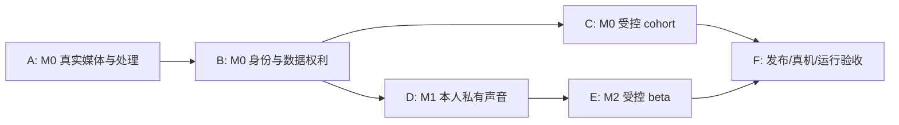

# DreamJourney V4 剩余生产功能闭环计划

日期：2026-08-06
状态：`A0_COMPLETE_A1_PROVIDER_CONFIGURATION_PENDING_A2_CODE_AND_ISOLATED_E2E_COMPLETE`
日常开发唯一入口：本文件
前置基线：`docs/superpowers/plans/2026-08-05-dreamjourney-v4-accelerated-functional-closure-plan.md` 已完成，作为非真机合同、默认关闭策略与证据基线，不再重复开发。

## 1. 目标与口径

本计划的目标不是继续增加 mock、QA-only 页面或静态检查，而是将已完成的 V4 合同层逐步接成可受控验证的真实功能，并始终保持：

1. M0 先形成可用的记忆资产闭环：真实身份进入、真实资料摄入、处理、Candidate 审核、MemoryVersion、带来源的私人问答、纠正、复制/导出/删除。
2. M1 仅在条件具备时开放在世成年人本人私有声音，不把家庭代录、未成年人、逝者声音或默认音色误当成复刻成功。
3. M2 仅在成年人身份、主动发布、独立公开副本、邀请访问、安全与法律 Gate 全部关闭后进入受控 beta；不先做公开入口或第四 Tab。
4. M3/M4 仍保持服务端拒绝和产品面关闭，不以“尽快完成”为理由提前实现高风险人格化、医疗协同或知识许可。

“代码完成”“已部署”“真实 Provider 通过”“真机通过”“可以公开发布”必须分开记录。任何一个 `mock`、`shadow`、`default-off`、单元测试或数据库 smoke 都不能单独写成已发布功能。

## 2. 当前工程基线

| 能力域 | 当前工程事实 | 本计划中的剩余工作 |
| --- | --- | --- |
| M0 Owner Truth、引导式访谈、双推荐、三 Tab UI、Context | 已有实现和统一非真机证据 | 不重做；后续仅回归受影响链路。 |
| Stage 2 私有媒体 | SourceObject、异步任务、处理状态、Candidate handoff、删除回执和 iOS 状态已完成合同/非真机验证 | 接入一个真实对象存储与首批真实处理器，完成受控 cohort 运行。 |
| 手机号登录/恢复 | OTP 抽象、synthetic adapter、fail-closed 和 smoke 已完成 | 选择并接入一个真实短信 Provider，完成限流、恢复和线上验收。 |
| 数据权利 | Owner fence、导出/删除状态、外部 effect receipt 与脱敏证据已完成 | 让对象存储、声音、数字人、通知和备份的真实执行结果写回 receipt。 |
| M1 本人私有声音 | 资格/同意/样本/训练/试听/接受/PCM audio-drive 合同与 QA 已完成，默认关闭 | 真实资格 Provider、真实训练/删除回执、真机听感与单一路径验收。 |
| M2 Publication / Visitor / 在世数字人 | 独立副本、ShareGrant、Visitor reader、撤回传播和 QA-only iOS 壳层已完成，默认关闭 | 先完成成年人和安全/法律 Gate，再做受控 beta 的正式 API 与产品入口。 |
| M3/M4 | 硬拒绝/默认关闭 | 不纳入本计划的功能实现。 |

当前提交基线：

- iOS：`feature/prd-stitch-ui-adaptation@e1048680`
- 后端：`main@f819c2e`
- 已部署后端：`f819c2e`，健康检查、Postgres readiness 与 A0 runtime capability smoke 已验证。
- 完整非真机证据：`docs/superpowers/status/2026-08-06-v4-unified-non-device-evidence-p3-s2.md`。

## 3. 执行原则

1. 每轮只推进一个 Work Item；先读本计划当前 Work Item、相关源码/测试、最近提交和工作区差异。
2. 每个 Work Item 独立提交。后端改动完成后，按该项 Gate 推送、部署和线上 smoke；没有真实 Provider 配置时，不把部署态 mock 当作外部验证。
3. 同一条共享写链路一次只由一个 Work Item 修改：Source/Candidate/Memory、授权/删除、VoiceProfile、Publication/ShareGrant 分别串行。
4. 新功能一律 server-side release policy/cohort 控制；iOS 只消费服务端能力，不持有供应商密钥，也不自行将 future feature 打开。
5. 新增 Provider 一律走 adapter、短期授权、用途/owner/vault 绑定、超时与可审计 receipt；禁止把长期 key、对象 URL、Provider 原始错误或隐私原文发到 iOS。
6. 未完成的真实动作必须显示为 `pending`、`partial`、`unsupported` 或明确失败，禁止静默降级为成功、默认音色或其他用户的数据。
7. 继续使用统一非真机 runner，但不得降低其 `releaseDecision=NO_GO` 的语义；只有真实 Gate 的证据才能改变相应阶段的发布结论。

## 4. 关键路径与并行边界

- A 与 B 的纯 adapter/合同实现可以并行，但不得同时改动同一 async-effect、receipt 或 account lifecycle 写模型。
- C 必须等待 A、B 的真实 Provider Gate。
- D 必须等待 B 的成年人/强身份能力与声音 Provider 的真实可用性；不以当前腾讯数字人或火山调试成功替代资格 Gate。
- E 必须等待 D 之外的成年人、法律/安全、算法/AI 标识和受控 cohort Gate；M2 不是 M0 的自然延伸。
- F 是验收阶段，不得提前拿截图或模拟器结果替代真实设备、Provider 或运维证据。

## 5. Phase A：M0 真实媒体闭环

### A0：Provider 能力注册与部署前校验

**目的**：先让运行时能明确回答“哪个真实能力可用、作用于什么数据、失败时如何处理”，而不是只靠环境变量猜测。

**工作项**

1. 审计并扩展现有 runtime capability/Provider adapter，不另起第二套配置中心。
2. 为每类能力统一返回脱敏字段：`enabled`、`providerKind`、`operation`、`dataClass`、`region`、`retentionPolicyVersion`、`fallbackMode`、`evidenceStatus`。
3. 服务启动时校验已启用的 Provider 必需配置；缺项必须 fail-closed，仅关闭对应能力，不能让 API 假装成功。
4. 将 capability 与 release policy/cohort 绑定，iOS 仅根据服务端返回决定是否展示受控入口。

**验收**：后端单测、配置矩阵 smoke、脱敏检查、部署 `/ready` 和 iOS typed client 静态/单测。
**完成定义**：无 Provider 时所有相关能力明确不可用；有 Provider 时可追踪其用途与 Gate，不泄露密钥。
**外部输入**：无，可先实施。

**执行状态（2026-08-07）**：`COMPLETE`

- 后端 `f819c2e`：新增启动期 Provider inventory，覆盖私有对象存储、媒体处理、OTP、声音复刻与数字人；每项能力独立 fail-closed，公开响应只返回脱敏元数据。
- iOS `e1048680`：新增 typed runtime consumer；媒体摄入入口必须同时满足服务端 capability、release policy 与完整合同，旧运行时响应保持保守关闭。
- 验证：后端 9 项 runtime 单测、配置脱敏检查、iOS typed smoke、完整 iOS Debug 模拟器构建、统一非真机发布回归，以及已部署 `/config/runtime` smoke 均通过。
- 部署证据：生产 API revision `f819c2e`；`scripts/run-backend-runtime-capability-deployed-smoke.sh` 已通过。详细字段与配置矩阵见后端 `docs/backend/2026-08-07-provider-runtime-capability-a0.md`。
- 下一项：`A1`。首发 Provider 已确定为腾讯 COS，代码已就绪；在 bucket、region、SSE/保留策略、最小权限服务端凭据和测试租户配置前，真实媒体入口保持关闭。

### A1：真实私有对象存储 Adapter

**目的**：使 M0 的照片、文档和音频不再停留在 mock/local-only 上传。

**工作项**

1. 只选择一个首发对象存储目标（腾讯 COS 或兼容 S3 的一个实现），不得同时接两个生产 Adapter。
2. 实现 server-signed upload/download intent，绑定 `ownerUserId`、`vaultId`、`sourceObjectId`、用途、MIME、大小、哈希、短时过期与一次性提交语义。
3. 上传完成后由后端 HEAD/metadata 复核大小、哈希和 MIME，再允许 SourceObject 进入 `uploaded`；不信任客户端“上传成功”声明。
4. 支持幂等重试、过期 intent、重复 callback、owner/vault 越权、文件替换和删除竞争；对象读取必须经服务端授权，不向 iOS 透露永久 URL 或 bucket key。
5. 对接现有删除/外部 effect receipt：删除先撤权，后执行存储删除；Provider 回执未知时维持 `pending/partial`。

**验收**：fake adapter 合同、MinIO/隔离环境 smoke、Postgres owner/vault 负向验证、部署 smoke、iOS upload state smoke。
**完成定义**：一份真实对象可从授权上传到可读取/可删除，错误、超时、重试和撤权均有真实状态。
**阻断输入**：首发 Provider 已确定为腾讯 COS；仍需实际 bucket/region、SSE/保留策略、最小权限服务端凭据与 closed-pilot 测试租户。

**执行状态（2026-08-08）**：`CODE_COMPLETE_PROVIDER_CONFIGURATION_PENDING`

- 首发 Provider 已收敛为腾讯 COS；保留 S3-compatible transport 仅作为实现与隔离测试机制，不会同时启用第二个生产存储。
- 后端已完成私有 COS Adapter 收敛：强制 HTTPS endpoint 和显式 SSE 配置、对象 `Content-Type`/SHA-256 metadata、写后 `HEAD` 校验、授权内容读取路由、撤权后拒绝读取，以及失败时不提交 `verified` 状态。
- 已新增 `scripts/backend-owner-truth-media-cos-provider-smoke.py`：部署容器内以无用户数据的随机 probe 验证 `PUT -> HEAD -> readback -> delete`。脚本默认不执行，必须显式设置 `RUN_BACKEND_OWNER_TRUTH_MEDIA_COS_PROVIDER_SMOKE=1`。
- 仍未达到真实 Provider 完成态：服务器尚无 COS bucket、region、HTTPS endpoint、最小权限 SecretId/SecretKey、SSE/保留策略和 closed-pilot 测试租户配置。未提供这些输入前，runtime 保持 fail-closed，不能将 A1 标记为已上线。

### A2：真实处理任务的最小可发布子集

**目的**：先让“上传后可产生可审核 Candidate”成立，而不是一开始承诺全部 OCR/ASR/视觉理解。

**首发范围**：文字、PDF、DOCX 的文本提取与来源切片；图片/音频只完成存储、基本元数据和明确的“待处理/不可用”状态；视频首版只存不理解。

**工作项**

1. 将现有 worker job family 接到真实对象读取与受限处理 sandbox，持久化 processor/version、输入对象版本、输出哈希、失败类别和 retry generation。
2. 对文本/PDF/DOCX 解析结果生成可追溯 Candidate，包含 Source 引用、片段位置、processor 版本与置信/失败说明；不得直接写入 MemoryVersion 或 Context。
3. 处理前后均重验 SourceObject 的 owner、删除/撤权状态和对象版本；处理失败、超时、格式不支持或恶意文件都进入可解释的失败/重试状态。
4. OCR、ASR、图像视觉分析使用独立 Provider port；在 Provider、数据协议和质量验证未完成前只返回 capability 不可用，不伪造人物/地点/场景线索。
5. 统一 iOS 上传、扫描、处理、Candidate ready、失败、重试的状态来源，不新增平行本地状态机。

**验收**：格式矩阵、损坏/伪装 MIME、超时、删除竞争、重复任务、跨 owner、Candidate 来源引用、iOS typed-state/UIQA、部署 Postgres smoke。
**完成定义**：受支持文档可真实完成 `Source -> Processing -> Candidate -> 人工确认`，且失败不污染 Context。
**阻断输入**：本地/容器 parser 可先实施；OCR/ASR/视觉 Provider 的真实启用需要供应商、数据处理边界和费用批准。

**执行状态（2026-08-08）**：`CODE_COMPLETE_ISOLATED_E2E_COMPLETE_A1_PROVIDER_CONFIGURATION_PENDING`

- 现有后端已具备本 Slice 所需的受控 Worker：它仅在同一 Vault/Owner、对象未撤权且存储版本仍有效时读取私有字节；`text/plain`、PDF、DOCX 由本地解析器产生私有 `import` Source，再由既有 Candidate Worker 创建待人工确认的 Candidate。任何步骤都不会直接写入 MemoryVersion 或 Echo Context。
- `media_source_object_processing_results` 已记录处理器标识/版本、处理代次、尝试次数、结果哈希、提取文本哈希、失败码与派生 Source 绑定；图片 OCR、音频 ASR 仍显式 default-off，视频保持 storage-only/notApplicable，均不伪造线索。
- 2026-08-08 已重新通过后端 Stage 2 Gate（172 tests）、部署容器 disposable Postgres smoke，以及 iOS Candidate handoff UIQA。部署 smoke 验证 Owner 绑定上传、跨 Owner 拒绝、文本处理、派生 Source、pending Candidate、人工确认后才创建 MemoryVersion、删除后从 Context 排除及响应脱敏。
- A2 的真实 COS 生产 E2E 仍等待 A1 的 bucket/region/HTTPS endpoint/最小权限凭据/SSE 与内容安全配置；该输入到位后只补真实对象存储读写的部署态验收，不重做本地解析或 Candidate 链路。
- 下一条不依赖 A1 的开发项：`B3`，M0 安全与退出最小运行闭环。

### A3：M0 受控 cohort 运行开关

**目的**：在不公开 future feature 的前提下，使已完成的真实媒体链路能够由极小 cohort 使用并可随时停用。

**工作项**

1. 将 worker/scheduler profile 按 job family 精确启用，保留 kill switch、drain、dead-letter/replay 和 backlog/readiness 指标。
2. release policy 仅允许服务端审批的测试账户/组织，客户端不能自行开启。
3. 给出一轮合成账户的端到端 runbook：上传、处理、Candidate、确认、Context、导出/删除及清理回执。
4. 将真实 Provider 失败、队列积压、对象删除失败和超预算作为自动降级/停用条件。

**验收**：部署态 Postgres、worker restart、重复 dispatch、受控账户与未授权账户对照、可审计 runbook。
**完成定义**：可安全启用和停用一个 M0 受控 cohort，未授权账户始终看不到入口。
**阻断输入**：运维批准、存储/处理 Provider 已经在 A1/A2 验证。

## 6. Phase B：M0 真实身份、恢复与数据权利

### B1：真实 OTP 与账号恢复

**工作项**

1. 在现有 OTP adapter 上接入一个真实短信 Provider；保留 synthetic adapter 仅供测试。
2. 固定 challenge、验证、重发、速率限制、尝试次数、重放防护、会话刷新、注销后 30 天恢复和一次恢复上限的服务端语义。
3. iOS 只实现 typed client、倒计时、失败/重试与隐私化反馈；不得持有短信密钥或根据客户端字段自行认定验证成功。
4. 记录脱敏审计和 delivery receipt，不把短信 API 受理当作用户已收到。

**验收**：fake Provider 完整契约、真实测试短信闭环、限流/重放/跨账号负向 smoke、恢复/超期回归、iOS smoke。
**完成定义**：真实手机号可以安全登录、刷新和按规则恢复；Provider 失败 fail-closed。
**阻断输入**：短信 Provider、签名/模板、地域、测试号码和服务器凭据。

### B2：真实导出、删除与外部 effect 对账

**工作项**

1. 扩展现有 provider-effect receipt：对象存储、声音 Provider、数字人 Provider、通知和备份逐个接入真实执行器，不一次性并接多家 Provider。
2. 导出生成可读包和机器可读 manifest，标记来源、状态、第三方裁剪、保留期与未完成删除项；不得导出密钥、对象直链、其他用户数据或 Provider 原始回执。
3. 账号删除/恢复/超期清理与 Source 删除统一走“先撤权、后 effect、后对账”；状态未知不得显示完成。
4. 增加对账任务、超时/人工处理队列和 evidence 包，支持重复触发但不重复执行外部副作用。

**验收**：每个已接 Provider 的 create/delete/retry/unknown receipt 测试、A/B owner、恢复期、异步重放、部署 smoke。
**完成定义**：M0 已启用的外部数据域均有可解释的删除/导出状态；未接 Provider 的域明确 `unsupported`。
**阻断输入**：各 Provider 删除 API、备份保留/恢复政策和外部回执可用性。

### B3：M0 安全与退出最小运行闭环

**工作项**

1. 审计既有 Echo/Context safety policy，补齐持续 AI 标识、确定性退出、敏感表达中性回退、错误/风险 evidence，不重写现有对话架构。
2. 确保撤权、删除、账号切换和安全状态均能阻断 Context、Voice/DH 和旧缓存复用。
3. 为 M0 受控 cohort 固定 incident/kill-switch runbook；不宣称 M2/M3 的危机干预已完成。

**验收**：安全语料静态/后端 smoke、账号切换、撤权、过期缓存、公开 M0 regression。
**完成定义**：M0 的私人文字问答在异常、退出和撤权时可预测地回落，不泄露前一账户/人物状态。
**阻断输入**：无；M2/M3 所需联系人、地区资源和演练另列为后续 Gate。

**执行状态（2026-08-08）**：`CODE_COMPLETE_NON_DEVICE_VERIFIED`

- 已补齐 Owner Truth 媒体恢复器的账号生命周期 fence：账号切换、退出、私有访问暂停和账号注销进入既有 `LM-08-owner-explicit-draft-stores` 前，会先使旧 Owner 的异步上传/状态刷新回调失效。旧回调即使稍后返回，也不能写入、完成或唤醒旧账号的本地任务。
- 这不是新增第二套清理流程。普通退出/切换仍保留 Owner-locked 草稿；仅账号注销才按既有契约清除 Owner Truth 任务 manifest、待上传字节和 Keychain 一次性上传凭据。
- 已将 `OwnerTruthMediaTasks/v1/<scopeDigest>` 与受 scope 绑定的 Keychain 上传凭据写入 Account Store Inventory；AppCoordinator 不再重复发布空 lease，`UserManager` 仍是同步 fence 的唯一入口，避免 teardown 顺序竞争。
- 验证：账号生命周期入口、module registry、lease runtime、私有媒体、账号删除 gates 以及新增的 iOS 媒体任务恢复 gate 全部通过。后者覆盖强杀/重启恢复、旧账号回调丢弃、上传/处理失败与重试、真实 HTTP 回调后的 lease 切换。公开发布态的 Release artifact、深链接负向、离线/过期/紧急 policy 模型与模拟器回归也已通过；本轮未重跑 deployed G2 命令 gate。
- 非声明：本项不替代真实 COS 读写、真实 closed-pilot 用户、真机权限或 M2/M3 风险演练；A1 的 Provider 配置仍是 A3 受控 cohort 前的外部前置。

## 7. Phase C：M1 在世成年人本人私有声音

### C0：M1 真实启用前 Gate 固化

**工作项**

1. 将成年人强身份/活体结果抽成受信 Provider receipt，现有客户端字段和 QA override 永远不能授权训练。
2. 明确首发声音 Provider 的训练、查询、试听、合成、删除和配额合同；服务端保管密钥并记录 provider log/correlation ID。
3. 当资格、同意、样本、profile、用途或 Provider 任一环未满足时，保持 M1 default-off，并返回明确不可用原因；不能静默使用腾讯默认音色或其他 profile。

**验收**：资格伪造、过期、跨账户、family/未成年人/逝者 hard deny、Provider 故障、旧 profile 回调和删除竞争测试。
**完成定义**：只有满足 V4 条件的本人可申请训练，所有绕过路径都在服务端拒绝。
**阻断输入**：成年人强身份/活体 Provider、声音 Provider 生产权限、数据处理/保留批准。

**执行状态（2026-08-08）**：`CODE_COMPLETE_NON_DEVICE_VERIFIED / DEFAULT_OFF`

- 后端新增独立的强身份/活体 Provider port。`/voice/profiles` 不再信任 iOS 的 `subjectEligibility`、同意版本或授权文案；只有服务端签发的样本授权回执与当前、同账号绑定的“在世成年人 + 活体”回执同时存在时，才会调用训练 Provider。
- 未配置身份/活体 Provider 时，训练返回明确的 `voice_identity_verification_unavailable`，不会因声音 Provider 已配置而开放；跨账号、family、未成年人、逝者、未知状态和活体失败均在 Provider 调用前 hard deny。
- `/config/runtime.voiceClone` 新增 `identityEligibilityProviderReady`、`trainingAdmissionEnabled` 及原因字段。iOS typed consumer 和旧 profile 投影均 fail-closed：缺少 `consent.source=serverReceipt` 的历史 profile 不会再被视为可用于 Echo。
- 后端 `538cdf5` 已部署到生产 Postgres API；C0 Gate、声音 lifecycle/sample/synthesis 回归、iOS runtime 静态检查和 Debug 模拟器构建均已通过。部署态 smoke 已确认 `/ready=200`，且未配置身份 Provider 时保持关闭。实现与部署说明见后端 `docs/backend/2026-08-08-voice-clone-c0-admission-gate.md`。
- 本项不关闭 M1 发布 Gate：仍需要经过审批的成年人强身份/活体 Provider、声音 Provider 生产权限与删除/保留规则、真实训练/试听/Echo/真机验收及独立发布批准。

### C1：真实训练、试听接受与删除回执

**工作项**

1. 接通真实样本上传、训练轮询、试听生成和用户显式 `accepted`；训练成功不能自动启用。
2. 将 provider slot、voiceProfile、sample version、授权语句 receipt、preview、accepted、暂停和删除严格绑定 owner/purpose/profile generation。
3. 实现真实 Provider 删除/停用执行器与异步 receipt 对账；Provider 不支持时如实标记 `unsupported/partial`。
4. iOS 只展示当前本人 profile 的脱敏状态和可解释失败/重试，不公开 Provider 细节。

**验收**：真实 sandbox/测试 profile、训练失败重试、预览未接受、接受后合成、删除重放/未知回执、部署 smoke。
**完成定义**：试听与 accepted profile 可被服务端确认，删除状态可追踪，不存在“页面可用但实际默认音色”的假阳性。
**阻断输入**：真实声音 Provider 训练/删除能力、可用 slot、测试身份和适用同意文本。

**执行状态（2026-08-08）**：`CODE_COMPLETE_NON_DEVICE_VERIFIED / DEFAULT_OFF`

- 已补独立的 revocation-first Provider 删除 worker：本地删除立即阻断合成；worker 只在显式环境开关启用后消费已接受的 outbox，且 Provider 完成、失败、未知与不支持都分别收敛，绝不把本地 tombstone 伪装成云端已删除。
- 当前火山训练/查询 Adapter 没有经评审的删除 API，明确回报 `unsupported/partial`，不会猜测 URL 或发出未受支持的删除请求。真实删除 Provider 接入前 worker 保持关闭。
- `run-voice-clone-c1-c2-non-device-gate.sh` 使用 fake Provider 覆盖完成、失败、未知、不支持、幂等、stale generation 和删除期间合成拒绝；不消耗真实样本或 slot。
- 未关闭项：真实成年人身份/活体、真实训练/试听接受、Provider 删除/对账、保留策略和真机听感仍为独立外部门。

### C2：Echo 使用本人 accepted profile 的单一路径

**工作项**

1. Echo 合成仅在服务端校验 accepted profile 后调用 `/voice/synthesis`，返回与 owner/profile/role/text hash/purpose 绑定的 PCM 或明确错误。
2. 腾讯数字人 audio-drive 与本地预览严格分离：Echo 只有一个 audio owner；本地播放器仅用于试听。
3. 运行 trace/evidence 包记录 `voiceProfileId`、`outputMode`、`audioOwner`、`providerLogId`、fallback reason；普通 UI 不显示调试字段。
4. 角色切换、停止、页面退出、后台恢复和 Provider 失败必须释放旧音频/旧 session，不能播放旧角色或默认声音。

**验收**：非真机 PCM/trace 组合 gate、角色/账户切换、取消/重试、Provider error、缓存过期测试；随后进入独立真机听感 Gate。
**完成定义**：有 accepted profile 时 Echo 必须使用该 profile；无 profile 或失败时明确回退，绝不冒充复刻成功。
**真机 Gate**：实际声音一致性、音频路由、打断、麦克风恢复和数字人配额必须在设备上验收。

**执行状态（2026-08-08）**：`CODE_COMPLETE_NON_DEVICE_VERIFIED / TRUE_DEVICE_PENDING`

- iOS 只接受与当前 owner、voiceProfile、角色、purpose、output mode 和 audio owner 全部绑定的 `tencentAudioDrive` PCM；格式或 binding 不匹配会进入明确失败，不会静默改用默认音色。
- C1/C2 组合 Gate 将严格 profile eligibility、删除撤权、PCM 格式和 Echo 路由静态合同与后端 fake-provider lifecycle smoke 合并，默认不纳入公开 MVP 回归。
- C2 runtime fault-injection Gate 额外在模拟器运行时注入 accepted profile 暂停、删除、过期、角色 generation 失效、账户 lease 切换、停止、Provider 超时、binding 不匹配和 PCM 格式错误；所有旧分片必须被丢弃，音频 owner 收敛为 `fallbackMuted`，且 trace 仅导出脱敏 profile/version/role/output/fallback 证据。
- 未关闭项：真实 accepted profile 的试听音色与 Echo 数字人音色一致性、真实 Provider 故障、音频路由、打断和麦克风恢复必须在真机单独验收。

## 8. Phase D：M2 成年授权 Publication / Visitor / 在世数字人

### D0：M2 真实开放前的产品、法律与安全 Gate

**必须先关闭，不能靠代码替代**：

1. 成年身份验证、直接关系/邀请资格和适用地域策略。
2. 在世主体主动发布、二次确认、撤回、投诉/异议、AI 标识与数据处理说明。
3. 持续人格化语音/数字人的安全评估、算法/备案要求、紧急联系人、时长提醒、确定性退出和危机演练。
4. 初始 closed-beta cohort、人工支持与 incident owner。

未关闭以上 Gate 时，所有 M2 API、页面、深链和缓存保持 QA-only/default-off，不能变成“公开 beta”。

### D1：正式闭测 API 与服务端 release policy

**工作项**

1. 保留现有内部 QA 路由用于回归；另建经 release policy/cohort 授权的正式闭测路由，禁止匿名、家庭自动授权和私人 Projection 回退。
2. Owner 只能从 active/confirmed MemoryVersion 生成脱敏、不可变的 PublicationVersion；ShareGrant 绑定 version、scope、TTL、usage limit、authority epoch 和受邀成年人。
3. 撤回、Source 修正、权利请求或风险状态先撤读，再异步执行索引/缓存/Voice/DH 清理并写 receipt。
4. Visitor 文本回答只使用 Public Projection，持续输出来源/不确定性/未知路径；不得调用私人 Echo、KBLite 或非公开 Context。

**验收**：跨账号/过期/撤回/并发/replay/Postgres smoke、公开路径探测、默认关闭 regression、真实闭测账户验收。
**完成定义**：受邀成年用户只能在有效 scope 内访问独立副本；撤回立即阻断新读取。
**阻断输入**：D0 Gate 全部关闭。

### D2：iOS M2 闭测产品面

**工作项**

1. 在“我的”内承载发布管理、脱敏预览、二次确认、授权状态和撤回；不新增第四 Tab。
2. 受邀 Visitor 通过受控入口进入只读阅读/问答；凭据只存内存，账户切换、过期或 scope 不一致立即清空。
3. Voice/DH 仅在同一 publication/grant scope、成年人 Gate 和 server capability 通过时显示；失败回退 M2 文字 Visitor，不回退私人 Echo。
4. UI 以当前 Stitch 的三 Tab 和全屏 Echo 为约束，只补状态与受控入口，不进行无关视觉重构。

**验收**：iOS XCTest/UIQA、默认关闭/深链/缓存隔离、受邀/未受邀 A/B、撤回传播 smoke、真实闭测验证。
**完成定义**：公开产品面与私人域严格隔离，未通过 Gate 的用户完全看不到 M2 能力。
**阻断输入**：D0、D1 已完成。

### D3：M2 Voice/DH 运行时与外部清理

**工作项**

1. 将数字人 session、声音合成、缓存、播放和 external cleanup 绑定 publication/grant/authority epoch/expiry，撤回或资格失效立即中止。
2. 强制单 audio owner、可预期停止/打断/恢复和 Provider 配额失败回退；不让前一角色/前一 session 残留。
3. 将真实 Provider 的清理、停用、缓存失效与未知状态写入现有 data-rights receipt，而不是仅清理 iOS 状态。

**验收**：后端 session/voice contract、撤回竞争、Provider effect/reconciliation、真机数字人/音频安全验收。
**完成定义**：任何授权变化都能阻断新的 M2 音频/数字人会话，并留下可解释回执。
**阻断输入**：D0 Gate、真实腾讯/声音 Provider 生产可用性与真机测试资源。

## 9. Phase E：统一上线准备与验收

### E1：真实 Provider 证据包

按 Provider 与功能域生成独立、脱敏证据包，不把 `.env`、凭据、原始媒体或私密正文纳入仓库：

| 域 | 必需证据 |
| --- | --- |
| 对象存储 | 上传/下载授权、哈希校验、删除回执、过期 URL、跨 owner 拒绝、保留策略。 |
| 媒体处理 | 受支持格式、失败/重试、来源引用、删除竞争、队列与 dead-letter。 |
| OTP | 真实短信、限流、重放、恢复、脱敏日志。 |
| Voice | 身份/同意、训练、试听接受、合成绑定、暂停/删除 receipt、无默认音色假降级。 |
| 数字人 | session 生命周期、配额、单 audio owner、停止/打断/恢复、撤回传播。 |
| 数据权利 | 导出 manifest、真实 provider effect、unknown/partial 对账、恢复/超期清理。 |

### E2：真机验收包

这不是当前代码阶段的替代品，而是各真实能力完成后的硬 Gate：

1. M0：登录、相册/文件选择、前后台、上传/处理/重试、Candidate、导出/删除。
2. M1：麦克风、授权/拒绝/恢复、训练样本质量、试听与 Echo 声音一致、停止/打断/音频路由。
3. M2：受邀访问、撤回即时性、数字人会话、音频/口型、AI 标识、退出与安全回退。
4. 每轮提交截图、脱敏日志、Echo evidence bundle、后端 correlation/provider log ID 和结论；失败项回到所属 Work Item，不通过截图口头关闭。

### E3：发布决策

发布清单按 M0/M1/M2 分别给出 `GO / NO_GO / LIMITED_COHORT`，不得使用一个总开关掩盖不同能力的 Gate：

1. M0 可在真实媒体、真实 OTP、数据权利和受控 cohort 完成后单独评估。
2. M1 必须在 M0 不回退的前提下，额外关闭身份、声音 Provider、删除和真机听感 Gate。
3. M2 必须额外关闭 D0 的法律/安全/成年人 Gate 和 D3 的运行时/真机 Gate。
4. M3/M4 继续 `NO_GO`，直到另行建立经产品、法律和运维批准的计划。

## 10. 当前执行顺序

| 顺序 | Work Item | 开始条件 | 结束条件 |
| --- | --- | --- | --- |
| 1 | `A0` Provider 能力注册与部署校验 | 无 | 已启用/未启用能力都能 fail-closed 且 iOS 可消费脱敏 capability。 |
| 2 | `A1` 单一对象存储 Adapter | 腾讯 COS 配置与测试租户 | 真实上传、授权读取、删除回执和 owner/vault 隔离通过。 |
| 3 | `A2` 文档处理最小子集 | A1 可用 | 文本/PDF/DOCX 可产出可审核 Candidate。 |
| 4 | `B1` 真实 OTP | 选定短信 Provider | 真实登录、限流、恢复和 fail-closed 通过。 |
| 5 | `B2` 导出/删除真实 effect | A1 与已启用外部 Provider | 真实 receipt/对账闭环通过。 |
| 6 | `B3` M0 安全/退出收敛 | 无，可与 B2 串行 | 撤权、退出、账户切换不泄露旧数据。 |
| 7 | `A3` M0 controlled cohort | A1、A2、B1、B3 | 服务端可精确启停且受控 E2E 通过。 |
| 8 | `C0-C2` M1 本人私有声音 | 成年人/声音 Provider 条件具备 | 真实 profile 与 Echo 单一路径、删除回执、真机验收完成。 |
| 9 | `D0-D3` M2 闭测 | M2 外部 Gate 明确关闭 | 闭测发布、Visitor、撤回与 Voice/DH 全链路通过。 |
| 10 | `E1-E3` 分层发布决策 | 对应阶段 Gate 完成 | 每层独立形成可审计 GO/NO_GO。 |

## 11. 需要产品/运维提供的最小输入

无需等这些输入才能开始 `A0`、`B3` 和既有回归，但以下内容是相应真实功能无法凭代码猜测出来的外部 Gate：

| Work Item | 需要确认/提供的内容 |
| --- | --- |
| A1 | 腾讯 COS 的地域、bucket、SSE/保留期、最小权限服务端凭据、closed-pilot 测试环境。 |
| A2 | 首发处理范围是否仅文字/PDF/DOCX；OCR/ASR/视觉 Provider 的数据边界、费用和启用顺序。 |
| B1 | 短信 Provider、签名/模板、地域、测试号码和额度。 |
| B2 | 备份保留/恢复/清理策略；每个已启用外部 Provider 的删除能力与回执规则。 |
| C0-C2 | 成年强身份/活体方案、声音 Provider 生产权限/slot、同意文本、保留与删除规则、可用测试主体。 |
| D0-D3 | 成年人验证、法律/隐私/安全评估结论、首批闭测 cohort、支持/投诉/危机处理 owner、腾讯/声音 Provider 的生产配额。 |

## 12. 明确不做的事项

1. 不重做现有 M0 Owner Truth、Context Packet、引导式访谈、三 Tab 或已对齐的 Stitch 视觉。
2. 不把现有 QA-only/default-off 壳层直接改成公开入口。
3. 不并行接多个真实对象存储、短信、OCR/ASR 或声音 Provider；每类首发只选一个，adapter 保留替换能力。
4. 不在 iOS 存放短信、对象存储、声音或数字人 Provider 的长期密钥。
5. 不将未分析的媒体、草稿、撤权对象、跨 vault 数据或失败分析结果注入 Echo Context。
6. 不启动 M3 老人健康/成人纪念人格互动或 M4 许可/收益功能。
7. 不以模拟器、截图、mock 音频或静态检查替代真实 Provider、真实数据处理、真机或法律 Gate。

## 13. 计划维护规则

1. 当前 Work Item 完成后，更新本文件的状态和执行顺序，并新增对应状态证据文档；不要维护平行的长期 ledger。
2. 外部输入尚未给出时，完成可独立实施的 adapter/contract 后将 Work Item 标记为 `WAITING_EXTERNAL_GATE`，自动进入下一条不依赖它的 Work Item。
3. 真实 Provider 接入、迁移、生产数据删除和 cohort 启用必须记录 deployment revision、环境、脱敏 evidence path 和 rollback/kill-switch。
4. 任何范围变化先更新本计划；若与 V4 产品定义冲突，以产品决策登记册为准并先暂停该具体 Work Item，而不是临时绕过 Gate。
