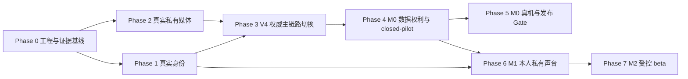

# DreamJourney V4 完整功能开发与生产闭环计划

日期：2026-08-09
状态：`READY_FOR_EXECUTION / EXTERNAL_CONFIGURATION_REQUIRED / RELEASE_NO_GO`
扫描基线：`docs/superpowers/status/2026-08-09-v4-full-engineering-gap-scan.md`
前置非真机计划：`docs/superpowers/plans/2026-08-08-dreamjourney-v4-non-device-functional-closure-plan.md` 已完成，不重复开发。

## 0. 目标

本计划负责将已完成的 V4 合同、状态机和默认关闭能力推进为真实可运行功能，优先完成：

1. M0 真实手机号身份、私人记忆摄入、处理、人工确认、MemoryVersion、私人 Echo Context、导出和删除闭环。
2. M1 在世成年人本人的私有声音复刻、人工接受和 Echo 使用闭环。
3. M2 Publication、Visitor 和在世数字人仅在成年人身份、法律、安全及 Provider Gate 全部通过后进入受控 beta。
4. 保持当前 Stitch 三 Tab 和全屏 Echo 设计，不新增第四 Tab，不提前开发 M3/M4。

本计划不再以“新增 mock、QA 壳层或合同字段”为主要产出。每个 Work Item 必须明确属于以下至少一种结果：

- 真实 Provider 接入并通过回执验证。
- 部署态 Worker/任务自动运行。
- 公开或 closed-pilot 主链路完成切换。
- 数据权利和安全边界形成真实闭环。
- 真机或发布 Gate 获得可复核证据。

## 1. 当前交接点

| 项目 | 当前事实 |
| --- | --- |
| iOS | `feature/prd-stitch-ui-adaptation@dfd55c82`，与远端一致 |
| 后端 | `main@8a61720`，与远端一致 |
| 数据库 | PostgreSQL，迁移 head `0085` |
| 自动测试 | iOS 296 项、后端 1973 项通过 |
| 非真机计划 | 26/26 Gate 通过，结论为 `NON_DEVICE_CODE_COMPLETE` |
| 线上服务 | API、PostgreSQL、Redis、ClamAV 运行正常 |
| 发布判断 | `NO_GO` |

当前真实阻断：

1. 真实 OTP Provider 未配置。
2. 腾讯 COS 未配置，Owner Truth 媒体采集关闭。
3. Owner Truth/async-effect/business message/publication Worker 未启动。
4. OCR、ASR、强身份/活体 Provider 未配置。
5. 普通 Echo 仍以旧 `/context/build` 为主；V4 Context 主要停在 shadow。
6. closed-pilot 没有实际入组账户，Ownership 仍为 shadow。
7. 腾讯数智人项目级参数存在，但短期 scoped session credential 合同未验证，按 V4 安全边界保持 blocked。

## 2. 状态定义

| 状态 | 含义 |
| --- | --- |
| `READY` | 前置输入齐全，可以直接开发或部署 |
| `CODE_COMPLETE` | 代码与自动测试完成，但不代表真实 Provider/发布通过 |
| `CONFIG_MISSING` | 代码入口存在，服务器缺实际配置或凭据 |
| `PROVIDER_REQUIRED` | 尚需选择/开通供应商或确认其真实能力 |
| `DEPLOYMENT_DISABLED` | 代码存在，但服务、Worker 或 release 开关未启用 |
| `DECISION_REQUIRED` | 需要产品、隐私、法律、安全或商业决策 |
| `TRUE_DEVICE_REQUIRED` | 剩余证据必须由真实 iPhone/通知/音频路由产生 |
| `OUT_OF_SCOPE` | 当前 V4 里程碑明确不开发或不公开 |

## 3. 执行规则

1. 每次只推进一个 Work Item 的代码闭环；外部配置准备可并行，不允许多个任务同时修改同一 Source/Candidate/Memory、认证或声音状态机。
2. 行为变化先增加测试、smoke 或静态 Gate，再实现。
3. 每项至少运行相关测试、`git diff --check`；iOS 变化运行 workspace XCTest 或 generic iPhoneOS build。
4. 后端变化独立提交、推送、部署，随后运行 `/ready`、迁移和该项 deployed smoke。
5. 配置缺失时标记 `WAITING_EXTERNAL_CONFIGURATION`，继续不依赖该配置的下一个 Work Item；禁止用 synthetic/mock 冒充生产完成。
6. Provider key 只写服务器私密 `.env`，不得写入仓库、iOS、截图、聊天、证据包或日志。
7. 功能入口只能由服务端 release policy/capability 决定。客户端 feature flag 不得授予真实权限。
8. 默认先 closed-pilot；必须具备 kill switch、回滚和未授权账户对照证据后才能扩大范围。
9. M1/M2 未过 Gate 时保持 default-off；不得回退成“默认音色/默认数字人”并展示为真实成功。
10. M3/M4 维持硬拒绝，不因开发进度压力提前开放。

## 4. 关键路径

可以并行：

- 产品/运维准备 OTP、COS、OCR/ASR、身份 Provider。
- iOS 修复 Swift 6 actor warning、更新证据矩阵和构建入口。
- 后端完成 Worker 部署模板、V2 主链路切换保护。

必须串行：

- OTP 真实验证完成后才能将 Ownership 切到 enforce。
- COS + ClamAV + Worker 完成后才能开放 V2 媒体采集。
- Source/Candidate/Memory 真实闭环后才能切换 Echo Context。
- 强身份/活体完成后才能允许真实声音训练。
- M0、M1 和法律安全 Gate 完成后才能推进 M2 beta。

## 5. 配置总表

### 5.1 M0 立即需要的配置

| 配置域 | 环境变量/资源 | 当前状态 | 需要提供或操作 |
| --- | --- | --- | --- |
| OTP adapter | `IDENTITY_CHALLENGE_ADAPTER` | `CONFIG_MISSING`，线上 disabled | 设为 `httpJson` |
| OTP 发送 | `IDENTITY_CHALLENGE_HTTP_JSON_URL` | `CONFIG_MISSING` | Provider HTTPS 发送地址 |
| OTP 状态 | `IDENTITY_CHALLENGE_HTTP_JSON_STATUS_URL` | `CONFIG_MISSING` | Provider 查询/回执地址；无该能力时必须标注 recovery unsupported |
| OTP 凭据 | `IDENTITY_CHALLENGE_HTTP_JSON_API_KEY` | `CONFIG_MISSING` | 服务器最小权限 key |
| OTP 参数 | TTL、max attempts、retry-after | 已有默认值 | 产品确认是否沿用 300 秒、5 次、30 秒 |
| COS 开关 | `OWNER_TRUTH_MEDIA_CAPTURE_ENABLED` | `DEPLOYMENT_DISABLED` | 真实 E2E 通过后才设为 `true` |
| COS provider | `OWNER_TRUTH_MEDIA_STORAGE_PROVIDER` | `CONFIG_MISSING`，当前 disabled | 腾讯 COS 首发配置为 `cos` |
| COS bucket | `OWNER_TRUTH_MEDIA_S3_BUCKET` | `CONFIG_MISSING` | 专用私有 bucket |
| COS region | `OWNER_TRUTH_MEDIA_S3_REGION` | `CONFIG_MISSING` | 与 bucket 一致的地域 |
| COS endpoint | `OWNER_TRUTH_MEDIA_S3_ENDPOINT_URL` | `CONFIG_MISSING` | HTTPS S3-compatible endpoint |
| COS 凭据 | `OWNER_TRUTH_MEDIA_S3_ACCESS_KEY_ID`、`OWNER_TRUTH_MEDIA_S3_SECRET_ACCESS_KEY` | `CONFIG_MISSING` | 仅允许指定私有前缀 PUT/HEAD/GET/DELETE |
| COS 加密 | `OWNER_TRUTH_MEDIA_S3_SERVER_SIDE_ENCRYPTION` | `CONFIG_MISSING` | `AES256` 或经批准的 `cos/kms` |
| COS KMS | `OWNER_TRUTH_MEDIA_S3_KMS_KEY_ID` | 条件缺失 | 仅 SSE-KMS 时填写 |
| COS 前缀 | `OWNER_TRUTH_MEDIA_S3_PREFIX` | 有默认值 | 确认生产前缀和测试前缀隔离 |
| ClamAV | `OWNER_TRUTH_MEDIA_CONTENT_SAFETY_PROVIDER`、`OWNER_TRUTH_MEDIA_CLAMAV_HOST/PORT` | 已配置并运行 | 保持 Docker 内网，不公开 3310 |
| 媒体 Worker | `OWNER_TRUTH_MEDIA_PROCESSING_WORKER_ENABLED` | `DEPLOYMENT_DISABLED` | COS E2E 后开启 |
| Async effect | `ASYNC_EFFECT_V1_ENABLED`、`ASYNC_EFFECT_WORKER_ENABLED` | `DEPLOYMENT_DISABLED` | 按 job family 灰度开启 |
| Candidate Worker | `OWNER_TRUTH_CANDIDATE_EXTRACTION_WORKER_ENABLED` | `DEPLOYMENT_DISABLED` | closed-pilot 开启 |
| Memory Worker | `OWNER_TRUTH_MEMORY_PROJECTION_WORKER_ENABLED` | `DEPLOYMENT_DISABLED` | Candidate Worker 稳定后开启 |
| Search Worker | `OWNER_TRUTH_MEMORY_SEARCH_PROJECTION_WORKER_ENABLED` | `DEPLOYMENT_DISABLED` | 非 M0 首发硬前置，可后开 |
| V4 Context | `OWNER_TRUTH_CONTEXT_AUTHORITY_CLOSED_PILOT_ENABLED` | `DEPLOYMENT_DISABLED` | shadow 对比通过后开启 |
| Pilot 账户 | `RELEASE_POLICY_CLOSED_PILOT_OWNER_IDS` | `CONFIG_MISSING` | 3–10 个测试账户的服务端 userId |
| Pilot 功能 | `RELEASE_POLICY_CLOSED_PILOT_FEATURES` | 当前未开放 V4 媒体能力 | 分阶段加入 `ownerMediaCaptureV1`、`ownerMediaProcessingV1` 等 |
| Ownership | `AUTH_OWNERSHIP_MODE` | 当前 `shadow` | OTP + shadow evidence 通过后改 `enforce` |
| 操作证据 | `OPERATIONS_EVIDENCE_HMAC_KEY` | `VERIFY_REQUIRED` | 确认服务器已有独立 32+ byte key；不得复用其他凭据 |

### 5.2 Stage 2 处理配置

| 配置域 | 环境变量 | 当前状态 | 备注 |
| --- | --- | --- | --- |
| 图片 OCR | `OWNER_TRUTH_MEDIA_IMAGE_OCR_PROVIDER` | `PROVIDER_REQUIRED`，当前 disabled | 首发 `httpJson` adapter |
| OCR URL/key | `OWNER_TRUTH_MEDIA_IMAGE_OCR_URL`、`OWNER_TRUTH_MEDIA_IMAGE_OCR_API_KEY` | `CONFIG_MISSING` | 仅在地域、保留、删除、费用通过后填写 |
| 音频 ASR | `OWNER_TRUTH_MEDIA_AUDIO_ASR_PROVIDER` | `PROVIDER_REQUIRED`，当前 disabled | 首发 `httpJson` adapter |
| ASR URL/key | `OWNER_TRUTH_MEDIA_AUDIO_ASR_URL`、`OWNER_TRUTH_MEDIA_AUDIO_ASR_API_KEY` | `CONFIG_MISSING` | 同上 |
| 超时/大小 | `OWNER_TRUTH_MEDIA_EXTERNAL_PROCESSOR_TIMEOUT_SECONDS`、`OWNER_TRUTH_MEDIA_EXTERNAL_PROCESSOR_MAX_PAYLOAD_BYTES` | 有默认值 | 需按 Provider 限额复核 |
| 视觉分析 | 当前 DeepSeek text-only | `PROVIDER_REQUIRED` | 不应只更换配置名；需明确支持视觉输入的 Provider |

### 5.3 M1 声音配置

| 配置域 | 环境变量/资源 | 当前状态 | 备注 |
| --- | --- | --- | --- |
| 强身份/活体 | `VOICE_IDENTITY_ELIGIBILITY_PROVIDER` | `PROVIDER_REQUIRED`，当前 disabled | OTP 不满足此 Gate |
| 身份 URL/key | `VOICE_IDENTITY_ELIGIBILITY_HTTP_JSON_URL`、`VOICE_IDENTITY_ELIGIBILITY_HTTP_JSON_API_KEY` | `CONFIG_MISSING` | 返回短期、可核验 receipt |
| 火山训练/查询 | `VOLCENGINE_VOICE_CLONE_API_KEY` 与训练/查询 URL | 已配置，Provider ready | 不需要重新发给 iOS |
| 试用/正式槽位 | `VOLCENGINE_VOICE_CLONE_SPEAKER_ID_MODE`、`VOLCENGINE_VOICE_CLONE_SPEAKER_IDS` | 已配置试用池 | 生产用户规模前必须扩容或购买正式资源 |
| 火山 TTS | `VOLCENGINE_VOICE_CLONE_TTS_API_KEY`、cluster、resource id | 已配置，合成 ready | 训练失败不得影响已 accepted profile 的真实合成判断 |
| Provider 删除 | 无可用真实删除能力 | `DECISION_REQUIRED` | 需要供应商 API/商务支持，或明确长期 partial 保留政策 |

### 5.4 M2 Publication / 数字人配置

| 配置域 | 当前状态 | 需要补齐 |
| --- | --- | --- |
| 腾讯项目参数 | 已配置 | 不需要再次在 iOS 配置或聊天发送 |
| 腾讯 scoped credential | `PROVIDER_REQUIRED` | 必须确认 scope、TTL、audience、revocation；项目级静态 key 不满足 V4 移动端 Gate |
| 腾讯资产/配额 | `VERIFY_REQUIRED` | 确认 virtualmanKey/projectId、并发、有效期和测试账户 |
| Publication 外部索引 | `PROVIDER_REQUIRED` | 选择存储/索引并定义撤回、过期和清理回执 |
| Visitor 身份 | `PROVIDER_REQUIRED` | 成年身份与邀请 session receipt |
| APNs | `PROVIDER_REQUIRED` | 当前后端没有完整 APNs Provider 配置合同；需先设计 server key、topic、environment 和 delivery receipt |
| 法律/安全 | `DECISION_REQUIRED` | 地域、分包商、跨境、保留、AI 标识、第三方材料、用户协议和成本止损线 |

所有 Secret、Token、AccessKey、手机号和测试音频均不得写入本计划或 Git。

## 6. Phase 0：工程与证据基线

### F0-01 更新当前实现证据矩阵

状态：`COMPLETE (2026-08-09)`

开发内容：

1. 将旧矩阵的 iOS `8a1922b`、后端 `4c0538b` 更新到当前提交。
2. 按公开、closed-pilot、QA、default-off、blocked 分类当前入口。
3. 对每项分别记录代码、部署、Provider、真机和发布证据。
4. 明确旧 `/archive/*` 与 V2 `/v2/vaults/*` 的实际调用关系。

Gate：矩阵可由脚本核对提交、迁移和 runtime capability；不得再用 Work Item 数量计算真实产品完成度。

完成证据：

- `docs/product/DreamJourney_V4_当前实现证据矩阵_V1.0.md` 已更新到 V1.5 当前工程基线。
- `product-v4-evidence-matrix-check.py` 已按当前阶段分类校验 36 条需求。
- `product-v4-current-evidence-baseline-check.py` 已固化提交、测试、runtime 和发布判断基线。
- `product-v4-docs-check.py`、证据矩阵检查、当前基线检查和 `git diff --check` 均通过。

### F0-02 iOS 构建与 Swift 6 前置修复

状态：`COMPLETE (2026-08-09)`

开发内容：

1. 修复 `AppCoordinator.swift:835` 的 `@MainActor` 丢失。
2. CI 统一使用 `DreamJourney.xcworkspace`。
3. 固化 workspace XCTest、generic iPhoneOS build 和 bundle/team guard。
4. 其他废弃 warning 仅按触碰模块逐步处理。

Gate：296 项 XCTest、generic build、Swift 6 actor warning 消失。

完成证据：

- `PrivateForegroundRefresh` 已显式保留 `@MainActor`，原 actor 丢失 warning 已从构建日志消失。
- `product-v4-ios-workspace-ci-contract-check.py` 已阻止 `xcodebuild -project` 回归，并核对 workspace、Bundle ID、Team 与 generic iPhoneOS 边界。
- `run-ios-test-foundation-gate.sh` 和 M0 非真机发布 Gate 已接入上述静态约束。
- Swift Package 7 项、workspace hosted XCTest 296 项、generic iPhoneOS Debug build 全部通过。
- 剩余构建 warning 来自 Pods/腾讯二进制头文件或系统 metadata 工具，不在本任务修改第三方源码。

### F0-03 部署账号与恢复 runbook

状态：`COMPLETE (2026-08-09)`

开发/运维内容：

1. 统一服务器仓库 owner、部署账号和 Git 拉取凭据。
2. 部署流程不得依赖 root 临时 key 或个人机器覆盖。
3. 固化数据库恢复演练、回滚和配置校验。
4. 为 `.env.backup*` 建立私密保留/隔离/销毁规则；不在未批准时直接删除。

Gate：同一部署账号可拉取、构建、迁移、重启、回滚；恢复演练有脱敏证据。

完成证据：

- 后端 `main@51c0267` 已建立权威部署/回滚/恢复 runbook 和 live preflight。
- SSH 统一从 `ubuntu` 发起，Git 固定使用 `miao` 服务账户，Docker/配置/备份保持受限 sudo 边界；root 不持有 Git 私钥。
- 42 份历史 `.env.backup*` 已迁入 root-only 隔离目录，权限收敛为目录 `0700`、文件 `0600`，未删除任何备份。
- 服务器 preflight、readiness、migration `0085/0085` 和连续两份当前 head 加密 backup Gate 通过。
- 现有恢复记录保持 `cutoverDecision=NO_GO`，明确阻止 receipt/root authority 未齐时自动切流；脱敏证据见后端 `docs/backend/2026-08-09-deployment-account-recovery-evidence.md`。

## 7. Phase 1：M0 真实身份与权限

### A1 真实 OTP Adapter

前置：短信供应商、签名、模板、地域、测试号码和服务器 key。
状态：`CONFIG_MISSING / PROVIDER_REQUIRED`

代码内容：

1. 将现有 `httpJson` port 接真实发送和可选状态回执。
2. 映射 accepted、delivered、undeliverable、unknown、timeout、rate-limited。
3. 不保存验证码原文，不将 Provider 原始响应返回 iOS。
4. 保留 challenge TTL、重发、最大尝试、重放拒绝和 refresh family 语义。
5. 真实 Provider 未启用时生产环境继续拒绝登录，不回退 synthetic。

验收：

- `scripts/run-backend-identity-challenge-provider-gate.sh`
- `scripts/run-backend-identity-challenge-provider-postgres-smoke.sh`
- `scripts/run-backend-identity-challenge-deployed-smoke.sh`
- iOS 登录/恢复模拟器 smoke
- 真实测试号码端到端

完成定义：真实手机号可注册、登录、刷新、退出和按规则恢复；错误不泄露号码是否存在。

### A2 账号恢复和注销生产验证

依赖：A1。

开发内容：

1. 复核 30 天 soft delete、`purgeAfter`、`restoreDeadline` 和 `restoreCount <= 1`。
2. 调度超期清理 Worker，并证明幂等与重启恢复。
3. 同手机号恢复时不复活已由外部 Provider 删除的媒体/声音/数字人资产。
4. iOS 明确显示恢复、超期和不可恢复状态。

完成定义：注销、恢复一次、第二次拒绝、超期清理和跨账号负向均通过。

### A3 Ownership shadow -> enforce

依赖：A1 的真实身份和部署 shadow evidence。
当前：route auth 已 enforce，191 路由已分类；ownership 仍 shadow。

开发内容：

1. 跑全路由 shadow 差异审计。
2. 修复仍信任 body/path `userId` 而非 token subject 的边界。
3. 对 Archive、Context、Family、Message、Export、Voice、Publication 运行 A/B Owner 负向矩阵。
4. 先对 closed-pilot 切换 `AUTH_OWNERSHIP_MODE=enforce`，再评估全局。
5. 保留 kill switch 和审计回退，不允许客户端选择 shadow/enforce。

完成定义：无未解释 shadow mismatch，所有跨账号请求稳定拒绝。

## 8. Phase 2：M0 真实私有媒体

### B1 腾讯 COS 私有对象闭环

前置：5.1 中全部 COS 配置。
状态：`CONFIG_MISSING`

代码/部署内容：

1. 使用现有唯一 COS/S3-compatible adapter，不新增第二生产 Adapter。
2. 上传 intent 绑定 owner、vault、source、MIME、大小、SHA-256、用途和 TTL。
3. API 代理或授权读写，不给 iOS 永久 URL、bucket key 或 Provider credential。
4. 上传后由服务器 HEAD/metadata 复核，再进入 uploaded/verified。
5. ClamAV clean 才允许提交；EICAR、离线、超时和签名库异常均 fail-closed。
6. 删除先撤权，再 DELETE，最后 HEAD 404 才写 completed receipt。

验收：

- `scripts/run-backend-owner-truth-media-provider-matrix-gate.sh`
- `scripts/run-backend-owner-truth-media-clamav-sidecar-smoke.sh`
- `RUN_BACKEND_OWNER_TRUTH_MEDIA_COS_PROVIDER_SMOKE=1 scripts/run-backend-owner-truth-media-cos-provider-smoke.sh`
- 跨 Owner、过期 intent、重复 callback、MIME/哈希不匹配、删除竞争

完成定义：一份真实对象完成 PUT、HEAD、readback、scan、授权读取、撤权和物理删除。

### B2 Worker 生产启用

依赖：B1。
状态：`DEPLOYMENT_DISABLED`

实施顺序：

1. 启动 `owner-truth-media-processing-worker`。
2. 启动 `owner-truth-candidate-extraction-worker`。
3. 启动 `owner-truth-memory-projection-worker`。
4. 按需启动 `owner-truth-memory-search-projection-worker`。
5. 启动媒体删除 Worker。
6. 最后按明确 job family 启用 async-effect scheduler/worker。

每一步必须验证：

- lease/heartbeat
- 幂等 dispatch
- 容器重启恢复
- retry generation
- backlog/dead-letter 阈值
- kill switch/drain
- readiness epoch 更新

完成定义：生产链路无需人工调用内部函数即可自动推进状态。

### B3 文本/PDF/DOCX 真实处理

依赖：B1、B2。

开发内容：

1. Worker 从经授权的 COS 对象读取字节。
2. 提取文本，保存 processor/version、input version、output hash 和来源片段。
3. 生成 pending Candidate，不直接写 MemoryVersion/Context。
4. 损坏文件、伪装 MIME、超时、删除竞争和重复任务必须可解释失败。
5. iOS 展示 scanning、processing、candidateReady、failed、retryable。

验收：

- `scripts/run-backend-owner-truth-media-processing-gate.sh`
- `scripts/run-backend-owner-truth-media-processing-postgres-smoke.sh`
- `scripts/run-backend-owner-truth-media-processing-deployed-smoke.sh`
- iOS Stage 2 UIQA

完成定义：真实文档完成 Source -> Processing -> Candidate -> 人工确认。

### B4 OCR/ASR 与视频边界

前置：OCR/ASR Provider 配置。
状态：`PROVIDER_REQUIRED`

开发内容：

1. OCR/ASR 只在用户上传 intent 明确允许外部处理时发送字节。
2. 请求不包含对象 URL、文件名、ownerId 或 vaultId。
3. 持久化 Provider/version、结果 hash、置信和失败类别。
4. Provider 未配置时明确 unavailable，不生成虚假结果。
5. 视频首版只存储、元数据和状态；不做语义理解。

完成定义：OCR/ASR 各自完成格式、超时、删除、重试和数据边界验收。

## 9. Phase 3：V4 Owner Truth 权威主链路

### C1 统一“封存新记忆”到 V2

依赖：A3、B1–B3。

开发内容：

1. closed-pilot 的文字、图片、文档、音频统一创建 V2 Source。
2. V4 cohort 内停止向旧 `/archive/items` 写入新权威数据。
3. 保留旧档案只读兼容，不进行不可逆批量迁移。
4. 本地任务、上传凭据和恢复状态继续按 owner/account lease 隔离。
5. capability 不可用时显示明确不可用，不静默回到旧写路径制造双权威。

完成定义：新数据只有一个 Source/Candidate/Memory 权威链路，旧记录仍可读。

### C2 旧档案迁移与 retirement

开发内容：

1. 建立 legacy record -> Source/Candidate 的迁移 manifest。
2. 首轮只迁移 closed-pilot 合成/测试账户。
3. 校验条目数、附件、owner、时间、摘要、删除状态和 Context 差异。
4. 可重跑但不得生成重复 MemoryVersion。
5. 迁移失败保留旧记录并输出可恢复证据。

完成定义：满足 parity 的旧路径才进入只读/retirement；不得一次性删除旧数据。

### C3 V4 Context 主路径切换

依赖：C1、C2。

配置：`OWNER_TRUTH_CONTEXT_AUTHORITY_CLOSED_PILOT_ENABLED=true`，仅对服务端 allowlist 生效。

开发内容：

1. closed-pilot Echo 使用 confirmed/current MemoryProjection 构建 Context。
2. 旧 `/context/build` 仅做短期 shadow 对比，不参与最终回答。
3. 草稿、失败处理、撤权、删除、跨 owner、未到 openAt 的内容全部过滤。
4. 保留 selected/filtered/ranking trace、citations 和 latency。
5. 纠正或删除后下一轮 Echo 必须立即使用新权威版本。
6. shadow 差异达到阈值后移除 V4 cohort 的旧 fallback。

验收：

- `scripts/run-backend-owner-truth-context-authority-gate.sh`
- iOS Context citation/compare/turn-shadow Gates
- Archive -> Candidate -> Memory -> Echo deployed E2E

完成定义：V4 cohort 的 Echo 只使用 V4 权威 Context，且可解释来源与过滤原因。

### C4 静态家庭贡献边界

开发内容：

1. 仅接受明确授权、已接受关系的静态 Source 贡献。
2. 家庭成员不获得 Vault 读取权，不自动获得 Persona/Voice/DH 权限。
3. pending/failed 邀请不可贡献。
4. Owner 审核确认后才形成 MemoryVersion。

完成定义：贡献者只能提交，不能读取 Owner 私人库；撤权后 Context 不再使用相关内容。

## 10. Phase 4：M0 数据权利、运行态与 closed-pilot

### D1 真实导出

依赖：B1、C1。

开发内容：

1. 将 COS 媒体字节纳入 ExportJob。
2. 生成用户可读包和 CopyExportManifest。
3. 明确 ready、partial、failed、expired 和 unsupported 模块。
4. 下载凭据短期、owner-scoped、一次性，不返回永久对象 URL。
5. iOS 分享完成后清理临时文件。

完成定义：同一 Owner 可以获得完整可读导出；其他用户、注销中和过期任务不能读取。

### D2 真实删除与外部 effect 对账

依赖：B1、B2、M1/M2 已实际启用的 Provider。

开发内容：

1. 对象存储、声音、数字人、通知和备份分别接真实执行器。
2. 访问撤销先于外部删除。
3. completed 必须有 Provider 完成回执或可证明不存在。
4. unknown/unsupported 保持 partial，进入 reconcile/dead-letter/人工处理。
5. 30 天恢复不能复活第三方已删除资产。

验收：`scripts/run-backend-data-rights-external-effect-receipts-postgres-smoke.sh` 加真实 Provider deployed probes。

### D3 closed-pilot admission

前置：A–D 的相关真实 Gate。

配置顺序：

1. 填写 `RELEASE_POLICY_CLOSED_PILOT_OWNER_IDS`。
2. 逐项加入 feature，不一次性全开。
3. 首先开启文字 Source/Candidate。
4. 再开启 media capture。
5. 再开启 processing。
6. 最后开启 V4 Context、导出和删除。

每一步验证授权与未授权账户、旧客户端、过期 policy、kill switch 和恢复 epoch。

完成定义：3–10 个 closed-pilot 账户形成 M0 完整闭环，未入组用户完全不受影响。

### D4 生产可观测与恢复

开发内容：

1. Worker backlog、dead-letter、Provider latency/error、ClamAV 签名和删除 partial 告警。
2. 一键 readiness 报告覆盖 OTP、COS、Worker、Context、Export/Delete。
3. 数据库定期恢复演练和 COS 对象删除审计。
4. kill switch 和回滚 runbook。

完成定义：故障可定位、可停用、可恢复，不依赖截图猜测。

## 11. Phase 5：M0 真机和发布 Gate

状态：`TRUE_DEVICE_REQUIRED`

验收清单：

1. 真实 OTP 注册、登录、重发、刷新、退出和恢复。
2. 相册、文件、麦克风权限允许/拒绝/重新授权。
3. 大文件、弱网、中断、App 前后台和强杀恢复。
4. Candidate 审核、更正、版本历史和 Echo 引用。
5. 导出分享、删除、30 天恢复和超期状态。
6. 日志/截图/证据包脱敏。

M0 发布完成定义：真实用户可安全完成 `身份 -> Source -> Processing -> Candidate -> Memory -> Context -> Export/Delete`，且无跨账号泄露。

## 12. Phase 6：M1 在世成年人本人私有声音

### E1 强身份/活体 receipt

前置：5.3 强身份配置。
状态：`PROVIDER_REQUIRED`

开发内容：

1. Provider receipt 绑定 owner、subject、adult/living/self、capability、TTL 和 generation。
2. 服务端验证签名/回执，iOS 不自行认定通过。
3. 未成年人、逝者、家人代录和过期 receipt 硬拒绝。

### E2 声音训练生命周期

依赖：E1。

开发内容：

1. 真实训练 -> polling -> previewReady -> 人工 accepted。
2. accepted 前禁止进入 Echo。
3. slot、providerSpeakerId、profileVersion 和样本版本保持后端绑定。
4. 旧回调、重复训练、暂停、删除和账号切换不能覆盖新 generation。
5. 删除能力仍 unsupported 时，UI 必须明确“已停止使用，第三方删除待处理/不支持”。

验收：C0/C1 lifecycle Gates + 真实火山测试账户回执。

### E3 Echo 复刻音色

依赖：E2 accepted profile。

开发内容：

1. 固定 `/voice/synthesis` + `outputMode=tencentAudioDrive`。
2. 校验 owner、voiceProfileId、profileVersion、role、purpose、textHash、audioOwner。
3. Provider 失败明确失败，不改用默认音色冒充成功。
4. 角色/账号切换、停止和旧 callback 必须被 generation token 丢弃。

真机 Gate：试听与 Echo 音色一致、有声、口型/音频同步、可打断、停止后恢复麦克风、无异常首尾音。

M1 发布完成定义：仅在世成年人本人、主动同意、人工接受的声音可以进入私人 Echo。

## 13. Phase 7：M2 Publication / Visitor / 在世数字人

状态：`DECISION_REQUIRED / PROVIDER_REQUIRED / DEFAULT_OFF`

### F1 PublicationVersion 与外部索引

1. 从私人 MemoryVersion 生成独立、脱敏、不可变 PublicationVersion。
2. 主动发布和二次确认；家庭关系不自动发布。
3. 外部索引写入、撤回、过期和清理均有 receipt。
4. 不允许第三方内容、未成年人或未知权利材料发布。

### F2 Visitor 与 ShareGrant

1. 邀请制 ShareGrant、成年 Visitor 身份、短期 session。
2. 未到期/未授权/已撤回/离线访问均拒绝。
3. 持续 AI 标识、确定退出、报告、两小时连续使用提醒和紧急联系人合同。
4. Visitor 只能读取 PublicationVersion，不能访问私人 Vault。

### F3 腾讯数智人 session broker

1. 先取得腾讯官方 scoped credential 能力证明。
2. 服务端签发短期 session credential；iOS 不保存项目级 appkey/accesstoken。
3. 实现 session lease、heartbeat、release、并发、重连和配额错误。
4. 数字人失败回落文字 Echo，不能播放上一角色声音。
5. 若 Provider 不支持安全 broker，选择 H5/服务端渲染替代路径或保持关闭。

### F4 M2 受控 beta

前置：Product、Privacy、Legal、Security、Operations 五方批准。

Gate：

- Publication/Visitor policy 由 `externalBlocked` 变为受控批准。
- 成年身份、内容安全、撤回传播、Provider cleanup、incident 演练通过。
- 真机长会话、数字人同步、弱网、并发和退出通过。

M2 完成定义：只对批准 cohort 开放；未批准账户仍保持当前 M0 三 Tab 产品面。

## 14. Phase 8：M3/M4 边界

状态：`OUT_OF_SCOPE`

保持服务端硬拒绝：

1. M3 长辈健康、医生/干预、危机协同、纪念互动。
2. M4 知识许可、市场、计费和第三方商业使用。
3. 逝者声音、逝者数字人、未成年人声音/数字人。
4. 家庭自动继承 Persona、Vault 或全部私人记忆。
5. 第四 Tab。

任何重新纳入都必须先更新 PRD、决策登记册、威胁模型和独立开发计划。

## 15. 推荐连续执行顺序

| Wave | 内容 | 代码工作量估算 | 外部依赖 |
| --- | --- | --- | --- |
| 0 | F0-01 至 F0-03 | 1–2 人日 | 部署账号确认 |
| 1 | A1、A2、A3 | 3–5 人日 | 短信 Provider/模板/测试号 |
| 2 | B1、B2、B3 | 5–8 人日 | COS bucket/凭据/SSE |
| 3 | B4 | 3–6 人日 | OCR/ASR Provider |
| 4 | C1 至 C4 | 5–8 人日 | Wave 1–3 真实 Gate |
| 5 | D1 至 D4 | 4–7 人日 | 外部删除/备份政策 |
| 6 | M0 真机/closed-pilot | 3–5 人日 + 修复 | iPhone、测试账户 |
| 7 | E1 至 E3 | 5–10 人日 | 强身份/活体、火山资源、真机 |
| 8 | F1 至 F4 | 单独估算 | 五方批准、腾讯/索引 Provider |

估算不包含供应商审批、采购、短信模板审核、法律评审和真实设备发现问题后的修复时间。

## 16. 每阶段统一 Gate

### G0：代码

- 单元测试/合同测试通过。
- `git diff --check` 通过。
- iOS 使用 workspace 构建。
- 无密钥、手机号、原文、PCM 或对象地址进入日志/证据。

### G1：部署

- 独立提交并推送。
- migration apply/verify。
- `/ready` 通过。
- capability 与配置状态符合预期。
- kill switch 可用。

### G2：真实 Provider

- 使用非真实用户测试数据。
- Provider receipt、重试、未知、删除和失败路径通过。
- Provider 受理不冒充完成。

### G3：真机

- 权限、前后台、网络、音频路由、通知和截图/日志通过。
- 真机结果与后端/Provider receipt 可关联。

### G4：发布

- 安全、隐私、产品、运维批准。
- closed-pilot 对照和回滚通过。
- 统一 release regression 通过。
- 默认关闭功能无误暴露。

## 17. 下一执行点

Phase 0 的 F0-01、F0-02、F0-03 已完成。代码主线下一顺序项为 **A1 真实 OTP Adapter**；当前仍为 `CONFIG_MISSING / PROVIDER_REQUIRED`，不得以 synthetic adapter 冒充生产完成。

外部准备同时启动：

1. 选择短信 Provider并准备签名、模板、测试号。
2. 创建腾讯 COS 专用私有 bucket、最小权限凭据、region 和 SSE 策略。
3. 选择 OCR/ASR Provider并确认数据处理边界。
4. 选择成年人强身份/活体 Provider。

外部参数到位顺序决定 A1、B1、B4、E1 何时从 `CONFIG_MISSING` 进入真实部署。缺失配置不阻断 F0、Worker 部署模板、V2 切换保护和证据更新，但对应能力不得标记完成或开放。
